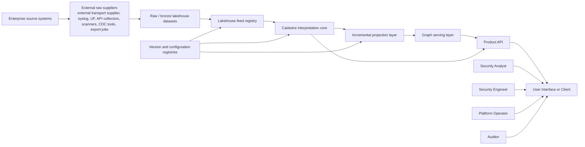
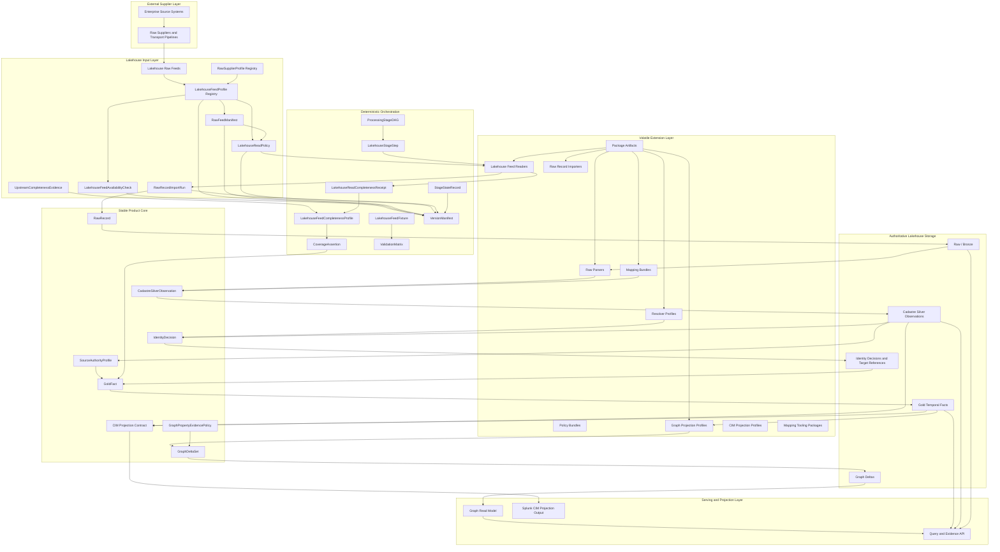
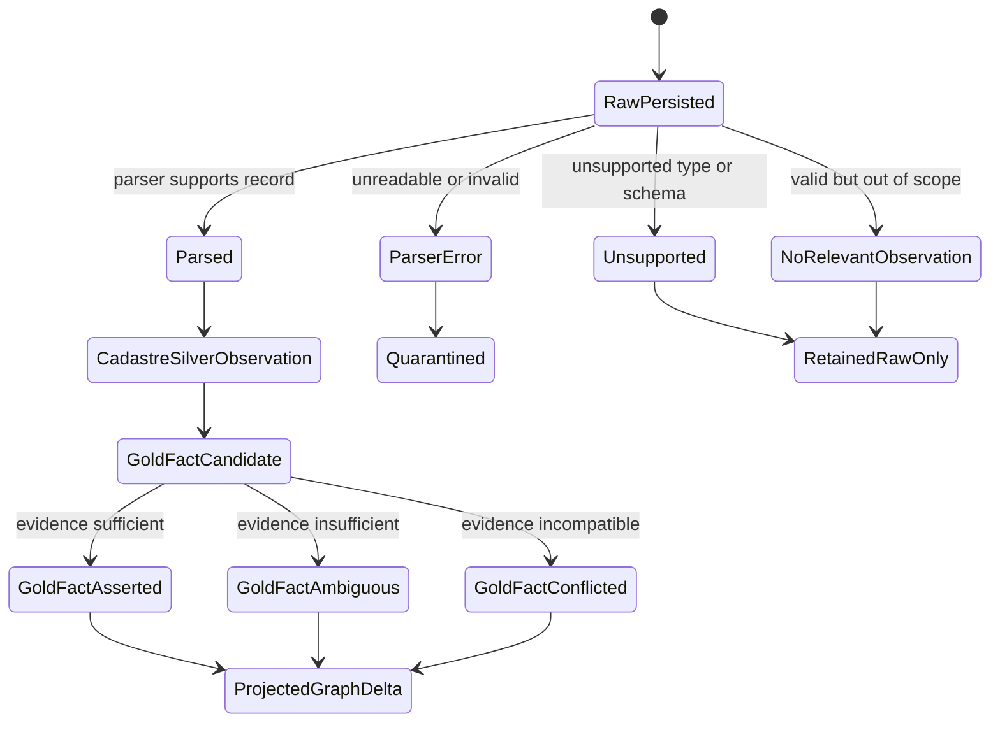
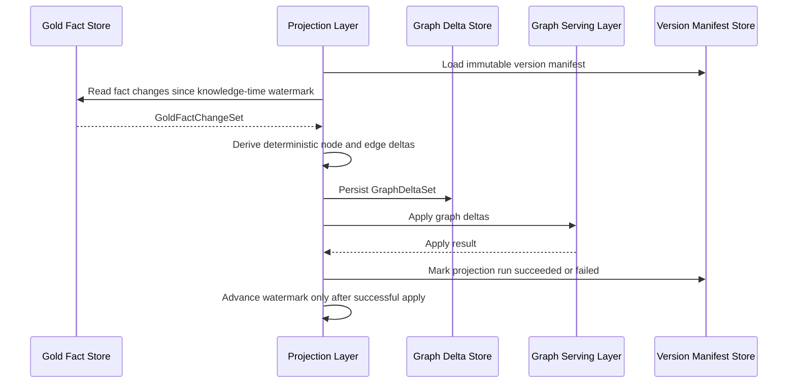
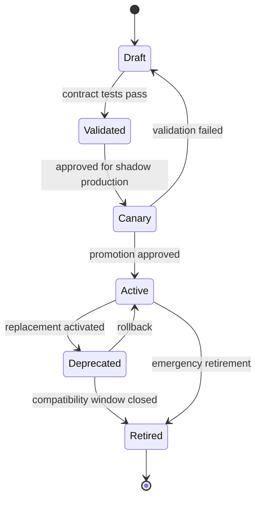

## 1. Product Summary

Cadastre must create and serve a graph-based asset intelligence model backed by a temporal lakehouse. It must fuse security, identity, endpoint, vulnerability, configuration, network, DNS, DHCP, IPAM, and related observations into canonical bitemporal asset and security facts, then project those facts into a query-optimized graph serving layer.

Cadastre is a lakehouse-fed interpretation, normalization, identity, fact, and projection system. Cadastre is not the enterprise source collector in the default product boundary.

Cadastre must not call configured enterprise source systems directly in production. Raw data collection, syslog forwarding, API polling, source export retrieval, enterprise source credential handling, source pagination, source rate limiting, source transport retry, and source-side CDC operation are external supplier responsibilities.

Cadastre may read only declared lakehouse feeds, table snapshots, dataset versions, object-store raw batches, feed manifests, and supplier-provided metadata. Cadastre may use source-native metadata contained in those feeds to parse records, preserve evidence, evaluate completeness, resolve identity, derive facts, and project graph or external outputs.

The product must normalize lakehouse-resident raw observations into Cadastre-owned silver observation envelopes with OCSF-aligned `normalized_fields`. The product may produce Splunk CIM-compatible output only through deterministic, versioned, lossy-aware projection profiles.

The product architecture is:

```text
Enterprise source systems
  -> external ingestion pipeline or raw supplier
  -> raw / bronze lakehouse datasets

Cadastre
  -> LakehouseFeedProfile
  -> RawFeedManifest
  -> LakehouseReadPolicy
  -> RawRecordImportRun
  -> RawRecord
  -> CadastreSilverObservation
  -> IdentityDecision
  -> GoldFact
  -> GraphDeltaSet
  -> graph serving layer
  -> optional CIM / OCSF / declared consumer projections
```

The lakehouse is the system of record. The graph, Splunk CIM output, OCSF export output, and other consumer outputs are replaceable projections. The projection layer is the deterministic contract between authoritative Cadastre records and graph-serving or external-consumer outputs.

Authoritative lakehouse reads and writes must be represented by table-format-native state references. Graph rebuild, graph lag, replay retention, feed replay, feed completeness, supplier metadata interpretation, and destructive table maintenance are product correctness concerns and must be governed by explicit Cadastre contracts rather than by lakehouse, catalog, graph-backend, lineage-system, supplier-pipeline, or object-storage defaults.

Default boundary rule:

```text
Cadastre consumes the lakehouse.
External suppliers supply the lakehouse.
Cadastre interprets, normalizes, resolves, derives, and projects.
Cadastre does not collect directly from enterprise sources.
```

## 2. Document Status

This Product Design Requirements document defines the product contract for a vendor-neutral, graph-based asset intelligence platform and serves as input to an NLSpec-driven implementation process.

This document follows `nlspec-spec.md` as the governing reference standard. NLSpec is a prescriptive, generative artifact that determines implementation and requires behavioral completeness, unambiguous interfaces, explicit defaults and boundaries, translation mapping tables, and testable acceptance criteria.

`CadastreSilverObservation` is the authoritative silver contract. Its `normalized_fields` member must align to a pinned OCSF schema profile unless the observation is explicitly declared `cadastre_only`. Splunk CIM is non-authoritative and may be used only as a projection target for declared Splunk-facing consumers.

Source-schema semantic overlays and Taxi-like tooling concepts are non-authoritative authoring aids. They may support source-schema annotation, mapping-bundle validation, and developer diagnostics, but must not replace Cadastre silver, gold, identity, omission, temporal, confidence, lineage, graph, or CIM contracts.

Cadastre must not adopt a direct-to-graph or graph-authoritative synchronization model.

Lifecycle-state-machine guidance is used only as a specification pattern. Cadastre adopts closed state and event vocabularies, deterministic transitions, artifact-derived state, idempotent actions, observability, parent-child boundaries, and conformance tests.

Lakehouse, metadata-platform, lineage, and workflow-artifact research is used only to strengthen Cadastre contracts. Cadastre must not treat table snapshot time as `GoldFact.valid_time` or `GoldFact.known_time`, OpenLineage-style facets as source evidence or completeness proof, dbt-style freshness artifacts as source completeness, metadata graphs or search indexes as canonical bitemporal facts, catalog branch names as production approval, or object-store commits as table-format snapshot proof unless a Cadastre contract explicitly permits that use.

Lakehouse-feed and ingestion-pattern research is used only to strengthen Cadastre lakehouse feed read/import contracts. External ingestion systems may inform `LakehouseStageStep`, `FeedStepPattern`, `StageStateRecord`, `LakehouseReadPolicy`, `LakehouseReadCompletenessReceipt`, `LakehouseFeedCompletenessProfile`, `LakehouseFeedFixture`, `ValidationMatrix`, `DiagnosticRecord`, and ingestion-provenance contracts, but they must not change the raw-first, lakehouse-authoritative boundary. Cadastre must not treat destination cleanup, live query results, source-exploration probes, acknowledgments, queue drain, processor success, FlowFile replay, provenance closure, CDC offsets, CDC log positions, CDC connector timestamps, CDC snapshot timestamps, schema-history timestamps, or CDC heartbeats as source authority, source completeness, canonical identity, Cadastre fact time, production evidence, cleanup permission, or graph mutation authority unless a Cadastre contract explicitly permits that use.

Normalization and schema-standards research is used only to strengthen Cadastre external schema governance, mapping validation, source-extension-field policy, analysis-rule metadata, threat-intel enrichment boundaries, lineage facet mapping, and registry governance. External normalization schemas, detection rules, threat-intel objects, indicators, sightings, lineage facets, metadata graphs, taxonomy labels, severity labels, confidence labels, status labels, and dataset names must not define Cadastre identity, source authority, source completeness, gold facts, graph edges, graph serving state, bitemporal semantics, or production approval unless a Cadastre contract explicitly maps the artifact to that authority class.

Identity-graph and attack-path research is used only to strengthen Cadastre graph edge semantics, pathfinding eligibility, graph-output eligibility, selector safety, collector visibility, derived-edge handling, source-kind deletion safety, analysis-output boundaries, risk-acceptance boundaries, and graph-query ergonomics. Cadastre must not treat BloodHound graph state, SharpHound collector output, OpenGraph endpoint matching, external graph traversability, attack-path severity, relationship findings, source-kind deletion, or risk acceptance as Cadastre identity, source authority, source completeness, gold facts, graph mutation authority, remediation, or risk-scoring authority unless a Cadastre contract explicitly maps that artifact to that authority class.

Identity resolution governance research is used only to strengthen Cadastre resolver determinism. Cadastre adopts first-class resolver profiles, typed identity evidence, source-scope coverage, hard-blocker precedence, lifecycle generation boundaries, deterministic review cases, activation scenarios, normative resolver explanations, and graph correction handoff records. Cadastre must not treat source-native merge history, probabilistic entity-resolution output, scanner correlation, directory names, cloud names, graph keys, semantic overlays, IP addresses, hostnames, DNS records, PTR records, flow identifiers, or feed-specific mapped targets as canonical identity authority unless an active `ResolverProfile` maps typed evidence to a permitted decision and no blocker or lifecycle boundary prevents the decision.

Theoretical-reachability and network-context research is used only to strengthen non-MVP reachability boundaries, result semantics, provider-analyzer handling, graph traversal non-implication, claim wording, coverage dimensions, capability-matrix requirements, and validation fixtures. Cadastre must not treat this research as activation of theoretical reachability, selection of a reachability solver, production compatibility proof for any analyzer, permission to emit modeled reachability facts, permission to emit `has_theoretical_reachability`, or permission to treat provider analyzer, source exploration probe, graph traversal, firewall allow, route presence, observed traffic, workload policy, or zero-trust policy output as Cadastre reachability truth unless a later accepted PRD or NLSpec activates the complete contract.

Temporal semantics, corrections, replay, and deterministic rebuild research is used only to strengthen Cadastre-owned contracts. Cadastre adopts first-class temporal semantics policies, persisted time-resolution rows, knowledge-time import policy, bitemporal query modes, authority-aware late-arrival routing, append-only gold correction change sets, replay equivalence preflight, deterministic side-effect records, projection watermark commit records, CDC replay state, graph delta idempotency keys, graph-apply resume semantics, graph rebuild equivalence, and event-sequence validation. Cadastre must not treat source event time, source observation time, known time, table time, connector time, CDC offset time, schema-history time, watermark time, graph apply time, replay time, or runtime side effects as interchangeable unless an explicit Cadastre policy row permits that exact use.

Graph-backend comparison research is used only to strengthen backend-neutral graph-serving contracts. It does not select Neo4j, Memgraph, JanusGraph, ArangoDB, or any other graph backend. Cadastre must preserve the lakehouse-as-system-of-record boundary and must evaluate graph backends only as replaceable read models and graph-delta apply targets governed by `GraphBackendProfile`, `GraphReadModelSchemaProfile`, `GraphApplyProfile`, `GraphQueryTranslationProfile`, `GraphBackendTaxonomyMappingProfile`, `GraphRebuildManifest`, `GraphIndexConsistencyCheck`, and `DerivedViewLagPolicy`.

Extension package supply-chain research is used only to strengthen package release, package-set activation, trust, repository metadata, provenance, SBOM, compatibility, promotion, rollback, quarantine, and emergency override contracts. `RES-013` does not select a package registry, signing system, SBOM format, SLSA level, deployment controller, runtime verifier, or package admission mechanism. Any supply-chain pattern transferred from external sources must be validated by Cadastre-owned package fixtures, activation gates, replay checks, and binary acceptance criteria before it can affect production activation.

### 2.1 Lakehouse-Fed Boundary Amendment

This PRD revises all default production input contracts to use lakehouse-resident feeds. Any remaining reference to a direct enterprise-feed read/import path is non-production unless the referenced contract explicitly states `source_exploration` or validation-only behavior.

#### 2.1.1 Direct-Source Terminology Translation

Research reports may use direct-source collection terminology when describing external systems. Production Cadastre terminology must translate those concepts into lakehouse-fed contracts before they become PRD requirements. The following mapping is normative for this PRD.

| Research term | Cadastre production term | Production boundary rule |
| --- | --- | --- |
| `SourceCompletenessReceipt` | `LakehouseReadCompletenessReceipt` plus `UpstreamCompletenessEvidence` | Cadastre proves feed-read completeness and imports upstream completeness evidence. It must not call source systems to establish completeness in production. |
| `SourceCompletenessEvidenceRow` | `UpstreamCompletenessEvidence` plus `ProgressSignalInterpretationPolicy` | Supplier evidence must carry an explicit `authority_limit`; progress signals are diagnostic-only unless an active policy row grants a narrower effect. |
| `SourceCompletenessProfile` | `LakehouseFeedCompletenessProfile` | Source-level completeness decisions must derive from feed-read state plus supplier-provided upstream evidence. |
| `CollectionMethodVisibilityProfile` | `SupplierCollectionVisibilityProfile` | Visibility, volatility, permission, cache, and upstream collection limitations are supplier-reported or feed-manifested. |
| `SourceCallPolicy` progress evidence | Feed metadata, supplier metadata, `StageStateRecord`, and validation-only `SourceExplorationResult` | Production cursor, delta, CDC, queue, ack, and progress semantics may be represented only when present in lakehouse feed metadata or supplier evidence. |

When this PRD uses source authority, source completeness, source staleness, source history, source coverage, or source absence terms, the production input must be lakehouse-resident feed data, feed manifests, supplier metadata, table-state refs, or upstream completeness evidence. Direct enterprise source calls remain forbidden unless the section explicitly declares validation-only `source_exploration`.

The public PRD must define vendor-neutral feed contracts. Concrete enterprise source systems, vendor names, private routes, product-specific route identifiers, feed-specific credentials, and environment-specific source inventories must not appear in the public canonical model. A private implementation repository may bind concrete upstream source systems and raw supplier routes to the public feed contracts.

| Public contract | Required purpose |
| --- | --- |
| `RawSupplierProfile` | Defines the external pipeline, team, or supplier class that delivers a raw feed into the lakehouse. |
| `LakehouseFeedProfile` | Defines one lakehouse-resident raw input feed Cadastre may read. |
| `LakehouseFeedProfileSchema` | Defines required feed profile fields, defaults, allowed read targets, schema refs, object refs, partition refs, and redacted profile checksums. |
| `LakehouseFeedAvailabilityCheck` | Validates catalog, table, object-store, manifest, partition, and schema availability without calling enterprise source systems. |
| `RawFeedManifest` | Defines per-batch or per-snapshot feed identity, counts, byte totals, hashes, time bounds, schema refs, supplier lineage, and completeness-evidence refs. |
| `LakehouseReadPolicy` | Governs reading table snapshots, dataset versions, object batches, manifest lists, partitions, and object prefixes. |
| `RawRecordImportRun` | Defines deterministic import from lakehouse raw feed rows or objects into Cadastre `RawRecord` rows. |
| `LakehouseReadCompletenessReceipt` | Records whether Cadastre read the declared feed snapshot, manifest, partition set, or object set completely. |
| `UpstreamCompletenessEvidence` | Records supplier-provided evidence about upstream source collection, source export, permission scope, partiality, or failure. |
| `LakehouseFeedCompletenessProfile` | Maps feed-read completeness and supplier-provided upstream evidence into `SourceCompletenessDecision` outcomes. |
| `LakehouseFeedFixture` | Defines redacted, replayable feed rows, feed objects, feed manifests, and supplier metadata for validation. |
| `LakehouseFeedFeasibilityAssessment` | Defines activation evidence that a feed is available, parseable, metadata-sufficient, timestamp-sufficient, identifier-sufficient, schema-stable, replayable, fixture-covered, completeness-evaluable, and mapping-ready. |

| Private artifact | Permitted location | Meaning |
| --- | --- | --- |
| `PrivateSourceFeedBinding` | Private implementation repository | Maps a concrete vendor, product, source system, or route to a vendor-neutral `source_category` and one or more `LakehouseFeedProfile` records. |
| `PrivateFeedSchemaInventory` | Private implementation repository | Records observed source-native fields, source schema variants, malformed cases, feed-specific parser needs, and private sample payload metadata. |
| `PrivateCompletenessEvidenceInventory` | Private implementation repository | Records whether the upstream supplier can provide export manifests, collection window evidence, scope enumeration, row counts, permission limits, or only best-effort presence. |
| `PrivateGoldenCorpus` | Private implementation repository | Stores redacted representative lakehouse feed rows or objects. It must not be modeled as direct enterprise source API recordings in the public PRD. |

The following are normative contracts:

| Contract | Required purpose |
| --- | --- |
| `LakehouseFeedProfile` | Defines a vendor-neutral lakehouse-resident raw input feed, feed scopes, read target refs, supplier binding, package bindings, validation state, and replay-relevant configuration hashes. |
| `LakehouseFeedProfileSchema` | Defines required, optional, scope-key, manifest, schema-ref, supplier-metadata, lakehouse access-ref, default, and redacted-hash behavior for feed profile configuration. |
| `LakehouseFeedAvailabilityCheck` | Defines lakehouse catalog, table, object, partition, manifest, and schema availability evidence and forbids enterprise source calls and observation-producing side effects. |
| `LakehouseFeedFeasibilityAssessment` | Defines feed activation readiness across feed availability, payload fidelity, metadata sufficiency, timestamp sufficiency, identifier sufficiency, schema stability, replayability, fixture coverage, completeness evidence, and parser/mapping readiness. |
| `ProcessingStageDAG` | Defines deterministic feed read, raw import, parse, map, resolve, derive, project, dependency, partial-input, failure-isolation, output-permission, and declared-subset execution semantics. |
| `DeclaredDAGSubsetProfile` | Defines when a production stage subset may execute and which outputs, cleanup actions, absence assertions, projections, and watermarks are forbidden or allowed. |
| `LakehouseStageStep` and `FeedStepPattern` | Define deterministic package-authoring patterns for lakehouse feed reads, raw imports, manifest validation, parser inputs, and validation-only source exploration. |
| `PackageStageBinding` | Defines which package types and package versions may execute in which `ProcessingStageDAG` stages and what outputs they may emit. |
| `PackageDeveloperContract` | Defines package-internal feed reader, raw importer, parser, mapping, resolver, derivation, projection, state, output-permission, and validation-artifact boundaries. |
| `StageStateRecord` | Defines hashable, replayable, stage-scoped execution state when state can affect output. |
| `LifecycleStatus` | Defines the shared lifecycle status vocabulary and production behavior for packages, profiles, policies, lifecycle machines, validation artifacts, toolchain artifacts, and activation-controlled records. |
| `LifecycleStateMachineDefinition` | Defines closed lifecycle states, events, transition rules, lifecycle authority references, artifact-derived state, illegal-transition handling, observability, parent/child composition, and conformance tests for lifecycles that affect production output, replay, watermarks, graph serving state, package activation, health, or CI gating. |
| `ProcessingStageLifecycleResult` | Defines the typed per-stage execution result emitted by `ExecuteProcessingStageDAG`, including lifecycle machine identity, terminal state, transition evidence, output references, errors, watermark decisions, and failure-isolation behavior. |
| `RunLockSet` | Defines deterministic source, completeness, coverage, and projection lock keys that prevent unsafe concurrent production runs. |
| `LakehouseReadPolicy` | Defines lakehouse table, dataset version, object batch, partition, manifest, schema, retry, timeout, checksum, pushdown, failed-object, omitted-object, and replay behavior. |
| `LakehouseFeedCompletenessProfile` | Defines which source datasets and scopes may assert absence, retraction, cleanup, or watermark advancement. |
| `SupplierCollectionVisibilityProfile` | Defines supplier-reported method-specific visibility, volatility, permission, cache, expected-count, failed-member, and absence behavior for upstream collection methods represented in a lakehouse feed or feed manifest. |
| `LakehouseReadCompletenessReceipt` | Defines proof that Cadastre read a declared lakehouse feed scope completely. It is necessary but not sufficient for source-level absence, retraction, cleanup, or watermark advancement. |
| `UpstreamCompletenessEvidence` | Defines authority-limited receipt evidence so delivery, lineage, liveness, probe, and diagnostic signals cannot become absence, retraction, cleanup, or watermark authority by default. |
| `CoverageDimensionProfile` | Defines required coverage dimensions, allowed dimension states, staleness rules, permission behavior, and missing-dimension behavior for coverage-sensitive domains. |
| `CoverageAssertion` | Defines source-backed scan, inventory, control, directory, or network coverage before coverage-dependent facts or absences may be emitted. |
| `SourceAuthorityProfile` | Defines executable source authority arbitration for each gold fact type and predicate. |
| `SourceAuthorityProfileRow` | Defines row-granular authority by fact type, predicate, source category, source dataset, source instance override, subject scope, object scope, staleness, coverage, and absence authority. |
| `SourceStalenessPolicy` | Defines source/fact-specific time basis precedence, required time inputs, expiry effects, and missing-input behavior before source stale state can affect output. |
| `ProgressSignalInterpretationPolicy` | Defines one policy row per progress, liveness, lineage, freshness, ack, CDC, graph, source-history, destination-cleanup, or live-probe signal that can affect production interpretation. |
| `ControlResultMappingRow` | Defines deterministic result-state mapping for OVAL, XCCDF, and similar control vocabularies before control pass, fail, unknown, error, not-checked, or not-applicable outputs may be emitted. |
| `SourceHistoryRetentionProfile` | Defines source-native history windows and outside-window behavior without treating source history as Cadastre replay retention. |
| `AbsenceDerivationPolicy` and `AbsenceDerivationResult` | Define the only production path from missing, stale, permission-limited, unsupported, partial, or not-observed source states into fact-level absence outcomes. |
| `UnresolvedTargetReference` | Represents mapped-target-style relationship hints without creating or merging canonical entities. |
| `TargetSelectorSafetyPolicy` | Defines selector-specific maximum resolution states and evidence requirements for unresolved target references. |
| `ResolverProfile` | Defines the sole production authority for identity resolution behavior, including source-scope coverage, evidence classes, candidate generation, hard blockers, lifecycle boundaries, decision matrix rows, confidence bands, review routing, split policy, activation requirements, explanations, and checksum behavior. |
| `IdentifierEvidenceClass` | Defines the closed registry of evidence classes, default evidence roles, durability classes, reuse risks, required source-scope keys, and auto-merge authority for identity evidence. |
| `IdentifierScope` | Defines canonical source-scope objects, required scope keys, hash canonicalization, profile coverage matching, and uncovered-scope behavior for identity evidence. |
| `IdentityEvidenceItem` | Defines typed identity evidence rows with evidence class, role, source scope, valid and known time, durability, reuse risk, source quality, contribution, blockers, and evidence references. |
| `CandidateGenerationProfile` | Defines resolver candidate blocking keys, allowed heuristics, prohibited selectors, deterministic pair ordering, candidate caps, overflow behavior, and learned-artifact policy. |
| `AssetGenerationBoundary` | Defines lifecycle and generation boundaries such as reimage, clone, VDI reuse, agent reinstall, source rekey, delete/recreate, hostname reuse, IP reuse, directory reenrollment, Kubernetes recreate, cloud recreate, and scanner correlation change. |
| `IdentityReviewCase` | Defines deterministic review-case states, reviewer authority, evidence snapshot checksums, allowed transitions, expiration, terminal decision outputs, and illegal-transition behavior. |
| `ResolverActivationReport` | Defines scenario-gated resolver profile activation, including required scenario outputs, shadow run evidence, canary evidence, determinism status, blocker coverage, and promotion eligibility. |
| `ResolverShadowRun` | Defines non-mutating resolver comparison output used for validation, shadow execution, canary execution, and activation gating. |
| `ResolverExplanation` | Defines one structured normative explanation for every `IdentityDecision`, including confidence inputs, blocker rows, decision row, review routing, split policy, evidence refs, and checksum behavior. |
| `GraphCorrectionHandoff` | Defines the mandatory identity-split-to-graph-projection handoff that links split decisions to affected gold corrections and required graph retractions or expirations without letting the resolver mutate graph state directly. |
| `GraphProjectionProfile` | Maps gold facts and declared synthetic structural rules to typed graph nodes, typed graph edges, typed graph properties, expiry scopes, and no-op outcomes. |
| `GraphBackendProfile` | Defines graph backend, driver, dialect, topology, storage mode, license or edition, feature availability, adapter interface, raw-write bypass policy, and activation checksum for graph serving. |
| `GraphBackendPreflightResult` | Defines fail-closed backend, driver, feature, topology, storage, schema, and query-translation readiness evidence before graph query or graph mutation. |
| `BackendSchemaFingerprint` | Defines deterministic backend schema inventory rows and checksums used by graph apply, graph query, rebuild, replay, and drift checks. |
| `GraphBackendTaxonomyMappingProfile` | Defines backend-specific labels, relationship types, edge labels, collections, properties, reserved fields, and selector mappings for active Cadastre graph objects. |
| `GraphQueryTranslationProfile` | Defines backend query translation for neighbor expansion, path search, filters, pagination, timeouts, authorization, redaction, and backend candidate limits. |
| `GraphObjectOutputEligibilityRow` | Defines whether a graph node, edge, property, or synthetic object may participate in search, neighbor expansion, pathfinding, analysis findings, metrics, or identity influence. |
| `SourceProjectionDeletionPolicyRow` | Defines source-kind, cross-source-reference, built-in-node-reference, and authoritative-record deletion safety for graph projection cleanup. |
| `GraphReadModelSchemaProfile` | Defines required graph read-model constraints, indexes, selector indexes, evidence lookup indexes, schema preflight behavior, and backend schema fingerprinting. |
| `GraphApplyProfile` | Defines graph-delta apply ordering, batching, retry, transaction-boundary, schema-readiness, missing-schema, partial-apply, and idempotent-reapply behavior. |
| `GraphApplyResult` | Defines the persisted result of applying a validated `GraphDeltaSet` to the graph serving backend. |
| `GraphEdgeSemantics` | Defines closed edge-type semantics, source facts, direction, evidence, temporal policy, confidence policy, and non-implication rules. |
| `DerivedGraphEdgeRule` | Defines when backend-generated, query-generated, post-processed, or generated path edges may emit gold facts, analysis-only results, or no output. |
| `GraphTaxonomyTranslationPolicy` | Defines allowed and forbidden uses of external graph taxonomy labels, keys, lifecycle timestamps, and metadata. |
| `StructuralGlobalNode` | Defines bounded semantics for any future global structural graph node; default MVP behavior emits none. |
| `StructuralGlobalNodeAliasPolicy` | Defines default rejection and activation requirements for structural aliases such as `Internet`, `Everyone`, and wildcard-like global nodes. |
| `PackageArtifact` | Separates package acquisition and materialization from production activation and runtime execution. |
| `PackageReleaseManifest` | Defines one immutable package release and every supply-chain evidence reference required before inclusion in a production package set. |
| `ProductionPackageSetManifest` | Defines the only production activation target for packages that can affect validation, production output, rollback, replay, graph apply, visibility, or health gating. |
| `PackageCohesionGroup` | Defines packages that must promote, activate, rollback, quarantine, and retire together. |
| `PackageTrustPolicy` | Defines trust roots, authorized signers, threshold rules, repository scopes, transparency requirements, and attestation authorities for package verification. |
| `PackageRepositoryMetadata`, `PackageRepositorySnapshot`, `PackageRepositoryFreshnessProof`, and `PackageRepositoryAntiRollbackState` | Define repository metadata coherence, freshness, timestamp, freeze, mix-and-match, and rollback protection evidence for repository-backed packages. |
| `PackageSignatureVerificationResult` | Defines structured signature and trust verification evidence. Scalar package signature summaries must not authorize activation. |
| `PackageAttestationSet`, `PackageBuildProvenance`, and `PackageSBOMRef` | Define subject-matched release evidence for provenance, builder/material policy, SBOM inventory, license policy, vulnerability policy, and dependency-graph policy. |
| `PackageCompatibilityMatrix` | Defines package-type-specific compatibility across public API, runtime protocol, dependency lock, validation output, schema, graph, trust, attestation, SBOM, and deployment targets. |
| `PackagePromotionRecord` and `PackageActivationFailureEvent` | Define deterministic promotion, package-set activation, failure precedence, abort evidence, and keep-current behavior. |
| `PackageDeploymentRevision`, `LastKnownGoodPackageSet`, `PackageRollbackPlan`, and `PackageRollbackResult` | Define environment-visible package deployment history, last-known-good state, immutable rollback targets, rollback preflight, and rollback result evidence. |
| `PackageQuarantineRecord` and `EmergencyPackageOverrideRecord` | Define immutable quarantine and bounded emergency actions; emergency override must not bypass signature or trust verification for a new production activation. |
| `GraphPropertyEvidencePolicy` | Defines graph property provenance, raw-derived redaction, and secret-scanning requirements. |
| `ThreatIntelEnrichmentProfile` | Defines the non-authoritative threat-intel enrichment boundary, including permitted formats, indicator normalization, sighting semantics, visibility policy, and output restrictions. |
| `ThreatIntelEnrichmentRecord` | Defines an enrichment-only record for indicators, sightings, taxonomies, galaxies, object templates, confidence labels, and distribution controls. |
| `ThreatIntelDistributionMappingPolicy` | Defines how external distribution, sharing-group, and TLP-like labels map to Cadastre visibility and redaction behavior. |
| `ThreatIntelArtifactRef` | Defines immutable identity and checksums for imported threat-intel source artifacts. |
| `ValidationMatrix` | Defines required stage-specific validation coverage, including required rejection tests, for promotion and production activation. |
| `LakehouseFeedFixture` | Defines redacted, replayable lakehouse feed fixtures for feed-reader, raw-importer, parser, mapping, redaction, partial-feed, and deterministic replay validation. |
| `ExternalSchemaArtifactRef` | Records the exact compiled OCSF schema artifact, compiler, validator, profile set, extension set, and class allowlist checksum that govern validation. |
| `ProfileResolutionManifest` | Records resolved OCSF profile, inheritance, required-field, recommended-field, and constraint behavior for each emitted class and object path. |
| `FlowRoleEvidence` | Preserves Cadastre-owned source/destination, initiator/responder, NAT, proxy, aggregation, and collection-point evidence for network-flow observations. |
| `NetworkContextSnapshot` | Defines an inactive future snapshot boundary for modeled reachability inputs, including topology, routes, policies, translations, workloads, endpoint context, identity-access context, dataset refs, and snapshot hashes. |
| `ReachabilitySourceDatasetProfile` | Defines inactive future source-dataset coverage, authority, freshness, and evidence requirements for each reachability evidence family. |
| `ReachabilityLakehouseFeedCompletenessProfile` | Defines inactive future completeness gates for reachability evidence dimensions and prevents partial evidence from becoming negative reachability. |
| `ReachabilityModelCapabilityMatrix` | Defines inactive future solver capability, partial-support, unsupported-component, diagnostic-only, and capability-checksum behavior. |
| `ReachabilityQuery` | Defines inactive future modeled reachability query inputs, claim kinds, selectors, packet/session/service/identity constraints, time bounds, and query hashing. |
| `ReachabilityResult` and `ReachabilityPathStep` | Define inactive future closed result states, deterministic path ordering, blocking components, limitation metadata, and path-step serialization. |
| `ReachabilityAnalysisArtifact` | Defines inactive future analysis-only reachability output, provider-analyzer output handling, raw-output references, unsupported-scope reporting, and replay hashes. |
| `ReachabilityClaimPolicy` | Defines inactive future gates for converting analysis results into any future fact, graph edge, property, or user-facing claim. |
| `ExternalEnumMappingRule` | Defines deterministic external enum ID/name sibling handling, unknown-value behavior, and OCSF `Other` use. |
| `OCSFProfileUpgradeReport` | Defines the required drift, compatibility, replay, and shadow evidence before an OCSF profile can become active. |
| `OCSFBaseEventFieldPolicy` | Defines production policy for OCSF base-event fields that can leak raw evidence or be misused as Cadastre authority. |
| `SourceExtensionFieldRule` | Defines declared, typed, bounded, namespaced, collision-safe, redaction-aware source-extension fields for `CadastreSilverObservation.source_extension_fields`. |
| `SemanticOverlayArtifact` | Defines non-authoritative source-schema semantic overlays used for mapping-bundle authoring and validation. |
| `SourceSchemaImportProfile` | Defines deterministic source-schema import, checksums, unsupported-construct handling, and optional overlay generation. |
| `MappingProjectManifest` | Defines mapping-authoring project configuration, source roots, dependency locks, plugin references, compiler options, generated-output policy, and checksum behavior. |
| `MappingCompilerPipeline` | Defines deterministic mapping compiler phase ordering, phase-failure diagnostics, and validation output production. |
| `CanonicalValidationOutput` | Defines the normalized, byte-stable validation output whose checksum gates mapping promotion and replay. |
| `ToolchainDependencyReview` | Defines production eligibility evidence for external toolchain dependencies, including build, test, license, vulnerability, SBOM, determinism, and expiration status. |
| `ExternalToolCapabilityEvidence` | Defines executable evidence required before external tool capabilities may affect production validation or activation. |
| `ValidationScenario` | Defines validation-only scenario artifacts that assert expected outputs, diagnostics, no-op behavior, or rejection behavior without mutating production state. |
| `DiagnosticRecord` | Defines stable compiler, linter, mapping, import, overlay, and tooling diagnostics. |
| `MappingValidationRule` | Defines required mapping-linter rules, default severities, production demotion constraints, and rule-result behavior. |
| `AnalysisRuleBundle` | Defines read-only analysis or finding rules that may query declared read models but must not mutate authoritative or graph-serving state. |
| `AnalysisFinding`, `AnalysisMetric`, and `RiskAcceptanceRecord` | Define analysis and workflow outputs whose lifecycle must not mutate facts, evidence, graph deltas, source completeness, remediation state, or graph serving state. |
| `AnalysisRule` | Defines one normalized rule row inside `AnalysisRuleBundle`, including source rule format, source rule ID, logsource metadata, detection expression refs, field mappings, lifecycle status, query target, graph compatibility refs, and checksum. |
| `DerivationRuleBundle` | Defines rules that may emit `GoldFact` records only through the gold derivation interface. |
| `RuleGraphCompatibilityMatrix` | Defines graph-profile compatibility cases for active analysis rules, including required node types, edge types, edge directions, graph properties, temporal fields, and expected result hashes. |
| `LakehouseTableProfile` | Defines authoritative lakehouse table identity, supported table format, catalog binding, replay requirement, maintenance policy, schema compatibility policy, and checksum behavior. |
| `LakehouseSnapshotRef` | Defines table-format-native snapshot identity for every authoritative table read, including snapshot, metadata/log, schema, partition, delete/tombstone, catalog, and checksum fields. |
| `DatasetVersionRef` | Defines version identity for a logical dataset or table set consumed or produced by a run. |
| `LakehouseCommitRef` | Defines table-format-native commit identity and write evidence for attempted, succeeded, failed, rolled-back, restored, and maintenance writes. |
| `LakehouseSchemaCompatibilityCheck` | Defines replay, rollback, rebuild, and activation compatibility checks for table-format schema identity, protocol features, field IDs, column mapping, and Cadastre contract versions. |
| `ReplayRetentionPolicy` | Defines protected replay windows, protected manifest classes, legal-hold behavior, and deletion eligibility rules for historical replay inputs. |
| `TableMaintenancePolicy` | Defines destructive and rewrite table maintenance preflight, timeout, refusal, idempotence, candidate enumeration, and decision-record behavior. |
| `ReplayRetentionDecision` | Defines the deterministic yes/no result for a maintenance candidate set against protected replay requirements. |
| `CrossTableCommitProfile` | Defines optional table-set consistency, required table groups, atomicity requirements, catalog semantics, and table-set checksum behavior. |
| `CatalogBranchPromotionPolicy` | Defines branch, tag, commit, validation, promotion, approval, and rollback requirements when catalog versioning controls production visibility. |
| `GraphRebuildManifest` | Defines lakehouse-to-graph rebuild inputs, profiles, algorithm version, output checksum, status, and errors. |
| `GraphIndexConsistencyCheck` | Defines graph read-model schema, index, constraint, node, edge, and evidence-index consistency validation after rebuild or apply. |
| `DerivedViewLagPolicy` | Defines graph-query behavior when the graph read model lags authoritative lakehouse state, including stale-read labeling and failure behavior. |
| `RunDatasetIOContract` | Defines typed run input/output dataset lineage records with explicit authority class and dataset-version references. |
| `IngestionProvenanceEvent` | Defines non-authoritative runtime ingestion lineage events for receive, fetch, route, replay, retry, drop, ack, nack, backpressure, and queue behavior. |
| `LineageFacetMappingPolicy` | Defines how external lineage facets map to Cadastre lineage fields, diagnostic fields, non-authoritative metadata, or rejection. |
| `ArtifactClassPolicy` | Defines artifact-class boundaries so static DAG, executed-run, freshness, semantic, validation, lineage, table-state, commit, and graph-rebuild artifacts cannot substitute for one another. |
| `RegistryArtifactGovernance` | Defines owner, domain, classification, glossary, policy, approval, custom-property, lifecycle, and checksum metadata for production-active registry artifacts. |
| `RegistryCustomPropertySchema` | Defines typed, versioned, checksummed custom-property schemas for registry governance metadata. |
| `RegistryClassificationPolicy` | Defines classification and glossary labels as governance metadata and forbids their use as Cadastre fact or graph authority by themselves. |
| `ObservationTypeExternalMappingValidationMatrix` | Defines required observation-type-specific positive, negative, malformed, unknown, redaction, permission-limited, and forbidden-inference validation cases for active mapping bundles. |
| `GraphReadModelDriftCheck` | Defines non-authoritative graph query drift checks that may emit operational health records but must not mutate facts or graph serving state. |
| `GraphPathQuery`, `ReverseGraphPathQuery`, `GraphEdgeFilter`, `SavedGraphQuery`, `AnalysisQueryImport`, and `GraphObjectPanelResponse` | Define Cadastre-native graph-query ergonomics without importing external graph-system query semantics. |
| `SourceExplorationResult` and `ProbeDiagnosticRecord` | Define non-authoritative live-source probe output for mapping authors and operators; these records must not satisfy production raw, completeness, silver, identity, gold, graph, health, watermark, or manifest contracts. |

## 3. Assumptions

| ID | Assumption | If false |
| --- | --- | --- |
| A1 | A raw-log data lake or equivalent durable storage substrate is available. | The product must add durable raw ingestion storage as a first-class subsystem before silver/gold processing can be implemented. |
| A2 | Source categories are vendor-neutral and may be implemented by different products in different environments. | Feed-specific product names must be introduced only in feed, parser, and mapping bundles, not in the canonical data model. |
| A3 | The graph serving model is a labeled property graph contract, regardless of the underlying graph technology. | The graph delta contract must be revised if the selected graph technology cannot represent labeled nodes, typed edges, and edge properties. |
| A4 | The MVP focuses on current-state and recent-history graph queries, while full historical reconstruction remains lakehouse-backed. | If full historical graph serving is required on day one, graph retention, projection, storage, and query semantics must be expanded. |
| A5 | Risk scoring and exposure scoring vary by environment. | A default score formula must be supplied by product governance before numeric score facts can be required. |
| A6 | Automated remediation is not part of the product boundary. | Remediation workflow contracts, approval states, execution integrations, and rollback behavior must be added. |

## 4. Scope and Non-Scope

### 4.1 In Scope

The product must:

| ID | Requirement |
| --- | --- |
| SCOPE-001 | Consume externally supplied lakehouse-resident raw datasets, events, logs, exports, snapshots, and batch manifests from configured vendor-neutral source categories. Cadastre must not call enterprise source-system APIs, syslog endpoints, scanners, directories, firewalls, MDM platforms, EDR platforms, DNS systems, DHCP systems, or IPAM systems in the default product boundary. |
| SCOPE-002 | Preserve raw source evidence with source identity, collection metadata, timestamps, payload hash, payload format, and ingest run lineage. |
| SCOPE-003 | Parse raw records into `CadastreSilverObservation` records without asserting canonical truth. |
| SCOPE-004 | Produce gold bitemporal facts for canonical asset and security state. |
| SCOPE-005 | Maintain separate models for canonical entities, source-native assets, observed identifiers, and identity decisions. |
| SCOPE-006 | Resolve host identity using deterministic resolver contracts, versioned heuristics, confidence, and preserved evidence. |
| SCOPE-007 | Preserve conflicting, stale, incomplete, ambiguous, and low-confidence observations as explicit states. |
| SCOPE-008 | Generate deterministic graph node and edge deltas from gold facts. |
| SCOPE-009 | Serve relationship queries over a graph read model. |
| SCOPE-010 | Provide evidence drillback from graph nodes and edges to gold facts, silver observations, and raw evidence metadata. |
| SCOPE-011 | Support versioned lakehouse feed readers, raw record importers, parsers, mappings, resolver profiles, enrichment rules, policy bundles, external schema profiles, CIM projection profiles, and graph projection profiles. |
| SCOPE-012 | Support replay and deterministic rebuild of silver, gold, graph projections, and enabled external projections from persisted inputs and version manifests. |
| SCOPE-013 | Expose operational health for ingestion freshness, parser failures, mapping coverage, schema validation, identity decisions, fact conflicts, projection lag, CIM projection loss, and graph apply failures. |
| SCOPE-014 | Use `CadastreSilverObservation` as the authoritative silver observation contract. |
| SCOPE-015 | Align `CadastreSilverObservation.normalized_fields` to the active OCSF schema profile unless the observation type is explicitly declared `cadastre_only`. |
| SCOPE-016 | Produce deterministic Splunk CIM projections only through versioned CIM projection profiles. |
| SCOPE-017 | Record projection loss, unsupported mappings, validation failures, and schema profile versions for every CIM projection run. |
| SCOPE-018 | Execute production processing through validated `ProcessingStageDAG` definitions whose first production input stage reads declared lakehouse feeds or validates feed manifests. |
| SCOPE-019 | Emit `LakehouseReadCompletenessReceipt` records for feed read scopes that can affect absence, retraction, cleanup, or watermark advancement, and evaluate source-level absence only through imported upstream completeness evidence. |
| SCOPE-020 | Derive gold facts through active `SourceAuthorityProfile` arbitration rules. |
| SCOPE-021 | Represent unresolved or cross-source target hints as `UnresolvedTargetReference` records until the resolver emits a qualifying identity decision or synthetic structural rule. |
| SCOPE-022 | Generate graph output exclusively through active `GraphProjectionProfile` mapping rows or declared synthetic structural rules. |
| SCOPE-023 | Validate graph property provenance, redaction, and secret exposure through `GraphPropertyEvidencePolicy`. |
| SCOPE-024 | Materialize extension package runtime inputs as immutable `PackageArtifact` records before production activation. |
| SCOPE-025 | Enforce a stage-specific `ValidationMatrix` before promotion to active production use. |
| SCOPE-026 | Validate OCSF-aligned `normalized_fields` against the active compiled OCSF schema artifact recorded by `ExternalSchemaArtifactRef`. |
| SCOPE-027 | Require exact OCSF category, class, activity, type, profile, required-field, object, constraint, and enum-sibling mapping rows before production mapping activation. |
| SCOPE-028 | Preserve network-flow role and direction evidence in `FlowRoleEvidence` and derive graph direction only from Cadastre flow-role rules. |
| SCOPE-029 | Enforce OCSF base-event field policy, deprecated-field policy, extension policy, observable policy, and enum unknown-value policy for every OCSF mapping bundle. |
| SCOPE-030 | Gate OCSF profile upgrades through `OCSFProfileUpgradeReport`, golden corpus replay, and shadow execution before production activation. |
| SCOPE-031 | Configure every production input through an active `LakehouseFeedProfile` with validated feed profile schema, supplier profile, read target refs, schema refs, scope keys, package binding, and replay-relevant configuration hashes. |
| SCOPE-032 | Record output-affecting feed profile configuration, selected feed scopes, feed manifest refs, lakehouse read policy refs, raw import configuration, and stage start-state hashes in `VersionManifest`. |
| SCOPE-033 | Authorize source absence, retraction, cleanup, and watermark advancement through an active `LakehouseFeedCompletenessProfile` in addition to each `LakehouseReadCompletenessReceipt` and required upstream completeness evidence. |
| SCOPE-034 | Bind every production package that can emit records to an active `PackageStageBinding` before execution in any `ProcessingStageDAG` stage. |
| SCOPE-035 | Enforce `TargetSelectorSafetyPolicy` before unresolved target references, mapped-target hints, or weak selectors may influence resolver or projection behavior. |
| SCOPE-036 | Enforce `GraphEdgeSemantics` and `GraphTaxonomyTranslationPolicy` before a graph projection profile may emit edges or external graph taxonomy labels. |
| SCOPE-037 | Enforce required negative validation tests for lakehouse feed profile config, version manifest mismatch, forbidden stage outputs, selector safety, completeness profile permissions, taxonomy translation, edge semantics, backend diff rejection, global-node non-implication, raw-payload graph property rejection, and package setup output isolation. |
| SCOPE-038 | Represent source-schema semantic overlays as `SemanticOverlayArtifact` records that are disabled by default and non-authoritative in production. |
| SCOPE-039 | Import source schemas through deterministic `SourceSchemaImportProfile` records with checksums, importer versions, unsupported-construct handling, diagnostics, and optional overlay output. |
| SCOPE-040 | Validate every production mapping bundle through `ValidateMappingBundle` before the bundle may enter `validated`, `canary`, or `active` status. |
| SCOPE-041 | Enforce a stable `MappingValidationRule` registry for required mapping-linter rules, severity defaults, production demotion limits, and rule-result artifacts. |
| SCOPE-042 | Enforce CLI, CI, language-server, and production diagnostic parity for mapping-bundle validation inputs. |
| SCOPE-043 | Constrain mapping-tool plugins and generators to declared non-authoritative artifacts and reject any attempt to write production raw, silver, identity, gold, graph, CIM, health, watermark, or version-manifest state. |
| SCOPE-044 | Validate every production `LakehouseFeedProfile` against an active `LakehouseFeedProfileSchema` before activation and before production feed read/import. |
| SCOPE-045 | Require a non-expired `LakehouseFeedAvailabilityCheck` with `status = succeeded` before production feed read/import when the feed profile requires availability validation. |
| SCOPE-046 | Require an active `PackageDeveloperContract` before any production package can become active or execute in a stage. |
| SCOPE-047 | Represent every output-affecting stage checkpoint, cache, intermediate index, partition feed-read, object-list checkpoint, manifest feed-read, table snapshot ref, or step start state as a `StageStateRecord` included in `VersionManifest`. |
| SCOPE-048 | Require every feed read/import step to declare exactly one `FeedStepPattern` through a `LakehouseStageStep` contract. |
| SCOPE-049 | Validate feed packages with `LakehouseFeedFixture` coverage for declared table snapshot, dataset version, object batch, partition set, manifest, malformed payload, duplicate, stale, partial, permission-limited, and upstream-completeness behaviors. |
| SCOPE-050 | Require a current `CoverageAssertion` before emitting vulnerability absence facts, control pass/fail/unknown facts, or other coverage-dependent gold facts. |
| SCOPE-051 | Reject default MVP graph projections that emit `has_theoretical_reachability` until a later accepted PRD or NLSpec activates the complete Section 10.63 reachability contract set. |
| SCOPE-052 | Evaluate every completeness-sensitive feed run through `EvaluateFeedCompleteness` and require source-level completeness decisions before absence, retraction, cleanup, or watermark advancement. |
| SCOPE-053 | Validate feed read/import steps against `LakehouseReadPolicy` before production feed read/import. |
| SCOPE-054 | Acquire a complete `RunLockSet` before any production output write. |
| SCOPE-055 | Reject production DAG subset execution unless a `DeclaredDAGSubsetProfile` proves the subset safe for the requested outputs. |
| SCOPE-056 | Apply graph deltas only through `ApplyGraphDelta(GraphDeltaSet, GraphApplyProfile) -> GraphApplyResult`. |
| SCOPE-057 | Preflight graph read-model constraints and indexes through an active `GraphReadModelSchemaProfile` before production graph mutation. |
| SCOPE-058 | Validate analysis-rule compatibility with the active graph projection profile before either the analysis rule bundle or graph projection profile can become active. |
| SCOPE-059 | Permit `GraphReadModelDriftCheck` records only as non-authoritative operational health artifacts. |
| SCOPE-060 | Execute every production mapping-bundle validation through a deterministic `MappingCompilerPipeline` before the bundle may enter `validated`, `canary`, or `active` status. |
| SCOPE-061 | Represent every output-affecting mapping-authoring configuration surface through `MappingProjectManifest` and include its checksum in validation and replay artifacts. |
| SCOPE-062 | Emit `CanonicalValidationOutput` for mapping-bundle validation and compute `normalized_validation_output_checksum` only from deterministic, output-affecting validation content. |
| SCOPE-063 | Require a passing, non-expired `ToolchainDependencyReview` before a direct external tool runtime dependency, including Taxi, may affect production activation or production runtime behavior. |
| SCOPE-064 | Require `ExternalToolCapabilityEvidence` before documentation-only, source-only, or registry-only external tool capability claims may affect production validation or activation. |
| SCOPE-065 | Represent golden-corpus query, given-record, expected-output, expected-diagnostic, and no-op assertions through validation-only `ValidationScenario` artifacts when scenario assertions affect mapping promotion. |
| SCOPE-066 | Enforce a format-specific `SourceSchemaImportProfile` policy row for every supported source schema format before a source schema importer may become active. |
| SCOPE-067 | Reject circular semantic aliases, duplicate source-model semantic types, primitive-only semantic outputs, and query-ID identity evidence through production-required `MappingValidationRule` rows. |
| SCOPE-068 | Represent every production-affecting lifecycle through an active `LifecycleStateMachineDefinition` unless the PRD explicitly declares the behavior as a pure deterministic algorithm authority. |
| SCOPE-069 | Validate closed state vocabularies, closed event vocabularies, total transition tables, deterministic guard precedence, artifact-derived state, idempotency, observability, and parent/child boundaries before a lifecycle machine may affect production output. |
| SCOPE-070 | Bind package/profile activation, production run execution, feed stage execution, lakehouse feed profile activation, graph delta validation, and graph apply behavior to declared lifecycle machines before production writes, graph mutation, package activation, or watermark advancement. |
| SCOPE-071 | Derive production lifecycle state from contracted artifacts by default; persist lifecycle state only through a declared artifact whose schema, checksum, version, owner, validation rules, and `VersionManifest` inclusion rules are defined. |
| SCOPE-072 | Treat lifecycle diagrams as representational unless they reference an active `LifecycleStateMachineDefinition`; normative behavior must come from contract tables and machine definitions. |
| SCOPE-073 | Emit deterministic lifecycle transition evidence for every production-affecting lifecycle state transition, illegal transition, explicit no-op, refusal, and artifact inconsistency. |
| SCOPE-074 | Evaluate source completeness through `EvaluateLakehouseFeedCompleteness(receipt, upstream_evidence_set, profile, authority_profile, coverage_assertions)` as a pure deterministic authority for MVP unless a future lifecycle machine explicitly replaces that authority for a declared dataset and scope. |
| SCOPE-075 | Include lifecycle machine definitions, versions, persisted lifecycle state artifact hashes, and lifecycle transition evidence references in `VersionManifest` whenever lifecycle behavior affects output, activation, replay, graph apply, watermark advancement, or CI gating. |
| SCOPE-076 | Represent every production-affecting authoritative lakehouse table through an active `LakehouseTableProfile` before any production read or write. |
| SCOPE-077 | Emit and persist a `LakehouseSnapshotRef` for every authoritative raw, silver, identity, gold, graph-delta, graph-apply, registry, or health table read that can affect production output, replay, graph rebuild, or maintenance eligibility. |
| SCOPE-078 | Emit and persist a `LakehouseCommitRef` for every authoritative table write attempt, success, failure, rollback, restore, or maintenance commit. |
| SCOPE-079 | Include lakehouse table profile IDs, snapshot refs, commit refs, dataset version refs, schema compatibility checks, replay retention policies, maintenance policies, retention decisions, and table-set consistency refs in `VersionManifest` whenever they can affect output or replay. |
| SCOPE-080 | Reject production replay before output when any required lakehouse snapshot, commit, dataset version, schema compatibility, replay retention, or cross-table consistency reference is absent, unresolved, checksum-mismatched, retention-ineligible, or schema-incompatible. |
| SCOPE-081 | Govern snapshot expiration, vacuum, cleaning, orphan deletion, checkpoint or transaction-log cleanup, object garbage collection, restore, rollback, compaction deletion, and catalog garbage collection through `TableMaintenancePolicy` and `ReplayRetentionDecision`. |
| SCOPE-082 | Refuse destructive maintenance when the candidate deletion or rewrite would invalidate any protected production `VersionManifest`, graph rebuild, replay window, legal hold, or retention policy. |
| SCOPE-083 | Rebuild graph serving state only from authoritative lakehouse inputs, persisted graph deltas, and active projection/apply/schema profiles, with every rebuild represented by `GraphRebuildManifest` and validated by `GraphIndexConsistencyCheck`. |
| SCOPE-084 | Govern every graph query response by `DerivedViewLagPolicy` and a concrete `derived_view_state` that identifies the graph apply result and authoritative dataset or snapshot version used. |
| SCOPE-085 | Enforce optional table-set consistency through `CrossTableCommitProfile` when a production run, graph rebuild, replay, validation, or deployment profile requires multiple authoritative tables to be read as one coherent state. |
| SCOPE-086 | Govern catalog branch, tag, or merge promotion through `CatalogBranchPromotionPolicy` when catalog versioning controls production visibility. |
| SCOPE-087 | Extend source completeness with lakehouse table-read, metadata-file, log-range, delete-file, checkpoint, manifest-list, retention-protection, commit-success, and schema-identity evidence classes. |
| SCOPE-088 | Distinguish pipeline lineage, source evidence lineage, lakehouse snapshot lineage, and graph projection lineage through `RunDatasetIOContract` and `LineageFacetMappingPolicy`. |
| SCOPE-089 | Treat external lineage events and facets as non-authoritative by default unless a `LineageFacetMappingPolicy` maps them to a specific Cadastre field and permitted authority class. |
| SCOPE-090 | Type-check static DAG artifacts, executed-run artifacts, freshness artifacts, semantic artifacts, validation artifacts, lineage artifacts, table snapshot artifacts, table commit artifacts, and graph rebuild artifacts through `ArtifactClassPolicy`. |
| SCOPE-091 | Require validation matrix rows and binary acceptance criteria for every lakehouse snapshot, commit, retention, maintenance, schema compatibility, cross-table consistency, graph rebuild, derived-view lag, lineage mapping, and artifact-class boundary contract. |
| SCOPE-092 | Represent table snapshot reads, dataset version reads, object-batch manifest reads, partition-set reads, manifest-only reads, raw record import, raw record parsing, feed fixture materialization, and validation-only source exploration through closed `FeedStepPattern` rows with required state, read policy, completeness evidence, output permissions, and fixture requirements. |
| SCOPE-093 | Represent table snapshot refs, dataset version refs, object manifest checkpoints, partition set checkpoints, schema refs, CDC-shaped feed metadata, supplier delivery refs, and feed import checkpoints through `StageStateRecord` when they can affect output. |
| SCOPE-094 | Persist `UpstreamCompletenessEvidence` records with explicit `authority_limit` for every supplier-provided evidence signal that can affect source completeness, absence, retraction, cleanup, coverage, or watermark decisions. |
| SCOPE-095 | Enforce feed read/import commit ordering so read checkpoints, object checkpoints, manifest checkpoints, supplier batch refs, and import state cannot be committed before required raw records, read completeness receipts, and output-affecting state records are persisted. |
| SCOPE-096 | Support CDC-shaped data only when CDC metadata is present in lakehouse feeds and represented through CDC raw event subtypes, state kinds, schema-history refs, fixtures, and diagnostic codes. Cadastre must not operate source CDC connectors in the default product boundary. |
| SCOPE-097 | Support live source exploration only through `source_exploration` execution mode or validation-only probe steps whose persisted outputs are non-authoritative and forbidden from production mutation. |
| SCOPE-098 | Represent supplier runtime lineage through `IngestionProvenanceEvent` records that are non-authoritative by default and cannot satisfy source evidence, source completeness, coverage, identity, gold, graph, or rebuild requirements by themselves. |
| SCOPE-099 | Validate feed packages through pattern-specific `LakehouseFeedFixture` and `ValidationMatrix` rows before production activation. |
| SCOPE-100 | Expose operational health for feed availability, manifest validity, object checksum mismatch, feed freshness, supplier delivery degradation, upstream completeness unavailability, lakehouse read completeness, raw import status, feed fixture replay determinism, and source absence authorization failures. |
| SCOPE-101 | Reject diagnostics that use generic feed, state, lifecycle, or validation error codes when a more specific lakehouse-feed error code exists. |
| SCOPE-102 | Require every production feed read/import step to declare pattern-specific required fixture classes and forbidden-output test cases before package activation. |
| SCOPE-103 | Declare every `source_extension_fields` path through an active `SourceExtensionFieldRule` before any active mapping bundle may emit the field. |
| SCOPE-104 | Reject undeclared, untyped, unbounded, namespace-invalid, redaction-invalid, secret-scan-failing, or OCSF-reserved-colliding source-extension fields before production output. |
| SCOPE-105 | Represent threat-intel indicators, sightings, taxonomies, galaxies, object templates, distribution labels, sharing groups, and TLP-like classifications only through `ThreatIntelEnrichmentProfile`, `ThreatIntelEnrichmentRecord`, `ThreatIntelDistributionMappingPolicy`, and `ThreatIntelArtifactRef` unless a future Cadastre contract grants another authority class. |
| SCOPE-106 | Require Sigma-derived or Sigma-like analysis rules to materialize as `AnalysisRule` rows inside `AnalysisRuleBundle` and pass `RuleGraphCompatibilityMatrix` before production activation or execution. |
| SCOPE-107 | Require production-affecting external lineage facets to declare immutable facet namespace, schema URL immutability, schema-byte checksum, raw-facet storage behavior, and collision behavior through `LineageFacetMappingPolicy`. |
| SCOPE-108 | Govern production-active registry artifacts through `RegistryArtifactGovernance`, `RegistryCustomPropertySchema`, and `RegistryClassificationPolicy` before activation. |
| SCOPE-109 | Enforce `ObservationTypeExternalMappingValidationMatrix` coverage before any MVP observation-type mapping bundle may enter `active` status. |
| SCOPE-110 | Include source-extension rule refs, analysis-rule metadata checksums, threat-intel enrichment refs, threat-intel distribution policy refs, lineage facet schema checksums, registry governance refs, and registry custom-property schema refs in `VersionManifest` whenever they can affect output, validation, visibility, redaction, replay, or activation. |
| SCOPE-111 | Require every active graph edge type to declare exactly one `traversal_class` through `GraphEdgeSemanticsRow`, and require graph path queries to name allowed traversal classes before pathfinding executes. |
| SCOPE-112 | Control search, neighbor expansion, pathfinding, analysis finding generation, metrics, and identity influence through `GraphObjectOutputEligibilityRow` rather than through graph object existence alone. |
| SCOPE-113 | Enforce OpenGraph-style external selector mechanisms through `TargetSelectorSafetyPolicy.external_selector_mechanism` before unresolved targets, source-scoped graph references, or cross-source references may affect resolver or projection behavior. |
| SCOPE-114 | Treat backend-generated, query-generated, post-processed, or generated path edges as `DerivedGraphEdgeRule` outputs or analysis-only results unless every supporting fact, rule version, authority profile, completeness profile, and deterministic ID input is persisted. |
| SCOPE-115 | Enforce graph source-kind deletion safety so source-scoped cleanup can expire only source-owned graph projection objects and must not delete authoritative lakehouse records, canonical identity records, gold facts, or cross-source records. |
| SCOPE-116 | Record upstream collector identity, upstream collector version, upstream collector release, upstream collector commit, upstream collector options, upstream collection method set, upstream collection scope selection, output format version, archive refs, and archive hashes in `VersionManifest` whenever supplier-provided collector-file output can affect raw, replay, parsing, completeness, or validation. |
| SCOPE-117 | Govern supplier-provided identity-feed completeness with method-specific `SupplierCollectionVisibilityProfile` rows for directory inventory, group membership, local group or rights, session or logged-on, and collector-file-count methods when those methods are represented in feed metadata. |
| SCOPE-118 | Persist attack-path, exposure, relationship, and severity outputs only as `AnalysisFinding`, `AnalysisMetric`, or workflow records unless a separate Cadastre derivation or risk-scoring contract grants additional authority. |
| SCOPE-119 | Expose graph-query ergonomics such as reverse path search, edge filtering, saved graph queries, query import validation, and graph object panels through Cadastre-native request and response contracts. |
| SCOPE-120 | Govern every production identity decision through an active `ResolverProfile` that covers entity type, source scopes, evidence classes, lifecycle boundary types, resolver run mode, and decision output class. |
| SCOPE-121 | Materialize every identity input into a typed `IdentityEvidenceItem` before candidate scoring, blocker evaluation, review routing, merge, split, reject, conflict, or no-decision output. |
| SCOPE-122 | Validate `IdentifierScope` coverage before candidate generation and reject uncovered or under-scoped production resolver input with the most specific resolver error code. |
| SCOPE-123 | Evaluate identity hard blockers and lifecycle generation boundaries before confidence computation and before any decision matrix row can permit auto-merge. |
| SCOPE-124 | Use `CandidateGenerationProfile` to define deterministic candidate-pair generation, pair ordering, candidate overflow behavior, and learned-candidate boundaries. |
| SCOPE-125 | Persist an `IdentityReviewCase` for every resolver output that requires manual review and emit identity mutations only through terminal `IdentityDecision` records. |
| SCOPE-126 | Require a passing `ResolverActivationReport` before any `ResolverProfile` enters `active` status. |
| SCOPE-127 | Persist exactly one `ResolverExplanation` for every `IdentityDecision` and include explanation checksums in replay-equivalence checks. |
| SCOPE-128 | Require `GraphCorrectionHandoff` for every split decision that affects prior gold facts or graph projection output. |
| SCOPE-129 | Define future theoretical reachability only through inactive-by-default reachability analysis contracts whose default `graph_effect` is `none`. |
| SCOPE-130 | Reject any MVP derivation, projection, provider-analyzer import, analysis-rule import, graph-profile row, or graph query profile that can emit `has_theoretical_reachability`, `modeled_reachability_fact`, or equivalent graph properties. |
| SCOPE-131 | Use closed future reachability claim-kind and result-state vocabularies so implementations cannot collapse modeled reachability into a boolean. |
| SCOPE-132 | Require reachability-specific coverage dimensions for topology, route, firewall or policy, NAT or translation, load balancer, endpoint access context, workload policy, identity access policy, and provider analyzer scope before future negative reachability claims may be considered. |
| SCOPE-133 | Require `ReachabilityModelCapabilityMatrix` before future reachability evaluation and map unsupported relevant components to `unsupported` rather than `not_reachable`. |
| SCOPE-134 | Evaluate future reachability only through the deterministic `EvaluateReachability` validation, snapshot, completeness, authority, capability, solver, result, and claim-policy ordering. |
| SCOPE-135 | Treat provider-native reachability analyzer output as raw evidence plus `ReachabilityAnalysisArtifact` only unless a future active `ReachabilityClaimPolicy` permits a narrower output. |
| SCOPE-136 | Govern reachability-related API and UI wording through prohibited-claim rules that distinguish observed traffic, modeled-within-scope analysis, representative paths, diagnostic probes, unknown partial evidence, and unsupported model components. |
| SCOPE-137 | Enforce future reachability boundary validation fixtures before any reachability contract, provider analyzer import, graph traversal class, claim policy, or graph projection profile can become active. |
| SCOPE-138 | Require every active production feed to have a passing `LakehouseFeedFeasibilityAssessment` covering availability, payload fidelity, metadata sufficiency, timestamp sufficiency, identifier sufficiency, schema stability, replayability, fixture coverage, completeness evidence, and parser/mapping readiness. |
| SCOPE-139 | Resolve every gold-candidate observation through `ResolveFactTime` using an active `TemporalSemanticsPolicy` and `KnowledgeTimeImportPolicy` before any `GoldFact` candidate may be created. |
| SCOPE-140 | Persist exactly one `TemporalObservationTimeResolution` row, or emit a deterministic temporal error, for every observation that can affect gold derivation, correction, replay, graph projection, or audit reconstruction. |
| SCOPE-141 | Govern historical imports through `KnowledgeTimeImportPolicy`; imported evidence must not claim earlier Cadastre knowledge unless the policy explicitly permits reconstructed known-time behavior. |
| SCOPE-142 | Govern current, valid-at, known-at, corrected-history, and audit reconstruction queries through active `BitemporalQueryMode` rows. |
| SCOPE-143 | Route late observations through `EvaluateLateArrival` using `LateArrivalPolicy`, temporal resolution, source authority, source completeness, and watermark state before gold correction or quarantine behavior is selected. |
| SCOPE-144 | Apply every gold correction through `ApplyGoldCorrection` using an active `GoldFactCorrectionPolicy`, `CorrectionSnapshotRefPolicy`, temporal policy, source authority profile, and retained old/new lakehouse snapshot refs. |
| SCOPE-145 | Represent every gold correction as a persisted `GoldFactChangeSet`; corrections must emit explicit inserts, known-time closures, interval splits, conflicts, no-ops, or deterministic errors. |
| SCOPE-146 | Evaluate production replay through `ReplayInputSufficiencyCheck`, `ReplayEquivalencePolicy`, `DecideReplayMode`, and `ComputeReplayEquivalenceChecksum` before any replay output is written. |
| SCOPE-147 | Record output-affecting nondeterminism through `DeterministicSideEffectRecord` or reject it before production output. |
| SCOPE-148 | Evaluate every attempted production source, projection, graph-apply, or presence-only watermark change through `ProjectionWatermarkPolicy` and persist exactly one `WatermarkCommitRecord`. |
| SCOPE-149 | Represent CDC-shaped feed replay state through `CDCReplayStateContract` before any CDC-shaped raw record, tombstone, schema change, heartbeat, or offset can affect parsing, replay, completeness diagnostics, or state advancement. |
| SCOPE-150 | Require `GraphDeltaIdempotencyKey` for every production graph apply and require `ResumeGraphApply` semantics for repeated, failed, partial, or resumed graph apply attempts. |
| SCOPE-151 | Govern graph rebuild reproducibility through `GraphRebuildEquivalencePolicy` and reject rebuild-current promotion when rebuild equivalence or graph index consistency fails. |
| SCOPE-152 | Govern progress signals through the `ProgressSignalInterpretationPolicy`; weak progress, liveness, lineage, freshness, ack, queue, CDC, graph, source-history, destination-cleanup, or live-probe signals must not be combined into stronger authority than active policy rows permit. |
| SCOPE-153 | Validate temporal, correction, replay, graph apply, watermark, CDC, side-effect, and rebuild behavior through `EventSequenceValidationCorpus` before production activation. |
| SCOPE-154 | Include temporal policy refs, temporal resolution checksums, correction policy refs, correction change-set refs, replay policy refs, replay sufficiency checks, watermark commit refs, CDC replay state refs, side-effect refs, graph idempotency keys, and graph rebuild equivalence refs in `VersionManifest` whenever they can affect output or replay. |
| SCOPE-155 | Evaluate every production graph backend through an active `GraphBackendProfile` and `GraphBackendPreflightResult` before graph mutation, graph query execution, graph rebuild import, graph drift check, or graph-serving promotion. |
| SCOPE-156 | Compute every production backend schema fingerprint through `ComputeBackendSchemaFingerprint` and persist `BackendSchemaFingerprint` evidence before graph apply, graph rebuild promotion, graph query serving, or production replay. |
| SCOPE-157 | Translate every backend graph label, relationship type, edge label, collection, property, selector property, evidence property, assertion-state property, confidence property, valid-time field, and known-time field through an active `GraphBackendTaxonomyMappingProfile`. |
| SCOPE-158 | Translate every graph query through an active `GraphQueryTranslationProfile` and apply Cadastre-owned authorization, redaction, ordering, cursor, timeout, and stale-read behavior after backend candidate materialization. |
| SCOPE-159 | Persist `GraphApplyTransactionSemanticsRow` and `GraphApplyBackendEvidenceRow` records for production graph apply whenever backend transaction semantics, failover, read-after-write, storage mode, index freshness, or writer identity can affect correctness. |
| SCOPE-160 | Treat graph backend import, graph backend backup restore, graph backend index rebuild, graph backend transaction success, and graph backend health as validation evidence only; graph serving promotion requires Cadastre-owned rebuild, schema, index, checksum, and derived-view gates. |
| SCOPE-161 | Include graph backend profile refs, backend version refs, driver version refs, topology refs, storage mode refs, backend schema fingerprint refs, index freshness refs, query translation profile refs, and backend taxonomy mapping profile refs in `VersionManifest` whenever graph serving is enabled. |
| SCOPE-162 | Forbid backend-generated node, edge, relationship, vertex, document, element, or internal IDs as Cadastre IDs, selectors, cursor identity, evidence refs, replay keys, graph drillback keys, or graph response identity. |
| SCOPE-163 | Reject profile activation when a graph profile, backend profile, query translation profile, backend taxonomy mapping profile, schema profile, apply profile, or graph deployment profile lacks required backend graph validation fixture coverage. |
| SCOPE-164 | Preserve `GraphTraversalClass` as the only traversal eligibility authority and reject any profile, mapping, imported query, backend adapter, or graph object that defines a parallel `traversal_eligibility`, `reverse_traversal_eligibility`, `pathfinding_role`, or equivalent backend-specific traversal authority. |
| SCOPE-165 | Treat `GraphReadModelDriftCheck` as non-authoritative operational health and fail with `GRAPH_DRIFT_REPAIR_FORBIDDEN` if a drift check attempts repair, graph mutation, graph delta emission, authoritative record mutation, or watermark advancement. |
| SCOPE-166 | Validate backend graph behavior with positive and negative fixtures for missing schema, stale fingerprints, duplicate selectors, partial apply, writer failover, stale indexes, nondeterministic path ties, raw collection bypass, unsafe storage mode, backend-generated IDs, timeouts, unauthorized raw properties, drift repair attempts, query translation parity, and rebuild import equivalence. |
| SCOPE-167 | Activate production package runtime behavior only through an immutable `ProductionPackageSetManifest`; individual `PackageArtifact` records and scalar signature summaries must not be production activation targets. |
| SCOPE-168 | Require `PackageReleaseManifest` evidence for every package release that can affect validation, production output, rollback, replay, graph apply, visibility, or health gating. |
| SCOPE-169 | Verify package artifacts through `PackageTrustPolicy`, `PackageSignatureVerificationResult`, repository metadata, repository freshness proof, repository anti-rollback state, and required transparency evidence before package-set activation. |
| SCOPE-170 | Require subject-matched `PackageAttestationSet`, `PackageBuildProvenance`, and `PackageSBOMRef` evidence when the active package-type policy requires provenance, builder/material, SBOM, license, vulnerability, or dependency-graph gates. |
| SCOPE-171 | Determine package production eligibility through `PackageCompatibilityMatrix` rows; version strings and dependency locks must not authorize activation by themselves. |
| SCOPE-172 | Preserve the current active package set on every candidate package-set activation failure and emit `PackageActivationFailureEvent` before any candidate production output can be written. |
| SCOPE-173 | Roll back only to an immutable verified `ProductionPackageSetManifest` checksum through `PackageRollbackPlan`; deployment revision labels, mutable tags, branches, ranges, or rebuild-from-tip flows must not be rollback targets. |
| SCOPE-174 | Record last-known-good package-set status only after activation and required health gates pass. |
| SCOPE-175 | Permit emergency package override only for quarantine, retirement, candidate activation abort, rollback to verified last-known-good, or deprecation-window extension; emergency signature or trust bypass for new production activation is forbidden. |
| SCOPE-176 | Grant source authority only through active `SourceAuthorityProfileRow` records that cover fact type, predicate, source category, source dataset, source instance override when present, subject scope, object scope, staleness requirement, coverage requirement, and requested absence authority. |
| SCOPE-177 | Evaluate source staleness only through active `SourceStalenessPolicy` rows and keep source staleness separate from graph derived-view lag. |
| SCOPE-178 | Interpret every progress, liveness, lineage, freshness, acknowledgment, queue, CDC, graph-derived, source-history, destination-cleanup, and live-probe signal through `ProgressSignalInterpretationPolicy` before the signal may affect output. |
| SCOPE-179 | Require `CoverageDimensionProfile` and a dimension-complete `CoverageAssertion` before vulnerability absence, control pass/fail/unknown, directory membership absence, DNS absence, DHCP/IPAM absence, flow absence, cloud-history no-change, or any future coverage-dependent negative claim may be emitted. |
| SCOPE-180 | Derive every production absence, no-op, stale, expired, permission-limited, source-unavailable, scope-unavailable, partial-gap, cleanup, graph-expiry, retraction, or source-watermark outcome through `DeriveAbsenceOrUnknown`. |
| SCOPE-181 | Map every external control-result vocabulary through active `ControlResultMappingRow` records before emitting control-state gold facts or compliance export rows. |
| SCOPE-182 | Keep source-native history windows separate from Cadastre replay retention through `SourceHistoryRetentionProfile`; outside-window source-history queries must not become no-change proof. |
| SCOPE-183 | Preserve API, UI, evidence drillback, compliance export, audit export, and analysis output separation among source stale, derived-view stale, unknown, not applicable, authorized not observed, permission limited, source unavailable, scope unavailable, partial known gap, partial unknown gap, conflict, ambiguity, not checked, and error states. |

### 4.2 Non-Scope

The product must not:

| ID | Non-scope requirement |
| --- | --- |
| NS-001 | Replace the raw data lake, SIEM, log search, or forensic event store. |
| NS-002 | Store the full raw event corpus inside the graph serving layer. |
| NS-003 | Perform automated remediation, ticket creation, host isolation, firewall rule modification, or identity disablement. |
| NS-004 | Treat observed network traffic as proof of complete theoretical reachability. |
| NS-005 | Treat absence of evidence as negative evidence unless a source contract explicitly defines absence as meaningful. |
| NS-006 | Auto-merge canonical hosts using IP-only, hostname-only, DNS-only, or PTR-only evidence. |
| NS-007 | Embed vendor-specific product names, product-specific schema assumptions, or product-specific trust decisions in the gold fact contract. |
| NS-008 | Require a specific graph database product, lakehouse product, programming language, UI framework, or source-product vendor. |
| NS-009 | Expose raw payload contents to users who do not have raw-evidence permission. |
| NS-010 | Guarantee lateral movement pathing unless firewall policy, routing, NAT, identity privilege, and endpoint access context are present and modeled. |
| NS-011 | Use Splunk CIM as the primary silver normalization target. |
| NS-012 | Store any authoritative Cadastre fact, identity decision, omission state, lineage state, temporal state, confidence state, or graph derivation input only in CIM form. |
| NS-013 | Treat successful CIM projection as proof that no source information was lost. |
| NS-014 | Infer OCSF, gold fact, identity, or graph semantics from CIM-projected records when authoritative Cadastre records are unavailable. |
| NS-015 | Use opaque remote synchronization, provider-managed diffing, hosted graph synchronization, or graph-backend diffing as the source of truth for production graph mutations. |
| NS-016 | Create or merge `CanonicalEntity` records from mapped target references, provider-key equality, hostname-only evidence, IP-only evidence, DNS-only evidence, PTR-only evidence, or opaque graph keys. |
| NS-017 | Emit global structural graph nodes such as `Internet`, `Everyone`, `UnknownExternal`, `AnyUser`, `AnyHost`, or `AnyNetwork` in the default MVP graph projection profile. |
| NS-018 | Use package setup, dependency installation, or artifact materialization steps to write raw, silver, gold, identity, graph, or CIM production outputs. |
| NS-019 | Use OCSF `main` branch, dev-version, or main-only fields, enums, classes, profiles, extensions, or Network Activity semantics in production unless an emergency override explicitly permits non-production shadow output only. |
| NS-020 | Treat OCSF `raw_data`, `unmapped`, `observables`, `enrichments`, status, severity, or confidence fields as replacements for Cadastre raw evidence, omission state, identity decisions, bitemporal facts, assertion states, graph derivation, or confidence policy. |
| NS-021 | Infer gold `observed_connection` direction or graph edge direction solely from OCSF `src_endpoint` and `dst_endpoint`. |
| NS-022 | Activate a production lakehouse feed profile with inline secret values, missing required feed configuration, missing required feed availability validation, or unresolved lakehouse access references. |
| NS-023 | Allow package hooks, wrappers, callbacks, setup commands, dependency installation, schema validation, materialization, or feed availability validation to mutate production raw, silver, identity, gold, graph, CIM, health, or watermark state. |
| NS-024 | Use external graph taxonomy fields such as `_class`, `_type`, `_key`, `_id`, relationship class, lifecycle timestamps, or external global nodes as Cadastre canonical identity, canonical fact, temporal authority, or resolver evidence by themselves. |
| NS-025 | Let a `LakehouseReadCompletenessReceipt` self-authorize absence, retraction, cleanup, or watermark advancement without an active `LakehouseFeedCompletenessProfile` that permits the behavior for the relevant dataset, scope, and fact type. |
| NS-026 | Treat Taxi, TaxiQL, Taxi-like semantic types, semantic overlays, or source-schema annotations as Cadastre canonical semantics, identity authority, gold fact authority, graph semantics, omission semantics, confidence semantics, temporal semantics, or CIM projection authority. |
| NS-027 | Treat source-schema optionality, nullable declarations, semantic aliases, enum synonyms, query-language ID annotations, or schema field-name equality as identity evidence by themselves. |
| NS-028 | Treat TaxiQL, semantic query linking, or semantic query-engine enrichment as Cadastre graph serving behavior unless a future NLSpec defines an equivalent Cadastre query interface. |
| NS-029 | Use direct Taxi runtime dependency in production unless a dependency review verifies buildability, artifact source, exact version pin, checksums, licensing, vulnerability posture, and deterministic validation behavior. |
| NS-030 | Allow mapping-tool plugins, generators, language servers, or editor extensions to define production-affecting rules that are not registered in `MappingValidationRule`. |
| NS-031 | Emit `has_theoretical_reachability` in the default MVP graph projection profile. |
| NS-032 | Treat scanner presence, source inventory presence, or lakehouse feed read/import success as proof that a specific asset, vulnerability scope, or control scope was covered. |
| NS-033 | Allow feed availability validation to write raw, silver, identity, unresolved-target, gold, graph, CIM, health, watermark, or version-manifest production records. |
| NS-034 | Allow package components to call enterprise source systems or to emit production records outside their declared lakehouse feed reader, raw importer, parser, mapping, resolver, derivation, projection, analysis, or validation role. |
| NS-035 | Use package-local mutable state, undeclared caches, implicit step indexes, or pagination feed-reads as output-affecting state unless represented by `StageStateRecord` and `VersionManifest`. |
| NS-036 | Emit fact retractions, graph expirations, projection cleanup, canonical absence, negative facts, or watermark advancement from `partial_known_gap`, `partial_unknown_gap`, `source_unavailable`, `scope_unavailable`, `not_authoritative_for_absence`, `not_attempted`, or `not_applicable` completeness states. |
| NS-037 | Run production processing-stage subsets as normal production runs without a matching `DeclaredDAGSubsetProfile`. |
| NS-038 | Use graph-backend indexes, uniqueness constraints, schema rules, or missing-schema recovery to change which facts, nodes, or edges exist. |
| NS-039 | Allow an `analysis_rule_bundle` to mutate raw, silver, identity, unresolved-target, gold, graph-delta, graph-serving, CIM, health, watermark, or version-manifest state. |
| NS-040 | Treat graph read-model drift checks as fact derivation, graph repair, identity resolution, or cleanup authority. |
| NS-041 | Depend on user-level config, workstation-local config, implicit plugin discovery, live dependency resolution, mutable repository refs, or undeclared source roots for production mapping validation. |
| NS-042 | Accept external tool capability claims from documentation, README text, examples, registry metadata, or source comments alone when the capability can affect production validation or activation. |
| NS-043 | Allow `ValidationScenario`, validation query, golden-corpus query, or `given` block semantics to mutate production raw, silver, identity, unresolved-target, gold, graph, CIM, health, watermark, or version-manifest state. |
| NS-044 | Promote a production mapping bundle without a matching `MappingProjectManifest`, `MappingCompilerPipeline` version, dependency lock when applicable, and `CanonicalValidationOutput` checksum. |
| NS-045 | Activate a source schema importer or mapping bundle when unsupported source-schema constructs exist and no mapping-bundle rule explicitly handles them. |
| NS-046 | Treat duplicate semantic type declarations, circular aliases, primitive-only semantic fields, semantic alias transitive closure, or query-language ID metadata as resolver evidence. |
| NS-047 | Require a specific runtime state-machine framework, DSL, scheduler, code generator, library, or implementation decomposition for lifecycle behavior. |
| NS-048 | Treat lifecycle diagrams, console logs, process status, in-memory state, package-local caches, or undeclared side effects as authoritative lifecycle state for production behavior. |
| NS-049 | Infer terminal success, production write eligibility, watermark advancement, graph apply success, or package activation from partial artifact presence, non-contracted side effects, or missing error records. |
| NS-050 | Allow a parent lifecycle machine to depend on a child machine's in-memory state, hidden local cache, console output, implicit process ordering, or non-contracted side effects. |
| NS-051 | Convert every component into a lifecycle state machine when the component has no production-affecting lifecycle semantics. |
| NS-052 | Use a generic lifecycle error code when a more specific existing Cadastre error code precisely covers the failure. |
| NS-053 | Treat table snapshot time, transaction-log version time, Hudi instant time, catalog commit time, or object-store commit time as Cadastre `GoldFact.valid_time`, `GoldFact.known_time`, evidence time, or source observation time by itself. |
| NS-054 | Treat OpenLineage-style run, job, dataset, or facet records as `EvidenceRef`, `LakehouseReadCompletenessReceipt`, `CoverageAssertion`, `IdentityDecision`, `GoldFact`, graph edge evidence, or source authority unless a Cadastre contract explicitly maps the record to that authority class. |
| NS-055 | Treat source freshness, dbt-style freshness artifacts, static DAG manifests, executed-run results, semantic manifests, metadata events, lineage events, or graph-sync diffs as source completeness proof. |
| NS-056 | Treat metadata graphs, search indexes, graph read models, graph drift checks, graph rebuild outputs, or lineage graphs as canonical bitemporal facts. |
| NS-057 | Treat catalog branch names, tags, merges, or object-store branch operations as production approval or production promotion without an active `CatalogBranchPromotionPolicy`. |
| NS-058 | Treat lakeFS or object-store commits as table-format snapshot proof unless a `LakehouseSnapshotRef` wraps the underlying table-format snapshot and verifies schema, partition, metadata/log, and delete/tombstone identity. |
| NS-059 | Allow destructive table maintenance, vacuum, cleaning, orphan deletion, transaction-log cleanup, object garbage collection, or catalog garbage collection to use vendor defaults as Cadastre replay-retention policy. |
| NS-060 | Use graph rebuild, graph backend import, search-index restore, or remote synchronization to create, modify, expire, or retract authoritative raw, silver, identity, gold, completeness, coverage, or version-manifest records. |
| NS-061 | Treat destination stale-delete behavior, destination overwrite mode, graph-backend cleanup, sink cleanup, or remote cleanup summaries as source absence, source completeness, fact retraction, graph expiry, cleanup permission, or watermark proof. |
| NS-062 | Treat live source query rows, SQL foreign table rows, source exploration results, source-exploration zero-row responses, or source exploration probes as production raw evidence, completeness proof, gold facts, graph evidence, coverage evidence, or replay proof. |
| NS-063 | Treat ingestion provenance, FlowFile replay, queue drain, processor success route, provenance closure, backpressure resolution, or source coordination completion as source authority or source completeness by itself. |
| NS-064 | Treat end-to-end acknowledgment, sink delivery, final processor success, positive ack, negative ack, or ack timeout resolution as source completeness by itself. |
| NS-065 | Treat CDC offsets, transaction-log positions, CDC snapshot times, connector timestamps, schema-history timestamps, or heartbeats as Cadastre `GoldFact.valid_time`, `GoldFact.known_time`, evidence time, source observation time, source absence proof, cleanup permission, or watermark proof by themselves. |
| NS-066 | Allow transformer, processor, hydrate-function, or source helper output to mutate authoritative meaning before exact raw payload persistence. |
| NS-067 | Treat source-native keys, SQL key columns, database primary keys, queue message IDs, plugin graph keys, or API object IDs as canonical identity without a Cadastre identity decision. |
| NS-068 | Treat ECS custom-field permissiveness, arbitrary source fields, OCSF `unmapped`, or external schema custom fields as permission to emit undeclared `source_extension_fields`. |
| NS-069 | Treat MISP, STIX, threat-intel indicators, sightings, taxonomies, galaxies, object templates, confidence labels, distribution labels, sharing groups, or TLP-like classifications as Cadastre identity, source completeness, source authority, gold fact, graph edge, graph serving, absence, cleanup, retraction, coverage, or watermark authority by themselves. |
| NS-070 | Treat Sigma or Sigma-like detection matches, logsource names, rule statuses, rule severities, false-positive labels, tags, or backend query translations as source truth, gold facts, graph edges, or source completeness by themselves. |
| NS-071 | Treat OpenMetadata-style owners, domains, data products, classifications, glossaries, policies, custom properties, lineage edges, or metadata graph edges as Cadastre fact authority, source authority, graph edge semantics, evidence refs, source completeness, or production approval by themselves. |
| NS-072 | Accept production-affecting external lineage facets whose schema URL is mutable, whose schema bytes are unavailable, whose schema checksum mismatches, or whose namespace collides without an active collision rule. |
| NS-073 | Run production replay when required source-extension field rules, threat-intel profiles, threat-intel artifacts, threat-intel distribution policies, lineage facet schemas, analysis rule metadata checksums, registry governance refs, or registry custom-property schemas are absent or checksum-mismatched. |
| NS-074 | Treat BloodHound graph state, BloodHound traversability, OpenGraph relationship definitions, OpenGraph source-kind metadata, OpenGraph relationship findings, SharpHound collector output, attack-path severity, or risk acceptance as Cadastre source authority, identity authority, source completeness, gold fact authority, graph mutation authority, risk score, remediation, or cleanup permission by themselves. |
| NS-075 | Treat OpenGraph stable ID matching, property matching, name matching, source-kind scoped matching, environment-scoped matching, or cross-source reference matching as Cadastre canonical identity without a qualifying `IdentityDecision`. |
| NS-076 | Permit OpenGraph name matching or deprecated name matching in production selector matching. |
| NS-077 | Treat upstream collector JSON `meta.count`, upstream collection method bitmasks, collector file count, ZIP member count, successful upload, or successful upstream collector execution as source-scope completeness by itself. |
| NS-078 | Treat session, logged-on, local group, local rights, RDP, DCOM, PSRemote, or similar volatile or permission-dependent upstream collection absence as negative evidence unless `SupplierCollectionVisibilityProfile` and `LakehouseFeedCompletenessProfile` explicitly authorize the absence class. |
| NS-079 | Treat post-processed, generated, Cypher-created, query-result-created, or backend-created edges as primary evidence or `GoldFact` records without persisted supporting facts and an active `DerivedGraphEdgeRule`. |
| NS-080 | Allow source-kind deletion, extension deletion, graph-source deletion, or source projection cleanup to delete or mutate `CanonicalEntity`, `IdentityDecision`, `GoldFact`, `SourceAsset` from another source, `Identifier` from another source, `RawRecord`, `CadastreSilverObservation`, or authoritative lakehouse records. |
| NS-081 | Treat an analysis finding, exposure metric, impact metric, relationship finding, severity label, remediation text, or query-library result as remediation, risk reduction, fact retraction, graph edge removal, or source completeness change. |
| NS-082 | Permit a saved graph query, imported query, graph object panel, or reverse-path query to mutate raw, silver, identity, unresolved-target, gold, graph-delta, graph-serving, CIM, health, watermark, or manifest state. |
| NS-083 | Infer privilege paths from membership edges or exposure paths from observed network traffic unless the active query and edge semantics explicitly allow the required `traversal_class` values and evidence classes. |
| NS-084 | Treat generic external graph payloads as pathfinding-ready, finding-producing, metrics-producing, or identity-influencing by default. |
| NS-085 | Treat source-native merge history, scanner merge history, EDR merge history, or CMDB reconciliation history as Cadastre canonical identity authority by itself. |
| NS-086 | Permit an identity decision when no active `ResolverProfile` covers the resolver run mode, entity type, source scopes, evidence classes, and lifecycle boundary types. |
| NS-087 | Treat IP-only, hostname-only, DNS-only, PTR-only, flow-only, scanner-name-only, source-native-merge-history-only, semantic-overlay-only, mapped-target-only, or graph-key-only evidence as auto-merge authority. |
| NS-088 | Let a confidence score, probabilistic model, learned candidate generator, reviewer note, or source-native correlation override a fired hard blocker or lifecycle generation boundary. |
| NS-089 | Allow manual review to mutate canonical identity without a terminal `IdentityDecision`, `IdentityReviewCase`, `ResolverExplanation`, and `VersionManifest` reference. |
| NS-090 | Emit an identity split that affects gold facts or graph output without a `GraphCorrectionHandoff`. |
| NS-091 | Treat provider-native reachability analyzer output, provider diagnostic output, Batfish-like solver output, live data-plane probe output, firewall allow output, route-table presence, Kubernetes policy output, Cilium policy output, zero-trust policy output, or graph traversal output as Cadastre gold truth by itself. |
| NS-092 | Emit `modeled_reachability_fact`, `has_theoretical_reachability`, theoretical reachability graph properties, or equivalent projection output in MVP. |
| NS-093 | Represent future reachability as a boolean without the closed `reachability_result_state`, claim kind, scope, evidence, completeness, authority, and capability metadata. |
| NS-094 | Treat missing, stale, partial, permission-limited, unsupported, ambiguous, representative-only, or out-of-scope evidence as `not_reachable`. |
| NS-095 | Treat source exploration probe success, source exploration probe failure, or live data-plane sampling as complete theoretical reachability, complete absence of reachability, service access, or identity-conditioned access. |
| NS-096 | Treat observed traffic, graph edge existence, graph path traversal, route presence, firewall allow, security-group allow, NACL allow, NSG allow, or ACL allow as service access or identity-conditioned access without service, endpoint, workload, and identity evidence. |
| NS-097 | Treat subnet-level, IP-level, or packet-level reachability as workload access, application access, zero-trust access, or lateral movement pathing by itself. |
| NS-098 | Add a parallel `traversal_eligibility` field for reachability pathing; network-specific traversal behavior must extend `GraphTraversalClass` and `GraphObjectOutputEligibilityRow` only. |
| NS-099 | Use unqualified user-facing statements such as `reachable`, `not reachable`, `all paths`, `no path exists`, `allowed by policy`, or `service accessible` unless the active claim kind, result state, evidence completeness, authority, capability, enumeration mode, and claim policy permit that exact claim. |
| NS-FEED-001 | Call, poll, scan, receive from, authenticate to, or configure enterprise source-system APIs, syslog endpoints, scanners, directories, firewalls, MDM platforms, EDR platforms, DNS systems, DHCP systems, IPAM systems, or source-native CDC connectors in the default production boundary. |
| NS-FEED-002 | Treat missing rows, missing objects, missing partitions, supplier delivery success, supplier batch success, lakehouse read success, feed freshness, or feed availability as source absence or source completeness by default. |
| NS-FEED-003 | Store concrete enterprise source inventory, private vendor bindings, private route names, feed-specific credential details, or environment-specific source target lists in the public canonical model. |
| NS-FEED-004 | Validate parser, mapper, resolver, completeness, projection, or replay behavior using direct enterprise source API recordings when the public contract requires `LakehouseFeedFixture` rows or objects. |
| NS-100 | Use source observation time, supplier collection time, supplier delivery time, lakehouse commit time, table snapshot time, CDC connector time, CDC heartbeat time, schema-history time, graph apply time, replay time, or current platform time as `GoldFact.valid_from`, `GoldFact.valid_to`, `GoldFact.known_from`, or `GoldFact.known_to` unless the active temporal policy explicitly permits that exact field and mode. |
| NS-101 | Create a `GoldFact` candidate from raw or silver evidence without a persisted `TemporalObservationTimeResolution` row or deterministic temporal error. |
| NS-102 | Use implicit current-time fallback for absent, malformed, ambiguous, or non-authoritative source time. |
| NS-103 | Claim historical `known_from` earlier than Cadastre evidence import unless `KnowledgeTimeImportPolicy.as_known_then_allowed = true` and all required source-known-time evidence validates. |
| NS-104 | Mutate an existing `GoldFact` row in place to perform correction, confidence adjustment, interval split, conflict handling, or retraction. |
| NS-105 | Treat CDC tombstones, CDC delete markers, offsets, log positions, watermarks, source freshness, graph apply success, or table snapshot deltas as retraction authority without source authority, completeness, correction, and snapshot-ref policy gates. |
| NS-106 | Silently discard late authoritative evidence in production. |
| NS-107 | Advance any source, projection, graph-apply, or presence-only watermark without a `WatermarkCommitRecord`. |
| NS-108 | Advance a graph-serving watermark after failed, partial, aborted, or schema-preflight-failed graph apply. |
| NS-109 | Treat CDC heartbeat, CDC offset, schema-history availability, page exhaustion, ack success, queue drain, provenance closure, lineage completion, freshness artifact, live-probe zero-row result, table commit success, graph apply success, or graph rebuild success as source absence proof by itself. |
| NS-110 | Run production replay when a required replay input is missing, unresolved, mutable-only, retention-ineligible, schema-incompatible, authority-mismatched, checksum-mismatched, or excluded from the active replay equivalence policy. |
| NS-111 | Let runtime randomness, wall-clock reads, generated IDs, unordered iteration, external calls, or backend-discovered values affect production output unless a declared `DeterministicSideEffectRecord` captures the value and replay behavior. |
| NS-112 | Apply graph deltas in production without a `GraphDeltaIdempotencyKey` or with an idempotency key that conflicts with prior apply state. |
| NS-113 | Promote a graph rebuild to current graph serving state when `GraphRebuildEquivalencePolicy` excludes required output-affecting fields or `GraphIndexConsistencyCheck` fails. |
| NS-114 | Validate temporal, correction, replay, graph apply, watermark, CDC, or rebuild behavior only with broad validation classes when an exact `EventSequenceValidationCorpus` case is required. |
| NS-115 | Select a production graph backend from graph-backend research alone or treat backend ranking, backend documentation, benchmark claims, or unexecuted compatibility claims as production selection authority. |
| NS-116 | Let graph backend internal IDs, generated IDs, element IDs, document IDs, relationship IDs, vertex IDs, transaction IDs, shard IDs, or native cursor positions become Cadastre graph identity, evidence identity, replay identity, or pagination identity. |
| NS-117 | Treat graph backend query result order, shortest-path tie order, traversal order, index order, shard order, natural storage order, or driver return order as Cadastre result ordering. |
| NS-118 | Treat graph backend import success, graph backend restore success, graph backend schema creation success, constraint success, transaction success, replication health, index health, or backup success as graph rebuild correctness, source truth, identity truth, source completeness, or production replay sufficiency. |
| NS-119 | Hard-code Neo4j, Memgraph, JanusGraph, ArangoDB, Cypher, Gremlin, AQL, or any graph-specific feature as the Cadastre graph API contract unless the active backend profile and translation profile map the feature to observable Cadastre behavior. |
| NS-120 | Permit raw graph writes, direct collection writes, backend console writes, graph admin imports, graph procedures, graph triggers, graph stored procedures, or multi-model document writes to bypass `GraphDeltaSet`, `GraphApplyProfile`, `GraphApplyResult`, `GraphRebuildManifest`, and backend preflight gates. |
| NS-121 | Collapse immediate indexes, eventually refreshed indexes, mixed indexes, search indexes, vector indexes, or backend-specific query acceleration into a single current-state guarantee without `GraphIndexConsistencyCheck.index_consistency_mode` and index freshness evidence. |
| NS-122 | Accept unknown backend labels, relationship types, edge labels, collections, reserved fields, or unmapped backend properties in production graph serving state. |
| NS-123 | Allow backend-specific traversal flags, query-language hints, edge labels, stored procedures, graph analytics outputs, or pathfinding algorithms to override `GraphTraversalClass`, `GraphObjectOutputEligibilityRow`, `GraphEdgeSemantics`, or `GraphQueryTranslationProfile`. |
| NS-124 | Treat a single `PackageArtifact`, package version string, deployment revision label, mutable repository ref, scalar `signature_status`, dependency lock, SBOM existence, provenance existence, or successful validation run as sufficient production package activation authority. |
| NS-125 | Activate a package set when artifact digest, size, media type, subject digest, signature, signer authorization, repository metadata, repository freshness, repository anti-rollback state, attestation subject, SBOM subject, compatibility matrix, validation matrix, approval, rollback target, or version manifest evidence is missing, expired, mismatched, or failed. |
| NS-126 | Treat a cryptographically valid package signature from an unauthorized signer as production-eligible. |
| NS-127 | Bypass package signature, trust policy, repository metadata, repository freshness, transparency, or anti-rollback verification for a new production package activation through emergency override. |
| NS-128 | Treat dependency locks as trust, provenance, SBOM, compatibility, validation, or package-set activation proof. Dependency locks prove reproducible dependency resolution only. |
| NS-129 | Partially activate a production package set unless a future accepted PRD or NLSpec explicitly defines partial package-set semantics, output boundaries, rollback rules, and acceptance criteria. |
| NS-130 | Roll back to mutable tag, mutable branch, unresolved dependency range, deployment revision label alone, rebuilt artifact, or tip-of-branch state. |
| NS-131 | Mark a package set as last-known-good before required post-activation health gates pass. |
| NS-132 | Let package quarantine, retirement, or emergency override mutate artifact bytes, rewrite signature verification results, rewrite repository metadata, or change prior activation evidence. |
| NS-133 | Treat broad `SourceAuthorityProfile` source-category ranking as fallback authority when no active row covers the exact fact type, predicate, dataset, scope, and requested absence authority. |
| NS-134 | Treat graph apply time, table commit time, CDC offset time, heartbeat time, ack time, queue drain time, provenance time, destination cleanup time, or dbt freshness time as source staleness time unless an active policy row permits the exact use. |
| NS-135 | Combine two or more progress, liveness, freshness, lineage, ack, queue, CDC, graph, or live-probe signals that individually lack authority into absence, cleanup, retraction, graph expiry, source watermark, or source completeness authority. |
| NS-136 | Treat vulnerability scanner fixed state, empty scan result, scanner presence, plugin success, or feed success as vulnerability absence without required coverage dimensions. |
| NS-137 | Treat OVAL or XCCDF unknown, error, not evaluated, not checked, or not applicable as pass, fail, absence, remediation, or negative compliance by default. |
| NS-138 | Treat hidden membership missing, limited-information rows, AD primary-group omission, direct-only membership query, delta token reset, or page incompletion as complete directory nonmembership. |
| NS-139 | Treat DNS TTL expiry as domain deletion, host deletion, or negative DNS fact by itself. |
| NS-140 | Treat DHCP lease expiry as host deletion or nonexistence by itself. |
| NS-141 | Treat source-native history no-result outside the source-supported history window as proof of no change. |
| NS-142 | Render `unknown`, `permission_limited`, `partial_known_gap`, `partial_unknown_gap`, `source_unavailable`, `scope_unavailable`, `not_checked`, `error`, `source_stale`, or `derived_view_stale` as an authorized negative fact or compliance pass/fail state. |

### 4.3 Design Boundary

The product boundary includes:

```text
lakehouse table profile contract
lakehouse snapshot reference contract
lakehouse commit reference contract
dataset version reference contract
lakehouse schema compatibility check contract
replay retention policy contract
table maintenance policy contract
replay retention decision contract
cross-table commit profile contract
catalog branch promotion policy contract
graph rebuild manifest contract
graph index consistency check contract
derived view lag policy contract
run dataset IO contract
lineage facet mapping policy contract
artifact class policy contract
lakehouse feed profile contract
lakehouse feed profile configuration schema contract
feed availability check contract
lakehouse feed reader contract
source exploration contract
ingestion provenance event contract
upstream completeness evidence row contract
package developer contract
feed stage DAG contract
feed stage step and feed step pattern contract
lakehouse read policy contract
package stage binding contract
stage state record contract
lifecycle status contract
lifecycle state machine definition contract
feed stage lifecycle result contract
run lock set contract
declared DAG subset profile contract
lakehouse feed completeness profiles
source read completeness receipts
coverage assertion contract
raw record preservation
parser contract
normalization contract
external schema profile contract
OCSF alignment contract
source authority profiles
gold fact derivation
identity resolution
unresolved target references
target selector safety policies
enrichment and scoring contracts
graph projection profiles
graph read-model schema profiles
graph apply profiles and graph apply results
graph edge semantics
graph taxonomy translation policies
incremental graph projection
graph property evidence policies
CIM projection contract
projection loss manifest
graph serving API
evidence drillback
operational health
graph read-model drift checks
version registry
package artifact materialization
package setup and materialization isolation
lakehouse feed fixture contract
validation matrix enforcement
compiled OCSF schema artifact validation
source schema import profiles
semantic overlay artifacts
mapping-bundle validation interface
mapping project manifest contract
mapping compiler pipeline contract
canonical validation output contract
toolchain dependency review contract
external tool capability evidence contract
validation scenario contract
mapping validation rule registry
diagnostic records
developer tooling diagnostic parity
OCSF profile resolution manifests
OCSF drift and upgrade reports
network flow role evidence
future non-MVP reachability analysis contracts
network context snapshot contract
reachability source dataset and completeness profile contracts
reachability model capability matrix contract
reachability query, result, path-step, analysis-artifact, and claim-policy contracts
provider reachability analyzer artifact boundary
source extension field rule contract
threat-intel enrichment contract
registry artifact governance contract
observation type external mapping validation matrix
```

The product boundary excludes:

```text
lakehouse product selection
catalog product selection
object-storage versioning product selection
graph rebuild implementation mechanism outside `GraphRebuildManifest`
external lineage backend selection
source exploration backend selection
ingestion provenance visualization backend selection
metadata platform selection
vendor table-maintenance defaults as Cadastre policy
destination cleanup defaults as Cadastre source completeness
external ingestion acknowledgement semantics as Cadastre source completeness
external threat-intel indicators as Cadastre identity or fact authority
external detection rules as Cadastre source truth
metadata governance labels as Cadastre graph authority
mutable lineage facet schema URLs as production-affecting schema identity
source product administration
source product credential issuance
SIEM search implementation
Splunk search-time knowledge object implementation
Splunk Enterprise Security content authoring
third-party CIM add-on maintenance
direct Taxi runtime dependency governance outside approved production review
semantic query engine implementation outside the Cadastre query contract
data lake infrastructure provisioning
graph database vendor selection
reachability solver selection
provider-native reachability analyzer selection
production theoretical reachability activation
modeled reachability graph edge activation
negative reachability fact policy
ticketing/remediation execution
organization-specific risk policy authorship
```

## 5. System Context



The external supplier layer is outside the default Cadastre production boundary. Cadastre may inspect supplier-provided metadata, manifests, delivery evidence, and upstream completeness evidence only after those records exist in declared lakehouse feeds or declared feed manifests.

Cadastre must not use a graph backend, lineage backend, supplier pipeline, enterprise source API client, or source transport mechanism as the system of record. The system of record remains the temporal lakehouse plus versioned Cadastre contracts.

## 6. Component Architecture



The stable core must define authoritative Cadastre contracts. Extension packages may read feed rows, import raw records, parse records, map observations, resolve identity, derive facts, and project graph deltas only through the stage outputs permitted by their active package type and package-stage binding.

A production package must not configure, authenticate to, call, poll, scan, subscribe to, or receive from enterprise source systems in the default product boundary. A validation-only package may perform `source_exploration` only when the execution mode, output class, fixture redaction, and forbidden-output tests permit it.

## 7. Data Flow

Primary authoritative flow:

```text
RawSupplierProfile
  -> LakehouseFeedProfile
  -> LakehouseFeedAvailabilityCheck
  -> LakehouseSnapshotRef / DatasetVersionRef
  -> RawFeedManifest
  -> LakehouseReadPolicy
  -> RawRecordImportRun
  -> RawRecord
  -> ParseResult
  -> CadastreSilverObservation
  -> IdentityDecision
  -> GoldFact
  -> GraphProjectionProfile
  -> GraphDeltaSet
  -> Graph serving layer
```

Optional external projection flow:

```text
CadastreSilverObservation or GoldFact
  -> CIMProjectionProfile
  -> Splunk-facing output

CadastreSilverObservation
  -> OCSF-aligned export
```

Supplier metadata and completeness flow:

```text
RawSupplierProfile
  -> RawFeedManifest
  -> supplier lineage metadata
  -> UpstreamCompletenessEvidence when present
  -> LakehouseReadCompletenessReceipt
  -> LakehouseFeedCompletenessProfile
  -> SourceCompletenessDecision
  -> CoverageAssertion when authorized
  -> GoldFact absence, cleanup, retraction, or watermark only when all gates pass
```

Default completeness rules:

```text
Missing in lakehouse feed != missing in source.
Missing in supplier batch != source absence.
Successful lakehouse read != source completeness.
Successful supplier delivery != source completeness.
```

Cadastre may assert source absence only when all of the following are true:

1. The lakehouse feed contains or references upstream completeness evidence.
2. The evidence is mapped by an active `LakehouseFeedCompletenessProfile`.
3. The relevant `SourceAuthorityProfile` permits the fact type and source category to assert absence.
4. Any required `CoverageAssertion` is present.
5. The relevant lakehouse snapshot refs, dataset version refs, raw feed manifests, feed schema refs, and checksums validate.

If upstream source completeness is unavailable, Cadastre must preserve positive observations and may emit unknown or not-observed states only when allowed. It must not emit source absence, vulnerability absence, control pass/fail absence, identity non-membership, cleanup, retraction, or watermark advancement based only on missing feed rows.

The optional projection flow must not write authoritative raw, silver, gold, identity, completeness, coverage, or graph-delta records. Projection failure must not alter authoritative Cadastre records.

## 8. User-Facing Behavior

### 8.1 User Roles

| Role | Required capabilities |
| --- | --- |
| `analyst` | Search assets, view graph relationships, inspect evidence metadata, view conflicts and stale facts. |
| `engineer` | View parser, mapping, resolver, projection, and scoring outputs; run replay in non-production or authorized environments. |
| `operator` | Configure lakehouse feed profiles, schedules, package versions, deployment profiles, and health alerts. |
| `auditor` | View immutable lineage, version manifests, evidence chains, and access audit records. |
| `admin` | Manage users, roles, retention profiles, production package promotion, and raw evidence access. |

### 8.2 Asset Search

The product must expose an asset search capability.

Input fields:

| Field | Type | Required | Default | Validation |
| --- | ---: | ---: | --- | --- |
| `query` | string | No | empty string | Maximum 256 Unicode scalar values after normalization. |
| `filters` | object | No | `{}` | Unknown filter keys must produce `VALIDATION_ERROR`. |
| `as_of_valid_time` | timestamp | No | current platform time | Must be RFC3339 UTC if supplied. |
| `as_of_known_time` | timestamp | No | current platform time | Must be RFC3339 UTC if supplied. |
| `page_size` | integer | No | `100` | Minimum `1`, maximum `1000`. |
| `page_token` | string | No | null | Must be a token previously issued by the product. |

Behavior:

| Condition | Required behavior |
| --- | --- |
| `query` omitted or empty | Return all matching assets visible to the caller, ordered by default sort. |
| No matches | Return an empty result set with `result_count = 0`; do not return an error. |
| Caller lacks permission for some results | Omit unauthorized results and include `access_filtered = true`. |
| Invalid filter | Return `VALIDATION_ERROR`; do not execute partial search. |
| Expired page token | Return `PAGE_TOKEN_EXPIRED`. |
| Unsupported filter key | Return `VALIDATION_ERROR`. |

Default sort order:

```text
1. highest asset criticality, descending
2. highest open severity band, descending
3. most recent last_seen, descending
4. canonical_entity_id, ascending lexical order
```

### 8.3 Asset Detail

The product must expose an asset detail capability for canonical hosts.

Input:

```text
canonical_entity_id
as_of_valid_time, optional, default current platform time
as_of_known_time, optional, default current platform time
include_evidence, optional, default false
include_raw_payload, optional, default false
```

Output must include:

```text
canonical host summary
source asset links
identifiers
IP assignments
DNS names
vulnerability facts
software facts
control state facts
observed network relationship summary
identity and user activity summary
source coverage
stale facts
conflicted facts
ambiguous facts
evidence references when include_evidence = true
raw payloads only when include_raw_payload = true and caller has permission
```

Behavior:

| Condition | Required behavior |
| --- | --- |
| Unknown `canonical_entity_id` | Return `NOT_FOUND`. |
| Entity exists but caller lacks access | Return `AUTHORIZATION_ERROR`; do not reveal existence through partial detail. |
| `include_raw_payload = true` without raw permission | Return detail without raw payloads and include `raw_payload_redacted = true`. |
| Requested time has no valid facts | Return entity shell with empty fact collections and `facts_available = false`. |
| Facts are stale | Return stale facts with `assertion_state = stale`; do not omit them unless caller filters them out. |
| Facts conflict | Return all conflicting facts and `conflict_count > 0`. |

### 8.4 Graph Query

The product must expose relationship queries over the graph serving layer.

Minimum query capabilities:

| Capability | Required behavior |
| --- | --- |
| Neighbor expansion | Return nodes and edges adjacent to a seed node within configured depth. |
| Path search | Return paths between two nodes up to configured maximum depth. |
| Filtered relationship query | Filter by node type, edge type, assertion state, confidence band, valid time, and known time. |
| Evidence reference inclusion | Include graph-to-gold lineage when requested. |
| Current-state query | Default to current valid time and current known time. |

`GraphQueryRequest` fields:

| Field | Type | Required | Default | Validation |
| --- | ---: | ---: | --- | --- |
| `query_kind` | enum | Yes | none | `neighbor_expansion`, `bounded_path`, `reverse_path`, or `filtered_relationship`. |
| `query_class` | enum | Yes | `exploratory_graph` | `exploratory_graph`, `asset_detail_relationship_summary`, `compliance_export`, `audit_evidence_query`, or `analysis_rule_query`. |
| `seed_node_ids` | array[id] | Yes | `[]` | Required and non-empty for neighbor expansion and path search. Backend-generated IDs are forbidden. |
| `target_node_ids` | array[id] | Yes | `[]` | Required and non-empty for bounded path and reverse path search. Backend-generated IDs are forbidden. |
| `allowed_node_types` | array[enum] | Yes | `[]` | Empty means no node-type filter. Unknown node type returns `VALIDATION_ERROR`. |
| `allowed_edge_types` | array[enum] | Yes | `[]` | Empty means no edge-type filter. Unknown edge type returns `VALIDATION_ERROR`. |
| `allowed_traversal_classes` | array[enum] | Yes | `[]` | Empty means no path traversal for path queries. Unknown traversal class returns `VALIDATION_ERROR`. |
| `assertion_states` | array[enum] | Yes | active current-state states from query profile | Unknown assertion state returns `VALIDATION_ERROR`. |
| `minimum_confidence` | decimal_0_1 or null | Yes | null | Null means no confidence threshold. |
| `as_of_valid_time` | timestamp | No | current platform time | Must be RFC3339 UTC when supplied. |
| `as_of_known_time` | timestamp | No | current platform time | Must be RFC3339 UTC when supplied. |
| `include_evidence` | boolean | Yes | `false` | Evidence refs require caller permission. |
| `max_depth` | integer | Yes | `3` | Minimum `1`, maximum `6`. |
| `page_size` | integer | Yes | `100` | Minimum `1`, maximum `1000`. |
| `page_token` | string or null | Yes | null | Must be a Cadastre cursor token issued for the same query checksum, authorization context, and derived-view state. |
| `timeout_seconds` | integer | Yes | `30` | Minimum `1`, maximum `300`. |
| `partial_results_allowed` | boolean | Yes | `false` | Production default `false`; partial graph results are forbidden for compliance, audit, and production rule queries. |

`GraphQueryResponse` fields:

| Field | Type | Required | Validation |
| --- | ---: | ---: | --- |
| `nodes` | array[json_object] | Yes | Default `[]`; every node ID must be a Cadastre graph node ID. |
| `edges` | array[json_object] | Yes | Default `[]`; every edge ID must be a Cadastre graph edge ID. |
| `paths` | array[json_object] | Yes | Default `[]`; sorted by Cadastre path ordering. |
| `next_page_token` | string or null | Yes | Null when no additional page exists. Must be a Cadastre cursor token. |
| `derived_view_state_id` | id | Yes | Required when graph serving state is used. |
| `graph_backend_preflight_result_id` | id | Yes | Must reference the preflight result used for backend execution. |
| `backend_schema_fingerprint_id` | id | Yes | Must reference the schema fingerprint used for backend execution. |
| `stale_read` | boolean | Yes | Must match `DerivedViewState.stale_read`. |
| `access_filtered` | boolean | Yes | True when authorization filtering removed otherwise matching graph objects. |
| `redaction_summary` | json_object | Yes | Must summarize graph-property redaction without exposing redacted values. |
| `errors` | array[ErrorRecord] | Yes | Default `[]`; production successful responses must have no query execution errors. |

Bounds:

```text
default_max_depth = 3
allowed_max_depth = 1 through 6
default_graph_page_size = 100
maximum_graph_page_size = 1000
default_graph_query_timeout_seconds = 30
maximum_graph_query_timeout_seconds = 300
```

Path ordering:

```text
1. shortest path length
2. highest minimum edge confidence, descending
3. most recent maximum edge last_seen, descending
4. path node ID sequence lexical order
```

If multiple paths are otherwise equivalent, lexical path ordering is the deterministic tie-break.

Normative `QueryGraph` algorithm:

```text
QueryGraph(request):
1. Validate depth, page size, timeout, query class, traversal classes, edge types, node types, time filters, evidence inclusion, page token, and caller authorization context.
2. Resolve the active GraphBackendProfile, GraphBackendTaxonomyMappingProfile, GraphQueryTranslationProfile, GraphReadModelSchemaProfile, DerivedViewState, and DerivedViewLagPolicy.
3. Run or verify GraphBackendPreflightResult for the query class. Reject before backend query execution when preflight status is not passed.
4. If DerivedViewState.lag_state = stale_forbidden, return DERIVED_VIEW_LAG_ERROR without backend query execution.
5. Translate the request using GraphQueryTranslationProfile.
6. Apply both Cadastre wall-clock timeout and backend query or transaction timeout.
7. Materialize backend candidates up to GraphQueryTranslationProfile.backend_candidate_limit.
8. Apply Cadastre authorization filtering and GraphPropertyEvidencePolicy redaction.
9. Sort by Cadastre-defined order, never backend natural order.
10. Page using a Cadastre cursor token that encodes query checksum, caller authorization context checksum, derived_view_state_id, and the last sorted tuple.
11. Return derived_view_state, stale flags, graph apply or rebuild refs, backend preflight ref, backend schema fingerprint ref, and evidence refs when requested.
```

QueryGraph omission behavior:

| Condition | Required behavior |
| --- | --- |
| Query translation profile missing | Return `GRAPH_QUERY_TRANSLATION_PROFILE_MISSING` before backend query execution. |
| Query operation unsupported | Return `GRAPH_QUERY_TRANSLATION_UNSUPPORTED` before backend query execution. |
| Backend candidate limit exceeded | Return `GRAPH_QUERY_CANDIDATE_LIMIT_EXCEEDED`; do not return truncated production results. |
| Backend timeout | Return `GRAPH_QUERY_BACKEND_TIMEOUT`; do not return partial production results. |
| Cursor does not match query checksum, authorization context, or derived-view state | Return `GRAPH_QUERY_CURSOR_MISMATCH`. |
| Backend preflight fails | Return the most specific backend preflight error and do not execute backend query. |

Semantic-query boundary:

```text
A semantic query engine, TaxiQL engine, or TaxiQL-like query layer must not satisfy QueryGraph unless it implements every Cadastre graph query contract, including depth bounds, page-size bounds, timeout behavior, valid-time filters, known-time filters, evidence inclusion, authorization behavior, assertion-state filters, confidence filters, graph-property redaction, and deterministic path ordering.
```

Derived-view state behavior:

| Query class | Default stale-read behavior | Required response behavior |
| --- | --- | --- |
| `exploratory_graph` | Allowed only when `DerivedViewLagPolicy.stale_reads_allowed = true`. | Include `derived_view_state`, `stale_read = true`, lag value, graph apply result ID, and authoritative dataset or snapshot reference used. |
| `asset_detail_relationship_summary` | Allowed only when policy permits stale graph summaries. | Include stale marker and authoritative graph apply result ID when stale. |
| `compliance_export` | Forbidden by default. | Return `DERIVED_VIEW_LAG_ERROR` when graph lag exceeds policy bounds unless deployment profile explicitly permits stale export. |
| `audit_evidence_query` | Forbidden by default for graph-derived content. | Use lakehouse-backed evidence when graph lag exceeds policy bounds. |
| `analysis_rule_query` | Profile-defined. | Reject or mark stale according to the active rule compatibility matrix and lag policy. |

Every graph query response must include or reference a `derived_view_state` unless the query is served entirely from authoritative lakehouse records and does not consume graph read-model state. A graph query whose lag exceeds the active `DerivedViewLagPolicy.max_lag_seconds` must return `DERIVED_VIEW_LAG_ERROR` unless the policy allows stale reads for the query class.

#### 8.4.1 Cadastre-Native Graph Path and Query Ergonomics

The product must implement graph-query ergonomics through Cadastre-native contracts. External query semantics, BloodHound pathfinding semantics, OpenGraph extension behavior, saved query libraries, or imported Cypher-like queries must not define Cadastre behavior by themselves.

| Contract | Required behavior |
| --- | --- |
| `GraphPathQuery` | Searches for paths from seed to target using only allowed edge types, allowed traversal classes, authorization-visible nodes, valid-time filters, known-time filters, assertion-state filters, confidence filters, depth bounds, page bounds, and timeout bounds. |
| `ReverseGraphPathQuery` | Swaps seed and target selection for path search but must not reinterpret stored edge direction. Each returned path segment must identify both stored edge direction and traversal direction. |
| `GraphEdgeFilter` | Filters by edge type, traversal class, assertion state, confidence band, valid-time interval, known-time interval, evidence availability, and redaction state. Unknown edge types or traversal classes must return `VALIDATION_ERROR` before execution. |
| `SavedGraphQuery` | Stores non-authoritative user query state. Executing a saved query must not mutate facts, graph state, watermarks, manifests, or analysis bundles. |
| `AnalysisQueryImport` | Validates imported query definitions. Imported queries are validation-only until promoted through `AnalysisRuleBundle` and `RuleGraphCompatibilityMatrix`. |
| `GraphObjectPanelResponse` | Returns graph object properties, evidence lineage, redaction state, traversal class when the object is an edge, output eligibility, and derived-view state. |

Traversal behavior:

```text
A path query must specify or inherit an allowed_traversal_classes set from the active query profile.
The default allowed_traversal_classes set is empty.
A path query with an empty allowed_traversal_classes set must return no paths rather than traversing all edges.
Pathfinding must exclude traversal_class = not_traversable and traversal_class = analysis_only by default.
Membership traversal must not return privilege or exposure paths unless the query profile explicitly includes the required privilege or exposure traversal classes.
Exposure traversal must not infer theoretical reachability from observed traffic.
Future network-specific traversal classes must not be used by MVP graph projection profiles, path queries, saved queries, imported queries, analysis rules, or graph object output eligibility rows unless a later accepted PRD or NLSpec activates the corresponding reachability contract.
A query profile must not define or consume a parallel traversal_eligibility field; all traversal behavior must derive from GraphTraversalClass and GraphObjectOutputEligibilityRow.
Reverse traversal behavior may be declared only in `GraphPathQuery` or `GraphQueryTranslationProfile`. `pathfinding_role` is a derived value from `traversal_class` plus `GraphObjectOutputEligibilityRow` and must not be persisted as an independent authority. Profiles that define a parallel traversal authority must fail with `GRAPH_PARALLEL_TRAVERSAL_AUTHORITY_FORBIDDEN`.
```

Saved-query and import behavior:

```text
A SavedGraphQuery is user state only. It must not become an AnalysisRule unless an AnalysisQueryImport or promotion operation validates the query, records its checksum, and creates an AnalysisRule row.
An AnalysisQueryImport with an unknown edge type, unknown traversal class, unsupported syntax, mutable external dependency, missing fixture, or failed RuleGraphCompatibilityMatrix row must return validation failure and must not execute in production.
```

### 8.5 Evidence Drillback

The product must expose evidence drillback from graph nodes and graph edges.

Graph evidence chain:

```text
Graph node or edge
  -> one or more GoldFact records
  -> one or more CadastreSilverObservation records or declared derivation inputs
  -> one or more RawRecord metadata records
  -> raw payload only when authorized
```

Behavior:

| Condition | Required behavior |
| --- | --- |
| Missing gold fact reference | Return `LINEAGE_ERROR`. |
| Missing silver observation reference | Return `LINEAGE_ERROR` unless the gold fact declares a synthetic derivation input. |
| Missing raw record reference | Return `LINEAGE_ERROR`. |
| Raw payload redacted | Return raw metadata and `payload_redacted = true`. |
| Raw payload unavailable due to retention | Return raw metadata, retention status, and `payload_available = false`. |
| Caller lacks evidence permission | Return `AUTHORIZATION_ERROR`. |

### 8.6 Identity Conflict Review

The product must expose identity decision status for canonical hosts.

Required visible states:

```text
auto_merged
candidate
rejected
split
conflicted
no_decision
```

Behavior:

| State | User-facing behavior |
| --- | --- |
| `auto_merged` | Show source assets resolved to the same canonical entity with confidence and evidence. |
| `candidate` | Show suggested link without merging canonical entities. |
| `rejected` | Show rejected candidate only to authorized operators or auditors. |
| `split` | Show prior relationship, split reason, valid time, and known time. |
| `conflicted` | Show incompatible evidence and block auto-merge. |
| `no_decision` | Show evidence as unresolved source assets or identifiers. |

### 8.7 Operational Health

The product must expose health status for each processing layer.

Required health dimensions:

```text
source freshness
feed read/import run status
package developer contract validation status
lakehouse feed package contract checksum mismatch rate
lakehouse feed profile feed profile schema validation status
source completeness state by scope
source completeness proof decision by scope
lakehouse read policy validation status
source watermark eligibility
feed availability check freshness
raw ingest volume
parser error rate
unsupported record rate
mapping coverage
mapping bundle validation status
mapping diagnostic error rate
mapping project manifest validation status
mapping compiler pipeline version
mapping compiler phase failure rate
canonical validation output checksum mismatch rate
validation scenario coverage status
toolchain dependency review status
external tool capability evidence status
source schema import status
semantic overlay activation status
semantic overlay checksum mismatch rate
unknown field rate
silver observation volume
active external schema profile
active external schema artifact checksum
external schema profile resolution status
external schema validation failure rate
external class mapping coverage
unknown external enum rate
external enum sibling mismatch rate
deprecated external field attempt rate
forbidden OCSF base-event field attempt rate
cadastre extension field rate
active feed stage DAG
DAG execution mode
DAG subset profile validation status
run lock set acquisition status
DAG stage failure state
stage state manifest mismatch rate
stage state policy violation rate
active source authority profiles
coverage assertion freshness
coverage assertion missing-for-absence rate
gold fact volume
fact retraction rate
fact conflict rate
identity auto-merge rate
identity candidate rate
identity resolver profile activation status
identity evidence class registry coverage
identity source-scope uncovered count
identity hard-blocker firing rate
identity lifecycle boundary firing rate
identity review transition failure rate
identity activation scenario failure rate
identity resolver replay mismatch count
resolver explanation checksum mismatch rate
graph correction handoff missing count
unresolved target reference count
projection lag
graph projection profile version
graph read-model schema profile version
graph schema readiness status
graph apply profile version
graph apply idempotency status
graph read-model drift state
graph delta volume
graph apply failure rate
graph property evidence validation failure rate
CIM projection enabled state
CIM projection validation failure rate
CIM projection loss rate
CIM unsupported class count
projection loss budget status
projection loss manifest freshness
network flow role ambiguity rate
OCSF profile upgrade eligibility status
package artifact materialization status
lakehouse feed fixture redaction failure rate
lakehouse feed fixture replay determinism status
validation matrix coverage status
theoretical reachability disabled-edge attempt rate
future reachability contract activation rejection rate
provider reachability analyzer artifact rejection rate
reachability model capability missing count
reachability unsupported component count
reachability wording overclaim rejection count
developer tooling diagnostic parity status
mapping linter rule severity violation rate
evidence drillback failure rate
active lifecycle machine definitions
lifecycle definition validation status
lifecycle machine version mismatch rate
lifecycle illegal transition rate
lifecycle inconsistent artifact state count
lifecycle transition evidence coverage
lifecycle crash-recovery derivation status
lifecycle parent/child boundary violation count
lakehouse table profile validation status
lakehouse snapshot ref resolution status
lakehouse commit ref status
dataset version ref status
table schema compatibility status
replay retention eligibility
table maintenance refusal count
cross-table snapshot consistency status
catalog branch promotion status
graph rebuild manifest status
graph index consistency status
derived view lag state
run dataset IO validation status
lineage facet mapping rejection rate
artifact class substitution rejection rate
feed-read commit failure rate
feed read gap detected count
duplicate feed record handling rate
supplier CDC metadata resolution status
CDC schema history resolution status
CDC heartbeat lag
CDC replay eligibility
ack timeout rate
ack negative rate
source coordination lease conflict count
processor state mismatch count
queue/backpressure state
FlowFile expiration before raw persistence count
report file set completeness status
source exploration probe forbidden-output attempt count
destination cleanup evidence rejection count
provenance-not-source-evidence rejection rate
source staleness policy lag
unknown staleness absence attempt count
coverage dimension missing count
coverage dimension stale count
coverage dimension permission-limited count
progress signal misuse count
destination cleanup as absence attempt count
watermark as absence attempt count
control result mapping missing count
source history window expired count
supplier visibility gap count
hidden membership permission gap count
scanner auth required failure count
scanner plugin check gap count
absence derivation policy missing count
absence derivation forbidden effect count
active version manifest
```

Health states:

| State | Meaning |
| --- | --- |
| `healthy` | All required checks are within configured thresholds. |
| `degraded` | One or more checks exceed warning threshold but production output can continue. |
| `unhealthy` | One or more checks exceed failure threshold or required dependencies are unavailable. |
| `paused` | Processing has been intentionally stopped by operator action. |
| `unknown` | Health cannot be determined because required telemetry is missing. |

CIM projection health must not affect authoritative silver, gold, or graph health unless a deployment profile declares CIM projection as a required production output.

A health dimension that protects production correctness must define a warning threshold, a failure threshold, an owner, and a default health-state mapping before any deployment profile may mark the protected feature active.

Contract-protecting source-authority health dimensions must use the following default action unless a stricter deployment policy applies.

| Health dimension family | Warning threshold | Failure threshold | Default action |
| --- | --- | --- | --- |
| Source staleness policy lag | Any policy lag above deployment warning bound. | Any policy lag above deployment failure bound or unknown staleness used for absence. | Block current absence and label source stale or unknown. |
| Coverage dimension gaps | Any required dimension missing for a non-production candidate. | Any required dimension missing, stale, skipped, unsupported, or permission-limited for production absence or control output. | Fail closed for production-affecting output. |
| Progress signal misuse | Any rejected misuse attempt in shadow or validation. | Any production attempt to use non-authoritative progress signal for absence, cleanup, retraction, source watermark, graph expiry, or completeness. | Reject output and emit most specific error. |
| Supplier visibility gaps | Any limited or hidden permission state. | Any permission-limited state submitted as nonmembership, vulnerability absence, control pass/fail, or complete membership absence. | Return `permission_limited` and block negative output. |
| Control result mapping gaps | Any unmapped source result in validation. | Any production control result without active mapping row. | Reject or emit unknown according to policy; never infer pass/fail. |
| Source-history windows | Any query nearing source-native history limit. | Any production no-change or absence attempt outside source-native history window. | Return `source_history_window_expired` and block negative fact. |
| Absence derivation forbidden effects | Any shadow attempt to bypass absence derivation. | Any production attempt to emit absence, cleanup, retraction, graph expiry, or watermark outside `DeriveAbsenceOrUnknown`. | Reject output and emit `ABSENCE_DERIVATION_POLICY_ERROR` or more specific error. |

Production-affecting outputs must fail closed. Exploratory views may show warning labels only when the active API, query, and deployment policies permit the label.

### 8.8 Source State Labels and Export State Separation

The product must use one shared response-state vocabulary for asset search, asset detail, graph query, evidence drillback, compliance export, audit export, and analysis outputs.

| `source_state_label` | Meaning | Required behavior |
| --- | --- | --- |
| `current` | Source fact is fresh and authorized for current use. | May appear without warning label. |
| `source_stale` | Source fact is stale under `SourceStalenessPolicy`. | Must not be collapsed with graph lag. |
| `derived_view_stale` | Graph or serving projection lags authoritative lakehouse state. | Must reference `DerivedViewState` and `DerivedViewLagPolicy`. |
| `unknown` | Cadastre cannot determine the state. | Must not be rendered as negative. |
| `not_applicable` | The fact or control does not apply to the subject. | Must remain distinct from pass, fail, and absence. |
| `authorized_not_observed` | Negative observation is authorized by absence derivation. | Requires drillback to authority, completeness, coverage, staleness, and source-state mapping refs. |
| `permission_limited` | Permission limits visibility. | Must not be rendered as nonmembership, no vulnerability, no exposure, or pass. |
| `source_unavailable` | Upstream source or supplier was unavailable. | Must not be rendered as absence. |
| `scope_unavailable` | Required source scope was unavailable or not attempted. | Must not be rendered as absence. |
| `partial_known_gap` | Known source or feed gap exists. | Must label the known gap scope. |
| `partial_unknown_gap` | Source or feed gap exists but scope is unknown. | Must block negative claims. |
| `conflicted` | Authoritative evidence conflicts. | Must show conflict drillback when authorized. |
| `ambiguous` | Multiple interpretations exist and policy does not choose. | Must not silently choose one interpretation. |
| `not_checked` | Control or scanner check was not evaluated. | Must not be rendered as pass or fail. |
| `error` | Source, control, mapping, or derivation error affected the result. | Must expose error evidence according to authorization. |

Rules:

```text
not_observed must be rendered as authorized_not_observed unless AbsenceDerivationResult includes selected authority, completeness, coverage, staleness, and source-state mapping refs.
source_stale and derived_view_stale must never be collapsed.
Compliance export must preserve pass, fail, unknown, error, not_checked, not_applicable, source_stale, derived_view_stale, permission_limited, partial_known_gap, partial_unknown_gap, and authorized_not_observed as separate states.
Compliance export must fail with DERIVED_VIEW_LAG_ERROR when stale graph-derived data is forbidden by active policy.
Evidence drillback for absence, stale, permission_limited, or partial-gap facts must include selected policy rows and evidence refs.
```

## 9. Canonical Architecture Requirements

### 9.1 Layer Contract

| Layer | Required purpose | Must contain | Must not contain |
| --- | --- | --- | --- |
| Raw / bronze | Preserve source-native evidence | Raw payload, source identity, collection metadata, ingest metadata, payload hash | Canonical identity decisions, derived truth, risk scores |
| Lakehouse table state | Preserve authoritative table and table-set version identity | `LakehouseTableProfile`, `LakehouseSnapshotRef`, `LakehouseCommitRef`, `DatasetVersionRef`, retention decisions, schema compatibility checks | Domain fact validity, source authority, identity decisions, graph serving semantics, production approval by itself |
| Silver | Represent normalized source observations in Cadastre envelopes | `CadastreSilverObservation`, OCSF-aligned `normalized_fields`, source metadata, field quality, omission states, lineage, schema profile version | Canonical truth, source arbitration, final entity merges, CIM-only fields as authoritative data |
| Gold | Represent canonical bitemporal facts | Entity-resolved facts, valid time, known time, evidence, confidence, assertion state | Raw event volume, source-native payloads as primary data, CIM projection records |
| Projection | Convert authoritative records into graph or external consumer outputs | Deterministic graph deltas, CIM projection outputs, projection loss manifests, lineage, projection version, watermarks | Raw parser logic, feed-specific mapping logic, authoritative-only facts hidden in projections |
| Graph serving | Serve relationship queries | Current and selected recent graph nodes/edges, evidence references | Authoritative facts, raw event corpus, unreplayable state |

### 9.2 Required Data Lifecycle



Lifecycle diagram authority rule:

```text
Lifecycle diagrams are representational unless the diagram references an active LifecycleStateMachineDefinition. A representational lifecycle diagram must not introduce states, transitions, guards, output permissions, error behavior, watermark behavior, activation behavior, or conformance criteria absent from governing contract tables. A normative lifecycle diagram must reference the governing LifecycleStateMachineDefinition and must be consistent with its state, event, transition, action, observability, error, and conformance rows.
```

The diagram in Section 9.2 is representational. The authoritative behavior for raw, silver, gold, projection, package activation, stage execution, lakehouse feed profile activation, graph delta validation, and graph apply must come from the applicable contract tables, deterministic algorithms, or active lifecycle machine definitions.

## 10. Data Model

### 10.1 Scalar Types

| Type | Definition | Canonical serialization |
| --- | --- | --- |
| `string` | Unicode text | NFC-normalized UTF-8. |
| `timestamp` | Absolute time | UTC RFC3339 string with exactly 9 fractional second digits and trailing `Z`. |
| `date` | Calendar date | `YYYY-MM-DD`. |
| `duration_seconds` | Non-negative integer seconds | Base-10 integer. |
| `decimal_0_1` | Decimal from `0.0000` through `1.0000` | Four decimal places. |
| `score_0_100` | Decimal from `0.0` through `100.0` | One decimal place. |
| `sha256_hex` | SHA-256 digest | 64 lowercase hexadecimal characters. |
| `json_object` | JSON object | Canonical JSON with sorted keys for persisted hash inputs. |
| `id` | Stable product identifier | Lowercase string in the format `<namespace>:<sha256_hex>` unless explicitly specified otherwise. |
| `enum` | Closed string set | Lowercase snake_case. |
| `ip_address` | IPv4 or IPv6 address | RFC 5952 canonical form for IPv6; dotted decimal for IPv4. |
| `fqdn` | Fully qualified domain name | Lowercase, IDNA-normalized, no trailing dot. |
| `lifecycle_status` | Shared lifecycle status enum | One value from `LifecycleStatus`. |

### 10.1.1 LifecycleStatus

`LifecycleStatus` is the shared lifecycle status vocabulary for packages, profiles, policies, rule bundles, mapping artifacts, schema profiles, lifecycle machines, and activation-controlled records. Every field that references `LifecycleStatus` must use exactly one value from this table.

| Status | Production behavior | Activation behavior | Permitted output class |
| --- | --- | --- | --- |
| `draft` | Must not be used for production writes, production graph mutation, production validation gates, replay promotion, or production health gating. | May be edited and validated locally. | None. |
| `validated` | May satisfy validation-only gates but must not process production writes or mutate graph serving state. | May be promoted to `canary` through an activation lifecycle transition. | Validation artifacts only. |
| `canary` | May produce shadow output only. Shadow output must not mutate official raw, silver, identity, unresolved-target, gold, graph-delta, graph-serving, CIM, health-critical, watermark, or `VersionManifest` production state. | May be promoted to `active` only when the package/profile activation lifecycle permits promotion. | Shadow output and validation artifacts only. |
| `active` | May process production writes only when all other activation, package-stage binding, run-lock, version-manifest, validation-matrix, lifecycle-machine, and deployment-profile gates pass. | May transition to `deprecated`, `retired`, or another declared lifecycle state according to the governing machine. | Profile-defined production outputs. |
| `deprecated` | May be used only for replay, rollback, compatibility windows, or declared migration behavior explicitly permitted by deployment profile. | May transition to `active` only through an approved rollback transition; may transition to `retired` when the compatibility window closes. | Replay, rollback, or migration outputs only. |
| `retired` | Must not process production, shadow, replay, rollback, graph apply, lakehouse feed read/import, or validation-promotion behavior unless a historical replay exception is explicitly declared and read-only. | Terminal for production activation unless a future migration NLSpec defines reactivation. | None, except read-only historical replay metadata under an explicit exception. |

Rules:

```text
A field that previously referenced extension package lifecycle statuses must reference LifecycleStatus.
A deployment profile must not reinterpret a LifecycleStatus value.
A package, profile, policy, or lifecycle machine with status other than active must not produce production writes unless this PRD explicitly permits the output class for that status.
```

### 10.2 Omission Semantics

All layers must distinguish these states.

| State | Meaning | Example |
| --- | --- | --- |
| `absent` | Source did not provide the field. | No hostname field exists. |
| `empty` | Source provided an empty value. | `hostname = ""`. |
| `explicit_null` | Source provided null. | `hostname = null`. |
| `malformed` | Source provided a value that could not be parsed. | Invalid timestamp. |
| `not_applicable` | Field does not apply to the observation type. | DNS TTL on a host software observation. |
| `not_observed` | Source observed the subject and did not observe the condition. | Scan confirms vulnerability not present. |
| `unknown` | Source meaning cannot be determined. | Undocumented enum value. |

Requirement:

```text
The product must not coerce absent, empty, explicit_null, malformed,
not_applicable, not_observed, and unknown into the same value.
```

Source-schema optionality, nullable types, Taxi nullability, OpenAPI nullable, Avro union-with-null, Protobuf field presence, JSON Schema optionality, CSV empty-cell behavior, and XML missing-element behavior must not by themselves determine Cadastre omission state.

Every nullable or optional output field in a production mapping bundle must define an exhaustive source-state-to-Cadastre-omission mapping. The mapping compiler must reject a mapping bundle that lacks a row for any source state that the declared source schema and source dataset can emit.

Minimum source-state mapping rows:

| Source state | Required Cadastre handling |
| --- | --- |
| source field missing | Must map to `absent`, `not_applicable`, or a mapping-defined default with evidence; default is `absent`. |
| source field present with null | Must map to `explicit_null`, `not_applicable`, or `unknown`; default is `explicit_null`. |
| source field present with empty string | Must map to `empty` unless a field-specific parser declares malformed or unknown behavior. |
| source field present with empty array | Must map to `empty` unless the field contract defines empty collection as `not_observed`. |
| source field present with empty object | Must map to `empty` unless the field contract defines empty object as malformed. |
| source field present with malformed value | Must map to `malformed` and preserve raw-value evidence. |
| source field present with undocumented enum value | Must map to `unknown` and preserve the raw enum value. |
| source field present with explicit negative observation | May map to `not_observed` only when source completeness and source authority rules permit negative observation. |
| source field not applicable by source record type | Must map to `not_applicable`. |
| source field present but redacted by source | Must map to `unknown` and record redaction evidence. |
| source field present but withheld by source permission scope | Must map to `unknown` and record source-permission evidence. |

#### 10.2.1 Fact-Level Absence Outcome Semantics

Field omission states and fact-level absence outcomes are distinct. A field state describes one field in one source or normalized record. A fact-level absence outcome describes whether Cadastre may make, withhold, label, or refuse a negative or stale domain claim. Implementations must not coerce a field-level `absent`, `empty`, `explicit_null`, `malformed`, `not_applicable`, `not_observed`, or `unknown` state into a fact-level absence outcome without running the governing authority, completeness, coverage, staleness, and absence-derivation contracts.

Closed `absence_outcome_state` values:

| Absence outcome state | Meaning | May emit negative `GoldFact` | May expire graph object | May advance source watermark | May appear in compliance export | Required label | Required drillback refs |
| --- | --- | ---: | ---: | ---: | ---: | --- | --- |
| `not_observed` | The source scope was complete and authoritative, and the condition was not observed. | Yes, only when `DeriveAbsenceOrUnknown` authorizes it. | Yes, only when graph projection profile authorizes expiry. | Yes, only when watermark policy authorizes it. | Yes | `authorized_not_observed` | authority row, completeness decision, coverage assertion, staleness decision, source-state mapping |
| `unknown` | Cadastre lacks enough authority, coverage, visibility, freshness, or completeness to decide. | No | No | No | Yes | `unknown` | reason code and available evidence refs |
| `not_applicable` | The fact type does not apply to the subject, scope, or source state. | No, unless a fact contract explicitly emits not-applicable state. | No | No | Yes | `not_applicable` | applicability rule and evidence refs |
| `stale` | The source observation is too old for current use but has not been retracted or disproven. | No negative fact. Existing stale fact may remain labeled stale. | No by default. | No | Yes | `source_stale` | staleness policy and selected time basis |
| `expired_for_current_graph` | A time-bound source assertion expired for current graph projection use. | No negative fact by default. | Yes only when graph projection profile permits expiry for the exact fact. | No source watermark by default. | Yes | `expired_for_current_graph` | expiry policy and projection rule |
| `source_unavailable` | The upstream source, supplier, or feed was unavailable. | No | No | No | Yes | `source_unavailable` | failure evidence and scope |
| `scope_unavailable` | The requested source scope was not attempted or not available. | No | No | No | Yes | `scope_unavailable` | scope evidence and completeness decision |
| `permission_limited` | Source or supplier permission prevented complete visibility. | No | No | No | Yes | `permission_limited` | permission evidence and visibility profile |
| `partial_known_gap` | A known source, feed, or coverage gap exists. | No for the missing gap. | No | No | Yes | `partial_known_gap` | gap evidence |
| `partial_unknown_gap` | The collection is incomplete and the missing scope is unknown. | No | No | No | Yes | `partial_unknown_gap` | partiality evidence |
| `not_authoritative_for_absence` | The source or signal is not allowed to assert absence for the requested fact. | No | No | No | Yes | `not_authoritative_for_absence` | authority decision and source-state mapping |
| `no_op` | The source state produces no domain output. | No | No | No | No by default | `no_op` | policy row and reason code |

Default outcome behavior:

```text
unknown, source_unavailable, scope_unavailable, permission_limited, partial_known_gap, partial_unknown_gap, not_authoritative_for_absence, and no_op must not emit negative facts, cleanup, retraction, source watermark advancement, graph expiry, or graph deletion unless a more specific active future contract explicitly permits the exact effect.
A field-level omission state must not satisfy fact-level absence by itself.
A compliance export must preserve the fact-level outcome label and must not collapse permission_limited, unknown, stale, not_checked, error, not_applicable, and authorized_not_observed into one negative state.
```

### 10.3 RawRecord

A `RawRecord` represents one raw lakehouse feed row, object, or batch member imported into bronze. It preserves exact source-native evidence and supplier metadata contained in the feed without asserting canonical truth and without implying that Cadastre collected the source data directly.

| Field | Type | Required | Validation |
| --- | ---: | ---: | --- |
| `raw_record_id` | id | Yes | Namespace `raw`. Must be deterministic from the required identity inputs. |
| `lakehouse_feed_profile_id` | id | Yes | Must reference an active `LakehouseFeedProfile`. |
| `raw_supplier_profile_id` | id | Yes | Must reference the supplier that provided the feed. |
| `raw_feed_manifest_id` | id | Yes | Must reference the manifest that identifies the imported batch, snapshot, or object set. |
| `dataset_version_ref_id` | id | Yes | Must reference the logical dataset version read by the import run. |
| `lakehouse_snapshot_ref_id` | id or null | No | Required when the feed is table-backed. Null only for object-batch feeds with complete manifest refs. |
| `raw_record_import_run_id` | id | Yes | Must reference the run that materialized this raw record. |
| `lakehouse_read_policy_id` | id | Yes | Must reference the read policy used to read the feed. |
| `feed_object_ref` | string or null | No | Required when the record is object-backed. |
| `feed_partition_ref` | string or null | No | Required when partition identity affects replay or completeness. |
| `feed_row_locator` | string or null | No | Required for table-backed records. Must be stable within the snapshot. |
| `feed_batch_record_locator` | string or null | No | Required for batch-object records when no table row locator exists. |
| `source_category` | enum | Yes | Must be one declared vendor-neutral source category. |
| `source_dataset` | string | Yes | Maximum 128 characters. |
| `source_record_type` | string | Yes | Maximum 128 characters. |
| `source_event_subtype` | enum | Yes | One value from the closed source-event-subtype table. |
| `source_native_id` | string or null | No | Maximum 512 characters when present. Preserved as source-scoped evidence only. |
| `source_schema_version` | string | No | Default `unknown`. May be feed-supplied, source-supplied, or inferred only by declared parser policy. |
| `source_event_metadata` | json_object | Yes | Default `{}`. Must preserve source-native metadata needed for parsing, identity evidence, timestamp resolution, and completeness evaluation. |
| `supplier_metadata` | json_object | Yes | Default `{}`. Supplier route, batch, delivery, and lineage fields are non-authoritative unless profile-mapped. |
| `source_event_time` | timestamp or null | No | Null when absent or malformed. Must follow timestamp precedence rules. |
| `source_event_time_quality` | enum | Yes | See time quality table. |
| `supplier_collected_at` | timestamp or null | No | Supplier-reported collection time. Transport metadata only by default. |
| `supplier_delivered_at` | timestamp or null | No | Supplier-reported delivery time. Transport metadata only by default. |
| `imported_at` | timestamp | Yes | Cadastre import persistence time. |
| `payload_format` | enum | Yes | `json`, `csv`, `xml`, `text`, `binary`, `other`. |
| `payload` | bytes or string | Yes | Exact feed payload bytes or canonical payload string. Maximum size governed by configuration. |
| `payload_ref` | string or null | No | Required when payload bytes are stored externally. |
| `payload_sha256` | sha256_hex | Yes | Digest of exact payload bytes. |
| `importer_package_version` | string | Yes | Must appear in active version manifest. |
| `record_status` | enum | Yes | `active`, `duplicate`, `quarantined`. |
| `partition_key` | string | Yes | Canonical date partition derived from `imported_at` unless table profile declares a stricter partition key. |

`raw_record_id` algorithm:

```text
raw_record_id = raw:sha256(canonical_json({
  lakehouse_feed_profile_id,
  raw_supplier_profile_id,
  raw_feed_manifest_id,
  dataset_version_ref_id,
  lakehouse_snapshot_ref_id when present,
  feed_object_ref when present,
  feed_partition_ref when present,
  feed_row_locator when present,
  feed_batch_record_locator when present,
  source_category,
  source_dataset,
  source_record_type,
  source_native_id when present,
  source_schema_version when present,
  payload_sha256,
  raw_record_import_run_id
}))
```

The algorithm must use canonical JSON with sorted keys and UTF-8 encoding. Omitted optional values must be omitted from the hash input rather than serialized as null. The same feed snapshot, manifest, record locator, payload bytes, and import-run lineage must produce the same `raw_record_id`.

Timestamp precedence:

| Candidate time | May become `source_event_time` | Default authority |
| --- | --- | --- |
| Source-native event occurrence time inside payload | Yes, when parser validates format and timezone. | Fact-time candidate. |
| Source-native observation time inside payload | Yes, when event occurrence time is absent and parser policy permits observation time. | Fact-time candidate with reduced quality. |
| Supplier collection time | No by default. | Transport metadata. |
| Supplier delivery time | No. | Transport metadata. |
| Lakehouse table commit time | No. | Table-state metadata. |
| Lakehouse import time | No. | Known/import context. |
| CDC offset, log position, heartbeat time, or schema-history time contained in feed metadata | No by default. | Replay and ordering metadata only. |

Timestamp resolution rule:

```text
RawRecord.source_event_time and CadastreSilverObservation.observed_at are temporal candidates only. They must not become GoldFact.valid_from, GoldFact.valid_to, GoldFact.known_from, GoldFact.known_to, late-arrival routing input, replay equivalence input, or graph projection temporal input until ResolveFactTime emits a TemporalObservationTimeResolution row or a deterministic temporal error.
```

Time quality values:

| Value | Meaning |
| --- | --- |
| `source_time_valid` | Source event time parsed successfully. |
| `source_time_absent` | Source provided no event time. |
| `source_time_malformed` | Source event time could not be parsed. |
| `source_time_ambiguous` | Source time lacked timezone or had conflicting timezone information. |
| `source_time_not_authoritative` | Source or supplier supplied a time that describes transport, connector, log offset, schema history, heartbeat, table commit, or import behavior rather than source event occurrence. |

Closed source-event-subtype table:

| Subtype | Required when | Required metadata keys | Authority boundary |
| --- | --- | --- | --- |
| `feed_row` | Feed supplies one logical source row or object. | None beyond feed profile. | Preserves feed evidence only. |
| `feed_page` | Feed preserves a page-like source object as one raw payload. | `page_identity`, `page_order`, `lakehouse_read_policy_id`. | Page identity is collection evidence, not absence proof. |
| `report_file_record` | Feed record originates from a report file set. | `report_file_id`, `report_file_checksum`, `report_manifest_checkpoint_state_id`. | Report-file presence is evidence only through completeness profile. |
| `supplier_pipeline_event` | Feed record includes supplier route, queue, or processor metadata. | `pipeline_identity`, `source_partition` when present. | Supplier success is transport evidence only. |
| `cdc_change` | Feed carries an upstream CDC change event. | `connector_kind`, `source_database`, `source_table`, `log_position_kind`, `log_position_value`, `operation_kind`, `snapshot_flag`, `schema_history_ref`. | CDC metadata must not set Cadastre fact time by itself. |
| `cdc_schema_change` | Feed carries upstream schema change or DDL. | `connector_kind`, `source_database`, `schema_history_ref`, `ddl_parse_status`. | Required for replay and parsing, not source absence proof. |
| `cdc_tombstone` | Feed carries upstream tombstone or delete marker. | `connector_kind`, `source_database`, `source_table`, `log_position_kind`, `log_position_value`, `schema_history_ref`. | Delete evidence only. Retraction requires source authority and completeness. |
| `cdc_heartbeat` | Feed carries upstream CDC heartbeat or liveness event. | `connector_kind`, `log_position_kind`, `log_position_value`, `heartbeat_kind`. | Liveness only. Not absence, cleanup, retraction, coverage, fact-time, or watermark authority. |
| `source_exploration_capture` | Validation-only source probe is captured as fixture candidate. | `probe_id`, `request_shape_hash`, `redaction_rule_ids`. | Non-authoritative. Must not be production raw. |

Rules:

```text
A RawRecord must never imply Cadastre called the original enterprise source system.
A RawRecord with supplier metadata must preserve that metadata as lineage, not source truth, unless an active profile maps the metadata to a specific authority class.
A missing row in the feed must not create any RawRecord and must not imply source absence.
A CDC offset, transaction-log position, connector timestamp, schema-history timestamp, snapshot timestamp, or heartbeat timestamp must not determine GoldFact.valid_time, GoldFact.known_time, evidence time, source observation time, source absence, cleanup, retraction, or watermark advancement by itself.
```

### 10.4 CadastreSilverObservation

A `CadastreSilverObservation` represents one normalized source observation in the authoritative Cadastre silver envelope. It is not canonical truth.

| Field | Type | Required | Validation |
| --- | ---: | ---: | --- |
| `observation_id` | id | Yes | Namespace `obs`. Deterministic from raw record, observation type, and normalized subject/object hints. |
| `observation_type` | enum | Yes | Must be one supported observation type. |
| `lakehouse_feed_profile_id` | id | Yes | Must match lakehouse feed profile from raw record. |
| `source_category` | enum | Yes | Must match raw source category. |
| `source_dataset` | string | Yes | Must match raw source dataset. |
| `raw_record_id` | id | Yes | Must reference one `RawRecord`. |
| `observed_at` | timestamp or null | No | Null allowed only with `observed_at_quality != valid`. |
| `observed_at_quality` | enum | Yes | `valid`, `absent`, `malformed`, `ambiguous`, `inferred`. |
| `collected_at` | timestamp | Yes | Copied from raw record. |
| `normalized_at` | timestamp | Yes | Time observation was produced. |
| `subject_hint` | json_object | Yes | May be empty object. |
| `object_hint` | json_object | Yes | May be empty object. |
| `normalized_fields` | json_object | Yes | Must conform to the Cadastre observation type schema and the active external schema profile when `external_mapping_status` is `ocsf_exact`, `ocsf_with_profile`, or `ocsf_with_cadastre_extension`. |
| `schema_profile_id` | id or null | Yes | Namespace `schema_profile` when present. Required when `external_schema_name = ocsf`; null when `external_schema_name = none`. |
| `external_schema_artifact_id` | id or null | Yes | Required when `external_schema_name = ocsf`; must match `ExternalSchemaProfile.compiled_schema_artifact_id`. Null when `external_schema_name = none`. |
| `profile_resolution_manifest_id` | id or null | Yes | Required when the selected mapping row relies on any OCSF profile, inherited field, or inherited constraint. Null only when not applicable. |
| `external_schema_name` | enum | Yes | `ocsf` or `none`. `none` is allowed only when `external_mapping_status` is `cadastre_only` or `unsupported_for_mvp`. |
| `external_schema_version` | string | Yes | Exact external schema version when `external_schema_name = ocsf`; `not_applicable` when `external_schema_name = none`. Default production OCSF value is `1.8.0`. Dev versions are forbidden in production unless explicitly allowed by deployment profile. |
| `external_schema_profile_version` | string | Yes | Cadastre profile version that constrains class, profile, extension, and field behavior; `not_applicable` when `external_schema_name = none`. |
| `external_schema_category_uid` | string or null | Yes | Required when `external_mapping_status` starts with `ocsf_`; must equal the value emitted in `normalized_fields.category_uid`. |
| `external_schema_category_name` | string or null | Yes | Required when `external_mapping_status` starts with `ocsf_`; must match the compiled schema artifact. |
| `external_schema_class_uid` | string or null | Yes | Required when `external_mapping_status` starts with `ocsf_`; must equal the value emitted in `normalized_fields.class_uid`. |
| `external_schema_class_name` | string or null | Yes | Required when `external_mapping_status` starts with `ocsf_`; must match the compiled schema artifact. |
| `external_schema_activity_id` | string or null | Yes | Required when defined by the selected OCSF class; must equal the value emitted in `normalized_fields.activity_id`. |
| `external_schema_activity_name` | string or null | Yes | Required when defined by the selected OCSF class; must match the compiled schema artifact or declared enum-sibling mapping rule. |
| `external_schema_type_uid` | string or null | Yes | Required when `external_mapping_status` starts with `ocsf_`; must equal the value emitted in `normalized_fields.type_uid`. |
| `external_schema_metadata_policy_id` | id or null | Yes | Required when `external_schema_name = ocsf`; identifies the metadata-emission policy applied to `normalized_fields.metadata`. |
| `external_profile_names` | array[string] | Yes | Default `[]`. Must list applied OCSF profiles in lexical order. |
| `external_mapping_status` | enum | Yes | One of `ocsf_exact`, `ocsf_with_profile`, `ocsf_with_cadastre_extension`, `cadastre_only`, `unsupported_for_mvp`. |
| `source_extension_fields` | json_object | Yes | Default `{}`. Must preserve feed-specific fields according to mapping bundle rules and `source_extension_field_policy`. |
| `field_quality` | json_object | Yes | Must record omission states for nullable/optional fields. |
| `flow_role_evidence` | `FlowRoleEvidence` or null | Yes | Required for `firewall_flow_observation`; null for observation types where flow role semantics do not apply. |
| `observation_confidence` | decimal_0_1 | Yes | Default `0.5000` unless mapping supplies confidence. |
| `parser_version` | string | Yes | Must appear in active version manifest. |
| `mapping_bundle_version` | string | Yes | Must appear in active version manifest. |
| `normalizer_version` | string | Yes | Must appear in active version manifest. |
| `contract_version` | string | Yes | Silver contract semantic version. |

OCSF envelope rule:

```text
When external_mapping_status starts with `ocsf_`, normalized_fields must contain the OCSF base event fields required by the compiled artifact for the selected class. For OCSF 1.8.0 base-event output, the required envelope fields include activity_id, category_uid, class_uid, metadata, severity_id, time, and type_uid. The Cadastre silver envelope fields must duplicate the selected external category, class, activity, and type metadata so consumers do not need to parse normalized_fields to determine the external classification contract.
```

`normalized_fields` must not be shaped to satisfy Splunk CIM. CIM-compatible fields may be emitted only by a CIM projection profile. Omission, lineage, identity, temporal, confidence, flow-role, and graph-derivation semantics must remain in Cadastre-owned fields.

Supported MVP observation types:

| Observation type | Meaning |
| --- | --- |
| `host_identifier_observation` | Source assertion about host identifiers. |
| `device_state_observation` | Source assertion about endpoint state, OS, lifecycle, or last seen. |
| `vulnerability_finding_observation` | Source assertion about vulnerability presence, absence, or status. |
| `software_observation` | Source assertion about installed software. |
| `control_state_observation` | Source assertion about patch, configuration, compliance, or integrity state. |
| `identity_membership_observation` | Source assertion about user/group/device membership. |
| `user_host_activity_observation` | Source assertion about user activity on a host. |
| `dns_resolution_observation` | Source assertion that a DNS name resolved to an IP address. |
| `ip_assignment_observation` | Source assertion that an IP address was assigned to an entity. |
| `firewall_flow_observation` | Source assertion about observed network traffic and associated Cadastre-owned flow-role evidence. |

`field_quality` row shape:

| Field | Type | Required | Validation |
| --- | ---: | ---: | --- |
| `field_path` | string | Yes | Must identify a Cadastre output field. |
| `omission_state` | enum | Yes | Must be one state from Section 10.2. |
| `source_state` | enum | Yes | Must be one declared source-state mapping row. |
| `source_field_path` | string or null | Yes | Required when source evidence is field-specific. |
| `raw_value_ref` | EvidenceRef or null | Yes | Required for malformed, unknown, redacted, or permission-withheld values. |
| `mapping_rule_id` | string | Yes | Must identify the mapping rule that selected the state. |
| `quality_reason` | string | Yes | Human-readable text; exact wording is not normative. |

`field_quality` must include one row for every nullable, optional, omitted, malformed, unknown, redacted, permission-withheld, or defaulted output field.

### 10.4.1 SourceExtensionFieldRule

A `SourceExtensionFieldRule` declares one feed-specific field path that may appear in `CadastreSilverObservation.source_extension_fields`. Source extension fields preserve feed-specific material without making it part of the OCSF schema, Cadastre identity, source authority, source completeness, gold facts, or graph edge semantics.

| Field | Type | Required | Validation |
| --- | ---: | ---: | --- |
| `source_extension_field_rule_id` | id | Yes | Namespace `source_extension_field_rule`. |
| `rule_version` | string | Yes | Semantic version. Immutable after activation. |
| `rule_status` | enum | Yes | Must be one `LifecycleStatus` value. |
| `namespace` | string | Yes | Lowercase snake_case. Maximum 64 characters. Must be source-owned or Cadastre-owned. Must not equal `ocsf`, `cadastre`, `cim`, `ecs`, `raw`, `gold`, `graph`, or `identity` unless the namespace owner is Cadastre governance. |
| `field_path` | string | Yes | Dot-delimited path under `source_extension_fields.<namespace>`. Must use lowercase snake_case path segments. Maximum 10 segments. Maximum 256 characters. |
| `source_field_path` | string | Yes | Source-native field path, parser field path, or source schema path. Maximum 512 characters. |
| `source_schema_ref` | string | Yes | Source schema checksum, source schema path, or `not_available`. |
| `cadastre_scalar_type` | enum | Yes | One value from the allowed scalar type table. |
| `array_bounds` | json_object | Yes | Required when the field value is an array; otherwise `{}`. |
| `string_max_length` | integer or null | Yes | Required when scalar type is `string`, `fqdn`, `ip_address`, `url`, or `opaque_json_string`; otherwise null. Minimum `1`, maximum `8192`. |
| `enum_values` | array[string] | Yes | Required and non-empty when scalar type is `enum`; otherwise `[]`. Values must be lowercase snake_case unless `enum_value_canonicalization = exact_source_string`. |
| `enum_value_canonicalization` | enum | Yes | `lowercase_snake_case`, `exact_source_string`, or `mapping_rule`. Default `lowercase_snake_case`. |
| `omission_mapping_rule_id` | string | Yes | Must reference a mapping rule that covers every source state in Section 10.2. |
| `raw_value_ref_required` | boolean | Yes | Default `true` when the value can be malformed, unknown, redacted, permission-withheld, deprecated, or lossy. |
| `field_quality_required` | boolean | Yes | Default `true`. Production value must be `true`. |
| `redaction_policy_id` | id or null | Yes | Required when the field may contain PII, secrets, credentials, tokens, hostnames, IP addresses, usernames, email addresses, source URLs, or customer-specific values; otherwise null. |
| `secret_scan_required` | boolean | Yes | Default `true`. |
| `ecs_reference_path` | string or null | Yes | Optional ECS field path used only as naming or datatype reference. Must not make ECS a validation profile. |
| `ocsf_reserved_collision_behavior` | enum | Yes | `reject`, `allow_cadastre_owned_extension`, or `allow_source_owned_non_ocsf_path`. Production default `reject`. |
| `owner` | string | Yes | Person, team, or service owner responsible for the rule. |
| `approval_refs` | array[string] | Yes | Required before `rule_status = active`; otherwise default `[]`. |
| `checksum` | sha256_hex | Yes | Digest of canonical rule content. |

Allowed scalar types:

| Type | Required value behavior |
| --- | --- |
| `string` | NFC-normalized UTF-8; must satisfy `string_max_length`. |
| `integer` | Base-10 signed integer; range must be declared in `array_bounds` only when the value is an array length. |
| `decimal` | Canonical decimal string; precision and scale must be declared in the mapping rule. |
| `boolean` | JSON boolean only. |
| `timestamp` | UTC RFC3339 with exactly 9 fractional second digits and trailing `Z`. |
| `date` | `YYYY-MM-DD`. |
| `enum` | One value from `enum_values` after canonicalization. |
| `ip_address` | Canonical form from Section 10.1. |
| `fqdn` | Canonical form from Section 10.1. |
| `url` | Source URL string after redaction policy evaluation. |
| `sha256_hex` | 64 lowercase hexadecimal characters. |
| `json_object` | Canonical JSON object. |
| `opaque_json_string` | String containing feed-specific JSON that must not be interpreted by Cadastre except for redaction and secret scanning. |

Namespace and path rules:

```text
source_extension_fields must be a JSON object keyed first by namespace.
A source extension field path must not shadow or collide with any active OCSF normalized_fields path, Cadastre silver envelope field, field_quality path, identity field, gold fact field, graph field, or CIM projection field.
A source extension field path that collides with an OCSF-reserved path must fail unless ocsf_reserved_collision_behavior = allow_cadastre_owned_extension and the namespace owner is Cadastre governance.
ECS reference paths are advisory metadata only. ECS reference paths must not define validation, identity, source authority, source completeness, graph edge, or gold fact behavior.
```

Validation rules:

```text
A mapping bundle that emits source_extension_fields for an undeclared field must fail activation with SOURCE_EXTENSION_FIELD_ERROR.
A mapping bundle that emits source_extension_fields for a declared field whose rule_status is not active must fail activation with SOURCE_EXTENSION_FIELD_ERROR.
A source_extension_fields value that violates declared type, array bounds, string bounds, enum values, omission mapping, redaction policy, secret scanning, or raw-value-reference requirements must fail validation before production output.
A parser may identify candidate unknown source fields, but the normalizer may emit them only when an active SourceExtensionFieldRule permits the exact field_path.
A production SourceExtensionFieldRule checksum must be included in VersionManifest when any output value, validation result, redaction decision, or replay result depends on the rule.
```

### 10.4.2 TemporalSemanticsPolicy

A `TemporalSemanticsPolicy` defines which time fields may influence source observation time, fact valid time, fact known time, late-arrival routing, replay diagnostics, and graph projection temporal behavior. It is the only production policy that may permit a non-source occurrence time to influence fact time.

| Field | Type | Required | Validation |
| --- | ---: | ---: | --- |
| `temporal_policy_id` | id | Yes | Namespace `temporal_policy`. |
| `policy_version` | string | Yes | Semantic version. Immutable after activation. |
| `policy_status` | lifecycle_status | Yes | Must be `active` before production use. |
| `source_category` | enum | Yes | Vendor-neutral source category. |
| `source_dataset` | string | Yes | Dataset governed by the policy. |
| `observation_type` | enum or `all` | Yes | Must be one supported observation type or `all`. |
| `allowed_source_time_fields` | array[string] | Yes | Paths that may become candidate valid-time input. Default `[]`. |
| `fallback_behavior` | enum | Yes | `reject`, `use_observed_at`, `use_collected_at`, `use_imported_at`, or `policy_specific`. Default `reject`. |
| `historical_import_mode` | enum | Yes | `current_knowledge_import`, `imported_known_time`, or `reconstructed_known_time`. Default `current_knowledge_import`. |
| `ambiguous_time_behavior` | enum | Yes | `error`, `mark_ambiguous`, or `quarantine`. Default `error`. |
| `malformed_time_behavior` | enum | Yes | `error` or `quarantine`. Default `quarantine`. |
| `non_authoritative_time_behavior` | enum | Yes | `error`, `quarantine`, or `policy_specific`. Default `error`. |
| `monotonic_known_time_required` | boolean | Yes | Default `true`. |
| `interval_default_behavior` | enum | Yes | `open_interval`, `duration_from_policy`, or `reject_missing_end`. Default `open_interval`. |
| `checksum` | sha256_hex | Yes | Digest of canonical policy content. |

Rules:

```text
A TemporalSemanticsPolicy must be evaluated before a GoldFact candidate is created.
A connector timestamp, CDC offset, CDC log position, CDC heartbeat time, CDC schema-history time, table snapshot time, lakehouse commit time, watermark time, graph apply time, workflow replay time, runtime clock read, or current platform time must not become valid time or known time unless the policy contains an explicit permission row for that path and mode.
The default fallback behavior is reject. A missing, malformed, ambiguous, or non-authoritative source time must not use current platform time by implication.
A policy row that permits fallback to observed_at, collected_at, imported_at, or any other non-source occurrence time must define the output quality, audit label, and graph-visible confidence effect.
```

### 10.4.3 KnowledgeTimeImportPolicy

A `KnowledgeTimeImportPolicy` governs how Cadastre assigns known time when historical evidence is imported after the valid-time interval it describes.

| Field | Type | Required | Validation |
| --- | ---: | ---: | --- |
| `knowledge_time_import_policy_id` | id | Yes | Namespace `knowledge_time_policy`. |
| `policy_version` | string | Yes | Semantic version. Immutable after activation. |
| `policy_status` | lifecycle_status | Yes | Must be `active` before production use. |
| `source_dataset` | string | Yes | Dataset governed by the policy. |
| `import_mode` | enum | Yes | `current_knowledge_import`, `imported_known_time`, or `reconstructed_known_time`. Default `current_knowledge_import`. |
| `source_known_time_field` | string or null | Yes | Required when `import_mode != current_knowledge_import`; otherwise null. |
| `known_time_floor` | timestamp or null | Yes | Optional lower bound for accepted known time. Null means no policy-specific floor. |
| `monotonic_guard` | boolean | Yes | Default `true`. |
| `as_known_then_allowed` | boolean | Yes | Default `false`. |
| `audit_label` | string | Yes | Required stable label for user-facing and audit output. |
| `checksum` | sha256_hex | Yes | Digest of canonical policy content. |

Rules:

```text
Default historical import mode is current_knowledge_import.
In current_knowledge_import mode, known_from must be the Cadastre knowledge time defined by the run or manifest contract, not the historical source valid time.
A reconstructed-known-time import must fail unless as_known_then_allowed = true and the source_known_time_field resolves to an authorized, parseable, monotonic time.
When monotonic_guard = true, a candidate known_from earlier than an existing comparable known_from for the same source scope and fact type must fail with KNOWN_TIME_MONOTONICITY_ERROR unless a correction policy explicitly permits historical reconstruction.
```

### 10.4.4 TemporalObservationTimeResolution

A `TemporalObservationTimeResolution` records the deterministic result of resolving raw and silver temporal candidates into fact-time inputs.

| Field | Type | Required | Validation |
| --- | ---: | ---: | --- |
| `temporal_resolution_id` | id | Yes | Namespace `temporal_resolution`. Deterministic from raw record, observation, policy, resolved times, and resolution mode. |
| `raw_record_id` | id | Yes | Must reference one `RawRecord`. |
| `observation_id` | id | Yes | Must reference one `CadastreSilverObservation`. |
| `temporal_policy_id` | id | Yes | Must reference active `TemporalSemanticsPolicy`. |
| `knowledge_time_import_policy_id` | id | Yes | Must reference active `KnowledgeTimeImportPolicy`. |
| `source_time_input_path` | string or null | Yes | Required when a source time candidate is selected; null only for error-only rows. |
| `source_time_quality` | enum | Yes | Must mirror the selected raw or silver quality state. |
| `resolved_valid_from` | timestamp or null | Yes | Null only when no fact candidate may be emitted. |
| `resolved_valid_to` | timestamp or null | Yes | Null means open valid interval. If present, must be greater than `resolved_valid_from`. |
| `resolved_known_from` | timestamp or null | Yes | Null only when no fact candidate may be emitted. |
| `resolution_mode` | enum | Yes | `source_event_time`, `silver_observed_at`, `fallback_collected_at`, `fallback_imported_at`, `historical_import`, `ambiguous_no_fact_time`, or `error`. |
| `fallback_used` | boolean | Yes | Default `false`. |
| `errors` | array[ErrorRecord] | Yes | Default `[]`. Must contain deterministic temporal errors when `resolution_mode = error`. |
| `checksum` | sha256_hex | Yes | Digest of canonical row content excluding diagnostic wall-clock fields. |

`temporal_resolution_id` algorithm:

```text
temporal_resolution_id = temporal_resolution:sha256(canonical_json({
  raw_record_id,
  observation_id,
  temporal_policy_id,
  knowledge_time_import_policy_id,
  source_time_input_path,
  source_time_quality,
  resolved_valid_from,
  resolved_valid_to,
  resolved_known_from,
  resolution_mode,
  fallback_used,
  error_codes_sorted
}))
```

Rules:

```text
Exactly one TemporalObservationTimeResolution row or one deterministic temporal ErrorRecord must exist before any observation can produce a GoldFact candidate.
A TemporalObservationTimeResolution does not authorize a fact. Source authority remains governed by SourceAuthorityProfile.
A TemporalObservationTimeResolution that affects output must appear in VersionManifest by ID and checksum.
```

### 10.4.5 LateArrivalPolicy

A `LateArrivalPolicy` defines how late observations or late fact candidates are routed before correction, quarantine, shadow execution, rejection, or ambiguity marking.

| Field | Type | Required | Validation |
| --- | ---: | ---: | --- |
| `late_arrival_policy_id` | id | Yes | Namespace `late_arrival_policy`. |
| `policy_version` | string | Yes | Semantic version. Immutable after activation. |
| `policy_status` | lifecycle_status | Yes | Must be `active` before production use. |
| `dataset_scope` | json_object | Yes | Must define source category, dataset, scope keys, and fact types covered. |
| `allowed_lateness_seconds` | integer | Yes | Default `0`; minimum `0`; maximum `31536000`. |
| `after_cutoff_authoritative_action` | enum | Yes | `accept_as_correction`, `shadow_only`, `quarantine`, `reject`, or `discard`. Default `accept_as_correction`. |
| `after_cutoff_non_authoritative_action` | enum | Yes | `quarantine`, `shadow_only`, `mark_ambiguous`, `reject`, or `discard`. Default `quarantine`. |
| `watermark_source` | enum | Yes | `source_watermark`, `projection_watermark`, `graph_apply_watermark`, or `none`. Default `source_watermark`. |
| `quarantine_profile_id` | id or null | Yes | Required when any action can quarantine. |
| `shadow_profile_id` | id or null | Yes | Required when any action can produce shadow output. |
| `validation_only_discard_allowed` | boolean | Yes | Default `false`; production value must be `false`. |
| `checksum` | sha256_hex | Yes | Digest of canonical policy content. |

Rules:

```text
Production late-arrival handling must preserve late raw evidence.
Production default for an authoritative late record after cutoff is accept_as_correction.
Production default for a non-authoritative late record after cutoff is quarantine.
Production discard is forbidden. A policy that attempts discard outside validation-only mode must fail with LATE_ARRIVAL_DISCARD_FORBIDDEN.
Watermark or grace-period state does not authorize absence, cleanup, retraction, or source authority.
```

### 10.4.6 BitemporalQueryMode

A `BitemporalQueryMode` defines how query APIs filter valid-time and known-time intervals and assertion states.

| Field | Type | Required | Validation |
| --- | ---: | ---: | --- |
| `bitemporal_query_mode_id` | id | Yes | Namespace `bitemporal_query_mode`. |
| `mode_name` | enum | Yes | `current`, `valid_at`, `known_at`, `corrected_history`, or `audit_reconstruction`. |
| `valid_time_selector` | enum | Yes | `current_platform_time`, `explicit_required`, `explicit_optional`, `all_intervals`, or `none`. |
| `known_time_selector` | enum | Yes | `current_platform_time`, `explicit_required`, `explicit_optional`, `all_intervals`, or `none`. |
| `assertion_state_filter` | array[enum] | Yes | Must contain only `GoldFact.assertion_state` values. |
| `include_superseded` | boolean | Yes | Default `false` for current, `true` for corrected_history and audit_reconstruction. |
| `include_retracted` | boolean | Yes | Default `false` for current, `true` for audit_reconstruction. |
| `sort_order` | array[string] | Yes | Must define deterministic row order. |
| `default_time_behavior` | enum | Yes | `use_current_platform_time`, `require_explicit_time`, or `all_time`. |
| `page_token_scope_fields` | array[string] | Yes | Must include mode, filters, valid time, known time, caller, and sort order. |
| `checksum` | sha256_hex | Yes | Digest of canonical mode content. |

Default query modes:

| Mode | Valid-time behavior | Known-time behavior | Assertion-state behavior | Default omitted time behavior |
| --- | --- | --- | --- | --- |
| `current` | Select facts valid at current platform time. | Select facts known at current platform time. | Include `asserted`, `derived`, `stale`, `conflicted`, and `ambiguous`; exclude `superseded` and `retracted`. | Use current platform time. |
| `valid_at` | Require explicit valid time. | Use current platform time unless explicit known time is supplied. | Same as `current` unless caller requests historical states and profile permits. | Require explicit valid time. |
| `known_at` | Use current valid time unless explicit valid time is supplied. | Require explicit known time. | Include states visible at the known-time selector. | Require explicit known time. |
| `corrected_history` | Include all valid intervals matching filters. | Use current platform time. | Include superseded rows; exclude retracted unless explicitly requested and authorized. | Use current known time. |
| `audit_reconstruction` | Require explicit valid-time selector or all intervals. | Require explicit known time. | Include superseded and retracted rows according to audit permission. | Require explicit known time. |

Rules:

```text
All interval filters must use half-open semantics: valid_from <= t < valid_to_or_infinity and known_from <= t < known_to_or_infinity.
A query mode changes visibility only. It must not mutate facts, watermarks, graph state, or replay state.
Page tokens must be invalid when query mode, valid-time selector, known-time selector, assertion-state filter, authorization scope, or sort order differs from the token scope.
```

### 10.5 CanonicalEntity

A `CanonicalEntity` represents a product-owned entity identity.

| Field | Type | Required | Validation |
| --- | ---: | ---: | --- |
| `canonical_entity_id` | id | Yes | Namespace based on entity type, such as `host`, `user`, `group`, `ip`, `dns`, `vuln`. |
| `entity_type` | enum | Yes | See entity type table. |
| `display_name` | string | Yes | Maximum 256 characters. |
| `created_at` | timestamp | Yes | Platform creation time. |
| `retired_at` | timestamp or null | No | Null unless entity is retired. |
| `lifecycle_state` | enum | Yes | `active`, `stale`, `retired`, `ambiguous`, `conflicted`. |
| `confidence` | decimal_0_1 | Yes | Canonical entity confidence. |
| `created_by_decision_id` | id or null | No | Required for entities created by identity resolver. |

Entity types:

| Entity type | Meaning |
| --- | --- |
| `host` | Canonical host, endpoint, server, VM, or workload. |
| `source_asset` | Source-native asset record. |
| `identifier` | Observed identifier. |
| `ip_address` | IP address entity. |
| `dns_name` | DNS name entity. |
| `user` | Human or service identity. |
| `group` | Directory or authorization group. |
| `vulnerability` | CVE or source-normalized vulnerability. |
| `software_package` | Installed software or package. |
| `control_finding` | Patch, configuration, compliance, or integrity finding. |
| `network_zone` | Subnet, VLAN, segment, zone, or other network grouping. |
| `business_application` | Application or service ownership context. |

### 10.6 SourceAsset

A `SourceAsset` represents an asset identity as asserted by one lakehouse feed profile.

| Field | Type | Required | Validation |
| --- | ---: | ---: | --- |
| `source_asset_id` | id | Yes | Namespace `source_asset`. |
| `lakehouse_feed_profile_id` | id | Yes | Must reference configured lakehouse feed profile. |
| `source_category` | enum | Yes | Must match lakehouse feed profile. |
| `source_native_asset_id` | string | Yes | Maximum 512 characters. |
| `asset_type_hint` | enum | No | Default `unknown`. |
| `first_seen` | timestamp | Yes | Earliest observation time known to product. |
| `last_seen` | timestamp | Yes | Latest observation time known to product. |
| `source_confidence` | decimal_0_1 | Yes | Default from source authority profile. |

### 10.7 Identifier

An `Identifier` represents an observed identity attribute after type-specific canonicalization. An `Identifier` is not evidence by itself. Resolver authority comes from `IdentityEvidenceItem` rows that reference identifiers and classify their role, scope, durability, reuse risk, and contribution under an active `ResolverProfile`.

| Field | Type | Required | Validation |
| --- | ---: | ---: | --- |
| `identifier_id` | id | Yes | Namespace `identifier`. Deterministic from `identifier_type`, canonical value, and source-scope discriminator when the identifier type is source-scoped. |
| `identifier_type` | enum | Yes | See identifier type table. |
| `canonical_value` | string | Yes | Must follow normalization rule for type. |
| `source_scope_hash` | sha256_hex or null | Yes | Required for source-scoped identifier types. Null only when the identifier type registry declares global scope. |
| `raw_value_examples` | array[string] | No | Maximum 10 examples. |
| `first_seen` | timestamp | Yes | Earliest known observation. |
| `last_seen` | timestamp | Yes | Latest known observation. |

Identifier types:

| Identifier type | Canonicalization | Scope rule | Default identity authority |
| --- | --- | --- | --- |
| `hostname` | Lowercase, trim surrounding whitespace. | Source scope required. | None. Selector or candidate hint only. |
| `fqdn` | Lowercase, IDNA-normalized, no trailing dot. | DNS or source scope required. | None by itself. Candidate hint only. |
| `ip_address` | Canonical IP form. | Assignment scope required when used in identity evidence. | None. Temporal address only. |
| `ptr_record` | Lowercase, IDNA-normalized, no trailing dot. | DNS zone or source scope required. | None. Selector only. |
| `mac_address` | Lowercase colon-separated hex octets. | Source scope required. | Dependent interface evidence only unless profile row permits stronger behavior. |
| `serial_number` | Trim surrounding whitespace; preserve case unless source mapping declares case-insensitive semantics. | Manufacturer or source scope required. | Candidate or positive evidence only under explicit profile row. |
| `hardware_uuid` | Lowercase UUID string. | Source scope required. | Positive evidence only when no clone or lifecycle blocker fires. |
| `source_native_durable_asset_id` | Source-scoped exact string. | Lakehouse feed profile, tenant/account/project/site, dataset, and asset type required. | Strong source asset evidence only inside scope. |
| `agent_uuid` | Lowercase UUID or source-scoped exact string according to feed contract. | Lakehouse feed profile and agent namespace required. | Positive evidence only inside agent lifecycle. |
| `directory_device_id` | Lowercase UUID or source-scoped exact string. | Directory tenant/domain and lakehouse feed profile required. | Positive evidence only inside directory scope. |
| `cloud_instance_or_resource_id` | Provider canonical resource ID or exact provider ID. | Tenant/account/subscription/project, region or location when applicable, resource type, and lakehouse feed profile required. | Strong source asset evidence inside provider scope. |
| `kubernetes_uid` | Lowercase UUID string. | Cluster, namespace when applicable, resource type, and lakehouse feed profile required. | Strong object-generation evidence, not host identity by itself. |
| `vulnerability_scanner_asset_id` | Source-scoped exact string. | Scanner instance, repository/site/group, and asset type required. | Candidate or source asset evidence only; scanner correlation changes can block merge. |
| `flow_uid` | Source-scoped exact string. | Sensor, flow log source, time partition, and lakehouse feed profile required. | Lineage and correlation only. |
| `vulnerability_id` | Uppercase CVE when CVE; otherwise source-scoped exact string. | Global CVE scope or source scope according to identifier type registry. | Vulnerability identity only, not host identity. |

Identifier canonicalization registry rules:

```text
Every identifier_type must have exactly one active canonicalization rule before production use.
Identifier canonicalization must be deterministic and must not depend on input order, locale-sensitive case folding, current time, mutable DNS resolution, graph lookup, or enterprise source-system lookup. Any lookup-derived value used for canonicalization must already be present in the lakehouse feed, supplier metadata, or Cadastre evidence rows before canonicalization.
A source-scoped identifier without a valid IdentifierScope must fail resolver input validation with RESOLVER_SCOPE_UNCOVERED.
An identifier whose value cannot be canonicalized must fail materialization with IDENTIFIER_CANONICALIZATION_ERROR and must not be silently ignored.
```

### 10.7.1 IdentifierScope

An `IdentifierScope` defines the canonical scope in which an identity evidence item is meaningful. Source-native identifiers are strong only inside the scope declared by their evidence class and active `ResolverProfile`.

| Field | Type | Required | Validation |
| --- | ---: | ---: | --- |
| `identifier_scope_id` | id | Yes | Namespace `identifier_scope`. Deterministic from canonical scope object. |
| `scope_kind` | enum | Yes | One of the closed scope kinds table. |
| `lakehouse_feed_profile_id` | id | Yes | Must reference the lakehouse feed profile that observed or supplied the evidence. |
| `scope_object` | json_object | Yes | Must include every required key for `scope_kind` and evidence class. |
| `scope_hash` | sha256_hex | Yes | SHA-256 over canonical JSON for `scope_object` plus `scope_kind` and `lakehouse_feed_profile_id`. |
| `required_scope_keys` | array[string] | Yes | Lexically sorted keys required by the evidence class. |
| `coverage_row_id` | string or null | Yes | Required when profile coverage depends on a `ResolverProfile.source_scope_coverage_row`; otherwise null. |

Scope kinds:

| Scope kind | Required base keys | Examples |
| --- | --- | --- |
| `lakehouse_feed_profile` | `lakehouse_feed_profile_id` | Source-local API object identity. |
| `tenant` | `tenant_id` | Directory tenant, SaaS tenant, MDM tenant. |
| `account` | `account_id` | Cloud account or security product account. |
| `subscription` | `subscription_id` | Azure subscription. |
| `project` | `project_id` | Google Cloud project. |
| `region` | `region` plus account, subscription, or project key | Cloud regional resources. |
| `zone` | `zone` plus region or project key | Cloud zonal resources. |
| `cluster` | `cluster_id` or `cluster_uid` | Kubernetes cluster. |
| `namespace` | `namespace` plus cluster key | Kubernetes namespace-scoped resources. |
| `network_segment` | `network_scope_id` | VPC, subnet, VLAN, zone, or IPAM segment. |
| `dns_zone` | `zone_name` or `zone_id` | DNS record evidence. |
| `scanner_repository` | `scanner_instance_id` plus `repository_id` or `site_id` | Vulnerability scanner asset evidence. |
| `agent_namespace` | `agent_product` plus `agent_namespace_id` | EDR, MDM, osquery, or endpoint agent IDs. |
| `directory_domain` | `directory_tenant_id` plus `domain_id` or `domain_name` | Directory device or principal IDs. |

Canonicalization algorithm:

```text
CanonicalizeIdentifierScope(scope_kind, lakehouse_feed_profile_id, scope_object):
  1. Reject null scope_kind, null lakehouse_feed_profile_id, or non-object scope_object.
  2. Load required base keys for scope_kind.
  3. Load required evidence-class keys when called for an IdentityEvidenceItem.
  4. Reject any missing required key with RESOLVER_SCOPE_UNCOVERED.
  5. Normalize key names to lowercase snake_case.
  6. Reject duplicate keys after normalization.
  7. Normalize string values by NFC Unicode normalization and trimming surrounding whitespace.
  8. Preserve numeric and boolean values as JSON scalars.
  9. Recursively sort object keys lexically.
  10. Serialize as canonical JSON with no insignificant whitespace.
  11. Compute scope_hash = sha256(scope_kind + lakehouse_feed_profile_id + canonical_json).
  12. Return IdentifierScope.
```

Scope coverage rules:

```text
Every IdentityEvidenceItem must reference exactly one IdentifierScope.
Every IdentityEvidenceItem.source_scope must match exactly one active ResolverProfile.source_scope_coverage_row before production resolver output.
If no row matches, production resolution must emit no production IdentityDecision and return RESOLVER_SCOPE_UNCOVERED unless the active profile explicitly routes the case to no_decision.
If multiple coverage rows match the same evidence item, the ResolverProfile is invalid and must fail activation with RESOLVER_SCOPE_UNCOVERED.
```

### 10.8 IdentityDecision

An `IdentityDecision` records a resolver outcome. It is the only artifact that may create, merge, split, reject, or conflict canonical identity. Evidence JSON arrays are not normative identity inputs.

| Field | Type | Required | Validation |
| --- | ---: | ---: | --- |
| `decision_id` | id | Yes | Namespace `identity_decision`. Deterministic from profile, candidate pair, decision type, canonical inputs, and known-time policy. |
| `decision_type` | enum | Yes | See decision type table. |
| `resolver_profile_id` | id | Yes | Must reference the active `ResolverProfile` that authorized the decision. |
| `resolver_profile_checksum` | sha256_hex | Yes | Must match the active profile checksum in `VersionManifest`. |
| `candidate_pair_key` | string or null | Yes | Required for pair decisions. Null only for identifier-only `no_decision` records. |
| `decision_matrix_row_id` | string | Yes | Must identify the selected active resolver decision matrix row, or `no_matching_row` when decision type is `no_decision` with `DECISION_MATRIX_NO_MATCH`. |
| `canonical_entity_id` | id or null | Yes | Required for `merge`, `split`, and `conflict`; optional for `candidate`; null for `no_decision` unless profile explicitly records existing canonical context. |
| `source_asset_ids` | array[id] | Yes | May be empty only for identifier-only decisions. Must be lexically sorted. |
| `identifier_ids` | array[id] | Yes | May be empty only for source-asset-only decisions. Must be lexically sorted. |
| `positive_evidence_item_ids` | array[id] | Yes | May be empty only for `no_decision`, `reject`, or blocker-only `conflict`. Must reference `IdentityEvidenceItem`. |
| `negative_evidence_item_ids` | array[id] | Yes | Default `[]`. Must reference `IdentityEvidenceItem`. |
| `context_evidence_item_ids` | array[id] | Yes | Default `[]`. Must reference `IdentityEvidenceItem`. |
| `lineage_evidence_item_ids` | array[id] | Yes | Default `[]`. Must reference `IdentityEvidenceItem`. |
| `fired_blocker_codes` | array[enum] | Yes | Default `[]`. Must be lexically sorted by blocker priority then blocker code. |
| `asset_generation_boundary_ids` | array[id] | Yes | Default `[]`. Required when a lifecycle boundary affects the decision. |
| `identity_review_case_id` | id or null | Yes | Required when the decision is emitted from a terminal review transition; otherwise null. |
| `graph_correction_handoff_id` | id or null | Yes | Required for split decisions that affect gold facts or graph output; otherwise null. |
| `confidence` | decimal_0_1 | Yes | Must match `ResolverExplanation.confidence_value`. |
| `confidence_band` | enum | Yes | Derived from `ResolverProfile.confidence_band_rows`. |
| `auto_merge_eligible` | boolean | Yes | Must be false when any hard blocker or split-required lifecycle boundary fires. |
| `conflict_flags` | array[enum] | Yes | Default `[]`. Must be lexically sorted. |
| `valid_from` | timestamp | Yes | Environment valid time. |
| `valid_to` | timestamp or null | No | Null means still valid. |
| `known_from` | timestamp | Yes | Platform knowledge time. |
| `known_to` | timestamp or null | No | Null means current knowledge assertion. |
| `resolver_version` | string | Yes | Must appear in `VersionManifest.resolver_versions`. |
| `resolver_explanation_id` | id | Yes | Must reference exactly one `ResolverExplanation`. |
| `version_manifest_id` | id | Yes | Must reference the production or replay manifest that governed the decision. |
| `non_authoritative_evidence_summary` | json_object | Yes | Default `{}`. Human-facing summary only. Must not be used for replay equivalence or resolver behavior. |

Decision types:

| Decision type | Meaning | Required authority |
| --- | --- | --- |
| `merge` | Source assets are assigned to the same canonical entity. | Active profile row with `decision_output = merge`, no hard blocker, no split-required lifecycle boundary, and satisfied confidence band. |
| `split` | Previously linked assets are separated. | Active split policy row, invalidating evidence, affected prior decision, and required graph correction handoff when graph output can be affected. |
| `candidate` | Possible match that does not meet merge rules or requires review. | Active decision row with `decision_output = candidate` or review route. |
| `reject` | Candidate match is rejected. | Active decision row, terminal review transition, or blocker row requiring reject. |
| `conflict` | Evidence is strong but incompatible. | Fired blocker or active decision row requiring conflict. |
| `no_decision` | Evidence is insufficient, unsupported, out of scope, or no decision row matches. | Active no-output route or explicit no-decision row. |

Rules:

```text
Every IdentityDecision must reference exactly one ResolverExplanation.
IdentityDecision.positive_evidence_item_ids, negative_evidence_item_ids, context_evidence_item_ids, and lineage_evidence_item_ids are the normative evidence references.
non_authoritative_evidence_summary is display-only and must not affect replay, activation, graph projection, gold derivation, or downstream decision behavior.
A merge decision with any fired hard blocker is invalid.
A split decision that affects prior GoldFact rows or graph output is invalid unless graph_correction_handoff_id is non-null.
```

Semantic overlay identity rule:

```text
Semantic type equality, semantic overlay alias equivalence, enum synonym equivalence, source schema field-name equality, Taxi type alias equivalence, TaxiQL @Id, query-engine linking, or semantic overlay model equivalence must not create, merge, split, resolve, reject, or conflict CanonicalEntity records by itself.
By default, semantic overlay equivalence contributes zero positive identity evidence and zero auto-merge authority.
A resolver profile may use semantic overlay metadata only to classify the kind of observed identifier. It must not use overlay metadata to assert that two source assets are the same entity unless a resolver rule converts non-overlay evidence into a permitted evidence class.
```

### 10.8.1 IdentifierEvidenceClass

`IdentifierEvidenceClass` is a closed production registry. Each observed identity input must map to exactly one evidence class before resolver behavior can execute.

| Evidence class | Default role | Durability class | Reuse risk | Required source scope keys | Auto-merge authority by default |
| --- | --- | --- | --- | --- | --- |
| `source_native_durable_asset_id` | `positive_identity` | `source_durable` | `low_inside_scope` | `lakehouse_feed_profile_id`, `source_dataset`, `asset_type` plus provider scope keys | Yes, only inside exact scope and lifecycle. |
| `agent_uuid` | `positive_identity` | `agent_lifecycle` | `medium` | `lakehouse_feed_profile_id`, `agent_product`, `agent_namespace_id` | Profile-gated only. |
| `directory_device_id` | `positive_identity` | `directory_lifecycle` | `low_inside_scope` | `lakehouse_feed_profile_id`, `directory_tenant_id`, `domain_id_or_name` | Profile-gated only. |
| `cloud_instance_or_resource_id` | `positive_identity` | `provider_resource_lifecycle` | `medium` | `lakehouse_feed_profile_id`, provider account or project key, `resource_type` | Profile-gated only; delete/recreate boundary required when present. |
| `kubernetes_uid` | `positive_identity` | `object_generation` | `low_inside_scope` | `lakehouse_feed_profile_id`, `cluster_id`, `resource_type`, namespace when scoped | Same object-generation only; not host merge by itself. |
| `hardware_uuid` | `positive_identity` | `hardware_or_image_lifecycle` | `medium` | `lakehouse_feed_profile_id`, `asset_type` | Profile-gated; clone blocker can prevent merge. |
| `serial_number` | `positive_identity` | `hardware_or_vendor_lifecycle` | `medium` | `lakehouse_feed_profile_id`, `asset_type`, optional `manufacturer` | Profile-gated only. |
| `mac_address` | `candidate_hint` | `interface_lifecycle` | `high` | `lakehouse_feed_profile_id`, `network_segment` when known | No by default. |
| `fqdn` | `candidate_hint` | `name_lifecycle` | `high` | `lakehouse_feed_profile_id`, `dns_zone` or source scope | No by itself. |
| `hostname` | `selector_only` | `name_lifecycle` | `high` | `lakehouse_feed_profile_id` | No. |
| `ip_address` | `selector_only` | `temporal_address` | `high` | `lakehouse_feed_profile_id`, `network_segment` or assignment scope | No. |
| `ptr_record` | `selector_only` | `dns_record_lifecycle` | `high` | `lakehouse_feed_profile_id`, `dns_zone` | No. |
| `vulnerability_scanner_asset_id` | `candidate_hint` | `scanner_correlation_lifecycle` | `medium` | `lakehouse_feed_profile_id`, `scanner_instance_id`, `repository_id_or_site_id` | No by default. |
| `flow_uid` | `lineage_only` | `flow_record_lifecycle` | `high` | `lakehouse_feed_profile_id`, `sensor_id`, `time_partition` | No. |
| `dns_record` | `context` | `dns_record_lifecycle` | `high` | `lakehouse_feed_profile_id`, `dns_zone` | No. |
| `dhcp_lease` | `context` | `lease_interval` | `high` | `lakehouse_feed_profile_id`, `network_segment`, `lease_server_id` when known | No. |
| `ipam_object_id` | `context` | `source_durable` | `medium` | `lakehouse_feed_profile_id`, `ipam_scope_id` | No by default. |
| `source_native_merge_history` | `lineage_only` | `source_correlation_history` | `medium` | `lakehouse_feed_profile_id`, `source_dataset`, `asset_type` | No. |
| `transient_or_ephemeral_marker` | `negative_identity` | `ephemeral_lifecycle` | `high` | `lakehouse_feed_profile_id`, `source_dataset`, `asset_type` | No. |
| `semantic_overlay_alias_or_type_equality` | `context` | `semantic_metadata` | `high` | `lakehouse_feed_profile_id`, `mapping_bundle_version` | No. |

Evidence roles:

| Role | Required behavior |
| --- | --- |
| `positive_identity` | May contribute positive resolver evidence only when active profile row permits the class, scope, lifecycle, and confidence contribution. |
| `negative_identity` | May trigger a blocker, conflict, reject, or split according to blocker rows and lifecycle boundary rows. |
| `selector_only` | May locate candidates or unresolved targets. Must contribute zero auto-merge authority. |
| `candidate_hint` | May generate or rank candidate pairs. Must not auto-merge without explicit active decision matrix permission. |
| `context` | May explain, scope, or support review. Must not merge by itself. |
| `lifecycle_boundary` | May materialize `AssetGenerationBoundary` rows. Must be evaluated before confidence. |
| `lineage_only` | May preserve source-native correlation, merge history, or flow lineage. Must not affect merge authority by default. |

Registry rules:

```text
An input identity value that cannot be assigned to exactly one active IdentifierEvidenceClass must fail materialization with EVIDENCE_CLASS_UNREGISTERED.
IP-only, hostname-only, DNS-only, PTR-only, flow-only, scanner-name-only, source-native-merge-history-only, semantic-overlay-only, provider-key-only across lakehouse feed profiles, and mapped-target-only evidence must contribute zero auto-merge authority.
A profile may increase authority for a class only by naming the exact evidence class, required scope keys, lifecycle boundaries, blockers, confidence band, decision matrix row, activation scenarios, and checksum.
```

### 10.8.2 IdentityEvidenceItem

An `IdentityEvidenceItem` is the typed unit of resolver input. Every resolver decision must reference evidence items rather than raw JSON evidence blobs.

| Field | Type | Required | Validation |
| --- | ---: | ---: | --- |
| `identity_evidence_item_id` | id | Yes | Namespace `identity_evidence`. Deterministic from evidence class, source asset, identifier, scope hash, interval, and evidence refs. |
| `source_asset_id` | id or null | Yes | Required when evidence is tied to a `SourceAsset`; null only for identifier-only evidence. |
| `identifier_id` | id or null | Yes | Required when evidence references a canonicalized identifier; null only for source-asset-only lifecycle or permission evidence. |
| `evidence_class` | enum | Yes | One `IdentifierEvidenceClass` value. |
| `evidence_role` | enum | Yes | One evidence role from Section 10.8.1. |
| `identifier_scope_id` | id | Yes | Must reference `IdentifierScope`. |
| `source_scope_hash` | sha256_hex | Yes | Must equal the referenced source scope hash. |
| `valid_from` | timestamp | Yes | Domain validity start for the evidence. |
| `valid_to` | timestamp or null | Yes | Null means still valid. Half-open interval semantics apply when non-null. |
| `observed_time` | timestamp or null | Yes | Source observation time if known. Null when absent, malformed, or not authoritative. |
| `known_time` | timestamp | Yes | Cadastre knowledge time when evidence became available. |
| `durability_class` | enum | Yes | Must match evidence class default unless profile row overrides it. |
| `reuse_risk` | enum | Yes | `low_inside_scope`, `medium`, `high`, or `unknown`. |
| `source_quality` | enum | Yes | `authoritative_source`, `high_quality`, `medium_quality`, `low_quality`, `permission_limited`, `incomplete_scope`, or `unknown`. |
| `confidence_contribution` | decimal_0_1 | Yes | Default from active profile row. Must be `0.0000` when evidence role has no merge authority. |
| `blocker_code` | enum or null | Yes | Required when the evidence item fires or supports a negative evidence blocker; otherwise null. |
| `evidence_refs` | array[EvidenceRef] | Yes | Non-empty. Must be lexically sorted by referenced artifact ID and field path. |
| `canonical_input_checksum` | sha256_hex | Yes | Checksum over canonical evidence item input fields. |

Rules:

```text
Every identity resolver input must be materialized as IdentityEvidenceItem before candidate generation.
Every IdentityEvidenceItem must have exactly one evidence_class, exactly one evidence_role, exactly one IdentifierScope, at least one EvidenceRef, exactly one durability_class, and exactly one reuse_risk.
An IdentityEvidenceItem with source_quality = permission_limited or incomplete_scope must not auto-merge unless a profile row explicitly permits the class and no blocker fires.
```

### 10.8.3 ResolverProfile

A `ResolverProfile` is the sole production authority for identity decision behavior.

| Field | Type | Required | Validation |
| --- | ---: | ---: | --- |
| `resolver_profile_id` | id | Yes | Namespace `resolver_profile`. |
| `profile_version` | string | Yes | Semantic version. Immutable after activation. |
| `profile_status` | enum | Yes | Must be one `LifecycleStatus` value. Production resolution requires `active`. |
| `entity_type` | enum | Yes | Must be a supported `CanonicalEntity.entity_type`. |
| `source_scope_coverage_rows` | array[json_object] | Yes | Non-empty. Must cover every source scope permitted for production resolver input. |
| `candidate_generation_profile_id` | id | Yes | Must reference an active `CandidateGenerationProfile`. |
| `evidence_class_registry_version` | string | Yes | Must identify the active `IdentifierEvidenceClass` registry. |
| `identifier_canonicalization_registry_version` | string | Yes | Must identify active canonicalization rules for every permitted identifier type. |
| `negative_evidence_blocker_rows` | array[json_object] | Yes | Non-empty for host identity profiles. Rows must use unique blocker codes and priorities. |
| `lifecycle_boundary_rows` | array[json_object] | Yes | Must cover every boundary type in Section 14.5 for host identity profiles. |
| `decision_matrix_rows` | array[json_object] | Yes | Non-empty. Row IDs and priorities must be unique. |
| `dependent_identity_rows` | array[json_object] | Yes | Default `[]`. Required when child or dependent identity types are resolved. |
| `confidence_algorithm` | enum | Yes | `rule_band`, `weighted_sum`, `calibrated_model_hint`, or `review_only`. MVP default `rule_band`. |
| `confidence_band_rows` | array[json_object] | Yes | Must cover the full decimal range `0.0000` through `1.0000` without gaps or overlaps. |
| `review_policy_id` | id | Yes | Must identify review routing and reviewer authority policy. |
| `split_policy_rows` | array[json_object] | Yes | Must define split requirements and graph correction handoff behavior. |
| `source_native_merge_history_policy` | enum | Yes | `lineage_only`, `contradiction_evidence`, or `review_hint`. MVP must not permit merge authority. |
| `activation_scenario_set_id` | id | Yes | Must identify mandatory scenarios used by `ResolverActivationReport`. |
| `shadow_requirements` | json_object | Yes | Must define required shadow execution before activation. |
| `canary_requirements` | json_object | Yes | Must define canary behavior or `canary_not_required`. |
| `explanation_output_requirements` | json_object | Yes | Must require structured `ResolverExplanation`. |
| `checksum` | sha256_hex | Yes | SHA-256 over canonical profile content. |

Production authority rule:

```text
Production ResolveIdentity must fail before emitting production IdentityDecision records when no active ResolverProfile covers the requested entity_type, source scopes, evidence classes, lifecycle boundary types, and resolver run mode.
The required error is RESOLVER_PROFILE_NOT_ACTIVE unless a more specific profile validation error applies.
```

Decision matrix row shape:

| Field | Required behavior |
| --- | --- |
| `decision_matrix_row_id` | Unique within profile. |
| `priority` | Unique integer priority. Lower value evaluates first. |
| `candidate_condition` | Predicate over typed evidence classes, source scopes, lifecycle boundaries, blockers, and confidence band. |
| `required_positive_classes` | Set of evidence classes required for the row. |
| `forbidden_evidence_roles` | Set of roles that prevent the row. |
| `blocked_by_codes` | Set of blocker codes that force row mismatch. |
| `lifecycle_boundary_effects` | Boundary effects that force row mismatch, review, conflict, reject, or split. |
| `minimum_confidence_band` | Lowest band permitted for row output. |
| `decision_output` | `merge`, `candidate`, `reject`, `conflict`, `split`, or `no_decision`. |
| `review_required` | Boolean. Must be true when row output needs manual review before identity mutation. |
| `activation_scenario_ids` | Non-empty set of scenario IDs proving row behavior. |

Decision matrix rules:

```text
Decision matrix rows must be evaluated in ascending priority after blockers, lifecycle boundaries, and confidence band selection.
If no row matches, the resolver must emit no_decision with DECISION_MATRIX_NO_MATCH unless production profile validation has already failed.
Profile activation must fail when two rows have the same row ID, same priority, overlapping conditions that produce different outputs, or missing activation scenarios.
```

### 10.8.4 CandidateGenerationProfile

A `CandidateGenerationProfile` defines deterministic candidate-pair generation before confidence and decision selection.

| Field | Type | Required | Validation |
| --- | ---: | ---: | --- |
| `candidate_generation_profile_id` | id | Yes | Namespace `candidate_generation_profile`. |
| `profile_version` | string | Yes | Semantic version. |
| `blocking_key_rows` | array[json_object] | Yes | Non-empty. Each row must define evidence classes, source-scope requirements, and key canonicalization. |
| `allowed_heuristics` | array[enum] | Yes | Default `[]`. Learned or probabilistic heuristics must be candidate hints only unless a future profile grants stricter authority. |
| `prohibited_selectors` | array[enum] | Yes | Must include `ip_only`, `dns_only`, `ptr_only`, `flow_only`, `semantic_overlay_only`, `mapped_target_only`, and `source_native_merge_history_only` for auto-merge. |
| `candidate_pair_order` | enum | Yes | Default `lexical_pair_key`. |
| `max_candidates_per_asset` | integer | Yes | Default `100`. Minimum `1`, maximum `10000`. |
| `learned_artifact_policy` | enum | Yes | Default `candidate_hint_only`. |
| `overflow_behavior` | enum | Yes | Default `route_review_or_no_decision`. |
| `checksum` | sha256_hex | Yes | SHA-256 over canonical profile content. |

Rules:

```text
Candidate pair ordering must be deterministic and independent of input order.
The default pair key is lexical ordering of the two source_asset_id values joined with `|`.
When max_candidates_per_asset is exceeded, the resolver must emit no_decision or route review according to the active ResolverProfile. It must not silently drop candidates.
A learned or probabilistic generator may produce only candidate_hint evidence unless a future accepted profile defines stricter authority and activation tests.
```

### 10.8.5 AssetGenerationBoundary

An `AssetGenerationBoundary` represents evidence that two observations may refer to different generations of a source asset, endpoint, workload, or object even when one or more identifiers match.

| Field | Type | Required | Validation |
| --- | ---: | ---: | --- |
| `asset_generation_boundary_id` | id | Yes | Namespace `asset_generation_boundary`. |
| `boundary_type` | enum | Yes | One boundary type from the lifecycle boundary table. |
| `subject_source_asset_ids` | array[id] | Yes | Non-empty. Lexically sorted. |
| `identifier_scope_id` | id | Yes | Scope in which the boundary applies. |
| `valid_from` | timestamp | Yes | Boundary valid start. |
| `valid_to` | timestamp or null | Yes | Null when still valid or instantaneous according to boundary type policy. |
| `known_from` | timestamp | Yes | Cadastre knowledge time for the boundary. |
| `evidence_class` | enum | Yes | Must be an evidence class that can support lifecycle boundary materialization. |
| `evidence_refs` | array[EvidenceRef] | Yes | Non-empty. |
| `default_resolver_effect` | enum | Yes | `block_merge`, `route_review`, `require_split`, `context_only`, or `no_effect`. |
| `review_required` | boolean | Yes | Default from lifecycle boundary table. |
| `boundary_checksum` | sha256_hex | Yes | Canonical checksum. |

Lifecycle boundary table:

| Boundary type | Default resolver effect | Review required | Required validation scenario |
| --- | --- | ---: | --- |
| `reimage` | `require_split` | true | `RID-REIMAGE-BOUNDARY` |
| `agent_reinstall` | `route_review` | true | `RID-AGENT-REINSTALL-WITH-EVIDENCE` |
| `golden_image_clone` | `block_merge` | true | `RID-CLONED-HWUUID` |
| `vdi_pool_reuse` | `block_merge` | true | `RID-VDI-REUSE` |
| `ephemeral_cloud_workload` | `block_merge` | false | `RID-EPHEMERAL-WORKLOAD` |
| `hostname_reuse` | `block_merge` | false | `RID-HOSTNAME-REUSE` |
| `ip_reuse` | `block_merge` | false | `RID-DHCP-REASSIGNMENT` |
| `source_asset_rekey` | `route_review` | true | `RID-SOURCE-ASSET-REKEY` |
| `delete_recreate` | `require_split` | true | `RID-CLOUD-RECREATE` |
| `directory_reenrollment` | `route_review` | true | `RID-DIRECTORY-REENROLLMENT` |
| `kubernetes_object_recreate` | `block_merge` | false | `RID-KUBERNETES-RECREATE` |
| `cloud_resource_recreate` | `require_split` | true | `RID-CLOUD-RECREATE` |
| `scanner_correlation_change` | `route_review` | true | `RID-RAPID7-MULTI-NIC` |
| `dns_ttl_expiry` | `block_merge` | false | `RID-DNS-TTL-EXPIRY` |
| `dhcp_lease_expiry` | `block_merge` | false | `RID-DHCP-REASSIGNMENT` |

Rules:

```text
A boundary effect must override confidence but must not erase evidence.
A split-required boundary must route to split policy and graph correction handoff.
A boundary with default_resolver_effect = block_merge must set auto_merge_eligible = false before confidence is mapped into a decision output.
```

### 10.8.6 IdentityReviewCase

An `IdentityReviewCase` is the deterministic review workflow for resolver decisions that require human or delegated approval. Review state must not mutate identity until a terminal state emits an `IdentityDecision`.

| Field | Type | Required | Validation |
| --- | ---: | ---: | --- |
| `review_case_id` | id | Yes | Namespace `identity_review_case`. |
| `case_type` | enum | Yes | `merge_candidate`, `conflict_review`, `split_review`, `scope_exception`, or `manual_override`. |
| `state` | enum | Yes | One closed review state. |
| `candidate_pair_key` | string or null | Yes | Required for candidate-pair cases. |
| `resolver_profile_id` | id | Yes | Must reference the governing profile. |
| `required_reviewer_authority` | enum | Yes | `identity_reviewer`, `identity_admin`, `security_architect`, or `auditor_break_glass`. |
| `assigned_reviewer_id` | id or null | Yes | Null until assigned. |
| `created_at` | timestamp | Yes | Platform time. |
| `expires_at` | timestamp | Yes | Must be later than `created_at`. |
| `terminal_decision_id` | id or null | Yes | Required only for terminal states that emit an identity decision. |
| `evidence_snapshot_checksum` | sha256_hex | Yes | Checksum over evidence items, blockers, boundaries, profile ID, and candidate pair at review creation or refresh. |
| `manual_override_reason_code` | enum or null | Yes | Required for `manual_override`; otherwise null. |
| `audit_evidence_refs` | array[string] | Yes | Default `[]`. Required for terminal manual override. |

Closed review states:

| State | Terminal | Identity mutation behavior |
| --- | ---: | --- |
| `queued` | No | No mutation. |
| `assigned` | No | No mutation. |
| `needs_more_evidence` | No | No mutation. |
| `approved_merge` | Yes | Emits `IdentityDecision.merge`. |
| `rejected_match` | Yes | Emits `IdentityDecision.reject`. |
| `confirmed_conflict` | Yes | Emits `IdentityDecision.conflict`. |
| `approved_split` | Yes | Emits `IdentityDecision.split` and required graph correction handoff when graph output can be affected. |
| `expired` | Yes | Emits no identity mutation unless active profile requires `no_decision`. |
| `closed_no_action` | Yes | Emits no identity mutation. |

Transition table:

| From state | Event | To state | Required guard | Output |
| --- | --- | --- | --- | --- |
| `queued` | `assign` | `assigned` | Reviewer has required authority. | Transition evidence only. |
| `queued` | `expire` | `expired` | `expires_at` reached. | No identity mutation. |
| `assigned` | `request_more_evidence` | `needs_more_evidence` | Reviewer has required authority. | Transition evidence only. |
| `needs_more_evidence` | `refresh_evidence` | `queued` | Evidence snapshot checksum changed or profile allows unchanged refresh. | Transition evidence only. |
| `assigned` | `approve_merge` | `approved_merge` | Reviewer authority and snapshot checksum valid. | `IdentityDecision.merge`. |
| `assigned` | `reject_match` | `rejected_match` | Reviewer authority and snapshot checksum valid. | `IdentityDecision.reject`. |
| `assigned` | `confirm_conflict` | `confirmed_conflict` | Reviewer authority and snapshot checksum valid. | `IdentityDecision.conflict`. |
| `assigned` | `approve_split` | `approved_split` | Reviewer authority, snapshot checksum valid, split policy satisfied. | `IdentityDecision.split`. |
| `assigned` | `close_no_action` | `closed_no_action` | Reviewer authority. | No identity mutation. |

Rules:

```text
Illegal review transitions must return REVIEW_STATE_TRANSITION_ERROR and must not mutate identity.
Terminal states may emit IdentityDecision records only according to the transition table.
Non-terminal states must not mutate identity.
When evidence_snapshot_checksum no longer matches current evidence, terminal review events must fail unless the profile explicitly permits stale-review closure.
```

### 10.8.7 ResolverActivationReport

A `ResolverActivationReport` is the activation gate for a `ResolverProfile`.

| Field | Type | Required | Validation |
| --- | ---: | ---: | --- |
| `resolver_activation_report_id` | id | Yes | Namespace `resolver_activation_report`. |
| `resolver_profile_id` | id | Yes | Must reference the profile being activated. |
| `profile_version` | string | Yes | Must match `ResolverProfile.profile_version`. |
| `scenario_results` | array[json_object] | Yes | Must include every mandatory activation scenario. |
| `shadow_run_ids` | array[id] | Yes | Required when shadow requirements are not `none`. |
| `canary_run_ids` | array[id] | Yes | Required when canary requirements are not `canary_not_required`. |
| `blocking_coverage_status` | enum | Yes | `complete`, `incomplete`, or `not_applicable`. Must be `complete` for activation. |
| `determinism_status` | enum | Yes | `byte_equivalent`, `mismatch`, or `not_evaluated`. Must be `byte_equivalent` for activation. |
| `promote_allowed` | boolean | Yes | Must be true before profile may enter `active` status. |
| `checksum` | sha256_hex | Yes | SHA-256 over canonical report content. |

Activation rule:

```text
A ResolverProfile must not enter active status unless ResolverActivationReport.promote_allowed = true, every mandatory scenario has the exact expected output, blocking_coverage_status = complete, determinism_status = byte_equivalent, and the report checksum appears in VersionManifest when activation affects output.
```

### 10.8.8 ResolverShadowRun

A `ResolverShadowRun` records non-authoritative resolver output for validation, shadow execution, canary execution, profile comparison, and activation.

| Field | Type | Required | Validation |
| --- | ---: | ---: | --- |
| `resolver_shadow_run_id` | id | Yes | Namespace `resolver_shadow_run`. |
| `resolver_profile_id` | id | Yes | Profile under evaluation. |
| `run_mode` | enum | Yes | `validation`, `shadow`, `canary`, or `replay_comparison`. |
| `input_snapshot_refs` | array[id] | Yes | Non-empty. Must identify source, silver, identity, lifecycle, and completeness input snapshots. |
| `candidate_pair_count` | integer | Yes | Non-negative. |
| `decision_output_checksum` | sha256_hex | Yes | Checksum over non-authoritative decisions. |
| `explanation_output_checksum` | sha256_hex | Yes | Checksum over non-authoritative explanations. |
| `divergence_rows` | array[json_object] | Yes | Default `[]`. Required when comparing profiles. |
| `production_mutation_allowed` | boolean | Yes | Must be false. |

Rule:

```text
ResolverShadowRun outputs must not mutate CanonicalEntity, SourceAsset, Identifier, IdentityDecision, GoldFact, GraphDeltaSet, GraphApplyResult, health-critical state, watermarks, or production VersionManifest state.
```

### 10.8.9 ResolverExplanation

A `ResolverExplanation` is the normative explanation for one `IdentityDecision`. Human explanation text is non-normative.

| Field | Type | Required | Validation |
| --- | ---: | ---: | --- |
| `resolver_explanation_id` | id | Yes | Namespace `resolver_explanation`. |
| `decision_id` | id | Yes | Must reference exactly one `IdentityDecision`. |
| `primary_evidence_class` | enum or null | Yes | Required for merge, candidate, reject, and conflict when evidence exists. |
| `supporting_evidence_classes` | array[enum] | Yes | Default `[]`. Lexically sorted. |
| `negative_evidence_classes` | array[enum] | Yes | Default `[]`. Lexically sorted. |
| `blocked_by_negative_evidence` | boolean | Yes | True when any hard blocker fired. |
| `fired_blocker_rows` | array[json_object] | Yes | Default `[]`. Must record blocker code, priority, evidence item IDs, and default effect. |
| `lifecycle_boundary_rows` | array[json_object] | Yes | Default `[]`. Must record boundary IDs and effects when boundaries affect decision. |
| `confidence_algorithm` | enum | Yes | Must match `ResolverProfile.confidence_algorithm`. |
| `confidence_inputs_checksum` | sha256_hex | Yes | Checksum over canonical confidence inputs. |
| `confidence_value` | decimal_0_1 | Yes | Must equal `IdentityDecision.confidence`. |
| `confidence_band` | enum | Yes | Must equal `IdentityDecision.confidence_band`. |
| `auto_merge_eligible` | boolean | Yes | Must equal `IdentityDecision.auto_merge_eligible`. |
| `decision_matrix_row_id` | string | Yes | Must equal `IdentityDecision.decision_matrix_row_id`. |
| `review_required` | boolean | Yes | True when profile row requires review. |
| `identity_review_case_id` | id or null | Yes | Required when review routing occurs. |
| `split_policy_row_id` | string or null | Yes | Required for split. |
| `activation_profile_version` | string | Yes | Must match `ResolverProfile.profile_version`. |
| `evidence_refs` | array[EvidenceRef] | Yes | Non-empty unless decision type is no_decision because input was rejected before evidence materialization. |
| `graph_correction_handoff_id` | id or null | Yes | Required when split requires graph correction. |
| `human_explanation` | string | Yes | Maximum 2048 characters. Non-normative display text. |
| `explanation_checksum` | sha256_hex | Yes | Checksum over all fields except `human_explanation`. |

Rules:

```text
Every IdentityDecision must have exactly one ResolverExplanation.
All ResolverExplanation fields except human_explanation are normative.
The confidence fields must match the IdentityDecision.
The confidence_inputs_checksum must match canonical resolver inputs.
Replay must compare ResolverExplanation as normative output.
```

### 10.8.10 GraphCorrectionHandoff

A `GraphCorrectionHandoff` links an identity split to required gold correction and graph projection work. It is a handoff artifact. It does not allow the identity resolver to mutate graph state directly.

| Field | Type | Required | Validation |
| --- | ---: | ---: | --- |
| `graph_correction_handoff_id` | id | Yes | Namespace `graph_correction_handoff`. |
| `split_decision_id` | id | Yes | Must reference an `IdentityDecision` with `decision_type = split`. |
| `prior_decision_id` | id | Yes | Must reference the prior decision being invalidated or narrowed. |
| `affected_gold_fact_ids` | array[id] | Yes | Must be non-empty when prior graph output can be affected. |
| `gold_correction_refs` | array[id] | Yes | Must identify correction records or change-set refs. |
| `required_graph_delta_scope` | json_object | Yes | Must define affected node, edge, property, and expiry scopes. |
| `required_retraction_or_expiration_refs` | array[string] | Yes | Must identify required graph delta retraction or expiration refs. |
| `projection_profile_id` | id | Yes | Must reference the active `GraphProjectionProfile` that will consume the handoff. |
| `graph_edge_semantics_version` | string | Yes | Must identify active graph edge semantics. |
| `created_at` | timestamp | Yes | Platform time. |
| `checksum` | sha256_hex | Yes | SHA-256 over canonical handoff content. |

Rules:

```text
A split decision must fail validation with GRAPH_CORRECTION_HANDOFF_MISSING unless the graph correction handoff exists when affected_gold_fact_ids is non-empty or graph output can be affected.
Identity decisions must not mutate graph state directly.
Graph projection must consume identity and gold correction records and emit graph deltas under GraphProjectionProfile and GraphEdgeSemantics.
```

### 10.9 GoldFact

A `GoldFact` is a canonical bitemporal assertion.

| Field | Type | Required | Validation |
| --- | ---: | ---: | --- |
| `fact_id` | id | Yes | Namespace `fact`. Deterministic from fact content and valid interval. |
| `fact_type` | enum | Yes | Must be one supported fact type. |
| `subject_type` | enum | Yes | Must be a canonical entity type or declared fact subject type. |
| `subject_id` | id | Yes | Must reference subject. |
| `predicate` | enum | Yes | Must be valid for fact type. |
| `object_type` | enum or null | No | Required for relationship facts. |
| `object_id` | id or null | No | Required when `object_type` is present. |
| `value` | json_object | Yes | May be `{}` for pure relationship facts. |
| `valid_from` | timestamp | Yes | Start of environment validity. |
| `valid_to` | timestamp or null | No | Null means valid until closed. |
| `known_from` | timestamp | Yes | Start of platform knowledge validity. |
| `known_to` | timestamp or null | No | Null means current knowledge assertion. |
| `assertion_state` | enum | Yes | See assertion state table. |
| `confidence` | decimal_0_1 | Yes | Must be within `0.0000` through `1.0000`. |
| `confidence_band` | enum | Yes | Derived from confidence. |
| `source_authority` | decimal_0_1 | Yes | Derived from source authority profile. |
| `evidence_refs` | array[EvidenceRef] | Yes | Must contain at least one entry unless synthetic derivation is declared. |
| `input_observation_ids` | array[id] | Yes | Must contain at least one entry unless synthetic derivation is declared. |
| `resolver_version` | string or null | No | Required for identity-derived facts. |
| `derivation_rule_bundle_version` | string or null | No | Required for derivation-rule-derived facts. |
| `derivation_version` | string | Yes | Must appear in version manifest. |
| `contract_version` | string | Yes | Gold contract semantic version. |
| `created_at` | timestamp | Yes | Persistence time. |

Supported MVP fact types:

| Fact type | Predicate examples | Required special behavior |
| --- | --- | --- |
| `host_identity_link` | `resolved_to_canonical`, `has_identifier` | Must reference qualifying identity decisions. |
| `host_attribute_fact` | `has_os`, `has_lifecycle_state`, `has_management_state` | Must use source authority profile arbitration. |
| `host_ip_assignment_fact` | `had_ip` | Must preserve temporal assignment intervals and must not merge hosts by IP alone. |
| `host_dns_name_fact` | `has_dns_name`, `resolved_to_ip` | Must preserve TTL or staleness basis. |
| `host_vulnerability_fact` | `has_vulnerability` | Vulnerability absence requires a current `CoverageAssertion` and qualifying source completeness and authority. |
| `host_software_fact` | `runs_software` | Must preserve package ecosystem and source-native package identifiers when available. |
| `host_control_state_fact` | `failed_control`, `passed_control`, `control_unknown` | Control pass, fail, or unknown requires a current `CoverageAssertion` for the evaluated control scope. |
| `identity_membership_fact` | `member_of` | Must use identity and source-authority contracts. |
| `user_host_activity_fact` | `logged_on_to`, `used_device` | Must not imply ownership without authority profile. |
| `observed_network_flow_fact` | `observed_connection` | Must carry or reference `FlowRoleEvidence` and must not derive direction solely from OCSF source/destination endpoint positions. |
| `exposure_fact` | `has_observed_exposure` | MVP exposure facts are observed-exposure facts only. Modeled reachability is not an `exposure_fact`; no `modeled_reachability_fact` fact type exists in MVP. |

Assertion states:

| State | Meaning |
| --- | --- |
| `asserted` | Current evidence supports the fact. |
| `derived` | Fact is inferred from multiple observations or rules. |
| `stale` | Fact is too old to use as current truth without qualification. |
| `conflicted` | Comparable current evidence disagrees. |
| `ambiguous` | Evidence is insufficient to choose one canonical interpretation. |
| `superseded` | Newer fact replaced this assertion. |
| `retracted` | Assertion was invalidated by correction or later evidence. |

Network-flow fact rule:

```text
A GoldFact with fact_type = observed_network_flow_fact and predicate = observed_connection must include value.flow_role_evidence_ref or must include embedded flow_role_evidence copied from the source silver observation. If FlowRoleEvidence does not determine initiator, responder, or a profile-declared undirected pair, the fact assertion_state must be ambiguous. Gold derivation must not infer observed_connection direction solely from OCSF src_endpoint, dst_endpoint, or endpoint field order.
```

Temporal rule:

```text
Gold fact intervals are half-open: [valid_from, valid_to) and [known_from, known_to).
```

MVP theoretical reachability rule:

```text
A GoldFact with predicate = has_theoretical_reachability or fact_type = modeled_reachability_fact must not be emitted by the default MVP product. A graph projection profile that attempts to emit has_theoretical_reachability in MVP must fail validation with THEORETICAL_REACHABILITY_SCOPE_ERROR. A future reachability profile must activate the complete Section 10.63 contract set before any modeled reachability fact, theoretical reachability edge, graph property, or unqualified reachability claim may be production-active.
```

Correction rule:

```text
Corrections must be append-only knowledge transitions. Corrections must close known_to on prior facts when the correction changes current knowledge, create new GoldFact rows or explicit no-op rows, and must never overwrite an existing GoldFact row in place. Detailed comparable-fact matching, interval splitting, confidence-only changes, delete evidence behavior, conflict behavior, stale behavior, snapshot-ref requirements, and deterministic sort order are defined by GoldFactCorrectionPolicy, GoldFactChangeSet, and CorrectionSnapshotRefPolicy.
```

### 10.9.1 GoldFactCorrectionPolicy

A `GoldFactCorrectionPolicy` defines deterministic comparable-fact matching and append-only correction behavior for one fact type and predicate.

| Field | Type | Required | Validation |
| --- | ---: | ---: | --- |
| `correction_policy_id` | id | Yes | Namespace `correction_policy`. |
| `policy_version` | string | Yes | Semantic version. Immutable after activation. |
| `policy_status` | lifecycle_status | Yes | Must be `active` before production use. |
| `fact_type` | enum | Yes | Must be one supported `GoldFact.fact_type`. |
| `predicate` | enum | Yes | Must be valid for `fact_type`. |
| `comparable_key_fields` | array[string] | Yes | Default `[fact_type, subject_id, predicate, object_id]` with `object_id` omitted for attribute facts. |
| `overlap_behavior` | enum | Yes | `split_interval`, `mark_conflicted`, `reject`, or `noop_duplicate`. Default `split_interval`. |
| `confidence_change_behavior` | enum | Yes | `emit_new_known_state`, `update_metadata_only_for_shadow`, or `noop`. Default `emit_new_known_state`. |
| `delete_evidence_behavior` | enum | Yes | `evidence_only`, `authorize_retraction_with_completeness`, `reject`, or `mark_conflicted`. Default `evidence_only`. |
| `conflict_behavior` | enum | Yes | `mark_conflicted`, `authority_precedence`, `reject`, or `route_review`. Default `mark_conflicted`. |
| `stale_behavior` | enum | Yes | `preserve_stale`, `emit_stale_state`, `suppress_current_projection`, or `reject`. Default `preserve_stale`. |
| `assertion_transition_rows` | array[json_object] | Yes | Total transition table for correction causes in the policy scope. |
| `sort_key` | array[string] | Yes | Default `[fact_type, subject_id, predicate, object_id, valid_from, known_from, fact_id]`. |
| `checksum` | sha256_hex | Yes | Digest of canonical policy content. |

Comparable-fact rules:

```text
Comparable fact lookup must use only comparable_key_fields.
If more than one comparable current fact matches and the policy has no total overlap or conflict row, ApplyGoldCorrection must fail with COMPARABLE_FACT_AMBIGUOUS.
A duplicate fact candidate with the same comparable key, value, valid interval, assertion state, and evidence checksum must emit a no-op change-set entry rather than a new GoldFact.
A confidence-only change must close the prior known interval and emit a new known state when confidence_change_behavior = emit_new_known_state.
Delete evidence defaults to evidence_only and must not retract facts unless source authority, completeness, and correction policy all permit retraction.
```

### 10.9.2 GoldFactChangeSet

A `GoldFactChangeSet` is the persisted correction output. It contains only deterministic inserts, known-time closures, interval splits, assertion-state transitions, graph-correction handoff refs, no-ops, or errors.

| Field | Type | Required | Validation |
| --- | ---: | ---: | --- |
| `gold_fact_change_set_id` | id | Yes | Namespace `gold_change_set`. Deterministic from policy, candidate, comparable facts, snapshot refs, and operations. |
| `correction_policy_id` | id | Yes | Must reference active `GoldFactCorrectionPolicy`. |
| `correction_snapshot_ref_policy_id` | id | Yes | Must reference active `CorrectionSnapshotRefPolicy`. |
| `candidate_fact_id` | id | Yes | Candidate fact or candidate fact shell. |
| `comparable_fact_ids` | array[id] | Yes | Sorted ascending. Default `[]`. |
| `old_snapshot_ref_ids` | array[id] | Yes | Required for every comparable fact read. |
| `new_snapshot_ref_ids` | array[id] | Yes | Required for every write output. |
| `table_set_snapshot_checksum` | sha256_hex or null | Yes | Required when snapshot policy requires table-set checksum. |
| `operations` | array[json_object] | Yes | Sorted by operation sort key. Must use the closed operation table. |
| `noops` | array[json_object] | Yes | Sorted by reason and referenced fact ID. Default `[]`. |
| `errors` | array[ErrorRecord] | Yes | Default `[]`. |
| `output_fact_ids` | array[id] | Yes | Sorted ascending. Default `[]`. |
| `graph_correction_handoff_ids` | array[id] | Yes | Required when correction affects graph output. Default `[]`. |
| `checksum` | sha256_hex | Yes | Digest of canonical change set content. |

Closed operation table:

| Operation | Required fields | Required behavior |
| --- | --- | --- |
| `insert_fact` | `new_fact_id`, `reason`, `valid_from`, `valid_to`, `known_from`, `known_to` | Insert a new `GoldFact`; must not mutate existing rows. |
| `close_known_interval` | `prior_fact_id`, `known_to`, `reason` | Close prior knowledge interval at the candidate known time. |
| `split_valid_interval` | `prior_fact_id`, `left_fact_id`, `right_fact_id`, `split_time`, `reason` | Emit new fact rows representing deterministic half-open intervals. |
| `transition_assertion_state` | `prior_fact_id`, `new_fact_id`, `from_state`, `to_state`, `reason` | Close prior knowledge interval and emit new state row. |
| `mark_conflict` | `fact_ids`, `conflict_set_id`, `reason` | Preserve conflicting facts and mark the conflict deterministically. |
| `noop` | `reason`, `referenced_fact_ids`, `evidence_refs` | Persist no-op evidence; must not write new facts. |
| `error` | `error_code`, `referenced_fact_ids`, `evidence_refs` | Persist deterministic error; must not write new facts unless prior operations were already committed under the declared transaction boundary. |

Rules:

```text
A GoldFactChangeSet must be included in VersionManifest when it affects gold, graph delta, graph apply, replay, audit, or health output.
The same candidate fact, comparable fact set, policy set, old/new snapshot refs, and source authority state must produce the same GoldFactChangeSet checksum or the same stable error code.
```

### 10.9.3 CorrectionSnapshotRefPolicy

A `CorrectionSnapshotRefPolicy` defines required old and new table-state refs for production corrections.

| Field | Type | Required | Validation |
| --- | ---: | ---: | --- |
| `correction_snapshot_ref_policy_id` | id | Yes | Namespace `correction_snapshot_policy`. |
| `policy_version` | string | Yes | Semantic version. Immutable after activation. |
| `policy_status` | lifecycle_status | Yes | Must be `active` before production use. |
| `fact_type` | enum | Yes | Must be one supported `GoldFact.fact_type`. |
| `old_snapshot_roles` | array[enum] | Yes | Must include the authoritative snapshot roles used to read comparable prior facts. |
| `new_snapshot_roles` | array[enum] | Yes | Must include the authoritative snapshot roles used to write correction outputs. |
| `required_table_set_checksum` | boolean | Yes | Default `true` for production correction. |
| `retention_protection_required` | boolean | Yes | Default `true`. |
| `mutable_ref_behavior` | enum | Yes | `reject` or `require_immutable_pair`. Default `reject`. |
| `checksum` | sha256_hex | Yes | Digest of canonical policy content. |

Rules:

```text
ApplyGoldCorrection must fail before output with CORRECTION_SNAPSHOT_REF_MISSING when required old or new snapshot refs are absent.
ApplyGoldCorrection must fail before output with MUTABLE_BRANCH_REF_FOR_REPLAY when required snapshot refs resolve only through mutable branch, tag, table name, feed alias, or object prefix.
A correction that requires table-set consistency must fail with CORRECTION_TABLE_SET_MISMATCH or TABLE_SET_CHECKSUM_MISMATCH when table-set checksum validation fails.
Table refs identify table state only. They must not determine valid time, known time, source authority, source absence, or retraction authority by themselves.
```

### 10.9.4 Gold Correction Assertion-State Transition Matrix

The active `GoldFactCorrectionPolicy.assertion_transition_rows` must cover every row in this matrix for the policy scope.

| Correction cause | Prior state | Default candidate state | Required default operation |
| --- | --- | --- | --- |
| duplicate evidence | any | same as prior | `noop` with reason `duplicate_evidence`. |
| newer comparable value | `asserted` or `derived` | `asserted` or `derived` | Close prior known interval, close prior valid interval when interval is superseded, and insert candidate. |
| confidence-only change | `asserted` or `derived` | same as prior | Close prior known interval and insert new known state. |
| authorized retraction | `asserted`, `derived`, or `stale` | `retracted` | Close prior known interval and insert retraction row only when authority and completeness gates permit. |
| unauthorized delete evidence | any | not applicable | `noop` with reason `unauthorized_delete_evidence`. |
| source conflict | `asserted` or `derived` | `conflicted` | Emit conflicted fact or conflict marker according to policy. |
| insufficient evidence | any | `ambiguous` | Emit ambiguous candidate or route review according to policy. |
| stale evidence | any | `stale` | Preserve prior row and emit stale state only when staleness policy permits. |
| interval overlap unresolved | any | not applicable | Error `INTERVAL_OVERLAP_CONFLICT`. |

### 10.10 EvidenceRef

An `EvidenceRef` identifies supporting evidence.

| Field | Type | Required | Validation |
| --- | ---: | ---: | --- |
| `evidence_ref_id` | id | Yes | Namespace `evidence`. |
| `layer` | enum | Yes | `bronze`, `silver`, `gold`, `external_reference`. |
| `record_id` | id or string | Yes | Must identify referenced record. |
| `field_path` | string or null | No | JSONPath-like field path when field-specific. |
| `evidence_role` | enum | Yes | `supporting`, `contradicting`, `derivation_input`, `lineage_only`. |
| `available` | boolean | Yes | False if record expired by retention. |
| `redacted` | boolean | Yes | True if caller cannot view payload. |

### 10.11 GraphNodeDelta

A `GraphNodeDelta` represents a node mutation.

| Field | Type | Required | Validation |
| --- | ---: | ---: | --- |
| `projection_run_id` | id | Yes | Namespace `run`. |
| `operation` | enum | Yes | `upsert`, `expire`, `retract`, `noop`. |
| `node_id` | id | Yes | Deterministic graph node ID. |
| `node_type` | enum | Yes | Must be supported graph node type. |
| `canonical_id` | id or null | No | Required when node represents canonical entity. |
| `properties` | json_object | Yes | Must conform to node type property schema. |
| `valid_from` | timestamp or null | No | Required for temporal nodes. |
| `valid_to` | timestamp or null | No | Null allowed. |
| `known_from` | timestamp | Yes | Projection knowledge time. |
| `known_to` | timestamp or null | No | Null allowed. |
| `confidence` | decimal_0_1 | Yes | Default `1.0000` for synthetic structural nodes. |
| `source_fact_ids` | array[id] | Yes | Empty only for declared synthetic structural nodes. |
| `projection_version` | string | Yes | Must appear in version manifest. |

### 10.12 GraphEdgeDelta

A `GraphEdgeDelta` represents an edge mutation.

| Field | Type | Required | Validation |
| --- | ---: | ---: | --- |
| `projection_run_id` | id | Yes | Namespace `run`. |
| `operation` | enum | Yes | `upsert`, `expire`, `retract`, `noop`. |
| `edge_id` | id | Yes | Deterministic from edge type, source node, target node, and stable discriminator. |
| `edge_type` | enum | Yes | Must be supported graph edge type. |
| `src_node_id` | id | Yes | Must reference source graph node. |
| `dst_node_id` | id | Yes | Must reference destination graph node. |
| `properties` | json_object | Yes | Must conform to edge type property schema. |
| `valid_from` | timestamp or null | No | Required for temporal edges. |
| `valid_to` | timestamp or null | No | Null allowed. |
| `known_from` | timestamp | Yes | Projection knowledge time. |
| `known_to` | timestamp or null | No | Null allowed. |
| `confidence` | decimal_0_1 | Yes | Derived from source facts. |
| `source_fact_ids` | array[id] | Yes | Must contain at least one fact ID unless synthetic. |
| `projection_version` | string | Yes | Must appear in version manifest. |

Graph operations:

| Operation | Meaning |
| --- | --- |
| `upsert` | Create or update node or edge. |
| `expire` | Mark node or edge inactive for served current-state graph. |
| `retract` | Invalidate previously projected assertion. |
| `noop` | Record that a changed fact caused no graph-visible change. |

### 10.13 VersionManifest

Every production processing run must produce one immutable `VersionManifest` before production output is written. The manifest is the replay contract for the run. A replay with the same manifest inputs must produce the same output records, output checksums, and rejection behavior, except for explicitly declared run-observation metadata such as replay execution time.

| Field | Type | Required | Validation |
| --- | ---: | ---: | --- |
| `version_manifest_id` | id | Yes | Namespace `manifest`. |
| `manifest_schema_version` | string | Yes | Must be supported by deployment profile. |
| `run_id` | id | Yes | Must reference production run or replay run. |
| `raw_supplier_profile_ids` | array[id] | Yes | Sorted ascending. Default `[]`. |
| `lakehouse_feed_profile_ids` | array[id] | Yes | Sorted ascending. Required for production input. |
| `lakehouse_feed_profile_checksums` | array[sha256_hex] | Yes | One checksum per feed profile. |
| `lakehouse_feed_availability_check_ids` | array[id] | Yes | Required when feed profile requires availability validation. |
| `raw_feed_manifest_ids` | array[id] | Yes | Required for every imported feed batch or snapshot. |
| `raw_feed_manifest_checksums` | array[sha256_hex] | Yes | Must match materialized manifest bytes. |
| `lakehouse_read_policy_ids` | array[id] | Yes | Required for every feed read/import. |
| `lakehouse_read_policy_checksums` | array[sha256_hex] | Yes | Must match active policy bytes. |
| `raw_record_import_run_ids` | array[id] | Yes | Required when raw records are imported. |
| `raw_record_import_run_checksums` | array[sha256_hex] | Yes | Must match deterministic import-run summary. |
| `lakehouse_snapshot_ref_ids` | array[id] | Yes | Required for every table-backed production read. |
| `dataset_version_ref_ids` | array[id] | Yes | Required for every logical dataset consumed or produced. |
| `feed_schema_ref_ids` | array[id] | Yes | Required when parser or mapper depends on feed schema. |
| `feed_schema_checksums` | array[sha256_hex] | Yes | Required for every feed schema ref. |
| `lakehouse_read_completeness_receipt_ids` | array[id] | Yes | Default `[]`. Required when completeness affects output. |
| `upstream_completeness_evidence_hashes` | array[sha256_hex] | Yes | Default `[]`. Required when source absence, cleanup, retraction, or watermark depends on upstream evidence. |
| `lakehouse_feed_completeness_profile_ids` | array[id] | Yes | Default `[]`. Required for completeness-sensitive output. |
| `source_authority_profile_ids` | array[id] | Yes | Required for gold derivation. |
| `coverage_assertion_ids` | array[id] | Yes | Required for coverage-sensitive output. |
| `production_package_set_manifest_id` | id or null | Yes | Required for every run whose packages can affect validation, production output, rollback, replay, graph apply, visibility, or health gating. Null only when no runtime package affects the run. |
| `production_package_set_checksum` | sha256_hex or null | Yes | Required when `production_package_set_manifest_id` is present. |
| `package_release_manifest_ids` | array[id] | Yes | Sorted ascending. Required when a package set is active. Default `[]` only when no production package set is used. |
| `package_release_manifest_checksums` | array[sha256_hex] | Yes | Same order as `package_release_manifest_ids`; each checksum must match canonical release manifest bytes. |
| `package_cohesion_group_ids` | array[id] | Yes | Sorted ascending. Required when the active package set declares cohesion groups. Default `[]`. |
| `package_trust_policy_ids` | array[id] | Yes | Sorted ascending. Required for every package release whose trust decision can affect activation or replay. |
| `package_signature_verification_result_ids` | array[id] | Yes | Sorted ascending. Required for every signed or trust-gated package artifact. |
| `package_repository_metadata_ids` | array[id] | Yes | Sorted ascending. Required for repository-backed package artifacts. Default `[]` for local bundles that policy exempts. |
| `package_repository_snapshot_ids` | array[id] | Yes | Sorted ascending. Required for repository-backed package artifacts. |
| `package_repository_freshness_proof_ids` | array[id] | Yes | Sorted ascending. Required for repository-backed package artifacts unless the active trust policy declares freshness not applicable. |
| `package_repository_anti_rollback_state_ids` | array[id] | Yes | Sorted ascending. Required for repository-backed package artifacts unless the active trust policy declares anti-rollback not applicable. |
| `package_attestation_set_ids` | array[id] | Yes | Sorted ascending. Required when package-type policy requires attestations. Default `[]`. |
| `package_build_provenance_ids` | array[id] | Yes | Sorted ascending. Required when package-type policy requires provenance. Default `[]`. |
| `package_sbom_ref_ids` | array[id] | Yes | Sorted ascending. Required when package-type policy requires SBOM evidence. Default `[]`. |
| `package_compatibility_matrix_ids` | array[id] | Yes | Sorted ascending. Required for every active package release. |
| `package_promotion_record_ids` | array[id] | Yes | Sorted ascending. Required for activation, rollback, canary, or promotion events. Default `[]`. |
| `package_deployment_revision_ids` | array[id] | Yes | Sorted ascending. Required when environment-visible package deployment revision is created or consumed. Default `[]`. |
| `last_known_good_package_set_ids` | array[id] | Yes | Sorted ascending. Required when rollback eligibility, LKG health, or deployment state depends on LKG. Default `[]`. |
| `package_rollback_plan_ids` | array[id] | Yes | Sorted ascending. Required for package rollback preflight or execution. Default `[]`. |
| `package_rollback_result_ids` | array[id] | Yes | Sorted ascending. Required when rollback is executed or refused after plan evaluation. Default `[]`. |
| `emergency_package_override_record_ids` | array[id] | Yes | Sorted ascending. Required when any emergency override can affect activation, rollback, replay, visibility, or health gating. Default `[]`. |
| `package_activation_failure_event_ids` | array[id] | Yes | Sorted ascending. Required when candidate package-set activation fails. Default `[]`. |
| `package_quarantine_record_ids` | array[id] | Yes | Sorted ascending. Required when quarantine can block activation, rollback, replay, or visibility. Default `[]`. |
| `parser_package_ids` | array[id] | Yes | Default `[]`. |
| `mapping_bundle_ids` | array[id] | Yes | Default `[]`. |
| `resolver_profile_ids` | array[id] | Yes | Default `[]`. |
| `derivation_rule_bundle_ids` | array[id] | Yes | Default `[]`. |
| `graph_projection_profile_ids` | array[id] | Yes | Default `[]`. |
| `graph_read_model_schema_profile_ids` | array[id] | Yes | Default `[]`. |
| `graph_apply_profile_ids` | array[id] | Yes | Default `[]`. |
| `graph_backend_profile_ids` | array[id] | Yes | Required when graph serving is enabled; sorted ascending. Default `[]` only when graph serving is disabled for the run. |
| `graph_backend_version_refs` | array[string] | Yes | Required when graph serving is enabled. Each ref must be covered by an active `GraphBackendProfile`. |
| `graph_driver_version_refs` | array[string] | Yes | Required when graph serving is enabled. Each ref must be covered by an active `GraphBackendProfile`. |
| `graph_backend_topology_refs` | array[string] | Yes | Required when graph serving is enabled. Must name the deployment topology observed during preflight. |
| `graph_storage_mode_refs` | array[string] | Yes | Required when graph serving is enabled. Must name the storage mode observed during preflight. |
| `backend_schema_fingerprint_refs` | array[id] | Yes | Required for every production graph apply, graph query serving validation, graph rebuild, and graph-serving promotion. |
| `graph_index_freshness_refs` | array[id] | Yes | Required when any required index has `index_consistency_mode != immediate`. Default `[]` only when graph serving is disabled or no index freshness evidence is required. |
| `graph_query_translation_profile_ids` | array[id] | Yes | Required when graph serving is enabled. Default `[]` only when graph serving is disabled for the run. |
| `graph_backend_taxonomy_mapping_profile_ids` | array[id] | Yes | Required when graph serving is enabled. Default `[]` only when graph serving is disabled for the run. |
| `external_schema_artifact_refs` | array[id] | Yes | Default `[]`. |
| `stage_state_record_ids` | array[id] | Yes | Required when state can affect output. |
| `lakehouse_table_profile_ids` | array[id] | Yes | Required for every authoritative table read or write. |
| `lakehouse_commit_ref_ids` | array[id] | Yes | Required for every authoritative table write attempt or maintenance commit. |
| `replay_retention_policy_ids` | array[id] | Yes | Required when replay eligibility or maintenance is evaluated. |
| `graph_apply_result_ids` | array[id] | Yes | Required when graph deltas are applied. |
| `graph_rebuild_manifest_ids` | array[id] | Yes | Required when graph serving state is rebuilt. |
| `lakehouse_feed_fixture_ids` | array[id] | Yes | Validation and replay-test manifests only. Must be empty for production runs unless deployment profile declares fixture replay. |
| `temporal_policy_ids` | array[id] | Yes | Required when temporal resolution can affect output. Sorted ascending. |
| `knowledge_time_import_policy_ids` | array[id] | Yes | Required when known-time assignment can affect output. Sorted ascending. |
| `temporal_resolution_ids` | array[id] | Yes | Required for every gold-candidate observation; default `[]` only when no gold derivation occurs. |
| `temporal_resolution_checksums` | array[sha256_hex] | Yes | One checksum per output-affecting temporal resolution. |
| `late_arrival_policy_ids` | array[id] | Yes | Required when late-arrival routing can affect output. |
| `gold_fact_correction_policy_ids` | array[id] | Yes | Required when correction, interval split, confidence change, no-op, conflict, stale handling, or retraction can affect output. |
| `gold_fact_change_set_ids` | array[id] | Yes | Required for every correction change set that affects output. |
| `correction_snapshot_ref_policy_ids` | array[id] | Yes | Required for every production correction. |
| `replay_equivalence_policy_ids` | array[id] | Yes | Required for every replay-capable output class. |
| `replay_input_sufficiency_check_ids` | array[id] | Yes | Required before replay writes production or shadow output. |
| `deterministic_side_effect_record_ids` | array[id] | Yes | Required when output-affecting side effects are declared or recorded. |
| `projection_watermark_policy_ids` | array[id] | Yes | Required when watermarks can advance, no-op, or refuse. |
| `watermark_commit_record_ids` | array[id] | Yes | Required for every attempted production watermark advance. |
| `cdc_replay_state_contract_ids` | array[id] | Yes | Required when CDC-shaped feed records can affect parsing, replay, or state advancement. |
| `graph_delta_idempotency_key_ids` | array[id] | Yes | Required for every production graph apply. |
| `graph_rebuild_equivalence_policy_ids` | array[id] | Yes | Required for every graph rebuild or graph rebuild replay. |
| `event_sequence_validation_corpus_ids` | array[id] | Yes | Required for validation promotion; empty for production runs unless fixture replay is declared. |
| `source_authority_profile_row_ids` | array[id] | Yes | Required for every selected output-affecting authority row. Default `[]` only when no authority decision affects output. |
| `source_authority_profile_row_checksums` | array[sha256_hex] | Yes | Same order as `source_authority_profile_row_ids`; each checksum must match canonical row bytes. |
| `source_staleness_policy_ids` | array[id] | Yes | Required when source staleness can affect gold derivation, absence, graph expiry, export labeling, or health gating. |
| `source_staleness_policy_checksums` | array[sha256_hex] | Yes | Same order as `source_staleness_policy_ids`; each checksum must match canonical policy bytes. |
| `coverage_dimension_profile_ids` | array[id] | Yes | Required when a coverage assertion or coverage-dependent output can affect production output. |
| `coverage_dimension_profile_checksums` | array[sha256_hex] | Yes | Same order as `coverage_dimension_profile_ids`; each checksum must match canonical profile bytes. |
| `progress_signal_interpretation_policy_ids` | array[id] | Yes | Required when any progress, liveness, lineage, freshness, ack, queue, CDC, graph, source-history, destination-cleanup, or live-probe signal can affect output, health gating, replay, or absence derivation. |
| `progress_signal_interpretation_policy_checksums` | array[sha256_hex] | Yes | Same order as `progress_signal_interpretation_policy_ids`; each checksum must match canonical policy bytes. |
| `control_result_mapping_row_ids` | array[id] | Yes | Required when control result vocabulary mapping can affect gold facts, compliance export, or analysis output. |
| `control_result_mapping_row_checksums` | array[sha256_hex] | Yes | Same order as `control_result_mapping_row_ids`; each checksum must match canonical mapping row bytes. |
| `source_history_retention_profile_ids` | array[id] | Yes | Required when source-native history evidence can affect change, no-change, stale, or outside-window behavior. |
| `source_history_retention_profile_checksums` | array[sha256_hex] | Yes | Same order as `source_history_retention_profile_ids`; each checksum must match canonical profile bytes. |
| `absence_derivation_policy_ids` | array[id] | Yes | Required when absence, no-op, stale, expired, permission-limited, partial-gap, cleanup, graph expiry, or source watermark behavior can affect output. |
| `absence_derivation_policy_checksums` | array[sha256_hex] | Yes | Same order as `absence_derivation_policy_ids`; each checksum must match canonical policy bytes. |
| `supplier_collection_visibility_profile_ids` | array[id] | Yes | Required when supplier-reported method visibility, volatility, permission, delta, expected-count, page-completion, or failed-member behavior can affect output. |
| `supplier_collection_visibility_profile_checksums` | array[sha256_hex] | Yes | Same order as `supplier_collection_visibility_profile_ids`; each checksum must match canonical profile bytes. |
| `manifest_checksum` | sha256_hex | Yes | Digest of canonical manifest content excluding this field. |
| `created_at` | timestamp | Yes | Manifest creation time. |

Replay rules:

```text
Production graph, silver, gold, and external projections must be rebuildable from lakehouse-resident raw, silver, gold, graph-delta records, feed manifests, table snapshot refs, schema refs, package refs, resolver profiles, authority profiles, completeness profiles, and projection profiles without contacting any enterprise source system.
A replay must reject before output when a required feed profile, supplier profile, feed manifest, read policy, raw import run, table snapshot ref, dataset version ref, schema ref, package artifact, package release manifest, package set manifest, package trust policy, package signature verification result, repository freshness proof, attestation set, build provenance, SBOM ref, compatibility matrix, completeness profile, upstream completeness evidence hash, source authority profile, source authority profile row, source staleness policy, coverage assertion, coverage dimension profile, progress signal interpretation policy, control result mapping row, source history retention profile, supplier collection visibility profile, absence derivation policy, resolver profile, or projection profile is absent, unresolved, inactive, checksum-mismatched, retention-ineligible, stale-table-set, schema-incompatible, expired, quarantine-blocked, authority-mismatched, or trust-policy-failed.
Mutable branch names, mutable object prefixes, mutable table names, supplier route names, and feed aliases are not sufficient replay identity. They must resolve to immutable snapshot, dataset version, feed manifest, object checksum, or table-format-native refs.

When graph serving is enabled, replay must reject before output if any graph backend profile, backend version, driver version, topology, storage mode, backend schema fingerprint, index freshness ref, query translation profile, or backend taxonomy mapping profile is absent, unresolved, checksum-mismatched, unsupported by the active profile, or inconsistent with the served graph state.
When production package execution is enabled, replay must recompute the `ProductionPackageSetManifest` checksum, every `PackageReleaseManifest` checksum, and every required supply-chain evidence checksum before output. Scalar `PackageArtifact.signature_status` must not satisfy package replay, activation, rollback, or trust gates.
```

Temporal, correction, replay, side-effect, watermark, CDC, graph-idempotency, and graph-rebuild-equivalence rules:

```text
A production manifest whose outputs depend on temporal resolution must include temporal policy IDs, knowledge-time import policy IDs, temporal resolution IDs, and temporal resolution checksums.
A production manifest whose outputs depend on correction must include correction policy IDs, correction snapshot ref policy IDs, old/new snapshot refs, and GoldFactChangeSet refs.
A production replay must run ReplayInputSufficiencyCheck before deciding replay mode. Replay must reject the most specific missing, mismatch, retention, schema, or authority error before VERSION_MANIFEST_MISMATCH.
A production manifest whose outputs depend on side-effect records, watermarks, CDC replay state, graph idempotency keys, or graph rebuild equivalence must include those refs and checksums.
```

### 10.13.1 LakehouseTableProfile

A `LakehouseTableProfile` defines one authoritative or projection-adjacent lakehouse table that can affect production output, replay, rebuild, maintenance, or operational health. The profile is the table-level boundary between Cadastre and a lakehouse table format, catalog, or object-versioning layer.

| Field | Type | Required | Validation |
| --- | ---: | ---: | --- |
| `lakehouse_table_profile_id` | id | Yes | Namespace `lakehouse_table_profile`. |
| `profile_version` | string | Yes | Semantic version. Immutable after activation. |
| `profile_status` | enum | Yes | Must be one `LifecycleStatus` value. |
| `table_role` | enum | Yes | One value from the table role table. |
| `table_format` | enum | Yes | `iceberg`, `delta`, `hudi`, `nessie_iceberg`, `lakefs_wrapped`, or `other_declared`. |
| `catalog_kind` | enum | Yes | `none`, `hive_metastore`, `rest_catalog`, `nessie`, `unity_catalog`, `glue`, `lakefs`, or `other_declared`. |
| `catalog_ref` | string | Yes | Stable catalog identity. Must not contain secrets. Use `not_applicable` when `catalog_kind = none`. |
| `table_identifier` | string | Yes | Stable table name or content key within the catalog. |
| `table_location_ref` | string | Yes | Stable storage location reference. Must not contain credentials or signed URLs. |
| `authoritative` | boolean | Yes | Default `true` for raw, silver, identity, gold, graph-delta, graph-apply, registry, and health tables. |
| `replay_required` | boolean | Yes | Default equals `authoritative`. Must be `true` for production authoritative tables. |
| `schema_identity_required` | boolean | Yes | Default `true`. |
| `delete_or_tombstone_identity_required` | boolean | Yes | Default `true` for formats that support logical deletes, remove actions, deletion vectors, rollback, cleaner timelines, or tombstones. |
| `cross_table_consistency_default` | enum | Yes | `not_required`, `required`, or `required_for_graph_rebuild`. Default `not_required`. |
| `replay_retention_policy_id` | id or null | Yes | Required when `replay_required = true`; otherwise null. |
| `table_maintenance_policy_id` | id or null | Yes | Required before any maintenance operation may run on the table; otherwise null. |
| `allowed_table_operations` | array[enum] | Yes | Default `["read"]`. Production writes require `write`; maintenance requires the matching maintenance operation. |
| `checksum` | sha256_hex | Yes | Digest of canonical profile content. |

Table roles:

| Role | Authoritative default | Replay required default | Meaning |
| --- | ---: | ---: | --- |
| `raw_bronze` | Yes | Yes | Raw or bronze evidence table. |
| `silver_observation` | Yes | Yes | Cadastre silver observations. |
| `identity` | Yes | Yes | Identity decisions, identifiers, source assets, or unresolved targets. |
| `gold_fact` | Yes | Yes | Canonical bitemporal facts. |
| `graph_delta` | Yes | Yes | Persisted graph delta sets and graph node or edge deltas. |
| `graph_apply` | Yes | Yes | Graph apply results and graph serving state references. |
| `registry` | Yes | Yes | Version, package, profile, validation, policy, or lifecycle registry tables. |
| `health` | Yes | Yes | Health records that can gate production or replay. |
| `validation` | Profile-defined | Profile-defined | Validation artifacts, shadow artifacts, or golden corpus outputs. |
| `external_projection` | No | Profile-defined | CIM, OCSF export, or other non-authoritative consumer projection tables. |

Rules:

```text
A production authoritative table must have exactly one active LakehouseTableProfile for a given environment, table_role, table_identifier, and effective time.
A production run must reject an authoritative table read or write with LAKEHOUSE_TABLE_PROFILE_ERROR when no active profile exists.
A LakehouseTableProfile must not select a table format with missing snapshot, commit, schema, and retention mappings.
A LakehouseTableProfile with table_format = other_declared must define all mapping rows required by Sections 10.13.2, 10.13.4, and 10.13.5 before activation.
```

### 10.13.2 LakehouseSnapshotRef

A `LakehouseSnapshotRef` identifies the exact table-format state read by a stage, replay, rebuild, validation, or query-serving operation. It is required for every authoritative lakehouse table read that can affect output.

| Field | Type | Required | Validation |
| --- | ---: | ---: | --- |
| `lakehouse_snapshot_ref_id` | id | Yes | Namespace `lakehouse_snapshot_ref`. |
| `lakehouse_table_profile_id` | id | Yes | Must reference an active `LakehouseTableProfile`. |
| `table_format` | enum | Yes | Must match the referenced profile. |
| `catalog_ref` | string | Yes | Must match the resolved catalog identity. |
| `table_identifier` | string | Yes | Must match the referenced profile. |
| `snapshot_identity` | json_object | Yes | Must contain the required table-format snapshot identity fields from the mapping table. |
| `metadata_ref` | json_object | Yes | Must contain metadata-file, transaction-log, checkpoint, timeline, commit, or manifest refs required by the mapping table. |
| `schema_identity` | json_object | Yes | Required when profile `schema_identity_required = true`; otherwise `{}`. |
| `partition_identity` | json_object | Yes | Required for formats with partition evolution; otherwise `{}`. |
| `delete_or_tombstone_identity` | json_object | Yes | Required when profile `delete_or_tombstone_identity_required = true`; otherwise `{}`. |
| `table_feature_identity` | json_object | Yes | Protocol, feature, format-version, or capability fields needed to interpret the snapshot. Default `{}`. |
| `retention_status` | enum | Yes | `protected`, `eligible_for_replay`, `at_risk`, `expired`, or `unknown`. |
| `resolved_at` | timestamp | Yes | Platform time when the ref was resolved. Must not be included in `checksum`. |
| `checksum` | sha256_hex | Yes | Digest of canonical snapshot identity inputs, excluding `lakehouse_snapshot_ref_id`, `resolved_at`, and `retention_status`. |

Snapshot identity mapping:

| Format | Required snapshot identity | Required metadata or log identity | Required schema identity | Required partition identity | Required delete or tombstone identity | Unsupported behavior |
| --- | --- | --- | --- | --- | --- | --- |
| `iceberg` | Snapshot ID and table metadata file location. | Manifest list location, manifest file refs, table UUID, metadata log ref. | Current schema ID and stable field IDs. | Current partition spec ID and partition field IDs. | Equality delete and position delete file refs when present. | Missing metadata file, manifest list, manifest file, schema ID, partition spec ID, or delete-file refs. |
| `delta` | Table version number. | `_delta_log` JSON version range, checkpoint refs, and sidecar refs when present. | Metadata schema string, protocol reader/writer versions, table features, and column mapping mode when present. | Partition column list and partition value canonicalization. | Remove actions, deletion vectors, and tombstone refs when present. | Missing log range, required checkpoint, protocol action, or required table feature support. |
| `hudi` | Completed instant time, action, and table timeline state. | Timeline files, commit metadata, compaction/clustering metadata, and savepoint refs when applicable. | Table schema at the completed instant. | Partition path and table partition metadata at the completed instant. | Delete, rollback, cleaner, and restore timeline metadata when present. | Non-completed instant, missing timeline file, unsupported cleaner state, or unresolved savepoint dependency. |
| `nessie_iceberg` | Nessie immutable commit hash, content key, content ID, and delegated Iceberg snapshot ID. | Nessie commit metadata plus Iceberg table metadata and manifest refs. | Delegated Iceberg schema identity plus Nessie on-reference schema ID when available. | Delegated Iceberg partition identity. | Delegated Iceberg delete-file identity. | Mutable branch or tag without immutable commit hash; missing delegated table-format state. |
| `lakefs_wrapped` | lakeFS repository, immutable commit ID, object ref set, and delegated table-format snapshot identity. | lakeFS commit metadata plus delegated table-format metadata/log refs. | Delegated table-format schema identity. | Delegated table-format partition identity. | Delegated table-format delete/tombstone identity. | Object-level commit without delegated table-format snapshot for an authoritative table read. |
| `other_declared` | Deployment profile-defined required identity fields. | Deployment profile-defined metadata/log fields. | Deployment profile-defined schema fields. | Deployment profile-defined partition fields. | Deployment profile-defined delete/tombstone fields. | Any undeclared required field or unknown interpretation rule. |

Rules:

```text
A production run must persist a LakehouseSnapshotRef before consuming rows from an authoritative table.
Two readers resolving the same table state must produce byte-identical `checksum` values.
A LakehouseSnapshotRef checksum must be computed from canonical JSON with sorted keys, sorted unordered arrays, scalar canonicalization from Section 10.1, and no volatile fields.
A run must reject a required snapshot ref with LAKEHOUSE_SNAPSHOT_REF_ERROR when any mapping-table required field is absent, unresolved, malformed, mutable-only, or checksum-mismatched.
A table snapshot ref must not determine GoldFact valid time, known time, source event time, collected time, or ingested time.
```

### 10.13.3 DatasetVersionRef

A `DatasetVersionRef` identifies the logical dataset state consumed or produced by a run. A dataset may be one table, a table set, a validation artifact, an external projection dataset, or an accepted lineage dataset.

| Field | Type | Required | Validation |
| --- | ---: | ---: | --- |
| `dataset_version_ref_id` | id | Yes | Namespace `dataset_version_ref`. |
| `dataset_kind` | enum | Yes | `lakehouse_table`, `lakehouse_table_set`, `graph_delta_set`, `graph_read_model`, `validation_artifact`, `external_projection`, `lineage_dataset`, or `other_declared`. |
| `dataset_name` | string | Yes | Stable dataset name within the environment. |
| `authority_class` | enum | Yes | `authoritative`, `derived_projection`, `lineage_only`, `validation_only`, or `non_authoritative_metadata`. Default `lineage_only` for externally supplied lineage datasets. |
| `lakehouse_snapshot_ref_ids` | array[id] | Yes | Required for table-backed datasets; otherwise `[]`. |
| `lakehouse_commit_ref_ids` | array[id] | Yes | Required for write-backed versions; otherwise `[]`. |
| `table_set_ref` | string or null | Yes | Required when dataset_kind = `lakehouse_table_set`; otherwise null. |
| `version_identity` | json_object | Yes | Canonical version identity fields for the dataset kind. |
| `checksum` | sha256_hex | Yes | Digest of canonical dataset version content. |

Rules:

```text
A DatasetVersionRef with authority_class = lineage_only, validation_only, or non_authoritative_metadata must not satisfy EvidenceRef, LakehouseReadCompletenessReceipt, CoverageAssertion, IdentityDecision, GoldFact, or graph projection evidence requirements.
A logical table-set dataset version must include every member LakehouseSnapshotRef and the table-set checksum used by CrossTableCommitProfile.
```

### 10.13.4 LakehouseCommitRef

A `LakehouseCommitRef` records a table-format-native write, rollback, restore, maintenance, or failed write attempt. A production table write stage must not report success without a matching commit ref.

| Field | Type | Required | Validation |
| --- | ---: | ---: | --- |
| `lakehouse_commit_ref_id` | id | Yes | Namespace `lakehouse_commit_ref`. |
| `lakehouse_table_profile_id` | id | Yes | Must reference the table profile written or maintained. |
| `operation` | enum | Yes | One value from the commit operation table. |
| `status` | enum | Yes | `attempted`, `succeeded`, `failed`, `rolled_back`, `restored`, or `maintenance_succeeded`. |
| `attempted_at` | timestamp | Yes | Platform time before the table operation begins. |
| `completed_at` | timestamp or null | Yes | Required for terminal statuses; null while attempted. |
| `commit_identity` | json_object | Yes | Format-specific commit identity from the mapping table. |
| `previous_snapshot_ref_id` | id or null | Yes | Required when operation changes a table with known previous state. |
| `new_snapshot_ref_id` | id or null | Yes | Required when status indicates a successful new table state. |
| `idempotence_key` | string | Yes | Stable key for retry-safe writes. |
| `table_set_ref` | string or null | Yes | Required when this commit participates in a cross-table commit profile; otherwise null. |
| `error_refs` | array[id] | Yes | Required and non-empty when status = `failed`; otherwise default `[]`. |
| `checksum` | sha256_hex | Yes | Digest of canonical commit-ref content. |

Commit operations:

| Operation | Required behavior |
| --- | --- |
| `append` | Adds records without removing existing records. |
| `overwrite` | Replaces a declared partition, scope, or table state according to an active profile. |
| `merge_or_upsert` | Updates rows by a declared key or table-format operation. |
| `delete_or_retract` | Writes logical delete, tombstone, remove action, or retraction state. |
| `rollback` | Reverts failed or selected table changes according to table-format behavior and Cadastre replay policy. |
| `restore` | Restores a prior table state while preserving Cadastre evidence of the restore. |
| `maintenance` | Records compaction, clustering, vacuum, cleaner, orphan deletion, checkpoint cleanup, transaction-log cleanup, catalog GC, or object GC. |

Commit identity mapping:

| Format | Required commit identity | Idempotence behavior |
| --- | --- | --- |
| `iceberg` | New metadata file location, previous metadata ref, new snapshot ID when produced, operation type, and catalog commit outcome. | `idempotence_key` must identify the Cadastre run, stage, table, and operation. A retry must either observe the same new snapshot or fail. |
| `delta` | `_delta_log` version number, actions checksum, protocol state, optional `txn` app ID/version, and checkpoint refs when created. | Use `txn` app ID/version when available; otherwise use Cadastre idempotence key and require same version/action checksum on retry. |
| `hudi` | Instant time, action, state transition, commit metadata checksum, and rollback/restore refs when applicable. | Retry must resolve the same completed instant or fail with `LAKEHOUSE_COMMIT_REF_ERROR`. |
| `nessie_iceberg` | Nessie commit hash, content key/content ID update, and delegated Iceberg commit identity. | Retry must resolve same Nessie commit hash or fail. Mutable branch head is insufficient. |
| `lakefs_wrapped` | lakeFS commit ID plus delegated table-format commit identity. | Retry must resolve same lakeFS commit and delegated table commit. |
| `other_declared` | Deployment profile-defined commit identity. | Deployment profile-defined idempotence rule. |

Rules:

```text
Every production table write, rollback, restore, or maintenance attempt must emit a LakehouseCommitRef with status = attempted before the operation starts or must fail before table mutation.
A write stage must emit a terminal LakehouseCommitRef after completion or failure.
A production stage terminal success must fail with LAKEHOUSE_COMMIT_REF_ERROR when any authoritative table write lacks a terminal succeeded or maintenance_succeeded commit ref.
A failed commit must not advance source, projection, replay, or table maintenance watermarks.
```

### 10.13.5 LakehouseSchemaCompatibilityCheck

A `LakehouseSchemaCompatibilityCheck` verifies that table-format schema identity and Cadastre contract meaning remain compatible before replay, rollback, graph rebuild, profile activation, feed package activation, or production promotion.

| Field | Type | Required | Validation |
| --- | ---: | ---: | --- |
| `lakehouse_schema_compatibility_check_id` | id | Yes | Namespace `lakehouse_schema_compatibility_check`. |
| `lakehouse_table_profile_id` | id | Yes | Table profile checked. |
| `lakehouse_snapshot_ref_id` | id | Yes | Snapshot checked. |
| `table_format` | enum | Yes | Must match table profile. |
| `schema_identity` | json_object | Yes | Format-specific schema identity. |
| `cadastre_contract_version_refs` | array[string] | Yes | Cadastre schema contract versions interpreted against the table state. |
| `external_schema_artifact_refs` | array[id] | Yes | Required when external schema artifacts affect interpretation; otherwise `[]`. |
| `compatibility_status` | enum | Yes | `compatible`, `incompatible`, `requires_shadow`, or `unknown`. |
| `incompatible_change_conditions` | array[string] | Yes | Default `[]`; required when status is not `compatible`. |
| `checked_at` | timestamp | Yes | Platform time. |
| `checksum` | sha256_hex | Yes | Digest of canonical check inputs and result. |

Schema identity mapping:

| Format | Schema identity fields | Incompatible change conditions |
| --- | --- | --- |
| `iceberg` | Current schema ID, full schema field IDs, identifier field IDs, format version. | Field ID reuse, removed required field used by Cadastre, type narrowing, incompatible nested field change, unsupported format version. |
| `delta` | Metadata schema string, protocol reader/writer versions, table features, column mapping mode, generated column metadata when used. | Unsupported protocol or feature, column mapping identity mismatch, type narrowing, required Cadastre column removal, incompatible generated column behavior. |
| `hudi` | Table schema at instant, record key fields, precombine field, partition fields, table type. | Record key change, incompatible table type change, required field removal, type narrowing, unsupported cleaner/restore schema state. |
| `nessie_iceberg` | Delegated Iceberg schema identity plus Nessie content ID and on-reference schema state. | Delegated Iceberg incompatibility or content identity mismatch. |
| `lakefs_wrapped` | Delegated table-format schema identity when table state is present. | Object-level version without delegated table-format schema for authoritative table read, delegated table-format incompatibility. |
| `other_declared` | Deployment profile-defined schema identity fields. | Deployment profile-defined incompatible changes. |

Rules:

```text
A schema name or column name match is insufficient when the table format exposes stable field IDs, protocol feature flags, column mapping, content IDs, record keys, or equivalent schema identity.
Replay, rollback, graph rebuild, profile activation, feed package activation, and production promotion must fail with LAKEHOUSE_SCHEMA_COMPATIBILITY_ERROR when a required check is absent, unknown, or incompatible.
```

### 10.13.6 ReplayRetentionPolicy

A `ReplayRetentionPolicy` defines which historical states must remain available for production replay, graph rebuild, audit, rollback, and legal hold.

| Field | Type | Required | Validation |
| --- | ---: | ---: | --- |
| `replay_retention_policy_id` | id | Yes | Namespace `replay_retention_policy`. |
| `policy_version` | string | Yes | Semantic version. Immutable after activation. |
| `policy_status` | enum | Yes | Must be one `LifecycleStatus` value. |
| `protected_run_statuses` | array[enum] | Yes | Default `["succeeded", "partial", "rolled_back"]`. |
| `protected_manifest_classes` | array[enum] | Yes | Default `["production", "replay", "graph_rebuild", "legal_hold"]`. |
| `protected_table_roles` | array[enum] | Yes | Must include raw, silver, identity, gold, graph-delta, graph-apply, registry, and health for authoritative production replay. |
| `minimum_replay_window_seconds` | duration_seconds or null | Yes | Required for active production policies; null only for non-production validation policies. |
| `legal_hold_behavior` | enum | Yes | `block_destructive_maintenance`, `allow_only_attested_copy`, or `not_applicable`. Default `block_destructive_maintenance`. |
| `expired_evidence_behavior` | enum | Yes | `reject_replay`, `allow_shadow_only`, or `allow_metadata_only`. Production default `reject_replay`. |
| `checksum` | sha256_hex | Yes | Digest of canonical policy content. |

Rules:

```text
A production authoritative LakehouseTableProfile with replay_required = true must reference an active ReplayRetentionPolicy.
A replay retention policy with `minimum_replay_window_seconds = null` must not govern production tables.
The active replay retention policy must not be overridden by lakehouse, catalog, object-store, or graph-backend retention defaults.
```

### 10.13.7 TableMaintenancePolicy

A `TableMaintenancePolicy` defines permitted maintenance operations and preflight behavior for one or more lakehouse table profiles.

| Field | Type | Required | Validation |
| --- | ---: | ---: | --- |
| `table_maintenance_policy_id` | id | Yes | Namespace `table_maintenance_policy`. |
| `policy_version` | string | Yes | Semantic version. Immutable after activation. |
| `policy_status` | enum | Yes | Must be one `LifecycleStatus` value. |
| `covered_table_profile_ids` | array[id] | Yes | Must contain at least one table profile. |
| `preflight_required` | boolean | Yes | Default `true`. Must be `true` in production. |
| `candidate_enumeration_required` | boolean | Yes | Default `true`. |
| `allowed_operations` | array[enum] | Yes | May contain only operations from the maintenance operation table. |
| `default_on_retention_violation` | enum | Yes | `refuse`, `shadow_only`, or `require_operator_attestation`. Production default `refuse`. |
| `timeout_seconds` | duration_seconds | Yes | Default `3600`; minimum `1`, maximum `86400`. |
| `checksum` | sha256_hex | Yes | Digest of canonical policy content. |

Maintenance operations:

| Operation | Destructive | Required preflight candidate classes |
| --- | ---: | --- |
| `snapshot_expiration` | Yes | Snapshots, metadata files, manifests, manifest lists, delete files, data files. |
| `vacuum` | Yes | Data files, remove actions, deletion vectors, transaction logs, checkpoints. |
| `cleaner` | Yes | Hudi file slices, timeline files, rollback metadata, savepoints. |
| `orphan_file_delete` | Yes | Candidate orphan files and last observed metadata refs. |
| `checkpoint_cleanup` | Yes | Checkpoint files and required log ranges. |
| `transaction_log_cleanup` | Yes | Transaction-log files and checkpoint dependencies. |
| `object_gc` | Yes | Object versions, object refs, deleted/replaced objects, branch retention refs. |
| `catalog_gc` | Yes | Catalog commits, branch/tag refs, content IDs, content keys. |
| `compaction` | Conditional | Rewritten data files, old data files, delete/tombstone refs, new commit refs. |
| `clustering` | Conditional | Rewritten data files, old data files, partition refs, new commit refs. |
| `restore` | Conditional | Previous and target snapshot refs, deleted candidate refs, restore commit refs. |
| `rollback` | Conditional | Failed commit refs, rollback candidate files, rollback commit refs. |

Rules:

```text
A destructive maintenance operation must compute ReplayRetentionDecision before deleting any file, metadata ref, transaction-log entry, checkpoint, manifest, delete file, object version, catalog commit, or table timeline record.
A production maintenance operation must fail with TABLE_MAINTENANCE_POLICY_ERROR when no active TableMaintenancePolicy covers the table and operation.
A production maintenance operation must fail with REPLAY_RETENTION_VIOLATION when the decision status is refused.
Compaction and clustering may proceed without deletion only when the policy records the old files as retained until a separate destructive preflight passes.
```

### 10.13.8 ReplayRetentionDecision

A `ReplayRetentionDecision` is the deterministic result of evaluating a maintenance candidate set against replay retention requirements.

| Field | Type | Required | Validation |
| --- | ---: | ---: | --- |
| `replay_retention_decision_id` | id | Yes | Namespace `replay_retention_decision`. |
| `replay_retention_policy_id` | id | Yes | Active policy applied. |
| `table_maintenance_policy_id` | id | Yes | Active maintenance policy applied. |
| `lakehouse_table_profile_ids` | array[id] | Yes | Tables evaluated. |
| `candidate_operation` | enum | Yes | One maintenance operation. |
| `candidate_refs` | array[json_object] | Yes | Exact files, logs, manifests, checkpoints, commits, object versions, or timeline records considered. |
| `protected_version_manifest_ids` | array[id] | Yes | Protected manifests that require candidate refs. Default `[]`. |
| `protected_snapshot_ref_ids` | array[id] | Yes | Protected snapshot refs that require candidate refs. Default `[]`. |
| `decision_status` | enum | Yes | `allowed`, `refused`, `shadow_only`, or `requires_attestation`. |
| `reason_codes` | array[enum] | Yes | Must include at least one reason when not `allowed`. |
| `decided_at` | timestamp | Yes | Platform time. |
| `checksum` | sha256_hex | Yes | Digest of canonical decision inputs and output. |

Deterministic retention decision algorithm:

```text
ComputeReplayRetentionDecision(candidate_refs, maintenance_policy, retention_policy, protected_manifests) -> ReplayRetentionDecision

1. Validate that the maintenance policy is active and covers the candidate operation.
2. Validate that preflight_required = true for production operations.
3. Canonicalize candidate_refs by table profile, candidate kind, storage ref, table-format ref, and checksum.
4. Select protected manifests whose status and manifest class match ReplayRetentionPolicy.
5. Resolve every LakehouseSnapshotRef, LakehouseCommitRef, DatasetVersionRef, GraphRebuildManifest, and GraphIndexConsistencyCheck required by the protected manifests.
6. Mark a candidate as protected when any resolved protected artifact requires it for replay, rebuild, rollback, legal hold, evidence drillback, or schema compatibility.
7. If any candidate is protected and default_on_retention_violation = refuse, return decision_status = refused with REPLAY_RETENTION_VIOLATION.
8. If any required protected artifact cannot be resolved, return decision_status = refused with REPLAY_RETENTION_POLICY_ERROR.
9. If no candidate is protected, return decision_status = allowed.
```

Reason codes:

| Reason code | Meaning |
| --- | --- |
| `candidate_required_by_protected_manifest` | At least one candidate is needed by a protected `VersionManifest`. |
| `candidate_required_by_graph_rebuild` | At least one candidate is needed by a protected `GraphRebuildManifest`. |
| `candidate_required_by_legal_hold` | At least one candidate is under legal hold. |
| `candidate_required_by_schema_compatibility` | At least one candidate is needed to verify table schema compatibility. |
| `candidate_unresolved` | Candidate identity cannot be resolved deterministically. |
| `protected_artifact_unresolved` | A protected artifact cannot be resolved. |
| `policy_missing_or_inactive` | Required retention or maintenance policy is absent or inactive. |

### 10.13.9 CrossTableCommitProfile

A `CrossTableCommitProfile` defines when multiple lakehouse tables must be read, written, promoted, replayed, or rebuilt as one coherent table-set state.

| Field | Type | Required | Validation |
| --- | ---: | ---: | --- |
| `cross_table_commit_profile_id` | id | Yes | Namespace `cross_table_commit_profile`. |
| `profile_version` | string | Yes | Semantic version. Immutable after activation. |
| `profile_status` | enum | Yes | Must be one `LifecycleStatus` value. |
| `consistency_mode` | enum | Yes | `not_required`, `read_consistent`, `write_consistent`, or `read_write_consistent`. Default `not_required`. |
| `required_table_roles` | array[enum] | Yes | Default `[]`. Required when consistency is not `not_required`. |
| `required_table_profile_ids` | array[id] | Yes | Default `[]`. Required when consistency is not `not_required`. |
| `catalog_kind` | enum | Yes | Same enum as `LakehouseTableProfile.catalog_kind`; `none` when not applicable. |
| `atomicity_requirement` | enum | Yes | `none`, `single_catalog_commit`, `validated_snapshot_set`, or `branch_promotion`. Default `none`. |
| `table_set_ref_rule` | string | Yes | Deterministic rule for computing `table_set_ref`; use `not_applicable` when `consistency_mode = not_required`. |
| `checksum` | sha256_hex | Yes | Digest of canonical profile content. |

Rules:

```text
When consistency_mode = not_required, table-set refs and table-set snapshot checksums must be empty unless another active profile requires them.
When consistency_mode is not not_required, every production run, replay, graph rebuild, and promotion in scope must record a `table_set_ref` and `table_set_snapshot_checksum`.
A table-set snapshot checksum must be computed from sorted rows of `(table_role, table_identifier, lakehouse_snapshot_ref.checksum)`.
A graph rebuild must reject mixed snapshot sets with CROSS_TABLE_COMMIT_ERROR when its active profile requires table-set consistency and the input snapshots do not match a valid table-set checksum.
```

### 10.13.10 CatalogBranchPromotionPolicy

A `CatalogBranchPromotionPolicy` governs production visibility when a catalog branch, tag, commit, merge, or object-store branch operation is used to stage and promote table states.

| Field | Type | Required | Validation |
| --- | ---: | ---: | --- |
| `catalog_branch_promotion_policy_id` | id | Yes | Namespace `catalog_branch_promotion_policy`. |
| `policy_version` | string | Yes | Semantic version. Immutable after activation. |
| `policy_status` | enum | Yes | Must be one `LifecycleStatus` value. |
| `catalog_kind` | enum | Yes | `nessie`, `lakefs`, or `other_declared`. |
| `mutable_ref_allowed` | boolean | Yes | Default `false` for production promotion. |
| `immutable_ref_required` | boolean | Yes | Default `true` for production promotion. |
| `required_validation_artifact_ids` | array[id] | Yes | Required before production promotion. |
| `required_table_set_checksum` | boolean | Yes | Default `true`. |
| `approval_lifecycle_machine_id` | id or null | Yes | Required when promotion approval is lifecycle-governed; otherwise null. |
| `rollback_behavior` | enum | Yes | `refuse_without_policy`, `promote_previous_immutable_ref`, or `shadow_only`. Default `refuse_without_policy`. |
| `checksum` | sha256_hex | Yes | Digest of canonical policy content. |

Rules:

```text
A mutable branch name, tag name, or object-store branch name must not be a production ref unless the policy pairs it with an immutable commit ID, commit hash, content ID, object version set, and table-format snapshot refs.
A catalog merge, branch promotion, or tag update must not become production-visible until required validation artifacts pass and table-set checksum validation succeeds.
Catalog branch promotion is not production approval unless this policy references an approval lifecycle machine and that machine reaches its approved terminal state.
```

### 10.13.11 GraphRebuildManifest

A `GraphRebuildManifest` records a full or scoped rebuild of the graph read model from authoritative lakehouse state and active graph profiles.

| Field | Type | Required | Validation |
| --- | ---: | ---: | --- |
| `graph_rebuild_manifest_id` | id | Yes | Namespace `graph_rebuild_manifest`. |
| `rebuild_run_id` | id | Yes | Namespace `run`. |
| `rebuild_mode` | enum | Yes | `full`, `scoped`, `schema_only`, or `validation_only`. |
| `authoritative_snapshot_ref_ids` | array[id] | Yes | Must include every authoritative table snapshot read. |
| `dataset_version_ref_ids` | array[id] | Yes | Must include logical dataset versions used by the rebuild. |
| `table_set_ref` | string or null | Yes | Required when cross-table consistency is required; otherwise null. |
| `graph_projection_profile_id` | id | Yes | Active projection profile used. |
| `graph_read_model_schema_profile_id` | id | Yes | Active graph schema profile used. |
| `graph_apply_profile_id` | id | Yes | Active graph apply profile used. |
| `graph_backend_profile_id` | id | Yes | Active backend profile used for rebuild validation or import. |
| `graph_rebuild_import_mechanism_rows` | array[GraphRebuildImportMechanismRow] | Yes | Default `[]`; required when a backend import, restore, or bulk-load mechanism is used. |
| `projection_algorithm_version` | string | Yes | Exact rebuild/projection algorithm version. |
| `expected_counts` | json_object | Yes | Expected node, edge, no-op, source-fact, and evidence counts or `{}` when validation-only. |
| `output_counts` | json_object | Yes | Actual node, edge, no-op, source-fact, and evidence counts. |
| `output_checksum` | sha256_hex | Yes | Digest of canonical graph read-model contents or validation output. |
| `post_import_backend_schema_fingerprint_id` | id or null | Yes | Required when rebuild uses backend import; otherwise null. |
| `post_import_graph_checksum` | sha256_hex or null | Yes | Required when rebuild uses backend import; otherwise null. |
| `post_import_index_consistency_check_id` | id or null | Yes | Required when rebuild uses backend import; otherwise null. |
| `graph_index_consistency_check_ids` | array[id] | Yes | Must include checks produced for the rebuild. |
| `status` | enum | Yes | `planned`, `running`, `succeeded`, `failed`, `rejected`, or `stale`. |
| `error_refs` | array[id] | Yes | Required when status is failed or rejected; otherwise default `[]`. |
| `checksum` | sha256_hex | Yes | Digest of canonical rebuild manifest content. |

`GraphRebuildImportMechanismRow` fields:

| Field | Type | Required | Validation |
| --- | ---: | ---: | --- |
| `import_mode` | enum | Yes | `offline_full_import`, `online_bulk_import`, `incremental_import`, `backup_restore`, `schema_only`, or `other_declared`. |
| `backend_import_tool_name` | string | Yes | Required when a backend import or restore tool is used; otherwise `not_applicable`. |
| `backend_import_tool_version` | string | Yes | Required when a backend import or restore tool is used; otherwise `not_applicable`. |
| `backend_import_command_checksum` | sha256_hex | Yes | Digest of canonical import command, options, and declared environment. |
| `canonical_input_artifact_refs` | array[id] | Yes | Must reference every input file, object, table export, or manifest used by the import. |
| `canonical_input_artifact_checksums` | array[sha256_hex] | Yes | One checksum per canonical input artifact. |
| `canonical_row_order_rule` | string | Yes | Must define deterministic row ordering or state that import order is irrelevant and proven by fixture. |
| `dry_run_result_ref` | id or null | Yes | Required when the backend import tool supports dry-run; otherwise null. |
| `post_import_backend_schema_fingerprint` | sha256_hex | Yes | Must match the expected `BackendSchemaFingerprint.fingerprint_checksum`. |
| `post_import_graph_checksum` | sha256_hex | Yes | Digest of canonical graph read-model contents after import. |
| `post_import_index_consistency_check_id` | id | Yes | Must reference a passed `GraphIndexConsistencyCheck`. |
| `serving_promotion_gate` | enum | Yes | `requires_manifest_schema_index_checksum_and_derived_view_promotion`. Only MVP value. |

Rules:

```text
A graph rebuild must not use graph-backend state as fact authority.
A graph rebuild from the same authoritative snapshot refs, table-set ref, projection profile, schema profile, apply profile, and algorithm version must produce the same output_checksum or the same declared failure.
Graph serving must not mark a rebuilt graph current until the GraphRebuildManifest status is succeeded and every required GraphIndexConsistencyCheck status is passed.
Backend import success must not mark graph serving state current. Serving promotion requires `GraphRebuildManifest.status = succeeded`, `output_checksum` match, post-import backend schema fingerprint match, post-import graph checksum match, and every required `GraphIndexConsistencyCheck.status = passed`.
A failed rebuild must leave the prior serving graph state current or explicitly stale according to DerivedViewLagPolicy.
```

### 10.13.12 GraphIndexConsistencyCheck

A `GraphIndexConsistencyCheck` validates that graph serving state is structurally and semantically consistent with the declared profiles and rebuild or apply output.

| Field | Type | Required | Validation |
| --- | ---: | ---: | --- |
| `graph_index_consistency_check_id` | id | Yes | Namespace `graph_index_consistency_check`. |
| `graph_rebuild_manifest_id` | id or null | Yes | Required for rebuild checks; null for apply-only checks. |
| `graph_apply_result_id` | id or null | Yes | Required for apply checks; null for schema-only rebuild checks. |
| `graph_read_model_schema_profile_id` | id | Yes | Active schema profile. |
| `backend_schema_fingerprint` | sha256_hex | Yes | Fingerprint observed in graph serving backend. |
| `backend_schema_fingerprint_id` | id | Yes | Must reference the observed `BackendSchemaFingerprint`. |
| `index_consistency_rows` | array[GraphIndexConsistencyModeRow] | Yes | Must cover every required backend index. |
| `index_freshness_ref_ids` | array[id] | Yes | Required for eventual or search-backed indexes; otherwise default `[]`. |
| `required_index_status` | enum | Yes | `passed`, `failed`, or `not_checked`. |
| `required_constraint_status` | enum | Yes | `passed`, `failed`, or `not_checked`. |
| `node_count_checksum` | sha256_hex | Yes | Digest of canonical node counts by type and scope. |
| `edge_count_checksum` | sha256_hex | Yes | Digest of canonical edge counts by type and scope. |
| `evidence_index_checksum` | sha256_hex | Yes | Digest of evidence lookup index contents. |
| `status` | enum | Yes | `passed`, `failed`, or `not_checked`. |
| `error_refs` | array[id] | Yes | Required when status = failed; otherwise default `[]`. |

`GraphIndexConsistencyModeRow` fields:

| Field | Type | Required | Validation |
| --- | ---: | ---: | --- |
| `index_logical_name` | string | Yes | Must match a required schema index row. |
| `index_consistency_mode` | enum | Yes | One value from the index consistency mode table. |
| `freshness_evidence_required` | boolean | Yes | True for every eventual or search-backed mode. |
| `freshness_evidence_ref_id` | id or null | Yes | Required when `freshness_evidence_required = true`; otherwise null. |
| `serving_allowed_when_stale` | boolean | Yes | Default `false` for compliance, audit, and production analysis-rule query classes. |

Index consistency modes:

| Mode | Required meaning | Production serving behavior |
| --- | --- | --- |
| `immediate` | Backend guarantees the index is transactionally current for the applied write. | May serve current graph state after other checks pass. |
| `eventual_requires_refresh` | Backend index may lag and requires explicit freshness or refresh evidence. | Must not serve current state until freshness evidence passes for the query class. |
| `eventual_forbidden_for_authority` | Backend index may lag and must not support authority-sensitive query classes. | Compliance export, audit evidence query, and production analysis-rule query must reject or fall back to lakehouse. |
| `not_applicable` | Index consistency does not apply to this schema row. | Must not be used to bypass a required index. |

Rules:

```text
Graph serving startup must reject current-state serving with GRAPH_INDEX_CONSISTENCY_ERROR when a required consistency check is missing or failed.
A check with status = not_checked may support shadow validation only and must not mark graph serving current.
Compliance export, audit evidence query, and production analysis-rule query must reject graph-derived output when any required index is stale, eventual-forbidden, not checked, or lacks freshness evidence, unless the active lag policy explicitly permits stale reads for that query class.
```

### 10.13.13 DerivedViewLagPolicy and DerivedViewState

A `DerivedViewLagPolicy` defines observable behavior when the graph read model is behind authoritative lakehouse state.

| Field | Type | Required | Validation |
| --- | ---: | ---: | --- |
| `derived_view_lag_policy_id` | id | Yes | Namespace `derived_view_lag_policy`. |
| `policy_version` | string | Yes | Semantic version. Immutable after activation. |
| `policy_status` | enum | Yes | Must be one `LifecycleStatus` value. |
| `view_kind` | enum | Yes | `graph_read_model`, `cim_projection`, `ocsf_export`, or `other_declared`. |
| `max_lag_seconds` | duration_seconds | Yes | Default `300`; minimum `0`, maximum `86400`. |
| `stale_reads_allowed` | boolean | Yes | Default `false` for compliance export, audit export, and production rule execution; default `true` for exploratory graph query. |
| `stale_label_required` | boolean | Yes | Default `true`. |
| `on_exceeded_lag` | enum | Yes | `return_error`, `return_stale_with_label`, or `fallback_to_lakehouse`. Default `return_error` for compliance and audit query classes. |
| `checksum` | sha256_hex | Yes | Digest of canonical policy content. |

`DerivedViewState` fields:

| Field | Type | Required | Validation |
| --- | ---: | ---: | --- |
| `derived_view_state_id` | id | Yes | Namespace `derived_view_state`. |
| `derived_view_lag_policy_id` | id | Yes | Active lag policy. |
| `view_kind` | enum | Yes | Must match policy. |
| `authoritative_dataset_version_ref_id` | id | Yes | Latest authoritative dataset version the view should reflect. |
| `served_dataset_version_ref_id` | id | Yes | Dataset version actually served. |
| `graph_apply_result_id` | id or null | Yes | Required for graph read-model state; otherwise null. |
| `graph_rebuild_manifest_id` | id or null | Yes | Required when state derives from rebuild; otherwise null. |
| `backend_apply_result_ref` | id or null | Yes | Required when graph state derives from backend apply evidence; otherwise null. |
| `backend_consistency_evidence_ref_ids` | array[id] | Yes | Required when backend consistency, replication, or serving-member evidence can affect query correctness. Default `[]`. |
| `index_freshness_ref_ids` | array[id] | Yes | Required when any required index has eventual or search freshness requirements. Default `[]`. |
| `serving_member_identity` | string or null | Yes | Required when backend topology can route reads to different serving members; otherwise null. |
| `read_after_write_evidence_ref` | id or null | Yes | Required for current-state serving after graph apply when backend read-after-write evidence is required; otherwise null. |
| `lag_seconds` | duration_seconds | Yes | Non-negative. |
| `lag_state` | enum | Yes | `current`, `within_policy`, `stale_allowed`, `stale_forbidden`, or `unknown`. |
| `stale_read` | boolean | Yes | True only when served state is older than authoritative state. |
| `stale_label` | string or null | Yes | Required when `stale_read = true` and policy requires labels. |
| `checksum` | sha256_hex | Yes | Digest of canonical state content. |

Rules:

```text
Every graph query response that uses graph serving state must include or reference a DerivedViewState.
If `lag_state = stale_forbidden`, QueryGraph must return DERIVED_VIEW_LAG_ERROR and must not return graph-derived nodes or edges.
If stale reads are allowed, the response must carry `stale_read = true`, `stale_label`, `graph_apply_result_id` or `graph_rebuild_manifest_id`, and the served dataset version.
Derived-view state must distinguish source staleness, authoritative lakehouse staleness, graph apply lag, backend consistency lag, and backend index freshness lag.
```

### 10.13.14 RunDatasetIOContract

A `RunDatasetIOContract` records dataset inputs and outputs for a run without converting pipeline lineage into evidence authority.

| Field | Type | Required | Validation |
| --- | ---: | ---: | --- |
| `run_dataset_io_id` | id | Yes | Namespace `run_dataset_io`. |
| `run_id` | id | Yes | Run that read or wrote the dataset. |
| `stage_id` | string | Yes | Stage that read or wrote the dataset. |
| `io_role` | enum | Yes | `input`, `output`, `input_output`, or `lineage_observed`. |
| `dataset_version_ref_id` | id | Yes | Dataset version read, written, or observed. |
| `lineage_event_ref` | string or null | Yes | External lineage event ref when applicable; otherwise null. |
| `evidence_role` | enum | Yes | `lineage_only`, `supporting`, `derivation_input`, or `non_authoritative_metadata`. Default `lineage_only`. |
| `authority_class` | enum | Yes | `lineage_only`, `table_state_authority`, `validation_only`, or `non_authoritative_metadata`. Default `lineage_only`. |
| `checksum` | sha256_hex | Yes | Digest of canonical IO contract content. |

Rules:

```text
A RunDatasetIOContract with authority_class = lineage_only must not satisfy source evidence, source completeness, coverage, identity, gold fact, graph projection, or graph rebuild evidence requirements.
A RunDatasetIOContract may reference a LakehouseSnapshotRef through DatasetVersionRef, but the RunDatasetIOContract itself is not the table snapshot authority.
```

### 10.13.15 LineageFacetMappingPolicy

A `LineageFacetMappingPolicy` controls how external lineage facets, run metadata, job metadata, and dataset metadata are accepted, stored, mapped, or rejected.

| Field | Type | Required | Validation |
| --- | ---: | ---: | --- |
| `lineage_facet_mapping_policy_id` | id | Yes | Namespace `lineage_facet_mapping_policy`. |
| `policy_version` | string | Yes | Semantic version. Immutable after activation. |
| `policy_status` | enum | Yes | Must be one `LifecycleStatus` value. |
| `lineage_system` | enum | Yes | `openlineage`, `marquez`, `datahub`, `openmetadata`, `dbt`, or `other_declared`. |
| `facet_mapping_rows` | array[LineageFacetMappingRow] | Yes | Must cover every accepted production-affecting facet. |
| `unmapped_facet_behavior` | enum | Yes | `reject`, `store_non_authoritative`, or `ignore`. Production default `reject` for production-affecting facets and `store_non_authoritative` for diagnostic-only facets. |
| `checksum` | sha256_hex | Yes | Digest of canonical policy content. |

`LineageFacetMappingRow` fields:

| Field | Type | Required | Validation |
| --- | ---: | ---: | --- |
| `facet_name` | string | Yes | External facet, metadata, or artifact field name. |
| `source_schema_url` | string or null | Yes | Required when external schema URL is available; otherwise null. |
| `facet_namespace_prefix` | string | Yes | Collision-resistant external facet namespace prefix. Must be lowercase snake_case or a URL-safe reverse-DNS-like namespace. |
| `schema_ref_kind` | enum | Yes | `immutable_url`, `tag_url`, `commit_url`, `content_addressed_ref`, `mutable_url`, or `not_available`. Production-affecting rows must not use `mutable_url` or `not_available`. |
| `schema_url_immutability` | enum | Yes | `immutable`, `mutable`, `unknown`, or `not_applicable`. Production-affecting rows must use `immutable`. |
| `facet_schema_sha256` | sha256_hex or null | Yes | Required for every production-affecting accepted facet. Null only for diagnostic-only facets stored as non-authoritative metadata. |
| `facet_schema_fetched_at` | timestamp or null | Yes | Required when `facet_schema_sha256` is present; excluded from checksum. |
| `mutable_schema_url_behavior` | enum | Yes | `reject`, `store_non_authoritative`, or `ignore`. Production default `reject`. |
| `raw_facet_storage_behavior` | enum | Yes | `reject`, `store_redacted`, `store_metadata_only`, or `store_full_non_authoritative`. Production default `store_metadata_only`. |
| `facet_name_collision_behavior` | enum | Yes | `reject`, `allow_same_schema_checksum`, or `namespace_disambiguate`. Production default `reject`. |
| `cadastre_target_field` | string | Yes | Cadastre field path or `non_authoritative_metadata`. |
| `authority_class` | enum | Yes | `lineage_only`, `table_state_authority`, `validation_only`, or `non_authoritative_metadata`. Default `lineage_only`. |
| `allowed_use` | enum | Yes | `run_context`, `dataset_io`, `diagnostic`, `non_authoritative_metadata`, or `reject`. |
| `forbidden_uses` | array[enum] | Yes | Must list every forbidden use relevant to source evidence, completeness, identity, gold facts, and graph projection. |

Rules:

```text
A lineage facet not matched by an active row must follow unmapped_facet_behavior.
A production-affecting unmapped facet must be rejected with LINEAGE_FACET_MAPPING_ERROR.
A production-affecting external facet whose schema URL points to a mutable branch, mutable tag, moving documentation page, or otherwise mutable schema reference must fail with LINEAGE_FACET_MAPPING_ERROR.
A production-affecting external facet whose schema bytes are unavailable, unreadable, or checksum-mismatched must fail before storage or VersionManifest inclusion.
A dataset version facet may reference DatasetVersionRef, but it must not satisfy LakehouseSnapshotRef by itself.
A lineage facet must not satisfy EvidenceRef, LakehouseReadCompletenessReceipt, CoverageAssertion, IdentityDecision, GoldFact, GraphDeltaSet, GraphRebuildManifest, or GraphIndexConsistencyCheck requirements unless a separate Cadastre authority contract independently supplies the required evidence.
```

### 10.13.16 ArtifactClassPolicy

An `ArtifactClassPolicy` defines how production and validation artifacts may be used and which substitutions are forbidden.

| Field | Type | Required | Validation |
| --- | ---: | ---: | --- |
| `artifact_class_policy_id` | id | Yes | Namespace `artifact_class_policy`. |
| `policy_version` | string | Yes | Semantic version. Immutable after activation. |
| `policy_status` | enum | Yes | Must be one `LifecycleStatus` value. |
| `artifact_class_rows` | array[ArtifactClassRow] | Yes | Must contain every artifact class the deployment consumes. |
| `default_unknown_artifact_behavior` | enum | Yes | `reject`, `store_non_authoritative`, or `ignore`. Production default `reject`. |
| `checksum` | sha256_hex | Yes | Digest of canonical policy content. |

Artifact class rows:

| Artifact class | Allowed use | Forbidden substitution | Required checksum input |
| --- | --- | --- | --- |
| `static_dag_artifact` | DAG shape, dependency, and declared resource metadata. | Executed-run result, source completeness, production success, or freshness proof. | DAG content, dependency refs, compiler version. |
| `executed_run_result_artifact` | Run status, executed node or stage result, timing, and diagnostics. | Static DAG authority, source completeness, graph rebuild proof, or table snapshot proof. | Executed stages, statuses, outputs, errors. |
| `freshness_artifact` | Freshness diagnostic and source recency signal. | Absence proof, source completeness, coverage, retention, or replay eligibility. | Freshness source refs, timestamps, criteria. |
| `semantic_artifact` | Semantic authoring, query-planning, or mapping metadata. | Canonical identity, gold fact authority, graph serving state, or source completeness. | Semantic content, source schema refs, compiler version. |
| `validation_artifact` | Promotion gate, expected output, diagnostics, and scenario evidence. | Production output, table snapshot proof, or graph serving current-state proof. | Scenario inputs, expected outputs, diagnostics, validation version. |
| `lineage_artifact` | Run, job, dataset, and pipeline lineage metadata. | EvidenceRef, completeness proof, identity proof, gold fact authority, or graph edge evidence. | Event refs, dataset refs, facet mapping policy. |
| `table_snapshot_artifact` | Table-state replay and read identity through `LakehouseSnapshotRef`. | Domain valid time, known time, source authority, or production approval. | Snapshot identity, metadata/log refs, schema identity. |
| `table_commit_artifact` | Table write, rollback, restore, or maintenance evidence through `LakehouseCommitRef`. | Full Cadastre replay proof by itself. | Commit identity, previous/new snapshot refs, status. |
| `graph_rebuild_artifact` | Derived graph rebuild evidence through `GraphRebuildManifest`. | Gold fact authority, source evidence, table snapshot proof, or graph backend authority. | Input snapshots, profiles, output checksum, consistency checks. |

Rules:

```text
A production run must fail with DAG_ARTIFACT_CLASS_ERROR when an artifact is used for a forbidden substitution.
A freshness artifact must never authorize absence, retraction, cleanup, or watermark advancement.
A static DAG artifact must never prove that a stage executed.
A lineage artifact must never prove source evidence or completeness by itself.
```

#### 10.13.17 Collector Identity and Output Manifest Fields

When collector output can affect raw ingestion, parsing, validation, completeness, replay, graph projection, or fixture validation, `VersionManifest` must include the following collector fields. These fields extend the `VersionManifest` field table in Section 10.13.

| Field | Type | Required | Validation |
| --- | ---: | ---: | --- |
| `collector_names` | array[string] | Yes | Must include every collector name that can affect output. Empty only when no external collector output is consumed. |
| `collector_versions` | array[string] | Yes | Must include every `RawRecord.collector_version` value and every output-affecting collector version used by the run. Empty only when no collector output is consumed. |
| `collector_releases` | array[string] | Yes | Must include every collector release label or `unknown` for consumed collector output. |
| `collector_commits` | array[string] | Yes | Must include every collector commit when known, otherwise `unknown`. |
| `collector_profile_checksums` | array[sha256_hex] | Yes | Must include hashes of output-affecting collector configuration. Empty only when no collector output is consumed. |
| `collector_option_hashes` | array[sha256_hex] | Yes | Must include hashes of output-affecting collector options. Empty only when no collector output is consumed. |
| `collection_method_sets` | array[json_object] | Yes | Must include method bitmask, resolved method names, and method-set hash for collector outputs. Empty only when no collector output is consumed. |
| `collection_scope_selection_hashes` | array[sha256_hex] | Yes | Must include domain, tenant, account, search-base, forest, computer-list, or other collector scope selection hashes. Empty only when no collector output is consumed. |
| `collector_output_format_versions` | array[string] | Yes | Must include every collector JSON, ZIP, CSV, or archive output format version used. Empty only when no collector output is consumed. |
| `collector_archive_refs` | array[string] | Yes | Must include archive references for persisted collector archives. Empty when archives are not persisted or not used. |
| `collector_archive_hashes` | array[sha256_hex] | Yes | Must include SHA-256 hashes for persisted collector archives. Empty when archives are not persisted or not used. |

Collector manifest rules:

```text
A VersionManifest that contains collector output must include collector_names, collector_versions, collector_releases, collector_commits, collector_profile_checksums, collector_option_hashes, collection_method_sets, collection_scope_selection_hashes, collector_output_format_versions, collector_archive_refs when archives are persisted, and collector_archive_hashes when archives are persisted.
A RawRecord.collector_version value is invalid unless the same exact value appears in VersionManifest.collector_versions.
Replay must reject upstream collector name, version, release, commit, profile checksum, option hash, method set, scope selection hash, output format version, archive ref, or archive hash mismatch before output with COLLECTOR_MANIFEST_ERROR or VERSION_MANIFEST_MISMATCH.
```

#### 10.13.18 Resolver Governance Manifest Fields

When identity resolution can affect output, `VersionManifest` must include resolver governance fields. These fields extend the `VersionManifest` field table in Section 10.13.

| Field group | Required fields | Omitted behavior | Replay mismatch behavior |
| --- | --- | --- | --- |
| Resolver authority | `resolver_profile_ids`, `resolver_profile_checksums`, `resolver_versions` | Allowed only when no resolver stage executes and no identity output is consumed. | `RESOLVER_REPLAY_MISMATCH` before output. |
| Evidence registry | `identity_evidence_registry_versions`, `identity_evidence_registry_checksums` | Allowed only when no identity evidence item is consumed. | `RESOLVER_REPLAY_MISMATCH` before output. |
| Canonicalization registry | `identifier_canonicalization_registry_versions`, `identifier_canonicalization_registry_checksums` | Allowed only when no identifier is canonicalized for resolver output. | `RESOLVER_REPLAY_MISMATCH` before output. |
| Candidate generation | `candidate_generation_profile_ids`, `candidate_generation_profile_checksums` | Allowed only when no candidate generation runs. | `RESOLVER_REPLAY_MISMATCH` before output. |
| Activation evidence | `resolver_activation_report_ids`, `resolver_activation_report_checksums` | Allowed only for non-production shadow output. | `RESOLVER_PROFILE_NOT_ACTIVE` for active promotion; `RESOLVER_REPLAY_MISMATCH` for replay. |
| Evidence and boundary input sets | `identity_evidence_item_set_checksums`, `asset_generation_boundary_set_checksums` | Allowed only when no resolver decision consumes evidence. | `RESOLVER_REPLAY_MISMATCH` before output. |
| Manual review | `review_terminal_decision_refs`, `identity_review_policy_ids`, `identity_review_policy_checksums` | Allowed only when no terminal review case affects output. | `RESOLVER_REPLAY_MISMATCH` before output. |
| Explanation output | `resolver_explanation_set_checksums` | Allowed only when no identity decision is emitted. | `RESOLVER_REPLAY_MISMATCH` before output. |
| Split graph correction | `graph_correction_handoff_ids` | Allowed only when no split affects gold or graph projection. | `GRAPH_CORRECTION_HANDOFF_MISSING` or `RESOLVER_REPLAY_MISMATCH` before output. |

Resolver replay rule:

```text
Production replay must reject output with RESOLVER_REPLAY_MISMATCH when IdentityDecision, ResolverExplanation, terminal review output, or GraphCorrectionHandoff differs for the same input snapshots, resolver profile, evidence registry, canonicalization registry, source scopes, lifecycle evidence, completeness evidence, training or learned artifacts, review terminal decisions, and VersionManifest.
```

#### 10.13.19 ReplayEquivalencePolicy

A `ReplayEquivalencePolicy` defines whether a requested replay is production-equivalent, shadow-only, or rejected.

| Field | Type | Required | Validation |
| --- | ---: | ---: | --- |
| `replay_equivalence_policy_id` | id | Yes | Namespace `replay_equivalence_policy`. |
| `policy_version` | string | Yes | Semantic version. Immutable after activation. |
| `policy_status` | lifecycle_status | Yes | Must be `active` before production use. |
| `output_class` | enum | Yes | `raw`, `silver`, `temporal_resolution`, `identity`, `gold`, `correction_change_set`, `graph_delta`, `graph_apply`, `graph_rebuild`, `projection`, `analysis_output`, `completeness_decision`, or `maintenance_decision`. |
| `included_manifest_fields` | array[string] | Yes | Must be non-empty for production. |
| `excluded_volatile_fields` | array[string] | Yes | Default `[]`; each exclusion must have a reason row. |
| `field_hash_algorithms` | json_object | Yes | Must define canonicalization and hash algorithm per field family. |
| `failure_precedence` | array[enum] | Yes | Stable order for replay preflight error selection. |
| `shadow_allowed` | boolean | Yes | Default `true`; production exact mode still requires matching included fields. |
| `shadow_allowed_changed_fields` | array[string] | Yes | Default `[]`. |
| `checksum` | sha256_hex | Yes | Digest of canonical policy content. |

Defaults:

```text
Production exact mode requires byte-equivalent included manifest fields and immutable table refs.
Any changed output-affecting input must produce shadow_recompute or rejection, never silent production output.
Excluded volatile fields may include runtime duration, worker PID, backend latency, connection ID, and retry sleep jitter diagnostics. They must not include fact content, policy IDs, schema artifacts, table refs, correction refs, temporal resolution refs, graph deltas, graph apply state, evidence refs, or authority profiles.
```

#### 10.13.20 ReplayInputSufficiencyCheck

A `ReplayInputSufficiencyCheck` is the deterministic replay preflight artifact for one requested output class.

| Field | Type | Required | Validation |
| --- | ---: | ---: | --- |
| `replay_input_sufficiency_check_id` | id | Yes | Namespace `replay_sufficiency`. |
| `run_id` | id | Yes | Original run or replay request run. |
| `requested_output_class` | enum | Yes | Must be covered by an active `ReplayEquivalencePolicy`. |
| `replay_equivalence_policy_id` | id | Yes | Must reference the policy used. |
| `required_inputs` | array[json_object] | Yes | Non-empty for production output. |
| `resolved_inputs` | array[json_object] | Yes | Sorted by input class and ID. |
| `missing_inputs` | array[json_object] | Yes | Sorted. Default `[]`. |
| `mismatched_inputs` | array[json_object] | Yes | Sorted. Default `[]`. |
| `retention_failures` | array[json_object] | Yes | Sorted. Default `[]`. |
| `schema_failures` | array[json_object] | Yes | Sorted. Default `[]`. |
| `authority_failures` | array[json_object] | Yes | Sorted. Default `[]`. |
| `result` | enum | Yes | `production_exact_allowed`, `shadow_recompute_allowed`, or `rejected`. |
| `selected_error_code` | enum or null | Yes | Required when `result = rejected`. |
| `checksum` | sha256_hex | Yes | Digest of canonical check content. |

Replay sufficiency matrix:

| Output class | Required replay inputs | Allowed volatile exclusions | Specific failure before generic mismatch |
| --- | --- | --- | --- |
| `raw` | Feed profile, raw supplier profile, feed manifest, read policy, snapshot/dataset refs, raw import run, payload refs or payload hashes, importer package. | Worker PID, runtime duration. | `RAW_INPUT_UNAVAILABLE`, `RAW_FEED_MANIFEST_MISSING`, `LAKEHOUSE_SNAPSHOT_REF_ERROR`. |
| `silver` | Raw inputs, parser package, mapping bundle, external schema artifact, source extension rules, field-quality rules. | `normalized_at` only when policy permits. | `EXTERNAL_SCHEMA_ARTIFACT_MISMATCH`, `MAPPING_BUNDLE_VALIDATION_ERROR`. |
| `temporal_resolution` | Raw, silver, temporal policy, knowledge-time policy, version manifest start/knowledge-time refs. | Diagnostic wall-clock fields. | `TEMPORAL_POLICY_MISMATCH`, `SOURCE_TIME_NOT_AUTHORIZED`. |
| `identity` | Silver, resolver profile, evidence classes, scopes, candidate generation, lifecycle boundaries, review terminal decisions. | Resolver runtime duration. | `RESOLVER_REPLAY_MISMATCH`. |
| `gold` | Silver, identity, source authority, coverage, temporal resolution, correction policy, derivation rules. | Persistence wall-clock if not part of known time. | `GOLD_REPLAY_INPUT_MISSING`, `SOURCE_AUTHORITY_PROFILE_ERROR`. |
| `correction_change_set` | Gold inputs, comparable fact refs, correction policy, old/new snapshot refs, table-set checksum. | Diagnostic ordering text. | `CORRECTION_SNAPSHOT_REF_MISSING`, `CORRECTION_TABLE_SET_MISMATCH`. |
| `graph_delta` | Gold facts/change sets, projection profile, edge semantics, graph property policies, idempotency key. | Backend physical IDs. | `GRAPH_DELTA_INPUT_MISSING`, `GRAPH_DELTA_IDEMPOTENCY_KEY_MISSING`. |
| `graph_apply` | Graph delta set, graph apply profile, graph schema fingerprint, graph idempotency key, prior apply result when resuming. | Backend latency and connection ID. | `GRAPH_APPLY_REPLAY_INPUT_MISSING`, `GRAPH_REAPPLY_MISMATCH`. |
| `graph_rebuild` | Snapshot refs, dataset refs, graph projection profile, graph schema profile, graph apply profile, rebuild equivalence policy. | Rebuild duration, backend physical IDs. | `GRAPH_REBUILD_INPUT_MISSING`, `GRAPH_REBUILD_EQUIVALENCE_MISMATCH`. |
| `projection` | Source authoritative records, projection profile, projection loss policy, schema artifacts, output target profile. | Target runtime duration. | `PROJECTION_REPLAY_INPUT_MISSING`. |
| `analysis_output` | Analysis rule bundle, rule graph compatibility matrix, graph derived-view state, query inputs. | Query runtime duration. | `ANALYSIS_REPLAY_INPUT_MISSING`. |
| `completeness_decision` | Read receipt, upstream completeness evidence, completeness profile, authority profile, coverage assertions. | None by default. | `UPSTREAM_COMPLETENESS_EVIDENCE_MISSING`. |
| `maintenance_decision` | Candidate refs, replay retention policy, table maintenance policy, protected manifests, legal holds. | None by default. | `REPLAY_RETENTION_INELIGIBLE`, `REPLAY_RETENTION_VIOLATION`. |

Rules:

```text
ReplayInputSufficiencyCheck must evaluate the most specific missing, mismatch, retention, schema, or authority error before VERSION_MANIFEST_MISMATCH.
Diagnostics must be sorted by input class, input ID, failure family, and error code.
An empty required_inputs list is invalid for production output.
```

#### 10.13.21 DeterministicSideEffectRecord

A `DeterministicSideEffectRecord` records nondeterministic values that can affect production output.

| Field | Type | Required | Validation |
| --- | ---: | ---: | --- |
| `side_effect_id` | id | Yes | Namespace `side_effect`. |
| `run_id` | id | Yes | Producing run. |
| `stage_id` | string | Yes | Stage that consumed or produced the side effect. |
| `step_id` | string or null | Yes | Required when step-scoped. |
| `side_effect_kind` | enum | Yes | `runtime_clock`, `random_value`, `generated_id`, `external_call_result`, `unordered_iteration_choice`, `backend_discovered_value`, or `other_declared`. |
| `canonical_input_hash` | sha256_hex | Yes | Hash of deterministic inputs that requested the side effect. |
| `recorded_value` | json_object | Yes | Canonical side-effect value or redacted value wrapper. |
| `recorded_value_hash` | sha256_hex | Yes | Hash of recorded value after redaction. |
| `producer_version` | string | Yes | Stage, package, or backend adapter version. |
| `replay_behavior` | enum | Yes | `reuse_recorded_value`, `shadow_recompute_only`, or `reject`. Default `reuse_recorded_value`. |
| `checksum` | sha256_hex | Yes | Digest of canonical side-effect record. |

Rules:

```text
No side effect may affect production output unless declared in the active stage, profile, or policy and recorded before the output is written.
Replay must read the recorded value. Replay must not recompute the side effect unless shadow mode is active and ReplayEquivalencePolicy permits shadow recompute.
A side effect record is execution state, not source evidence or source authority.
```

#### 10.13.22 GraphRebuildEquivalencePolicy

A `GraphRebuildEquivalencePolicy` defines deterministic equivalence for graph rebuilds from authoritative lakehouse state.

| Field | Type | Required | Validation |
| --- | ---: | ---: | --- |
| `graph_rebuild_equivalence_policy_id` | id | Yes | Namespace `graph_rebuild_equivalence_policy`. |
| `policy_version` | string | Yes | Semantic version. Immutable after activation. |
| `policy_status` | lifecycle_status | Yes | Must be `active` before production rebuild promotion. |
| `included_inputs` | array[string] | Yes | Must include lakehouse refs, graph profiles, schema profiles, apply profiles, projection profiles, and graph delta refs. |
| `excluded_volatile_fields` | array[string] | Yes | Defaults to backend physical IDs, backend write timestamps, runtime duration, and diagnostic connection IDs. |
| `node_checksum_fields` | array[string] | Yes | Must include graph node ID, node type, canonical properties, source fact refs, assertion state, confidence, valid/known intervals, and profile refs. |
| `edge_checksum_fields` | array[string] | Yes | Must include graph edge ID, edge type, endpoints, canonical properties, source fact refs, assertion state, confidence, valid/known intervals, and profile refs. |
| `evidence_index_checksum_fields` | array[string] | Yes | Must include graph object ID, evidence refs, redaction state, and lineage refs. |
| `ordering_rule` | array[string] | Yes | Must define deterministic node, edge, and evidence-index ordering. |
| `consistency_check_required` | boolean | Yes | Production default `true`. |
| `checksum` | sha256_hex | Yes | Digest of canonical policy content. |

Rules:

```text
Rebuilding graph serving state from the same authoritative lakehouse refs, graph profiles, schema profiles, apply profiles, and algorithm version must produce the same graph output checksum or the same deterministic error.
Backend physical IDs, backend write timestamps, runtime duration, and connection IDs must be excluded by default.
Graph IDs, types, properties, source fact refs, assertion state, confidence, valid intervals, known intervals, and profile refs must be included by default.
A graph rebuild output is derived graph state only. It must not create, modify, expire, or retract GoldFact rows.
```

### 10.14 ExternalSchemaProfile

An `ExternalSchemaProfile` constrains the external semantic schema used by `CadastreSilverObservation.normalized_fields`. The MVP external schema name is `ocsf`.

| Field | Type | Required | Validation |
| --- | ---: | ---: | --- |
| `schema_profile_id` | id | Yes | Namespace `schema_profile`. |
| `profile_name` | string | Yes | Maximum 128 characters. |
| `external_schema_name` | enum | Yes | `ocsf` for MVP. |
| `external_schema_version` | string | Yes | Exact pinned schema version. Default production OCSF value is `1.8.0`. |
| `external_schema_tag` | string | Yes | Exact source tag. Default production OCSF value is `1.8.0`. |
| `external_schema_commit_sha` | string | Yes | Exact commit SHA for the source tree used to compile the artifact. |
| `profile_version` | string | Yes | Semantic version. |
| `profile_status` | enum | Yes | Must be one `LifecycleStatus` value. |
| `compiled_schema_artifact_id` | id | Yes | Namespace `external_schema_artifact`. Must reference the compiled artifact used for validation. |
| `compiled_schema_sha256` | sha256_hex | Yes | SHA-256 of the exact compiled artifact bytes. |
| `compiler_tool_name` | string | Yes | Exact compiler or schema-generation tool name. |
| `compiler_tool_version` | string | Yes | Exact compiler or schema-generation tool version. |
| `compiler_mode` | string | Yes | Canonical string containing compile mode and options, including profile and extension mode. |
| `validation_tool_name` | string | Yes | Exact validator name. |
| `validation_tool_version` | string | Yes | Exact validator version. |
| `profile_set` | array[string] | Yes | Default `[]`; names of enabled external profiles. Must be sorted lexically. |
| `compiled_artifact_profile_set` | array[string] | Yes | Profiles compiled into the artifact. Must equal `profile_set` for production profiles. |
| `class_allowlist` | array[json_object] | Yes | Must contain every external class permitted by the profile. Every row must include category UID/name, class UID/name, allowed activities, selected profiles, and required fields. |
| `class_allowlist_sha256` | sha256_hex | Yes | Digest of canonical `class_allowlist`. |
| `ocsf_extension_policy` | enum | Yes | `forbid` or `allow_declared_ocsf_extensions`. Default `forbid`. |
| `source_extension_field_policy` | enum | Yes | `forbid` or `allow_declared_source_fields`. Default `allow_declared_source_fields` for MVP mapping bundles. |
| `ocsf_extension_set` | array[json_object] | Yes | Default `[]`. Required when `ocsf_extension_policy = allow_declared_ocsf_extensions`. |
| `compiled_artifact_extension_set` | array[json_object] | Yes | Extensions compiled into the artifact. Must equal `ocsf_extension_set` for production profiles. |
| `dev_version_allowed` | boolean | Yes | Default `false`; production profiles must reject `true` unless emergency override is active. |
| `deprecated_field_policy` | enum | Yes | `reject`, `allow_with_waiver`, or `warn_only`. Production default `reject`. |
| `deprecated_field_waivers` | array[json_object] | Yes | Default `[]`; required only when `deprecated_field_policy = allow_with_waiver`. |
| `ocsf_observable_policy` | enum | Yes | `disabled`, `generate_non_authoritative`, or `allow_mapping_declared`. Default `disabled`. |
| `ocsf_base_event_field_policy_id` | id | Yes | Must reference the active OCSF base-event field policy table. |
| `profile_resolution_manifest_id` | id | Yes | Must reference the manifest that resolves profiles, inherited fields, and constraints for emitted classes. |
| `checksum` | sha256_hex | Yes | Digest of the canonical profile content. |

OCSF production activation rule:

```text
An ExternalSchemaProfile with external_schema_name = ocsf must not become active until the exact pinned OCSF source tree has been compiled, the compiled artifact checksum has been recorded, a ProfileResolutionManifest has been generated, and normalized_fields validation uses the compiled artifact identified by compiled_schema_artifact_id and compiled_schema_sha256.
```

Allowed `ocsf_extension_policy` behavior:

| Value | Behavior |
| --- | --- |
| `forbid` | `normalized_fields` must not contain fields from OCSF extensions. |
| `allow_declared_ocsf_extensions` | `normalized_fields` may contain fields from OCSF extensions only when each extension is declared in `ocsf_extension_set` and compiled into the active schema artifact. |

Required `ocsf_extension_set` row fields:

| Field | Required behavior |
| --- | --- |
| `name` | Extension name. |
| `uid` | Extension UID. |
| `version` | Extension semantic version. |
| `source` | Source repository, package, or artifact identity. |
| `checksum` | SHA-256 digest of canonical extension definition. |
| `compiled_into_artifact` | Must be `true` for production profiles. |

Allowed `source_extension_field_policy` behavior:

| Value | Behavior |
| --- | --- |
| `forbid` | Mapping bundles must not emit `source_extension_fields`. |
| `allow_declared_source_fields` | Mapping bundles may preserve declared feed-specific fields in Cadastre-owned `source_extension_fields`. These fields are not OCSF extensions. |

Deprecated-field policy:

| Value | Production behavior |
| --- | --- |
| `reject` | Default. Mapping bundle activation fails if any mapping emits a deprecated external field. |
| `allow_with_waiver` | A deprecated field may be emitted only when a waiver declares replacement field, reason, owner, expiration, and golden corpus coverage. |
| `warn_only` | Forbidden in production. May be used only in local development profiles. |

Required deprecated-field waiver fields:

```text
deprecated_field_path
replacement_field_path
reason
owner
expires_at
golden_corpus_case_ids
validation_scenario_ids
validation_scenario_checksums
toolchain_dependency_review_ids
external_tool_capability_evidence_ids
```

OCSF observable policy:

| Value | Behavior |
| --- | --- |
| `disabled` | Default. Mapping bundles must not emit OCSF `observables`. |
| `generate_non_authoritative` | Observables may be generated deterministically from normalized object fields and must not create `CanonicalEntity`, `IdentityDecision`, `GoldFact`, `GraphNodeDelta`, or `GraphEdgeDelta` records by themselves. |
| `allow_mapping_declared` | Every emitted observable path must have a mapping row, field-quality rule, base-event field policy allowance, and golden corpus cases. |

Production profiles must not reference OCSF `main` branch or dev-version fields, classes, enums, profiles, extensions, or Network Activity semantics. A dev-version profile may run only in explicitly marked non-production shadow mode unless an emergency override is active and audited.

### 10.15 SemanticOverlayArtifact

A `SemanticOverlayArtifact` is a non-authoritative source-schema semantic annotation artifact. It may describe source-field, source-model, source-enum, and source-operation meaning for mapping-bundle authoring and validation. It must not define Cadastre silver, gold, identity, graph, CIM, omission, confidence, temporal, evidence, or source-authority semantics.

| Field | Type | Required | Validation |
| --- | ---: | ---: | --- |
| `semantic_overlay_artifact_id` | id | Yes | Namespace `semantic_overlay`. |
| `overlay_format` | enum | Yes | `taxi`, `taxi_like`, `json_semantic_overlay`, or `other_declared`. |
| `overlay_format_version` | string | Yes | Exact format version. |
| `overlay_status` | enum | Yes | Must be one `LifecycleStatus` value. Default `draft`. |
| `source_schema_refs` | array[string] | Yes | Must reference every source schema used to produce or validate the overlay. |
| `source_schema_checksums` | array[sha256_hex] | Yes | Must include each referenced source schema checksum. |
| `namespace_declarations` | array[json_object] | Yes | Default `[]`. Each row must declare namespace, version, scope, and source artifact. |
| `semantic_type_declarations` | array[json_object] | Yes | Default `[]`; may declare source-field meaning only. |
| `field_semantic_mappings` | array[json_object] | Yes | Default `[]`; must identify source field paths and semantic type refs. |
| `enum_semantic_mappings` | array[json_object] | Yes | Default `[]`; must identify source enum paths and semantic enum refs. |
| `alias_declarations` | array[json_object] | Yes | Default `[]`; aliases are authoring metadata only and must not be identity evidence. |
| `canonical_symbol_table_hash` | sha256_hex | Yes | Digest of the canonical sorted symbol table produced by overlay compilation. |
| `alias_graph_hash` | sha256_hex | Yes | Digest of the canonical sorted alias graph. Must be the empty-graph hash when no aliases exist. |
| `ambiguous_symbol_refs` | array[json_object] | Yes | Default `[]`. Each row must identify a symbol reference that resolves to more than one declaration. |
| `circular_alias_refs` | array[json_object] | Yes | Default `[]`. Each row must identify the alias cycle path and cycle classification. |
| `duplicate_semantic_type_refs` | array[json_object] | Yes | Default `[]`. Each row must identify a source model, repeated semantic type, repeated field paths, and required disambiguator state. |
| `unsupported_overlay_constructs` | array[json_object] | Yes | Default `[]`. Each row must identify construct type, source location, and production activation behavior. |
| `compiler_tool_id` | string | Yes | Exact compiler or generator identity. |
| `compiler_tool_version` | string | Yes | Exact compiler or generator version. |
| `diagnostics_artifact_id` | id or null | Yes | Required when overlay compilation or import emitted diagnostics. |
| `dependency_lock_id` | id or null | Yes | Required when overlay compilation, import, or validation uses dependencies; null only when no dependencies affect output or validation. |
| `checksum` | sha256_hex | Yes | Digest of canonical overlay content, source schema checksums, compiler identity, compiler version, canonical symbol table hash, alias graph hash, unsupported construct list, diagnostics artifact ID, and declared dependencies. |

Overlay status behavior:

| Status | Production behavior |
| --- | --- |
| `draft` | Must not be referenced by active production mapping bundles. |
| `validated` | May be referenced by mapping bundles in validation only. |
| `canary` | May be referenced by canary mapping bundles for shadow output only. |
| `active` | May be referenced by active mapping bundles, but only as non-authoritative authoring metadata. |
| `deprecated` | May be referenced only for replay or rollback when explicitly selected. |
| `retired` | Must not be referenced by production, canary, replay, or rollback runs. |

Alias and ambiguity behavior:

| Condition | Required behavior |
| --- | --- |
| Alias graph is acyclic | Overlay may be validated when all other rules pass. |
| Alias graph contains a cycle marked `non_authoritative_cycle` | Overlay may be used only when the cycle is excluded from mapping validation, identity evidence, enum mapping, and class selection. The cycle must appear in `circular_alias_refs`. |
| Alias graph contains any other cycle | Overlay validation fails with `SEMANTIC_OVERLAY_ERROR` and diagnostic code `SEMANTIC_ALIAS_CYCLE`. |
| A symbol reference resolves to more than one declaration | Overlay validation fails with `SEMANTIC_OVERLAY_ERROR` unless the mapping bundle supplies an explicit namespace-qualified reference. |
| Two source fields in the same source model map to the same semantic type | Mapping validation fails unless each field has a declared role, subtype, selector, or path discriminator. |
| A source model uses only primitive semantic output where a semantic type is required | Mapping validation fails with diagnostic code `PRIMITIVE_ONLY_SEMANTIC_OUTPUT`. |
| Query-language ID metadata is present | Metadata is retained as authoring metadata only and contributes zero identity evidence. |

Rules:

```text
A SemanticOverlayArtifact must not produce RawRecord, CadastreSilverObservation, IdentityDecision, UnresolvedTargetReference, GoldFact, GraphDeltaSet, CIMProjectionResult, VersionManifest, production health records, or production watermarks.
A MappingBundle remains the source of observable mapping behavior.
A SemanticOverlayArtifact is disabled by default for production use.
A MappingBundle that references an overlay must declare semantic_overlay_usage_policy and must pass ValidateMappingBundle before production activation.
An overlay alias, enum synonym, type equivalence, model equivalence, source field-name match, query-language ID annotation, or alias transitive closure contributes zero positive identity evidence by default.
A SemanticOverlayArtifact that attempts to define Cadastre authority semantics must fail validation with SEMANTIC_OVERLAY_ERROR.
Circular aliases, ambiguous symbols, duplicate semantic types, and unsupported overlay constructs must be emitted as DiagnosticRecord rows with stable diagnostic_code values.
```

### 10.16 SourceSchemaImportProfile

A `SourceSchemaImportProfile` defines deterministic source-schema import and optional semantic overlay generation. It records source schema identity, importer identity, import mode, unsupported constructs, diagnostics, format policy, and checksums.

| Field | Type | Required | Validation |
| --- | ---: | ---: | --- |
| `source_schema_import_profile_id` | id | Yes | Namespace `source_schema_import_profile`. |
| `source_schema_ref` | string | Yes | Stable source schema URI, package path, or artifact reference. Must not contain secrets. |
| `source_schema_format` | enum | Yes | One value from the source schema format table. |
| `source_schema_version` | string | Yes | Exact source-declared version or `unknown` when the source has no version. |
| `source_schema_checksum` | sha256_hex | Yes | Digest of exact source schema bytes. |
| `importer_id` | string | Yes | Exact importer identity. |
| `importer_version` | string | Yes | Exact importer version. |
| `import_policy_row_id` | string | Yes | Must identify the active format-specific import-policy row. |
| `import_mode` | enum | Yes | One value from the import mode table. Default `structural_only`. |
| `semantic_metadata_keys` | array[string] | Yes | Default `[]`. Importer may read only these metadata keys as semantic input. |
| `forbidden_semantic_metadata_keys` | array[string] | Yes | Default `[]`. Importer must reject production activation when any listed key is required for output behavior. |
| `source_state_signal_paths` | array[json_object] | Yes | Default `[]`. Each row must identify source-state signals discovered by the importer and the Cadastre omission states they are forbidden to select directly. |
| `imported_overlay_artifact_id` | id or null | Yes | Required when `import_mode = semantic_overlay`; otherwise null. |
| `unsupported_constructs` | array[json_object] | Yes | Default `[]`. Must identify unsupported schema constructs, paths, importer behavior, and production activation behavior. |
| `import_diagnostics_artifact_id` | id or null | Yes | Required when import emits diagnostics. |
| `dependency_lock_id` | id or null | Yes | Required when import uses dependencies; null only when no dependencies affect output or validation. |
| `checksum` | sha256_hex | Yes | Digest of canonical import profile content, source schema checksum, importer ID/version, import policy row, import mode, semantic metadata keys, unsupported constructs, source-state signals, and imported overlay checksum when present. |

Source schema formats:

| Value | Scope |
| --- | --- |
| `openapi` | OpenAPI or Swagger source schemas. |
| `avro` | Avro source schemas. |
| `protobuf` | Protobuf source schemas. |
| `json_schema` | JSON Schema source schemas. |
| `xml_schema` | XML Schema or XSD source schemas. |
| `csv_contract` | Declared CSV column contracts. |
| `source_code_annotations` | Source-code-derived schemas or annotations. |
| `other_declared` | Any other source schema format with an explicit importer and explicit policy row. |

Import modes:

| Value | Required behavior |
| --- | --- |
| `structural_only` | Importer records schema structure and checksum but emits no semantic overlay. Default. |
| `semantic_overlay` | Importer may emit `SemanticOverlayArtifact` only from declared `semantic_metadata_keys`. |
| `reject_on_unsupported_construct` | Import fails when any unsupported construct appears. |
| `record_unsupported_constructs` | Import may succeed but must list unsupported constructs and must not activate production mapping unless the mapping bundle explicitly handles them. |

Format-specific import policy:

| Format | Allowed semantic metadata keys | Forbidden semantic metadata keys | Unsupported constructs that must be reported | Production activation behavior when unsupported constructs exist | Source-state signals importer may report | Source-state signals importer must not convert directly into Cadastre omission state | Required golden corpus cases |
| --- | --- | --- | --- | --- | --- | --- | --- |
| `openapi` | `x-taxi-type` and declared Cadastre extension keys only. | Any undeclared vendor extension used as output behavior. | Unsupported polymorphism, ambiguous `oneOf` or `anyOf`, undocumented nullable behavior, unresolved `$ref`, inconsistent discriminator, and lossy enum conversion. | Fail unless every unsupported construct has an explicit mapping-bundle handler or the profile uses `reject_on_unsupported_construct`. | `required`, `nullable`, field absent, empty string, enum value, discriminator value. | `nullable`, missing required fields, empty strings, and absent object properties may inform source state only. They must not select `absent`, `empty`, `explicit_null`, `unknown`, or `not_observed` without a mapping rule. | Valid OpenAPI import, unresolved `$ref` rejection, ambiguous `oneOf` rejection, nullable field omission mapping, `x-taxi-type` overlay non-authority. |
| `avro` | `taxi.dataType` and declared Cadastre extension keys only. | Undeclared schema properties used as output behavior. | Unsupported logical types, ambiguous unions, nested union shapes, lossy enum conversion, undocumented defaults, and unresolved named types. | Fail unless every unsupported construct has an explicit mapping-bundle handler or the profile uses `reject_on_unsupported_construct`. | union with null, default value, logical type, enum value, missing field, empty string. | Union-with-null, defaults, and logical types may inform source state only. They must not choose Cadastre omission state without a mapping rule. | Valid Avro import, union-with-null omission mapping, unsupported logical type rejection, unknown enum preservation. |
| `protobuf` | Declared protobuf semantic annotations only. | Query-language ID annotations, field names, or comments used as identity evidence. | Scalar fallback to generic or unknown type, missing presence semantics, unsupported `oneof`, unresolved imports, lossy enum conversion, and map-field ambiguity. | Fail unless every unsupported construct has an explicit mapping-bundle handler or the profile uses `reject_on_unsupported_construct`. | field presence, `oneof` selection, default scalar, enum value, repeated-field emptiness. | Field presence, default scalar values, `oneof`, and repeated-field emptiness may inform source state only. They must not select Cadastre omission state or identity evidence without mapping and resolver rules. | Valid Protobuf import, `oneof` handler rejection, presence-to-omission mapping, query-ID non-identity case. |
| `json_schema` | Declared Cadastre semantic keys only. | Undeclared `$comment`, examples, title, description, or vendor metadata used as output behavior. | Unsupported draft, ambiguous combinators, unbounded `additionalProperties`, unresolved `$ref`, lossy enum conversion, and ambiguous null type. | Fail unless every unsupported construct has an explicit mapping-bundle handler or the profile uses `reject_on_unsupported_construct`. | `required`, default, null type, additional properties, enum value, empty object. | `required`, default values, null type, empty object, and absent properties may inform source state only. They must not select Cadastre omission state without a mapping rule. | Supported draft import, unsupported draft rejection, combinator ambiguity rejection, null-type omission mapping. |
| `xml_schema` | Declared Cadastre semantic keys only. | Namespace names, element names, or comments used as identity evidence. | Namespace collisions, substitution groups, mixed content, unsupported type restrictions, unresolved includes/imports, and ambiguous element cardinality. | Fail unless every unsupported construct has an explicit mapping-bundle handler or the profile uses `reject_on_unsupported_construct`. | missing element, empty element, `xsi:nil`, occurrence bounds, type restriction. | Missing elements, empty elements, `xsi:nil`, and occurrence bounds may inform source state only. They must not select Cadastre omission state without a mapping rule. | Namespace collision rejection, missing-element omission mapping, mixed-content unsupported construct. |
| `csv_contract` | Declared column semantic metadata only. | Header text alone used as identity evidence. | Duplicate columns, missing headers, ambiguous encoding, untyped columns, delimiter ambiguity, and lossy enum conversion. | Fail unless every unsupported construct has an explicit mapping-bundle handler or the profile uses `reject_on_unsupported_construct`. | empty cell, missing column, whitespace-only cell, malformed cell, undeclared column. | Empty cells, missing columns, whitespace-only cells, and untyped columns may inform source state only. They must not select Cadastre omission state without a mapping rule. | Duplicate-column rejection, missing-header rejection, empty-cell omission mapping, malformed-cell preservation. |
| `source_code_annotations` | Declared Cadastre annotation keys only. | Class names, method names, comments, or query IDs used as identity evidence. | Reflection-only types, erased generics, private/internal fields, annotation conflicts, unresolved dependencies, and runtime-only annotations. | Fail unless every unsupported construct has an explicit mapping-bundle handler or the profile uses `reject_on_unsupported_construct`. | language nullability, optional type, annotation value, default parameter, collection emptiness. | Language nullability, optional type, default parameter, and collection emptiness may inform source state only. They must not select Cadastre omission state without a mapping rule. | Annotation conflict rejection, erased-generic unsupported construct, nullability omission mapping. |
| `other_declared` | Only keys declared in the active profile row. | Any undeclared metadata key used as output behavior. | Every unsupported construct category declared by the importer. | Fail unless every unsupported construct has an explicit mapping-bundle handler or the profile uses `reject_on_unsupported_construct`. | Only source-state signals declared by the importer profile. | No signal may select Cadastre omission state without a mapping rule. | One valid import, one unsupported construct rejection, one omission mapping case, one non-authority case. |

Rules:

```text
OpenAPI `x-taxi-type`, Avro `taxi.dataType`, Protobuf semantic metadata, source-code annotations, and equivalent source annotations may be used only as semantic overlay inputs.
Source-schema annotations must not satisfy Cadastre-required field mappings, omission mappings, OCSF class-selection rules, identity rules, lineage rules, confidence rules, source-authority rules, or graph projection rules by themselves.
Each imported source schema must be included in MappingBundle checksum inputs when the source schema can affect mapping validation or mapping behavior.
Importer output must be deterministic for the same source schema bytes, source_schema_checksum, importer_id, importer_version, import_policy_row_id, import_mode, semantic_metadata_keys, and dependency lock.
Production activation must fail with SOURCE_SCHEMA_IMPORT_ERROR when unsupported constructs are present and not handled by the mapping bundle.
Every supported source schema format must have exactly one active import-policy row before the corresponding importer can become production-active.
```

### 10.17 CIMProjectionProfile

A `CIMProjectionProfile` defines a non-authoritative Splunk CIM projection from authoritative Cadastre records.

| Field | Type | Required | Validation |
| --- | ---: | ---: | --- |
| `cim_projection_profile_id` | id | Yes | Namespace `cim_projection_profile`. |
| `profile_version` | string | Yes | Semantic version. |
| `cim_version` | string | Yes | Exact deployed CIM version. |
| `splunk_addon_versions` | array[string] | Yes | Default `[]`; include OCSF-CIM add-on version if used. |
| `input_layer` | enum | Yes | `silver` or `gold`. |
| `projection_mappings` | array[json_object] | Yes | Must contain required mapping rows. |
| `loss_budget` | json_object | Yes | Must define allowed loss thresholds. |
| `validation_rules` | array[json_object] | Yes | Must define CIM validation requirements. |
| `status` | enum | Yes | Must be one `LifecycleStatus` value. |
| `checksum` | sha256_hex | Yes | Digest of the profile content. |

Default rule:

```text
CIM projection is disabled unless an active CIMProjectionProfile is selected by the deployment profile.
```

### 10.18 LakehouseReadCompletenessReceipt

A `LakehouseReadCompletenessReceipt` records whether Cadastre read the declared lakehouse feed snapshot, object batch, manifest, partition set, table range, or dataset version completely. It is evidence about Cadastre reading the lakehouse. It is not proof that the original enterprise source was complete.

| Field | Type | Required | Validation |
| --- | ---: | ---: | --- |
| `lakehouse_read_completeness_receipt_id` | id | Yes | Namespace `feed_complete`. |
| `lakehouse_feed_profile_id` | id | Yes | Must reference active feed profile. |
| `raw_feed_manifest_id` | id | Yes | Must reference imported manifest. |
| `lakehouse_read_policy_id` | id | Yes | Must reference active read policy. |
| `dataset_version_ref_id` | id | Yes | Must reference dataset version read. |
| `lakehouse_snapshot_ref_id` | id or null | No | Required for table-backed reads. |
| `raw_record_import_run_id` | id | Yes | Must reference import run. |
| `feed_read_state` | enum | Yes | See table below. |
| `object_count_expected` | integer or null | No | Required when manifest declares expected object count. |
| `object_count_read` | integer | Yes | Minimum `0`. |
| `row_count_expected` | integer or null | No | Required when manifest declares expected row count. |
| `row_count_read` | integer | Yes | Minimum `0`. |
| `byte_count_expected` | integer or null | No | Required when manifest declares expected byte count. |
| `byte_count_read` | integer | Yes | Minimum `0`. |
| `checksum_validation_state` | enum | Yes | `not_required`, `passed`, `failed`, `partial`, `unknown`. |
| `missing_object_refs` | array[string] | Yes | Default `[]`. |
| `failed_partition_refs` | array[string] | Yes | Default `[]`. |
| `unsafe_for_source_absence_reason` | string or null | No | Required unless source absence is authorized by completeness decision. |
| `upstream_completeness_evidence_ids` | array[id] | Yes | Default `[]`. Supplier-provided source completeness evidence refs. |
| `created_at` | timestamp | Yes | Receipt creation time. |

Feed read state values:

| State | Meaning | Source absence effect |
| --- | --- | --- |
| `feed_read_complete` | Cadastre read the declared feed scope completely. | No source absence authority by itself. |
| `feed_read_empty_complete` | Cadastre read an explicitly empty declared feed scope. | No source absence authority by itself. |
| `feed_read_partial_known_gap` | Cadastre knows which objects, partitions, or ranges were missed. | Blocks source absence, cleanup, retraction, and source watermark by default. |
| `feed_read_partial_unknown_gap` | Cadastre knows the read was incomplete but not exactly what is missing. | Blocks source absence, cleanup, retraction, and source watermark. |
| `feed_missing` | Declared feed was unavailable. | Blocks source absence, cleanup, retraction, and source watermark. |
| `manifest_invalid` | Manifest was missing, malformed, or checksum-invalid. | Blocks source absence, cleanup, retraction, and source watermark. |
| `schema_unavailable` | Required feed schema ref was absent or invalid. | Blocks parsing and source absence. |
| `permission_limited` | Cadastre could read only a permission-limited feed scope. | Blocks source absence unless upstream evidence and profile explicitly permit narrower scope. |
| `not_attempted` | Feed was not read. | Blocks source absence, cleanup, retraction, and source watermark. |

Source absence gate:

```text
LakehouseReadCompletenessReceipt.feed_read_state in feed_read_complete or feed_read_empty_complete is necessary but not sufficient for source absence.
Source absence additionally requires upstream completeness evidence, an active LakehouseFeedCompletenessProfile row, required CoverageAssertion rows, SourceAuthorityProfile permission, and checksum-valid feed, schema, snapshot, and manifest refs.
```

### 10.18.1 UpstreamCompletenessEvidence

`UpstreamCompletenessEvidence` records supplier-provided evidence about upstream source collection, source export, permission scope, partiality, source-side failure, or explicit source completeness. It must be imported from the lakehouse feed or referenced by `RawFeedManifest`. It must not be produced by Cadastre calling an enterprise source system in the default product boundary.

| Field | Type | Required | Validation |
| --- | ---: | ---: | --- |
| `upstream_completeness_evidence_id` | id | Yes | Namespace `upstream_complete`. |
| `raw_supplier_profile_id` | id | Yes | Must reference supplier profile. |
| `lakehouse_feed_profile_id` | id | Yes | Must reference feed profile. |
| `raw_feed_manifest_id` | id | Yes | Must reference manifest carrying or referencing the evidence. |
| `evidence_class` | enum | Yes | One value from evidence class table. |
| `authority_limit` | enum | Yes | `transport_only`, `feed_only`, `upstream_collection_candidate`, `source_completeness_candidate`, `not_authoritative`. |
| `source_category` | enum | Yes | Vendor-neutral category. |
| `source_dataset` | string | Yes | Dataset or observation family. |
| `scope_key` | string | Yes | Canonical scope described by evidence. |
| `window_start` | timestamp or null | No | Required when evidence describes time-window completeness. |
| `window_end` | timestamp or null | No | Required when evidence describes time-window completeness. |
| `declared_count` | integer or null | No | Source or supplier-declared count when present. |
| `observed_count` | integer or null | No | Supplier-observed count when present. |
| `permission_state` | enum | Yes | `full`, `limited`, `unknown`, `not_applicable`. |
| `source_failure_state` | enum | Yes | `none`, `partial`, `failed`, `unknown`. |
| `raw_evidence_ref` | string | Yes | Manifest path, payload ref, or evidence ref. |
| `evidence_sha256` | sha256_hex | Yes | Digest of canonical evidence bytes or referenced artifact. |

Evidence class table:

| Evidence class | Meaning | Default authority limit |
| --- | --- | --- |
| `source_export_manifest` | Upstream export manifest from original source or supplier-owned collector. | `source_completeness_candidate` |
| `source_collection_window` | Upstream evidence naming collection start, end, and scope. | `source_completeness_candidate` |
| `source_scope_enumeration` | Upstream evidence listing source scopes attempted or covered. | `source_completeness_candidate` |
| `source_expected_count_match` | Upstream expected count and observed count matched. | `source_completeness_candidate` |
| `source_declared_partiality` | Upstream source or supplier declared partial results. | `not_authoritative` |
| `permission_scope_proof` | Supplier provides permission-scope evidence. | `upstream_collection_candidate` |
| `supplier_batch_success` | Supplier delivered a batch successfully. | `transport_only` |
| `supplier_route_success` | Supplier route, pipeline, or processor succeeded. | `transport_only` |
| `supplier_dropped_or_filtered_count` | Supplier reports dropped, filtered, or suppressed records. | `feed_only` |
| `lakehouse_delivery_success` | Batch or object landed in lakehouse. | `feed_only` |
| `heartbeat_or_ack` | Liveness, heartbeat, queue drain, or acknowledgment signal. | `transport_only` |
| `unknown_or_unsupported` | Evidence exists but cannot be interpreted. | `not_authoritative` |

Rules:

```text
Supplier delivery success is transport evidence only by default.
Supplier route success is transport evidence only by default.
Lakehouse delivery success is feed availability evidence only by default.
Dropped or filtered supplier records are feed quality or supplier health evidence and must not be silently ignored.
Evidence with authority_limit other than source_completeness_candidate must not authorize source absence.
Evidence with permission_state = limited or source_failure_state in partial, failed, unknown must block source absence unless an active profile explicitly maps the narrower scope to a safe non-absence result.
```

### 10.19 ProcessingStageDAG

A `ProcessingStageDAG` defines deterministic execution across lakehouse feed read, raw import, parsing, mapping, identity, gold derivation, projection, validation, and analysis stages. It must not define a production step that calls an enterprise source system.

| Field | Type | Required | Validation |
| --- | ---: | ---: | --- |
| `processing_stage_dag_id` | id | Yes | Namespace `processing_stage_dag`. |
| `dag_version` | string | Yes | Immutable version or digest. |
| `dag_status` | lifecycle_status | Yes | Must be `active` before production execution. |
| `execution_modes_allowed` | array[enum] | Yes | Default `["production", "replay", "validation"]`. |
| `stage_steps` | array[LakehouseStageStep] | Yes | Must contain at least one step. Feed read/import steps must declare exactly one `FeedStepPattern`. |
| `allowed_input_contracts` | array[enum] | Yes | Must include only Cadastre contracts and lakehouse feed contracts. |
| `forbidden_output_contracts` | array[enum] | Yes | Must cover every output class not allowed for each stage. |
| `failure_isolation_policy` | enum | Yes | `fail_entire_run`, `fail_feed`, `fail_stage`, `quarantine_records`, `validation_only`. Default `fail_entire_run`. |
| `version_manifest_required` | boolean | Yes | Must be `true` for production, replay, canary, shadow, graph rebuild, and validation promotion. |
| `checksum` | sha256_hex | Yes | Canonical DAG checksum. |

Stage output permissions:

| Stage type | Allowed outputs | Forbidden outputs |
| --- | --- | --- |
| `lakehouse_feed_read` | `LakehouseReadCompletenessReceipt`, read result refs, `DiagnosticRecord` | `RawRecord`, silver, identity, gold, graph deltas, CIM, source absence. |
| `raw_record_import` | `RawRecord`, `RawRecordImportRun`, `DiagnosticRecord` | Silver, identity, gold, graph deltas, CIM, source absence. |
| `parse_raw_record_set` | Parse results, parser errors, `DiagnosticRecord` | Identity decisions, gold facts, graph deltas, CIM. |
| `map_silver_observation_set` | `CadastreSilverObservation`, `CoverageAssertion`, `UnresolvedTargetReference` when permitted | Gold facts, graph deltas, source absence unless gold derivation evaluates it. |
| `evaluate_completeness` | `SourceCompletenessDecision`, `DiagnosticRecord` | Raw, silver, identity, graph deltas, CIM. |
| `resolve_identity` | `IdentityDecision`, `IdentityReviewCase`, `ResolverExplanation`, `GraphCorrectionHandoff` | Raw, direct graph mutation, direct gold mutation outside declared handoff. |
| `derive_gold_fact_set` | `GoldFact`, `GoldFactChangeSet`, derivation diagnostics | Raw, direct graph mutation. |
| `project_graph_delta_set` | `GraphDeltaSet`, projection diagnostics | Direct graph backend mutation, raw, silver, gold mutation. |
| `graph_apply` | `GraphApplyResult`, graph apply diagnostics | Raw, silver, identity, gold, CIM mutation, unpersisted graph delta computation. |
| `source_exploration` | `SourceExplorationResult`, `ProbeDiagnosticRecord`, `DiagnosticRecord`, `LakehouseFeedFixture` candidates after redaction | Production `RawRecord`, completeness decisions, silver, identity, gold, graph, CIM, production health, watermarks, or `VersionManifest`. |

Rules:

```text
A production ProcessingStageDAG must reject any stage whose implementation declares an enterprise source endpoint, source credential reference, source API client, scanner client, syslog listener, directory client, firewall client, DNS client, DHCP client, IPAM client, MDM client, EDR client, or direct collector.
A production DAG must read production input only through LakehouseFeedProfile, RawFeedManifest, LakehouseSnapshotRef, DatasetVersionRef, object-store raw batch refs, RawRecord tables, or other persisted Cadastre records.
A production feed read/import stage with an empty stage_steps list must fail validation.
A production feed read/import step lacking exactly one FeedStepPattern must fail validation.
The same DAG definition, execution mode, requested stage set, inputs, RunLockSet, DeclaredDAGSubsetProfile when applicable, lakehouse feed profile checksums, feed manifest checksums, feed availability checks, package developer contracts, StageStateRecord hashes, LakehouseReadPolicy rows, package artifacts, package stage bindings, profile versions, lifecycle machine definitions, lifecycle state artifacts, lifecycle transition evidence, and VersionManifest must produce byte-equivalent output except declared run metadata.
```

### 10.20 SourceAuthorityProfile

A `SourceAuthorityProfile` is a policy header. It does not grant authority by itself. Production authority is granted only by active `SourceAuthorityProfileRow` records owned by the profile.

`SourceAuthorityProfile` fields:

| Field | Type | Required | Validation |
| --- | ---: | ---: | --- |
| `authority_profile_id` | id | Yes | Namespace `source_authority_profile`. |
| `profile_version` | string | Yes | Semantic version. Immutable after activation. |
| `profile_status` | lifecycle_status | Yes | Must be `active` before any row can affect production output. |
| `owner` | string | Yes | Product or domain owner for authority decisions. |
| `profile_scope` | json_object | Yes | Declares product area, deployment profile, and source categories covered by the profile. |
| `default_unknown_output_behavior` | enum | Yes | `emit_no_fact`, `emit_ambiguous`, or `emit_unknown_fact`. Default `emit_no_fact`. |
| `default_conflict_output_state` | enum | Yes | Must be `conflicted` for MVP. |
| `row_count` | integer | Yes | Must equal the number of active and inactive rows bound to the profile. |
| `golden_corpus_case_ids` | array[string] | Yes | Must include missing-row, tie, conflict, stale, absence, coverage-gap, and permission-limited cases before activation. |
| `checksum` | sha256_hex | Yes | Digest of canonical profile header content and ordered row checksums. |

`SourceAuthorityProfileRow` fields:

| Field | Type | Required | Validation |
| --- | ---: | ---: | --- |
| `profile_row_id` | id | Yes | Namespace `source_authority_profile_row`; lexical ID is final tie-break. |
| `authority_profile_id` | id | Yes | Must reference the parent `SourceAuthorityProfile`. |
| `row_status` | lifecycle_status | Yes | Only `active` rows may affect production output. |
| `fact_type` | enum | Yes | Must be a supported `GoldFact.fact_type`. |
| `predicate` | enum or `*` | Yes | `*` means all predicates for `fact_type`; specific predicate rows are more specific than `*`. |
| `source_category` | enum | Yes | Vendor-neutral source category. |
| `source_dataset` | string or `*` | Yes | Dataset or observation family. `*` is allowed only for explicitly generic rows. |
| `lakehouse_feed_profile_id` | id or null | Yes | Required when authority is limited to one feed profile. Null means no feed-specific override. |
| `source_instance_override` | string or null | Yes | Optional private/source-instance selector. It must not expose private source details in the public PRD. |
| `subject_scope_selector` | json_object | Yes | Canonical selector for the fact subject scope. |
| `object_scope_selector` | json_object or null | Yes | Canonical selector for object scope when the predicate has an object. |
| `absence_authority` | enum | Yes | `none`, `positive_only`, `absence_allowed`, `cleanup_allowed`, `retraction_allowed`, or `watermark_allowed`. Default `none`. |
| `authority_rank` | integer | Yes | Minimum `1`; lower value is higher authority. |
| `source_instance_specificity` | integer | Yes | Minimum `0`; higher value is more specific. |
| `scope_specificity` | integer | Yes | Minimum `0`; higher value is more specific. |
| `observation_state_allowed` | array[enum] | Yes | Closed list of source or silver observation states allowed to contribute to this authority row. |
| `permission_state_allowed` | array[enum] | Yes | Default `[full]`. `limited` requires explicit row-level behavior. |
| `coverage_requirement` | enum | Yes | `not_required`, `coverage_assertion_required`, or `coverage_dimension_profile_required`. |
| `coverage_dimension_profile_id` | id or null | Yes | Required when `coverage_requirement = coverage_dimension_profile_required`. |
| `staleness_requirement` | enum | Yes | `not_required`, `fresh_required`, `stale_allowed_with_label`, or `expiry_allowed_for_graph_only`. |
| `source_staleness_policy_id` | id or null | Yes | Required when staleness can affect output. |
| `valid_time_range` | interval or null | Yes | Optional authority validity window. Null means no row-level validity bound. |
| `tie_policy` | enum | Yes | `conflict`, `prefer_more_recent`, `prefer_higher_confidence`, or `reject_profile`. Default `conflict`. |
| `conflict_policy` | enum | Yes | `emit_conflicted`, `emit_no_fact`, or `route_review`. Default `emit_conflicted`. |
| `negative_evidence_policy` | enum | Yes | `blocks_auto_assertion`, `creates_conflict`, or `ignored`. Default `blocks_auto_assertion`. |
| `unknown_output_behavior` | enum | Yes | `emit_no_fact`, `emit_ambiguous`, or `emit_unknown_fact`. Default inherits profile header. |
| `checksum` | sha256_hex | Yes | Digest of canonical row content. |

Deterministic `EvaluateSourceAuthority` algorithm:

```text
EvaluateSourceAuthority(input) -> SourceAuthorityDecision

Input fields:
  fact_type
  predicate
  source_category
  source_dataset
  lakehouse_feed_profile_id
  source_instance_override
  subject_scope
  object_scope
  requested_absence_authority
  valid_time
  observation_state
  permission_state
  coverage_state
  staleness_state

1. Load SourceAuthorityProfile by authority_profile_id and require profile_status = active.
2. Select rows where row_status = active.
3. Filter rows by fact_type exact match.
4. Filter rows by predicate exact match or `*`.
5. Filter rows by source_category exact match.
6. Filter rows by source_dataset exact match or `*`.
7. Filter rows by lakehouse_feed_profile_id when the row declares one.
8. Filter rows by source_instance_override when the row declares one.
9. Filter rows by subject_scope_selector and object_scope_selector.
10. Filter rows by valid_time_range when present.
11. Filter rows by requested_absence_authority. A request for absence, cleanup, retraction, or source-watermark authority must match an equal or stronger explicit row authority.
12. Filter rows by observation_state_allowed and permission_state_allowed.
13. Reject rows whose coverage_requirement or staleness_requirement is not satisfied.
14. If no rows remain, return `not_authoritative` with `reason_code = SOURCE_AUTHORITY_PROFILE_ERROR`.
15. Sort remaining rows by:
    a. authority_rank ascending
    b. source_instance_specificity descending
    c. scope_specificity descending
    d. profile_row_id lexical ascending
16. Select the first row.
17. Return `authoritative` with selected profile_row_id, checksum, authority_rank, absence_authority, tie_policy, conflict_policy, negative_evidence_policy, and unknown_output_behavior.
```

Rules:

```text
A gold fact must not be emitted unless an active SourceAuthorityProfileRow covers its fact_type, predicate, source category, source dataset, source scope, subject scope, object scope, requested authority, coverage requirement, and staleness requirement.
A missing authority row must fail with SOURCE_AUTHORITY_PROFILE_ERROR; broad source_category authority must not be inferred as a fallback.
A row with absence_authority = positive_only may support positive observations only. It must not authorize not_observed, cleanup, retraction, graph expiry, or source watermark advancement.
Equal-rank incompatible observations must emit conflicted unless the selected active row explicitly declares another tie_policy.
Host ownership facts must not be emitted while host ownership authority remains unresolved.
Vulnerability absence without scan coverage must remain unknown and must not become not_observed or retracted.
```

#### 10.20.1 SourceStalenessPolicy

A `SourceStalenessPolicy` defines the source-time basis, required time inputs, maximum age, expiry effect, and missing-input behavior for source facts. It is separate from graph derived-view lag and lakehouse table freshness.

| Field | Type | Required | Validation |
| --- | ---: | ---: | --- |
| `source_staleness_policy_id` | id | Yes | Namespace `source_staleness_policy`. |
| `policy_version` | string | Yes | Semantic version. Immutable after activation. |
| `policy_status` | lifecycle_status | Yes | Must be `active` before use. |
| `fact_type` | enum | Yes | Must be a supported `GoldFact.fact_type`. |
| `predicate` | enum or `*` | Yes | `*` means all predicates for the fact type. |
| `source_category` | enum | Yes | Vendor-neutral source category. |
| `source_dataset` | string or `*` | Yes | Dataset or observation family. |
| `source_scope_selector` | json_object | Yes | Canonical scope selector for the policy. |
| `time_basis_precedence` | ordered_array[enum] | Yes | Closed values listed below. Must contain at least one value. |
| `required_time_inputs` | array[enum] | Yes | Time inputs that must be present before the policy may return `fresh`. |
| `max_age_seconds` | integer or null | Yes | Null only when policy uses expiry time rather than age. Minimum `0`; maximum `31557600`. |
| `expiry_effect` | enum | Yes | `stale_only`, `expired_for_current_graph`, `unknown_staleness`, or `no_effect`. |
| `missing_input_behavior` | enum | Yes | `unknown_staleness`, `error`, or `use_next_time_basis`. Default `unknown_staleness`. |
| `stale_output_state` | enum | Yes | `stale`, `expired_for_current_graph`, or `unknown_staleness`. |
| `forbidden_time_bases` | array[enum] | Yes | Must include `graph_apply_time` unless explicitly waived by future PRD. |
| `graph_effect` | enum | Yes | `none`, `label_stale_only`, or `allow_expiry_when_projection_policy_permits`. Default `none`. |
| `checksum` | sha256_hex | Yes | Digest of canonical policy content. |

Closed `time_basis_precedence` values:

| Time basis | Meaning | Default source-staleness use |
| --- | --- | --- |
| `source_event_time` | Time the source says the event or observation occurred. | Allowed when authorized by temporal policy. |
| `scan_end_time` | Time a scanner or supplier says the scan ended. | Allowed for scan-derived vulnerability or inventory state. |
| `control_evaluation_end_time` | Time a control evaluation ended. | Allowed for control facts. |
| `dns_ttl_expiry` | DNS answer expiry computed from authoritative observation time plus TTL. | Expiry/stale only; not deletion proof. |
| `dhcp_lease_expiry` | DHCP lease expiry time. | Assignment interval expiry only; not host deletion proof. |
| `flow_end_time` | End time of a network flow record. | Flow recency only; absence requires flow coverage. |
| `source_snapshot_time` | Time represented by a source or supplier snapshot. | Allowed when snapshot coverage is proven. |
| `collection_window_end` | End of supplier collection window. | Candidate staleness input only; not fact valid time by itself. |
| `last_sync_time` | Supplier or source synchronization time. | Health or staleness fallback only when policy permits. |
| `source_history_window_end` | End of source-native history availability window. | Source-history staleness or outside-window handling only. |

Forbidden defaults:

```text
graph_apply_time is forbidden for source staleness. It may determine derived-view lag only.
dbt freshness time is health-only unless an active ProgressSignalInterpretationPolicy row maps it to a narrower allowed effect.
CDC offset, CDC heartbeat, CDC schema-history time, queue drain time, ack time, provenance event time, destination cleanup time, and graph index time are forbidden for source staleness unless a policy row explicitly maps the exact source state and authority limit.
If no active policy row matches, EvaluateStaleness must return unknown_staleness and block current absence.
If a required time input is missing, EvaluateStaleness must return STALENESS_INPUT_UNAVAILABLE and block current absence.
```

Deterministic `EvaluateStaleness` algorithm:

```text
EvaluateStaleness(candidate, source_staleness_policy, now_utc) -> SourceStalenessDecision

1. Require policy_status = active.
2. Reject when candidate uses a time basis listed in forbidden_time_bases.
3. Iterate time_basis_precedence in order.
4. Select the first time basis whose input value is present, parseable, authorized, and within required source scope.
5. If no required input is available, return unknown_staleness or STALENESS_INPUT_UNAVAILABLE according to missing_input_behavior.
6. If selected basis is dns_ttl_expiry or dhcp_lease_expiry, compare now_utc to the expiry time.
7. If selected basis uses max_age_seconds, compare now_utc minus selected_time to max_age_seconds.
8. Return fresh, stale, expired_for_current_graph, or unknown_staleness according to expiry_effect and stale_output_state.
9. Record selected time basis, selected time, policy ID, checksum, and reason code.
```

#### 10.20.2 SupplierCollectionVisibilityProfile

A `SupplierCollectionVisibilityProfile` defines method-specific visibility, volatility, permission, cache, expected-count, failed-member, and absence behavior for upstream collection methods represented in lakehouse feeds or feed manifests.

| Field | Type | Required | Validation |
| --- | ---: | ---: | --- |
| `supplier_collection_visibility_profile_id` | id | Yes | Namespace `supplier_visibility_profile`. |
| `profile_version` | string | Yes | Semantic version. Immutable after activation. |
| `profile_status` | lifecycle_status | Yes | Must be `active` before use. |
| `raw_supplier_profile_id` | id | Yes | Supplier whose metadata carries or references the visibility state. |
| `lakehouse_feed_profile_id` | id | Yes | Feed profile covered by the visibility profile. |
| `source_category` | enum | Yes | Vendor-neutral category. |
| `source_dataset` | string | Yes | Dataset or collection family. |
| `method_family` | enum | Yes | `directory_inventory`, `group_membership`, `local_group`, `local_rights`, `session_logged_on`, `collector_file_count`, `scanner_plugin`, `scanner_target`, `network_flow`, `dns`, `dhcp_ipam`, `cloud_inventory`, or `other_declared`. |
| `visibility_dimension` | enum | Yes | Method-specific dimension governed by the row. |
| `permission_state` | enum | Yes | `full`, `limited`, `hidden_limited`, `unknown`, or `not_applicable`. |
| `volatility_class` | enum | Yes | `stable_snapshot`, `slow_changing`, `volatile`, or `ephemeral`. |
| `direct_transitive_mode` | enum | Yes | `direct`, `transitive`, `both`, `not_applicable`, or `unknown`. |
| `hidden_membership_permission_state` | enum | Yes | `present`, `missing`, `unknown`, or `not_applicable`. |
| `limited_information_behavior` | enum | Yes | `presence_only`, `permission_limited`, `unknown`, or `reject`. |
| `delta_validity_state` | enum | Yes | `valid`, `reset`, `expired`, `unknown`, or `not_applicable`. |
| `full_sync_requirement` | enum | Yes | `not_required`, `required_after_reset`, `required_always`, or `unknown`. |
| `page_completion_state` | enum | Yes | `complete`, `partial`, `unknown`, or `not_applicable`. |
| `primary_group_handling` | enum | Yes | `included`, `separate_required`, `missing`, `not_applicable`, or `unknown`. |
| `expected_count_behavior` | enum | Yes | `authoritative_for_visible_scope`, `candidate_only`, `not_authoritative`, or `not_applicable`. |
| `failed_member_behavior` | enum | Yes | `block_absence`, `visible_scope_only`, `unknown`, or `not_applicable`. |
| `absence_authorization` | enum | Yes | `none`, `visible_scope_only`, `direct_only`, `transitive_only`, or `full_scope`. Default `none`. |
| `required_coverage_dimensions` | array[string] | Yes | Default `[]`; each value must exist in active `CoverageDimensionProfile`. |
| `fixture_case_ids` | array[string] | Yes | Must include default-state and failure-state cases before activation. |
| `checksum` | sha256_hex | Yes | Digest of canonical profile content. |

Default state behavior:

| Condition | Required result |
| --- | --- |
| Hidden group membership permission is missing | `permission_limited`; nonmembership must not be emitted. |
| Limited-information directory row is present | `presence_only` for membership; `permission_limited` for detail fields. |
| Delta token reset, expired delta token, or invalid delta state | `partial_unknown_gap` until a full resync evidence set validates. |
| AD `memberOf` is used without primary group coverage | `partial_known_gap`; complete membership absence must not be emitted. |
| Direct-membership query is used for transitive membership claim | `not_authoritative_for_absence`. |
| Session, logged-on user, local group, or local-rights absence from a volatile method | `unknown` unless an active profile row explicitly authorizes the exact absence class. |
| Collector file count, ZIP member count, or upstream method bitmask alone | Candidate evidence only; not source-scope completeness. |

#### 10.20.3 ControlResultMappingRow

A `ControlResultMappingRow` maps source control-result vocabularies to Cadastre control output states. It must be active before any OVAL, XCCDF, or similar control result may emit a control-state gold fact or compliance export row.

| Field | Type | Required | Validation |
| --- | ---: | ---: | --- |
| `control_result_mapping_row_id` | id | Yes | Namespace `control_result_mapping_row`. |
| `row_status` | lifecycle_status | Yes | Must be `active` before use. |
| `source_result_vocabulary` | enum | Yes | `oval`, `xccdf`, or `declared_external_control_vocabulary`. |
| `source_result_value` | string | Yes | Exact source result token after canonical parsing. |
| `rule_polarity` | enum | Yes | `positive_when_true`, `negative_when_true`, `pass_when_true`, `fail_when_true`, `not_applicable`, or `unknown`. |
| `control_id` | string or `*` | Yes | Specific control or `*` for vocabulary-wide row. |
| `applicability_policy` | enum | Yes | `emit_not_applicable`, `block_output`, `unknown`, or `pass_through_when_authorized`. |
| `cadastre_output_state` | enum | Yes | `passed_control`, `failed_control`, `control_unknown`, `control_error`, `not_checked`, `not_applicable`, or `no_output`. |
| `unknown_behavior` | enum | Yes | `emit_control_unknown`, `emit_no_output`, or `error`. Default `emit_control_unknown`. |
| `error_behavior` | enum | Yes | `emit_control_unknown_with_error_evidence`, `emit_no_output`, or `error`. Default `emit_control_unknown_with_error_evidence`. |
| `not_checked_behavior` | enum | Yes | `emit_not_checked`, `emit_no_output`, or `error`. Default `emit_not_checked`. |
| `not_applicable_behavior` | enum | Yes | `emit_not_applicable`, `emit_no_output`, or `error`. Default `emit_not_applicable`. |
| `required_coverage_dimensions` | array[string] | Yes | Must be satisfied by `CoverageDimensionProfile` and `CoverageAssertion` before pass/fail/unknown output. |
| `required_evidence_refs` | array[enum] | Yes | Evidence classes required to support the output state. |
| `source_authority_profile_row_id` | id | Yes | Must authorize the control fact predicate and source dataset. |
| `source_staleness_policy_id` | id | Yes | Must govern the control-evaluation time basis. |
| `checksum` | sha256_hex | Yes | Digest of canonical row content. |

Default source result mapping:

| Source vocabulary | Source result | Default Cadastre output state | Default downstream effect |
| --- | --- | --- | --- |
| `oval` | `true` | Depends on `rule_polarity` | May emit pass or fail only when mapping row, authority, coverage, and staleness pass. |
| `oval` | `false` | Depends on `rule_polarity` | May emit pass or fail only when mapping row, authority, coverage, and staleness pass. |
| `oval` | `unknown` | `control_unknown` | Must not emit pass, fail, absence, or remediation. |
| `oval` | `error` | `control_unknown` plus error evidence | Must not emit pass, fail, absence, or remediation. |
| `oval` | `not evaluated` | `not_checked` | Must not emit pass, fail, absence, or remediation. |
| `oval` | `not applicable` | `not_applicable` | Must not emit pass, fail, absence, or remediation. |
| `xccdf` | `pass` | `passed_control` | Requires mapping row, authority, coverage, and staleness. |
| `xccdf` | `fail` | `failed_control` | Requires mapping row, authority, coverage, and staleness. |
| `xccdf` | `unknown` | `control_unknown` | Must not emit pass, fail, absence, or remediation. |
| `xccdf` | `error` | `control_unknown` plus error evidence | Must not emit pass, fail, absence, or remediation. |
| `xccdf` | `notchecked` | `not_checked` | Must not emit pass, fail, absence, or remediation. |
| `xccdf` | `notapplicable` | `not_applicable` | Must not emit pass, fail, absence, or remediation. |

A control pass, fail, or unknown `GoldFact` must not be emitted unless an active `ControlResultMappingRow`, `SourceAuthorityProfileRow`, `CoverageAssertion`, `CoverageDimensionProfile`, and `SourceStalenessPolicy` all authorize the result.

#### 10.20.4 SourceHistoryRetentionProfile

A `SourceHistoryRetentionProfile` defines source-native history windows, queryable bounds, supported scopes, permissions, and outside-window behavior. It is separate from Cadastre `ReplayRetentionPolicy`.

| Field | Type | Required | Validation |
| --- | ---: | ---: | --- |
| `source_history_retention_profile_id` | id | Yes | Namespace `source_history_retention_profile`. |
| `profile_version` | string | Yes | Semantic version. Immutable after activation. |
| `profile_status` | lifecycle_status | Yes | Must be `active` before use. |
| `source_category` | enum | Yes | Vendor-neutral source category. |
| `source_dataset` | string | Yes | Dataset or history family. |
| `source_history_window` | duration or null | Yes | Null only when source history is unavailable or explicitly unbounded by source contract. |
| `queryable_time_bounds` | json_object | Yes | Must include lower bound, upper bound, bound provenance, and calculation time. |
| `supported_object_scopes` | array[json_object] | Yes | Scopes for which source-native history may be evaluated. |
| `unsupported_resource_classes` | array[string] | Yes | Default `[]`. |
| `permission_state` | enum | Yes | `full`, `limited`, `unknown`, or `not_applicable`. |
| `history_retention_limit` | duration or null | Yes | Source-native retention limit when known. |
| `source_history_evidence_refs` | array[id] | Yes | Evidence refs proving window and query bounds. |
| `outside_window_behavior` | enum | Yes | Default `source_history_window_expired`. |
| `no_result_behavior` | enum | Yes | Default `unknown`. |
| `allowed_fact_effects` | array[enum] | Yes | Default `[positive_observation_only]`. |
| `checksum` | sha256_hex | Yes | Digest of canonical profile content. |

Rules:

```text
A source-native history query outside the supported history window must return source_history_window_expired and emit no negative no-change fact.
A no-result source-history response must map to unknown unless coverage and authority prove complete history for the requested window.
Source-native history windows must not replace Cadastre ReplayRetentionPolicy or lakehouse snapshot retention.
Source-native delete, change, or no-change evidence may affect gold facts only when an active SourceAuthorityProfileRow, SourceStalenessPolicy, CoverageDimensionProfile, and SourceHistoryRetentionProfile all permit the exact effect.
```

#### 10.20.5 DeriveAbsenceOrUnknown

`DeriveAbsenceOrUnknown` is the only production algorithm that may transform missing, empty, stale, expired, unavailable, permission-limited, unsupported, partial, not-observed, or diagnostic source states into a fact-level absence outcome. Gold derivation, graph expiry, cleanup, retraction, and source watermark advancement must call this algorithm or a future narrower algorithm that preserves this failure precedence.

Input record:

| Field | Type | Required | Validation |
| --- | ---: | ---: | --- |
| `candidate` | json_object | Yes | Candidate fact, graph expiry, cleanup, retraction, or watermark decision. |
| `selected_source_state` | enum | Yes | Source, feed, supplier, coverage, or progress state being interpreted. |
| `authority_profile_id` | id | Yes | Governing authority profile. |
| `completeness_receipt_id` | id | Yes | Lakehouse read completeness receipt. |
| `lakehouse_feed_completeness_profile_id` | id | Yes | Governing completeness profile. |
| `coverage_assertion_id` | id or null | Yes | Required for coverage-sensitive facts. |
| `coverage_dimension_profile_id` | id or null | Yes | Required when coverage dimensions govern output. |
| `source_staleness_policy_id` | id or null | Yes | Required when current-state, stale, or expiry behavior can affect output. |
| `progress_signal_interpretation_policy_id` | id | Yes | Required when any progress signal contributes to the candidate. |
| `source_state_mapping` | json_object | Yes | Active mapping from source state to absence outcome. |
| `field_omission_mapping` | json_object | Yes | Field-level omission mapping when field state contributes to the candidate. |
| `evidence_refs` | array[id] | Yes | Evidence refs used by the derivation. |

Output record `AbsenceDerivationResult`:

| Field | Type | Required | Validation |
| --- | ---: | ---: | --- |
| `absence_derivation_result_id` | id | Yes | Namespace `absence_derivation_result`; deterministic from candidate, policy refs, and evidence refs. |
| `absence_outcome_state` | enum | Yes | One value from Section 10.2.1. |
| `may_emit_gold_fact` | boolean | Yes | True only when output state and gates permit it. |
| `may_expire_graph_object` | boolean | Yes | True only when graph projection profile permits it. |
| `may_advance_source_watermark` | boolean | Yes | True only when watermark policy permits it. |
| `reason_code` | enum | Yes | Stable reason or error code. |
| `selected_policy_row_refs` | array[id] | Yes | Must include authority, completeness, progress, staleness, coverage, and source-state mapping rows that affected the result. |
| `evidence_refs` | array[id] | Yes | Evidence refs used by the result. |
| `checksum` | sha256_hex | Yes | Digest of canonical output content. |

Deterministic algorithm:

```text
DeriveAbsenceOrUnknown(input) -> AbsenceDerivationResult

1. Reject source states that are non-authoritative for absence by default:
   missing feed row, missing object, zero live-query rows, source-exploration zero rows,
   expired DNS TTL, expired DHCP lease, queue drain, ack success, destination cleanup,
   stream watermark, CDC heartbeat, freshness-only artifact, graph index state,
   graph apply success, graph rebuild success, provenance closure, and lineage run complete.
2. Resolve ProgressSignalInterpretationPolicy for selected_source_state.
3. If no active progress policy row permits the requested effect, return not_authoritative_for_absence or no_op.
4. Evaluate source authority with requested absence authority.
5. Evaluate lakehouse feed completeness.
6. Evaluate coverage dimensions when coverage is required.
7. Evaluate source staleness.
8. Apply source-state mapping and field-omission mapping.
9. Emit deterministic outcome, reason code, policy row refs, evidence refs, and checksum.
```

Failure precedence:

| Earlier failing gate | Required result |
| --- | --- |
| Missing or inactive absence derivation policy | `unknown` with `ABSENCE_DERIVATION_POLICY_ERROR`; no output effect. |
| Progress signal has no allowed authority | `not_authoritative_for_absence`; no output effect. |
| Source authority row missing | `not_authoritative_for_absence`; no output effect. |
| Completeness unsafe or missing | `unknown`, `partial_known_gap`, `partial_unknown_gap`, `source_unavailable`, `scope_unavailable`, or `permission_limited`; no output effect. |
| Coverage dimension missing, stale, skipped, unsupported, or permission-limited | Matching non-negative absence outcome; no output effect. |
| Staleness unknown | `stale` or `unknown`; no current absence. |
| Source state mapping missing | `unknown` with `SOURCE_STATE_MAPPING_ERROR`; no output effect. |

Rules:

```text
A missing source row with no qualifying completeness, coverage, staleness, and authority row must emit unknown or no_op. It must not emit not_observed, retraction, cleanup, graph expiry, or watermark advancement.
DNS TTL expiry marks a DNS answer stale or expired for current graph use; it must not delete the DNS name or host.
DHCP lease expiry expires the assignment interval; it must not delete the host.
Destination cleanup, stream watermark, CDC heartbeat, queue drain, ack success, provenance closure, graph index state, and live-probe zero rows can never emit absence, retraction, cleanup, watermark advancement, graph expiry, or source completeness unless a specific active policy row permits the exact effect.
```

### 10.21 UnresolvedTargetReference

An `UnresolvedTargetReference` represents a mapped-target-style relationship hint when the target entity is not resolved to a canonical entity.

| Field | Type | Required | Validation |
| --- | ---: | ---: | --- |
| `target_ref_id` | id | Yes | Namespace `target_ref`. Deterministic from source observation, target selector type, selector value, and scope. |
| `source_observation_id` | id | Yes | Must reference a `CadastreSilverObservation`. |
| `lakehouse_feed_profile_id` | id | Yes | Must match the source observation. |
| `source_fact_hint` | json_object | Yes | Must describe intended relationship semantics without asserting a gold fact. |
| `target_selector_type` | enum | Yes | `provider_key`, `hostname`, `fqdn`, `ip_address`, `email`, `directory_id`, `url`, `opaque_string`, or declared extension. |
| `target_selector_value` | string | Yes | Must be canonicalized according to selector type. |
| `target_selector_scope` | json_object | Yes | Must include lakehouse feed profile, tenant, account, namespace, or environment scope when applicable. |
| `target_selector_safety_policy_id` | id | Yes | Must reference the active policy row covering selector type and scope condition. |
| `resolution_state` | enum | Yes | `unresolved`, `candidate`, `resolved`, or `rejected`. Default `unresolved`. |
| `max_resolution_state` | enum | Yes | Derived from the active `TargetSelectorSafetyPolicy`. |
| `identity_decision_id` | id or null | Yes | Required when `resolution_state = resolved` or `rejected`. |
| `may_create_structural_node` | boolean | Yes | Default from `TargetSelectorSafetyPolicy`; production default `false`. |
| `may_create_canonical_entity` | boolean | Yes | Must be `false`. |
| `evidence_refs` | array[EvidenceRef] | Yes | Must contain the source observation evidence. |

Rules:

```text
An UnresolvedTargetReference must not create, merge, or split a CanonicalEntity.
A target reference cannot become resolution_state = resolved unless it references a qualifying IdentityDecision and an active TargetSelectorSafetyPolicy permits the state transition.
Provider-key equality across lakehouse feed profiles is not identity evidence by itself.
Hostname-only, FQDN-only, IP-only, DNS-only, PTR-only, URL-only, email-only, and opaque-string-only target references must not exceed the default maximum resolution state declared by TargetSelectorSafetyPolicy.
Graph projection may use an UnresolvedTargetReference only when the GraphProjectionProfile explicitly declares unresolved-target behavior and the output references either a qualifying IdentityDecision or an allowed synthetic structural rule.
A target selector must never set may_create_canonical_entity = true.
```

#### 10.21.1 External Selector Mechanisms

`UnresolvedTargetReference` and `TargetSelectorSafetyPolicy` must record `external_selector_mechanism` when a selector originates from external graph endpoint matching, OpenGraph relationship endpoints, source-kind scoped references, or similar external selector mechanisms.

| External selector mechanism | Default permitted output | Required boundary |
| --- | --- | --- |
| `stable_id` | `UnresolvedTargetReference` or source-scoped `SourceAsset`. | Must not merge canonical identity without resolver evidence. |
| `property_match` | `UnresolvedTargetReference` only. | Must not produce `resolution_state = resolved`. |
| `name_match` | Reject. | Production use must fail with `DEPRECATED_SELECTOR_REJECTED`. |
| `deprecated_name_match` | Reject. | Production use must fail with `DEPRECATED_SELECTOR_REJECTED`. |
| `environment_scoped_id` | Unresolved or source-scoped observation only. | Environment scope must be explicit and hashed. |
| `source_kind_scoped_match` | Source-scoped projection only. | Must not influence identity. |
| `cross_source_reference` | Unresolved until qualifying identity decision exists. | Must fail closed when no qualifying `IdentityDecision` exists. |
| `generic_unresolved_target` | Unresolved or reject according to active policy. | Must not influence identity by default. |

Rules:

```text
A property_match selector cannot produce resolution_state = resolved.
A cross_source_reference selector remains unresolved until a qualifying IdentityDecision exists.
Name matching and deprecated name matching are forbidden in production.
Selector collision validation must cover same-name, same-property, same-ID-different-scope, and cross-source-reference cases.
```

### 10.22 GraphProjectionProfile

A `GraphProjectionProfile` defines how gold facts become graph deltas. It must use typed node rows, typed edge rows, typed property rows, graph expiry scope rows, declared graph edge semantics, and a graph read-model schema profile. A profile must be complete enough for two implementations to emit byte-equivalent graph deltas for the same gold inputs.

| Field | Type | Required | Validation |
| --- | ---: | ---: | --- |
| `graph_projection_profile_id` | id | Yes | Namespace `graph_projection_profile`. |
| `profile_version` | string | Yes | Semantic version. Immutable after activation. |
| `profile_status` | enum | Yes | Must be one `LifecycleStatus` value. |
| `graph_edge_semantics_version` | string | Yes | Must identify the active `GraphEdgeSemantics` set used by this profile. |
| `graph_taxonomy_translation_policy_id` | id | Yes | Must identify the active `GraphTaxonomyTranslationPolicy` set. |
| `graph_read_model_schema_profile_id` | id | Yes | Must identify required graph constraints and indexes for production graph apply. |
| `backend_generated_id_policy` | enum | Yes | `forbidden`. Production default and only MVP value. |
| `structural_global_node_alias_policy_id` | id or null | Yes | Required when structural aliases or global nodes are enabled; null only when no structural aliases are allowed. |
| `node_projection_rows` | array[NodeProjectionRow] | Yes | Default `[]`. Must cover every graph node emitted by the profile. |
| `edge_projection_rows` | array[EdgeProjectionRow] | Yes | Default `[]`. Must cover every graph edge emitted by the profile. |
| `property_mapping_rows` | array[GraphPropertyMappingRow] | Yes | Default `[]`. Must cover every emitted graph property. |
| `graph_expiry_scope_rows` | array[GraphExpiryScopeRow] | Yes | Default `[]`. Required for every `expire` or `retract` output path. |
| `synthetic_structural_rules` | array[json_object] | Yes | Default `[]`. Required for structural nodes or synthetic edges. |
| `rule_graph_compatibility_matrix_ids` | array[id] | Yes | Required when active analysis rules can query this profile. Default `[]`. |
| `unsupported_fact_behavior` | enum | Yes | `reject_profile`, `emit_noop`, or `projection_error`. Production default `reject_profile`. |
| `checksum` | sha256_hex | Yes | Digest of canonical profile content. |

`NodeProjectionRow` fields:

| Field | Type | Required | Validation |
| --- | ---: | ---: | --- |
| `node_projection_row_id` | id | Yes | Namespace `graph_node_projection_row`. |
| `node_type` | enum | Yes | Must be a supported graph node type. |
| `source_fact_type` | enum | Yes | Must be a supported `GoldFact.fact_type`. |
| `source_predicate` | enum or null | Yes | Null allowed only when behavior is identical for every predicate of `source_fact_type`. |
| `source_predicates_required` | array[enum] | Yes | Default `[]`; every listed predicate must be present for the node to emit. |
| `node_selector` | GraphNodeSelector | Yes | Must deterministically select the node ID and canonical ID. |
| `stable_node_discriminator_formula` | string | Yes | Must reference only declared fact, identity, or synthetic constant inputs. |
| `assertion_state_behavior` | json_object | Yes | Must define behavior for every assertion state that can reach projection. |
| `property_mapping_row_ids` | array[id] | Yes | Must reference `GraphPropertyMappingRow` rows. |
| `temporal_projection_mode` | enum | Yes | `current_only`, `recent_history`, or `temporal_edge_or_node`. |
| `expiry_scope_row_id` | id or null | Yes | Required when the row can emit `expire` or `retract`; otherwise null. |
| `taxonomy_labels` | array[string] | Yes | Default `[]`. Projection metadata only and must be allowed by `GraphTaxonomyTranslationPolicy`. |
| `golden_corpus_case_ids` | array[string] | Yes | Must include positive, negative, expiry, retraction, and no-op cases when the row supports those behaviors. |

`EdgeProjectionRow` fields:

| Field | Type | Required | Validation |
| --- | ---: | ---: | --- |
| `edge_projection_row_id` | id | Yes | Namespace `graph_edge_projection_row`. |
| `edge_type` | enum | Yes | Must have exactly one active `GraphEdgeSemantics` row. |
| `source_fact_type` | enum | Yes | Must be a supported `GoldFact.fact_type`. |
| `source_predicate` | enum or null | Yes | Null allowed only when behavior is identical for every predicate of `source_fact_type`. |
| `required_fact_predicates` | array[enum] | Yes | Default `[]`; every listed predicate must be available for edge emission. |
| `src_node_selector` | GraphNodeSelector | Yes | Must deterministically select the source node. |
| `dst_node_selector` | GraphNodeSelector | Yes | Must deterministically select the destination node. |
| `edge_direction` | enum | Yes | `source_to_target`, `target_to_source`, `undirected_pair_projected_as_ordered`, or `profile_defined_noop`. |
| `stable_edge_discriminator_formula` | string | Yes | Must reference only declared fact, identity, selector, or synthetic constant inputs. |
| `assertion_state_behavior` | json_object | Yes | Must define behavior for every assertion state that can reach projection. |
| `valid_time_rule` | string | Yes | Must define how `valid_from` and `valid_to` are copied or derived. |
| `known_time_rule` | string | Yes | Must define how `known_from` and `known_to` are copied or derived. |
| `confidence_rule` | string | Yes | Must define edge confidence from source facts. |
| `evidence_ref_rule` | string | Yes | Must define required evidence references and source fact IDs. |
| `property_mapping_row_ids` | array[id] | Yes | Must reference `GraphPropertyMappingRow` rows. |
| `expiry_scope_row_id` | id or null | Yes | Required when the row can emit `expire` or `retract`; otherwise null. |
| `graph_edge_semantics_row_id` | id | Yes | Must reference exactly one edge semantics row. |
| `network_flow_direction_mode` | enum or null | Yes | Required for `observed_network_flow_fact`. Values: `flow_role_evidence_directed`, `flow_role_evidence_undirected`, or `projection_error_on_ambiguous`. |
| `target_ref_behavior` | enum | Yes | `forbid`, `require_resolved_identity_decision`, `allow_declared_structural_node`, or `emit_noop`. Default `forbid`. |
| `required_index_refs` | array[id] | Yes | Must reference graph schema indexes required by selectors. |
| `golden_corpus_case_ids` | array[string] | Yes | Must include positive and negative projection cases, including edge-direction cases. |

`GraphPropertyMappingRow` fields:

| Field | Type | Required | Validation |
| --- | ---: | ---: | --- |
| `property_mapping_row_id` | id | Yes | Namespace `graph_property_mapping_row`. |
| `property_name` | string | Yes | Must be unique within the graph object type. |
| `property_type` | enum | Yes | `string`, `integer`, `decimal`, `boolean`, `timestamp`, `date`, `id`, `array`, or `json_object`. |
| `source_layer` | enum | Yes | `gold`, `silver_metadata`, `raw_metadata`, or `synthetic_constant`. Raw payload bytes are forbidden. |
| `source_field_path` | string or null | Yes | Required unless `source_layer = synthetic_constant`. |
| `canonicalization_rule` | string | Yes | Must name the canonicalization rule or `identity`. |
| `omission_behavior` | enum | Yes | `omit_property`, `emit_null`, `emit_default`, `projection_error`, or `emit_unknown_marker`. |
| `redaction_behavior` | enum | Yes | `inherit_source_access`, `always_redact`, `never_redact_non_secret`, or `projection_error_on_restricted`. |
| `evidence_policy_id` | id | Yes | Must reference an active `GraphPropertyEvidencePolicy`. |
| `default_value` | json_object or null | Yes | Required when `omission_behavior = emit_default`; otherwise null. |
| `index_requirement_ref` | id or null | Yes | Required when the property is used by selectors, filters, ordering, evidence lookup, rule compatibility, or path queries. |

`GraphNodeSelector` fields:

| Field | Type | Required | Validation |
| --- | ---: | ---: | --- |
| `selector_id` | id | Yes | Namespace `graph_node_selector`. |
| `selector_kind` | enum | Yes | `canonical_entity`, `source_asset`, `identifier`, `fact_subject`, `fact_object`, `unresolved_target`, or `synthetic_structural_node`. |
| `input_field_paths` | array[string] | Yes | Must include every input field used to compute the node ID. |
| `canonicalization_rule` | string | Yes | Must name the canonicalization rule. |
| `missing_input_behavior` | enum | Yes | `emit_noop`, `projection_error`, or `use_declared_default`. Default `projection_error`. |
| `selector_safety_policy_id` | id or null | Yes | Required when selector uses unresolved target input. |

`GraphExpiryScopeRow` fields:

| Field | Type | Required | Validation |
| --- | ---: | ---: | --- |
| `graph_expiry_scope_row_id` | id | Yes | Namespace `graph_expiry_scope`. |
| `graph_object_kind` | enum | Yes | `node` or `edge`. |
| `graph_object_type` | enum | Yes | Must match a declared node or edge type. |
| `operation` | enum | Yes | `expire` or `retract`. |
| `fact_type` | enum | Yes | Must be a supported `GoldFact.fact_type`. |
| `predicate` | enum or null | Yes | Required when expiry behavior differs by predicate. |
| `source_authority_profile_id` | id | Yes | Must identify authority required for the affected fact type. |
| `lakehouse_feed_completeness_profile_id` | id | Yes | Must identify the completeness profile required for absence-sensitive expiry. |
| `required_completeness_states` | array[enum] | Yes | May contain only `complete` or `empty_complete` unless operation is retraction by explicit correction. |
| `required_coverage_states` | array[enum] | Yes | Default `[]`; required for coverage-dependent absence, pass/fail, or control-state facts. |
| `projection_scope_selector` | string | Yes | Must deterministically compute the projection cleanup scope. |
| `unscoped_expiry_allowed` | boolean | Yes | Default `false`. |
| `relationship_expiry_independent` | boolean | Yes | Must be `true` for edge expiry rows. |
| `node_expiry_allowed` | boolean | Yes | Must be `false` for edge-only rows. |
| `edge_expiry_allowed` | boolean | Yes | Must be `false` for node-only rows. |
| `required_evidence_refs` | array[string] | Yes | Must list evidence roles required for expiry or retraction. |
| `golden_corpus_case_ids` | array[string] | Yes | Must include positive and negative safety cases. |

Rules:

```text
Every graph node and edge must be produced by exactly one NodeProjectionRow, EdgeProjectionRow, or declared synthetic structural rule.
A gold fact with no projection row must fail profile validation unless an explicit noop row exists.
Every emitted edge type must have exactly one active GraphEdgeSemantics row.
Every selector, field path, property type, discriminator input, evidence reference, expiry scope reference, rule compatibility reference, and index reference must resolve before profile activation.
External graph taxonomy labels such as class, type, key, ID, relationship class, lifecycle timestamp, source metadata, or global-node labels may exist only when the active GraphTaxonomyTranslationPolicy permits the use.
Projection labels must not alter canonical fact semantics.
Projection rows must define behavior for asserted, derived, stale, conflicted, ambiguous, superseded, and retracted when those states can reach projection.
A projection row for observed_network_flow_fact must define network_flow_direction_mode and must consume FlowRoleEvidence for direction-sensitive projection.
A projection row that derives an edge from UnresolvedTargetReference must require a qualifying IdentityDecision unless a synthetic structural rule and StructuralGlobalNodeAliasPolicy explicitly permit the structural target.
A mapping that uses external taxonomy fields as canonical identity evidence, canonical fact type, entity type, resolver decision, valid-time interval, or known-time interval must fail validation.
A projector must not emit expire or retract because a fact is absent from partial_known_gap, partial_unknown_gap, source_unavailable, scope_unavailable, not_authoritative_for_absence, not_attempted, or not_applicable source completeness states.
Unscoped expiry is forbidden unless unscoped_expiry_allowed = true and the row identifies the exact fact type, source dataset, projection scope, completeness proof, coverage proof when required, and golden corpus cases proving safe behavior.
Relationship expiry must be evaluated independently from node expiry.
A live node must not preserve an edge whose supporting gold fact has expired, been superseded, or been retracted.
A retract operation must require a retracted or correction-driven gold fact. Mere absence must not emit retract.
```

#### 10.22.1 GraphObjectOutputEligibilityRow

A `GraphObjectOutputEligibilityRow` defines the permitted uses of a graph object independently from the object's existence in the graph read model. This row extends `GraphProjectionProfile` and must exist for every graph object type whose use extends beyond storage as projected graph data.

| Field | Type | Required | Validation |
| --- | ---: | ---: | --- |
| `graph_output_eligibility_row_id` | id | Yes | Namespace `graph_output_eligibility`. |
| `graph_object_type` | enum | Yes | Must be a node type, edge type, property type, or declared synthetic object class emitted by the profile. |
| `graph_object_kind` | enum | Yes | `node`, `edge`, `property`, or `synthetic_object`. |
| `searchable` | boolean | Yes | Default `false`. May be `true` only when the projection row and read-model schema profile permit search. |
| `neighbor_expandable` | boolean | Yes | Default `false`. |
| `pathfinding_eligible` | boolean | Yes | Default `false`. May be `true` only for edge objects with an active semantics row and non-default traversal class. |
| `analysis_finding_eligible` | boolean | Yes | Default `false`. |
| `metrics_eligible` | boolean | Yes | Default `false`. |
| `identity_influence_allowed` | boolean | Yes | Production default `false`. May be `true` only when a resolver rule, not a graph taxonomy label, permits the influence. |
| `required_graph_edge_semantics_row_id` | id or null | Yes | Required when `graph_object_kind = edge` and `pathfinding_eligible = true`; otherwise null. |
| `required_traversal_class` | enum or null | Yes | Required when `pathfinding_eligible = true`; otherwise null. |
| `required_graph_read_model_index_refs` | array[id] | Yes | Must include every index needed for the enabled eligibility modes. |
| `positive_fixture_ids` | array[string] | Yes | Required for every enabled eligibility mode. |
| `negative_fixture_ids` | array[string] | Yes | Required for forbidden-use cases, including identity-influence rejection. |

Rules:

```text
Generic external graph payloads may become searchable metadata only by default.
Generic external graph payloads must not become pathfinding-eligible, finding-eligible, metrics-eligible, or identity-influencing unless an active structured graph projection profile explicitly permits each use through GraphObjectOutputEligibilityRow.
A graph edge cannot be pathfinding_eligible unless GraphEdgeSemantics defines a traversal_class other than not_traversable or analysis_only.
A graph object cannot influence IdentityDecision unless a resolver rule, not a graph taxonomy label, permits the influence.
Searchable does not imply neighbor_expandable, pathfinding_eligible, analysis_finding_eligible, metrics_eligible, or identity_influence_allowed.
```

#### 10.22.2 SourceProjectionDeletionPolicyRow

A `SourceProjectionDeletionPolicyRow` defines source-scoped graph cleanup behavior. It must prevent graph-source deletion and source-kind deletion behavior from escaping the source-owned projection scope.

| Field | Type | Required | Validation |
| --- | ---: | ---: | --- |
| `source_projection_deletion_policy_row_id` | id | Yes | Namespace `source_projection_deletion_policy`. |
| `source_scope_selector` | string | Yes | Deterministic selector for the source-owned graph projection scope. |
| `source_kind_delete_default` | enum | Yes | Default `graph_projection_expire_only`. |
| `cross_source_reference_delete_default` | enum | Yes | Default `reject`. |
| `built_in_node_reference_delete_default` | enum | Yes | Default `reject`. |
| `authoritative_lakehouse_delete_default` | enum | Yes | Default `reject`. |
| `owned_graph_object_selector` | string | Yes | Deterministically selects only graph projection objects owned by the source projection. |
| `forbidden_authoritative_record_classes` | array[enum] | Yes | Must include `CanonicalEntity`, `IdentityDecision`, `GoldFact`, `SourceAsset`, `Identifier`, `RawRecord`, and `CadastreSilverObservation` unless a future PRD narrows this list with explicit authority. |
| `expired_graph_id_output_rule` | string | Yes | Must define how expired graph IDs are recorded in `GraphApplyResult` without listing deleted authoritative IDs. |
| `positive_fixture_ids` | array[string] | Yes | Must include safe source-owned projection expiry cases. |
| `negative_fixture_ids` | array[string] | Yes | Must include cross-source, built-in node, and authoritative-record deletion rejection cases. |

Rules:

```text
A source-scoped deletion may expire only graph projection objects whose source ownership scope matches the deleted source projection.
A source-scoped deletion must not delete or mutate CanonicalEntity, IdentityDecision, GoldFact, SourceAsset from another source, Identifier from another source, RawRecord, CadastreSilverObservation, or authoritative lakehouse records.
A source-kind deletion that targets a cross-source referenced node must fail before graph apply with SOURCE_KIND_DELETE_SCOPE_ERROR or CROSS_SOURCE_DELETE_REJECTED.
GraphApplyResult for source-scoped cleanup must record expired graph IDs and must not record deleted authoritative IDs.
```

### 10.23 GraphDeltaSet

A `GraphDeltaSet` is the persisted output of graph projection before graph apply. The graph backend must consume this artifact and must not compute unpersisted authoritative mutations.

| Field | Type | Required | Validation |
| --- | ---: | ---: | --- |
| `graph_delta_set_id` | id | Yes | Namespace `graph_delta_set`. |
| `projection_run_id` | id | Yes | Namespace `run`. |
| `graph_projection_profile_id` | id | Yes | Must reference active profile. |
| `graph_read_model_schema_profile_id` | id | Yes | Must reference the schema readiness profile used for apply preflight. |
| `graph_apply_profile_id` | id | Yes | Must reference the apply profile required to mutate the serving graph. |
| `graph_property_evidence_policy_versions` | array[string] | Yes | Must include every policy version used by emitted properties. |
| `graph_expiry_scope_row_ids` | array[id] | Yes | Must include every expiry or retraction scope row used by emitted deltas. Empty only when no `expire` or `retract` operations exist. |
| `node_delta_ids` | array[id] | Yes | Default `[]`; must reference persisted `GraphNodeDelta` rows. |
| `edge_delta_ids` | array[id] | Yes | Default `[]`; must reference persisted `GraphEdgeDelta` rows. |
| `ordered_delta_refs` | array[json_object] | Yes | Must contain every node delta, edge delta, and no-op outcome in deterministic apply order after validation. |
| `noop_fact_ids` | array[id] | Yes | Default `[]`; gold facts intentionally producing no graph-visible change. |
| `unsupported_fact_ids` | array[id] | Yes | Must be empty for production success unless profile explicitly permits unsupported output. |
| `created_at` | timestamp | Yes | Platform time. |
| `status` | enum | Yes | `created`, `validated`, `applied`, `apply_failed`, `apply_partial`, or `rejected`. |

Deterministic `ordered_delta_refs` order:

```text
1. edge retractions
2. edge expirations
3. node retractions
4. node expirations
5. node upserts
6. edge upserts
7. noops
8. lexical edge_id or node_id within each operation group
```

Rules:

```text
Graph apply must consume a persisted and validated GraphDeltaSet.
Graph apply must use ordered_delta_refs exactly as persisted by projection validation.
A GraphDeltaSet with status other than validated must not be applied in production.
A GraphDeltaSet containing unsupported_fact_ids must not be applied in production unless the active GraphProjectionProfile explicitly permits unsupported output and every unsupported fact is represented as noop.
A graph backend must not create, update, expire, retract, or delete graph state from source data, silver observations, or gold facts except through the persisted GraphDeltaSet.
A graph rebuild must not bypass `GraphDeltaSet`, `GraphProjectionProfile`, `GraphApplyProfile`, `GraphReadModelSchemaProfile`, `GraphRebuildManifest`, or `GraphIndexConsistencyCheck` requirements unless the rebuild mode is `schema_only` and emits no served graph facts.
```

Graph delta lifecycle rules:

```text
The graph_delta_set_lifecycle must govern `GraphDeltaSet.status` for every production graph delta set.
A GraphDeltaSet may transition from created to validated only when ordered_delta_refs are complete, every unsupported fact is either rejected or represented as an explicit noop, every required graph schema reference resolves, and every graph projection row passes validation.
A GraphDeltaSet may transition to apply_ready only after graph schema preflight passes under the active GraphReadModelSchemaProfile.
A GraphDeltaSet must not transition to applied without a succeeded GraphApplyResult whose graph_delta_set_id matches the delta set.
Contradictory delta refs, missing no-op rows, unsupported fact leakage, or stale schema preflight evidence must fail closed with GRAPH_PROJECTION_PROFILE_ERROR, GRAPH_READ_MODEL_SCHEMA_ERROR, GRAPH_APPLY_PROFILE_ERROR, or LIFECYCLE_TRANSITION_ERROR.
```

#### 10.23.1 GraphDeltaIdempotencyKey

A `GraphDeltaIdempotencyKey` provides stable idempotency for graph delta apply and graph apply resume.

| Field | Type | Required | Validation |
| --- | ---: | ---: | --- |
| `graph_delta_idempotency_key_id` | id | Yes | Namespace `graph_delta_idempotency_key`. |
| `graph_delta_set_id` | id | Yes | Must reference one validated `GraphDeltaSet`. |
| `projection_profile_id` | id | Yes | Must match the delta set projection profile. |
| `apply_profile_id` | id | Yes | Must match the graph apply profile. |
| `source_fact_set_checksum` | sha256_hex | Yes | Checksum of source fact IDs, intervals, assertion states, and values used to produce the delta set. |
| `operation_sequence_checksum` | sha256_hex | Yes | Checksum of the ordered graph delta operation sequence. |
| `target_schema_fingerprint` | sha256_hex | Yes | Must match the active `BackendSchemaFingerprint.fingerprint_checksum` produced during graph backend preflight. |
| `checksum` | sha256_hex | Yes | Digest of canonical key content. |

Rules:

```text
A GraphDeltaIdempotencyKey is required for every production graph apply.
Applying the same GraphDeltaSet and GraphApplyProfile with the same idempotency key must not create duplicate nodes or edges and must not advance any watermark twice.
If a prior apply result has a different idempotency key for the same delta set and apply profile, ResumeGraphApply must fail with GRAPH_DELTA_IDEMPOTENCY_CONFLICT.
```

### 10.24 StructuralGlobalNode

A `StructuralGlobalNode` defines bounded semantics for a graph node that represents a structural convenience rather than an observed canonical entity.

Default:

```text
The default MVP GraphProjectionProfile must emit zero StructuralGlobalNode records and zero graph nodes representing Internet, Everyone, UnknownExternal, AnyUser, AnyHost, or AnyNetwork.
```

If a later graph projection profile enables structural global nodes, each node must have one `StructuralGlobalNode` row and one active `StructuralGlobalNodeAliasPolicy` row for any imported or emitted alias.

| Field | Type | Required | Validation |
| --- | ---: | ---: | --- |
| `node_type` | enum | Yes | Must be a declared graph node type. |
| `node_id` | id | Yes | Namespace `graph_node`. Deterministic and profile-scoped. |
| `structural_alias` | string or null | Yes | Required when the node represents an external or user-facing alias such as `Internet` or `Everyone`. |
| `structural_global_node_alias_policy_id` | id or null | Yes | Required when `structural_alias` is not null. |
| `scope` | enum | Yes | `global`, `tenant`, `lakehouse_feed_profile`, or `environment`. |
| `allowed_edge_types` | array[enum] | Yes | Exhaustive list of edge types allowed into or out of the node. |
| `required_evidence_class` | enum | Yes | Required for every edge involving the node. |
| `non_implication_rules` | array[string] | Yes | Must state what the node does not imply, such as complete reachability, complete exposure, or universal membership. |
| `query_warning_label` | string | Yes | User-facing qualification included in graph query responses. |

Rules:

```text
A structural global node must not imply complete reachability, complete exposure, universal group membership, universal access, or complete identity scope.
Every edge involving a structural global node must include fact type, evidence class, edge semantics row ID, and source fact lineage.
A graph projection profile that imports or emits a structural global node alias without an active StructuralGlobalNodeAliasPolicy row and StructuralGlobalNode row must fail validation.
```

### 10.25 PackageArtifact

A `PackageArtifact` represents an acquired, validated, and materialized runtime artifact for an extension package or profile. It is acquisition and materialization evidence only. It must not be the production activation target for any package that can affect validation, production output, rollback, replay, graph apply, visibility, or health gating.

| Field | Type | Required | Validation |
| --- | ---: | ---: | --- |
| `package_artifact_id` | id | Yes | Namespace `package_artifact`. |
| `package_id` | id | Yes | Must reference package metadata. |
| `package_type` | enum | Yes | Must be one package type from Section 16. |
| `package_version` | string | Yes | Exact package version. |
| `artifact_type` | enum | Yes | `signed_bundle`, `git_tree`, `container_image`, or `local_bundle`. |
| `artifact_digest` | string | Yes | SHA-256 digest or OCI digest. |
| `source_uri` | string or null | No | Must not contain secrets. Required for non-local artifacts unless deployment profile forbids URI retention. |
| `resolved_ref` | string or null | Yes | Required for Git or container image artifacts. Branch names alone are invalid for production. |
| `dependency_lock_id` | id or null | Yes | Required when dependencies affect runtime output, validation, source schema import, overlay generation, or compiler output. |
| `resolved_dependency_digests` | array[string] | Yes | Required when dependencies affect runtime, mapping validation, source schema import, or overlay generation. Default `[]`. |
| `source_schema_import_profile_ids` | array[id] | Yes | Required for packages that import or validate source schemas. Default `[]`. |
| `source_schema_checksums` | array[sha256_hex] | Yes | Required for packages that import or validate source schemas. Default `[]`. |
| `semantic_overlay_artifact_ids` | array[id] | Yes | Required for packages that generate or validate overlays. Default `[]`. |
| `semantic_overlay_checksums` | array[sha256_hex] | Yes | Required for packages that generate or validate overlays. Default `[]`. |
| `mapping_compiler_id` | string or null | Yes | Required for mapping compiler, mapping linter, and mapping generator packages. |
| `mapping_compiler_version` | string or null | Yes | Required when `mapping_compiler_id` is present. |
| `source_schema_importer_versions` | array[string] | Yes | Required when source schema import is performed. Default `[]`. |
| `linter_rule_set_version` | string or null | Yes | Required for mapping validation packages. |
| `validation_output_checksum` | sha256_hex or null | Yes | Required before activation when the package affects mapping validation. |
| `signature_status` | enum | Yes | Derived display summary only: `verified`, `unverified`, `invalid`, or `not_applicable`. This field must not authorize production activation, rollback, replay, or trust decisions. |
| `setup_command_declared` | boolean | Yes | Default `false`. |
| `setup_allowed_io_classes` | array[enum] | Yes | Default `[]`; must not include production output classes. |
| `materialization_allowed_io_classes` | array[enum] | Yes | Default `[]`; must not include production output classes. |
| `feed_availability_check_allowed` | boolean | Yes | Default `false`. May be true only for package types that require feed availability validation. |
| `production_output_probe_required` | boolean | Yes | Default `true` for packages with setup or materialization commands. |
| `production_output_probe_result` | enum | Yes | `not_required`, `passed`, `failed`, or `not_run`. Must be `passed` or `not_required` before production activation. |
| `materialized_at` | timestamp | Yes | Platform materialization time. |
| `materialization_status` | enum | Yes | `succeeded`, `failed`, or `quarantined`. |
| `package_developer_contract_id` | id or null | Yes | Required before production activation for packages that execute in a stage or emit records. |
| `package_developer_contract_checksum` | sha256_hex or null | Yes | Required when `package_developer_contract_id` is present. |
| `validation_matrix_id` | id or null | Yes | Required before production activation. |
| `toolchain_dependency_review_ids` | array[id] | Yes | Required when external toolchain behavior can affect validation, activation, generated artifacts, or runtime output. Default `[]`. |
| `external_tool_capability_evidence_ids` | array[id] | Yes | Required when an external tool capability claim can affect validation, activation, generated artifacts, or runtime output. Default `[]`. |
| `package_signature_verification_result_ids` | array[id] | Yes | Required for signed or trust-gated artifacts. Default `[]` only when `PackageTrustPolicy` declares signature not applicable for the package type. |
| `package_repository_snapshot_id` | id or null | Yes | Required for repository-backed artifacts. Null only for local bundles when policy permits local-only acquisition. |
| `package_repository_freshness_proof_id` | id or null | Yes | Required for repository-backed artifacts unless policy declares freshness not applicable. |
| `package_repository_anti_rollback_state_id` | id or null | Yes | Required for repository-backed artifacts unless policy declares anti-rollback not applicable. |

Allowed IO classes:

| IO class | Setup/materialization allowed | Runtime allowed | Notes |
| --- | ---: | ---: | --- |
| `artifact_read` | Yes | Yes | Read materialized package content. |
| `dependency_fetch` | Yes | No | May occur only during materialization. |
| `schema_validation_read` | Yes | Yes | Read validation inputs. |
| `feed_availability_check` | Conditional | No | Allowed only when a `LakehouseFeedProfile` requires lakehouse feed availability validation and the check cannot create observations. |
| `production_raw_write` | No | Stage-bound only | Runtime allowed only in `feed_read` or `raw_import` through active DAG and package binding. |
| `production_silver_write` | No | Stage-bound only | Runtime allowed only in `normalizer`. |
| `production_identity_write` | No | Stage-bound only | Runtime allowed only in `identity_resolver`. |
| `production_gold_write` | No | Stage-bound only | Runtime allowed only in `gold_derivation`. |
| `production_graph_write` | No | Stage-bound only | Runtime allowed only through persisted graph deltas and graph apply. |
| `production_cim_write` | No | Stage-bound only | Runtime allowed only in `cim_projection`. |
| `production_health_write` | No | Stage-bound only | Runtime allowed only in `health_evaluation`. |
| `production_watermark_write` | No | Stage-bound only | Runtime allowed only after stage success and permission checks. |

Rules:

```text
Production activation must use immutable artifact digests, but immutable artifact digests alone are not sufficient activation authority.
A package that executes in a production stage or emits records must have an active PackageDeveloperContract whose checksum is recorded in PackageArtifact and VersionManifest.
Mutable branch names, unresolved tags, mutable image tags, and live dependency resolution are invalid for production activation.
Setup, dependency installation, schema validation, artifact materialization, and feed availability validation must not write RawRecord, CadastreSilverObservation, IdentityDecision, UnresolvedTargetReference, GoldFact, GraphDeltaSet, CIMProjectionResult, production health records, or production watermarks.
Feed availability validation must not call enterprise source systems. It may validate only lakehouse catalog, table, object-store, partition, manifest, and schema availability.
A package that writes production outputs during setup, dependency installation, schema validation, artifact materialization, or feed availability validation must fail activation with PACKAGE_ARTIFACT_ERROR.
Runtime execution must use the materialized artifact recorded in the VersionManifest and the release manifest included in the active ProductionPackageSetManifest.
Dependency installation failures must fail materialization and must not partially activate a package.
A dependency lock match satisfies only reproducibility. It must not satisfy trust, signature, repository freshness, build provenance, SBOM, compatibility, validation, or package-set activation gates.
Production activation must require structured PackageSignatureVerificationResult rows under active PackageTrustPolicy coverage when the package type is trust-gated. Scalar signature_status must not satisfy activation.
Documentation-only external tool capability claims must not affect production activation.
When external documentation and executable behavior conflict, the behavior is unsupported until `ExternalToolCapabilityEvidence` records executable evidence for the exact artifact, version, checksum, and capability.
A package that uses direct external tool runtime behavior in production must reference a non-expired `ToolchainDependencyReview` with `approved_for_production = true`.
Snapshot builds, mutable branches, unverified registry artifacts, and undocumented local builds must not become production runtime dependencies.
```

Mapping-tool plugin and generator output rules:

| Output class | Production validation behavior |
| --- | --- |
| `validation_report` | Allowed before activation and must be checksummed when it affects promotion. |
| `semantic_overlay_artifact` | Allowed before activation and must comply with Section 10.15. |
| `source_schema_summary` | Allowed before activation and must not create production observations. |
| `mapping_bundle_documentation` | Allowed before activation and non-authoritative. |
| `golden_corpus_fixture` | Allowed before activation and must be validated before use. |
| `test_harness_input` | Allowed before activation and non-authoritative. |
| `candidate_mapping_artifact` | Allowed before activation; must not process production writes until promoted as a MappingBundle. |
| `diagnostics_artifact` | Allowed before activation and must use `DiagnosticRecord` shape when machine-consumed. |

Forbidden mapping-tool plugin and generator outputs:

```text
RawRecord
CadastreSilverObservation
IdentityDecision
UnresolvedTargetReference state mutation
GoldFact
GraphDeltaSet
GraphNodeDelta
GraphEdgeDelta
CIMProjectionResult
ProjectionLossManifest
VersionManifest
production health record
production watermark
```

A plugin or generator that can affect production validation must run before package activation, must write only declared generated artifacts, and must include generated artifact checksums in the package validation artifact. A plugin or generator that attempts a forbidden output must fail activation with `PACKAGE_ARTIFACT_ERROR` or `MAPPING_BUNDLE_VALIDATION_ERROR` before production output is written.

### 10.25.1 PackageReleaseManifest

A `PackageReleaseManifest` defines one immutable package release. It binds the materialized artifact to the trust, repository, provenance, SBOM, compatibility, validation, and package developer evidence required before package-set inclusion.

| Field | Type | Required | Validation |
| --- | ---: | ---: | --- |
| `package_release_manifest_id` | id | Yes | Namespace `package_release_manifest`. |
| `manifest_schema_version` | string | Yes | Must be supported by deployment profile. |
| `package_id` | id | Yes | Must reference package metadata. |
| `package_type` | enum | Yes | Must be one package type from Section 16. |
| `package_version` | string | Yes | Exact version string; must not authorize compatibility by itself. |
| `package_artifact_id` | id | Yes | Must reference a materialized `PackageArtifact`. |
| `artifact_digest` | string | Yes | Must equal `PackageArtifact.artifact_digest`. |
| `artifact_size_bytes` | integer | Yes | Minimum `1`; maximum is deployment-profile defined. |
| `artifact_media_type` | string | Yes | Must match the acquired descriptor or local bundle metadata. |
| `artifact_subject_digest` | string | Yes | Subject digest used by signatures, attestations, provenance, and SBOMs. |
| `dependency_lock_id` | id or null | Yes | Required when dependencies can affect output, validation, generated artifacts, or runtime. |
| `dependency_lock_checksum` | sha256_hex or null | Yes | Required when `dependency_lock_id` is present. |
| `trust_policy_id` | id | Yes | Must reference active `PackageTrustPolicy` unless package type policy declares trust not applicable. |
| `signature_verification_result_ids` | array[id] | Yes | Sorted ascending. Required when signature or trust verification applies. |
| `repository_snapshot_id` | id or null | Yes | Required for repository-backed packages. |
| `repository_freshness_proof_id` | id or null | Yes | Required for repository-backed packages unless policy declares freshness not applicable. |
| `repository_anti_rollback_state_id` | id or null | Yes | Required for repository-backed packages unless policy declares anti-rollback not applicable. |
| `attestation_set_ids` | array[id] | Yes | Sorted ascending. Required when package-type policy requires attestations. Default `[]`. |
| `build_provenance_ids` | array[id] | Yes | Sorted ascending. Required when package-type policy requires provenance. Default `[]`. |
| `sbom_ref_ids` | array[id] | Yes | Sorted ascending. Required when package-type policy requires SBOM evidence. Default `[]`. |
| `compatibility_matrix_ids` | array[id] | Yes | Sorted ascending. Required before production package-set inclusion. |
| `validation_matrix_id` | id | Yes | Must have `coverage_status = complete` before release eligibility. |
| `package_developer_contract_id` | id or null | Yes | Required when package can execute in a stage or emit records. |
| `toolchain_dependency_review_ids` | array[id] | Yes | Required when external toolchain behavior can affect validation, activation, or runtime. Default `[]`. |
| `external_tool_capability_evidence_ids` | array[id] | Yes | Required when external capability claims can affect validation, activation, or runtime. Default `[]`. |
| `release_checksum` | sha256_hex | Yes | Digest of canonical manifest content excluding this field. |
| `lifecycle_status` | enum | Yes | Must follow `LifecycleStatus`. |

Rules:

```text
A PackageReleaseManifest must reference exactly one PackageArtifact.
A PackageReleaseManifest must not reference mutable artifact identity, mutable dependency ranges, mutable Git branches, mutable image tags, or unresolved tags.
A PackageReleaseManifest is eligible for package-set inclusion only when every required evidence class validates for the same artifact_subject_digest.
A valid dependency lock proves only reproducible dependency resolution.
A PackageReleaseManifest whose PackageArtifact.signature_status is verified but whose PackageSignatureVerificationResult is missing, failed, unauthorized, expired, or checksum-mismatched must fail release eligibility.
```

### 10.25.2 ProductionPackageSetManifest

A `ProductionPackageSetManifest` is the only production activation target for packages that can affect validation, production output, rollback, replay, graph apply, visibility, or health gating.

| Field | Type | Required | Validation |
| --- | ---: | ---: | --- |
| `package_set_manifest_id` | id | Yes | Namespace `package_set_manifest`. |
| `manifest_schema_version` | string | Yes | Must be supported by deployment profile. |
| `environment_id` | id | Yes | Must reference deployment environment. |
| `release_manifest_ids` | array[id] | Yes | Non-empty for production activation; sorted ascending. |
| `release_manifest_checksums` | array[sha256_hex] | Yes | Same order as `release_manifest_ids`. |
| `cohesion_group_ids` | array[id] | Yes | Sorted ascending. Default `[]`. |
| `package_set_checksum` | sha256_hex | Yes | Digest of canonical package-set manifest content excluding this field. |
| `prior_active_manifest_id` | id or null | Yes | Required for replacement activation. Null only for first activation in an environment. |
| `rollback_target_manifest_id` | id or null | Yes | Required when deployment profile requires predeclared rollback target. |
| `approval_policy_id` | id | Yes | Must reference active promotion approval policy. |
| `activation_policy_id` | id | Yes | Must reference active package-set activation policy. |
| `partial_activation_policy` | enum | Yes | Default `forbidden`; allowed values: `forbidden`. Future values require a later accepted PRD or NLSpec. |
| `lkg_candidate` | boolean | Yes | Default `false`; may become true only after activation preflight succeeds. |
| `created_at` | timestamp | Yes | Canonicalized as RFC3339 UTC. |
| `lifecycle_status` | enum | Yes | Must follow `LifecycleStatus`. |

Rules:

```text
ProductionPackageSetManifest activation is atomic by default.
Partial package-set activation is forbidden.
Every release in the package set must be release-eligible before the package set can become active.
Every required PackageCohesionGroup member must appear in the package set.
The same package_set_manifest_id and package_set_checksum must replay to the same release set, evidence set, compatibility decisions, activation result, and failure code.
```

### 10.25.3 PackageCohesionGroup

A `PackageCohesionGroup` defines packages that must promote, activate, rollback, quarantine, and retire together.

| Field | Type | Required | Validation |
| --- | ---: | ---: | --- |
| `package_cohesion_group_id` | id | Yes | Namespace `package_cohesion_group`. |
| `group_kind` | enum | Yes | `activate_together`, `rollback_together`, `retire_together`, `quarantine_together`, or `mutually_exclusive`. |
| `package_type_scope` | array[enum] | Yes | Non-empty. Must reference package types from Section 16. |
| `required_package_ids` | array[id] | Yes | Sorted ascending. Default `[]` only for package-type-wide groups. |
| `required_release_manifest_ids` | array[id] | Yes | Sorted ascending when the group applies to exact releases. Default `[]`. |
| `missing_member_behavior` | enum | Yes | Default `fail_activation`; allowed values: `fail_activation`. |
| `rollback_behavior` | enum | Yes | Default `rollback_group`; allowed values: `rollback_group`, `fail_rollback`. |
| `quarantine_behavior` | enum | Yes | Default `block_group_activation`; allowed values: `block_group_activation`, `block_group_rollback`, `block_group_replay`. |
| `checksum` | sha256_hex | Yes | Digest of canonical group content. |

Rules:

```text
A package set that omits a required cohesion-group member must fail activation before production output.
A rollback plan that targets only part of a rollback_together group must fail before active state changes.
A quarantine record that targets a release inside a block_group_activation group blocks every package set that references the group.
```

### 10.25.4 PackageTrustPolicy

A `PackageTrustPolicy` defines package trust roots, authorized signers, thresholds, repository scopes, transparency requirements, and attestation authorities.

| Field | Type | Required | Validation |
| --- | ---: | ---: | --- |
| `package_trust_policy_id` | id | Yes | Namespace `package_trust_policy`. |
| `policy_schema_version` | string | Yes | Must be supported by deployment profile. |
| `trust_root_rows` | array[json_object] | Yes | Non-empty unless policy explicitly declares `trust_not_applicable = true`. |
| `authorized_signer_rows` | array[json_object] | Yes | Non-empty for signed packages. |
| `signature_threshold` | integer | Yes | Minimum `1`; maximum equals number of applicable authorized signer rows. |
| `repository_scope_rows` | array[json_object] | Yes | Required for repository-backed packages. Default `[]` for local bundles. |
| `transparency_required` | boolean | Yes | Default `true` for signed production packages. |
| `transparency_provider_refs` | array[string] | Yes | Required when `transparency_required = true`. |
| `attestation_authority_rows` | array[json_object] | Yes | Required when attestations or provenance are required. Default `[]`. |
| `freshness_max_age_seconds` | integer or null | Yes | Default `86400` for repository-backed packages. Null only when freshness is not applicable. |
| `expired_policy_behavior` | enum | Yes | Default `fail_activation`; allowed values: `fail_activation`. |
| `checksum` | sha256_hex | Yes | Digest of canonical policy content. |

Authorized signer row fields:

| Field | Required | Validation |
| --- | ---: | --- |
| `signer_subject` | Yes | Exact identity string or certificate subject pattern accepted by policy. Wildcard-only subjects are forbidden. |
| `issuer` | Yes | Exact issuer or trust-root-bound issuer pattern. |
| `repository_scope` | Yes | Required when repository scope constrains signer authority. |
| `package_type_scope` | Yes | Non-empty list of package types. |
| `valid_from` | Yes | RFC3339 UTC. |
| `valid_to` | Yes | RFC3339 UTC or `null` only when policy permits non-expiring signer rows. |

Rules:

```text
A cryptographically valid signature from an unauthorized signer must fail activation.
A missing applicable trust policy must fail activation.
A missing transparency proof must fail activation when transparency_required = true.
Trust policy success is necessary but not sufficient for package correctness, compatibility, validation, or production activation.
```

### 10.25.5 Package Repository Evidence

Repository-backed package artifacts must persist repository metadata, a coherent metadata snapshot, freshness proof, and anti-rollback state before release eligibility.

`PackageRepositoryMetadata` fields:

| Field | Type | Required | Validation |
| --- | ---: | ---: | --- |
| `package_repository_metadata_id` | id | Yes | Namespace `package_repository_metadata`. |
| `repository_id` | id | Yes | Must reference configured package repository. |
| `metadata_role` | enum | Yes | `root`, `targets`, `delegated_targets`, `snapshot`, `timestamp`, or `registry_descriptor`. |
| `metadata_version` | string or integer | Yes | Must be canonicalized as string for checksums. |
| `metadata_expires_at` | timestamp or null | Yes | Null only when role and policy declare expiration not applicable. |
| `metadata_digest` | sha256_hex | Yes | Digest of exact metadata bytes. |
| `signature_result_ids` | array[id] | Yes | Required when metadata is signed. Default `[]`. |

`PackageRepositorySnapshot` fields:

| Field | Type | Required | Validation |
| --- | ---: | ---: | --- |
| `package_repository_snapshot_id` | id | Yes | Namespace `package_repository_snapshot`. |
| `repository_id` | id | Yes | Must match metadata rows. |
| `metadata_ids` | array[id] | Yes | Non-empty; sorted ascending. |
| `target_metadata_ids` | array[id] | Yes | Required for target/package metadata. |
| `snapshot_checksum` | sha256_hex | Yes | Digest of canonical metadata ID, version, and digest set. |
| `coherence_status` | enum | Yes | `passed` or `failed`. |

`PackageRepositoryFreshnessProof` fields:

| Field | Type | Required | Validation |
| --- | ---: | ---: | --- |
| `package_repository_freshness_proof_id` | id | Yes | Namespace `package_repository_freshness_proof`. |
| `repository_snapshot_id` | id | Yes | Must reference snapshot being evaluated. |
| `checked_at` | timestamp | Yes | RFC3339 UTC. |
| `freshness_max_age_seconds` | integer | Yes | Minimum `1`; default `86400`. |
| `timestamp_expires_at` | timestamp or null | Yes | Required when metadata expiration applies. |
| `freshness_status` | enum | Yes | `passed`, `expired`, `stale`, `not_applicable`, or `failed`. |
| `failure_code` | enum or null | Yes | Required when status is not `passed` or `not_applicable`. |

`PackageRepositoryAntiRollbackState` fields:

| Field | Type | Required | Validation |
| --- | ---: | ---: | --- |
| `package_repository_anti_rollback_state_id` | id | Yes | Namespace `package_repository_anti_rollback_state`. |
| `repository_id` | id | Yes | Must match repository snapshot. |
| `highest_seen_metadata_versions` | object | Yes | Role-to-version mapping. |
| `highest_seen_target_versions` | object | Yes | Target or package name to version mapping when applicable. |
| `candidate_metadata_versions` | object | Yes | Candidate role versions. |
| `candidate_target_versions` | object | Yes | Candidate target versions. |
| `anti_rollback_status` | enum | Yes | `passed`, `rollback_detected`, `mix_and_match_detected`, `freeze_detected`, or `not_applicable`. |
| `state_checksum` | sha256_hex | Yes | Digest of canonical state content. |

Rules:

```text
Artifact digest, artifact size, and media type must be verified before signature verification.
Repository metadata expiration, rollback, freeze, and mix-and-match failure must block activation before compatibility or validation gates.
Repository freshness success is necessary but not package correctness proof.
```

### 10.25.6 PackageSignatureVerificationResult

A `PackageSignatureVerificationResult` is structured signature and trust evidence for one artifact or repository metadata subject.

| Field | Type | Required | Validation |
| --- | ---: | ---: | --- |
| `package_signature_verification_result_id` | id | Yes | Namespace `package_signature_verification_result`. |
| `subject_kind` | enum | Yes | `package_artifact`, `repository_metadata`, `attestation`, `provenance`, or `sbom`. |
| `subject_digest` | string | Yes | Must match the referenced subject digest. |
| `subject_size_bytes` | integer or null | Yes | Required for artifacts and metadata bytes. |
| `subject_media_type` | string or null | Yes | Required when a media type exists. |
| `signature_ref` | string | Yes | Must not contain secrets. |
| `signer_subject` | string | Yes | Must match an authorized signer row when activation requires authorization. |
| `issuer` | string | Yes | Must match trust policy. |
| `trust_policy_id` | id | Yes | Must reference active `PackageTrustPolicy`. |
| `trust_root_id` | id or string | Yes | Must reference trust root row used by verification. |
| `repository_snapshot_id` | id or null | Yes | Required when verification depends on repository metadata. |
| `transparency_status` | enum | Yes | `passed`, `missing`, `failed`, or `not_applicable`. |
| `threshold_status` | enum | Yes | `passed`, `insufficient`, or `not_applicable`. |
| `verification_status` | enum | Yes | `passed` or `failed`. |
| `failure_code` | enum or null | Yes | Required when `verification_status = failed`. |
| `verification_tool_id` | string | Yes | Exact verifier identity. |
| `verification_tool_version` | string | Yes | Exact verifier version. |
| `result_checksum` | sha256_hex | Yes | Digest of canonical result content. |

Rules:

```text
A signature verification result with verification_status = passed is activation-eligible only when signer authorization, trust root, threshold, repository scope, and transparency requirements also pass.
A result for one subject digest must not be reused for another artifact, repository metadata file, attestation, provenance statement, or SBOM.
A failed result must record exactly one primary failure_code selected by package activation failure precedence.
```

### 10.25.7 PackageAttestationSet, PackageBuildProvenance, and PackageSBOMRef

`PackageAttestationSet`, `PackageBuildProvenance`, and `PackageSBOMRef` define release evidence. They are separate authority classes and must not replace one another.

`PackageAttestationSet` fields:

| Field | Type | Required | Validation |
| --- | ---: | ---: | --- |
| `package_attestation_set_id` | id | Yes | Namespace `package_attestation_set`. |
| `subject_digest` | string | Yes | Must match `PackageReleaseManifest.artifact_subject_digest`. |
| `attestation_refs` | array[string] | Yes | Non-empty when package-type policy requires attestations. |
| `predicate_types` | array[string] | Yes | Must include every required predicate type. |
| `attestation_policy_id` | id | Yes | Must reference active policy. |
| `subject_match_status` | enum | Yes | `passed` or `failed`. |
| `policy_status` | enum | Yes | `passed` or `failed`. |
| `checksum` | sha256_hex | Yes | Digest of canonical set content. |

`PackageBuildProvenance` fields:

| Field | Type | Required | Validation |
| --- | ---: | ---: | --- |
| `package_build_provenance_id` | id | Yes | Namespace `package_build_provenance`. |
| `subject_digest` | string | Yes | Must match package artifact subject digest. |
| `builder_id` | string | Yes | Must be authorized by policy. |
| `build_type` | string | Yes | Must be allowed by policy. |
| `source_materials` | array[json_object] | Yes | Each material must include immutable URI or ref and digest. |
| `dependency_materials` | array[json_object] | Yes | Each material must include digest. Default `[]`. |
| `resolved_dependency_checksum` | sha256_hex or null | Yes | Required when dependencies affect output. |
| `predicate_type` | string | Yes | Must match provenance policy. |
| `verification_status` | enum | Yes | `passed` or `failed`. |
| `failure_code` | enum or null | Yes | Required when verification fails. |

`PackageSBOMRef` fields:

| Field | Type | Required | Validation |
| --- | ---: | ---: | --- |
| `package_sbom_ref_id` | id | Yes | Namespace `package_sbom_ref`. |
| `sbom_format` | enum | Yes | `spdx`, `cyclonedx`, or `other_declared`. |
| `sbom_spec_version` | string | Yes | Must be supported by SBOM policy. |
| `sbom_digest` | sha256_hex | Yes | Digest of exact SBOM bytes. |
| `subject_digest` | string | Yes | Must match package artifact subject digest. |
| `component_count` | integer | Yes | Minimum `0`. |
| `dependency_graph_status` | enum | Yes | `complete`, `opaque`, `partial`, or `not_applicable`. |
| `license_policy_result` | enum | Yes | `passed`, `failed`, or `not_applicable`. |
| `vulnerability_policy_result` | enum | Yes | `passed`, `failed`, or `not_applicable`. |
| `checksum` | sha256_hex | Yes | Digest of canonical SBOM ref content. |

Rules:

```text
Attestation, provenance, and SBOM subject digests must match the package artifact subject digest.
Missing required attestation, missing required provenance, missing required SBOM, subject mismatch, unauthorized builder, disallowed build type, disallowed license, vulnerability policy failure, or opaque dependency graph must fail activation when policy requires the corresponding gate.
Provenance and SBOM evidence may gate release eligibility but must not replace PackageCompatibilityMatrix or ValidationMatrix gates.
```

### 10.25.8 PackageCompatibilityMatrix

A `PackageCompatibilityMatrix` defines production eligibility for a package release in a specific target context. Version strings must not authorize activation by themselves.

| Field | Type | Required | Validation |
| --- | ---: | ---: | --- |
| `package_compatibility_matrix_id` | id | Yes | Namespace `package_compatibility_matrix`. |
| `package_release_manifest_id` | id | Yes | Must reference the release being evaluated. |
| `package_type` | enum | Yes | Must match release manifest. |
| `package_version` | string | Yes | Exact version. |
| `artifact_digest` | string | Yes | Must match release manifest. |
| `contract_version` | string | Yes | Contract version interpreted by the package type. |
| `runtime_protocol_version` | string or null | Yes | Required when runtime protocol affects compatibility. |
| `dependency_lock_checksum` | sha256_hex or null | Yes | Required when dependencies affect output. |
| `source_schema_checksum` | sha256_hex or null | Yes | Required when source schema affects output. |
| `validation_output_checksum` | sha256_hex or null | Yes | Required when validation output affects activation. |
| `compatibility_target` | string | Yes | External schema, runtime, graph, deployment, or consumer target. |
| `source_stage_binding_id` | id or null | Yes | Required when the package executes in a stage. |
| `package_public_api_version` | string | Yes | Version of package-type-specific public API. |
| `graph_projection_profile_version` | string or null | Yes | Required when graph projection is affected. |
| `graph_read_profile_version` | string or null | Yes | Required when graph read model is affected. |
| `graph_apply_profile_version` | string or null | Yes | Required when graph apply is affected. |
| `external_schema_profile_version` | string or null | Yes | Required when external schema validation is affected. |
| `trust_policy_version` | string | Yes | Must match active trust policy. |
| `attestation_policy_version` | string or null | Yes | Required when attestations are required. |
| `sbom_policy_version` | string or null | Yes | Required when SBOM is required. |
| `decision` | enum | Yes | `compatible`, `incompatible`, `unknown`, or `not_applicable`. Production activation requires `compatible`. |
| `decision_reason` | string | Yes | Required and non-empty. |
| `checksum` | sha256_hex | Yes | Digest of canonical matrix row content. |

Rules:

```text
A missing compatibility matrix row must fail activation.
A compatibility decision of unknown or incompatible must fail activation.
A package version string, SemVer range, dependency lock, successful signature, SBOM, or provenance record must not satisfy compatibility by itself.
Rollback must evaluate the target package set against current stage state, schema, graph, validation, runtime protocol, and dependency locks before active state changes.
```

Package public API versioning table:

| Package type | Public API surface | Major-version trigger | Minor or patch trigger | Rollback constraint |
| --- | --- | --- | --- | --- |
| `lakehouse feed package` | Feed read target shape, manifest interpretation, raw import shape, state keys, completeness evidence outputs. | Read target semantics, raw identity, state key, or completeness authority changes. | New optional feed metadata or non-output diagnostic changes. | Prior feed state and manifest schema must remain readable. |
| `parser package` | Raw-to-parse output contract, parse diagnostics, supported payload variants. | Output schema, parse identity, or error semantics change. | New supported raw subtype or optional parse field. | Prior raw records and parser outputs must replay. |
| `mapping bundle` | Silver observation fields, OCSF mapping rows, source-extension fields, diagnostics. | Observation meaning, required output, OCSF class, enum policy, or identity input changes. | New optional mapping or stricter diagnostic. | Prior silver outputs must be replay-compatible or explicitly shadow-only. |
| `source schema import profile` | Supported schema format, import diagnostics, unsupported construct behavior. | Importer output schema or unsupported-construct behavior changes. | New schema dialect or optional metadata. | Prior imported schema refs must validate. |
| `semantic overlay artifact` | Overlay symbols, aliases, annotations, validation rules. | Overlay meaning or authority boundary changes. | New annotation or non-authoritative hint. | Prior overlay checksum must remain resolvable. |
| `mapping validation rule set` | Rule IDs, severities, diagnostics, promotion gates. | Required rule behavior or blocking severity changes. | New warning rule or diagnostic wording. | Prior validation output must be explainable. |
| `mapping project manifest` | Source roots, dependency locks, compiler options, generated output policy. | Source-root identity, dependency authority, or generated-output policy changes. | New optional authoring metadata. | Prior validation checksum must be reproducible. |
| `mapping compiler pipeline` | Phase ordering, phase inputs, output checksum contract. | Phase ordering, canonical output, or failure precedence changes. | New phase that does not affect output. | Prior canonical outputs must compare under declared policy. |
| `canonical validation output schema` | Validation output schema and checksum fields. | Included fields or schema semantics change. | New optional non-output diagnostics. | Prior outputs must be migratable or shadow-only. |
| `validation scenario` | Given inputs, expected outputs, expected errors, no-op assertions. | Expected production behavior changes. | Added fixture or narrower expectation. | Prior scenarios must still pass or be superseded by explicit approval. |
| `toolchain dependency review` | Toolchain artifact review, license, vulnerability, SBOM, determinism gates. | Production approval criteria change. | Review evidence refresh. | Prior package activation must re-evaluate if criteria tighten. |
| `external tool capability evidence` | Exact external tool capability claim, executable evidence, checksum. | Capability semantics or evidence command changes. | Refreshed evidence for same capability. | Prior capability evidence must remain non-expired. |
| `mapping toolchain package` | Compiler/linter/generator runtime, supported generated artifacts. | Generated artifact semantics or output checksum changes. | New diagnostics or optional generated artifacts. | Prior validation outputs must replay. |
| `external schema profile` | External schema artifact, class allowlist, profile set, enum/deprecated policy. | Schema baseline, class mapping, or required-field semantics change. | New class allowed in shadow/canary or optional profile addition. | Prior profile artifact must remain available for replay. |
| `lakehouse read policy` | Read target behavior, retry, timeout, checksum, failed-object rules. | Read completeness, object selection, or checksum behavior changes. | Timeout or retry bound changes within configured range. | Prior reads must remain reproducible by snapshot refs. |
| `lakehouse feed completeness profile` | Completeness states, absence permissions, coverage permissions. | Absence, cleanup, retraction, or watermark authority changes. | New diagnostic state with no authority increase. | Prior absence decisions must replay. |
| `declared DAG subset profile` | Allowed subset, outputs, forbidden cleanup, watermarks. | Allowed production output or omitted predecessor behavior changes. | New validation-only subset. | Prior subset run must replay. |
| `resolver profile` | Evidence classes, blockers, decision rows, confidence, review, split behavior. | Auto-merge, blocker, lifecycle boundary, split, or review authority changes. | New no-decision or diagnostic-only rule. | Prior identity decisions must replay or be explicitly corrected. |
| `analysis_rule_bundle` | Read-only rules, query targets, outputs, graph compatibility. | Finding semantics, query result interpretation, or mutation boundary changes. | New rule or metadata-only change. | Prior findings must replay by rule version. |
| `derivation_rule_bundle` | Gold derivation rules, authority dependencies, output facts. | Fact predicate, assertion state, or temporal behavior changes. | New derived fact with explicit profile row. | Prior gold facts must replay or be corrected. |
| `policy bundle` | Runtime policy decisions that gate output. | Authority, redaction, security, or activation behavior changes. | New stricter warning policy. | Prior output must re-evaluate if policy affects replay. |
| `target selector safety policy` | Selector max states, evidence requirements, forbidden selectors. | Selector authority increases or blocker changes. | New rejection row or diagnostic. | Prior unresolved targets must replay. |
| `graph edge semantics` | Edge source facts, direction, traversal, temporal, confidence, non-implication. | Edge meaning, direction, or traversal class changes. | New no-op or diagnostics. | Prior graph deltas must rebuild or be explicitly expired. |
| `graph taxonomy translation policy` | External graph labels, keys, lifecycle fields, metadata translation. | External field authority or mapping changes. | New non-authoritative label mapping. | Prior graph labels must replay. |
| `graph projection profile` | Gold-to-graph projection mapping and no-op rows. | Node/edge identity, edge semantics, or projection output changes. | New optional property with evidence policy. | Prior graph deltas must rebuild or remain retained. |
| `graph read-model schema profile` | Constraints, indexes, schema fingerprints. | Selector, uniqueness, or evidence index changes. | New optional index. | Prior graph apply must preflight schema. |
| `graph apply profile` | Ordering, batching, transaction, retry, idempotency, partial apply. | Apply idempotency, transaction boundary, or retry semantics changes. | Bound change inside deployment maximum. | Prior graph apply results must remain interpretable. |
| `rule graph compatibility matrix` | Rule compatibility with graph profile. | Query target, edge type, traversal, or expected result changes. | New compatible rule/profile row. | Prior rule outputs must replay or be revalidated. |
| `structural global node alias policy` | Structural aliases and global-node defaults. | Alias authority or graph effect changes. | New rejected alias row. | Prior graph output must not infer new global nodes. |
| `CIM projection profile` | CIM output mapping and loss accounting. | CIM field meaning, loss budget, or validation behavior changes. | New optional CIM field. | Prior CIM output must replay with loss manifest. |
| `projection loss policy` | Loss budget and unsupported projection behavior. | Loss threshold or blocking behavior changes. | New diagnostic category. | Prior projection loss must remain explainable. |
| `deployment profile` | Environment-level activation, outputs, health, approvals. | Production output set, required gates, or approval behavior changes. | New shadow or canary output. | Prior active package set remains until new set activates. |

### 10.25.9 PackagePromotionRecord and PackageActivationFailureEvent

A `PackagePromotionRecord` records a promotion decision over a package set. A `PackageActivationFailureEvent` records the deterministic first failing gate for a candidate package set.

| Contract | Required fields |
| --- | --- |
| `PackagePromotionRecord` | `package_promotion_record_id`, `candidate_package_set_manifest_id`, `from_lifecycle_status`, `to_lifecycle_status`, `promotion_gate_ids`, `approval_rows`, `shadow_result_ids`, `canary_result_ids`, `promotion_status`, `failure_code`, `created_at`, `checksum`. |
| `PackageActivationFailureEvent` | `package_activation_failure_event_id`, `candidate_package_set_manifest_id`, `current_active_package_set_manifest_id`, `failure_precedence`, `failure_code`, `failure_evidence_ref`, `candidate_output_blocked`, `current_set_preserved`, `created_at`, `checksum`. |

Activation failure precedence:

| Precedence | Failure class | Primary error code |
| ---: | --- | --- |
| 1 | Artifact digest, size, media type, or subject mismatch | `PACKAGE_RELEASE_MANIFEST_ERROR` |
| 2 | Signature, trust-root, signer, transparency, or repository metadata failure | `PACKAGE_SIGNATURE_VERIFICATION_ERROR` or `PACKAGE_TRUST_POLICY_ERROR` |
| 3 | Repository freshness, expiration, freeze, mix-and-match, or anti-rollback failure | `PACKAGE_REPOSITORY_FRESHNESS_ERROR` or `PACKAGE_REPOSITORY_ANTI_ROLLBACK_ERROR` |
| 4 | Quarantine or emergency block | `PACKAGE_QUARANTINE_ERROR` or `PACKAGE_EMERGENCY_OVERRIDE_ERROR` |
| 5 | Missing developer contract or stage binding | `PACKAGE_DEVELOPER_CONTRACT_ERROR` or `PACKAGE_STAGE_BINDING_ERROR` |
| 6 | Dependency lock mismatch, unresolved dependency, or live resolution attempt | `PACKAGE_DEPENDENCY_LOCK_REPRODUCIBILITY_ERROR` |
| 7 | Attestation subject, builder, build type, material, or predicate-policy failure | `PACKAGE_ATTESTATION_ERROR` or `PACKAGE_BUILD_PROVENANCE_ERROR` |
| 8 | SBOM missing, subject mismatch, license failure, vulnerability failure, or opaque dependency graph | `PACKAGE_SBOM_ERROR` |
| 9 | Compatibility matrix failure | `PACKAGE_COMPATIBILITY_ERROR` |
| 10 | Validation matrix or required negative-test failure | `VALIDATION_MATRIX_ERROR` |
| 11 | Golden corpus or replay failure | `VERSION_MANIFEST_MISMATCH` |
| 12 | Shadow or canary failure | `PACKAGE_PROMOTION_GATE_ERROR` |
| 13 | Missing rollback target, invalid last-known-good target, or rollback plan incompatibility | `PACKAGE_ROLLBACK_PLAN_ERROR` |
| 14 | Missing, expired, or insufficient approval | `PACKAGE_PROMOTION_GATE_ERROR` |
| 15 | VersionManifest mismatch or missing package-set references | `VERSION_MANIFEST_MISMATCH` |

Rules:

```text
The first failing class by precedence determines the activation failure code.
Candidate package-set activation failure must preserve the current active package set.
A failed candidate must write no raw, silver, identity, gold, graph, CIM, health, or watermark output.
A PackageActivationFailureEvent must record `candidate_output_blocked = true` and `current_set_preserved = true` for every failed candidate.
```

### 10.25.10 PackageDeploymentRevision, LastKnownGoodPackageSet, PackageRollbackPlan, and PackageRollbackResult

Package deployment and rollback records define environment-visible revision history and immutable rollback behavior.

| Contract | Required fields |
| --- | --- |
| `PackageDeploymentRevision` | `package_deployment_revision_id`, `environment_id`, `package_set_manifest_id`, `package_set_checksum`, `deployment_revision_label`, `activated_at`, `activated_by`, `activation_result`, `prior_revision_id`, `checksum`. |
| `LastKnownGoodPackageSet` | `last_known_good_package_set_id`, `environment_id`, `package_set_manifest_id`, `package_set_checksum`, `health_gate_ids`, `health_gate_status`, `lkg_status`, `recorded_at`, `checksum`. |
| `PackageRollbackPlan` | `package_rollback_plan_id`, `environment_id`, `current_package_set_manifest_id`, `target_package_set_manifest_id`, `target_package_set_checksum`, `target_lkg_id`, `compatibility_matrix_ids`, `state_schema_check_ids`, `dependency_lock_checksums`, `graph_rollback_or_rebuild_plan_ref`, `approval_rows`, `rollback_preflight_status`, `failure_code`, `checksum`. |
| `PackageRollbackResult` | `package_rollback_result_id`, `rollback_plan_id`, `started_at`, `completed_at`, `result_status`, `active_manifest_after_rollback_id`, `production_writes_blocked_during_rollback`, `failure_code`, `checksum`. |

Rules:

```text
A deployment revision label is history only. It must not be package identity or rollback target by itself.
Rollback target must reference an immutable ProductionPackageSetManifest checksum.
Rollback to mutable tag, mutable branch, unresolved dependency range, deployment revision label alone, or rebuild-from-tip must fail.
LastKnownGoodPackageSet may be recorded only after required activation and health gates pass.
Rollback must verify target compatibility, dependency locks, state schema, graph rollback or rebuild plan, replay retention, quarantine state, and approvals before active state changes.
```

### 10.25.11 PackageQuarantineRecord and EmergencyPackageOverrideRecord

A `PackageQuarantineRecord` is immutable safety evidence that blocks package activation, rollback, replay, or visibility according to policy. An `EmergencyPackageOverrideRecord` permits only bounded emergency safety actions and must not bypass signature or trust verification for new production activation.

`PackageQuarantineRecord` fields:

| Field | Type | Required | Validation |
| --- | ---: | ---: | --- |
| `package_quarantine_record_id` | id | Yes | Namespace `package_quarantine_record`. |
| `target_kind` | enum | Yes | `artifact_digest`, `release_manifest`, `package_set`, `signer`, `trust_root`, `repository_snapshot`, `package_namespace`, or `package_type`. |
| `target_ref` | string or id | Yes | Must identify exact target. |
| `block_new_activation` | boolean | Yes | Default `true`. |
| `block_rollback` | boolean | Yes | Default `true` when target is artifact, release, package set, signer, or trust root. |
| `block_replay` | boolean | Yes | Default `false`; may be `true` only when policy requires safety block. |
| `reason` | string | Yes | Required and non-empty. |
| `effective_from` | timestamp | Yes | RFC3339 UTC. |
| `expires_at` | timestamp or null | Yes | Null only when governance policy permits indefinite quarantine. |
| `checksum` | sha256_hex | Yes | Digest of canonical record content. |

`EmergencyPackageOverrideRecord` fields:

| Field | Type | Required | Validation |
| --- | ---: | ---: | --- |
| `emergency_package_override_record_id` | id | Yes | Namespace `emergency_package_override_record`. |
| `override_type` | enum | Yes | `quarantine_package`, `retire_active_package`, `abort_candidate_activation`, `rollback_to_lkg`, or `extend_deprecation_window`. |
| `target_ref` | id or string | Yes | Must reference exact artifact, release manifest, package set, active release, candidate set, or LKG target. |
| `quorum_approval_rows` | array[json_object] | Yes | Non-empty and must satisfy emergency governance policy. |
| `ttl_expires_at` | timestamp | Yes | Required and must not exceed default TTL unless product governance explicitly permits a shorter or longer bound. |
| `forbidden_bypass_assertion` | boolean | Yes | Must be `true`. |
| `audit_reason` | string | Yes | Required and non-empty. |
| `post_event_review_required` | boolean | Yes | Default `true`. |
| `checksum` | sha256_hex | Yes | Digest of canonical record content. |

Emergency override effects:

| Override type | Allowed target | Allowed effect | Forbidden effect | Default TTL |
| --- | --- | --- | --- | --- |
| `quarantine_package` | Package artifact, release manifest, or package set | Blocks new activation and optionally blocks rollback or replay. | Must not modify artifact bytes or trust result. | 72 hours |
| `retire_active_package` | Active package release | Moves lifecycle toward retired and blocks new writes after safe handoff. | Must not activate unverified replacement. | 24 hours |
| `abort_candidate_activation` | Candidate package-set manifest | Stops candidate activation and preserves current set. | Must not mark candidate successful. | 24 hours |
| `rollback_to_lkg` | Verified `LastKnownGoodPackageSet` | Activates prior verified immutable manifest after rollback gates. | Must not resolve dependencies or rebuild from tip. | 24 hours |
| `extend_deprecation_window` | Deprecated package class or release | Permits replay, rollback, or migration use only. | Must not permit new production activation without compatibility gates. | 30 days maximum |

Rules:

```text
Emergency signature bypass for a new package activation is forbidden.
Emergency override may quarantine, retire, abort candidate activation, roll back to verified last-known-good, or extend a deprecation window only.
An emergency override that omits quorum, TTL, target, forbidden_bypass_assertion, or audit reason must fail before any lifecycle change.
A quarantine record that targets an artifact digest blocks every release manifest and package set that references that digest.
```

### 10.25.12 Package Supply-Chain Authority Boundary

Package supply-chain evidence classes are distinct. A passed result in one evidence class must not satisfy another evidence class.

| Evidence class | Satisfies | Must not satisfy |
| --- | --- | --- |
| `artifact_identity` | Artifact digest, size, media type, subject digest, and materialized artifact identity. | Trust, provenance, SBOM, compatibility, validation, or activation. |
| `repository_trust` | Repository metadata coherence, freshness, snapshot consistency, target metadata, and anti-rollback state. | Build provenance, SBOM inventory, runtime compatibility, or package correctness. |
| `signature_trust` | Cryptographic signature validity and signer authorization under active trust policy. | Artifact correctness, dependency resolution, compatibility, validation, or emergency approval. |
| `dependency_reproducibility` | Exact dependency resolution and resolved dependency digest reproducibility. | Trust, provenance, SBOM, compatibility, validation, or package-set activation. |
| `provenance` | Authorized builder, build type, materials, products, and subject-matched build predicate. | Runtime compatibility, SBOM accuracy, validation success, or package activation by itself. |
| `sbom_inventory` | Subject-matched component inventory, dependency graph, license policy, and vulnerability policy. | Trust, provenance, compatibility, validation, or activation by itself. |
| `compatibility` | Eligibility for a declared target environment and runtime protocol. | Trust, provenance, SBOM, validation, or approval. |
| `validation` | Required positive, negative, replay, shadow, canary, and golden-corpus behavioral checks. | Trust, provenance, SBOM, repository freshness, or signature validity. |
| `promotion_approval` | Human or policy approval to activate after all technical gates pass. | Signature verification, trust, repository freshness, compatibility, or validation evidence. |

Dependency lock authority rule:

```text
A dependency lock match satisfies only dependency_reproducibility.
A dependency lock match must not satisfy trust, signature, repository freshness, build provenance, SBOM, compatibility, validation, or package-set activation gates.
```

Package supply-chain canonicalization rules:

```text
All package-set, release, policy, trust, repository, signature, attestation, provenance, SBOM, compatibility, promotion, rollback, quarantine, and emergency records must canonicalize omitted optional fields to their declared defaults before checksum computation.
All package supply-chain arrays that contain IDs, digests, checksums, policy refs, release refs, or evidence refs must sort ascending by canonical string value unless the field explicitly declares semantic order.
All package supply-chain checksums must be SHA-256 over canonical UTF-8 JSON with sorted object keys, RFC3339 UTC timestamps, no insignificant whitespace, and exclusion of the checksum field itself.
Unknown package supply-chain enum values must fail validation before activation.
```

### 10.26 GraphPropertyEvidencePolicy

A `GraphPropertyEvidencePolicy` defines the provenance, authorization, redaction, and secret-scanning behavior for graph properties.

| Field | Type | Required | Validation |
| --- | ---: | ---: | --- |
| `graph_property_evidence_policy_id` | id | Yes | Namespace `graph_property_evidence_policy`. |
| `policy_version` | string | Yes | Semantic version. Immutable after activation. |
| `graph_property_name` | string | Yes | Must match a property emitted by a graph projection profile. |
| `graph_object_kind` | enum | Yes | `node`, `edge`, or `both`. |
| `source_layer` | enum | Yes | `gold`, `silver_metadata`, `raw_metadata`, or `synthetic`. |
| `raw_payload_derived` | boolean | Yes | Default `false`. |
| `allowed_without_raw_permission` | boolean | Yes | Default `false` when `raw_payload_derived = true`. |
| `redaction_behavior` | enum | Yes | `omit`, `null`, `redacted_marker`, or `hash_only`. |
| `evidence_ref_required` | boolean | Yes | Default `true`. |
| `secret_scan_required` | boolean | Yes | Default `true`. |
| `checksum` | sha256_hex | Yes | Digest of canonical policy content. |

Rules:

```text
Raw payload bytes must never be copied into graph properties.
Raw metadata may be copied only when an active policy row permits it.
A raw-payload-derived graph property must be represented as a normalized silver or gold value with evidence refs or redacted for callers without raw permission.
A graph projection profile that emits undeclared graph properties must fail validation.
Secret-like values in graph properties must fail security validation unless the field is declared non-secret and passes scanning.
```

### 10.26.1 ThreatIntelEnrichmentProfile, ThreatIntelEnrichmentRecord, ThreatIntelDistributionMappingPolicy, and ThreatIntelArtifactRef

Threat-intel records are enrichment context. They may annotate observations, graph properties, analyst views, and validation scenarios only through explicit visibility, redaction, and evidence policies. They must not define Cadastre identity, source authority, source completeness, absence, cleanup, retraction, coverage, watermarks, gold facts, graph edges, graph serving state, or bitemporal semantics by themselves.

`ThreatIntelEnrichmentProfile` fields:

| Field | Type | Required | Validation |
| --- | ---: | ---: | --- |
| `threat_intel_enrichment_profile_id` | id | Yes | Namespace `threat_intel_enrichment_profile`. |
| `profile_version` | string | Yes | Semantic version. Immutable after activation. |
| `profile_status` | enum | Yes | Must be one `LifecycleStatus` value. |
| `accepted_source_formats` | array[enum] | Yes | Values may include `misp`, `stix`, `taxii`, `opencti`, `csv_indicator_feed`, or `other_declared`. |
| `accepted_source_format_versions` | array[string] | Yes | Exact version strings or `not_declared` for source formats without versions. |
| `indicator_type_allowlist` | array[enum] | Yes | Must list every indicator type accepted by the profile. |
| `canonicalization_policy_id` | id | Yes | Defines indicator canonicalization by indicator type. |
| `distribution_mapping_policy_id` | id | Yes | Must reference an active `ThreatIntelDistributionMappingPolicy`. |
| `default_sighting_ttl_seconds` | duration_seconds | Yes | Default `2592000` seconds. Minimum `60`, maximum `31536000`. |
| `default_authority_class` | enum | Yes | Must be `enrichment_context_only` for production. |
| `graph_property_evidence_policy_ids` | array[id] | Yes | Required when enrichment-derived graph properties are allowed; otherwise `[]`. |
| `checksum` | sha256_hex | Yes | Digest of canonical profile content. |

`ThreatIntelArtifactRef` fields:

| Field | Type | Required | Validation |
| --- | ---: | ---: | --- |
| `threat_intel_artifact_ref_id` | id | Yes | Namespace `threat_intel_artifact_ref`. |
| `lakehouse_feed_profile_id` | id | Yes | Threat-intel lakehouse feed profile. |
| `source_format` | enum | Yes | Must be accepted by the referenced enrichment profile. |
| `source_format_version` | string | Yes | Exact version or `not_declared`. |
| `artifact_kind` | enum | Yes | `event`, `attribute`, `object_template`, `taxonomy`, `galaxy`, `sighting`, `bundle`, `feed_snapshot`, or `other_declared`. |
| `artifact_native_id` | string | Yes | Source-native UUID, ID, or stable key. |
| `artifact_version` | string | Yes | Source version or `not_declared`. |
| `artifact_retrieved_at` | timestamp | Yes | Platform retrieval time; excluded from artifact checksum. |
| `artifact_bytes_sha256` | sha256_hex | Yes | SHA-256 of canonical artifact bytes or exact payload bytes when canonicalization is unavailable. |
| `distribution_classification` | string | Yes | Source distribution, sharing, or TLP-like classification before mapping. |
| `checksum` | sha256_hex | Yes | Digest of canonical artifact-ref content. |

`ThreatIntelDistributionMappingPolicy` fields:

| Field | Type | Required | Validation |
| --- | ---: | ---: | --- |
| `threat_intel_distribution_mapping_policy_id` | id | Yes | Namespace `threat_intel_distribution_mapping_policy`. |
| `policy_version` | string | Yes | Semantic version. Immutable after activation. |
| `policy_status` | enum | Yes | Must be one `LifecycleStatus` value. |
| `source_format` | enum | Yes | `misp`, `stix`, `taxii`, `opencti`, `csv_indicator_feed`, or `other_declared`. |
| `distribution_rows` | array[json_object] | Yes | Must cover every external distribution label the profile may emit. |
| `default_unmapped_distribution_behavior` | enum | Yes | `reject`, `redact`, `omit`, or `store_non_authoritative`. Production default `reject`. |
| `checksum` | sha256_hex | Yes | Digest of canonical policy content. |

Required distribution row fields:

| Field | Required behavior |
| --- | --- |
| `external_distribution_label` | Exact source label or numeric value. |
| `visibility_policy_id` | Cadastre visibility policy applied to enrichment records and graph-property candidates. |
| `redaction_policy_id` | Cadastre redaction policy applied before output. |
| `allowed_output_surfaces` | Closed set of `silver_metadata`, `graph_property_candidate`, `analyst_view`, `validation_output`, or `none`. |
| `restricted_output_behavior` | `omit`, `redact`, `hash_only`, or `reject`. |

`ThreatIntelEnrichmentRecord` fields:

| Field | Type | Required | Validation |
| --- | ---: | ---: | --- |
| `threat_intel_enrichment_id` | id | Yes | Namespace `threat_intel_enrichment`. |
| `threat_intel_enrichment_profile_id` | id | Yes | Must reference an active profile. |
| `lakehouse_feed_profile_id` | id | Yes | Must match the source artifact. |
| `source_format` | enum | Yes | Must be allowed by the profile. |
| `source_format_version` | string | Yes | Exact version or `not_declared`. |
| `artifact_refs` | array[id] | Yes | Must contain at least one `ThreatIntelArtifactRef`. |
| `indicator_type` | enum | Yes | Must be allowed by profile. |
| `indicator_value` | string | Yes | Source value before canonicalization. |
| `indicator_canonical_value` | string | Yes | Canonical value selected by the profile canonicalization policy. |
| `misp_event_uuid` | string or null | Yes | Required when source format is MISP and event UUID is available; otherwise null. |
| `misp_attribute_uuid` | string or null | Yes | Required when source format is MISP and attribute UUID is available; otherwise null. |
| `object_template_ref` | string or null | Yes | Required when a source object template affects interpretation; otherwise null. |
| `taxonomy_refs` | array[string] | Yes | Default `[]`. Non-authoritative labels only. |
| `galaxy_refs` | array[string] | Yes | Default `[]`. Non-authoritative labels only. |
| `sighting_count` | integer | Yes | Default `0`. Minimum `0`. |
| `sighting_window_start` | timestamp or null | Yes | Required when `sighting_count > 0`; otherwise null. |
| `sighting_window_end` | timestamp or null | Yes | Required when `sighting_count > 0`; otherwise null. |
| `sighting_ttl_seconds` | duration_seconds | Yes | Default from profile. Minimum `60`, maximum `31536000`. |
| `distribution_classification` | string | Yes | Source distribution or sharing label before mapping. |
| `sharing_group_refs` | array[string] | Yes | Default `[]`. |
| `visibility_policy_id` | id | Yes | Derived from distribution mapping policy. |
| `redaction_policy_id` | id | Yes | Derived from distribution mapping policy. |
| `confidence_label` | string | Yes | Source or profile label. Must not become Cadastre confidence score unless a policy maps it. |
| `evidence_refs` | array[EvidenceRef] | Yes | Must reference source artifact or raw evidence. |
| `authority_class` | enum | Yes | Must be `enrichment_context_only` for production. |
| `checksum` | sha256_hex | Yes | Digest of canonical enrichment content. |

Authority rules:

```text
A threat-intel enrichment must not create, merge, split, reject, or conflict CanonicalEntity records.
A threat-intel enrichment must not satisfy SourceAuthorityProfile, LakehouseReadCompletenessReceipt, CoverageAssertion, EvidenceRef for gold derivation, absence, retraction, cleanup, or watermark advancement by itself.
A threat-intel sighting must not advance source watermarks or prove negative evidence.
A threat-intel graph, galaxy, taxonomy, object-template, or STIX conversion edge must not satisfy GraphEdgeSemantics unless a separate Cadastre graph contract explicitly permits that use.
Restricted distribution, sharing-group, or TLP-derived classification must be enforced before any enrichment-derived graph property, analyst view value, or validation output is emitted.
A threat-intel enrichment-derived graph property may be emitted only when GraphPropertyEvidencePolicy, the distribution mapping policy, and authorization all permit the output.
```

### 10.27 ValidationMatrix

A `ValidationMatrix` defines required validation coverage for an active package, profile, lakehouse feed profile, feed stage, or policy.

| Field | Type | Required | Validation |
| --- | ---: | ---: | --- |
| `validation_matrix_id` | id | Yes | Namespace `validation_matrix`. |
| `package_id` | id or null | No | Required when matrix applies to a package. |
| `profile_id` | id or null | No | Required when matrix applies to a profile. |
| `lakehouse_feed_profile_id` | id or null | No | Required when matrix applies to a lakehouse feed profile. |
| `policy_id` | id or null | No | Required when matrix applies to selector, edge semantics, taxonomy, completeness, or alias policy. |
| `stage_type` | enum or null | No | Required when matrix applies to a stage. |
| `required_test_classes` | array[json_object] | Yes | Must contain every required positive and negative test class row applicable to the package, profile, lakehouse feed profile, policy, or stage. |
| `coverage_status` | enum | Yes | `complete`, `incomplete`, or `not_applicable`. |
| `last_validated_at` | timestamp or null | No | Required when `coverage_status = complete`. |
| `validation_artifact_ids` | array[id] | Yes | Default `[]`; required for production activation. |

Required positive test classes:

| Stage or object | Required test classes |
| --- | --- |
| Lakehouse feed profile | Required feed configuration, lakehouse access references, secret redaction, scope selection, feed profile schema validation, feed availability check matching, and profile checksum behavior. |
| Feed package developer contract | Component declarations, output permissions, state access mode, version-manifest additions, required validation artifact references, package-stage binding consistency. |
| Feed reader | Lakehouse read target validation, table snapshot or dataset version resolution, object batch manifest validation, partition set validation, checksum verification, timeout, retry, failed-object behavior, omitted-object behavior, completeness receipt, fixture replay, and redaction. |
| Feed stage step | Feed step pattern, step dependency ordering, feed lineage, partial-result behavior, permitted outputs, and watermark eligibility. |
| Stage state | Output-affecting state hashing, state access policy, declared cache expiry, manifest feed-read replay, object-list checkpoint replay, partition checkpoint replay, and serial/concurrent byte equivalence. |
| Parser | Valid records, malformed records, unsupported records, empty records, schema-version variants, unknown fields. |
| Normalizer and mapping | OCSF class selection, field mappings, enum mappings, omission states, source-state-to-omission rows, unknown enum preservation, source extension fields, overlay-authority rejection, semantic-alias identity prohibition. |
| Identity resolver | Positive evidence, negative evidence, candidate, reject, conflict, split, weak-identifier non-merge. |
| Gold derivation | Valid time, known time, source authority, completeness profile, coverage assertion, stale, conflicted, ambiguous, retracted, superseded. |
| Coverage assertion | Scan coverage, software inventory coverage, control evaluation coverage, identity directory coverage, network observation coverage, partial/unknown coverage, absence permissions. |
| Graph projection | Node IDs, edge IDs, edge semantics, taxonomy translation, edge direction, stable discriminators, `noop`, lineage, idempotent reapply. |
| Query API | Ordering, pagination, bitemporal filters, stale/conflict inclusion, access filtering, structural global node warning labels. |
| Evidence and redaction | Raw payload denied, raw payload expired, missing lineage, authorized raw payload access, graph-property redaction. |
| Lifecycle state machine | Closed state vocabulary, closed event vocabulary, transition totality, deterministic guard precedence, state derivation from authoritative artifacts, idempotent transition replay, crash-recovery derivation, observable state evidence, observable transition evidence, parent/child artifact boundary, terminal success, every terminal failure state, illegal transition handling, explicit no-op handling, and inconsistent artifact failure. |
| Lakehouse table state | Table profile activation, snapshot resolution, snapshot checksum determinism, dataset version refs, commit ref lifecycle, schema compatibility, retention policy, maintenance preflight, cross-table consistency, and catalog promotion. |
| Graph rebuild and lag | Graph rebuild manifest planning, rebuild determinism, graph index consistency, derived view state, stale-read labeling, lag rejection, and serving-current promotion refusal. |
| Lineage and artifact boundaries | Run dataset IO authority classes, lineage facet mapping, unmapped facet rejection, artifact class permitted use, and forbidden artifact substitution. |
| Package lifecycle | Artifact digest, signature, dependency lock, package stage binding, lifecycle transition, rollback, retired package rejection. |
| Package supply chain | Package release manifest, production package-set manifest, package-set checksum, trust policy, signature verification result, repository metadata snapshot, freshness proof, anti-rollback state, attestation subject match, build provenance, SBOM subject match, compatibility matrix, promotion gate, activation failure event, quarantine, emergency override, last-known-good, and immutable rollback plan. |
| Source schema import | Source schema checksum, importer version, import mode, unsupported constructs, import diagnostics, deterministic output. |
| Semantic overlay | Overlay checksum, source schema checksums, alias declarations, non-authority rules, lifecycle state, diagnostic artifact. |
| Mapping bundle validation | `ValidateMappingBundle` deterministic result, diagnostic ordering, required rule IDs, production severity policy, validation output checksum. |
| Developer tooling | CLI, CI, language-server, and editor diagnostic parity for identical validation inputs. |
| Lakehouse feed fixture | Required fixture classes, redaction evidence, secret scanning, deterministic feed replay, expected completeness and watermark behavior. |

Required negative test classes:

| Test class | Expected rejection boundary |
| --- | --- |
| `lakehouse_feed_inline_secret_rejection` | `LAKEHOUSE_FEED_PROFILE_ERROR` |
| `lakehouse_feed_required_config_missing_rejection` | `LAKEHOUSE_FEED_PROFILE_ERROR` |
| `lakehouse_feed_profile_schema_mismatch_rejection` | `LAKEHOUSE_FEED_PROFILE_ERROR` |
| `feed_availability_check_missing_rejection` | `LAKEHOUSE_FEED_AVAILABILITY_ERROR` |
| `feed_availability_check_expired_rejection` | `LAKEHOUSE_FEED_AVAILABILITY_ERROR` |
| `version_manifest_profile_checksum_mismatch_rejection` | `VERSION_MANIFEST_MISMATCH` |
| `feed_forbidden_silver_output` | `DAG_VALIDATION_ERROR` or `PACKAGE_STAGE_BINDING_ERROR` |
| `feed_forbidden_graph_output` | `DAG_VALIDATION_ERROR` or `PACKAGE_STAGE_BINDING_ERROR` |
| `package_unbound_stage_rejection` | `PACKAGE_STAGE_BINDING_ERROR` |
| `feed_package_contract_missing_rejection` | `PACKAGE_DEVELOPER_CONTRACT_ERROR` |
| `feed_package_contract_stage_conflict_rejection` | `PACKAGE_DEVELOPER_CONTRACT_ERROR` or `PACKAGE_STAGE_BINDING_ERROR` |
| `hook_output_mutation_rejection` | `PACKAGE_STAGE_BINDING_ERROR` |
| `mapping_forbidden_gold_output` | `DAG_VALIDATION_ERROR` or `PACKAGE_STAGE_BINDING_ERROR` |
| `resolver_selector_state_exceeds_policy` | `TARGET_SELECTOR_POLICY_ERROR` |
| `resolver_weak_identifier_non_merge` | `TARGET_SELECTOR_POLICY_ERROR` or resolver-specific rejection error. |
| `source_completeness_profile_permission_rejection` | `LAKEHOUSE_FEED_COMPLETENESS_PROFILE_ERROR` |
| `stage_state_manifest_omission_rejection` | `STAGE_STATE_ERROR` or `VERSION_MANIFEST_MISMATCH` |
| `stage_state_policy_violation_rejection` | `STAGE_STATE_ERROR` |
| `lifecycle_missing_definition_rejection` | `LIFECYCLE_DEFINITION_ERROR` |
| `lifecycle_non_total_transition_table_rejection` | `LIFECYCLE_DEFINITION_ERROR` |
| `lifecycle_multiple_applicable_transitions_rejection` | `LIFECYCLE_TRANSITION_ERROR` |
| `lifecycle_illegal_transition_rejection` | `LIFECYCLE_TRANSITION_ERROR` |
| `lifecycle_inconsistent_artifact_state_rejection` | `LIFECYCLE_TRANSITION_ERROR` or a more specific existing error code |
| `lifecycle_console_only_observability_rejection` | `LIFECYCLE_DEFINITION_ERROR` |
| `lifecycle_parent_in_memory_child_state_rejection` | `LIFECYCLE_DEFINITION_ERROR` |
| `coverage_assertion_missing_for_vulnerability_absence_rejection` | `COVERAGE_ASSERTION_ERROR` |
| `coverage_assertion_missing_for_control_state_rejection` | `COVERAGE_ASSERTION_ERROR` |
| `projection_unmapped_fact_rejection` | `GRAPH_PROJECTION_PROFILE_ERROR` |
| `taxonomy_label_without_translation_rejection` | `GRAPH_TAXONOMY_MAPPING_ERROR` |
| `graph_edge_semantics_missing_rejection` | `GRAPH_EDGE_SEMANTICS_ERROR` |
| `backend_diff_rejection` | `REMOTE_SYNC_FORBIDDEN` |
| `global_node_non_implication` | `GRAPH_PROJECTION_PROFILE_ERROR` or `GRAPH_TAXONOMY_MAPPING_ERROR` |
| `raw_payload_graph_property_rejection` | `GRAPH_PROPERTY_EVIDENCE_ERROR` |
| `lakehouse_feed_fixture_unredacted_secret_rejection` | `LAKEHOUSE_FEED_FIXTURE_REDACTION_ERROR` |
| `theoretical_reachability_default_mvp_rejection` | `THEORETICAL_REACHABILITY_SCOPE_ERROR` |
| `package_setup_production_output_rejection` | `PACKAGE_ARTIFACT_ERROR` |
| `package_set_manifest_missing_rejection` | `PACKAGE_SET_MANIFEST_ERROR` |
| `package_set_checksum_mismatch_rejection` | `PACKAGE_SET_MANIFEST_ERROR` |
| `partial_package_set_activation_rejection` | `PACKAGE_SET_MANIFEST_ERROR` |
| `package_release_manifest_missing_rejection` | `PACKAGE_RELEASE_MANIFEST_ERROR` |
| `package_signature_scalar_authority_rejection` | `PACKAGE_SIGNATURE_VERIFICATION_ERROR` |
| `package_unauthorized_signer_rejection` | `PACKAGE_TRUST_POLICY_ERROR` |
| `package_transparency_missing_rejection` | `PACKAGE_SIGNATURE_VERIFICATION_ERROR` |
| `package_repository_metadata_expired_rejection` | `PACKAGE_REPOSITORY_FRESHNESS_ERROR` |
| `package_repository_rollback_rejection` | `PACKAGE_REPOSITORY_ANTI_ROLLBACK_ERROR` |
| `package_attestation_subject_mismatch_rejection` | `PACKAGE_ATTESTATION_ERROR` |
| `package_build_provenance_unauthorized_builder_rejection` | `PACKAGE_BUILD_PROVENANCE_ERROR` |
| `package_sbom_missing_rejection` | `PACKAGE_SBOM_ERROR` |
| `package_sbom_subject_mismatch_rejection` | `PACKAGE_SBOM_ERROR` |
| `package_dependency_lock_as_trust_rejection` | `PACKAGE_DEPENDENCY_LOCK_REPRODUCIBILITY_ERROR` |
| `package_version_only_compatibility_rejection` | `PACKAGE_COMPATIBILITY_ERROR` |
| `package_compatibility_matrix_missing_rejection` | `PACKAGE_COMPATIBILITY_ERROR` |
| `package_activation_failure_preserves_current_set` | `PACKAGE_ACTIVATION_FAILURE` |
| `package_rollback_mutable_target_rejection` | `PACKAGE_ROLLBACK_PLAN_ERROR` |
| `package_emergency_signature_bypass_rejection` | `PACKAGE_EMERGENCY_BYPASS_FORBIDDEN` |
| `package_quarantined_artifact_rejection` | `PACKAGE_QUARANTINE_ERROR` |
| `semantic_overlay_authority_rejection` | `SEMANTIC_OVERLAY_ERROR` |
| `source_schema_import_unsupported_construct_rejection` | `SOURCE_SCHEMA_IMPORT_ERROR` |
| `mapping_rule_demoted_below_error_rejection` | `MAPPING_RULE_SEVERITY_ERROR` |
| `overlay_alias_identity_merge_rejection` | `TARGET_SELECTOR_POLICY_ERROR` or `MAPPING_BUNDLE_VALIDATION_ERROR` |
| `tooling_diagnostic_parity_rejection` | `TOOLING_DIAGNOSTIC_PARITY_ERROR` |
| `mapping_bundle_missing_source_state_omission_row` | `MAPPING_BUNDLE_VALIDATION_ERROR` |
| `semantic_query_graph_contract_rejection` | `GRAPH_PROJECTION_PROFILE_ERROR` or `VALIDATION_ERROR` |
| `lakehouse_table_profile_missing_rejection` | `LAKEHOUSE_TABLE_PROFILE_ERROR` |
| `lakehouse_format_unsupported_rejection` | `LAKEHOUSE_FORMAT_UNSUPPORTED` |
| `lakehouse_snapshot_ref_missing_rejection` | `LAKEHOUSE_SNAPSHOT_REF_ERROR` |
| `lakehouse_snapshot_checksum_mismatch_rejection` | `LAKEHOUSE_SNAPSHOT_REF_ERROR` |
| `lakehouse_commit_ref_missing_rejection` | `LAKEHOUSE_COMMIT_REF_ERROR` |
| `dataset_version_authority_class_rejection` | `DATASET_VERSION_REF_ERROR` |
| `replay_retention_policy_missing_rejection` | `REPLAY_RETENTION_POLICY_ERROR` |
| `replay_retention_violation_rejection` | `REPLAY_RETENTION_VIOLATION` |
| `table_maintenance_policy_missing_rejection` | `TABLE_MAINTENANCE_POLICY_ERROR` |
| `table_schema_identity_mismatch_rejection` | `LAKEHOUSE_SCHEMA_COMPATIBILITY_ERROR` |
| `cross_table_snapshot_mismatch_rejection` | `CROSS_TABLE_COMMIT_ERROR` |
| `catalog_branch_promotion_without_immutable_ref_rejection` | `CATALOG_BRANCH_PROMOTION_ERROR` |
| `graph_rebuild_checksum_mismatch_rejection` | `GRAPH_REBUILD_ERROR` |
| `graph_index_consistency_failure_rejection` | `GRAPH_INDEX_CONSISTENCY_ERROR` |
| `derived_view_lag_rejection` | `DERIVED_VIEW_LAG_ERROR` |
| `lineage_facet_authority_leakage_rejection` | `LINEAGE_FACET_MAPPING_ERROR` |
| `run_dataset_io_authority_leakage_rejection` | `RUN_DATASET_IO_ERROR` |
| `artifact_class_substitution_rejection` | `DAG_ARTIFACT_CLASS_ERROR` |

Pattern-specific activation gates:

| FeedStepPattern | Required positive fixture classes | Required negative fixture classes | Required replay fixture classes | Required forbidden-output cases | Activation failure code |
| --- | --- | --- | --- | --- | --- |
| `read_table_snapshot` | `positive_feed_row`, `valid_manifest`, `lakehouse_snapshot_ref_valid` | `missing_snapshot`, `schema_mismatch`, `checksum_mismatch`, `snapshot_ref_unresolved` | table snapshot replay | `feed_forbidden_silver_output`, `feed_forbidden_graph_output` | `LAKEHOUSE_SNAPSHOT_REF_ERROR` or `VALIDATION_MATRIX_ERROR` |
| `read_dataset_version` | `positive_feed_row`, `dataset_version_ref_valid` | `dataset_version_missing`, `stale_dataset_version`, `dataset_version_authority_class_rejection` | dataset version replay | `feed_forbidden_silver_output`, `feed_forbidden_graph_output` | `DATASET_VERSION_REF_ERROR` or `VALIDATION_MATRIX_ERROR` |
| `read_object_batch_manifest` | `positive_feed_object`, `valid_manifest`, `object_checksum_match` | `partial_feed_manifest`, `missing_object`, `checksum_mismatch`, `object_count_mismatch` | object batch manifest replay | object omission without policy | `RAW_FEED_MANIFEST_CHECKSUM_MISMATCH` or `RAW_FEED_MANIFEST_MISSING` |
| `read_partition_set` | `positive_partition`, `partition_manifest_valid`, `partition_checksum_match` | `missing_partition`, `partial_partition_set`, `partition_checksum_mismatch` | partition set replay | partition omission without unsafe completeness state | `LAKEHOUSE_READ_POLICY_ERROR` or `VALIDATION_MATRIX_ERROR` |
| `read_feed_manifest_only` | `valid_manifest`, `manifest_counts_valid`, `supplier_lineage_present` | `manifest_invalid`, `manifest_checksum_mismatch`, `manifest_missing_required_schema_ref` | manifest replay | manifest success as source completeness | `RAW_FEED_MANIFEST_CHECKSUM_MISMATCH` or `RAW_FEED_MANIFEST_MISSING` |
| `import_raw_record_set` | `positive_feed_row`, `positive_feed_object`, `raw_record_identity_deterministic` | `duplicate_record`, `malformed_payload`, `stale_record`, `raw_record_identity_missing_input` | raw import replay | raw import emitting silver, gold, graph, or CIM output | `RAW_RECORD_IMPORT_IDENTITY_ERROR` or `VALIDATION_MATRIX_ERROR` |
| `parse_raw_record_set` | `positive_feed_row`, `schema_variant`, `unsupported_schema_variant` | `malformed_payload`, `unsupported_schema_variant`, `parser_missing_omission_mapping` | parser replay | parser calling enterprise source system | `PARSER_ERROR` or `UNSUPPORTED_SOURCE_SCHEMA` |
| `materialize_lakehouse_feed_fixture` | `positive_feed_row`, `permission_limited_supplier_metadata`, `secret_redaction` | `forbidden_direct_source_fixture`, `secret_redaction_failed`, `fixture_manifest_missing` | fixture materialization replay | fixture writing production raw, silver, gold, graph, CIM, health, watermark, or manifest state | `LAKEHOUSE_FEED_FIXTURE_REDACTION_ERROR` or `VALIDATION_MATRIX_ERROR` |
| `source_exploration` | `source_exploration_result`, `probe_diagnostic_record`, `secret_redaction` | `forbidden_production_output`, `zero_row_absence_claim`, `direct_source_fixture_promoted_to_public_fixture` | validation-only replay | every production output class | `SOURCE_EXPLORATION_NOT_PRODUCTION_EVIDENCE` or `FORBIDDEN_PACKAGE_OUTPUT` |

Additional required negative test classes:

| Test class | Expected rejection boundary |
| --- | --- |
| `feed_read_state_missing_rejection` | `FEED_READ_STATE_MISSING` |
| `feed_read_commit_before_raw_rejection` | `FEED_READ_COMMIT_ORDER_ERROR` |
| `feed_read_gap_detected_rejection` | `FEED_READ_GAP_DETECTED` |
| `duplicate_feed_record_undeclared_rejection` | `DUPLICATE_FEED_RECORD_UNDECLARED` |
| `schema_ref_missing_rejection` | `LAKEHOUSE_FEED_PROFILE_ERROR` or `UNSUPPORTED_SOURCE_SCHEMA` |
| `supplier_cdc_metadata_incomplete_rejection` | `SUPPLIER_CDC_METADATA_INCOMPLETE` |
| `supplier_heartbeat_as_absence_rejection` | `LAKEHOUSE_FEED_COMPLETENESS_PROFILE_ERROR` or `SUPPLIER_HEARTBEAT_NOT_COMPLETENESS` |
| `supplier_ack_as_completeness_rejection` | `SUPPLIER_ACK_NOT_COMPLETENESS` |
| `supplier_ack_timeout_rejection` | `SUPPLIER_ACK_TIMEOUT` |
| `supplier_negative_ack_rejection` | `SUPPLIER_ACK_NEGATIVE` |
| `source_exploration_production_output_rejection` | `SOURCE_EXPLORATION_NOT_PRODUCTION_EVIDENCE` |
| `provenance_as_source_evidence_rejection` | `PROVENANCE_NOT_SOURCE_EVIDENCE` |
| `destination_cleanup_as_absence_rejection` | `DESTINATION_CLEANUP_NOT_COMPLETENESS` |
| `supplier_coordination_metadata_conflict_rejection` | `SUPPLIER_COORDINATION_CONFLICT` |
| `object_batch_manifest_incomplete_rejection` | `RAW_FEED_MANIFEST_MISSING` or `RAW_FEED_MANIFEST_CHECKSUM_MISMATCH` |

Rules:

```text
Package, profile, lakehouse feed profile, policy, or stage promotion must fail when any required validation row is missing, not only when present tests fail.
Every rejection test must declare the expected stable error code.
A validation matrix that covers only final graph output is incomplete when the package, profile, policy, or stage affects raw, silver, gold, identity, projection, replay, evidence, lakehouse feed profile configuration, lakehouse feed profile schemas, feed availability checks, package developer contracts, stage state, package stage binding, completeness, coverage assertions, lakehouse feed fixtures, selector safety, edge semantics, theoretical reachability rejection, or taxonomy translation behavior.
A validation matrix with coverage_status = incomplete must not support production activation.
```

### 10.28 ExternalSchemaArtifactRef

An `ExternalSchemaArtifactRef` identifies the compiled external schema artifact used by a run, profile, or replay.

| Field | Type | Required | Validation |
| --- | ---: | ---: | --- |
| `external_schema_name` | enum | Yes | `ocsf` for MVP. |
| `external_schema_version` | string | Yes | Exact external schema version. |
| `external_schema_tag` | string | Yes | Exact source tag. |
| `external_schema_commit_sha` | string | Yes | Exact source-tree commit SHA. |
| `schema_profile_id` | id | Yes | Must reference `ExternalSchemaProfile`. |
| `schema_profile_version` | string | Yes | Must match `ExternalSchemaProfile.profile_version`. |
| `compiled_schema_artifact_id` | id | Yes | Namespace `external_schema_artifact`. |
| `compiled_schema_sha256` | sha256_hex | Yes | Digest of compiled artifact bytes. |
| `compiler_tool_name` | string | Yes | Exact compiler or schema-generation tool name. |
| `compiler_tool_version` | string | Yes | Exact compiler or schema-generation tool version. |
| `compiler_mode` | string | Yes | Canonical string of compile options. |
| `validation_tool_name` | string | Yes | Exact validator name. |
| `validation_tool_version` | string | Yes | Exact validator version. |
| `profile_set` | array[string] | Yes | Sorted enabled profile names. |
| `extension_set` | array[json_object] | Yes | Sorted extension refs; default `[]`. |
| `class_allowlist_sha256` | sha256_hex | Yes | Digest of active class allowlist. |

Rules:

```text
The same source tree, compiler tool, compiler version, compiler mode, profile set, and extension set must produce the same compiled_schema_sha256. If the digest differs, the artifact is a different validation artifact and must receive a different compiled_schema_artifact_id.
```

### 10.29 ProfileResolutionManifest

A `ProfileResolutionManifest` records resolved OCSF profile, inheritance, required-field, recommended-field, and constraint behavior for every class and object path emitted by a profile.

| Field | Type | Required | Validation |
| --- | ---: | ---: | --- |
| `profile_resolution_manifest_id` | id | Yes | Namespace `profile_resolution_manifest`. |
| `schema_profile_id` | id | Yes | Must reference `ExternalSchemaProfile`. |
| `profile_version` | string | Yes | Must match `ExternalSchemaProfile.profile_version`. |
| `compiled_schema_artifact_id` | id | Yes | Must match `ExternalSchemaProfile.compiled_schema_artifact_id`. |
| `rows` | array[ProfileResolutionRow] | Yes | Must contain every emitted class and object path. |
| `resolved_attributes_sha256` | sha256_hex | Yes | Digest of canonical resolved rows. |
| `created_at` | timestamp | Yes | Platform creation time. |

`ProfileResolutionRow` fields:

| Field | Type | Required | Validation |
| --- | ---: | ---: | --- |
| `class_uid` | string | Yes | OCSF class UID. |
| `class_name` | string | Yes | OCSF class name. |
| `object_path` | string | Yes | Dot path from event root; use `$event` for class root. |
| `applied_profiles` | array[string] | Yes | Sorted profile names. |
| `inherited_base_classes` | array[string] | Yes | Sorted or hierarchy-ordered class names according to compiled artifact output. |
| `resolved_required_fields` | array[string] | Yes | Sorted required field paths after inheritance and profile resolution. |
| `resolved_recommended_fields` | array[string] | Yes | Sorted recommended field paths after inheritance and profile resolution. |
| `resolved_constraints` | array[json_object] | Yes | Canonical constraints, including `at_least_one` and `just_one`. |

Rule:

```text
A mapping row that relies on an OCSF profile, inherited field, inherited object, or inherited constraint must reference a ProfileResolutionManifest row for the selected class and object path. Missing resolution rows fail activation with EXTERNAL_SCHEMA_PROFILE_RESOLUTION_ERROR.
```

### 10.30 FlowRoleEvidence

`FlowRoleEvidence` preserves Cadastre-owned endpoint-role evidence for network-flow observations. It is required for every `firewall_flow_observation` and every `observed_network_flow_fact` derived from firewall or network telemetry.

| Field | Type | Required | Validation |
| --- | ---: | ---: | --- |
| `flow_role_evidence_id` | id | Yes | Namespace `flow_role_evidence`; deterministic from observation ID and enterprise source endpoint field refs. |
| `raw_src_endpoint_ref` | EvidenceRef | Yes | Must reference the raw or silver source field that supplied the observed enterprise source endpoint. |
| `raw_dst_endpoint_ref` | EvidenceRef | Yes | Must reference the raw or silver source field that supplied the observed destination endpoint. |
| `src_endpoint_role` | enum | Yes | One endpoint-role value from the table below. |
| `dst_endpoint_role` | enum | Yes | One endpoint-role value from the table below. |
| `src_dst_assignment_known` | boolean or omission state | Yes | Boolean when the source or OCSF mapping can determine assignment; otherwise one omission state. |
| `initiator_role` | enum | Yes | `source_endpoint`, `destination_endpoint`, `unknown`, or `not_representable_in_ocsf_1_8_0`. |
| `direction_basis` | enum | Yes | One direction-basis value from the table below. |
| `nat_context` | json_object or omission state | Yes | Must describe NAT evidence or an omission state. |
| `proxy_context` | json_object or omission state | Yes | Must describe proxy evidence or an omission state. |
| `aggregation_window` | json_object or null | Yes | Required when the source record is an aggregate; null only for single-flow records. |
| `collector_observation_point` | json_object or omission state | Yes | Must identify collection point or omission state. |

Endpoint-role values:

| Value | Meaning |
| --- | --- |
| `initiator` | Endpoint is known to have initiated the flow. |
| `responder` | Endpoint is known to have responded to the flow. |
| `collector_source` | Endpoint is source as labeled by the collector, with no initiator implication. |
| `collector_destination` | Endpoint is destination as labeled by the collector, with no responder implication. |
| `translated_source` | Endpoint is a NAT or translation enterprise source endpoint. |
| `translated_destination` | Endpoint is a NAT or translation destination endpoint. |
| `unknown` | Endpoint role cannot be determined. |

Direction-basis values:

| Value | Meaning |
| --- | --- |
| `source_schema_contract` | Source schema explicitly defines endpoint roles. |
| `collector_documentation` | Collector documentation defines endpoint roles. |
| `packet_direction` | Packet direction evidence defines endpoint roles. |
| `firewall_log_semantics` | Firewall log semantics define endpoint roles. |
| `mapping_rule` | Mapping bundle rule defines endpoint roles. |
| `unknown` | Direction basis is not known. |

OCSF 1.8.0 rule:

```text
For OCSF 1.8.0, the normalizer must not emit main-only `initiator` or `initiator_id` fields in normalized_fields. The normalizer must preserve initiator and endpoint-role evidence in FlowRoleEvidence. Gold observed_connection direction must be derived only by Cadastre flow-role derivation rules.
```

### 10.31 ExternalEnumMappingRule

`ExternalEnumMappingRule` defines deterministic mapping between Cadastre/source enum values and external schema enum ID/name sibling fields.

| Field | Type | Required | Validation |
| --- | ---: | ---: | --- |
| `rule_id` | id | Yes | Namespace `external_enum_mapping_rule`. |
| `external_enum_field` | string | Yes | Field path of external enum ID or value field. |
| `external_enum_sibling_field` | string or null | Yes | Required when the external schema defines an ID/name sibling pair. |
| `known_value_mappings` | array[json_object] | Yes | Must list every source value that maps to a known external enum value. |
| `other_value_allowed` | boolean | Yes | Default `false`. |
| `other_value_condition` | string or null | Yes | Required when `other_value_allowed = true`; null otherwise. |
| `unknown_value_behavior` | enum | Yes | `reject`, `preserve_raw_and_omit_external`, or `preserve_raw_and_emit_profile_defined_unknown`. Default `preserve_raw_and_omit_external`. |
| `raw_value_field_quality_path` | string | Yes | Path in `field_quality` where raw unknown value state is recorded. |
| `validation_error_when` | array[string] | Yes | Must define rejection conditions. |
| `golden_corpus_case_ids` | array[string] | Yes | Must include known, unknown, valid-Other, and invalid-Other cases when `other_value_allowed = true`. |

Default enum rule:

```text
Unknown source enum values must not be coerced to a known OCSF enum value. OCSF `Other` may be used only when the mapping rule proves the source value is semantically a recognized but non-enumerated value. Otherwise the normalizer must preserve the raw source value in Cadastre-owned field_quality or source_extension_fields and emit EXTERNAL_ENUM_MAPPING_ERROR when the profile declares rejection.
```

### 10.32 OCSFProfileUpgradeReport

`OCSFProfileUpgradeReport` is the required promotion artifact for replacing one OCSF profile with another.

| Field | Type | Required | Validation |
| --- | ---: | ---: | --- |
| `upgrade_report_id` | id | Yes | Namespace `ocsf_profile_upgrade_report`. |
| `current_profile_ref` | ExternalSchemaArtifactRef | Yes | Current active artifact ref. |
| `candidate_profile_ref` | ExternalSchemaArtifactRef | Yes | Candidate artifact ref. |
| `class_allowlist_diff` | json_object | Yes | Must identify added, removed, and changed class rows. |
| `attribute_additions` | array[json_object] | Yes | Default `[]`. |
| `attribute_removals` | array[json_object] | Yes | Default `[]`. |
| `required_field_diff` | json_object | Yes | Must identify required-field changes. |
| `constraint_diff` | json_object | Yes | Must identify constraint changes. |
| `enum_additions` | array[json_object] | Yes | Default `[]`. |
| `enum_removals` | array[json_object] | Yes | Default `[]`. |
| `enum_semantic_change_notes` | array[string] | Yes | Default `[]`; must include reviewer notes for semantic changes. |
| `profile_diff` | json_object | Yes | Must identify profile additions, removals, and behavior changes. |
| `extension_diff` | json_object | Yes | Must identify extension additions, removals, and checksum changes. |
| `deprecated_field_diff` | json_object | Yes | Must identify newly deprecated, removed, and waiver-relevant fields. |
| `network_initiator_semantics_diff` | json_object | Yes | Required for any candidate OCSF profile. |
| `compiled_artifact_diff` | json_object | Yes | Must include artifact IDs and SHA-256 values. |
| `golden_corpus_replay_result` | enum | Yes | `pass` or `fail`. |
| `shadow_output_comparison_result` | enum | Yes | `pass` or `fail`. |
| `production_eligibility` | enum | Yes | `eligible` or `ineligible`. |
| `created_at` | timestamp | Yes | Platform creation time. |

Rule:

```text
A candidate OCSF profile must not become active unless OCSFProfileUpgradeReport.production_eligibility = eligible. If the candidate references dev-version or main-branch OCSF behavior, production_eligibility must be ineligible unless the profile is restricted to non-production shadow output.
```

### 10.33 OCSFBaseEventFieldPolicy

`OCSFBaseEventFieldPolicy` defines production behavior for OCSF base-event fields whose misuse can duplicate raw evidence, hide unmapped source data, leak sensitive content, or bypass Cadastre-owned truth semantics.

| Field | Type | Required | Validation |
| --- | ---: | ---: | --- |
| `ocsf_base_event_field_policy_id` | id | Yes | Namespace `ocsf_base_event_field_policy`. |
| `schema_profile_id` | id | Yes | Must reference the `ExternalSchemaProfile` that uses this policy. |
| `policy_version` | string | Yes | Semantic version. Immutable after activation. |
| `policy_status` | enum | Yes | Must be one `LifecycleStatus` value. |
| `field_policy_rows` | array[OCSFBaseEventFieldPolicyRow] | Yes | Must include every OCSF field or construct governed by Section 13.3. |
| `golden_corpus_case_ids` | array[string] | Yes | Must include permitted and forbidden cases for every emitted governed field. |
| `checksum` | sha256_hex | Yes | Digest of canonical policy content. |

`OCSFBaseEventFieldPolicyRow` fields:

| Field | Type | Required | Validation |
| --- | ---: | ---: | --- |
| `ocsf_field_or_construct` | string | Yes | Exact OCSF field path or construct name. |
| `default_policy` | enum | Yes | Must be one policy value from Section 13.3. |
| `emission_allowed` | boolean | Yes | Default `false` for `raw_data`, `unmapped`, and `observables`. |
| `required_behavior` | string | Yes | Normative behavior statement. |
| `required_mapping_rule_ids` | array[id] | Yes | Default `[]`; required when emission depends on declared mapping rules. |
| `required_golden_corpus_case_ids` | array[string] | Yes | Must include at least one positive and one negative case when `emission_allowed = true`. |

Rule:

```text
A mapping bundle that emits a governed OCSF base-event field must reference an OCSFBaseEventFieldPolicyRow with emission_allowed = true. If no row exists, activation must fail with EXTERNAL_SCHEMA_FORBIDDEN_FIELD_ERROR.
```

### 10.34 Lakehouse Feed Corpus Contracts

The public PRD defines vendor-neutral feed contracts. It must not list concrete enterprise source systems, source product inventories, source API endpoints, scanner endpoints, syslog endpoints, tenant URLs, firewall managers, MDM platforms, EDR platforms, directory systems, DNS systems, DHCP systems, or IPAM systems.

#### 10.34.1 RawSupplierProfile

A `RawSupplierProfile` defines the external pipeline, organization, toolchain, or supplier class that supplies one or more lakehouse feeds. It describes supplier lineage and delivery metadata; it does not make the supplier a source truth authority.

| Field | Type | Required | Validation |
| --- | ---: | ---: | --- |
| `raw_supplier_profile_id` | id | Yes | Namespace `raw_supplier`. |
| `supplier_kind` | enum | Yes | `pipeline`, `log_forwarder`, `api_collector`, `scanner_exporter`, `manual_export`, `private_tooling`, `other`. |
| `supplier_name_public` | string | Yes | Vendor-neutral label. Must not reveal sensitive enterprise source inventory. |
| `allowed_feed_profile_ids` | array[id] | Yes | Default `[]`. |
| `delivery_metadata_schema_ref` | string or null | No | Required when supplier metadata affects parsing, lineage, or completeness. |
| `evidence_interpretation_policy_id` | id | Yes | Must define supplier metadata interpretation. |
| `status` | lifecycle_status | Yes | Must be `active` before associated feeds can run in production. |
| `checksum` | sha256_hex | Yes | Canonical record checksum. |

Supplier interpretation table:

| Supplier-supplied item | Cadastre interpretation |
| --- | --- |
| Raw events or logs | Input payloads for `RawRecord`. |
| Route or pipeline metadata | Supplier lineage or `IngestionProvenanceEvent`, not source truth. |
| Batch or object delivery success | Feed availability or transport evidence, not source completeness by default. |
| Source-specific enrichment | `source_extension_fields` only when declared and validated. |
| Dropped or filtered records | Supplier health or feed-quality evidence, not silently ignored. |
| Supplier delivery success | Transport success, not proof that the original source was complete. |

#### 10.34.2 LakehouseFeedProfile

A `LakehouseFeedProfile` defines one lakehouse-resident raw input feed that Cadastre may read. It is the production activation surface for raw input. It replaces direct enterprise-feed activation.

| Field | Type | Required | Validation |
| --- | ---: | ---: | --- |
| `lakehouse_feed_profile_id` | id | Yes | Namespace `lakehouse_feed`. |
| `raw_supplier_profile_id` | id | Yes | Must reference active `RawSupplierProfile`. |
| `source_category` | enum | Yes | Vendor-neutral category. |
| `source_dataset` | string | Yes | Vendor-neutral dataset name. |
| `feed_name` | string | Yes | Public vendor-neutral feed name. Must not expose sensitive source inventory. |
| `feed_shape` | enum | Yes | `table_snapshot`, `dataset_version`, `object_batch_manifest`, `partition_set`, `raw_object_list`, `manifest_only`. |
| `feed_profile_schema_id` | id | Yes | Must reference active `LakehouseFeedProfileSchema`. |
| `lakehouse_table_profile_id` | id or null | Conditional | Required for table-backed feeds. |
| `default_lakehouse_read_policy_id` | id | Yes | Must reference active `LakehouseReadPolicy`. |
| `required_raw_feed_manifest` | boolean | Yes | Default `true`. |
| `required_schema_ref` | boolean | Yes | Default `true`. |
| `allowed_payload_formats` | array[enum] | Yes | Non-empty. |
| `source_native_metadata_policy` | enum | Yes | `preserve_when_present`, `require`, `ignore_for_identity`, `reject_if_missing`. Default `preserve_when_present`. |
| `completeness_profile_id` | id or null | No | Required before feed can authorize absence. |
| `source_scope_keys` | array[string] | Yes | Default `[]`. Required when scope affects identity, completeness, or authority. |
| `public_vendor_neutral` | boolean | Yes | Must be `true` in public artifacts. |
| `status` | lifecycle_status | Yes | Must be `active` before production read/import. |
| `checksum` | sha256_hex | Yes | Canonical record checksum. |

Rules:

```text
A production input must reference an active LakehouseFeedProfile.
A LakehouseFeedProfile must not contain enterprise source endpoint URLs, enterprise source credentials, scanner credentials, syslog listener configuration, source API pagination settings, source API rate limits, or source transport retry settings.
A LakehouseFeedProfile may contain lakehouse catalog refs, table refs, object-store refs, partition refs, schema refs, manifest policy, supplier metadata policy, and lakehouse access refs.
```

#### 10.34.3 RawFeedManifest

A `RawFeedManifest` defines per-batch, per-snapshot, per-object-set, or per-partition feed identity and replay evidence.

| Field | Type | Required | Validation |
| --- | ---: | ---: | --- |
| `raw_feed_manifest_id` | id | Yes | Namespace `raw_feed_manifest`. |
| `lakehouse_feed_profile_id` | id | Yes | Must reference active feed profile. |
| `raw_supplier_profile_id` | id | Yes | Must match feed profile supplier. |
| `manifest_kind` | enum | Yes | `batch`, `snapshot`, `object_set`, `partition_set`, `schema_only`, `completeness_only`. |
| `feed_time_lower_bound` | timestamp or null | Conditional | Required when manifest claims time bounds. |
| `feed_time_upper_bound` | timestamp or null | Conditional | Required when manifest claims time bounds. |
| `object_count` | integer or null | No | Required when object set is declared. |
| `row_count` | integer or null | No | Required when supplier declares row count. |
| `byte_count` | integer or null | No | Required when supplier declares byte count. |
| `object_refs` | array[string] | Yes | Default `[]`; required for object manifest reads. |
| `partition_refs` | array[string] | Yes | Default `[]`; required for partition-set reads. |
| `schema_ref` | string or null | Conditional | Required when feed profile requires schema ref. |
| `schema_sha256` | sha256_hex or null | Conditional | Required when schema bytes are available. |
| `supplier_lineage_refs` | array[string] | Yes | Default `[]`. |
| `upstream_completeness_evidence_refs` | array[string] | Yes | Default `[]`. |
| `manifest_sha256` | sha256_hex | Yes | Hash of canonical manifest bytes. |
| `checksum_validation_required` | boolean | Yes | Default `true`. |

#### 10.34.4 RawRecordImportRun

A `RawRecordImportRun` defines deterministic import from a lakehouse feed target into Cadastre `RawRecord` rows.

| Field | Type | Required | Validation |
| --- | ---: | ---: | --- |
| `raw_record_import_run_id` | id | Yes | Namespace `raw_import_run`. |
| `lakehouse_feed_profile_id` | id | Yes | Active feed profile. |
| `raw_feed_manifest_id` | id | Yes | Manifest read or validated. |
| `lakehouse_read_policy_id` | id | Yes | Active read policy. |
| `input_snapshot_ref_ids` | array[id] | Yes | Default `[]`. |
| `input_dataset_version_ref_ids` | array[id] | Yes | Default `[]`. |
| `importer_package_artifact_id` | id | Yes | Package artifact used for import. |
| `import_algorithm_version` | string | Yes | Immutable algorithm version or digest. |
| `raw_record_count` | integer | Yes | Number of emitted `RawRecord` rows. |
| `duplicate_count` | integer | Yes | Number of duplicate records emitted or deduped according to policy. |
| `quarantine_count` | integer | Yes | Number of records quarantined. |
| `input_checksum` | sha256_hex | Yes | Hash over manifest, object refs, snapshot refs, schema refs, and read policy. |
| `output_checksum` | sha256_hex | Yes | Hash over emitted raw record identities and payload hashes, excluding declared run metadata. |

Determinism rule:

```text
The same lakehouse feed profile, raw feed manifest, lakehouse read policy, schema refs, snapshot refs, object refs, importer package artifact, and payload bytes must produce the same RawRecord identities, record statuses, payload hashes, and output checksum except declared run metadata.
```

#### 10.34.5 Public and Private Boundary

| Artifact | Location | Required behavior |
| --- | --- | --- |
| `LakehouseFeedProfile` | Public PRD | Vendor-neutral feed contract. |
| `RawSupplierProfile` | Public PRD | Describes supplier class and delivery metadata without naming sensitive enterprise source inventory. |
| `RawFeedManifest` | Public PRD | Feed-batch identity, row/object counts, hashes, time bounds, schema refs, supplier lineage. |
| `PrivateSourceFeedBinding` | Private implementation repository | Maps concrete vendor/product/source system to `source_category` and one or more lakehouse feeds. |
| `PrivateFeedSchemaInventory` | Private implementation repository | Records observed source-native fields, schema variants, malformed cases, and parser needs. |
| `PrivateCompletenessEvidenceInventory` | Private implementation repository | Records whether upstream supplier can provide collection-window evidence, counts, scope coverage, or only best-effort observations. |
| `PrivateGoldenCorpus` | Private implementation repository | Stores redacted representative lakehouse feed rows or objects. |

#### 10.34.6 LakehouseFeedFeasibilityAssessment

A `LakehouseFeedFeasibilityAssessment` defines whether a lakehouse feed is suitable for production activation. It evaluates the feed as supplied in the lakehouse; it must not test direct enterprise source connectivity, enterprise source API pagination, source credentials, scanner reachability, syslog listener behavior, or upstream collector implementation mechanics.

| Field | Type | Required | Validation |
| --- | ---: | ---: | --- |
| `lakehouse_feed_feasibility_assessment_id` | id | Yes | Namespace `feed_feasibility`. |
| `lakehouse_feed_profile_id` | id | Yes | Must reference the assessed `LakehouseFeedProfile`. |
| `raw_supplier_profile_id` | id | Yes | Must match the feed profile supplier. |
| `assessment_version` | string | Yes | Immutable after completion. |
| `assessed_feed_manifest_ids` | array[id] | Yes | Must include every manifest used as evidence. |
| `assessed_fixture_ids` | array[id] | Yes | Must include every fixture used as evidence. |
| `dimension_results` | array[LakehouseFeedFeasibilityDimensionResult] | Yes | Must contain exactly one row for every feasibility dimension in the closed table below. |
| `overall_status` | enum | Yes | `pass`, `fail`, `conditional`, or `unknown`. |
| `activation_allowed` | boolean | Yes | Must be `true` only when `overall_status = pass`. |
| `blocking_failure_codes` | array[enum] | Yes | Default `[]`. Non-empty requires `overall_status = fail` or `conditional`. |
| `assessment_checksum` | sha256_hex | Yes | Canonical checksum over output-affecting fields. |

Closed feasibility dimensions:

| Dimension | Required question | Passing evidence |
| --- | --- | --- |
| `feed_availability` | Does the raw lakehouse contain the dataset at the declared table, dataset version, object, partition, or manifest target? | Non-expired `LakehouseFeedAvailabilityCheck` with `status = succeeded`. |
| `payload_fidelity` | Does the feed preserve enough original payload to parse source-native meaning? | Representative fixtures preserve required raw fields or payload refs and exact payload hashes. |
| `metadata_sufficiency` | Does the feed include source category, dataset, source scope, event type, schema version, supplier lineage, and record locator metadata required by the feed profile? | Profile-schema validation passes and missing metadata rows are zero. |
| `timestamp_sufficiency` | Can Cadastre determine source event time, observed time, collected time, ingested time, and known time without guessing? | Timestamp precedence rows are declared and malformed or ambiguous cases have fixture coverage. |
| `identifier_sufficiency` | Are source-native IDs and relevant host, IP, MAC, directory, scanner, and scope identifiers preserved when required by mapping or resolver profiles? | Required identifier evidence classes are present in fixtures or explicitly declared unavailable with safe fallback behavior. |
| `schema_stability` | Is the feed schema versioned, checksummed, or detectable? | `schema_ref` and checksum are present, or a profile-approved schema detection rule passes validation. |
| `replayability` | Can the same lakehouse snapshot, dataset version, manifest, schema refs, and read policy be reread deterministically? | Replay fixture produces byte-equivalent raw identities and output checksum except declared run metadata. |
| `fixture_coverage` | Are representative positive, malformed, unsupported, duplicate, stale, partial, and permission-limited rows available? | Every fixture class required by `LakehouseFeedFixture` and declared `FeedStepPattern` is present. |
| `completeness_evidence` | Does the feed provide upstream source completeness, supplier batch completeness, lakehouse-read completeness, or only best-effort presence? | Completeness evidence class is declared and mapped by `LakehouseFeedCompletenessProfile`; absence remains blocked when upstream source completeness is unavailable. |
| `parser_mapping_readiness` | Can records be parsed and mapped into OCSF-aligned silver observations and Cadastre-owned source-extension fields without leaking vendor-specific fields into gold facts? | Parser and mapping validation pass against feed fixtures, source-extension rules, OCSF profile policy, and omission-state mapping rows. |

Dimension result fields:

| Field | Type | Required | Validation |
| --- | ---: | ---: | --- |
| `dimension` | enum | Yes | Must be one closed feasibility dimension. |
| `status` | enum | Yes | `pass`, `fail`, `conditional`, or `unknown`. |
| `evidence_ref_ids` | array[id] | Yes | Default `[]`; required for `pass` and `conditional`. |
| `blocking_failure_code` | enum or null | Yes | Required when `status = fail`. |
| `safe_fallback_behavior` | enum | Yes | `none`, `positive_observations_only`, `cadastre_only`, `quarantine`, or `reject_activation`. Default `reject_activation`. |

Feasibility evaluation rules:

```text
A production LakehouseFeedProfile must not enter active status unless activation_allowed = true.
A dimension with status = unknown must set overall_status = fail unless a profile-specific row declares the dimension non-required for the feed and records safe_fallback_behavior.
A dimension with status = conditional must set activation_allowed = false unless the condition is fully materialized as a required runtime validation gate and the safe fallback is not broader than positive_observations_only.
A feed that lacks upstream source completeness evidence may pass feed activation only for positive observations; it must not authorize absence, cleanup, retraction, or source watermark advancement.
A feasibility assessment must fail with LAKEHOUSE_FEED_FEASIBILITY_ERROR when a required dimension is missing, duplicated, unordered, unsupported, or inconsistent with the assessed feed profile.
```

### 10.35 LakehouseFeedCompletenessProfile

A `LakehouseFeedCompletenessProfile` maps feed read completeness and supplier-provided upstream completeness evidence into `SourceCompletenessDecision` outcomes. It is the only Cadastre contract that may convert feed-supplied completeness evidence into permission for source absence, cleanup, retraction, or watermark advancement.

| Field | Type | Required | Validation |
| --- | ---: | ---: | --- |
| `lakehouse_feed_completeness_profile_id` | id | Yes | Namespace `feed_completeness_profile`. |
| `lakehouse_feed_profile_id` | id | Yes | Must reference active feed profile. |
| `source_category` | enum | Yes | Vendor-neutral category. |
| `source_dataset` | string | Yes | Dataset governed by profile. |
| `scope_key_policy` | json_object | Yes | Defines required scope keys and canonicalization. |
| `required_feed_read_states` | array[enum] | Yes | Default `[feed_read_complete, feed_read_empty_complete]`. |
| `required_upstream_evidence_classes` | array[enum] | Yes | Required before source absence can be considered. |
| `absence_authority` | enum | Yes | `none`, `positive_only`, `absence_allowed`, `cleanup_allowed`, `retraction_allowed`, `watermark_allowed`. Default `none`. |
| `coverage_assertion_required` | boolean | Yes | Default `true` for coverage-sensitive facts. |
| `decision_rows` | array[json_object] | Yes | Total mapping rows from evidence state to decision. |
| `evidence_aggregation_precedence` | ordered_array[enum] | Yes | Must contain every precedence class listed below, in order, unless a stricter active profile rejects activation. |
| `unsafe_default_decision` | enum | Yes | Must be `unknown_not_authorized` unless stricter. |
| `lifecycle_status` | lifecycle_status | Yes | Must be `active` to affect production. |
| `profile_checksum` | sha256_hex | Yes | Canonical checksum. |

Source completeness decision values:

Evidence aggregation precedence:

| Precedence | Class | Required behavior |
| ---: | --- | --- |
| 1 | explicit blocking evidence | Dominates all candidate completeness evidence and returns the mapped blocking decision. |
| 2 | permission-limited evidence | Returns `source_scope_permission_limited` unless a narrower visible-scope row maps to a non-absence result. |
| 3 | source failure evidence | Returns failed, unavailable, or partial decision according to profile row. |
| 4 | partial known gap | Returns `source_scope_partial_known_gap`; positives may be preserved only for covered scope. |
| 5 | partial unknown gap | Returns `source_scope_partial_unknown_gap`; no absence, cleanup, retraction, or source watermark. |
| 6 | stale or unknown-staleness evidence | Blocks current absence and returns stale or unknown according to staleness policy. |
| 7 | unsupported or unknown evidence | Returns `unknown_not_authorized` unless a stricter row rejects. |
| 8 | candidate completeness evidence | May contribute only after all higher-precedence unsafe evidence has been cleared. |
| 9 | explicit source empty-complete evidence | May authorize empty-complete only when authority, coverage, and staleness gates pass. |

Rules:

```text
If any selected evidence row has evidence_class = source_declared_partiality, source_failure_state in partial|failed|unknown, permission_state = limited, authority_limit = not_authoritative, or a higher-precedence unsafe class, EvaluateLakehouseFeedCompleteness must return the mapped unsafe decision unless a more specific active profile row maps the narrower visible scope to a non-absence result.
Candidate completeness signals such as cursor exhaustion, expected-count match, empty response, page completion, and supplier batch success must not override any unsafe row.
The same set of receipts and upstream evidence rows must produce the same completeness decision regardless of input ordering.
```

| Decision | Meaning | Permitted downstream effects |
| --- | --- | --- |
| `positive_observations_only` | Feed can support positive observations only. | Preserve positives. No absence, cleanup, retraction, or source watermark. |
| `unknown_not_authorized` | Evidence is missing, unsupported, stale, partial, permission-limited, or unmapped. | No absence, cleanup, retraction, or source watermark. |
| `feed_read_complete_only` | Cadastre read the feed completely, but source completeness is not proven. | No source absence. May support feed replay diagnostics. |
| `source_scope_complete` | Upstream evidence and feed read evidence prove declared source scope complete. | Absence may be considered if `SourceAuthorityProfile` and coverage permit. |
| `source_scope_empty_complete` | Upstream evidence proves declared source scope was empty and complete. | Empty-source absence may be considered if authority and coverage permit. |
| `source_scope_partial_known_gap` | Missing source scope is known. | No absence for missing gap. Positive observations may be preserved. |
| `source_scope_partial_unknown_gap` | Source scope is incomplete and gap is unknown. | No absence, cleanup, retraction, or source watermark. |
| `source_scope_permission_limited` | Source or supplier permission prevents full evidence. | No absence outside declared visible scope. |

Evaluation algorithm:

```text
EvaluateLakehouseFeedCompleteness(receipt, upstream_evidence[], profile, authority_profile, coverage_assertions[]) -> SourceCompletenessDecision

1. Verify profile.lifecycle_status = active.
2. Verify receipt.feed_read_state is one of profile.required_feed_read_states.
3. Verify every required feed, manifest, snapshot, dataset version, schema, and checksum ref validates.
4. Select upstream evidence rows matching feed, source category, dataset, scope, and time window.
5. Classify selected evidence rows by evidence_aggregation_precedence.
6. Apply the first non-empty precedence class. Explicit blocking, permission-limited, source failure, partial known gap, partial unknown gap, stale, unsupported, and unknown classes must dominate candidate completeness evidence.
7. Verify required upstream evidence classes are present with authority_limit = source_completeness_candidate.
8. Verify required CoverageAssertion and CoverageDimensionProfile rows are present and current when profile.coverage_assertion_required = true.
9. Verify SourceAuthorityProfileRow permits the fact type, predicate, source category, dataset, scope, and absence authority requested.
10. Return the first matching decision row by ascending row_order.
11. If no row matches, return profile.unsafe_default_decision.
```

The algorithm must be pure and deterministic. A missing row in a feed, supplier delivery success, route success, object availability, table snapshot availability, queue drain, or acknowledgment must not bypass this algorithm.

#### 10.35.1 ProgressSignalInterpretationPolicy

A `ProgressSignalInterpretationPolicy` is the production authority for progress, liveness, lineage, freshness, acknowledgment, queue, CDC, graph-derived, source-history, destination-cleanup, and live-probe signal interpretation. The prior matrix rows are preserved as the default row set for this policy. A signal that has no active policy row has no production authority and must be diagnostic-only.

Policy row fields:

| Field | Type | Required | Validation |
| --- | ---: | ---: | --- |
| `progress_signal_policy_row_id` | id | Yes | Namespace `progress_signal_policy_row`. |
| `policy_version` | string | Yes | Semantic version. Immutable after activation. |
| `row_status` | lifecycle_status | Yes | Must be `active` before use. |
| `signal_kind` | enum | Yes | Closed signal kind listed in the default matrix or added by PRD revision. |
| `signal_source_class` | enum | Yes | `feed_metadata`, `supplier_metadata`, `stage_state`, `ingestion_provenance`, `cdc_metadata`, `graph_state`, `source_history`, `external_lineage`, `freshness_artifact`, `destination_state`, or `source_exploration`. |
| `source_category` | enum or `*` | Yes | Source category or `*` when category-independent. |
| `source_dataset` | string or `*` | Yes | Dataset or `*` when dataset-independent. |
| `scope_selector` | json_object or `*` | Yes | Scope selector or `*` when scope-independent. |
| `indicates_progress` | boolean | Yes | True when the signal may indicate operational progress. |
| `presence_authority` | enum | Yes | `none`, `candidate_only`, or `authorized_when_gates_pass`. Default `none`. |
| `absence_authority` | enum | Yes | `none`, `candidate_only`, or `authorized_when_gates_pass`. Default `none`. |
| `retraction_authority` | enum | Yes | `none`, `candidate_only`, or `authorized_when_gates_pass`. Default `none`. |
| `cleanup_authority` | enum | Yes | `none`, `candidate_only`, or `authorized_when_gates_pass`. Default `none`. |
| `coverage_authority` | enum | Yes | `none`, `candidate_only`, or `authorized_when_gates_pass`. Default `none`. |
| `staleness_authority` | enum | Yes | `none`, `candidate_only`, or `authorized_when_gates_pass`. Default `none`. |
| `watermark_authority` | enum | Yes | `none`, `candidate_only`, or `authorized_when_gates_pass`. Default `none`. |
| `required_cadastre_gates` | array[enum] | Yes | Required gates before any non-`none` authority may affect output. |
| `default_output_state` | enum | Yes | `diagnostic_only`, `unknown`, `no_op`, `not_authoritative_for_absence`, `candidate_only`, or `authorized_when_gates_pass`. |
| `forbidden_downstream_effects` | array[enum] | Yes | Effects forbidden even when the signal is present. |
| `error_code_on_misuse` | enum | Yes | Most specific error when the signal is submitted for a forbidden effect. |
| `checksum` | sha256_hex | Yes | Digest of canonical policy row content. |

Default authority rows:

| Signal | Indicates progress | Presence authority | Absence authority | Retraction authority | Cleanup authority | Coverage authority | Staleness authority | Watermark authority | Required Cadastre gate | Error on misuse |
| --- | --- | --- | --- | --- | --- | --- | --- | --- | --- | --- |
| stream watermark | Yes | `candidate_only` | `none` | `none` | `none` | `none` | `none` | `candidate_only` | `LakehouseFeedCompletenessProfile`, `ProjectionWatermarkPolicy` | `PROGRESS_SIGNAL_AUTHORITY_ERROR` |
| grace or allowed lateness | Yes | `none` | `none` | `none` | `none` | `none` | `none` | `none` | `LateArrivalPolicy` | `PROGRESS_SIGNAL_AUTHORITY_ERROR` |
| completion frontier | Yes | `candidate_only` | `none` | `none` | `none` | `none` | `none` | `candidate_only` | `LakehouseFeedCompletenessProfile` | `PROGRESS_SIGNAL_AUTHORITY_ERROR` |
| CDC heartbeat | Liveness only | `none` | `none` | `none` | `none` | `none` | `none` | `none` | `CDCReplayStateContract` | `SUPPLIER_HEARTBEAT_NOT_COMPLETENESS` |
| CDC offset or log position | Ordering/replay only | `none` | `none` | `none` | `none` | `none` | `none` | `candidate_only` | `CDCReplayStateContract` and commit-order rule | `CDC_OFFSET_NOT_SOURCE_AUTHORITY` |
| schema-history availability | Replay/schema availability | `none` | `none` | `none` | `none` | `none` | `none` | `none` | `CDCReplayStateContract` | `CDC_SCHEMA_HISTORY_NOT_COMPLETENESS` |
| page exhaustion | Feed-read progress | `candidate_only` | `none` | `none` | `none` | `none` | `none` | `candidate_only` | `LakehouseReadCompletenessReceipt` plus completeness profile | `PROGRESS_SIGNAL_AUTHORITY_ERROR` |
| expected-count match | Candidate completeness | `candidate_only` | `none` | `none` | `none` | `none` | `none` | `candidate_only` | Completeness profile and upstream evidence | `PROGRESS_SIGNAL_AUTHORITY_ERROR` |
| empty response | Candidate empty source state | `candidate_only` | `none` | `none` | `none` | `none` | `none` | `candidate_only` | Source-declared empty-complete evidence and profile | `FEED_ROW_ABSENCE_NOT_SOURCE_ABSENCE` |
| source-declared empty complete | Candidate completeness | `authorized_when_gates_pass` | `authorized_when_gates_pass` | `authorized_when_gates_pass` | `authorized_when_gates_pass` | `candidate_only` | `candidate_only` | `authorized_when_gates_pass` | completeness profile, authority profile, coverage when required, staleness when required | `SOURCE_COMPLETENESS_ERROR` |
| table snapshot ref | Table state | `none` | `none` | `none` | `none` | `none` | `none` | `none` | `LakehouseSnapshotRef` only | `DAG_ARTIFACT_CLASS_ERROR` |
| table commit success | Table write success | `none` | `none` | `none` | `none` | `none` | `none` | `none` | `LakehouseCommitRef` plus output contract | `DAG_ARTIFACT_CLASS_ERROR` |
| acknowledgment success | Delivery progress | `none` | `none` | `none` | `none` | `none` | `none` | `none` | `UpstreamCompletenessEvidence` only | `SUPPLIER_ACK_NOT_COMPLETENESS` |
| queue drain | Runtime progress | `none` | `none` | `none` | `none` | `none` | `none` | `none` | `IngestionProvenanceEvent` only | `PROVENANCE_NOT_SOURCE_EVIDENCE` |
| provenance closure | Lineage progress | `none` | `none` | `none` | `none` | `none` | `none` | `none` | `IngestionProvenanceEvent` only | `PROVENANCE_NOT_SOURCE_EVIDENCE` |
| graph apply success | Projection progress | `candidate_only` | `none` | `none` | `none` | `none` | `none` | `authorized_when_gates_pass` for projection only | `ProjectionWatermarkPolicy`, `GraphIndexConsistencyCheck` | `GRAPH_STATE_NOT_SOURCE_AUTHORITY` |
| graph rebuild success | Derived-view progress | `candidate_only` | `none` | `none` | `none` | `none` | `none` | `none` for source watermark | `GraphRebuildManifest`, `GraphIndexConsistencyCheck` | `GRAPH_STATE_NOT_SOURCE_AUTHORITY` |
| lineage run complete | Pipeline progress | `none` | `none` | `none` | `none` | `none` | `none` | `none` | `RunDatasetIOContract` only | `LINEAGE_FACET_MAPPING_ERROR` |
| dbt-style freshness artifact | Freshness test result | `none` | `none` | `none` | `none` | `none` | `candidate_only` for health only | `none` | `ArtifactClassPolicy` only | `FRESHNESS_ARTIFACT_NOT_COMPLETENESS` |
| live-probe zero-row result | Weak diagnostic progress | `none` | `none` | `none` | `none` | `none` | `none` | `none` | `SourceExplorationResult` only | `SOURCE_EXPLORATION_NOT_PRODUCTION_EVIDENCE` |
| destination cleanup | Destination state | `none` | `none` | `none` | `none` | `none` | `none` | `none` | none | `DESTINATION_CLEANUP_NOT_COMPLETENESS` |
| graph index state | Derived-view state | `none` | `none` | `none` | `none` | `none` | `none` | `none` | `GraphIndexConsistencyCheck` only | `GRAPH_STATE_NOT_SOURCE_AUTHORITY` |
| source-history window expired | Source-history boundary | `none` | `none` | `none` | `none` | `none` | `authorized_when_gates_pass` for source history only | `none` | `SourceHistoryRetentionProfile` | `SOURCE_HISTORY_WINDOW_EXPIRED` |

Rules:

```text
An unlisted signal has no production authority and must be diagnostic-only.
Two or more non-authoritative signals must not combine into authority.
Unsafe policy rows dominate permissive rows. A source_declared_partial, permission_limited, failed, unknown, unsupported, stale, hidden-membership-missing, delta-reset, destination-cleanup, graph-index, ack, queue-drain, provenance-closure, or live-probe-zero-row signal blocks absence even if cursor exhaustion, expected-count, or empty-response evidence is also present.
A progress signal may authorize only the behavior explicitly allowed by its active policy row and only after every required Cadastre gate passes.
```

#### 10.35.2 ProjectionWatermarkPolicy

A `ProjectionWatermarkPolicy` defines when source, projection, graph-apply, and presence-only watermarks may advance.

| Field | Type | Required | Validation |
| --- | ---: | ---: | --- |
| `projection_watermark_policy_id` | id | Yes | Namespace `projection_watermark_policy`. |
| `policy_version` | string | Yes | Semantic version. Immutable after activation. |
| `policy_status` | lifecycle_status | Yes | Must be `active` before watermark evaluation. |
| `watermark_kind` | enum | Yes | `source`, `projection`, `graph_apply`, or `presence_only`. |
| `required_completeness_decision` | array[enum] | Yes | Default `[]`; required for source and absence-sensitive projection watermarks. |
| `required_delta_validation` | enum | Yes | `valid`, `not_required`, or `validation_only`. Default `valid` for projection and graph apply. |
| `required_apply_status` | enum | Yes | `succeeded`, `not_required`, or `validation_only`. Default `succeeded` for graph apply. |
| `consistency_check_required` | boolean | Yes | Default `true` for graph-serving watermarks. |
| `presence_only_allowed` | boolean | Yes | Default `false`. |
| `max_lag_seconds` | integer | Yes | Default `300`; minimum `0`; maximum `86400`. |
| `checksum` | sha256_hex | Yes | Digest of canonical policy content. |

Rules:

```text
No graph-serving watermark may advance unless graph apply succeeded and required consistency checks passed.
A source watermark may advance only when the completeness profile permits source watermark advancement for the exact dataset, scope, and fact class.
Presence-only watermarks may mark observed progress only. They must not authorize absence, cleanup, or retraction.
```

#### 10.35.3 WatermarkCommitRecord

A `WatermarkCommitRecord` persists each production watermark advance, no-op, or refusal decision.

| Field | Type | Required | Validation |
| --- | ---: | ---: | --- |
| `watermark_commit_id` | id | Yes | Namespace `watermark_commit`. Deterministic from watermark kind, prior watermark, candidate watermark, policy, and input refs. |
| `watermark_kind` | enum | Yes | `source`, `projection`, `graph_apply`, or `presence_only`. |
| `prior_watermark` | timestamp or null | Yes | Null only when no prior watermark exists. |
| `candidate_watermark` | timestamp or null | Yes | Null only for refusal without candidate. |
| `committed_watermark` | timestamp or null | Yes | Null when decision is `error`; equals prior watermark for `no_op`. |
| `decision` | enum | Yes | `committed`, `no_op`, or `error`. |
| `projection_watermark_policy_id` | id | Yes | Policy used for evaluation. |
| `input_refs` | array[id] | Yes | Must include completeness decision, delta validation, apply result, consistency check, and prior watermark refs when applicable. |
| `error_code` | enum or null | Yes | Required when `decision = error`; otherwise null. |
| `checksum` | sha256_hex | Yes | Digest of canonical commit record content. |

Rules:

```text
Every attempted production watermark advance must emit exactly one WatermarkCommitRecord.
A repeated advance request with identical inputs must emit a byte-identical no-op or commit record.
```

### 10.36 PackageStageBinding

A `PackageStageBinding` defines where a package may execute and which record types it may consume or emit.

| Field | Type | Required | Validation |
| --- | ---: | ---: | --- |
| `package_stage_binding_id` | id | Yes | Namespace `package_stage_binding`. |
| `package_id` | id | Yes | Must reference package metadata. |
| `package_version` | string | Yes | Exact package version or immutable bounded version. |
| `package_type` | enum | Yes | Must be one package type from Section 16. |
| `package_developer_contract_id` | id | Yes | Must reference the active developer contract for the package artifact. |
| `package_developer_contract_checksum` | sha256_hex | Yes | Must equal the referenced contract checksum. |
| `binding_version` | string | Yes | Semantic version. Immutable after activation. |
| `binding_status` | enum | Yes | Must be one `LifecycleStatus` value. |
| `allowed_stage_types` | array[enum] | Yes | Must contain at least one stage type. |
| `allowed_stage_ids` | array[string] | Yes | Default `[]`; empty means any stage ID with an allowed stage type. |
| `declared_input_record_types` | array[string] | Yes | Must include every record type the package reads to produce output. |
| `declared_output_record_types` | array[string] | Yes | Must include every record type the package may emit. |
| `forbidden_output_record_types` | array[string] | Yes | Must include every core record type forbidden for the package and stage type. |
| `hook_policy` | enum | Yes | `forbid_output_mutation`, `allow_observation_only`, or `allow_stage_bound_mutation`. Default `forbid_output_mutation`. |
| `wrapper_policy` | enum | Yes | `forbid_output_mutation`, `allow_tracing_only`, or `allow_stage_bound_mutation`. Default `allow_tracing_only`. |
| `state_access_policy` | enum | Yes | `read_none`, `read_stage_inputs`, `read_declared_state`, or `read_write_declared_state`. Default `read_stage_inputs`. |
| `deterministic_order_key` | string or null | Yes | Required when package consumes unordered collections. |
| `max_concurrency` | integer | Yes | Minimum `1`, maximum `1024`; default `1` unless byte-equivalent concurrent output is proven by validation. |
| `version_manifest_scope_additions` | array[string] | Yes | Must list additional manifest hashes or versions required by the package. |
| `golden_corpus_case_ids` | array[string] | Yes | Must include permitted and forbidden stage-output cases. |
| `checksum` | sha256_hex | Yes | Digest of canonical binding content. |

Rules:

```text
A package that can emit records must not become active unless it has an active PackageDeveloperContract and an active PackageStageBinding.
A package must not execute in a stage_type or stage_id not listed in its active PackageStageBinding.
A hook, wrapper, callback, post-processor, or state accessor that can mutate outputs outside a declared stage must fail package activation with PACKAGE_STAGE_BINDING_ERROR.
A package that declares output record types not permitted by the bound ProcessingStageDAG stage_type must fail package activation with PACKAGE_STAGE_BINDING_ERROR.
A package whose PackageDeveloperContract conflicts with PackageStageBinding must fail activation with PACKAGE_DEVELOPER_CONTRACT_ERROR or PACKAGE_STAGE_BINDING_ERROR.
A package whose max_concurrency is greater than 1 must prove byte-equivalent output to serial execution in the validation matrix.
```

### 10.37 TargetSelectorSafetyPolicy

`TargetSelectorSafetyPolicy` defines selector-specific maximum resolution state and required evidence for unresolved target references.

| Field | Type | Required | Validation |
| --- | ---: | ---: | --- |
| `target_selector_safety_policy_id` | id | Yes | Namespace `target_selector_safety_policy`. |
| `policy_version` | string | Yes | Semantic version. Immutable after activation. |
| `policy_status` | enum | Yes | Must be one `LifecycleStatus` value. |
| `selector_rows` | array[TargetSelectorSafetyRow] | Yes | Must cover every supported `target_selector_type` and applicable scope condition. |
| `default_extension_selector_behavior` | enum | Yes | `unresolved`, `candidate`, or `forbid`. Default `unresolved`. |
| `checksum` | sha256_hex | Yes | Digest of canonical policy content. |

`TargetSelectorSafetyRow` fields:

| Field | Type | Required | Validation |
| --- | ---: | ---: | --- |
| `target_selector_type` | enum | Yes | Must be a supported selector type or declared extension. |
| `scope_condition` | string | Yes | Exact condition label such as `same_source_scope`, `cross_source_scope`, `same_source_authority_scope`, `any`, or extension-defined condition. |
| `canonicalization_rule_ref` | string | Yes | Must reference the selector canonicalization rule. |
| `default_max_resolution_state` | enum | Yes | `unresolved`, `candidate`, or `resolved`. Production default must not be `resolved`. |
| `may_create_structural_node_default` | boolean | Yes | Default `false`. |
| `may_create_canonical_entity` | boolean | Yes | Must be `false`. |
| `required_additional_evidence_for_resolved` | string | Yes | Must state required evidence if a resolver rule upgrades beyond default. |
| `required_resolver_rule_id` | id or null | Yes | Required when an upgrade beyond default is allowed. |
| `negative_evidence_required` | boolean | Yes | Default `true` for weak or mutable selectors. |
| `golden_corpus_case_ids` | array[string] | Yes | Must include permitted and forbidden resolution cases. |

Default selector safety matrix:

| Selector type | Scope condition | Default maximum resolution state | May create structural node | May create canonical entity | Required additional evidence for resolved |
| --- | --- | --- | ---: | ---: | --- |
| `provider_key` | `same_source_scope` | `candidate` | No | No | Durable source identity evidence plus resolver rule. |
| `provider_key` | `cross_source_scope` | `unresolved` | No | No | Explicit cross-source identity rule and corroborating durable identifier. |
| `hostname` | `any` | `candidate` | No | No | Durable identifier plus overlapping valid time and non-conflict evidence. |
| `fqdn` | `any` | `candidate` | No | No | Durable identifier plus source authority and overlapping valid time. |
| `ip_address` | `any` | `candidate` | No | No | DHCP/IPAM lease, endpoint evidence, or source-authoritative assignment plus non-conflict evidence. |
| `email` | `any` | `candidate` | No | No | Directory identity evidence or authoritative identity source. |
| `directory_id` | `same_source_authority_scope` | `candidate` | No | No | Active resolver rule and authoritative directory source evidence. |
| `url` | `any` | `unresolved` | No | No | Declared URL-to-entity resolver rule. |
| `opaque_string` | `any` | `unresolved` | No | No | Declared extension resolver rule. |
| declared extension | extension-defined | extension-defined, default `unresolved` | No | No | Extension-defined evidence plus active resolver rule. |

Rules:

```text
Every target_selector_type must have exactly one safety-policy row for each applicable scope condition.
A resolver output that exceeds the selector row's default_max_resolution_state must fail with TARGET_SELECTOR_POLICY_ERROR unless an explicit resolver rule ID permits the upgrade.
A target selector must never set may_create_canonical_entity = true.
A graph projection profile must not use a target reference with resolution_state = unresolved unless target_ref_behavior permits an explicit noop or permitted structural node.
```

#### 10.37.1 External Selector Mechanism Safety Matrix

`TargetSelectorSafetyRow` must include `external_selector_mechanism` whenever selector input originates from an external graph endpoint matcher, OpenGraph relationship endpoint, source-kind scoped reference, environment-scoped reference, or cross-source reference.

| External selector mechanism | Production default | Maximum default resolution state | Required error or boundary |
| --- | --- | --- | --- |
| `stable_id` | May create `UnresolvedTargetReference` or source-scoped `SourceAsset`. | `candidate` | Must not merge without active resolver rule. |
| `property_match` | May create `UnresolvedTargetReference` only. | `unresolved` | Must fail resolved output with `PROPERTY_SELECTOR_CANNOT_RESOLVE`. |
| `name_match` | Reject. | `unresolved` | Must fail with `DEPRECATED_SELECTOR_REJECTED`. |
| `deprecated_name_match` | Reject. | `unresolved` | Must fail with `DEPRECATED_SELECTOR_REJECTED`. |
| `environment_scoped_id` | May create unresolved or source-scoped observation only. | `candidate` | Environment scope must be explicit. |
| `source_kind_scoped_match` | May influence source-scoped projection only. | `unresolved` | Must not influence identity. |
| `cross_source_reference` | Store unresolved until a qualifying `IdentityDecision` exists. | `unresolved` | Must fail resolved output with `CROSS_SOURCE_SELECTOR_UNRESOLVED`. |
| `generic_unresolved_target` | Unresolved or reject according to active policy. | `unresolved` | Must not influence identity by default. |

Rules:

```text
A `TargetSelectorSafetyRow` whose external_selector_mechanism is property_match must set default_max_resolution_state = unresolved.
A `TargetSelectorSafetyRow` whose external_selector_mechanism is name_match or deprecated_name_match must reject production input.
A `TargetSelectorSafetyRow` whose external_selector_mechanism is cross_source_reference must remain unresolved until a qualifying IdentityDecision exists.
Every active TargetSelectorSafetyPolicy must include positive and negative fixture cases for stable ID, property collision, deprecated name, same-name collision, same-property collision, same-ID-different-scope collision, and cross-source reference behavior.
```

### 10.38 GraphEdgeSemantics

`GraphEdgeSemantics` defines the closed semantics of graph edge types. Each edge type supported by Section 15.4 must have exactly one semantics row in the active graph edge semantics set.

| Field | Type | Required | Validation |
| --- | ---: | ---: | --- |
| `graph_edge_semantics_id` | id | Yes | Namespace `graph_edge_semantics`. |
| `semantics_version` | string | Yes | Semantic version. Immutable after activation. |
| `semantics_status` | enum | Yes | Must be one `LifecycleStatus` value. |
| `edge_rows` | array[GraphEdgeSemanticsRow] | Yes | Must include exactly one row for every supported graph edge type. |
| `checksum` | sha256_hex | Yes | Digest of canonical semantics content. |

`GraphEdgeSemanticsRow` fields:

| Field | Type | Required | Validation |
| --- | ---: | ---: | --- |
| `edge_type` | enum | Yes | Must be one supported graph edge type from Section 15.4. |
| `source_fact_type` | enum | Yes | Must be one supported `GoldFact.fact_type`. |
| `source_predicate` | enum | Yes | Must be valid for the source fact type. |
| `src_node_selector_rule` | string | Yes | Deterministic rule for choosing `src_node_id`. |
| `dst_node_selector_rule` | string | Yes | Deterministic rule for choosing `dst_node_id`. |
| `direction_rule` | string | Yes | Must define direction and when direction is invalid, ambiguous, or undirected. |
| `stable_discriminator_rule` | string | Yes | Must define edge ID discriminator inputs and canonical serialization. |
| `required_evidence_refs` | array[string] | Yes | Must list evidence roles required for the edge. |
| `allowed_assertion_states` | array[enum] | Yes | Must list every assertion state that may emit this edge. |
| `temporal_policy` | enum | Yes | `current_only`, `valid_time_interval`, `known_time_interval`, or `bitemporal_interval`. |
| `confidence_policy` | enum | Yes | `copy_fact_confidence`, `minimum_input_confidence`, `profile_defined`, or `fixed_1`. |
| `non_implication_rule` | string | Yes | Must state what the edge does not imply. |
| `projection_noop_condition` | string | Yes | Must state when projection emits `noop` instead of an edge. |
| `golden_corpus_case_ids` | array[string] | Yes | Must include direction, evidence, confidence, temporal, and non-implication cases. |

Default MVP edge semantics:

| Edge type | Source fact type | Source predicate | Direction rule | Non-implication rule |
| --- | --- | --- | --- | --- |
| `resolved_to_canonical` | `host_identity_link` | `resolved_to_canonical` | Source asset or identifier node to canonical entity node. | Does not imply all source assets with similar identifiers are the same entity. |
| `asserts_identifier` | `host_identity_link` | `has_identifier` | Source asset node to identifier node. | Does not imply the identifier resolves to a canonical host. |
| `has_identifier` | `host_identity_link` | `has_identifier` | Canonical entity node to identifier node. | Does not imply the identifier is currently authoritative without temporal validity. |
| `had_ip` | `host_ip_assignment_fact` | `had_ip` | Host node to IP address node. | Does not imply host identity merge by IP alone. |
| `has_dns_name` | `host_dns_name_fact` | `has_dns_name` | Host node to DNS name node. | Does not imply DNS name currently resolves unless supported by current DNS facts. |
| `resolved_to_ip` | `host_dns_name_fact` | `resolved_to_ip` | DNS name node to IP address node. | Does not imply host ownership or host identity. |
| `has_vulnerability` | `host_vulnerability_fact` | `has_vulnerability` | Host node to vulnerability node. | Does not imply vulnerability scan coverage for vulnerabilities not listed. |
| `runs_software` | `host_software_fact` | `runs_software` | Host node to software package node. | Does not imply software is vulnerable or managed. |
| `failed_control` | `host_control_state_fact` | `failed_control` | Host node to control finding node. | Does not imply complete control coverage. |
| `passed_control` | `host_control_state_fact` | `passed_control` | Host node to control finding node. | Does not imply all controls passed. |
| `member_of` | `identity_membership_fact` | `member_of` | Member identity node to group node. | Does not imply effective privilege unless privilege facts exist. |
| `logged_on_to` | `user_host_activity_fact` | `logged_on_to` | User node to host node. | Does not imply device ownership. |
| `used_device` | `user_host_activity_fact` | `used_device` | User node to host node. | Does not imply device ownership or primary assignment. |
| `observed_connection` | `observed_network_flow_fact` | `observed_connection` | Direction must come from `FlowRoleEvidence`; ambiguous role evidence emits ambiguous or noop according to projection profile. | Does not imply theoretical reachability. |
| `has_observed_exposure` | `exposure_fact` | `has_observed_exposure` | Exposed subject node to exposure target or structural node when explicitly allowed. | Does not imply complete internet exposure. |
| `in_subnet` | `host_ip_assignment_fact` | `had_ip` | IP address node to network zone node based on declared subnet membership policy. | Does not imply host identity or route reachability. |
| `in_zone` | `host_attribute_fact` | `has_network_zone` | Host node to network zone node based on authoritative or derived zone assignment. | Does not imply policy reachability. |
| `supports_application` | `host_attribute_fact` | `supports_application` | Host node to business application node based on declared application mapping authority. | Does not imply application ownership unless ownership facts exist. |

Rules:

```text
Every edge type in Section 15.4 must have exactly one GraphEdgeSemantics row.
A graph projection profile that emits an edge type without a GraphEdgeSemantics row must fail validation with GRAPH_EDGE_SEMANTICS_ERROR.
Projection must fail when an edge type lacks a direction rule, stable discriminator rule, evidence rule, temporal policy, or confidence policy.
observed_connection must not imply theoretical reachability.
observed_connection may be emitted only from observed_network_flow_fact.
has_theoretical_reachability is not a default MVP edge type. A default MVP GraphProjectionProfile that emits has_theoretical_reachability must fail validation with THEORETICAL_REACHABILITY_SCOPE_ERROR before graph delta emission.
A future has_theoretical_reachability edge may be added only by an accepted PRD or NLSpec revision that defines firewall policy, route state, NAT state, network-zone model, endpoint access context, identity privilege context, source completeness, source authority, evidence lineage, deterministic direction, and unknown/partial coverage behavior.
has_vulnerability must not imply scan coverage for vulnerabilities not listed.
member_of must derive from identity_membership_fact and an active SourceAuthorityProfile.
logged_on_to and used_device must not imply device ownership.
resolved_to_canonical must reference a qualifying IdentityDecision.
```

#### 10.38.1 GraphTraversalClass

`GraphEdgeSemanticsRow` must include exactly one `traversal_class` value. Traversal class separates graph edge existence from pathfinding, findings, metrics, and identity influence.

Traversal behavior must be derived only from `GraphTraversalClass`, `GraphObjectOutputEligibilityRow`, `GraphEdgeSemantics.direction_rule`, and the active query profile. A field named `traversal_eligibility`, `reverse_traversal_eligibility`, `pathfinding_role`, or any equivalent backend-specific traversal authority must not be accepted in production profiles.

| `traversal_class` | Default pathfinding behavior | Permitted primary use |
| --- | --- | --- |
| `not_traversable` | Excluded from pathfinding by default. | Search, display, evidence drillback, and neighbor display only when output eligibility permits it. |
| `traversable_for_identity_path` | Eligible only for identity or privilege path queries that explicitly allow this class. | Identity-path and privilege-path analysis with compatible rule matrix. |
| `traversable_for_exposure_path` | Eligible only for exposure-path queries that explicitly allow this class. | Exposure analysis that does not infer theoretical reachability from observed traffic. |
| `traversable_for_network_observation` | Future-only and disabled by default. Eligible only for query profiles that inspect observed network-flow paths without implying modeled reachability. | Observed-flow exploration with explicit non-implication wording. |
| `traversable_for_modeled_reachability` | Future-only and disabled by default. Eligible only after a future reachability NLSpec activates modeled reachability traversal. | Modeled reachability analysis only under `ReachabilityClaimPolicy`; no MVP edge uses this class. |
| `traversable_for_service_access` | Future-only and disabled by default. Eligible only after a future reachability NLSpec activates service-access traversal. | Service-access analysis requiring endpoint, listener, backend, and workload evidence. |
| `traversable_for_identity_conditioned_access` | Future-only and disabled by default. Eligible only after a future reachability NLSpec activates identity-conditioned access traversal. | Zero-trust or identity-conditioned service analysis requiring subject, device, PDP, PEP, and session context. |
| `traversable_for_membership_path` | Eligible only for membership expansion. | Membership expansion, not effective privilege unless privilege edges are explicitly eligible. |
| `analysis_only` | Excluded from pathfinding by default. | Analysis rules that explicitly declare compatibility. |

Default traversal-class matrix:

| Edge type | Default traversal class |
| --- | --- |
| `resolved_to_canonical` | `traversable_for_identity_path` |
| `asserts_identifier` | `not_traversable` |
| `has_identifier` | `not_traversable` |
| `had_ip` | `not_traversable` |
| `has_dns_name` | `not_traversable` |
| `resolved_to_ip` | `not_traversable` |
| `has_vulnerability` | `analysis_only` |
| `runs_software` | `analysis_only` |
| `failed_control` | `analysis_only` |
| `passed_control` | `analysis_only` |
| `member_of` | `traversable_for_membership_path` |
| `logged_on_to` | `analysis_only` |
| `used_device` | `analysis_only` |
| `observed_connection` | `not_traversable` |
| `has_observed_exposure` | `traversable_for_exposure_path` only when supported by observed-exposure evidence; otherwise `not_traversable`. |
| `in_subnet` | `analysis_only` |
| `in_zone` | `analysis_only` |
| `supports_application` | `analysis_only` |

Traversal rules:

```text
Every active graph edge type must have exactly one traversal_class.
Missing traversal_class fails profile validation with GRAPH_EDGE_TRAVERSAL_CLASS_MISSING.
A query profile must list allowed_traversal_classes before pathfinding may execute.
Pathfinding excludes not_traversable and analysis_only by default.
Membership traversal must not return privilege or exposure paths unless privilege or exposure traversal classes are explicitly allowed.
Exposure traversal must not infer theoretical reachability from observed traffic.
Future network-specific traversal classes must not be used by MVP graph projection profiles, path queries, saved queries, imported queries, analysis rules, or graph object output eligibility rows unless a later accepted PRD or NLSpec activates the corresponding reachability contract.
A query profile must not define or consume a parallel traversal_eligibility field; all traversal behavior must derive from GraphTraversalClass and GraphObjectOutputEligibilityRow.
Edge existence, searchability, neighbor expansion, traversal, findings, metrics, and identity influence are independent eligibility decisions.
```

### 10.39 GraphTaxonomyTranslationPolicy

`GraphTaxonomyTranslationPolicy` defines allowed and forbidden uses of external graph taxonomy labels, keys, lifecycle timestamps, and global concepts.

| Field | Type | Required | Validation |
| --- | ---: | ---: | --- |
| `taxonomy_policy_id` | id | Yes | Namespace `graph_taxonomy_translation_policy`. |
| `profile_version` | string | Yes | Semantic version. Immutable after activation. |
| `policy_status` | enum | Yes | Must be one `LifecycleStatus` value. |
| `external_taxonomy_name` | string | Yes | Exact external taxonomy name. |
| `external_taxonomy_version` | string | Yes | Exact external taxonomy version or `unknown` when unavailable. |
| `mapping_rows` | array[GraphTaxonomyTranslationRow] | Yes | Must cover every external concept emitted, imported, or recognized by the projection profile. |
| `checksum` | sha256_hex | Yes | Digest of canonical policy content. |

`GraphTaxonomyTranslationRow` fields:

| Field | Type | Required | Validation |
| --- | ---: | ---: | --- |
| `external_concept` | string | Yes | External concept label, field, metadata key, relationship class, or global node alias. |
| `external_field_or_label` | string | Yes | Exact external field name or label. |
| `allowed_cadastre_use` | string | Yes | Normative allowed use. |
| `forbidden_cadastre_use` | string | Yes | Normative forbidden use. |
| `required_lineage` | string | Yes | Required lineage path for any projected use. |
| `required_graph_property_policy_id` | id or null | Yes | Required when the concept is emitted as a graph property. |
| `required_golden_corpus_case_ids` | array[string] | Yes | Must include at least one permitted and one forbidden case. |

Default external graph taxonomy translation table:

| External graph concept | Allowed Cadastre use | Forbidden Cadastre use |
| --- | --- | --- |
| `_class` | Optional taxonomy label in graph projection metadata. | `GoldFact.fact_type`, `CanonicalEntity.entity_type`, or identity evidence. |
| `_type` | Source-native type hint or projected graph property. | Canonical fact type or resolver decision. |
| `_key` | Source-scoped identifier input. | Cross-source canonical ID. |
| `_id` | External system reference only. | Cadastre-owned ID. |
| relationship class | Edge vocabulary input after mapping. | Direct edge semantics without `GraphEdgeSemantics`. |
| `_createdOn` | External lifecycle metadata. | Valid-time or known-time replacement. |
| `_beginOn` | External lifecycle metadata. | Known-time or valid-time replacement. |
| `_endOn` | External lifecycle metadata. | Retraction or interval closure replacement. |
| `_deleted` | External lifecycle metadata. | Cadastre assertion state or deletion authority without source authority profile. |
| `_version` | External platform metadata. | Cadastre package, profile, or version manifest identity. |
| `_source` | External platform metadata. | Cadastre `lakehouse_feed_profile_id` or source authority. |
| `_integrationClass` | Feed package or source category metadata. | Gold fact type, source authority, or identity evidence by itself. |
| `_integrationType` | Source category or lakehouse feed profile hint. | Canonical entity type or source authority by itself. |
| `_integrationName` | Display metadata for imported external graph context. | Lakehouse feed profile identity by itself. |
| `_integrationDefinitionId` | External integration reference mapped to package metadata when imported. | Cadastre package ID unless explicitly mapped. |
| `_integrationInstanceId` | Candidate mapping input for `lakehouse_feed_profile_id`. | Canonical entity ID or cross-source identity evidence by itself. |
| `name` / `displayName` | Graph display property with evidence policy. | Canonical identity merge key by itself. |
| `summary` / `description` | Graph display or documentation property with evidence policy. | Fact authority, identity evidence, or resolver confidence by itself. |
| `criticality` / `risk` / `trust` | Projected property only after score, risk, or trust policy mapping. | Cadastre score fact without a policy bundle. |
| `active` / `public` / `trusted` / `validated` / `temporary` | Source status input or projected property. | Cadastre assertion state without source authority and mapping rule. |
| `Internet` | Structural node only when explicitly declared. | Proof of universal reachability, exposure, or membership. |
| `Everyone` | Structural node only when explicitly declared. | Proof of universal membership, access, or identity scope. |

Rules:

```text
A graph projection profile that emits an external taxonomy label without a translation row must fail validation with GRAPH_TAXONOMY_MAPPING_ERROR.
An import or projection profile that recognizes JupiterOne-style metadata must include a translation row for every imported field.
A graph property derived from display, risk, trust, criticality, summary, description, or status fields must have GraphPropertyEvidencePolicy coverage.
A mapping that uses _key, _class, _type, _id, relationship class, external integration metadata, external lifecycle timestamp, or external source metadata as canonical identity evidence must fail validation.
A mapping that uses external lifecycle timestamps as Cadastre valid-time or known-time authority must fail validation unless a feed-specific mapping row independently derives Cadastre bitemporal fields with evidence.
External relationship classes may inform edge vocabulary only after a GraphEdgeSemantics row defines Cadastre edge semantics.
```

### 10.40 StructuralGlobalNodeAliasPolicy

`StructuralGlobalNodeAliasPolicy` defines default rejection and activation requirements for structural global node aliases.

| Field | Type | Required | Validation |
| --- | ---: | ---: | --- |
| `structural_global_node_alias_policy_id` | id | Yes | Namespace `structural_global_node_alias_policy`. |
| `policy_version` | string | Yes | Semantic version. Immutable after activation. |
| `policy_status` | enum | Yes | Must be one `LifecycleStatus` value. |
| `alias_rows` | array[StructuralGlobalNodeAliasPolicyRow] | Yes | Must cover every alias imported or emitted by a graph projection profile. |
| `checksum` | sha256_hex | Yes | Digest of canonical policy content. |

`StructuralGlobalNodeAliasPolicyRow` fields:

| Field | Type | Required | Validation |
| --- | ---: | ---: | --- |
| `alias` | string | Yes | Exact alias. |
| `default_behavior` | enum | Yes | `reject`, `allow_with_structural_node`, or `allow_noop_only`. Production default `reject`. |
| `activation_requirements` | array[string] | Yes | Must list every requirement before the alias can appear in graph output. |
| `required_non_implication_rules` | array[string] | Yes | Must list query-visible non-implication rules. |
| `required_warning_label` | string | Yes | User-facing warning label required in query output. |
| `golden_corpus_case_ids` | array[string] | Yes | Must include permitted and forbidden cases. |

Default alias policy table:

| Alias | Default behavior | Activation requirement |
| --- | --- | --- |
| `Internet` | Reject in MVP default profile. | Requires `StructuralGlobalNode` row, edge semantics, evidence class, warning label, and non-implication rules. |
| `Everyone` | Reject in MVP default profile. | Requires explicit membership or exposure semantics and non-implication rules. |
| `UnknownExternal` | Reject in MVP default profile. | Requires source scope and edge evidence class. |
| `AnyUser` | Reject in MVP default profile. | Requires explicit query warning and no universal membership implication. |
| `AnyHost` | Reject in MVP default profile. | Requires explicit query warning and no universal reachability implication. |
| `AnyNetwork` | Reject in MVP default profile. | Requires explicit query warning and no complete exposure implication. |

Rule:

```text
A graph projection profile that imports or emits a structural global node alias without an active StructuralGlobalNodeAliasPolicy row and StructuralGlobalNode row must fail validation.
```

### 10.41 DiagnosticRecord

A `DiagnosticRecord` represents a stable validation, compiler, linter, import, overlay, dependency-review, capability-evidence, validation-scenario, or developer-tooling diagnostic. Diagnostic message wording is not normative. Diagnostic code, rule ID, severity, affected artifact, affected path, deterministic source location, and pass/fail effect are normative.

| Field | Type | Required | Validation |
| --- | ---: | ---: | --- |
| `diagnostic_id` | id | Yes | Namespace `diagnostic`. Deterministic from validation artifact, diagnostic code, rule ID, affected artifact, affected path, source location, and severity. |
| `diagnostic_code` | enum | Yes | Stable machine-readable code. |
| `rule_id` | string or null | Yes | Required when diagnostic is produced by a `MappingValidationRule`. |
| `severity` | enum | Yes | `info`, `warning`, `error`, or `critical`. |
| `layer` | enum | Yes | `source_schema_import`, `semantic_overlay`, `mapping_project_manifest`, `mapping_compiler_pipeline`, `mapping_bundle`, `feed_read_import`, `lakehouse_read`, `source_state`, `cdc`, `acknowledgment`, `ingestion_provenance`, `source_exploration`, `normalizer`, `developer_tooling`, `package`, `toolchain_dependency_review`, `external_tool_capability`, `validation_scenario`, or `validation_matrix`. |
| `source_location` | json_object or null | Yes | Required when diagnostic can be tied to a file, line, column, schema path, artifact path, or generated artifact path. |
| `affected_artifact_id` | id or null | Yes | Required when diagnostic affects a persisted artifact. |
| `affected_mapping_path` | string or null | Yes | Required when diagnostic affects a mapping bundle path. |
| `affected_source_schema_path` | string or null | Yes | Required when diagnostic affects source schema import or source field mapping. |
| `affected_external_schema_path` | string or null | Yes | Required when diagnostic affects OCSF or other external schema mapping. |
| `affected_validation_scenario_id` | id or null | Yes | Required when diagnostic affects a validation scenario. |
| `pass_fail_effect` | enum | Yes | `none`, `warning_only`, `fail_validation`, `fail_activation`, or `fail_runtime_request`. |
| `fix_hint` | string or null | Yes | Optional human-readable remediation hint; exact wording is not normative. |
| `created_at` | timestamp | Yes | Diagnostic creation time. Must be persisted as audit metadata but excluded from deterministic validation equivalence and `normalized_validation_output_checksum`. |

Diagnostic ordering:

```text
Diagnostics must be sorted by severity rank, source_location canonical string, rule_id lexical order with null last, diagnostic_code lexical order, affected_mapping_path lexical order with null last, affected_source_schema_path lexical order with null last, affected_external_schema_path lexical order with null last, affected_validation_scenario_id lexical order with null last, and diagnostic_id lexical order.
Severity rank order is critical, error, warning, info.
```

Deterministic diagnostic projection:

```text
The deterministic diagnostic projection used in CanonicalValidationOutput must include diagnostic_id, diagnostic_code, rule_id, severity, layer, source_location, affected_artifact_id, affected_mapping_path, affected_source_schema_path, affected_external_schema_path, affected_validation_scenario_id, and pass_fail_effect.
The deterministic diagnostic projection must exclude created_at, wall-clock durations, host names, process IDs, workspace paths, editor session IDs, message text, fix_hint text, and non-output-affecting telemetry.
```

### 10.41.1 IngestionProvenanceEvent and Raw Supplier Evidence Interpretation

An `IngestionProvenanceEvent` records non-authoritative runtime lineage for supplier delivery, receive, route, replay, retry, drop, ack, nack, backpressure, queue, object delivery, manifest delivery, and lakehouse write behavior. It must not satisfy source evidence, source completeness, coverage, identity, gold, graph, or rebuild requirements by itself.

Supplier interpretation table:

| Supplier-supplied item | Cadastre interpretation |
| --- | --- |
| Raw events or logs | Input payloads for `RawRecord` after lakehouse import. |
| Route or pipeline metadata | Supplier lineage or `IngestionProvenanceEvent`, not source truth. |
| Batch or object delivery success | Feed availability or transport evidence, not source completeness by default. |
| Feed-specific enrichment | Source-extension fields only when declared and validated. |
| Dropped or filtered records | Supplier health or feed-quality evidence, not silently ignored. |
| Supplier delivery success | Transport success, not proof that the original source was complete. |

Rules:

```text
A supplier event with route success must not authorize source absence.
A supplier event with batch success must not authorize source absence.
A supplier event with dropped or filtered counts must be visible in health or diagnostics when the active supplier policy declares the metadata relevant.
A supplier event may contribute to source completeness only when imported as UpstreamCompletenessEvidence and mapped by an active LakehouseFeedCompletenessProfile.
```

### 10.41.2 SourceExplorationResult and ProbeDiagnosticRecord

A `SourceExplorationResult` records a non-authoritative live source probe. A `ProbeDiagnosticRecord` records probe validation, redaction, timeout, lakehouse-read, or forbidden-output diagnostics.

`SourceExplorationResult` fields:

| Field | Type | Required | Validation |
| --- | ---: | ---: | --- |
| `source_exploration_result_id` | id | Yes | Namespace `source_exploration`; deterministic from lakehouse feed profile, request shape hash, lakehouse read policy ID, probe mode, and captured payload hash when captured. |
| `lakehouse_feed_profile_id` | id | Yes | Must reference the lakehouse feed profile used for the probe. |
| `probe_id` | string | Yes | Stable lowercase snake_case ID within the feed package. |
| `execution_mode` | enum | Yes | Must be `source_exploration` or `validation_only`. |
| `request_shape_hash` | sha256_hex | Yes | Hash of request path, method or query form, selected filters, selected projections, and non-secret parameters. |
| `lakehouse_read_policy_id` | id or null | Yes | Required when the probe calls a source. |
| `response_payload_ref` | string or null | Yes | Null when response capture is disabled. Must not contain secrets. |
| `redaction_rule_ids` | array[string] | Yes | Default `[]`; required when response capture is enabled. |
| `secret_scan_status` | enum | Yes | `passed`, `failed`, or `not_captured`. |
| `authority_class` | enum | Yes | Must be `non_authoritative_metadata`. |
| `created_at` | timestamp | Yes | Platform persistence time. |
| `checksum` | sha256_hex | Yes | Digest of canonical result content. |

`ProbeDiagnosticRecord` fields:

| Field | Type | Required | Validation |
| --- | ---: | ---: | --- |
| `probe_diagnostic_id` | id | Yes | Namespace `probe_diagnostic`. |
| `source_exploration_result_id` | id or null | Yes | Required when diagnostic is tied to a result; otherwise null. |
| `diagnostic_code` | enum | Yes | Must be a stable source-exploration diagnostic or error code. |
| `severity` | enum | Yes | `info`, `warning`, `error`, or `critical`. |
| `forbidden_output_type` | string or null | Yes | Required when diagnostic records a forbidden output attempt. |
| `diagnostic_record_id` | id or null | Yes | Required when mirrored into `DiagnosticRecord`; otherwise null. |

Defaults and rules:

```text
production_writes_allowed = false for every source exploration result.
probe_timeout_seconds defaults to 30. The allowed range is 1 through 300.
A zero-row, empty, or missing source exploration probe result must not authorize absence, cleanup, retraction, coverage, or watermark advancement.
A source exploration probe captured as a LakehouseFeedFixture candidate must record request shape, response payload ref, redaction rules, lakehouse read policy, package version, feed profile checksum, and replay determinism hash.
A source exploration result that attempts to write production RawRecord, LakehouseReadCompletenessReceipt, CadastreSilverObservation, CoverageAssertion, IdentityDecision, UnresolvedTargetReference, GoldFact, GraphDeltaSet, CIMProjectionResult, GraphApplyResult, production health, production watermark, or production VersionManifest state must fail with SOURCE_EXPLORATION_NOT_PRODUCTION_EVIDENCE.
```

### 10.42 MappingValidationRule

A `MappingValidationRule` defines a mapping-bundle validation rule, its default severity, production demotion constraints, evaluator identity, diagnostic code, exact fail/pass condition, and required golden corpus case.

| Field | Type | Required | Validation |
| --- | ---: | ---: | --- |
| `rule_id` | string | Yes | Stable lowercase slash-delimited ID. |
| `rule_version` | string | Yes | Semantic version. |
| `target_artifact_kind` | enum | Yes | `mapping_bundle`, `semantic_overlay`, `source_schema_import_profile`, `mapping_project_manifest`, `developer_tooling`, `package_artifact`, `toolchain_dependency_review`, `external_tool_capability_evidence`, or `validation_scenario`. |
| `default_severity` | enum | Yes | `info`, `warning`, `error`, or `critical`. |
| `stable_diagnostic_code` | enum | Yes | Diagnostic code emitted when the rule fails. |
| `exact_pass_condition` | string | Yes | Normative pass condition. Human-readable text is allowed, but the condition must be binary. |
| `exact_fail_condition` | string | Yes | Normative fail condition. Human-readable text is allowed, but the condition must be binary. |
| `production_required` | boolean | Yes | Default `true` for required rules. |
| `may_be_disabled` | boolean | Yes | Default `false` for production-required rules. |
| `may_be_demoted` | boolean | Yes | Default `false` for production-required rules. |
| `required_golden_corpus_case_id` | string or null | Yes | Required for production-required rules unless the rule is purely registry metadata validation. |
| `evaluator_version` | string | Yes | Exact evaluator implementation version. |

Required mapping validation rules:

| Rule ID | Default severity | Stable diagnostic code | Production behavior |
| --- | --- | --- | --- |
| `cadastre/no-authoritative-output-from-mapping-bundle` | `error` | `MAPPING_FORBIDDEN_AUTHORITATIVE_OUTPUT` | Mapping bundle must not emit gold, identity, graph, CIM, health, watermark, or version-manifest state. |
| `cadastre/explicit-omission-for-optional-fields` | `error` | `MISSING_OMISSION_MAPPING` | Every nullable or optional output field requires exhaustive source-state omission mapping. |
| `cadastre/explicit-ocsf-class-selection` | `error` | `AMBIGUOUS_EXTERNAL_CLASS_SELECTION` | Ambiguous OCSF class selection requires an explicit ordered rule selecting exactly one class. |
| `cadastre/no-identity-equivalence-from-semantic-alias` | `error` | `SEMANTIC_ALIAS_IDENTITY_EVIDENCE` | Semantic alias, enum synonym, type equality, and query-language ID metadata cannot create identity evidence. |
| `cadastre/unknown-enum-preservation` | `error` | `UNKNOWN_ENUM_NOT_PRESERVED` | Unknown source enum values must preserve raw value and field quality. |
| `cadastre/golden-corpus-required` | `error` | `GOLDEN_CORPUS_MISSING_CASE` | Required positive and negative golden corpus cases must be present. |
| `cadastre/checksum-required` | `error` | `CHECKSUM_REQUIRED` | Mapping, project manifest, source schema, overlay, dependency lock, compiler, pipeline, validation scenario, and validation output checksums must be present when applicable. |
| `cadastre/source-schema-version-required` | `error` | `SOURCE_SCHEMA_VERSION_MISSING` | Mapping bundle must declare supported source schema versions or exact schema checksum behavior. |
| `cadastre/no-undeclared-source-extension-field` | `error` | `UNDECLARED_SOURCE_EXTENSION_FIELD` | Undeclared source extension fields must not be emitted. |
| `cadastre/no-dev-external-schema-in-production` | `error` | `DEV_EXTERNAL_SCHEMA_IN_PRODUCTION` | Dev external schema versions and main-only fields are forbidden in production. |
| `cadastre/no-overlay-authority` | `error` | `SEMANTIC_OVERLAY_AUTHORITY` | Semantic overlays must not define Cadastre authority semantics. |
| `cadastre/no-tool-only-production-rule` | `error` | `TOOL_ONLY_PRODUCTION_RULE` | Developer tooling cannot define production-affecting rules outside this registry. |
| `cadastre/no-duplicate-semantic-type-on-source-model` | `error` | `DUPLICATE_SEMANTIC_TYPE_ON_SOURCE_MODEL` | A source model must not map two fields to the same semantic type unless each field has a declared role, subtype, selector, or path discriminator. |
| `cadastre/no-primitive-only-semantic-output` | `error` | `PRIMITIVE_ONLY_SEMANTIC_OUTPUT` | A mapped output field must not rely only on generic primitive typing when a semantic type is required by the mapping contract. |
| `cadastre/no-circular-semantic-alias` | `error` | `SEMANTIC_ALIAS_CYCLE` | Semantic aliases must not form cycles unless the cycle is explicitly marked `non_authoritative_cycle` and excluded from validation and identity effects. |
| `cadastre/no-transitive-identity-from-alias` | `error` | `TRANSITIVE_ALIAS_IDENTITY_EVIDENCE` | Alias chains must not become identity evidence through transitive closure. |
| `cadastre/explicit-repeated-meaning-disambiguator` | `error` | `REPEATED_MEANING_DISAMBIGUATOR_MISSING` | Repeated meanings in a source model require declared role, path, subtype, or selector disambiguation. |
| `cadastre/no-query-id-identity-evidence` | `error` | `QUERY_ID_IDENTITY_EVIDENCE` | Query-language ID metadata, including TaxiQL-style `@Id`, must not create identity evidence. |
| `cadastre/no-implicit-user-config-validation-input` | `error` | `IMPLICIT_USER_CONFIG_VALIDATION_INPUT` | Production validation must not depend on user-level config, machine-local config, implicit plugin discovery, live dependency resolution, or undeclared source roots. |
| `cadastre/no-unsupported-import-construct-without-handler` | `error` | `UNSUPPORTED_IMPORT_CONSTRUCT_UNHANDLED` | Unsupported source-schema constructs must be handled explicitly by the mapping bundle before production activation. |
| `cadastre/external-tool-capability-evidence-required` | `error` | `EXTERNAL_TOOL_CAPABILITY_EVIDENCE_MISSING` | External tool behavior that affects production validation or activation must have executable capability evidence for the exact artifact. |
| `cadastre/toolchain-dependency-review-required` | `error` | `TOOLCHAIN_DEPENDENCY_REVIEW_MISSING` | Direct external tool runtime dependency must have a passing, non-expired review before production activation. |
| `cadastre/validation-scenario-non-mutating` | `error` | `VALIDATION_SCENARIO_MUTATION_ATTEMPT` | Validation scenarios and validation queries must not mutate production state. |

Severity policy:

```text
Production profiles must not demote a production_required rule below error.
Deployment profiles may raise a warning rule to error.
Deployment profiles must not disable a production_required rule unless the rule row has may_be_disabled = true and an active waiver declares owner, reason, expiration, and golden corpus coverage.
Rule message text is not normative.
Rule IDs, diagnostic codes, severity, affected paths, exact pass conditions, exact fail conditions, and pass/fail effects are normative.
```

### 10.43 LakehouseFeedProfileSchema

A `LakehouseFeedProfileSchema` defines the complete configuration contract for one lakehouse feed family. It is the authority for required feed profile fields, optional defaults, lakehouse access refs, scope-key shape, manifest requirements, schema refs, supplier metadata policy, and redacted configuration hashing.

| Field | Type | Required | Validation |
| --- | ---: | ---: | --- |
| `lakehouse_feed_profile_schema_id` | id | Yes | Namespace `feed_schema`. |
| `feed_family` | string | Yes | Vendor-neutral family name. |
| `required_fields` | array[string] | Yes | Must include every required profile field. |
| `optional_fields_with_defaults` | json_object | Yes | Default `{}`. Every optional field must have an omitted behavior. |
| `secret_fields_allowed` | array[string] | Yes | Must be empty for public feed profiles. Lakehouse access refs must be lakehouse access references, not inline secrets. |
| `scope_key_fields` | array[string] | Yes | Required scope dimensions. |
| `allowed_read_target_kinds` | array[enum] | Yes | Non-empty. |
| `manifest_policy` | enum | Yes | `manifest_required`, `manifest_optional`, `manifest_forbidden`. |
| `schema_ref_policy` | enum | Yes | `schema_required`, `schema_optional`, `schema_inferred_allowed`. |
| `supplier_metadata_policy` | json_object | Yes | Declares accepted supplier metadata keys and interpretation defaults. |
| `redacted_profile_hash_fields` | array[string] | Yes | Fields included in redacted hash. |
| `schema_checksum` | sha256_hex | Yes | Canonical checksum. |
| `lifecycle_status` | lifecycle_status | Yes | Must be `active` for profile activation. |

Rules:

```text
Inline enterprise source secrets are invalid.
Enterprise source endpoints are invalid.
Enterprise source API pagination, source retry, source rate limit, and source credential fields are invalid.
Lakehouse catalog refs, object-store refs, table refs, feed manifest refs, partition refs, schema refs, and credential reference IDs are valid only when declared by the schema.
An omitted optional value must be materialized before profile checksum calculation.
```

### 10.44 LakehouseFeedAvailabilityCheck

A `LakehouseFeedAvailabilityCheck` records validation that a declared lakehouse feed, table snapshot, dataset version, object prefix, object batch manifest, partition set, schema ref, and supplier manifest are available to Cadastre. It must not call enterprise source systems or produce observation records.

| Field | Type | Required | Validation |
| --- | ---: | ---: | --- |
| `lakehouse_feed_availability_check_id` | id | Yes | Namespace `feed_availability`. |
| `lakehouse_feed_profile_id` | id | Yes | Must reference feed profile. |
| `lakehouse_feed_profile_checksum` | sha256_hex | Yes | Must match active profile. |
| `lakehouse_read_policy_id` | id | Yes | Policy used for validation. |
| `dataset_version_ref_id` | id or null | No | Required when dataset version is checked. |
| `lakehouse_snapshot_ref_id` | id or null | No | Required for table-backed feed availability. |
| `raw_feed_manifest_id` | id or null | No | Required when manifest policy requires manifest. |
| `schema_ref_id` | id or null | No | Required when feed schema policy requires schema. |
| `status` | enum | Yes | `succeeded`, `failed`, `expired`, `not_required`. |
| `validated_at` | timestamp | Yes | Validation time. |
| `expires_at` | timestamp | Yes | Must be after validated_at unless `not_required`. |
| `diagnostics` | array[json_object] | Yes | Default `[]`. |

Rules:

```text
Availability validation may read lakehouse catalog metadata, table metadata, object metadata, object checksums, manifest bytes, schema refs, and partition listings.
Availability validation must not call enterprise source APIs, syslog endpoints, scanners, directories, firewalls, MDM platforms, EDR platforms, DNS systems, DHCP systems, IPAM systems, or source-native CDC connectors.
Availability validation must not write RawRecord, CadastreSilverObservation, CoverageAssertion, IdentityDecision, UnresolvedTargetReference, GoldFact, GraphDeltaSet, CIMProjectionResult, GraphApplyResult, production health, production watermark, or production VersionManifest state.
A failed, expired, missing, or checksum-mismatched check must fail feed activation or feed read/import with LAKEHOUSE_FEED_AVAILABILITY_ERROR.
```

### 10.45 StageStateRecord

A `StageStateRecord` represents execution state that a stage, package, or step reads or writes. State that can affect output, replay, watermark advancement, feed completeness, object or partition read eligibility, manifest interpretation, raw import identity, or production health must be explicit, canonicalized, hashed, and represented in `VersionManifest`.

| Field | Type | Required | Validation |
| --- | ---: | ---: | --- |
| `stage_state_id` | id | Yes | Namespace `stage_state`; deterministic from `run_id`, `stage_id`, `state_key`, and `state_version`. |
| `run_id` | id | Yes | Must match `VersionManifest.run_id`. |
| `lakehouse_feed_profile_id` | id or null | Yes | Required when state is feed-scoped; null only for global validation state. |
| `stage_id` | string | Yes | Producing or consuming stage. |
| `step_id` | string or null | Yes | Required when state is step-scoped; otherwise null. |
| `package_id` | id or null | Yes | Required when state is package-owned. |
| `state_key` | string | Yes | Stable lowercase snake_case key. |
| `state_version` | string | Yes | Version of the state schema. |
| `state_kind` | enum | Yes | One value from the closed state-kind table. |
| `state_commit_status` | enum | Yes | `candidate`, `persisted`, `committed`, `failed`, `rolled_back`, or `not_applicable`. Default `not_applicable` for non-commit state. |
| `lifecycle_machine_id` | id or null | Yes | Required when the stage state is an authoritative state source for a lifecycle machine; otherwise null. |
| `lifecycle_state` | enum or null | Yes | Required when this record stores a machine state rather than ordinary checkpoint, cache, index, feed-read, raw-import, or step-start state; otherwise null. |
| `lifecycle_transition_ref` | string or null | Yes | Required when the state was produced by a lifecycle transition that must be replayed, audited, or used as transition evidence; otherwise null. |
| `read_policy` | enum | Yes | Must match or be stricter than `PackageStageBinding.state_access_policy`. |
| `write_policy` | string | Yes | Must identify the stage or package allowed to write. |
| `canonical_value_sha256` | sha256_hex | Yes | Hash of canonical state value. |
| `affects_output` | boolean | Yes | If true, the hash must appear in `VersionManifest.stage_state_record_hashes`. |
| `expires_at` | timestamp or null | Yes | Required for `declared_cache`; null only for non-cache state. |
| `created_at` | timestamp | Yes | Platform time. |

Closed state-kind table:

| State kind | Required behavior | Required canonical value fields |
| --- | --- | --- |
| `checkpoint` | May affect restart and replay. If it affects output eligibility, it must be in `VersionManifest`. | `checkpoint_name`, `checkpoint_value`, `checkpoint_scope`. |
| `intermediate_index` | May support dependent step lookups. If used to emit output, it must be deterministic and manifest-recorded. | `index_name`, `input_ref_hashes`, `index_hash`. |
| `declared_cache` | Must have `expires_at`; must not affect output unless the cache value hash is in `VersionManifest`. | `cache_key`, `cache_value_hash`, `cache_scope`. |
| `step_start_state` | Must match `VersionManifest.stage_start_state_hashes` when it enables, disables, or partially starts a step. | `start_mode`, `enabled_step_ids`, `disabled_step_ids`, `partial_start_reason`. |
| `manifest_read_feed-read` | Represents deterministic progress through a `RawFeedManifest` when manifest processing is split across batches. | `raw_feed_manifest_id`, `manifest_sha256`, `start_entry_key`, `end_entry_key`, `entry_count`, `commit_status`. |
| `object_list_checkpoint` | Represents deterministic progress through a declared object list or object batch. | `raw_feed_manifest_id`, `object_ref_start`, `object_ref_end`, `object_count`, `object_checksum_set_hash`, `commit_status`. |
| `partition_read_checkpoint` | Represents deterministic progress through a declared partition set. | `partition_ref_start`, `partition_ref_end`, `partition_count`, `partition_checksum_set_hash`, `commit_status`. |
| `table_snapshot_resolution` | Represents resolved table snapshot identity used by a read step. | `lakehouse_table_profile_id`, `lakehouse_snapshot_ref_id`, `metadata_ref_hash`, `schema_ref_hash`, `resolution_status`. |
| `dataset_version_resolution` | Represents resolved logical dataset version identity used by a read step. | `dataset_version_ref_id`, `authority_class`, `dataset_checksum`, `resolution_status`. |
| `schema_ref_resolution` | Represents source schema or feed schema artifact identity required for parsing or import. | `schema_ref`, `schema_sha256`, `schema_version`, `resolution_status`, `redaction_status`. |
| `raw_import_checkpoint` | Represents deterministic import progress from feed rows or objects into `RawRecord` identities. | `raw_record_import_run_id`, `input_ref_hash`, `start_record_locator`, `end_record_locator`, `emitted_raw_record_count`, `output_checksum`, `commit_status`. |
| `supplier_metadata_checkpoint` | Represents supplier-provided metadata imported from the feed or manifest. It is non-authoritative unless a completeness or authority profile maps it. | `supplier_metadata_ref`, `supplier_metadata_sha256`, `metadata_class`, `authority_limit`, `import_status`. |
| `feed_fixture_materialization_state` | Represents deterministic validation-only fixture materialization from redacted feed material. | `lakehouse_feed_fixture_id`, `source_payload_ref`, `redaction_policy_id`, `secret_scan_status`, `fixture_payload_sha256`. |

Rules:

```text
Output-affecting StageStateRecord rows not represented in VersionManifest must cause VERSION_MANIFEST_MISMATCH before production writes.
A package cannot read or write StageStateRecord outside its PackageStageBinding.state_access_policy.
Concurrent execution must produce the same StageStateRecord sequence as serial execution ordered by stage_id, step_id, and deterministic_order_key.
A StageStateRecord with state_kind = declared_cache must not affect output unless canonical_value_sha256 is included in VersionManifest.
A hidden package-local cache, implicit step index, undeclared manifest feed-read, undeclared object-list checkpoint, undeclared partition checkpoint, undeclared table snapshot resolution, undeclared dataset version resolution, undeclared schema ref resolution, or undeclared raw import checkpoint that affects output must fail validation with STAGE_STATE_ERROR.
A manifest feed-read, object-list checkpoint, partition checkpoint, table snapshot resolution, dataset version resolution, schema ref resolution, raw import checkpoint, or supplier metadata checkpoint that affects output must appear in VersionManifest.stage_state_record_hashes.
A feed-read or raw-import commit attempted before required RawRecord persistence, LakehouseReadCompletenessReceipt persistence, UpstreamCompletenessEvidence persistence when applicable, and StageStateRecord persistence must fail with FEED_READ_COMMIT_ORDER_ERROR.
A feed containing CDC-shaped records without required schema_ref_resolution or supplier metadata must fail parsing or replay according to `LakehouseFeedProfile` and must not advance source watermark.
A StageStateRecord used as an authoritative lifecycle state source must reference `lifecycle_machine_id`, `lifecycle_state`, and `lifecycle_transition_ref`; missing lifecycle fields must fail validation with `LIFECYCLE_TRANSITION_ERROR` or `STAGE_STATE_ERROR` before production writes.
```

#### 10.45.0.1 CDCReplayStateContract

A `CDCReplayStateContract` defines required replay, parsing, and commit-order state for CDC-shaped records present in lakehouse feeds. Cadastre does not operate CDC connectors in the default product boundary.

| Field | Type | Required | Validation |
| --- | ---: | ---: | --- |
| `cdc_replay_state_contract_id` | id | Yes | Namespace `cdc_replay_state_contract`. |
| `contract_version` | string | Yes | Semantic version. Immutable after activation. |
| `contract_status` | lifecycle_status | Yes | Must be `active` before CDC-shaped feed records can affect production parsing or replay. |
| `connector_kind` | string | Yes | Supplier-reported connector kind. Maximum 128 characters. |
| `source_partition` | string | Yes | Source database, table, topic, partition, shard, or scope key. |
| `snapshot_state` | enum | Yes | `not_snapshot`, `initial_snapshot`, `incremental_snapshot`, `snapshot_complete`, `snapshot_handoff`, or `unknown`. |
| `log_position_kind` | enum | Yes | `lsn`, `binlog_file_position`, `offset`, `scn`, `topic_partition_offset`, `opaque`, or `not_applicable`. |
| `log_position_value` | string | Yes | Required unless `log_position_kind = not_applicable`. |
| `schema_history_ref` | string or null | Yes | Required for CDC change, schema change, tombstone, and heartbeat subtypes unless feed profile declares schema history not applicable. |
| `transaction_metadata_ref` | string or null | Yes | Required when transaction grouping affects ordering, replay, or deduplication. |
| `heartbeat_ref` | string or null | Yes | Required for heartbeat records; otherwise null. |
| `commit_order_rule` | enum | Yes | `raw_then_state`, `raw_and_receipt_then_state`, or `validation_only`. Production default `raw_and_receipt_then_state`. |
| `checksum` | sha256_hex | Yes | Digest of canonical contract row. |

Rules:

```text
CDC heartbeats are liveness only.
CDC tombstones are raw delete evidence only by default.
CDC offsets and log positions may commit only after required raw records, completeness receipts, and output-affecting state records are persisted.
Missing CDC schema history, unavailable log position, missing snapshot handoff, offset commit-order error, or unauthorized tombstone retraction must use the specific CDC error code before any generic stage-state or manifest error.
CDC state cannot set GoldFact valid time, GoldFact known time, source completeness, retraction authority, cleanup authority, or graph mutation authority by default.
```

#### 10.45.0.2 Deterministic Side-Effect State Rule

Output-affecting side effects must be represented by `DeterministicSideEffectRecord` in Section 10.13.21 and may also have a `StageStateRecord` with `state_kind = deterministic_side_effect_ref` when stage scheduling or replay requires stage-scoped state.

| State kind | Required behavior | Required canonical value fields |
| --- | --- | --- |
| `deterministic_side_effect_ref` | References one declared output-affecting side effect record. Must appear in `VersionManifest` when it affects output. | `side_effect_id`, `side_effect_kind`, `recorded_value_hash`, `replay_behavior`, `commit_status`. |
| `cdc_replay_state` | References CDC replay state for CDC-shaped feed records. Must appear in `VersionManifest` when it affects parsing, replay, or state advancement. | `cdc_replay_state_contract_id`, `source_partition`, `log_position_kind`, `log_position_value`, `schema_history_ref`, `commit_order_rule`, `commit_status`. |
| `watermark_state` | References prior, candidate, committed, or refused watermark state. | `watermark_commit_id`, `watermark_kind`, `prior_watermark`, `candidate_watermark`, `decision`. |
| `graph_apply_checkpoint` | References completed graph operation groups for resume. | `graph_apply_run_id`, `graph_delta_set_id`, `idempotency_key`, `last_successful_operation_sort_key`, `checkpoint_checksum`. |

### 10.45.1 LifecycleStateMachineDefinition

A `LifecycleStateMachineDefinition` defines normative lifecycle semantics when lifecycle state can affect production output, production write eligibility, replay, watermark advancement, graph serving state, package or profile activation, health state, or CI gating.

A lifecycle state machine definition must specify observable behavior. It must not require a particular runtime state-machine library, DSL, scheduler, in-memory representation, source-code decomposition, or code-generation mechanism.

| Field | Type | Required | Validation |
| --- | ---: | ---: | --- |
| `lifecycle_machine_id` | id | Yes | Namespace `lifecycle_machine`. |
| `machine_name` | string | Yes | Stable lowercase snake_case. Maximum 128 characters. |
| `machine_version` | string | Yes | Semantic version. Must change when state, event, transition, guard, action, error, persistence, derivation, observability, or conformance semantics change. |
| `machine_status` | enum | Yes | Must be one `LifecycleStatus` value. |
| `machine_scope` | enum | Yes | One value from the machine scope table. |
| `lifecycle_authority_refs` | array[string] | Yes | Must list every PRD, NLSpec, or contract section whose semantics are reused by this machine. |
| `authority_mode` | enum | Yes | `defines_semantics`, `overlays_existing_semantics`, or `representational_reference_only`. Production machines must not use `representational_reference_only`. |
| `instance_key_fields` | array[string] | Yes | Must identify the fields that uniquely identify one machine instance. |
| `correlation_id_fields` | array[string] | Yes | Default `[]`. Must identify transition correlation fields when transitions map to run, stage, artifact, error, graph apply, health, or activation records. |
| `authoritative_state_sources` | array[string] | Yes | Must identify contracted artifacts, selectors, and fields used to derive current state. |
| `state_derivation_rule` | string | Yes | Deterministic rule that maps authoritative artifact state to exactly one lifecycle state or exactly one lifecycle inconsistency error. |
| `persistence_requirement` | enum | Yes | `derive_from_existing_artifacts`, `persist_machine_state`, or `not_persisted_non_production`. Production default is `derive_from_existing_artifacts`. |
| `persisted_state_artifact_ref` | string or null | Yes | Required when `persistence_requirement = persist_machine_state`; otherwise null. |
| `states` | array[LifecycleStateRow] | Yes | Must contain every state in the closed vocabulary. |
| `events` | array[LifecycleEventRow] | Yes | Must contain every event in the closed vocabulary. |
| `transition_rules` | array[LifecycleTransitionRule] | Yes | Must define allowed, refused, and explicit no-op behavior for the declared state/event scope. |
| `illegal_transition_policy` | enum | Yes | `fail_closed`, `warn_and_noop`, or `explicit_noop_only`. Production default is `fail_closed`. |
| `inconsistent_artifact_policy` | enum | Yes | `fail_closed`. Production default and only MVP value. |
| `default_error_code` | enum | Yes | Stable `ErrorRecord.error_code` emitted when no more specific transition error applies. |
| `parent_machine_refs` | array[id] | Yes | Default `[]`. |
| `child_machine_refs` | array[id] | Yes | Default `[]`. |
| `observability_rows` | array[LifecycleObservabilityRow] | Yes | Must cover every state and every transition. |
| `conformance_test_refs` | array[string] | Yes | Must include every required lifecycle conformance test. |
| `checksum` | sha256_hex | Yes | Digest of canonical machine definition content. |

Machine scope values:

| Scope | Required use |
| --- | --- |
| `production_run` | Run-level lifecycle that controls production output eligibility, run locks, partial output, rollback, replay promotion, or terminal run state. |
| `processing_stage` | Stage-level lifecycle inside a `ProcessingStageDAG`. |
| `processing_stage_step` | Step-level lifecycle inside lakehouse read/import or other stage execution. |
| `lakehouse_feed_profile_activation` | Lakehouse feed profile activation, pausing, retirement, and feed-availability-dependent read/import eligibility. |
| `package_or_profile_activation` | Package, profile, policy, rule, toolchain, schema, or projection lifecycle that controls production activation. |
| `source_completeness_decision` | Completeness state that can authorize absence, retraction, cleanup, coverage, or watermark advancement. MVP uses the algorithm-authority exemption in Section 10.35 unless a future machine is declared. |
| `mapping_validation` | Mapping validation, canonical validation output, or validation scenario lifecycle that gates promotion. |
| `graph_delta_set` | Graph delta creation, validation, no-op, rejection, apply eligibility, or apply failure state. |
| `graph_apply` | Graph schema preflight, graph apply, partial apply, failure, idempotent reapply, or watermark advancement. |
| `health_evaluation` | Health state lifecycle that can affect production processing eligibility or deployment profile status. |
| `other_declared` | Any other lifecycle with declared scope, authority references, and production impact. |

`LifecycleStateRow` fields:

| Field | Type | Required | Validation |
| --- | ---: | ---: | --- |
| `state` | enum | Yes | Lowercase snake_case. Must be stable within `machine_version`. |
| `state_kind` | enum | Yes | `initial`, `intermediate`, or `terminal`. |
| `description` | string | Yes | Must define observable meaning. |
| `invariants` | array[string] | Yes | Must define every invariant that must hold while in the state. |
| `observable_signal_refs` | array[string] | Yes | Must reference deterministic artifacts, records, counters, health fields, or transition evidence. Console-only logs are invalid. |
| `production_writes_allowed` | boolean | Yes | Must be `false` unless the state is allowed to write production output. |
| `watermark_advancement_allowed` | boolean | Yes | Must be `false` unless the state can advance a source, presence, projection, or graph apply watermark. |
| `terminal_result_mapping` | string or null | Yes | Required for terminal states; null for non-terminal states. |

`LifecycleEventRow` fields:

| Field | Type | Required | Validation |
| --- | ---: | ---: | --- |
| `event` | enum | Yes | Must be named `event.<lower_snake_case>`. |
| `description` | string | Yes | Must define the triggering condition. |
| `source` | enum | Yes | `artifact_change`, `operator_request`, `scheduler`, `source_response`, `validation_result`, `graph_backend_result`, `timeout`, `error`, or `other_declared`. |
| `ordering_rule` | string | Yes | Required when events can be batched, streamed, concurrent, retried, or replayed. Use `not_applicable` only when exactly one event is processed at a time. |
| `deduplication_rule` | string | Yes | Must define whether repeated equivalent events are ignored, coalesced, rejected, or reprocessed. |
| `correlation_fields` | array[string] | Yes | Default `[]`. |

`LifecycleTransitionRule` fields:

| Field | Type | Required | Validation |
| --- | ---: | ---: | --- |
| `from_state` | enum | Yes | Must reference one declared state. |
| `event` | enum | Yes | Must reference one declared event. |
| `guard` | string | Yes | Deterministic predicate. Use `always` only when no guard exists. |
| `guard_precedence` | integer | Yes | Minimum `1`. Required when multiple transition rules share `from_state` and `event`. |
| `transition_behavior` | enum | Yes | `transition`, `refuse`, or `noop`. |
| `to_state` | enum or null | Yes | Required when `transition_behavior = transition`; otherwise null. |
| `entry_actions` | array[string] | Yes | Default `[]`. Must list artifact writes or side effects performed after entering `to_state`. |
| `exit_actions` | array[string] | Yes | Default `[]`. Must list artifact writes or side effects performed before leaving `from_state`. |
| `allowed_output_record_types` | array[string] | Yes | Must be a subset of the owning stage or artifact contract. |
| `forbidden_output_record_types` | array[string] | Yes | Must include every core record type forbidden for the machine scope. |
| `atomicity_rule` | string | Yes | Must define atomic replace, transaction, batch, lock, or fail-closed behavior for state-advancing writes. |
| `idempotency_rule` | string | Yes | Must define repeated-event and crash-retry behavior. |
| `failure_mapping` | enum | Yes | Stable `ErrorRecord.error_code` or more specific domain error code. |
| `retryable` | boolean | Yes | Must match the selected error code behavior. |
| `observable_transition_evidence` | array[string] | Yes | Must identify deterministic evidence proving the transition occurred, was refused, or was an explicit no-op. |

Transition totality rule:

```text
For every declared state/event pair in a production lifecycle machine, the definition must contain exactly one applicable transition, refuse, or noop outcome after guard precedence is evaluated. A missing state/event row is invalid. Multiple applicable rows with the same guard_precedence are invalid.
```

Illegal transition rules:

```text
The default illegal transition policy is fail_closed.
An illegal transition must not silently mutate state.
An illegal transition must emit an ErrorRecord or deterministic health, validation, or transition-evidence artifact.
warn_and_noop is allowed only when the transition cannot affect production output, replay, watermarks, graph serving state, package activation, source completeness permissions, health gating, or CI gating.
explicit_noop_only is allowed only when the state/event pair is present in transition_rules with transition_behavior = noop.
```

Artifact state rules:

```text
A production lifecycle machine must derive state from existing contracted artifacts unless a new persisted state artifact is explicitly declared.
A new persisted lifecycle state artifact must have a schema, checksum, version, owner, validation rules, and VersionManifest inclusion rules before production use.
Contradictory authoritative artifacts must fail closed with the machine's default_error_code or a more specific existing error code.
A machine must not infer terminal success from partial artifact presence.
A machine must not infer production write eligibility from in-memory state, console output, process status, or non-contracted side effects.
```

Composition rules:

```text
A parent lifecycle machine may observe a child machine only through contracted artifacts, child terminal result records, child lifecycle state records, ProcessingStageLifecycleResult rows, GraphApplyResult rows, PackageArtifact lifecycle state, or child ErrorRecord rows.
A parent lifecycle machine must not depend on child in-memory state, unversioned caches, console logs, implicit process ordering, or non-contracted side effects.
If child state must survive crash, retry, replay, or process restart, the state must be represented by contracted artifacts and included in VersionManifest when it affects output.
```

Implementation freedom:

```text
The implementation may use any internal state-machine framework, table dispatch, generated code, hand-written transition logic, scheduler mechanism, or code decomposition.
The implementation must preserve the observable transition behavior, artifact writes, error mapping, ordering, idempotency, state derivation, transition evidence, and conformance results defined by LifecycleStateMachineDefinition.
```

### 10.45.2 Required MVP Lifecycle Machines

The following lifecycle machines are required for MVP production behavior. A deployment profile must not mark the protected behavior active unless the required machine has `machine_status = active`, passes lifecycle conformance, and appears in `VersionManifest.lifecycle_machine_definition_refs` when the machine can affect output.

| Lifecycle machine | Machine scope | Required authority refs | Authoritative state source | Required production effect |
| --- | --- | --- | --- | --- |
| `package_profile_activation_lifecycle` | `package_or_profile_activation` | Section 10.1, Section 16, `PackageArtifact`, `ValidationMatrix` | Package/profile `LifecycleStatus`, validation artifacts, artifact digests, signature state, promotion records. | Controls production activation, canary, rollback, deprecation, emergency retirement, and retired-package rejection. |
| `lakehouse_feed_profile_activation_lifecycle` | `lakehouse_feed_profile_activation` | `LakehouseFeedProfile`, `LakehouseFeedProfileSchema`, `LakehouseFeedAvailabilityCheck` | Lakehouse feed profile status, profile checksum, schema checksum, latest non-expired feed availability check. | Controls whether lakehouse feed read/import may start. |
| `production_run_lifecycle` | `production_run` | `VersionManifest`, `RunLockSet`, `ProcessingStageDAG`, deployment profile | `VersionManifest.status`, acquired `RunLockSet`, terminal stage results, rollback evidence. | Controls production output eligibility, partial output, rollback, replay promotion, and terminal run status. |
| `feed_stage_execution_lifecycle` | `processing_stage` | `ProcessingStageDAG`, `PackageStageBinding`, `PackageDeveloperContract`, `StageStateRecord` | `ProcessingStageLifecycleResult`, permitted output refs, error IDs, watermark flags. | Controls stage completion, forbidden outputs, failure isolation, and watermark eligibility. |
| `graph_delta_set_lifecycle` | `graph_delta_set` | `GraphProjectionProfile`, `GraphDeltaSet`, `GraphReadModelSchemaProfile` | `GraphDeltaSet.status`, validation records, unsupported/no-op rows. | Controls apply eligibility for graph deltas. |
| `graph_apply_lifecycle` | `graph_apply` | `GraphApplyProfile`, `GraphApplyResult`, `GraphReadModelSchemaProfile` | `GraphApplyResult.status`, counts, failed delta fields, schema preflight evidence, watermark flag. | Controls graph mutation, partial apply, resume, idempotent reapply, and graph apply watermark advancement. |
| `mapping_validation_lifecycle` | `mapping_validation` | `MappingCompilerPipeline`, `CanonicalValidationOutput`, `ValidationScenario`, `ValidationMatrix` | Canonical validation output status, diagnostics, checksum, validation scenario results. | Controls mapping-bundle promotion and diagnostic parity gates. |
| `health_evaluation_lifecycle` | `health_evaluation` | Section 8.7, deployment profile | Health records and threshold mappings. | Controls health-gated production eligibility when deployment profile declares health gating. |

Source completeness authority rule:

```text
MVP source completeness decisions are governed by EvaluateLakehouseFeedCompleteness(receipt, upstream_evidence_set, profile, authority_profile, coverage_assertions), not by a persisted lifecycle state machine. This is an algorithm-authority exemption because the decision is a pure deterministic function of LakehouseReadCompletenessReceipt and LakehouseFeedCompletenessProfile. A future source_completeness_decision lifecycle machine may replace or overlay the algorithm only when the machine defines states, events, transition rules, artifact sources, permissions, and conformance tests at least as strictly as Section 10.35.
A source completeness decision must not authorize absence, retraction, cleanup, coverage, or watermark advancement unless either the governing lifecycle machine or the EvaluateLakehouseFeedCompleteness algorithm explicitly permits the behavior for the dataset, scope, fact type, and projection scope.
```

### 10.45.3 ProcessingStageLifecycleResult

A `ProcessingStageLifecycleResult` is the typed per-stage lifecycle result emitted by `ExecuteProcessingStageDAG`. `ProcessingStageDAGRunResult.stage_results` must contain one `ProcessingStageLifecycleResult` row for every executed stage.

| Field | Type | Required | Validation |
| --- | ---: | ---: | --- |
| `run_id` | id | Yes | Must match `ProcessingStageDAGRunRequest.run_id`. |
| `dag_id` | id | Yes | Must match the executed DAG. |
| `dag_version` | string | Yes | Must match the executed DAG version. |
| `stage_id` | string | Yes | Must reference one stage in the DAG. |
| `stage_type` | enum | Yes | Must match the stage definition. |
| `lifecycle_machine_id` | id or null | Yes | Required when the stage has a lifecycle machine; otherwise null. |
| `lifecycle_machine_version` | string or null | Yes | Required when `lifecycle_machine_id` is not null; otherwise null. |
| `initial_state` | enum or null | Yes | Required when the stage has a lifecycle machine; otherwise null. |
| `terminal_state` | enum or null | Yes | Required when the stage has a lifecycle machine or when the stage completed; otherwise null only for stages not started. |
| `terminal_result` | enum | Yes | `succeeded`, `partial`, `failed`, `skipped`, `aborted`, or `not_started`. |
| `transition_evidence_refs` | array[string] | Yes | Must contain deterministic evidence for every production-affecting transition, refusal, no-op, or illegal transition. Default `[]` only when no lifecycle transition occurred. |
| `input_record_refs` | array[id] | Yes | Default `[]`. Must include every input record that affects output when record-level refs are available. |
| `output_record_refs` | array[id] | Yes | Default `[]`. Must include every output record emitted by the stage. |
| `error_ids` | array[id] | Yes | Default `[]`. Must include every error emitted by the stage. |
| `watermark_advance_attempted` | boolean | Yes | Default `false`. |
| `watermark_advanced` | boolean | Yes | Default `false`. Must be `false` unless the stage result and completeness/graph apply rules permit advancement. |
| `failure_isolation_policy_applied` | enum | Yes | `none`, `fail_dag`, `skip_dependents`, or `continue_independent`. |
| `started_at` | timestamp or null | Yes | Required when the stage started; otherwise null. |
| `completed_at` | timestamp or null | Yes | Required when terminal_result is not `not_started`; otherwise null. |

Rules:

```text
ProcessingStageDAGRunResult.stage_results must contain exactly one ProcessingStageLifecycleResult row per executed stage and may contain not_started rows for skipped dependents when failure isolation requires audit evidence.
A production stage result with lifecycle_machine_id not null must have transition_evidence_refs before any source, presence, projection, graph apply, or health-gated watermark may advance.
A stage result whose terminal_result = succeeded must not contain forbidden output record types.
A stage result whose terminal_result = partial may write production output only when VersionManifest.status can become partial and the active production_run_lifecycle permits partial output.
A failed stage must record the applied failure isolation policy before dependent stages run.
A generic json_object stage result is invalid for production machines.
```

### 10.45.4 Required Concrete Lifecycle Transition Coverage

The following transition coverage is mandatory for active MVP lifecycle machines. The actual machine definitions may contain additional states, events, guards, and refused/no-op rows, but they must not omit any row class in this table.

| Machine | Required states | Required events | Required guards or policies |
| --- | --- | --- | --- |
| `package_profile_activation_lifecycle` | `draft`, `validated`, `canary`, `active`, `deprecated`, `retired` | `event.validation_passed`, `event.validation_failed`, `event.canary_approved`, `event.production_promotion_approved`, `event.replacement_activated`, `event.rollback_approved`, `event.emergency_retirement_requested`, `event.compatibility_window_closed` | `draft -> validated` requires complete validation matrix coverage and matching artifact checksums. `validated -> canary` requires shadow-output-only policy. `canary -> active` requires promotion approval, passing shadow comparison, and required production gates. `active -> deprecated` requires an active replacement or deployment-profile permission. `deprecated -> active` requires rollback permission and open compatibility window. `active -> retired` requires emergency approval and production write block before state persistence. `deprecated -> retired` requires closed compatibility window. |
| `lakehouse_feed_profile_activation_lifecycle` | `draft`, `validated`, `active`, `paused`, `retired` | `event.config_validation_passed`, `event.config_validation_failed`, `event.feed_availability_check_succeeded`, `event.feed_availability_check_failed`, `event.activate_requested`, `event.pause_requested`, `event.resume_requested`, `event.retire_requested`, `event.config_or_schema_changed` | `draft -> validated` requires feed profile schema validation and no inline secrets. `validated -> active` requires `profile_checksum` and required non-expired feed availability evidence. `active -> paused` must block new production feed read/import before state persistence. `paused -> active` requires the same profile checksum or revalidation and current feed availability status when required. `active\|paused -> retired` must block production feed read/import permanently except declared read-only historical replay. Config or schema changes must force revalidation. |
| `production_run_lifecycle` | `manifest_started`, `locks_acquired`, `running`, `partial`, `succeeded`, `failed`, `aborted`, `rolled_back` | `event.manifest_created`, `event.run_locks_acquired`, `event.stage_started`, `event.stage_completed`, `event.stage_failed`, `event.abort_requested`, `event.partial_output_authorized`, `event.all_required_stages_succeeded`, `event.rollback_completed`, `event.replay_validated` | No production write may occur before `locks_acquired`. `partial` requires explicit profile-defined partial-output authorization. `succeeded` requires every required stage terminal result to be success. `rolled_back` requires a declared rollback profile and rollback evidence. `replay_validated` requires exact `VersionManifest` match unless output is non-production shadow. |
| `feed_stage_execution_lifecycle` | `not_started`, `ready`, `running`, `succeeded`, `partial`, `failed`, `skipped`, `aborted` | `event.dependencies_satisfied`, `event.stage_started`, `event.stage_completed`, `event.stage_failed`, `event.forbidden_output_detected`, `event.watermark_requested`, `event.failure_isolation_applied`, `event.abort_requested` | A stage cannot enter `running` until package stage binding and developer contract validation pass. A stage cannot enter `succeeded` with forbidden outputs. Watermark advancement requires a successful or explicitly partial terminal result and governing completeness or graph apply permission. |
| `graph_delta_set_lifecycle` | `created`, `validated`, `rejected`, `apply_ready`, `applied`, `apply_failed`, `apply_partial` | `event.projection_completed`, `event.delta_validation_passed`, `event.delta_validation_failed`, `event.schema_preflight_passed`, `event.apply_completed`, `event.apply_failed`, `event.partial_apply_recorded` | `validated` requires complete ordered delta refs and no unsupported facts except explicit noops. `apply_ready` requires graph schema preflight success. `applied` requires a succeeded `GraphApplyResult`. |
| `graph_apply_lifecycle` | `created`, `schema_preflight_ready`, `schema_preflight_failed`, `apply_ready`, `applying`, `partial_failed`, `failed`, `succeeded` | `event.schema_preflight_passed`, `event.schema_preflight_failed`, `event.apply_started`, `event.batch_succeeded`, `event.batch_failed`, `event.reapply_same_delta_set`, `event.resume_requested`, `event.apply_completed` | `validated_delta_set + event.schema_preflight_passed -> apply_ready`. `validated_delta_set + event.schema_preflight_failed -> schema_preflight_failed`. `apply_ready + event.apply_started -> applying`. `applying + event.batch_succeeded -> applying` or `succeeded`. `applying + event.batch_failed -> failed` or `partial_failed` according to `GraphApplyProfile.partial_apply_behavior`. `succeeded + event.reapply_same_delta_set -> succeeded` as explicit no-op/idempotent reapply. `failed + event.resume_requested -> applying` only when `GraphApplyProfile` permits resume from the last successful delta. When `GraphApplyProfile.partial_apply_behavior = reject`, a backend or topology that cannot prove all-or-nothing behavior or committed-batch evidence must fail validation before apply starts. |

### 10.46 PackageDeveloperContract

A `PackageDeveloperContract` defines the developer-facing internal shape of a package that operates inside Cadastre. It separates feed readers, raw importers, parsers, mapping bundles, resolver profiles, derivation rules, projection profiles, analysis rules, mapping tooling, state providers, validation providers, diagnostic providers, and output permissions.

| Package type | Allowed production role | Forbidden production behavior |
| --- | --- | --- |
| `lakehouse_feed_reader` | Reads declared lakehouse feeds through `LakehouseReadPolicy`. | Calling enterprise source systems, using enterprise source credentials, using undeclared lakehouse access references, or emitting silver, identity, gold, graph, or CIM outputs. |
| `raw_record_importer` | Converts feed rows or objects into deterministic `RawRecord` rows. | Inferring source absence or canonical facts. |
| `parser` | Parses `RawRecord` into parse results and parser errors. | Calling enterprise source systems or emitting gold facts. |
| `mapping_bundle` | Emits `CadastreSilverObservation`, `CoverageAssertion`, or `UnresolvedTargetReference` only when permitted. | Emitting identity decisions, gold facts, graph deltas, or direct lakehouse reads. |
| `resolver_profile` | Governs identity decisions. | Reading raw feeds or graph backend state as identity authority by itself. |
| `derivation_rule_bundle` | Emits gold facts through declared derivation interfaces. | Writing graph serving state directly. |
| `graph_projection_profile` | Emits graph deltas only through persisted projection contracts. | Mutating graph backend directly outside `ApplyGraphDelta`. |
| `analysis_rule_bundle` | Runs read-only analysis over declared read models. | Mutating authoritative or graph-serving state. |
| `mapping_tooling` | Emits validation, generation, and diagnostics only. | Writing production records, watermarks, or manifests. |

Rules:

```text
A production package component must not configure, authenticate to, call, poll, scan, subscribe to, or receive from enterprise source systems in the default product boundary.
A package that requires direct source exploration must run only in source_exploration mode and may emit only SourceExplorationResult, ProbeDiagnosticRecord, validation diagnostics, or LakehouseFeedFixture candidates after redaction and secret scan.
A package must declare every output class it can emit. Any undeclared output is forbidden.
A forbidden output attempt must fail validation and runtime execution with FORBIDDEN_PACKAGE_OUTPUT.
```

### 10.47 LakehouseStageStep and FeedStepPattern

A `LakehouseStageStep` defines one deterministic step inside a `ProcessingStageDAG`. Every production feed read or raw import step must declare exactly one `FeedStepPattern`.

| Field | Type | Required | Validation |
| --- | ---: | ---: | --- |
| `feed_stage_step_id` | id | Yes | Namespace `feed_step`. |
| `stage_type` | enum | Yes | `feed_read`, `raw_import`, `parse`, `map`, `resolve`, `derive`, `project`, `validate`, `source_exploration`. |
| `feed_read_step_pattern` | enum or null | No | Required for feed read and raw import steps. |
| `lakehouse_feed_profile_id` | id or null | No | Required when step reads or imports feed data. |
| `lakehouse_read_policy_id` | id or null | No | Required when step reads feed data. |
| `allowed_outputs` | array[enum] | Yes | Closed output set. |
| `required_state_kinds` | array[enum] | Yes | Default `[]`. |
| `required_fixture_classes` | array[enum] | Yes | Required for activation. |

Closed `FeedStepPattern` table:

| Pattern | Required purpose | Required fixture classes |
| --- | --- | --- |
| `read_table_snapshot` | Read a declared table snapshot into a raw import input set. | `positive_feed_row`, `missing_snapshot`, `schema_mismatch`, `checksum_mismatch`. |
| `read_dataset_version` | Read a declared logical dataset version. | `positive_feed_row`, `dataset_version_missing`, `stale_dataset_version`. |
| `read_object_batch_manifest` | Read object-store raw batches listed in `RawFeedManifest`. | `positive_feed_object`, `partial_feed_manifest`, `missing_object`, `checksum_mismatch`. |
| `read_partition_set` | Read declared partitions with manifest and checksum validation. | `positive_partition`, `missing_partition`, `partial_partition_set`. |
| `read_feed_manifest_only` | Validate feed identity, counts, time bounds, schema refs, and supplier lineage without importing payloads. | `valid_manifest`, `manifest_invalid`, `manifest_checksum_mismatch`. |
| `import_raw_record_set` | Materialize deterministic `RawRecord` rows from feed rows or objects. | `positive_feed_row`, `duplicate_record`, `malformed_payload`, `stale_record`. |
| `parse_raw_record_set` | Parse already imported raw records. | `positive_feed_row`, `unsupported_schema_variant`, `malformed_payload`. |
| `materialize_lakehouse_feed_fixture` | Create validation fixtures from redacted lakehouse feed rows or objects. | `positive_feed_row`, `secret_redaction`, `forbidden_direct_source_fixture`. |
| `source_exploration` | Validation-only direct source exploration outside default production output. | `source_exploration_capture`, `forbidden_output_attempt`, `redaction_required`. |

Rules:

```text
CDC, pipeline, FlowFile, acknowledgment, pagination, and source retry semantics may appear as feed metadata only when present in RawRecord.source_event_metadata or supplier metadata.
They are not Cadastre-owned direct upstream collection patterns in the default product boundary.
A source_exploration step must not emit production RawRecord, LakehouseReadCompletenessReceipt, CadastreSilverObservation, CoverageAssertion, IdentityDecision, UnresolvedTargetReference, GoldFact, GraphDeltaSet, CIMProjectionResult, GraphApplyResult, health, watermark, or VersionManifest records.
```

### 10.48 LakehouseFeedFixture

A `LakehouseFeedFixture` is a redacted, replayable lakehouse feed row, feed object, feed manifest, partition listing, schema ref, supplier metadata object, or upstream completeness evidence artifact used for feed reader, parser, mapper, resolver, completeness, projection, and replay validation.

| Field | Type | Required | Validation |
| --- | ---: | ---: | --- |
| `lakehouse_feed_fixture_id` | id | Yes | Namespace `feed_fixture`. |
| `fixture_class` | enum | Yes | One value from fixture class table. |
| `lakehouse_feed_profile_id` | id | Yes | Must reference feed profile or validation-only feed profile. |
| `raw_feed_manifest_ref` | string or null | No | Required when manifest behavior is tested. |
| `payload_ref` | string | Yes | Redacted fixture payload or manifest ref. |
| `payload_sha256` | sha256_hex | Yes | Digest of redacted fixture payload. |
| `redaction_policy_id` | id | Yes | Must reference redaction policy. |
| `secret_scan_status` | enum | Yes | `passed`, `failed`, `not_required`. |
| `expected_behavior_ref` | string | Yes | Ref to validation scenario or expected diagnostic. |

Fixture class table:

| Fixture class | Required content |
| --- | --- |
| `positive_feed_row` | Representative valid feed row or object. |
| `positive_feed_object` | Representative valid object-batch payload. |
| `malformed_payload` | Feed row or object with parser-relevant malformed fields. |
| `unsupported_schema_variant` | Feed row or object whose schema cannot be mapped without explicit handling. |
| `duplicate_record` | Same source-native ID, locator, or payload hash under declared duplicate semantics. |
| `stale_record` | Record with stale source event, supplier, or feed timestamps. |
| `partial_feed_manifest` | Manifest missing object, partition, count, schema, or checksum evidence. |
| `manifest_invalid` | Malformed, missing, or checksum-invalid manifest. |
| `permission_limited_supplier_metadata` | Feed indicates upstream permission limitation. |
| `upstream_completeness_available` | Feed includes source-completeness evidence sufficient for profile evaluation. |
| `upstream_completeness_unavailable` | Feed lacks source-completeness evidence and must block absence. |
| `forbidden_direct_source_fixture` | Fixture sourced from direct enterprise API recording instead of lakehouse feed material; must fail public PRD validation. |
| `secret_redaction` | Fixture proves secrets are redacted and scan passes. |

Rules:

```text
A production parser or mapping package must be validated against LakehouseFeedFixture records, not direct enterprise source API recordings.
A direct enterprise source API recording may be used only in private upstream-pipeline tooling or validation-only source exploration and must not satisfy public production fixture requirements.
A fixture with secret_scan_status = failed is invalid for package activation.
```

### 10.49 CoverageDimensionProfile and CoverageAssertion

Coverage is dimensioned. A source may cover one dimension of a fact while failing another required dimension. `CoverageDimensionProfile` defines the required dimensions and dimension-state behavior. `CoverageAssertion` records the evaluated coverage for one subject, scope, source, and time window.

#### 10.49.1 CoverageDimensionProfile

| Field | Type | Required | Validation |
| --- | ---: | ---: | --- |
| `coverage_dimension_profile_id` | id | Yes | Namespace `coverage_dimension_profile`. |
| `profile_version` | string | Yes | Semantic version. Immutable after activation. |
| `profile_status` | lifecycle_status | Yes | Must be `active` before use. |
| `coverage_class` | enum | Yes | `vulnerability_scan`, `control_evaluation`, `endpoint_inventory`, `directory_membership`, `dns`, `dhcp_ipam`, `flow_logging`, `cloud_inventory`, `source_history`, or future reachability class. |
| `fact_type` | enum | Yes | Gold fact type governed by the profile. |
| `predicate` | enum or `*` | Yes | Predicate or `*`. |
| `source_category` | enum | Yes | Vendor-neutral source category. |
| `source_dataset` | string | Yes | Source dataset or observation family. |
| `source_scope_selector` | json_object | Yes | Canonical source scope selector. |
| `required_dimensions` | array[string] | Yes | Must be non-empty for coverage-sensitive facts. |
| `dimension_status_enum` | array[enum] | Yes | Must include all status values listed below. |
| `missing_dimension_behavior` | enum | Yes | Default `block_absence`. |
| `permission_limited_behavior` | enum | Yes | Default `permission_limited`. |
| `stale_dimension_behavior` | enum | Yes | Default `block_current_absence`. |
| `unsupported_dimension_behavior` | enum | Yes | Default `block_absence`. |
| `required_evidence_ref_classes` | array[enum] | Yes | Evidence ref classes required for each required dimension. |
| `checksum` | sha256_hex | Yes | Digest of canonical profile content. |

Closed dimension status values:

| Dimension status | Required behavior |
| --- | --- |
| `covered` | Dimension may support coverage when staleness and permission also pass. |
| `not_covered` | Blocks coverage-dependent pass/fail/unknown and absence for the affected scope. |
| `partially_covered` | Blocks absence outside declared visible scope. |
| `permission_limited` | Blocks absence and emits `permission_limited` outcome. |
| `stale` | Blocks current absence unless an active staleness policy permits stale-labeled output. |
| `unknown_staleness` | Blocks current absence. |
| `skipped` | Blocks absence and coverage-dependent pass/fail facts. |
| `unsupported` | Blocks absence and emits unsupported or unknown behavior according to fact contract. |
| `not_checked` | Blocks pass/fail/absence unless control mapping row explicitly maps to not-checked. |
| `not_evaluated` | Blocks pass/fail/absence unless control mapping row explicitly maps to not-checked or unknown. |
| `unknown` | Blocks absence and coverage-dependent facts that require coverage proof. |

Minimum required dimensions by coverage class:

| Coverage class | Required dimensions |
| --- | --- |
| `vulnerability_scan` | `target_scope`, `authenticated_scan_state`, `plugin_or_check_inclusion`, `port_or_service_coverage`, `failed_target_handling`, `exclusion_handling`, `scan_window`, `publication_state` |
| `control_evaluation` | `target_scope`, `control_scope`, `rule_applicability`, `evaluation_window`, `result_vocabulary`, `not_checked_handling`, `error_handling`, `evidence_capture` |
| `endpoint_inventory` | `target_scope`, `agent_or_sensor_visibility`, `last_seen_basis`, `permission_state`, `deleted_or_retired_handling` |
| `directory_membership` | `target_scope`, `hidden_membership_permission`, `direct_transitive_mode`, `delta_validity`, `page_completion`, `primary_group_handling`, `failed_member_handling` |
| `dns` | `zone_or_resolver_scope`, `query_type_scope`, `ttl_basis`, `authoritative_or_cache_state`, `collection_window` |
| `dhcp_ipam` | `scope_or_pool`, `lease_state`, `lease_expiry_basis`, `reservation_or_dynamic_mode`, `conflict_handling` |
| `flow_logging` | `sensor_scope`, `capture_point`, `flow_direction_basis`, `sampling_or_drop_state`, `time_window`, `protocol_scope` |
| `cloud_inventory` | `account_or_project_scope`, `region_scope`, `resource_class_scope`, `permission_state`, `history_window` |
| `source_history` | `history_window`, `queryable_bounds`, `object_scope`, `unsupported_resource_classes`, `permission_state` |

Default dimension behavior:

```text
A missing required dimension invalidates coverage and blocks absence.
A permission-limited dimension returns permission_limited and blocks absence.
A skipped, unsupported, not_checked, or not_evaluated dimension blocks absence and coverage-dependent pass/fail facts.
A stale or unknown-staleness dimension blocks current absence.
```

#### 10.49.2 CoverageAssertion

A `CoverageAssertion` proves that a source covered a subject, scope, and time window for a coverage-sensitive domain. It separates lakehouse feed read/import completeness from scan, inventory, control, directory, DNS, DHCP/IPAM, flow, cloud, source-history, or future reachability coverage.

| Field | Type | Required | Validation |
| --- | ---: | ---: | --- |
| `coverage_assertion_id` | id | Yes | Namespace `coverage_assertion`; deterministic from type, subject scope, lakehouse feed profile, source dataset, coverage window, and dimension profile. |
| `coverage_type` | enum | Yes | `vulnerability_scan`, `software_inventory`, `control_evaluation`, `identity_directory_snapshot`, `network_observation`, `dns`, `dhcp_ipam`, `cloud_inventory`, `source_history`, or a future reachability coverage dimension listed in Section 10.63 when future reachability is explicitly activated. |
| `coverage_dimension_profile_id` | id | Yes | Must reference active `CoverageDimensionProfile` for coverage-sensitive output. |
| `dimension_profile_checksum` | sha256_hex | Yes | Must match active profile bytes. |
| `dimension_map` | map[string, CoverageDimensionState] | Yes | Must include one entry for every required dimension. Extra dimensions are allowed only when profile permits them. |
| `subject_scope` | json_object | Yes | Host, group, package, network zone, account, tenant, or source scope. |
| `lakehouse_feed_profile_id` | id | Yes | Lakehouse feed profile asserting coverage. |
| `source_dataset` | string | Yes | Dataset that proves coverage. |
| `coverage_window_start` | timestamp | Yes | Start time. |
| `coverage_window_end` | timestamp | Yes | End time; must be greater than or equal to start time. |
| `coverage_state` | enum | Yes | `covered`, `partially_covered`, `not_covered`, `permission_limited`, `stale`, `unsupported`, or `unknown`. |
| `absence_fact_types_allowed` | array[enum] | Yes | Fact types for which absence may be derived. Default `[]`. |
| `control_scope` | json_object or null | Yes | Required for `control_evaluation`; null otherwise. |
| `vulnerability_scope` | json_object or null | Yes | Required for `vulnerability_scan`; null otherwise. |
| `evidence_refs` | array[EvidenceRef] | Yes | Must include raw, silver, feed contract, or supplier evidence. |
| `source_completeness_receipt_id` | id or null | Yes | Required when coverage depends on collection completeness. |
| `checksum` | sha256_hex | Yes | Digest of canonical coverage assertion content. |

`CoverageDimensionState` shape:

| Field | Type | Required | Validation |
| --- | ---: | ---: | --- |
| `dimension_name` | string | Yes | Must match a required or allowed dimension name. |
| `status` | enum | Yes | One `dimension_status_enum` value. |
| `valid_from` | timestamp or null | Yes | Required when the dimension has a validity interval. |
| `valid_to` | timestamp or null | Yes | Required when the dimension has a validity interval. |
| `staleness_state` | enum | Yes | `fresh`, `stale`, `expired_for_current_graph`, `unknown_staleness`, or `not_applicable`. |
| `permission_state` | enum | Yes | `full`, `limited`, `hidden_limited`, `unknown`, or `not_applicable`. |
| `evidence_refs` | array[id] | Yes | Evidence refs proving this dimension state. |
| `unsupported_reason` | string or null | Yes | Required when status = `unsupported`; otherwise null. |
| `skipped_reason` | string or null | Yes | Required when status = `skipped`; otherwise null. |
| `checksum` | sha256_hex | Yes | Digest of canonical dimension state. |

Deterministic `EvaluateCoverageAssertion` algorithm:

```text
EvaluateCoverageAssertion(assertion, coverage_dimension_profile, requested_fact) -> CoverageDecision

1. Require assertion.coverage_dimension_profile_id = profile.coverage_dimension_profile_id.
2. Require profile.profile_status = active.
3. Verify assertion.dimension_profile_checksum matches profile checksum.
4. Verify subject_scope and source_scope_selector match requested fact scope.
5. For each profile.required_dimensions entry, require exactly one dimension_map entry.
6. If any required dimension is missing, return not_covered with COVERAGE_DIMENSION_MISSING.
7. If any required dimension has permission_state in limited|hidden_limited or status = permission_limited, return permission_limited.
8. If any required dimension has status in skipped|unsupported|not_checked|not_evaluated|unknown, return the mapped non-authorizing coverage decision.
9. If any required dimension has staleness_state in stale|expired_for_current_graph|unknown_staleness, return stale or unknown according to profile behavior.
10. If coverage_window is outside the requested fact interval and no profile row permits the mismatch, return not_covered.
11. If all required dimensions are covered and fresh, return covered.
```

Coverage-state behavior:

| Coverage state | Required behavior |
| --- | --- |
| `covered` | May support coverage-dependent facts when authority, completeness, staleness, and control mapping also allow the fact. |
| `partially_covered` | Must not support absence facts unless a profile row explicitly declares partial-scope absence behavior. |
| `not_covered` | Must block coverage-dependent pass, fail, unknown, and absence facts for the subject scope. |
| `permission_limited` | Must block absence and emit a permission-limited outcome. |
| `stale` | Must block current absence unless source-staleness policy permits stale-labeled output. |
| `unsupported` | Must block absence and negative claims. |
| `unknown` | Must block absence and coverage-dependent facts that require coverage proof. |

Rules:

```text
A vulnerability absence fact cannot be emitted unless current CoverageAssertion and CoverageDimensionProfile rows cover target scope, authenticated-scan state, plugin/check inclusion, port/service coverage, failed-target handling, exclusion handling, scan window, and publication state.
A control pass, fail, or unknown fact cannot be emitted unless current CoverageAssertion, CoverageDimensionProfile, and ControlResultMappingRow cover the evaluated control scope and result vocabulary.
A directory membership absence fact cannot be emitted unless hidden membership permission, direct/transitive mode, delta validity, page completion, and primary-group handling are covered.
LakehouseReadCompletenessReceipt alone is insufficient to prove scanner, inventory, directory, control, DNS, DHCP/IPAM, flow, cloud, source-history, or network coverage unless LakehouseFeedCompletenessProfile explicitly maps the receipt to CoverageAssertion creation and every required coverage dimension is satisfied.
Scanner presence, lakehouse feed profile presence, feed availability, or successful collection is not sufficient by itself.
A stale, partial, not_covered, unsupported, permission_limited, or unknown CoverageAssertion must cause coverage-dependent gold derivation to fail with COVERAGE_ASSERTION_ERROR, COVERAGE_DIMENSION_MISSING, COVERAGE_PERMISSION_LIMITED, or emit an explicit unknown state when the fact contract permits unknown output.
```

### 10.50 LakehouseReadPolicy

A `LakehouseReadPolicy` defines deterministic behavior for reading lakehouse tables, dataset versions, object prefixes, object batch manifests, partition sets, raw object lists, schema refs, manifest refs, retry, timeout, checksum validation, pushdown, failed-object behavior, and replay.

| Field | Type | Required | Validation |
| --- | ---: | ---: | --- |
| `lakehouse_read_policy_id` | id | Yes | Namespace `read_policy`. |
| `read_target_kind` | enum | Yes | `table_snapshot`, `dataset_version`, `object_prefix`, `object_batch_manifest`, `partition_set`, `raw_object_list`. |
| `required_consistency_refs` | array[enum] | Yes | Required snapshot, dataset version, manifest, schema, or checksum refs. |
| `manifest_validation_policy` | enum | Yes | `strict`, `declared_counts_only`, `checksums_only`, `disabled_for_validation_only`. Default `strict`. |
| `object_checksum_policy` | enum | Yes | `required`, `optional`, `forbidden`. Default `required`. |
| `row_count_policy` | enum | Yes | `required_when_declared`, `always_required`, `not_required`. Default `required_when_declared`. |
| `retry_policy` | json_object | Yes | Applies only to lakehouse, catalog, and object-store reads. |
| `timeout_seconds` | integer | Yes | Minimum `1`, maximum `3600`, default `300`. |
| `failed_object_behavior` | enum | Yes | `error`, `quarantine`, `unsafe_completeness_state`. Default `error`. |
| `omitted_object_behavior` | enum | Yes | `error`, `unsafe_completeness_state`. Default `error`. |
| `pushdown_policy` | enum | Yes | `none`, `partition_only`, `projection_allowed_when_semantics_preserved`. Default `partition_only`. |
| `replay_policy` | enum | Yes | `exact_refs_required`, `manifest_equivalent_allowed`. Default `exact_refs_required`. |
| `policy_checksum` | sha256_hex | Yes | Canonical checksum. |
| `lifecycle_status` | lifecycle_status | Yes | Must be `active` for production reads. |

Rules:

```text
Retry and timeout settings apply only to lakehouse catalog, table, and object-store reads.
This policy must not contain enterprise source API pagination, enterprise source rate limits, enterprise source retry policy, enterprise source credential references, inline source credentials, undeclared lakehouse access references, enterprise source endpoints, scanner endpoints, syslog listeners, directory endpoints, firewall endpoints, DNS endpoints, DHCP endpoints, MDM endpoints, EDR endpoints, or IPAM endpoints.
Object, partition, or projection pushdown is permitted only when it does not change imported raw semantics.
A same input reference set plus the same policy must produce byte-equivalent raw import outputs except declared run metadata.
A failed or omitted object must produce deterministic error, quarantine, or unsafe completeness state according to policy. It must not silently disappear.
```

### 10.51 RunLockSet

A `RunLockSet` defines deterministic production locks for lakehouse feed read/import, completeness, coverage, graph projection, and graph apply. Production output writes require lock acquisition before any stage writes official output.

| Field | Type | Required | Validation |
| --- | ---: | ---: | --- |
| `run_lock_set_id` | id | Yes | Namespace `run_lock_set`. |
| `run_id` | id | Yes | Namespace `run`. Must match `VersionManifest.run_id`. |
| `environment_id` | id | Yes | Must match `VersionManifest.environment_id`. |
| `lock_keys` | array[string] | Yes | Must be sorted lexically and unique. |
| `lock_scope_rows` | array[json_object] | Yes | Must identify source, completeness, coverage, projection, or graph apply scope for each key. |
| `acquired_at` | timestamp or null | Yes | Required before production output write; null before acquisition. |
| `released_at` | timestamp or null | Yes | Null until release. |
| `status` | enum | Yes | `requested`, `acquired`, `conflict`, `released`, or `expired`. |
| `conflicting_run_id` | id or null | Yes | Required when `status = conflict`; otherwise null. |
| `checksum` | sha256_hex | Yes | Digest of canonical lock set content. |

Default lock key formats:

| Lock type | Canonical key format |
| --- | --- |
| Source dataset scope | `source:<environment_id>:<lakehouse_feed_profile_id>:<source_dataset>:<scope_key_hash>` |
| Projection scope | `projection:<environment_id>:<graph_projection_profile_id>:<projection_scope_hash>` |
| Completeness scope | `completeness:<environment_id>:<lakehouse_feed_completeness_profile_id>:<source_dataset>:<scope_key_hash>` |
| Coverage scope | `coverage:<environment_id>:<coverage_type>:<subject_scope_hash>` |
| Graph apply scope | `graph_apply:<environment_id>:<graph_apply_profile_id>:<graph_projection_profile_id>:<projection_scope_hash>` |

Rules:

```text
Two production runs whose lock-key sets intersect must not execute concurrently.
Lock acquisition must occur after VersionManifest creation and before any production output write.
A lock conflict must return RUN_LOCK_CONFLICT before feed import execution begins.
A deployment profile may permit concurrent runs only when it proves disjoint source datasets, feed scopes, projection scopes, expiry scopes, coverage scopes, and graph apply scopes.
The run_lock_keys stored in VersionManifest must equal the sorted RunLockSet.lock_keys used by the run.
```

### 10.52 DeclaredDAGSubsetProfile

A `DeclaredDAGSubsetProfile` defines when a processing-stage subset may execute in production. It must prove that omitted stages cannot affect emitted output, cleanup, absence, retraction, coverage, projection, graph apply, health, or watermark advancement for the requested stage set.

| Field | Type | Required | Validation |
| --- | ---: | ---: | --- |
| `declared_dag_subset_profile_id` | id | Yes | Namespace `dag_subset_profile`. |
| `dag_id` | id | Yes | Must reference a `ProcessingStageDAG`. |
| `dag_version` | string | Yes | Must match the DAG version the profile governs. |
| `profile_version` | string | Yes | Semantic version. Immutable after activation. |
| `profile_status` | enum | Yes | Must be one `LifecycleStatus` value. |
| `allowed_stage_ids` | array[string] | Yes | Must be non-empty and every value must exist in the DAG. |
| `required_predecessor_stage_ids` | array[string] | Yes | Every listed predecessor must be executed or proved already materialized in the manifest. |
| `forbidden_downstream_outputs` | array[enum] | Yes | Default `[]`. Must list downstream output classes the subset may not emit. |
| `cleanup_allowed` | boolean | Yes | Default `false`. |
| `watermark_advance_allowed` | boolean | Yes | Default `false`. |
| `absence_allowed` | boolean | Yes | Default `false`. |
| `projection_allowed` | boolean | Yes | Default `false`. |
| `graph_apply_allowed` | boolean | Yes | Default `false`. |
| `required_completeness_states` | array[enum] | Yes | Default `[]`; must contain only states safe for the allowed outputs. |
| `required_run_lock_keys` | array[string] | Yes | Must include all lock key patterns required by the subset. |
| `golden_corpus_case_ids` | array[string] | Yes | Must include allowed, rejected, and shadow-only subset cases. |
| `checksum` | sha256_hex | Yes | Digest of canonical subset profile content. |

Rules:

```text
Production declared_subset execution must fail unless a DeclaredDAGSubsetProfile covers exactly the requested stage set or a strict superset that proves the omitted stages are irrelevant.
A subset run that omits a stage required by a selected stage's input_contract must fail with DAG_SUBSET_PROFILE_ERROR.
A subset run may produce shadow output when allow_shadow_outputs = true, but must not mutate official raw, silver, identity, unresolved-target, gold, graph-delta, graph-serving, CIM, health, watermark, or VersionManifest production state.
A subset profile must not allow cleanup, absence, retraction, coverage-dependent facts, projection, graph apply, or watermark advancement unless it declares the exact required completeness states and run locks.
```

### 10.52.1 GraphBackendProfile and GraphBackendPreflightResult

A `GraphBackendProfile` defines the backend-specific compatibility surface for graph serving without selecting a graph database product as Cadastre truth. Every production graph backend adapter must implement the same observable preflight, apply, query, consistency, rebuild, and fingerprint contracts.

`GraphBackendProfile` fields:

| Field | Type | Required | Validation |
| --- | ---: | ---: | --- |
| `graph_backend_profile_id` | id | Yes | Namespace `graph_backend_profile`. |
| `profile_version` | string | Yes | Semantic version. Immutable after activation. |
| `backend_name` | string | Yes | Product or backend family name. Must be stable within the profile. |
| `backend_version` | string | Yes | Exact version or closed version range. Wildcards are forbidden in production. |
| `driver_name` | string | Yes | Driver, client, or protocol implementation name. |
| `driver_version` | string | Yes | Exact version or closed version range. Wildcards are forbidden in production. |
| `query_dialect` | enum | Yes | `cypher`, `gremlin`, `aql`, `sql_graph`, or `other_declared`. |
| `query_dialect_version` | string | Yes | Exact dialect version or declared compatibility profile. |
| `deployment_topology` | enum | Yes | `single_instance`, `single_primary_cluster`, `multi_primary_cluster`, `distributed_storage_backend`, `sharded_cluster`, or `other_declared`. |
| `storage_mode` | enum | Yes | `durable_on_disk`, `memory_with_durable_log`, `memory_only`, `distributed_backend`, `multi_model_document_graph`, or `other_declared`. |
| `license_or_edition` | string | Yes | Must name the edition that makes every required feature available. |
| `feature_availability_rows` | array[GraphBackendFeatureAvailabilityRow] | Yes | Must cover every feature required by active schema, apply, rebuild, query, and drift profiles. |
| `transaction_semantics_row_ids` | array[id] | Yes | Must reference applicable `GraphApplyTransactionSemanticsRow` rows. |
| `schema_fingerprint_algorithm_id` | id | Yes | Must identify the active `ComputeBackendSchemaFingerprint` algorithm version. |
| `query_translation_profile_id` | id | Yes | Must reference an active `GraphQueryTranslationProfile`. |
| `backend_taxonomy_mapping_profile_id` | id | Yes | Must reference an active `GraphBackendTaxonomyMappingProfile`. |
| `raw_write_bypass_policy` | enum | Yes | `forbidden`, `validation_only_allowed`, or `declared_rebuild_import_only`. Production default `forbidden`. |
| `adapter_interface_version` | string | Yes | Must cover the graph backend adapter interface in Section 11.6.2. |
| `profile_status` | enum | Yes | Must be one `LifecycleStatus` value. |
| `checksum` | sha256_hex | Yes | Digest of canonical profile content. |

`GraphBackendFeatureAvailabilityRow` fields:

| Field | Type | Required | Validation |
| --- | ---: | ---: | --- |
| `feature_name` | enum | Yes | `unique_node_selector`, `unique_edge_selector`, `node_property_index`, `edge_property_index`, `path_query`, `bounded_path_search`, `transaction_batch`, `read_after_write_token`, `index_freshness_check`, `bulk_import`, `schema_introspection`, `query_timeout`, `authorization_hook`, `redaction_hook`, or `other_declared`. |
| `required_for` | array[enum] | Yes | Values from `schema_preflight`, `apply`, `query`, `rebuild`, `drift_check`, `analysis_rule`, and `serving_promotion`. |
| `availability` | enum | Yes | `available`, `available_with_edition`, `available_with_topology`, `unsupported`, or `unknown`. |
| `edition_or_license_requirement` | string or null | Yes | Required when `availability = available_with_edition`; otherwise null. |
| `topology_requirement` | string or null | Yes | Required when `availability = available_with_topology`; otherwise null. |
| `validation_fixture_ids` | array[string] | Yes | Must include positive and negative fixtures required for the feature. |

`GraphBackendPreflightResult` fields:

| Field | Type | Required | Validation |
| --- | ---: | ---: | --- |
| `graph_backend_preflight_result_id` | id | Yes | Namespace `graph_backend_preflight_result`. |
| `graph_backend_profile_id` | id | Yes | Must reference the active backend profile. |
| `graph_read_model_schema_profile_id` | id | Yes | Required for graph apply, graph query, rebuild, and serving promotion. |
| `graph_apply_profile_id` | id or null | Yes | Required for apply preflight; null for query-only or rebuild-planning preflight. |
| `graph_query_translation_profile_id` | id or null | Yes | Required before backend graph query execution; otherwise null. |
| `backend_version_verified` | boolean | Yes | True only when observed backend version matches profile. |
| `driver_version_verified` | boolean | Yes | True only when observed driver version matches profile. |
| `topology_verified` | boolean | Yes | True only when observed topology matches profile. |
| `storage_mode_verified` | boolean | Yes | True only when observed storage mode matches profile. |
| `feature_requirements_verified` | boolean | Yes | True only when every required feature row is available. |
| `backend_schema_fingerprint_id` | id or null | Yes | Required when schema fingerprinting is part of preflight. |
| `unsupported_feature_rows` | array[json_object] | Yes | Default `[]`; must name every missing or unsupported feature. |
| `errors` | array[ErrorRecord] | Yes | Default `[]`. |
| `status` | enum | Yes | `passed`, `failed`, or `not_checked`. |
| `checksum` | sha256_hex | Yes | Digest of canonical preflight result. |

Fail-closed rules:

```text
A production graph apply, graph query, graph rebuild import, graph drift check, or graph-serving promotion must reject before backend mutation or backend query execution when no active GraphBackendProfile covers the backend name, backend version, driver version, query dialect, topology, storage mode, license or edition, and required feature set.
A backend preflight result with status other than passed may support shadow validation only. It must not authorize production graph mutation or current-state graph serving.
A GraphBackendProfile with raw_write_bypass_policy = forbidden must reject direct backend writes, console writes, procedure writes, graph admin imports, and multi-model document writes that bypass `GraphDeltaSet` or `GraphRebuildManifest`.
A GraphBackendProfile with raw_write_bypass_policy = declared_rebuild_import_only may permit backend import only inside `GraphRebuildImportMechanismRow` and only before graph serving promotion gates pass.
```

Required backend errors:

| Error | Required trigger |
| --- | --- |
| `GRAPH_BACKEND_PROFILE_MISSING` | No active backend profile covers the observed backend and operation. |
| `GRAPH_BACKEND_VERSION_UNSUPPORTED` | Observed backend version is outside the active profile. |
| `GRAPH_BACKEND_DRIVER_UNSUPPORTED` | Observed driver name or version is outside the active profile. |
| `GRAPH_BACKEND_FEATURE_UNAVAILABLE` | A required backend feature is unsupported, unknown, or unavailable in the observed edition or topology. |
| `GRAPH_BACKEND_TOPOLOGY_UNSUPPORTED` | Observed topology is not permitted by the active profile. |
| `GRAPH_BACKEND_STORAGE_MODE_UNSUPPORTED` | Observed storage mode is not permitted by the active profile. |
| `GRAPH_BACKEND_RAW_WRITE_BYPASS_FORBIDDEN` | A direct backend write path attempts to bypass Cadastre graph contracts. |

### 10.52.2 BackendSchemaFingerprint

A `BackendSchemaFingerprint` is the deterministic schema-readiness artifact for a graph backend. It must be computed from normalized backend schema rows, not from a backend-native opaque digest.

`BackendSchemaFingerprint` fields:

| Field | Type | Required | Validation |
| --- | ---: | ---: | --- |
| `backend_schema_fingerprint_id` | id | Yes | Namespace `backend_schema_fingerprint`. |
| `graph_backend_profile_id` | id | Yes | Active backend profile. |
| `graph_read_model_schema_profile_id` | id | Yes | Active graph schema profile. |
| `backend_name` | string | Yes | Must match `GraphBackendProfile.backend_name`. |
| `backend_version` | string | Yes | Observed backend version. |
| `driver_version` | string | Yes | Observed driver version. |
| `schema_profile_checksum` | sha256_hex | Yes | Must equal active schema profile checksum. |
| `schema_object_inventory_checksum` | sha256_hex | Yes | Digest of canonical `BackendSchemaFingerprintRow` array. |
| `canonicalization_algorithm_version` | string | Yes | Immutable after activation. |
| `fingerprint_checksum` | sha256_hex | Yes | Digest returned by `ComputeBackendSchemaFingerprint`. |
| `computed_at` | timestamp | Yes | Platform persistence time. |
| `status` | enum | Yes | `ready`, `not_ready`, `mismatch`, `unsupported`, or `not_checked`. |
| `errors` | array[ErrorRecord] | Yes | Default `[]`; required when status is not `ready`. |

`BackendSchemaFingerprintRow` fields:

| Field | Type | Required | Validation |
| --- | ---: | ---: | --- |
| `object_kind` | enum | Yes | `node_constraint`, `edge_constraint`, `node_index`, `edge_index`, `path_index`, `evidence_index`, `temporal_index`, `assertion_state_index`, `confidence_index`, `collection`, `label`, `relationship_type`, `graph_definition`, or `other_declared`. |
| `logical_name` | string | Yes | Cadastre logical schema object name. |
| `backend_name` | string | Yes | Backend-native schema object name. |
| `target_type` | enum | Yes | `node`, `edge`, `graph`, `collection`, `property`, or `other_declared`. |
| `properties` | array[string] | Yes | Canonical sorted property names. Default `[]`. |
| `uniqueness` | enum | Yes | `required_unique`, `not_unique`, `not_applicable`, or `unsupported`. |
| `existence` | enum | Yes | `required_exists`, `optional`, `not_applicable`, or `unsupported`. |
| `index_kind` | enum | Yes | `lookup`, `range`, `text`, `composite`, `mixed`, `search`, `vector`, `edge_vertex_centric`, `not_applicable`, or `other_declared`. |
| `readiness_status` | enum | Yes | `ready`, `online`, `building`, `degraded`, `offline`, `missing`, `unsupported`, or `unknown`. |
| `backend_options` | json_object | Yes | Canonical JSON object. Default `{}`. |
| `feature_or_edition_requirements` | array[string] | Yes | Default `[]`. |
| `required_for_production` | boolean | Yes | Default `true` for schema objects required by active graph profiles. |
| `canonical_row_checksum` | sha256_hex | Yes | Digest of canonical row content excluding this field. |

`ComputeBackendSchemaFingerprint(input)` algorithm:

```text
1. Read only schema objects required by the active GraphReadModelSchemaProfile and active GraphBackendTaxonomyMappingProfile.
2. Normalize every object to BackendSchemaFingerprintRow.
3. Reject required rows whose readiness_status is not ready or online unless the schema profile explicitly permits shadow-only degraded readiness.
4. Sort rows by object_kind, logical_name, backend_name, target_type, properties, index_kind, and backend_options canonical JSON.
5. Serialize rows as canonical JSON with sorted keys, deterministic array ordering, UTF-8 encoding, and no insignificant whitespace.
6. Return sha256_hex over canonical rows plus backend_name, backend_version, driver_version, graph_backend_profile_id, and schema_profile_checksum.
```

Schema fingerprint rules:

```text
Production graph apply, graph query serving validation, graph rebuild promotion, and production replay must reject before mutation or current-state serving when any required backend schema object is missing, stale, degraded, offline, unsupported, unknown, extra-required, or fingerprint-mismatched.
Backend-native schema object order, backend-native internal IDs, backend-native creation timestamps, and backend-natural query order must not affect BackendSchemaFingerprint.fingerprint_checksum.
A BackendSchemaFingerprint with status other than ready may support shadow validation only and must not authorize production graph mutation or current-state graph serving.
```

Required schema errors:

| Error | Required trigger |
| --- | --- |
| `GRAPH_SCHEMA_NOT_READY` | A required schema row is missing, offline, degraded, building, unknown, or unsupported. |
| `GRAPH_SCHEMA_FINGERPRINT_MISMATCH` | Observed fingerprint differs from the expected fingerprint in the active apply, rebuild, query, or replay context. |
| `GRAPH_BACKEND_SCHEMA_OBJECT_UNKNOWN` | Observed backend schema cannot be mapped to a declared Cadastre schema object where mapping is required. |
| `GRAPH_BACKEND_FEATURE_UNAVAILABLE` | Required schema object depends on a backend feature that is not available. |

### 10.52.3 GraphBackendTaxonomyMappingProfile

`GraphBackendTaxonomyMappingProfile` maps Cadastre graph concepts to backend physical labels, relationship types, edge labels, collections, and properties. It is distinct from `GraphTaxonomyTranslationPolicy`, which governs external graph taxonomy concepts.

| Field | Type | Required | Validation |
| --- | ---: | ---: | --- |
| `graph_backend_taxonomy_mapping_profile_id` | id | Yes | Namespace `graph_backend_taxonomy_mapping_profile`. |
| `graph_backend_profile_id` | id | Yes | Must reference an active `GraphBackendProfile`. |
| `cadastre_node_type_rows` | array[GraphBackendNodeTypeMappingRow] | Yes | Must cover every active graph node type emitted or queried. |
| `cadastre_edge_type_rows` | array[GraphBackendEdgeTypeMappingRow] | Yes | Must cover every active graph edge type emitted or queried. |
| `cadastre_property_rows` | array[GraphBackendPropertyMappingRow] | Yes | Must cover every active graph property emitted or queried. |
| `cadastre_evidence_property_rows` | array[GraphBackendPropertyMappingRow] | Yes | Must cover every evidence reference property. |
| `assertion_state_property_row` | GraphBackendPropertyMappingRow | Yes | Required for assertion-state filters. |
| `confidence_property_row` | GraphBackendPropertyMappingRow | Yes | Required for confidence filters and path ordering. |
| `valid_time_property_rows` | array[GraphBackendPropertyMappingRow] | Yes | Must cover valid-time fields used by graph queries. |
| `known_time_property_rows` | array[GraphBackendPropertyMappingRow] | Yes | Must cover known-time fields used by graph queries. |
| `selector_property_rows` | array[GraphBackendPropertyMappingRow] | Yes | Must cover node, edge, evidence, cursor, and drillback selectors. |
| `backend_reserved_field_policy` | enum | Yes | `reject`, `rename_with_profile_row`, or `allow_only_declared`. Production default `reject`. |
| `profile_status` | enum | Yes | Must be one `LifecycleStatus` value. |
| `checksum` | sha256_hex | Yes | Digest of canonical mapping profile content. |

Mapping row fields:

| Row type | Required backend mapping fields | Required Cadastre coverage |
| --- | --- | --- |
| `GraphBackendNodeTypeMappingRow` | `cadastre_node_type`, `backend_label_or_collection`, `backend_kind`, `selector_property`, `reserved_field_exceptions` | One row for every active node type. |
| `GraphBackendEdgeTypeMappingRow` | `cadastre_edge_type`, `backend_relationship_type_or_edge_label`, `backend_edge_collection`, `direction_representation`, `selector_property`, `reserved_field_exceptions` | One row for every active edge type. |
| `GraphBackendPropertyMappingRow` | `cadastre_property_path`, `backend_property_name`, `backend_type`, `nullable_behavior`, `redaction_behavior`, `reserved_field_exception` | One row for every emitted or queried property path. |

Rules:

```text
Every active Cadastre graph node type, edge type, graph property, selector property, evidence reference property, assertion-state property, confidence property, valid-time property, and known-time property must have exactly one backend mapping row for the active backend profile.
Unknown backend labels, edge labels, relationship types, collections, reserved fields, or unmapped backend properties must fail validation before served output can be marked current.
A backend mapping row must not alter GraphEdgeSemantics, GraphTraversalClass, GraphObjectOutputEligibilityRow, or GraphPropertyEvidencePolicy behavior.
```

Required taxonomy errors:

| Error | Required trigger |
| --- | --- |
| `GRAPH_BACKEND_TAXONOMY_MAPPING_MISSING` | A required Cadastre graph object or property lacks exactly one backend mapping row. |
| `GRAPH_BACKEND_RESERVED_FIELD_ERROR` | A backend-reserved field is emitted, queried, or imported without an explicit allowed mapping row. |
| `GRAPH_BACKEND_UNKNOWN_OBJECT_ERROR` | A backend object exists in served state but cannot be mapped to an active Cadastre graph object. |

### 10.52.4 GraphQueryTranslationProfile

`GraphQueryTranslationProfile` maps Cadastre graph query behavior to backend query dialect behavior. It must not allow backend query semantics to define Cadastre response semantics.

| Field | Type | Required | Validation |
| --- | ---: | ---: | --- |
| `graph_query_translation_profile_id` | id | Yes | Namespace `graph_query_translation_profile`. |
| `graph_backend_profile_id` | id | Yes | Must reference an active `GraphBackendProfile`. |
| `query_dialect` | enum | Yes | Must match backend profile. |
| `query_dialect_version` | string | Yes | Must match backend profile or declared compatibility row. |
| `neighbor_expansion_translation_rows` | array[GraphQueryTranslationRow] | Yes | Must cover neighbor expansion. |
| `bounded_path_translation_rows` | array[GraphQueryTranslationRow] | Yes | Must cover bounded path search. |
| `reverse_path_translation_rows` | array[GraphQueryTranslationRow] | Yes | Must cover reverse path search. |
| `edge_type_filter_translation_rows` | array[GraphQueryTranslationRow] | Yes | Must cover every active edge-type filter. |
| `node_type_filter_translation_rows` | array[GraphQueryTranslationRow] | Yes | Must cover every active node-type filter. |
| `assertion_state_filter_translation_rows` | array[GraphQueryTranslationRow] | Yes | Must cover assertion-state filtering. |
| `confidence_filter_translation_rows` | array[GraphQueryTranslationRow] | Yes | Must cover confidence filtering and path ordering inputs. |
| `valid_time_filter_translation_rows` | array[GraphQueryTranslationRow] | Yes | Must cover valid-time filtering. |
| `known_time_filter_translation_rows` | array[GraphQueryTranslationRow] | Yes | Must cover known-time filtering. |
| `evidence_inclusion_translation_rows` | array[GraphQueryTranslationRow] | Yes | Must cover evidence reference inclusion and drillback selectors. |
| `pagination_translation_rows` | array[GraphQueryTranslationRow] | Yes | Must cover backend candidate limiting only; Cadastre owns final cursor semantics. |
| `timeout_translation_rows` | array[GraphQueryTranslationRow] | Yes | Must cover backend timeout configuration and timeout error mapping. |
| `authorization_filter_translation_rows` | array[GraphQueryTranslationRow] | Yes | Must cover authorization prefilters when used; Cadastre post-filtering remains required. |
| `redaction_translation_rows` | array[GraphQueryTranslationRow] | Yes | Must cover raw-derived and secret-bearing properties. |
| `backend_candidate_limit` | integer | Yes | Default `10000`; minimum `1`; maximum `1000000`. |
| `profile_status` | enum | Yes | Must be one `LifecycleStatus` value. |
| `checksum` | sha256_hex | Yes | Digest of canonical translation profile content. |

`GraphQueryTranslationRow` fields:

| Field | Type | Required | Validation |
| --- | ---: | ---: | --- |
| `translation_row_id` | id | Yes | Namespace `graph_query_translation_row`. |
| `cadastre_query_operation` | enum | Yes | One declared graph query operation. |
| `backend_query_construct` | string | Yes | Backend dialect construct or `not_supported`. |
| `supported` | boolean | Yes | False must cause validation failure for production use of the operation. |
| `backend_result_order_reliable` | boolean | Yes | Must be false unless Cadastre has fixture evidence; Cadastre final ordering is still required. |
| `required_backend_features` | array[enum] | Yes | Must match backend profile feature rows. |
| `error_mapping_id` | id | Yes | Must map backend errors to Cadastre errors. |
| `fixture_ids` | array[string] | Yes | Must include translation parity fixtures for production use. |

Translation rules:

```text
A GraphQueryTranslationProfile must not return backend natural order as Cadastre final order.
A GraphQueryTranslationProfile may use backend pagination only to limit candidate materialization. Cadastre cursor tokens and final page boundaries must be computed after Cadastre authorization, redaction, sorting, and deterministic tie-breaking.
A graph query operation with supported = false must fail validation before backend query execution.
A backend query timeout must map to GRAPH_QUERY_BACKEND_TIMEOUT and must not return partial graph results unless the request explicitly permits partial shadow output.
```

Required query translation errors:

| Error | Required trigger |
| --- | --- |
| `GRAPH_QUERY_TRANSLATION_PROFILE_MISSING` | No active translation profile covers the backend and query operation. |
| `GRAPH_QUERY_TRANSLATION_UNSUPPORTED` | The requested query operation, filter, or inclusion behavior is unsupported by the active profile. |
| `GRAPH_QUERY_BACKEND_TIMEOUT` | Backend query execution exceeds backend or Cadastre timeout. |
| `GRAPH_QUERY_CANDIDATE_LIMIT_EXCEEDED` | Backend candidate materialization exceeds `backend_candidate_limit`. |
| `GRAPH_QUERY_CURSOR_MISMATCH` | A page token does not match query checksum, sorted tuple, caller context, or derived-view state. |

### 10.53 GraphReadModelSchemaProfile

A `GraphReadModelSchemaProfile` defines graph read-model constraints, indexes, selector indexes, evidence lookup indexes, path query indexes, schema preflight behavior, and backend schema fingerprinting. It is graph-backend-neutral: an implementation may use any graph backend if the observable readiness checks and failure behavior are equivalent.

| Field | Type | Required | Validation |
| --- | ---: | ---: | --- |
| `graph_read_model_schema_profile_id` | id | Yes | Namespace `graph_read_model_schema_profile`. |
| `profile_version` | string | Yes | Semantic version. Immutable after activation. |
| `graph_backend_kind` | enum | Yes | `labeled_property_graph`, `rdf_property_graph_bridge`, or `other_declared`. |
| `graph_backend_profile_id` | id | Yes | Must reference an active `GraphBackendProfile` that covers the backend used by this schema profile. |
| `required_node_constraints` | array[json_object] | Yes | Must include unique node identity on `node_id`. |
| `required_edge_constraints` | array[json_object] | Yes | Must include unique edge identity on `edge_id` when the backend supports edge uniqueness. If not supported, the apply profile must enforce equivalent idempotency. |
| `required_node_indexes` | array[json_object] | Yes | Must include indexes for `node_id`, `node_type`, `assertion_state`, confidence band, valid-time fields, known-time fields, and source fact lookup fields. |
| `required_edge_indexes` | array[json_object] | Yes | Must include indexes for `edge_id`, `edge_type`, `assertion_state`, confidence band, valid-time fields, known-time fields, and source fact lookup fields. |
| `required_path_query_indexes` | array[json_object] | Yes | Must include every selector used by path search and neighbor expansion filters. |
| `required_evidence_lookup_indexes` | array[json_object] | Yes | Must include every property used to drill back from graph objects to source facts. |
| `schema_preflight_timeout_seconds` | integer | Yes | Default `30`; minimum `1`; maximum `300`. |
| `missing_constraint_behavior` | enum | Yes | `fail_before_mutation`. Production default and only MVP value. |
| `missing_index_behavior` | enum | Yes | `fail_before_mutation` or `allow_shadow_only_degraded_apply`. Production default `fail_before_mutation`. |
| `graph_schema_fingerprint` | sha256_hex | Yes | Must equal `BackendSchemaFingerprint.fingerprint_checksum` for the active backend profile, schema profile, backend version, and driver version. |
| `backend_schema_fingerprint_id` | id | Yes | Must reference the active `BackendSchemaFingerprint` used by graph apply, query validation, rebuild, or replay. |
| `checksum` | sha256_hex | Yes | Digest of canonical schema profile content. |

Rules:

```text
Production graph apply must fail before mutation when required node or edge uniqueness constraints are absent.
Production graph apply must fail before mutation when required indexes are absent unless the run is shadow-only and missing_index_behavior = allow_shadow_only_degraded_apply.
Every selector used by GraphProjectionProfile, GraphEdgeSemantics, QueryGraph, evidence drillback, or RuleGraphCompatibilityMatrix must have a declared index or constraint row.
Graph schema preflight must produce the same pass/fail result for the same backend schema state, profile version, and graph apply profile.
Production graph apply, graph query serving validation, graph rebuild promotion, and production replay must fail before mutation or current-state serving when the backend schema fingerprint is missing, stale, degraded, unsupported, or mismatched.
Graph schema preflight must call `ComputeBackendSchemaFingerprint` and must persist `BackendSchemaFingerprint` evidence before a `GraphBackendPreflightResult` can pass.
```

#### 10.53.1 Output Eligibility and Traversal Readiness

`GraphReadModelSchemaProfile` must include every constraint or index required to enforce `GraphObjectOutputEligibilityRow`, `traversal_class`, evidence lookup, and graph query filtering.

| Readiness requirement | Required behavior |
| --- | --- |
| `traversal_class_filter_readiness` | Every pathfinding-eligible edge type must support deterministic filtering by `traversal_class`. |
| `output_eligibility_filter_readiness` | Every graph object used for search, neighbor expansion, pathfinding, findings, metrics, or identity influence must support the indexes declared by its eligibility row. |
| `analysis_finding_query_readiness` | Every active analysis rule must have indexes for the node, edge, property, temporal, assertion-state, confidence, and traversal-class filters declared in `RuleGraphCompatibilityMatrix`. |
| `object_panel_readiness` | Evidence lineage, redaction state, output eligibility, and derived-view state must be retrievable for graph object panels without raw payload access. |

Rules:

```text
Every property used to enforce GraphObjectOutputEligibilityRow or traversal_class filtering must have a declared index or must be proven unnecessary by the active GraphReadModelSchemaProfile.
A graph read model that cannot filter pathfinding by traversal_class must fail graph schema preflight before production graph apply.
```

### 10.54 GraphApplyProfile and GraphApplyResult

A `GraphApplyProfile` defines how a validated `GraphDeltaSet` is applied to the graph serving backend. A `GraphApplyResult` records the observable apply outcome.

`GraphApplyProfile` fields:

| Field | Type | Required | Validation |
| --- | ---: | ---: | --- |
| `graph_apply_profile_id` | id | Yes | Namespace `graph_apply_profile`. |
| `profile_version` | string | Yes | Semantic version. Immutable after activation. |
| `graph_backend_kind` | enum | Yes | Must match `GraphReadModelSchemaProfile.graph_backend_kind`. |
| `graph_backend_profile_id` | id | Yes | Must reference an active `GraphBackendProfile`. |
| `expected_backend_schema_fingerprint_id` | id | Yes | Must reference the expected `BackendSchemaFingerprint` for this apply. |
| `transaction_semantics_row_ids` | array[id] | Yes | Must include every applicable `GraphApplyTransactionSemanticsRow`. |
| `graph_projection_profile_id` | id | Yes | Must match the delta set projection profile. |
| `graph_read_model_schema_profile_id` | id | Yes | Must reference an active schema profile. |
| `apply_batch_size` | integer | Yes | Default `1000`; minimum `1`; maximum `100000`. Values greater than `1000` require backend-specific validation fixture evidence. |
| `apply_transaction_timeout_seconds` | integer | Yes | Default `30`; minimum `1`; maximum `3600`. Values greater than `30` require backend-specific validation fixture evidence. |
| `retry_policy_id` | id or null | Yes | Required when retry is enabled; null when no retry is allowed. |
| `transaction_boundary_mode` | enum | Yes | `entire_delta_set`, `operation_group`, or `bounded_batch`. Default `operation_group`. |
| `required_schema_profile_id` | id | Yes | Must equal `graph_read_model_schema_profile_id`. |
| `missing_schema_behavior` | enum | Yes | `fail_before_mutation`. Production default and only MVP value. |
| `partial_apply_behavior` | enum | Yes | `reject`, `fail_and_preserve_result`, `rollback_transaction`, or `resume_from_last_successful_delta`. Production default `reject`; other values require transaction semantics rows and validation fixture evidence. |
| `max_apply_retries` | integer | Yes | Default `3`; minimum `0`; maximum `10`. Retries may apply only to retryable errors in the active error map. |
| `read_after_write_verification_required` | boolean | Yes | Production default `true`. |
| `read_after_write_verification_timeout_seconds` | integer | Yes | Default `30`; minimum `1`; maximum `300`. |
| `post_apply_index_check_required` | boolean | Yes | Production default `true` when any required index participates in current-state serving. |
| `idempotent_reapply_required` | boolean | Yes | Production default `true`; MVP requires `true`. |
| `checksum` | sha256_hex | Yes | Digest of canonical apply profile content. |

`GraphApplyTransactionSemanticsRow` fields:

| Field | Type | Required | Validation |
| --- | ---: | ---: | --- |
| `transaction_semantics_row_id` | id | Yes | Namespace `graph_apply_transaction_semantics_row`. |
| `graph_backend_profile_id` | id | Yes | Must reference the active backend profile. |
| `transaction_kind` | enum | Yes | `single_transaction`, `bounded_batch_transaction`, `operation_group_transaction`, `backend_import_transaction`, `best_effort_non_transactional`, or `other_declared`. |
| `deployment_topology` | enum | Yes | Must match `GraphBackendProfile.deployment_topology` or a declared subset. |
| `storage_mode` | enum | Yes | Must match `GraphBackendProfile.storage_mode` or a declared subset. |
| `all_or_nothing_guarantee` | enum | Yes | `guaranteed`, `guaranteed_per_batch`, `not_guaranteed`, or `unknown`. |
| `partial_apply_behavior` | enum | Yes | Must be one value permitted by `GraphApplyProfile.partial_apply_behavior`. |
| `committed_batch_evidence_required` | boolean | Yes | Default `true` for every production apply. |
| `retryable_error_map_id` | id | Yes | Must map retryable backend errors to Cadastre errors. |
| `non_retryable_error_map_id` | id | Yes | Must map non-retryable backend errors to Cadastre errors. |
| `read_after_write_verification_required` | boolean | Yes | Must match or be stricter than `GraphApplyProfile`. |
| `post_apply_index_check_required` | boolean | Yes | Must match or be stricter than `GraphApplyProfile`. |

`GraphApplyResult` fields:

| Field | Type | Required | Validation |
| --- | ---: | ---: | --- |
| `projection_run_id` | id | Yes | Namespace `run`. |
| `graph_apply_run_id` | id | Yes | Namespace `run`. |
| `graph_delta_set_id` | id | Yes | Must reference a validated `GraphDeltaSet`. |
| `graph_apply_profile_id` | id | Yes | Must reference the profile used for apply. |
| `graph_backend_profile_id` | id | Yes | Must reference the backend profile used for apply. |
| `graph_backend_preflight_result_id` | id | Yes | Must reference a passed preflight result. |
| `backend_schema_fingerprint_id` | id | Yes | Must reference the schema fingerprint observed during preflight. |
| `graph_profile_version` | string | Yes | Must match the delta set graph projection profile version. |
| `input_delta_count` | integer | Yes | Count of node and edge deltas supplied. |
| `applied_delta_count` | integer | Yes | Count of deltas applied successfully. |
| `noop_delta_count` | integer | Yes | Count of deltas that were no-ops during apply. |
| `failed_delta_count` | integer | Yes | Count of failed deltas. |
| `batch_count` | integer | Yes | Count of apply batches attempted. |
| `backend_evidence_rows` | array[GraphApplyBackendEvidenceRow] | Yes | One row per attempted batch. Default `[]` only when no batch is attempted because schema preflight failed. |
| `first_failed_delta_id` | id or null | Yes | Required when `failed_delta_count > 0`; otherwise null. |
| `last_successful_delta_id` | id or null | Yes | Required when at least one delta applied; otherwise null. |
| `graph_backend_status_ref` | string or null | Yes | Backend status reference when available. Must not contain secrets. |
| `errors` | array[ErrorRecord] | Yes | Default `[]`. |
| `started_at` | timestamp | Yes | Platform time. |
| `completed_at` | timestamp or null | Yes | Null until terminal state. |
| `status` | enum | Yes | `succeeded`, `failed`, `partial_failed`, `aborted`, or `schema_preflight_failed`. |
| `watermark_advanced` | boolean | Yes | Must be `false` unless apply succeeded and the projection watermark policy advances exactly once. |
| `read_after_write_verification_status` | enum | Yes | `passed`, `failed`, `not_required`, or `not_checked`. Production current-state serving requires `passed` when verification is required. |

`GraphApplyBackendEvidenceRow` fields:

| Field | Type | Required | Validation |
| --- | ---: | ---: | --- |
| `batch_id` | id | Yes | Namespace `graph_apply_batch`. |
| `ordered_delta_ref_range` | string | Yes | Inclusive deterministic range of ordered delta refs attempted by the batch. |
| `committed_batch_checksum` | sha256_hex or null | Yes | Required when the backend reports or Cadastre can prove batch commit. Null only when batch was not attempted or failed before commit evidence. |
| `transaction_evidence_ref` | id or null | Yes | Required when backend transaction evidence is available or required by profile. |
| `driver_bookmark_or_equivalent` | string or null | Yes | Required when backend supplies read-after-write tokens; must not contain secrets. |
| `writer_member_identity` | string or null | Yes | Required for clustered, sharded, distributed, or multi-primary topologies. |
| `serving_member_identity` | string or null | Yes | Required when read-after-write verification reads from a specific serving member. |
| `database_or_shard_identity` | string or null | Yes | Required when backend routing or shard identity can affect consistency. |
| `storage_mode` | enum | Yes | Observed storage mode for the batch. |
| `index_freshness_evidence_ref` | id or null | Yes | Required when any post-apply query depends on eventual or search indexes. |
| `replication_or_consistency_evidence_ref` | id or null | Yes | Required when topology can replicate asynchronously or route reads to lagging members. |
| `read_after_write_verification_status` | enum | Yes | `passed`, `failed`, `not_required`, or `not_checked`. |

Required apply ordering:

```text
1. edge retractions
2. edge expirations
3. node retractions
4. node expirations
5. node upserts
6. edge upserts
7. noops
8. lexical edge_id or node_id within each operation group
```

Rules:

```text
ApplyGraphDelta must consume only a persisted GraphDeltaSet with status = validated.
ApplyGraphDelta must preflight GraphReadModelSchemaProfile before mutating graph serving state.
ApplyGraphDelta must apply deltas in the required apply ordering.
Reapplying the same validated GraphDeltaSet with the same GraphApplyProfile must produce the same served graph state, must not duplicate nodes or edges, and must not advance projection watermarks more than once.
Graph apply failure must persist GraphApplyResult and must not mark the projection run succeeded.
A graph backend must not compute unpersisted authoritative mutations.
ApplyGraphDelta must fail with `GRAPH_APPLY_EVIDENCE_MISSING` when committed-batch, transaction, writer, storage-mode, index-freshness, replication, or read-after-write evidence required by the active profile is absent.
ApplyGraphDelta must fail with `GRAPH_READ_AFTER_WRITE_VERIFICATION_FAILED` when verification is required and the backend cannot prove the applied graph state is readable under the active query profile.
```

Required graph apply errors:

| Error | Required trigger |
| --- | --- |
| `GRAPH_PARTIAL_APPLY_UNSUPPORTED` | Active backend/profile cannot provide the all-or-nothing or committed-batch evidence required for the selected partial apply behavior. |
| `GRAPH_TRANSACTION_BOUNDARY_ERROR` | Backend transaction boundary differs from the active `GraphApplyTransactionSemanticsRow`. |
| `GRAPH_APPLY_EVIDENCE_MISSING` | Required batch, transaction, writer, consistency, index, or read-after-write evidence is absent. |
| `GRAPH_READ_AFTER_WRITE_VERIFICATION_FAILED` | Required post-apply read verification fails or is not executed. |
| `GRAPH_CONSTRAINT_VIOLATION` | Backend uniqueness, existence, type, or selector constraint is violated. |
| `GRAPH_BACKEND_ID_FORBIDDEN` | Apply attempts to use a backend-generated ID as a Cadastre ID, selector, cursor identity, evidence ref, or replay key. |

Graph apply lifecycle rules:

```text
The graph_apply_lifecycle must govern graph schema preflight, apply start, batch application, partial failure, resume, idempotent reapply, terminal success, and terminal failure.
A graph apply run must not enter applying until schema preflight has succeeded for the active GraphReadModelSchemaProfile and GraphApplyProfile.
A graph apply run with the same GraphDeltaSet and same GraphApplyProfile that already reached succeeded must execute event.reapply_same_delta_set as an explicit no-op and must return the persisted successful GraphApplyResult or a byte-equivalent result with a declared reapply evidence ref.
A failed graph apply run may resume only when GraphApplyProfile.partial_apply_behavior permits resume_from_last_successful_delta and transition evidence identifies the last successful ordered_delta_ref.
When `GraphApplyProfile.partial_apply_behavior = reject`, the apply run must fail before mutation if the backend cannot guarantee all-or-nothing behavior or committed-batch evidence; a failed run under this mode must not resume.
A graph apply run must not advance graph apply watermark unless terminal state is succeeded and watermark_advanced = true in GraphApplyResult.
```

#### 10.54.1 Source-Kind Deletion Safety in Graph Apply

`GraphApplyProfile` must define source-kind deletion defaults whenever the graph apply process can consume source-scoped cleanup deltas.

| Field | Required default |
| --- | --- |
| `source_kind_delete_default` | `graph_projection_expire_only` |
| `cross_source_reference_delete_default` | `reject` |
| `built_in_node_reference_delete_default` | `reject` |
| `authoritative_lakehouse_delete_default` | `reject` |

Rules:

```text
Graph apply must reject any delta set whose source-scoped cleanup attempts to delete or mutate authoritative lakehouse records.
Graph apply must reject cross-source reference deletion unless the delta is an expiry of the source-owned projection object and the SourceProjectionDeletionPolicyRow permits it.
Graph apply must reject deletion of built-in, external, structural, or referenced nodes when ownership cannot be proven from the source projection scope.
Graph apply must record source-scoped cleanup as graph projection expiry or retraction only. It must not report authoritative record deletion.
```

### 10.55 AnalysisRuleBundle, DerivationRuleBundle, and RuleGraphCompatibilityMatrix

`analysis_rule_bundle` and `derivation_rule_bundle` are separate package types. They must not be represented by a generic `rule bundle` in production manifests or package activation records.

| Package type | May mutate authoritative state | Required input | Output |
| --- | ---: | --- | --- |
| `analysis_rule_bundle` | No | Graph read model, gold facts, or declared read model | `RuleResultSet` or `FindingResult[]` |
| `derivation_rule_bundle` | Yes, only through `DeriveFacts` | Silver observations, identity decisions, coverage assertions, source authority profiles, existing gold facts | `GoldFact[]` |

`AnalysisRule` fields:

| Field | Type | Required | Validation |
| --- | ---: | ---: | --- |
| `analysis_rule_id` | id | Yes | Namespace `analysis_rule`. |
| `analysis_rule_bundle_id` | id | Yes | Must reference the containing bundle. |
| `source_rule_format` | enum | Yes | `sigma`, `cypher`, `cadastre_graph_query`, `sql`, or `other_declared`. |
| `source_rule_spec_version` | string | Yes | Exact version. Use `not_applicable` only for Cadastre-native rules. |
| `source_rule_id` | string | Yes | Source-native rule ID or stable generated ID. |
| `title` | string | Yes | Maximum 256 characters. |
| `status` | enum | Yes | `stable`, `test`, `experimental`, `deprecated`, `unsupported`, or `cadastre_declared`. |
| `level` | enum | Yes | `informational`, `low`, `medium`, `high`, `critical`, or `not_declared`. |
| `logsource_product` | string or null | Yes | Required for Sigma-derived rules when present in source rule; otherwise null. |
| `logsource_service` | string or null | Yes | Required for Sigma-derived rules when present in source rule; otherwise null. |
| `logsource_category` | string or null | Yes | Required for Sigma-derived rules when present in source rule; otherwise null. |
| `logsource_definition` | string or null | Yes | Required when source rule declares logsource definition; otherwise null. |
| `detection_expression_ref` | string | Yes | Reference to canonical parsed detection expression, query expression, or validation-only source expression. |
| `field_mapping_refs` | array[string] | Yes | Must include every field mapping required to compile or execute the rule. |
| `taxonomy_refs` | array[string] | Yes | Default `[]`. Non-authoritative metadata only. |
| `tag_refs` | array[string] | Yes | Default `[]`. Non-authoritative metadata only. |
| `false_positive_notes` | array[string] | Yes | Default `[]`; exact note wording is non-normative. |
| `reference_refs` | array[string] | Yes | Default `[]`; external references are metadata only. |
| `translator_id` | string | Yes | Exact translator identity or `not_applicable`. |
| `translator_version` | string | Yes | Exact translator version or `not_applicable`. |
| `query_target` | enum | Yes | `graph_read_model`, `gold_fact_table`, `validation_fixture`, or `other_declared`. |
| `rule_graph_compatibility_matrix_ids` | array[id] | Yes | Required when `query_target = graph_read_model`; otherwise default `[]`. |
| `lifecycle_status` | enum | Yes | Must be one `LifecycleStatus` value. |
| `checksum` | sha256_hex | Yes | Digest of canonical analysis rule content. |

Sigma-derived lifecycle mapping:

| Sigma-like status | Default Cadastre behavior |
| --- | --- |
| `stable` | May become production-active when all bundle, matrix, validation, and governance gates pass. |
| `test` | Validation-only unless an active waiver permits canary execution. |
| `experimental` | Validation-only unless an active waiver permits canary execution. |
| `deprecated` | Validation-only unless an active waiver permits replay or migration use. |
| `unsupported` | Must not execute in production or canary. |

Analysis rule metadata rules:

```text
A Sigma-derived rule with an unmapped referenced field must fail production activation with ANALYSIS_RULE_METADATA_ERROR or RULE_GRAPH_COMPATIBILITY_ERROR.
A Sigma-derived rule with status = deprecated or unsupported must be validation-only unless an active waiver permits the narrower use. Unsupported rules must not execute in production.
A Sigma-derived rule must not run against a graph projection profile unless every required node type, edge type, edge direction, property, temporal field, assertion state, and confidence band is covered by a passing RuleGraphCompatibilityMatrix.
A custom Sigma field may be stored as non-authoritative metadata only unless it is declared in AnalysisRule and included in the AnalysisRule checksum.
Analysis rule severity, level, false-positive notes, references, tags, taxonomy labels, and logsource names are analysis metadata only. They must not satisfy SourceAuthorityProfile, GoldFact, GraphEdgeSemantics, or source completeness requirements by themselves.
```

`RuleGraphCompatibilityMatrix` fields:

| Field | Type | Required | Validation |
| --- | ---: | ---: | --- |
| `rule_graph_compatibility_matrix_id` | id | Yes | Namespace `rule_graph_compatibility`. |
| `analysis_rule_bundle_id` | id | Yes | Must reference an analysis rule bundle. |
| `rule_id` | id | Yes | Must identify one rule. |
| `rule_version` | string | Yes | Exact rule version. |
| `graph_projection_profile_id` | id | Yes | Must reference a graph projection profile. |
| `graph_projection_profile_version` | string | Yes | Exact compatible graph profile version. |
| `required_node_types` | array[enum] | Yes | Default `[]`; every node type queried by the rule. |
| `required_edge_types` | array[enum] | Yes | Default `[]`; every edge type queried by the rule. |
| `required_edge_directions` | array[json_object] | Yes | Default `[]`; every direction assumption used by the rule. |
| `required_properties` | array[string] | Yes | Default `[]`; every graph property queried, filtered, projected, or sorted by the rule. |
| `required_assertion_states` | array[enum] | Yes | Default `[]`; every assertion state accepted by the rule. |
| `required_confidence_bands` | array[enum] | Yes | Default `[]`; every confidence band accepted by the rule. |
| `required_temporal_fields` | array[string] | Yes | Default `[]`; every valid-time or known-time graph property required by the rule. |
| `positive_fixture_ids` | array[string] | Yes | Must contain at least one fixture for every rule behavior. |
| `negative_fixture_ids` | array[string] | Yes | Must contain at least one rejection or no-result fixture for every direction, temporal, and property dependency. |
| `expected_result_hash` | sha256_hex | Yes | Digest of canonical expected rule result. |
| `checksum` | sha256_hex | Yes | Digest of canonical matrix content. |

Rules:

```text
An analysis rule must not create, update, retract, expire, or delete RawRecord, CadastreSilverObservation, IdentityDecision, UnresolvedTargetReference, GoldFact, GraphDeltaSet, graph read-model state, CIM projection records, health records, watermarks, or VersionManifest records.
A derivation rule may emit GoldFact records only through DeriveFacts or ApplyDerivationRules.
A derivation rule must declare input fact types, output fact types, source authority requirements, evidence rules, confidence formula, and correction behavior.
An active analysis rule must declare every graph projection profile version it is compatible with.
Graph projection profile promotion must fail when any active analysis rule compatibility case fails.
A rule that depends on edge direction must include at least one positive and one negative direction case.
A rule that depends on freshness, stale state, current-state filtering, valid time, or known time must include temporal boundary cases.
```

#### 10.55.1 AnalysisFinding, AnalysisMetric, and RiskAcceptanceRecord

`AnalysisFinding`, `AnalysisMetric`, and `RiskAcceptanceRecord` are read-only analysis and workflow artifacts. They must not mutate authoritative records, graph-serving records, source completeness, coverage, watermarks, or remediation state.

`AnalysisFinding` fields:

| Field | Type | Required | Validation |
| --- | ---: | ---: | --- |
| `analysis_finding_id` | id | Yes | Namespace `analysis_finding`. Deterministic from rule ID, subject refs, path refs, as-of times, and graph projection profile. |
| `analysis_rule_id` | id | Yes | Must reference an `AnalysisRule`. |
| `analysis_rule_bundle_id` | id | Yes | Must reference the containing analysis rule bundle. |
| `finding_subject_refs` | array[id] | Yes | Must identify graph objects, gold facts, or canonical entities that are the subject of the finding. |
| `finding_path_refs` | array[id] | Yes | Default `[]`. Must reference path result IDs when a finding is path-derived. |
| `finding_evidence_refs` | array[EvidenceRef] | Yes | Must include evidence visible to the analysis rule. |
| `finding_label` | string | Yes | Maximum 256 characters. |
| `severity_label` | enum | Yes | `informational`, `low`, `medium`, `high`, `critical`, or `not_declared`. Analysis metadata only. |
| `created_at` | timestamp | Yes | Platform persistence time. |
| `as_of_valid_time` | timestamp | Yes | Valid-time query context used by the rule. |
| `as_of_known_time` | timestamp | Yes | Known-time query context used by the rule. |
| `graph_projection_profile_id` | id | Yes | Must match the graph profile queried when graph is used. |
| `rule_graph_compatibility_matrix_id` | id or null | Yes | Required when graph read model is queried; otherwise null. |
| `checksum` | sha256_hex | Yes | Digest of canonical finding content. |

`AnalysisMetric` fields:

| Field | Type | Required | Validation |
| --- | ---: | ---: | --- |
| `analysis_metric_id` | id | Yes | Namespace `analysis_metric`. |
| `metric_type` | enum | Yes | `exposure_count`, `impact_count`, `path_count`, `finding_count`, `relationship_count`, or declared extension. |
| `metric_subject_ref` | id | Yes | Subject graph object, canonical entity, fact, or analysis context. |
| `metric_value` | decimal | Yes | Canonical decimal string. |
| `metric_unit` | string | Yes | Maximum 64 characters. |
| `analysis_rule_id_or_null` | id or null | Yes | Required when metric is rule-derived; otherwise null. |
| `calculation_context_ref` | string | Yes | Must identify query context, profile, and as-of times. |
| `as_of_valid_time` | timestamp | Yes | Valid-time query context. |
| `as_of_known_time` | timestamp | Yes | Known-time query context. |
| `checksum` | sha256_hex | Yes | Digest of canonical metric content. |

`RiskAcceptanceRecord` fields:

| Field | Type | Required | Validation |
| --- | ---: | ---: | --- |
| `risk_acceptance_id` | id | Yes | Namespace `risk_acceptance`. |
| `analysis_finding_id` | id | Yes | Must reference an `AnalysisFinding`. |
| `accepted_by` | string | Yes | User, service, or workflow principal. |
| `accepted_at` | timestamp | Yes | Platform time. |
| `expires_at` | timestamp or null | Yes | Null allowed only when deployment policy permits non-expiring acceptance. |
| `acceptance_reason` | string | Yes | Maximum 4096 characters. |
| `visibility_scope` | json_object | Yes | Must define which views may hide or mark the accepted finding. |
| `workflow_status` | enum | Yes | `active`, `expired`, `revoked`, or `superseded`. |
| `evidence_refs` | array[EvidenceRef] | Yes | Must include workflow evidence and referenced finding evidence. |
| `does_not_modify_fact_ids` | array[id] | Yes | Must list facts inspected or affected by view filtering only; must not be interpreted as mutation. |
| `does_not_modify_graph_delta_ids` | array[id] | Yes | Must list graph deltas inspected or affected by view filtering only; must not be interpreted as mutation. |
| `checksum` | sha256_hex | Yes | Digest of canonical risk acceptance content. |

Rules:

```text
AnalysisFinding and AnalysisMetric are read-only analysis outputs.
RiskAcceptanceRecord is workflow state only. It must not mean remediation, retraction, deletion, graph edge removal, evidence deletion, source cleanup, source-completeness change, risk reduction, or source authority change.
Accepted findings are hidden or marked only in views that explicitly opt into workflow filtering.
Severity labels must not populate a numeric Cadastre risk score unless an active risk-scoring policy exists.
```

#### 10.55.2 DerivedGraphEdgeRule

A `DerivedGraphEdgeRule` defines when backend-generated, query-generated, post-processed, or generated path edges may emit a `GoldFact`. A generated graph-like edge is analysis output by default.

| Field | Type | Required | Validation |
| --- | ---: | ---: | --- |
| `derived_edge_rule_id` | id | Yes | Namespace `derived_graph_edge_rule`. |
| `rule_version` | string | Yes | Semantic version. Immutable after activation. |
| `output_fact_type` | enum | Yes | Must be a supported `GoldFact.fact_type`. |
| `output_predicate` | enum | Yes | Must be valid for `output_fact_type`. |
| `input_fact_type_rows` | array[json_object] | Yes | Must list every input fact type, predicate, assertion state, temporal requirement, and confidence requirement. |
| `required_supporting_fact_ids` | array[id] | Yes | Must be non-empty at execution time. |
| `required_source_authority_profile_ids` | array[id] | Yes | Must include every authority profile needed to trust the inputs. |
| `required_lakehouse_feed_completeness_profile_ids` | array[id] | Yes | Must include every completeness profile needed for absence-sensitive derivation. |
| `confidence_formula` | string | Yes | Deterministic formula using only declared inputs. |
| `valid_time_rule` | string | Yes | Deterministic valid interval rule. |
| `known_time_rule` | string | Yes | Deterministic known interval rule. |
| `derived_fact_id_formula` | string | Yes | Must use sorted input fact IDs, rule ID, rule version, subject, predicate, object, valid interval, known interval, and confidence inputs. |
| `analysis_only_when_inputs_missing` | boolean | Yes | Default `true`. |
| `golden_corpus_case_ids` | array[string] | Yes | Must include persisted-input, missing-input, checksum-stability, correction, and no-op cases. |

Rules:

```text
A backend-generated, query-generated, Cypher-created, query-result-created, or post-processed edge must not emit GoldFact unless every supporting source fact is persisted, the derivation rule is active, the rule version appears in VersionManifest, and the derived fact ID formula is deterministic.
When required supporting facts are missing and analysis_only_when_inputs_missing = true, the rule may emit AnalysisFinding or AnalysisMetric only. It must not emit GoldFact.
When required supporting facts are missing and analysis_only_when_inputs_missing = false, the rule must fail with DERIVED_EDGE_INPUT_MISSING before output.
The same input facts plus the same derivation rule must produce byte-identical derived fact IDs.
```

### 10.56 GraphReadModelDriftCheck

A `GraphReadModelDriftCheck` is a non-authoritative operational validation record. It compares expected and observed graph query results for a declared graph profile and query version. It must not repair, mutate, or derive authoritative state.

| Field | Type | Required | Validation |
| --- | ---: | ---: | --- |
| `check_id` | id | Yes | Namespace `graph_drift_check`. |
| `graph_projection_profile_id` | id | Yes | Must reference a graph projection profile. |
| `graph_projection_profile_version` | string | Yes | Exact profile version used. |
| `query_id` | id | Yes | Must reference a declared graph drift query. |
| `query_version` | string | Yes | Exact query version used. |
| `as_of_valid_time` | timestamp | Yes | Must be RFC3339 UTC. |
| `as_of_known_time` | timestamp | Yes | Must be RFC3339 UTC. |
| `expected_result_hash` | sha256_hex | Yes | Digest of canonical expected result. |
| `observed_result_hash` | sha256_hex or null | Yes | Required unless `drift_state = check_failed` or `not_applicable`. |
| `expected_result_count` | integer | Yes | Minimum `0`. |
| `observed_result_count` | integer or null | Yes | Required when observed result exists; otherwise null. |
| `drift_state` | enum | Yes | One value from the drift-state table. |
| `allowed_outputs` | enum | Yes | `operational_health_only`. Production default and only MVP value. |
| `repair_behavior` | enum | Yes | `forbidden`. Production default and only MVP value. |
| `attempted_repair_detected` | boolean | Yes | Default `false`; must be true when the runner detects attempted repair, graph mutation, graph delta emission, authoritative record mutation, or watermark advancement. |
| `created_at` | timestamp | Yes | Platform persistence time. |
| `evidence_refs` | array[EvidenceRef] | Yes | Default `[]`. Must reference query, profile, and fixture evidence when applicable. |

Drift states:

| State | Meaning |
| --- | --- |
| `no_drift` | Observed result hash equals expected result hash. |
| `expected_drift` | Drift exists and is declared by a profile, query, migration, or accepted change record. |
| `unexpected_drift` | Drift exists and is not declared. |
| `check_failed` | Drift check did not complete. |
| `not_applicable` | Query or profile is not applicable to the environment. |

Rules:

```text
GraphReadModelDriftCheck must not create, update, retract, expire, or delete authoritative facts or graph serving state.
A drift check may emit operational health records only.
If a drift check attempts repair, graph mutation, graph delta emission, authoritative record mutation, or watermark advancement, it must fail with `GRAPH_DRIFT_REPAIR_FORBIDDEN` and may emit only an operational health record describing the forbidden attempt.
A drift check must include graph profile version and query version.
A drift check result must be reproducible from the same graph profile, query version, valid time, known time, authorized result set, and redaction policy.
```

### 10.57 MappingProjectManifest

A `MappingProjectManifest` defines the complete output-affecting authoring configuration for mapping bundles, source-schema imports, semantic overlays, mapping compiler options, linter configuration, generated artifacts, repositories, plugins, and dependency locks.

| Field | Type | Required | Validation |
| --- | ---: | ---: | --- |
| `mapping_project_manifest_id` | id | Yes | Namespace `mapping_project_manifest`. |
| `project_id` | id | Yes | Stable package or project ID. |
| `project_version` | string | Yes | Exact semantic version. |
| `source_roots` | array[string] | Yes | Sorted list of mapping, overlay, and source-schema source directories. Paths must be repo-relative or artifact-relative and must not contain secrets. |
| `mapping_bundle_ref` | string | Yes | Path or artifact reference for the mapping bundle. |
| `source_schema_refs` | array[json_object] | Yes | Default `[]`; each row must include `source_schema_ref`, `source_schema_format`, and `source_schema_checksum`. |
| `semantic_overlay_refs` | array[json_object] | Yes | Default `[]`; each row must include `semantic_overlay_artifact_id` and `checksum`. |
| `dependency_lock_id` | id or null | Yes | Required when dependencies affect validation or generated artifacts. |
| `repository_refs` | array[json_object] | Yes | Default `[]`; mutable refs are forbidden in production activation. |
| `plugin_refs` | array[json_object] | Yes | Default `[]`; each plugin must identify artifact digest and permitted generated output classes. |
| `linter_rule_set_version` | string | Yes | Exact rule-set version. |
| `mapping_compiler_id` | string | Yes | Exact compiler identity. |
| `mapping_compiler_version` | string | Yes | Exact compiler version. |
| `mapping_compiler_pipeline_version` | string | Yes | Exact pipeline contract version. |
| `compiler_options` | json_object | Yes | Canonicalized options that affect validation output. Empty object when no options exist. |
| `credential_reference_ids` | array[id] | Yes | Default `[]`. Inline secrets are forbidden. |
| `generated_output_policy` | enum | Yes | `non_authoritative_only`. Default and only production value. |
| `local_profile_checksums` | array[sha256_hex] | Yes | Default `[]`. Required only when local config is materialized and intentionally affects validation. |
| `checksum` | sha256_hex | Yes | Digest of canonical manifest content and every referenced output-affecting checksum. |

Rules:

```text
Production activation must not depend on user-level config, machine-local config, implicit plugin discovery, live dependency resolution, mutable repository refs, local environment defaults, or undeclared source roots.
Any manifest option that affects validation output must be included in MappingProjectManifest.checksum, MappingBundle.checksum, ValidateMappingBundleRequest, CanonicalValidationOutput, and VersionManifest.
Inline secrets are forbidden. Only credential reference IDs may appear.
Generated output policy must be non_authoritative_only in production.
A missing, mismatched, or incomplete MappingProjectManifest must fail production mapping validation with MAPPING_PROJECT_MANIFEST_ERROR.
```

### 10.58 ToolchainDependencyReview

A `ToolchainDependencyReview` records production eligibility evidence for an external compiler, linter, source-schema importer, language server, generator, package manager, or runtime dependency.

| Field | Type | Required | Validation |
| --- | ---: | ---: | --- |
| `toolchain_dependency_review_id` | id | Yes | Namespace `toolchain_dependency_review`. |
| `tool_name` | string | Yes | Exact external tool name. |
| `tool_role` | enum | Yes | `compiler`, `linter`, `source_schema_importer`, `language_server`, `generator`, `package_manager`, or `runtime_dependency`. |
| `requested_use` | enum | Yes | `local_dev`, `ci_validation`, `canary`, or `production`. |
| `source_ref` | string | Yes | Immutable source commit, release tag, or artifact ref. Mutable branches are invalid for production. |
| `artifact_ref` | string | Yes | Immutable artifact reference. |
| `artifact_sha256` | sha256_hex or null | Yes | Required for file artifacts. Null only for artifact types where another immutable digest is recorded. |
| `dependency_lock_id` | id or null | Yes | Required when dependencies affect output or validation. |
| `build_command` | string or null | Yes | Required when built from source. |
| `build_status` | enum | Yes | `passed`, `failed`, or `not_applicable`. |
| `test_status` | enum | Yes | `passed`, `failed`, or `not_applicable`. |
| `license_review_status` | enum | Yes | `passed`, `failed`, or `not_applicable`. |
| `vulnerability_scan_status` | enum | Yes | `passed`, `failed`, or `not_applicable`. |
| `sbom_ref` | string or null | Yes | Required for production. |
| `determinism_result` | enum | Yes | `passed`, `failed`, or `not_applicable`. |
| `approved_for_production` | boolean | Yes | Must be `true` before production runtime dependency or production activation dependency is allowed. |
| `expires_at` | timestamp | Yes | Review expiration time. |
| `checksum` | sha256_hex | Yes | Digest of canonical review content. |

Rules:

```text
A direct Taxi runtime dependency may be enabled only when approved_for_production = true and expires_at is in the future.
Snapshot builds, develop-branch artifacts, unverified registry artifacts, and undocumented local builds must not be production runtime dependencies.
A toolchain dependency used only for local authoring may emit diagnostics, but its outputs must not affect production activation unless requested_use permits that use and approved_for_production is true when production is affected.
```

### 10.59 ExternalToolCapabilityEvidence

`ExternalToolCapabilityEvidence` records executable evidence for an external tool behavior that can affect source-schema import, overlay generation, compiler output, linter output, generated artifacts, package activation, or runtime behavior.

| Field | Type | Required | Validation |
| --- | ---: | ---: | --- |
| `external_tool_capability_evidence_id` | id | Yes | Namespace `external_tool_capability_evidence`. |
| `tool_name` | string | Yes | Exact external tool name. |
| `tool_role` | enum | Yes | `compiler`, `linter`, `source_schema_importer`, `language_server`, `generator`, `package_manager`, or `runtime_dependency`. |
| `capability_name` | string | Yes | Stable capability identifier. |
| `capability_scope` | enum | Yes | `source_schema_import`, `semantic_overlay`, `mapping_compile`, `mapping_lint`, `generated_artifact`, `developer_tooling`, or `runtime`. |
| `package_artifact_id` | id | Yes | Must reference the exact artifact tested. |
| `artifact_digest` | string | Yes | Must match the tested package artifact. |
| `tool_version` | string | Yes | Exact tool version tested. |
| `executable_probe_ref` | string | Yes | Reference to the probe or fixture used to verify capability. |
| `probe_input_sha256` | sha256_hex | Yes | Digest of exact probe input bytes. |
| `probe_output_sha256` | sha256_hex | Yes | Digest of exact probe output bytes. |
| `expected_behavior` | string | Yes | Binary behavior assertion. |
| `observed_behavior` | string | Yes | Observed behavior from executable probe. |
| `status` | enum | Yes | `passed`, `failed`, or `unsupported`. |
| `golden_corpus_case_ids` | array[string] | Yes | Required when capability affects production validation or activation. |
| `checksum` | sha256_hex | Yes | Digest of canonical evidence content. |

Rules:

```text
External tool capability claims must not be accepted from documentation alone.
Production activation of an importer, compiler, linter, generator, language server, package manager, or runtime dependency requires executable validation against the exact artifact recorded in PackageArtifact when the capability affects validation or output.
When external documentation and executable behavior conflict, Cadastre must treat the behavior as unsupported until executable evidence records the exact behavior, version, and checksum.
Every production-used external tool behavior must be covered by golden corpus cases and deterministic validation output.
```

### 10.60 ValidationScenario

A `ValidationScenario` is a validation-only artifact that describes input records, optional given records, validation query references, expected outputs, expected diagnostics, expected no-op behavior, and expected rejection behavior.

| Field | Type | Required | Validation |
| --- | ---: | ---: | --- |
| `validation_scenario_id` | id | Yes | Namespace `validation_scenario`. |
| `scenario_version` | string | Yes | Exact scenario semantic version. |
| `input_raw_record_refs` | array[id] | Yes | Default `[]`. |
| `input_source_schema_refs` | array[json_object] | Yes | Default `[]`; each row must include source schema ref and checksum. |
| `input_semantic_overlay_refs` | array[json_object] | Yes | Default `[]`; each row must include overlay artifact ID and checksum. |
| `given_records` | array[json_object] | Yes | Default `[]`; may include synthetic validation-only raw, silver, identity, gold, graph, or CIM records marked as non-production fixtures. |
| `validation_query_refs` | array[string] | Yes | Default `[]`; may assert expected outputs, diagnostics, no-op behavior, or rejection behavior. |
| `expected_parse_results` | array[json_object] | Yes | Default `[]`. |
| `expected_silver_observations` | array[json_object] | Yes | Default `[]`. |
| `expected_identity_decisions` | array[json_object] | Yes | Default `[]`. |
| `expected_gold_facts` | array[json_object] | Yes | Default `[]`. |
| `expected_graph_deltas` | array[json_object] | Yes | Default `[]`. |
| `expected_diagnostics` | array[json_object] | Yes | Default `[]`; must use deterministic diagnostic projection. |
| `expected_noop_outputs` | array[json_object] | Yes | Default `[]`. |
| `expected_rejections` | array[json_object] | Yes | Default `[]`; each row must include expected error code or diagnostic code. |
| `checksum` | sha256_hex | Yes | Digest of canonical scenario content and referenced input checksums. |

Rules:

```text
ValidationScenario may be used only for validation, golden corpus, CI, canary, replay, and shadow comparison.
ValidationScenario must not define production graph query behavior.
A validation query may assert expected outputs, expected diagnostics, expected no-op behavior, or expected rejection behavior.
A validation query must not mutate production raw, silver, identity, unresolved-target, gold, graph, CIM, health, watermark, or version-manifest state.
A ValidationScenario that attempts production mutation must fail validation with VALIDATION_SCENARIO_ERROR.
```

#### 10.60.1 EventSequenceValidationCorpus

An `EventSequenceValidationCorpus` is a validation-only artifact that proves temporal, correction, replay, graph apply, watermark, CDC, late-arrival, side-effect, and rebuild behavior.

| Field | Type | Required | Validation |
| --- | ---: | ---: | --- |
| `event_sequence_validation_corpus_id` | id | Yes | Namespace `event_sequence_corpus`. |
| `corpus_version` | string | Yes | Semantic version. Immutable after activation. |
| `corpus_status` | lifecycle_status | Yes | Must be `active` before production release acceptance. |
| `case_id` | string | Yes | Stable corpus case ID. |
| `input_sequence` | array[json_object] | Yes | Exact raw, silver, policy, manifest, table-ref, graph, and state inputs. |
| `policies` | array[id] | Yes | Active policy refs required by the case. |
| `manifest_refs` | array[id] | Yes | Required manifest, snapshot, dataset, schema, and package refs. |
| `expected_time_resolution` | json_object | Yes | Expected `TemporalObservationTimeResolution` rows or temporal errors. |
| `expected_gold_rows` | array[json_object] | Yes | Expected `GoldFact` rows and change-set operations. |
| `expected_graph_behavior` | json_object | Yes | Expected graph deltas, apply result, no-op, resume, watermark, or rebuild behavior. |
| `expected_replay_behavior` | json_object | Yes | Expected replay mode, sufficiency check, errors, and checksums. |
| `expected_errors_or_noops` | array[json_object] | Yes | Stable error/no-op outcomes. |
| `expected_checksum` | sha256_hex | Yes | Expected deterministic output checksum. |

Minimum required case catalog:

| Case family | Required cases |
| --- | --- |
| Temporal source time | Valid source time; absent source time; malformed source time; ambiguous source time; non-authoritative CDC time. |
| Gold corrections | Superseded current fact; late historical fact; interval split correction; confidence-only change; duplicate no-op; unauthorized delete evidence. |
| Completeness and absence | Authorized empty-complete scope; partial known gap; partial unknown gap; source unavailable; source completeness denied for watermark. |
| Conflict and ambiguity | Conflicting authoritative sources; flow direction ambiguity. |
| Graph apply | Partial graph apply; resume after partial apply; already-applied no-op; failed graph apply watermark denial. |
| Replay | Exact replay; mapping bundle mismatch; external schema artifact mismatch; temporal policy mismatch; mutable branch replay rejection; table-set checksum mismatch. |
| Maintenance and rebuild | Replay-retention refusal; graph rebuild equivalence. |
| Historical import | Current-knowledge historical import; monotonic known-time violation. |
| Late arrival | Late authoritative record accepted as correction; late non-authoritative record quarantined or ambiguous. |
| CDC replay | CDC update without source occurrence time; missing schema history; unauthorized tombstone retraction; heartbeat liveness-only. |
| Side effects | Recorded side effect exact replay; undeclared side effect rejection; side-effect mismatch rejection. |

Rules:

```text
The corpus must not mutate production state.
All timestamps in corpus fixtures must be UTC RFC3339 with exactly 9 fractional digits and trailing Z.
All intervals must be half-open.
All expected rows must serialize with sorted keys and arrays sorted by ID unless the case declares a narrower deterministic order.
A required case that is missing, produces different deterministic output, produces a different no-op, emits a generic error when a specific error applies, or emits a checksum mismatch must block production activation.
```

### 10.61 CanonicalValidationOutput

`CanonicalValidationOutput` is the deterministic validation payload whose checksum gates mapping bundle promotion and replay.

| Field | Type | Required | Validation |
| --- | ---: | ---: | --- |
| `canonical_validation_output_schema_version` | string | Yes | Exact schema version. |
| `validation_artifact_id` | id | Yes | Namespace `validation_artifact`. |
| `request_identity` | json_object | Yes | Must include mapping bundle ID/version/checksum, validation mode, and request artifact IDs. |
| `input_artifact_refs` | array[json_object] | Yes | Must include every output-affecting artifact ID, version, and checksum. |
| `mapping_project_manifest_id` | id | Yes | Must reference the mapping project manifest used for validation. |
| `mapping_project_manifest_checksum` | sha256_hex | Yes | Must match the manifest. |
| `mapping_compiler_id` | string | Yes | Exact compiler identity. |
| `mapping_compiler_version` | string | Yes | Exact compiler version. |
| `mapping_compiler_pipeline_version` | string | Yes | Exact pipeline contract version. |
| `source_schema_checksums` | array[sha256_hex] | Yes | Default `[]`. |
| `semantic_overlay_checksums` | array[sha256_hex] | Yes | Default `[]`. |
| `source_extension_field_rule_checksums` | array[sha256_hex] | Yes | Default `[]`. Must include every source-extension rule checksum that affects validation output. |
| `observation_mapping_validation_matrix_checksum` | sha256_hex or null | Yes | Required when MVP observation mapping validation gates promotion; otherwise null. |
| `dependency_lock_id` | id or null | Yes | Required when dependencies affect validation. |
| `resolved_dependency_digests` | array[string] | Yes | Default `[]`. |
| `external_schema_artifact_checksum` | sha256_hex or null | Yes | Required when external schema validation is active. |
| `rule_results` | array[json_object] | Yes | Must include every applicable mapping validation rule result. |
| `deterministic_diagnostics` | array[json_object] | Yes | Must use the deterministic projection defined in Section 10.41 and sorted by Section 10.41. |
| `golden_corpus_result_hashes` | array[sha256_hex] | Yes | Default `[]`. |
| `validation_scenario_result_hashes` | array[sha256_hex] | Yes | Default `[]`. |
| `status` | enum | Yes | `passed` or `failed`. |
| `normalized_validation_output_checksum` | sha256_hex | Yes | Digest of canonical JSON representation of all output-affecting fields in this table. |

Excluded run metadata:

```text
created_at
wall_clock_validation_duration
host_name
process_id
workspace_path
editor_session_id
language_server_session_id
non_output_affecting_telemetry
human_message_text
fix_hint_text
```

Rules:

```text
CanonicalValidationOutput must be serialized as canonical JSON with sorted object keys, deterministic array ordering, UTF-8 encoding, and no insignificant whitespace.
The same input bytes, dependency lock, source schema checksums, semantic overlay checksums, source extension field rule checksums, observation mapping validation matrix checksum, compiled external schema artifact, compiler version, pipeline version, linter rule set, golden corpus, and validation scenarios must produce byte-equivalent CanonicalValidationOutput.
Nondeterministic audit metadata must be recorded only in ValidateMappingBundleResult.validation_run_metadata and must not affect normalized_validation_output_checksum.
```

### 10.62 RegistryArtifactGovernance, RegistryCustomPropertySchema, and RegistryClassificationPolicy

`RegistryArtifactGovernance` defines governance metadata for production-active registry artifacts. Governance metadata may block activation, require approval, drive ownership, and control registry custom properties. It must not become Cadastre evidence, source authority, source completeness, gold fact, graph edge, graph property, or graph-serving authority by itself.

Artifacts that must support `RegistryArtifactGovernance` before production activation:

| Artifact type | Governance required for production-active status |
| --- | ---: |
| `ExternalSchemaProfile` | Yes |
| `SourceSchemaImportProfile` | Yes |
| `SemanticOverlayArtifact` | Yes |
| `MappingProjectManifest` | Yes |
| `MappingCompilerPipeline` | Yes |
| `AnalysisRuleBundle` | Yes |
| `DerivationRuleBundle` | Yes |
| `GraphProjectionProfile` | Yes |
| `GraphEdgeSemantics` | Yes |
| `GraphBackendProfile` | Yes |
| `GraphQueryTranslationProfile` | Yes |
| `GraphBackendTaxonomyMappingProfile` | Yes |
| `GraphReadModelSchemaProfile` | Yes |
| `GraphApplyProfile` | Yes |
| `SourceAuthorityProfile` | Yes |
| `LakehouseFeedCompletenessProfile` | Yes |
| `LineageFacetMappingPolicy` | Yes |
| `ArtifactClassPolicy` | Yes |
| `OCSFBaseEventFieldPolicy` | Yes |
| `SourceExtensionFieldRule` | Yes |
| `ThreatIntelEnrichmentProfile` | Yes |
| `ThreatIntelDistributionMappingPolicy` | Yes |
| `RegistryCustomPropertySchema` | Yes |
| `RegistryClassificationPolicy` | Yes |

`RegistryArtifactGovernance` fields:

| Field | Type | Required | Validation |
| --- | ---: | ---: | --- |
| `governance_ref_id` | id | Yes | Namespace `registry_governance`. |
| `artifact_id` | id | Yes | Must reference the governed artifact. |
| `artifact_type` | enum | Yes | Must match the governed artifact type. |
| `owner_id` | id | Yes | Must reference an active owner identity, group, or service account. |
| `domain_id` | id | Yes | Must reference an active governance domain. |
| `data_product_id` | id or null | Yes | Required when the artifact participates in a data product; otherwise null. |
| `classification_labels` | array[string] | Yes | Default `[]`. Must be allowed by active `RegistryClassificationPolicy`. |
| `glossary_term_refs` | array[string] | Yes | Default `[]`. Must be allowed by active `RegistryClassificationPolicy`. |
| `policy_refs` | array[id] | Yes | Default `[]`. Must include every policy required by the artifact type. |
| `custom_property_schema_id` | id or null | Yes | Required when `custom_properties` is non-empty; otherwise null. |
| `custom_properties` | json_object | Yes | Default `{}`. Must validate against `RegistryCustomPropertySchema` when non-empty. |
| `approval_refs` | array[string] | Yes | Required before the governed artifact may enter `active`; otherwise default `[]`. |
| `lifecycle_status` | enum | Yes | Must be one `LifecycleStatus` value. Must not exceed the governed artifact status. |
| `checksum` | sha256_hex | Yes | Digest of canonical governance content. |

`RegistryCustomPropertySchema` fields:

| Field | Type | Required | Validation |
| --- | ---: | ---: | --- |
| `registry_custom_property_schema_id` | id | Yes | Namespace `registry_custom_property_schema`. |
| `schema_version` | string | Yes | Semantic version. Immutable after activation. |
| `schema_status` | enum | Yes | Must be one `LifecycleStatus` value. |
| `applicable_artifact_types` | array[enum] | Yes | Must list every artifact type that may use the schema. |
| `property_definitions` | json_object | Yes | Must define property name, scalar type, required flag, default, bounds, enum values, and redaction behavior for every property. |
| `unknown_property_behavior` | enum | Yes | `reject`, `ignore`, or `store_non_authoritative`. Production default `reject`. |
| `checksum` | sha256_hex | Yes | Digest of canonical schema content. |

`RegistryClassificationPolicy` fields:

| Field | Type | Required | Validation |
| --- | ---: | ---: | --- |
| `registry_classification_policy_id` | id | Yes | Namespace `registry_classification_policy`. |
| `policy_version` | string | Yes | Semantic version. Immutable after activation. |
| `policy_status` | enum | Yes | Must be one `LifecycleStatus` value. |
| `allowed_classification_labels` | array[string] | Yes | Must list every label allowed on governed artifacts. |
| `allowed_glossary_term_refs` | array[string] | Yes | Default `[]`. |
| `default_unknown_label_behavior` | enum | Yes | `reject`, `ignore`, or `store_non_authoritative`. Production default `reject`. |
| `checksum` | sha256_hex | Yes | Digest of canonical policy content. |

Governance rules:

```text
A production-active registry artifact without an active RegistryArtifactGovernance row must fail activation with REGISTRY_GOVERNANCE_ERROR.
A production-active registry artifact without an owner_id must fail activation.
An unknown custom property must fail unless declared by an active RegistryCustomPropertySchema whose unknown_property_behavior permits the property.
A classification label, glossary term, ownership label, metadata lineage edge, metadata graph edge, data product label, or policy label must not satisfy SourceAuthorityProfile, EvidenceRef, GoldFact, GraphEdgeSemantics, graph serving evidence, LakehouseReadCompletenessReceipt, CoverageAssertion, or IdentityDecision by itself.
Registry governance checksums must be included in VersionManifest whenever they can affect activation, validation, replay, CI gating, visibility, or redaction.
```

### 10.63 Future Non-MVP Reachability Analysis Domain

This section defines the required future contract shape for theoretical reachability and network-context analysis. The section is normative for boundary enforcement and validation, but every contract in this section is inactive by default.

Default activation state:

```text
reachability_contract_status = inactive
reachability_analysis_enabled = false
default_graph_effect = none
modeled_reachability_fact_type = undefined
has_theoretical_reachability_edge_type = undefined for MVP
```

The default MVP product must reject every derivation, projection, graph profile, provider-analyzer import, analysis-rule import, saved query, imported query, or API operation that attempts to emit modeled reachability facts, `has_theoretical_reachability` edges, theoretical reachability graph properties, or unqualified reachability claims.

#### 10.63.1 Activation and Output Boundary

| Condition | Required behavior |
| --- | --- |
| MVP production run | All reachability analysis output fields in `VersionManifest` must be empty. |
| Reachability query submitted while `reachability_analysis_enabled = false` | Return `REACHABILITY_CONTRACT_INACTIVE`; do not execute partial analysis. |
| Graph projection attempts `has_theoretical_reachability` | Fail before graph delta emission with `THEORETICAL_REACHABILITY_SCOPE_ERROR`. |
| Derivation attempts `modeled_reachability_fact` | Fail before `GoldFact` emission with `THEORETICAL_REACHABILITY_SCOPE_ERROR`. |
| Provider analyzer output collected | Persist only raw evidence metadata and `ReachabilityAnalysisArtifact` when a future validation-only or active analysis profile permits collection. |
| Source exploration probe output collected | Persist only `ProbeDiagnosticRecord`, `SourceExplorationResult`, or validation-only raw capture where permitted; do not emit reachability truth. |
| Future active claim policy absent | Result may be stored as analysis artifact only; fact, edge, graph property, and unqualified user-facing claim output are prohibited. |

Rules:

```text
No production fact type exists for modeled reachability in MVP.
No production graph edge type exists for theoretical reachability in MVP.
No ReachabilityAnalysisArtifact may mutate raw, silver, identity, unresolved-target, gold, graph-delta, graph-serving, CIM, health-critical, watermark, or VersionManifest production state except by being referenced as a non-authoritative analysis artifact.
A future PRD or NLSpec may activate reachability only by defining the full input contract, result semantics, completeness model, source authority model, solver capability model, claim policy, graph semantics row, user-facing wording policy, replay hashes, and acceptance criteria.
```

#### 10.63.2 Reachability Claim Kind

`reachability_claim_kind` is a closed future enum.

| Value | Required meaning | Must not imply |
| --- | --- | --- |
| `packet_reachability` | A modeled packet path exists for a protocol, source, destination, port, direction, and declared time scope. | Session success, service listener availability, workload access, application access, identity access, or live packet delivery. |
| `session_reachability` | A modeled session path exists, including forward path and return-path or stateful-return behavior. | Service listener availability, backend health, application access, identity access, or user authorization. |
| `service_access` | A modeled service path exists with network path, listener, service, proxy or load balancer, backend, endpoint, and workload context. | Identity-conditioned authorization or zero-trust session grant. |
| `identity_conditioned_service_access` | A modeled service access claim under explicit subject, device, posture, PDP, PEP, session, time, and network conditions. | Unconditional access by all identities, all devices, or all sessions. |

A future implementation must reject any `ReachabilityQuery` whose `claim_kind` is not in this table with `REACHABILITY_QUERY_VALIDATION_ERROR`.

#### 10.63.3 Reachability Result State

`reachability_result_state` is a closed future enum.

| Value | Required meaning | Gold or graph output default |
| --- | --- | --- |
| `reachable` | The model found a scoped path satisfying the query and every required completeness, authority, capability, and evidence gate. | Prohibited unless an active `ReachabilityClaimPolicy` permits the exact claim. |
| `not_reachable` | The model proves absence of a path inside the declared scope and every required evidence family is complete, authoritative, fresh, and supported. | Prohibited unless an active `ReachabilityClaimPolicy` permits the exact negative claim. |
| `conditional` | The claim holds only under returned protocol, route, identity, posture, time, policy, or solver conditions. | Prohibited unless the future fact or graph model can encode every condition. |
| `unknown_partial` | Evidence is missing, stale, partial, permission-limited, representative-only, ambiguous, out of scope, or incomplete. | Prohibited. |
| `unsupported` | A relevant resource, route, policy, translation, appliance, workload construct, identity condition, analyzer mode, or solver feature is unsupported. | Prohibited. |
| `conflicted` | Required evidence or analyzer outputs conflict and no deterministic profile row resolves the conflict. | Prohibited. |

Rules:

```text
A result_state field is required for every ReachabilityResult.
A boolean reachable field is invalid unless it is derived from result_state for display and does not replace result_state.
Missing, stale, partial, permission-limited, unsupported, ambiguous, representative-only, or out-of-scope evidence must not produce result_state = reachable or result_state = not_reachable.
```

#### 10.63.4 NetworkContextSnapshot

`NetworkContextSnapshot` defines the future analysis input boundary for modeled reachability.

| Field | Type | Required | Validation |
| --- | ---: | ---: | --- |
| `network_context_snapshot_id` | id | Yes | Namespace `network_context_snapshot`. |
| `snapshot_scope` | json_object | Yes | Tenant, account, project, region, VPC, cluster, namespace, network zone, or explicitly declared scope. |
| `snapshot_valid_time` | timestamp | Yes | Domain time represented by the snapshot. |
| `snapshot_known_time` | timestamp | Yes | Cadastre knowledge time when the snapshot became available. |
| `topology_dataset_refs` | array[DatasetVersionRef] | Yes | Default `[]`; required for any topology-sensitive claim. |
| `route_dataset_refs` | array[DatasetVersionRef] | Yes | Default `[]`; required for packet, session, service, and identity-conditioned claims. |
| `firewall_policy_dataset_refs` | array[DatasetVersionRef] | Yes | Default `[]`; required when policy controls can affect the query. |
| `nat_translation_dataset_refs` | array[DatasetVersionRef] | Yes | Default `[]`; required when translation can affect the query. |
| `load_balancer_dataset_refs` | array[DatasetVersionRef] | Yes | Default `[]`; required for service claims traversing load balancers or proxies. |
| `endpoint_context_dataset_refs` | array[DatasetVersionRef] | Yes | Default `[]`; required for service claims. |
| `workload_policy_dataset_refs` | array[DatasetVersionRef] | Yes | Default `[]`; required for workload or Kubernetes/CNI claims. |
| `identity_access_dataset_refs` | array[DatasetVersionRef] | Yes | Default `[]`; required for identity-conditioned claims. |
| `provider_analyzer_artifact_refs` | array[id] | Yes | Default `[]`; references `ReachabilityAnalysisArtifact` rows only. |
| `coverage_assertion_ids` | array[id] | Yes | Must include every coverage assertion used by the snapshot. |
| `source_completeness_receipt_ids` | array[id] | Yes | Must include every receipt used to determine completeness. |
| `source_authority_profile_ids` | array[id] | Yes | Must include every authority profile used for the snapshot. |
| `version_manifest_id` | id | Yes | Must reference the manifest governing output-affecting inputs. |
| `snapshot_hash` | sha256_hex | Yes | Hash over canonical snapshot scope, dataset refs, completeness decisions, authority profile versions, capability matrix refs, and solver-version refs when present. |

Rules:

```text
A NetworkContextSnapshot is analysis input, not gold truth.
A snapshot with missing dataset refs may still exist but must force unknown_partial or unsupported for any claim requiring the missing evidence family.
A snapshot hash mismatch during replay must reject with REACHABILITY_REPLAY_MISMATCH before output.
```

#### 10.63.5 Reachability Source Profiles and Coverage Dimensions

`ReachabilitySourceDatasetProfile` defines which evidence families a source dataset can contribute. `ReachabilityLakehouseFeedCompletenessProfile` defines whether those contributions are complete enough for positive, negative, conditional, or unknown results.

Reachability coverage dimensions are closed for the future contract.

| Coverage dimension | Required evidence scope | Missing, stale, partial, or permission-limited behavior |
| --- | --- | --- |
| `topology_coverage` | Nodes, interfaces, subnets, links, zones, VPCs, VNets, clusters, namespaces, and declared structural network objects. | `unknown_partial`. |
| `route_coverage` | Route tables, next hops, routing domains, peering, transit, VPN, policy-based routes, and route precedence. | `unknown_partial`. |
| `firewall_policy_coverage` | Security groups, NACLs, NSGs, ACLs, firewalls, network firewall policies, ordered rules, stateful policy, and default actions. | `unknown_partial`. |
| `nat_translation_coverage` | SNAT, DNAT, PAT, NAT gateway, proxy translation, service translation, and source/destination rewrite behavior. | `unknown_partial`. |
| `load_balancer_backend_coverage` | Load balancer listener, frontend, backend, target group, health, backend selection, and omitted-backend metadata. | `unknown_partial`. |
| `endpoint_access_context_coverage` | Host firewall, endpoint listener, process/service binding, agent visibility, local route, and endpoint posture when relevant. | `unknown_partial`. |
| `workload_policy_coverage` | Kubernetes NetworkPolicy, CNI policy, Cilium L3/L4/L7/FQDN policy, namespace selectors, pod selectors, service accounts, Services, and EndpointSlices. | `unknown_partial` or `unsupported` according to capability. |
| `identity_access_policy_coverage` | Subject, group, role, service account, device identity, posture, PDP, PEP, session, time, and network-condition policies. | `unknown_partial` or `conditional`. |
| `provider_analyzer_scope_coverage` | Provider analyzer account, project, region, resource set, analysis mode, permissions, supported resources, and unsupported components. | `unknown_partial` or `unsupported`. |

Claim-kind coverage requirements:

| Claim kind | Required dimensions |
| --- | --- |
| `packet_reachability` | `topology_coverage`, `route_coverage`, `firewall_policy_coverage`, `nat_translation_coverage` when translation may apply, `provider_analyzer_scope_coverage` when provider output is used. |
| `session_reachability` | All `packet_reachability` dimensions plus return-path or stateful-session evidence in the applicable route, policy, and translation dimensions. |
| `service_access` | All `session_reachability` dimensions plus `load_balancer_backend_coverage`, `endpoint_access_context_coverage`, and `workload_policy_coverage` when workloads or service proxies can affect the claim. |
| `identity_conditioned_service_access` | All `service_access` dimensions plus `identity_access_policy_coverage`. |

Rules:

```text
Completeness in one coverage dimension must not imply completeness in any other dimension.
A negative reachability claim must fail or return unknown_partial when any required dimension is missing, stale, partial, permission-limited, unresolved, or outside scope.
```

#### 10.63.6 ReachabilityModelCapabilityMatrix

`ReachabilityModelCapabilityMatrix` defines what a solver or analyzer can represent for a declared query scope.

| Field | Type | Required | Validation |
| --- | ---: | ---: | --- |
| `capability_matrix_id` | id | Yes | Namespace `reachability_capability_matrix`. |
| `solver_or_analyzer_name` | string | Yes | Exact implementation or provider analyzer name. |
| `solver_or_analyzer_version` | string | Yes | Exact version or provider API version. |
| `scope` | json_object | Yes | Scope for which the matrix applies. |
| `component_rows` | array[json_object] | Yes | One row per component class in the component-class table. |
| `support_manifest_ref` | id or null | Yes | Required when support is derived from a published or generated manifest. |
| `unsupported_component_refs` | array[json_object] | Yes | Default `[]`; required for every relevant unsupported component instance known at evaluation time. |
| `partial_support_explanations` | array[json_object] | Yes | Default `[]`; required for every partial-support row. |
| `checksum` | sha256_hex | Yes | Digest of canonical matrix content. |

Capability values:

| Value | Required behavior |
| --- | --- |
| `supported` | The component class may contribute to `reachable` or `not_reachable` if all evidence, completeness, authority, and claim-policy gates pass. |
| `partially_supported` | The component class forces `unknown_partial` unless the result proves the unsupported behavior cannot affect the query. |
| `unsupported` | The component class forces `unsupported` when relevant to the query. |
| `diagnostic_only` | The component class may support diagnostics but must not support modeled reachability claims, facts, or graph edges. |
| `not_applicable` | The component class is outside the query scope and must be excluded from result-state computation. |

Component classes:

| Component class | Required row |
| --- | --- |
| `ipv4_forwarding` | Required. |
| `ipv6_forwarding` | Required. |
| `ordered_acl` | Required. |
| `security_group_or_nsg` | Required. |
| `nacl_or_stateless_filter` | Required. |
| `stateful_firewall` | Required. |
| `nat_or_translation` | Required. |
| `load_balancer_or_proxy` | Required. |
| `network_virtual_appliance` | Required. |
| `route_policy_or_policy_based_route` | Required. |
| `kubernetes_network_policy` | Required. |
| `cilium_l3_l4_policy` | Required. |
| `cilium_l7_dns_fqdn_policy` | Required. |
| `service_mesh_or_sidecar_policy` | Required. |
| `endpoint_firewall_or_listener` | Required. |
| `identity_or_zero_trust_policy` | Required. |
| `live_probe` | Required and must default to `diagnostic_only`. |

Rules:

```text
EvaluateReachability must reject with MODEL_CAPABILITY_MISSING when no capability matrix is supplied for an active future analysis request.
A relevant unsupported component must produce result_state = unsupported.
A partially supported relevant component must produce result_state = unknown_partial unless deterministic proof shows the partial support cannot affect the result.
Source exploration probe capability must be diagnostic_only and must not emit theoretical reachability.
```

#### 10.63.7 ReachabilityQuery

`ReachabilityQuery` defines one future modeled reachability request.

| Field | Type | Required | Validation |
| --- | ---: | ---: | --- |
| `reachability_query_id` | id | Yes | Namespace `reachability_query`. |
| `claim_kind` | enum | Yes | One value from `reachability_claim_kind`. |
| `network_context_snapshot_id` | id | Yes | Must reference `NetworkContextSnapshot`. |
| `source_selector` | json_object | Yes | Must resolve through declared source, canonical, or graph selector policy. |
| `destination_selector` | json_object | Yes | Must resolve through declared source, canonical, or graph selector policy. |
| `packet_selector` | json_object | Yes | Must include protocol. Must include port or port range when protocol is port-bearing. |
| `session_selector` | json_object | Yes | Required for `session_reachability`, `service_access`, and `identity_conditioned_service_access`; otherwise default `{}`. |
| `service_selector` | json_object | Yes | Required for `service_access` and `identity_conditioned_service_access`; otherwise default `{}`. |
| `identity_context` | json_object | Yes | Required for `identity_conditioned_service_access`; otherwise default `{}`. |
| `path_constraints` | json_object | Yes | Default `{}`; must not contain unknown constraint keys. |
| `as_of_valid_time` | timestamp | Yes | Domain time for the modeled context. |
| `as_of_known_time` | timestamp | Yes | Knowledge time for the modeled context. |
| `max_paths` | integer | Yes | Default `10`; minimum `1`; maximum `100`. |
| `timeout_seconds` | integer | Yes | Default `60`; minimum `1`; maximum `600`. |
| `path_enumeration_request` | enum | Yes | `representative`, `bounded_subset`, or `complete_required`; default `representative`. |
| `query_hash` | sha256_hex | Yes | Hash over canonical normalized query content. |

Validation rules:

```text
A query missing protocol must return REACHABILITY_QUERY_VALIDATION_ERROR.
A query missing required port information for a port-bearing protocol must return REACHABILITY_QUERY_VALIDATION_ERROR unless the protocol-specific query profile explicitly defines portless semantics.
A selector that resolves to zero subjects must return unknown_partial unless the selector contract defines zero resolution as validation error.
A selector that resolves to multiple subjects must fail with REACHABILITY_QUERY_VALIDATION_ERROR unless the query explicitly permits set semantics and deterministic ordering.
```

#### 10.63.8 ReachabilityResult and ReachabilityPathStep

`ReachabilityResult` is analysis output only by default.

| Field | Type | Required | Validation |
| --- | ---: | ---: | --- |
| `reachability_result_id` | id | Yes | Namespace `reachability_result`. |
| `reachability_query_id` | id | Yes | Must reference `ReachabilityQuery`. |
| `result_state` | enum | Yes | One value from `reachability_result_state`. |
| `claim_kind` | enum | Yes | Must equal the query claim kind. |
| `path_steps` | array[ReachabilityPathStep] | Yes | Default `[]`. Must be deterministic ordered. |
| `blocking_components` | array[json_object] | Yes | Default `[]`. Required for `not_reachable` when a blocking component is known. |
| `conditions` | array[json_object] | Yes | Default `[]`; required for `conditional`. |
| `limitations` | array[json_object] | Yes | Default `[]`; required for `unknown_partial`, `unsupported`, `conflicted`, and representative-only path output. |
| `coverage_decisions` | array[json_object] | Yes | One row per required coverage dimension. |
| `authority_decisions` | array[json_object] | Yes | One row per required authority profile decision. |
| `capability_decisions` | array[json_object] | Yes | One row per relevant capability matrix component class. |
| `path_enumeration_mode` | enum | Yes | `none`, `representative`, `bounded_subset`, or `complete`. |
| `analysis_artifact_id` | id | Yes | Must reference `ReachabilityAnalysisArtifact`. |
| `result_hash` | sha256_hex | Yes | Hash over canonical result content. |

`ReachabilityPathStep` fields:

| Field | Type | Required | Validation |
| --- | ---: | ---: | --- |
| `step_index` | integer | Yes | Zero-based contiguous index within a path. |
| `path_index` | integer | Yes | Zero-based contiguous index across returned paths. |
| `component_ref` | json_object | Yes | References modeled component, provider component, graph node, source record, or synthetic step. |
| `component_class` | enum | Yes | Must match a component class or declared step class. |
| `action` | enum | Yes | `forwarded`, `allowed`, `denied`, `translated`, `load_balanced`, `proxied`, `returned`, `conditioned`, `unknown`, or `unsupported`. |
| `evidence_refs` | array[EvidenceRef] | Yes | Default `[]`; required when the step affects result state. |
| `limitations` | array[json_object] | Yes | Default `[]`. |

Path ordering:

```text
1. lowest path cost when the solver provides a comparable cost, otherwise shortest path length
2. lowest count of unknown or unsupported step limitations
3. highest minimum evidence confidence, descending
4. path component ID sequence in ascending lexical order
5. result path_index as deterministic final tie-break
```

#### 10.63.9 ReachabilityAnalysisArtifact and Provider Analyzer Boundary

`ReachabilityAnalysisArtifact` stores future reachability analysis output without making it Cadastre truth.

| Field | Type | Required | Validation |
| --- | ---: | ---: | --- |
| `reachability_analysis_artifact_id` | id | Yes | Namespace `reachability_analysis_artifact`. |
| `artifact_kind` | enum | Yes | `cadastre_solver`, `provider_analyzer`, `live_probe_diagnostic`, or `manual_import_validation`. |
| `provider` | string or null | Yes | Required for `provider_analyzer`; null otherwise. |
| `analysis_tool` | string | Yes | Exact analyzer, solver, or diagnostic tool name. |
| `analysis_mode` | enum | Yes | `configuration_analysis`, `live_data_plane`, `combined`, `offline_snapshot`, `diagnostic_probe`, or `manual_validation`. |
| `provider_scope` | json_object | Yes | Default `{}`; required for provider analyzers. |
| `query_shape` | json_object | Yes | Canonical representation of source/destination/protocol/port/path constraints. |
| `supported_resource_manifest` | json_object or null | Yes | Required for provider analyzers and external solvers when available. |
| `unsupported_components` | array[json_object] | Yes | Default `[]`. |
| `permission_context` | json_object | Yes | Must describe permissions used or permission gaps. |
| `analysis_time` | timestamp | Yes | Time analysis was performed. |
| `path_output_mode` | enum | Yes | `none`, `representative`, `bounded_subset`, or `complete`. |
| `negative_result_scope` | json_object | Yes | Required for analyzer outputs that include negative or unreachable states. |
| `raw_output_ref` | EvidenceRef or null | Yes | Required for provider analyzers and imported external solver outputs. |
| `result_hash` | sha256_hex | Yes | Hash over canonical analyzer output after redaction. |

Provider analyzer boundary rules:

```text
Provider analyzer positive results must not imply enterprise-wide reachability.
Provider analyzer negative results must not imply universal absence of reachability.
Provider analyzer output must not become GoldFact, graph edge, graph property, source authority, source completeness, coverage proof, or graph traversal authority by itself.
A provider analyzer artifact without raw_output_ref must fail validation with REACHABILITY_PROVIDER_SCOPE_ERROR or LINEAGE_ERROR before being used by any future analysis result.
```

#### 10.63.10 ReachabilityClaimPolicy

`ReachabilityClaimPolicy` is the only future contract that may permit reachability analysis to affect facts, graph output, or unqualified user-facing claims.

| Field | Type | Required | Validation |
| --- | ---: | ---: | --- |
| `reachability_claim_policy_id` | id | Yes | Namespace `reachability_claim_policy`. |
| `lifecycle_status` | lifecycle_status | Yes | Must be `active` before production effect. |
| `permitted_claim_kinds` | array[enum] | Yes | Values from `reachability_claim_kind`. |
| `permitted_result_states` | array[enum] | Yes | Values from `reachability_result_state`; must not include `unknown_partial`, `unsupported`, or `conflicted` for fact or graph output. |
| `required_coverage_dimensions` | array[enum] | Yes | Must include all dimensions required by permitted claim kinds. |
| `required_authority_profile_ids` | array[id] | Yes | Must cover every emitted claim. |
| `required_capability_matrix_id` | id | Yes | Must reference `ReachabilityModelCapabilityMatrix`. |
| `required_graph_edge_semantics_id` | id or null | Yes | Required only when graph output is permitted. |
| `future_fact_type` | enum or null | Yes | Must be null in MVP. A future PRD or NLSpec must define it before use. |
| `graph_effect` | enum | Yes | `none`, `analysis_only`, `emit_fact`, `emit_graph_edge`, or `emit_fact_and_graph_edge`; default `none`. |
| `wording_policy_ref` | id | Yes | Must reference a wording policy row or this section's wording matrix. |
| `checksum` | sha256_hex | Yes | Digest of canonical policy content. |

Claim-policy behavior:

| `graph_effect` | Required behavior |
| --- | --- |
| `none` | Persist analysis artifact only. This is the default and only MVP-valid value. |
| `analysis_only` | May emit analysis finding or metric only when a separate analysis contract permits it; must not emit facts or graph edges. |
| `emit_fact` | Future-only. Requires future fact type, authority, completeness, coverage, capability, replay, and acceptance criteria. |
| `emit_graph_edge` | Future-only. Requires future graph edge type, `GraphEdgeSemantics`, `GraphProjectionProfile`, output eligibility, traversal class, evidence lineage, and acceptance criteria. |
| `emit_fact_and_graph_edge` | Future-only. Requires all fact and graph gates. |

#### 10.63.11 Workload, Kubernetes, Cilium, and Zero-Trust Boundaries

Workload or identity-conditioned reachability must not derive from subnet, IP, route, or firewall policy alone.

| Claim area | Required future inputs |
| --- | --- |
| Kubernetes workload access | Cluster identity, namespace, pod selector, namespace selector, service account, ingress isolation, egress isolation, NetworkPolicy set, CNI capability and version, Service and EndpointSlice state, and source/destination rewrite behavior. |
| Cilium policy access | Cilium version, enforcement mode, default-deny state, deny-before-allow behavior, L3/L4 policy, L7 policy, DNS/FQDN policy, generated identities, and unsupported feature flags. |
| Service access | Listener, protocol, port, local firewall, service proxy, load balancer, backend membership, backend health semantics, endpoint process or service binding, and endpoint posture when relevant. |
| Zero-trust or identity-conditioned access | Subject identity, group or role membership, service account, device identity, device posture, PDP policy, PEP enforcement point, session context, time conditions, network conditions, and resource identity. |

Rules:

```text
Network location must not become implicit trust.
An identity-conditioned service-access result without explicit subject, device/posture when required, PDP, PEP, and session context must return unknown_partial or conditional, not reachable.
Cilium L7, DNS, or FQDN behavior unsupported by the capability matrix must return unsupported when relevant.
Kubernetes ingress-only coverage must not prove egress reachability, and egress-only coverage must not prove ingress reachability.
```

#### 10.63.12 EvaluateReachability Algorithm

`EvaluateReachability(query, snapshot, source_profiles, capability_matrix, claim_policy) -> ReachabilityResult` is future-only and inactive by default.

Deterministic evaluation order:

```text
1. Reject with REACHABILITY_CONTRACT_INACTIVE when reachability_analysis_enabled = false.
2. Validate ReachabilityQuery schema, claim_kind, selectors, required protocol, required port, time bounds, max_paths, timeout_seconds, and path_enumeration_request.
3. Canonicalize the query and compute query_hash.
4. Resolve NetworkContextSnapshot by ID and verify snapshot_hash.
5. Verify every dataset ref, lakehouse read completeness receipt, coverage assertion, source authority profile, and VersionManifest ref required by the snapshot.
6. Validate required reachability coverage dimensions for the query claim_kind.
7. Validate source authority decisions for every evidence family whose output can affect result_state.
8. Validate ReachabilityModelCapabilityMatrix and reject with MODEL_CAPABILITY_MISSING when absent.
9. Map every relevant unsupported component to result_state = unsupported before solver negative output can be considered.
10. Evaluate topology, routes, firewall or policy, NAT or translation, load balancer or proxy, endpoint context, workload policy, and identity-access policy in that order.
11. Normalize solver or analyzer output into ReachabilityPathStep rows, limitations, conditions, blocking components, coverage decisions, authority decisions, and capability decisions.
12. Derive result_state using the result-state table. Missing, stale, partial, permission-limited, unsupported, ambiguous, representative-only, or out-of-scope evidence dominates negative claims.
13. Sort returned paths by the deterministic path ordering.
14. Emit ReachabilityAnalysisArtifact and ReachabilityResult hashes.
15. Apply ReachabilityClaimPolicy only after the analysis result exists. Default policy is graph_effect = none.
16. Reject any future fact, graph edge, graph property, or unqualified user-facing claim not permitted by the claim policy.
```

Timeout behavior:

```text
If timeout_seconds elapses before Step 12 completes, the result_state must be unknown_partial and limitations must include timeout.
A timeout must not emit reachable, not_reachable, fact output, graph edge output, or unqualified user-facing reachability wording.
```

Replay behavior:

```text
query_hash = canonical JSON hash over normalized query inputs.
snapshot_hash = canonical hash over dataset refs, source dataset profile versions, completeness decisions, authority profile versions, capability matrix checksum, solver/analyzer version, and analysis-time inputs that affect output.
result_hash = canonical JSON hash over result_state, path_steps, limitations, conditions, blocking components, coverage decisions, authority decisions, capability decisions, path_enumeration_mode, and analysis artifact refs.
Replay must reject with REACHABILITY_REPLAY_MISMATCH before output when any output-affecting hash differs.
```

#### 10.63.13 User-Facing Reachability Claim Wording

API and UI output must not overstate reachability evidence.

| Evidence or result class | Required wording | Prohibited wording unless separately authorized |
| --- | --- | --- |
| `observed_connection` | `observed traffic` or `observed network communication`. | `reachable`, `allowed`, `service accessible`, `path exists`, `complete reachability`. |
| `reachable` with representative paths | `modeled reachable within declared scope; paths shown are representative`. | `all paths`, `complete path set`, `universal reachability`. |
| `not_reachable` | `modeled not reachable within declared scope and complete evidence set`. | `no path exists` without scope and completeness qualifiers. |
| `conditional` | `modeled reachable only under listed conditions`. | `reachable` without conditions. |
| `unknown_partial` | `unknown due to partial, missing, stale, permission-limited, or out-of-scope evidence`. | `not reachable`, `blocked`, `safe`, `no path`. |
| `unsupported` | `unsupported due to model or analyzer limitation`. | `not reachable`, `blocked`, `safe`, `no path`. |
| Provider analyzer positive | `provider-scoped configuration analysis found a path`. | `enterprise reachable`, `verified delivery`, `service accessible`. |
| Provider analyzer negative | `provider-scoped configuration analysis did not find a path within supported scope`. | `no path exists`, `not reachable everywhere`. |
| Source exploration probe | `diagnostic probe result`. | `complete reachability`, `complete absence`, `gold truth`. |

A response that violates this table must fail validation with `REACHABILITY_WORDING_OVERCLAIM` before being returned from a production API or UI endpoint.

## 11. Interfaces

### 11.1 Lakehouse Feed Reader Interface

```text
ReadLakehouseFeed(FeedReadRequest) -> FeedReadResult
ImportRawRecords(RawRecordImportRequest) -> RawRecordImportResult
```

`FeedReadRequest` fields:

```text
lakehouse_feed_profile_id
raw_supplier_profile_id
raw_feed_manifest_id when required
lakehouse_read_policy_id
dataset_version_ref_id
lakehouse_snapshot_ref_id when table-backed
requested_partition_refs
requested_object_refs
run_lock_set_id
version_manifest_id
stage_start_state_hash
```

`FeedReadResult` fields:

```text
read_result_id
feed_read_state
read_object_refs
read_partition_refs
read_table_snapshot_refs
raw_feed_manifest_id
schema_ref_ids
lakehouse_read_completeness_receipt_id
stage_state_record_ids
diagnostics
```

`RawRecordImportRequest` fields:

```text
feed_read_result_id
lakehouse_feed_profile_id
raw_feed_manifest_id
raw_record_import_policy_id
parser_hint_profile_id optional
version_manifest_id
```

`RawRecordImportResult` fields:

```text
raw_record_import_run_id
raw_record_ids
raw_record_count
payload_sha256_set_checksum
duplicate_count
quarantine_count
import_diagnostics
stage_state_record_ids
```

Rules:

```text
Feed readers must derive lakehouse access refs from LakehouseFeedProfile and must not accept inline enterprise source secrets.
Feed readers must reject production execution when feed profile checksum, raw feed manifest checksum, lakehouse read policy checksum, availability check ID, run lock set ID, stage start-state hash, or output-affecting StageStateRecord differs from the active VersionManifest.
Feed readers must execute only LakehouseStageStep rows whose FeedStepPattern and LakehouseReadPolicy are valid for the requested stage type.
Feed readers must not call enterprise source systems. A forbidden direct call must fail with ENTERPRISE_SOURCE_CALL_FORBIDDEN.
```

### 11.2 Parser Interface

```text
ParseRawBatch(ParseBatchRequest) -> ParseBatchResult
```

Parse result variants:

| Variant | Meaning |
| --- | --- |
| `parsed_observations` | One or more observations were produced. |
| `parser_error` | Raw record could not be parsed. |
| `unsupported_record` | Record is valid but unsupported by parser. |
| `no_relevant_observation` | Record is valid but outside product scope. |

Parser rules:

```text
A parser must not mutate raw records.
A parser must emit field-level warnings for malformed fields.
A parser must preserve unknown candidate fields as raw evidence or parser metadata. A parser must not emit `source_extension_fields` unless the downstream normalizer applies an active `SourceExtensionFieldRule` for the exact field path.
A parser must quarantine unreadable records without blocking unrelated records in the same batch.
```

### 11.3 Normalization Mapping Interface

```text
NormalizeObservation(ParseResult, MappingBundle, ExternalSchemaProfile, SourceSchemaImportProfile[], SemanticOverlayArtifact[]) -> CadastreSilverObservation[]
```

Mapping bundle required fields:

```text
mapping_bundle_id
mapping_project_manifest_id
mapping_project_manifest_checksum
source_category
source_dataset
supported_source_schema_versions
target_observation_contract_version
target_external_schema_name
target_external_schema_version
target_external_schema_profile_version
compiled_schema_artifact_id
source_schema_import_profile_refs
semantic_overlay_artifact_refs
semantic_overlay_usage_policy
dependency_lock_id
resolved_dependency_digests
source_schema_checksums
semantic_overlay_checksums
mapping_compiler_id
mapping_compiler_version
mapping_compiler_pipeline_version
canonical_validation_output_schema_version
linter_rule_set_version
diagnostics_artifact_id
validation_artifact_id
normalized_validation_output_checksum
profile_resolution_manifest_refs
observation_type_to_external_class_mappings
external_class_selection_rules
external_profile_selection_rules
external_extension_rules
ocsf_base_event_field_policy_id
field_mappings
enum_mappings
external_field_mappings
external_enum_mappings
external_enum_mapping_rules
external_omission_mappings
required_input_fields
optional_input_fields
default_rules
omission_rules
source_extension_field_rules
field_quality_rules
flow_role_mapping_rules
ocsf_observable_rules
deprecated_field_waivers
gold_derivation_input_hints
validation_rules
golden_corpus_case_ids
effective_from
status
checksum
```

Mapping bundle statuses:

| Status | May process production writes |
| --- | ---: |
| `draft` | No |
| `validated` | No |
| `canary` | Shadow only |
| `active` | Yes |
| `deprecated` | Only when explicitly selected for replay or rollback |
| `retired` | No |

External mapping statuses:

| Status | Meaning |
| --- | --- |
| `ocsf_exact` | Cadastre observation type maps to an OCSF class without profile or extension requirements. |
| `ocsf_with_profile` | Mapping requires one or more OCSF profiles. |
| `ocsf_with_cadastre_extension` | Mapping requires Cadastre-specific OCSF extension fields compiled into the active artifact. |
| `cadastre_only` | No external OCSF class is authoritative for the observation type. |
| `unsupported_for_mvp` | Observation type is recognized but not supported in MVP. |

Semantic overlay usage policies:

| Value | Required behavior |
| --- | --- |
| `forbid` | Mapping bundle must not reference semantic overlays. Default for production until explicitly enabled. |
| `allow_as_authoring_metadata` | Mapping bundle may reference overlays only as non-authoritative mapping metadata. |
| `require_for_declared_fields` | Mapping bundle must reference overlays for declared source fields, but Cadastre mapping rules still determine output behavior. |

Mapping rules:

```text
A mapping bundle must produce zero or more CadastreSilverObservation records from parser output.
A mapping bundle must not produce gold facts, identity decisions, graph deltas, or CIM projection records.
A mapping bundle must not rely on semantic overlays, source schema annotations, aliases, enum synonyms, source field-name equality, nullable declarations, or query-language ID metadata to satisfy Cadastre-required field mappings, omission mappings, OCSF class-selection rules, identity rules, lineage rules, confidence rules, source-authority rules, or graph projection rules by themselves.
A mapping bundle that references source schemas or semantic overlays must include source_schema_import_profile_refs, source_schema_checksums, semantic_overlay_artifact_refs, semantic_overlay_checksums, dependency_lock_id, mapping_compiler_id, mapping_compiler_version, linter_rule_set_version, diagnostics_artifact_id, validation_artifact_id, and normalized_validation_output_checksum.
A mapping bundle must define field-level omission behavior for every nullable or optional output field.
A mapping bundle must define source-state-to-Cadastre-omission rows for every nullable or optional output field and every source state the declared source schema and source dataset can emit.
A mapping bundle must preserve unknown source fields in source_extension_fields only when active `SourceExtensionFieldRule` rows and `source_extension_field_policy` allow the exact path.
A mapping bundle that emits a source_extension_fields path absent from `source_extension_field_rules`, absent from `source_extension_field_rule_ids`, or absent from VersionManifest when output-affecting must fail activation with SOURCE_EXTENSION_FIELD_ERROR.
A mapping bundle must include every active SourceExtensionFieldRule checksum that can affect emitted fields, validation, redaction, secret scanning, or replay.
A mapping bundle must not treat source_extension_fields as OCSF extensions.
If more than one OCSF class could represent the same source record, the mapping bundle must choose exactly one class by explicit ordered rule.
The normalizer must reject ambiguous class selection with EXTERNAL_SCHEMA_MAPPING_ERROR; it must not choose by implementation-specific ordering.
The mapping bundle must fail activation if compiled_schema_artifact_id does not equal the active ExternalSchemaProfile.compiled_schema_artifact_id.
The mapping bundle must fail activation if any referenced source schema import profile, source schema checksum, semantic overlay artifact, semantic overlay checksum, dependency lock, mapping compiler version, linter rule set version, validation artifact, or normalized validation output checksum is missing or mismatched.
The mapping bundle must fail activation if it relies on overlay semantics without declaring Cadastre-owned field mappings, omission mappings, validation rules, and OCSF class-selection rules.
The mapping bundle must fail activation if any OCSF-mapped row depends on a category, class, activity, type_uid, required field, required object, profile, extension, constraint, enum, or enum sibling not verified against the compiled schema artifact.
A mapping bundle that emits a deprecated external field must fail activation unless ExternalSchemaProfile.deprecated_field_policy = allow_with_waiver and the waiver is valid.
A mapping bundle that emits OCSF raw_data, raw_data_hash, unmapped, observables, enrichments, status, severity, confidence, metadata, message, or timezone_offset must comply with the active OCSFBaseEventFieldPolicy.
A mapping bundle for firewall_flow_observation must produce FlowRoleEvidence and must not emit OCSF main-only initiator fields under an OCSF 1.8.0 profile.
Active mapping bundles are immutable. Changes require a new mapping bundle version.
A MappingBundle checksum must include mapping content, mapping project manifest ID and checksum, source schema checksums, referenced semantic overlay checksums, dependency lock ID, resolved dependency digests, external schema profile ID, compiled schema artifact ID, mapping compiler ID/version, mapping compiler pipeline version, canonical validation output schema version, linter rule set version, validation artifact ID, normalized validation output checksum, validation scenario IDs and checksums, external tool capability evidence IDs, toolchain dependency review IDs when applicable, and golden corpus case IDs.
A production MappingBundle must not depend on user-level config, machine-local config, implicit plugin discovery, live dependency resolution, mutable repository refs, local environment defaults, or undeclared source roots.
A production MappingBundle must fail activation when referenced source schema import profiles contain unsupported constructs and the bundle lacks an explicit handler for each unsupported construct.
A production MappingBundle must pass ValidateMappingBundle before status can become `validated`, `canary`, or `active`.
```

External enum mapping rules:

```text
Every external enum ID/name sibling pair emitted by a mapping bundle must reference an ExternalEnumMappingRule.
If the external schema requires both an enum ID and a sibling name, the normalizer must emit both fields or neither field according to the rule.
If the sibling name does not match the emitted enum ID according to the compiled artifact or explicit mapping rule, the normalizer must reject the output with EXTERNAL_ENUM_SIBLING_MISMATCH.
Unknown source enum values must be preserved in field_quality or source_extension_fields and must not be coerced to a known external enum.
```

Flow-role mapping rules:

```text
A flow_role_mapping_rule must declare how raw source endpoint fields map to raw_src_endpoint_ref, raw_dst_endpoint_ref, src_endpoint_role, dst_endpoint_role, src_dst_assignment_known, initiator_role, direction_basis, nat_context, proxy_context, aggregation_window, and collector_observation_point.
If a rule cannot determine endpoint roles, it must emit `unknown` roles and preserve the enterprise source endpoint field refs.
A flow_role_mapping_rule must not infer initiator solely from source/destination field names unless direction_basis declares source_schema_contract, collector_documentation, packet_direction, firewall_log_semantics, or mapping_rule evidence.
```

### 11.3.1 Mapping Bundle Validation Interface

```text
ValidateMappingBundle(ValidateMappingBundleRequest) -> ValidateMappingBundleResult
```

`ValidateMappingBundleRequest` fields:

| Field | Type | Required | Validation |
| --- | ---: | ---: | --- |
| `mapping_bundle_id` | id | Yes | Must reference the mapping bundle under validation. |
| `mapping_bundle_version` | string | Yes | Exact mapping bundle version. |
| `mapping_bundle_checksum` | sha256_hex | Yes | Must match canonical mapping bundle content and declared checksum inputs. |
| `mapping_project_manifest_id` | id | Yes | Must reference the manifest used for validation. |
| `mapping_project_manifest_checksum` | sha256_hex | Yes | Must match canonical manifest content. |
| `external_schema_profile_id` | id | Yes | Must reference active or validation-eligible profile. |
| `compiled_schema_artifact_id` | id or null | Yes | Required when external schema validation is active. |
| `compiled_schema_artifact_checksum` | sha256_hex or null | Yes | Required when external schema validation is active. |
| `source_schema_import_profile_ids` | array[id] | Yes | Default `[]`; required when source schema imports affect validation. |
| `source_schema_checksums` | array[sha256_hex] | Yes | Default `[]`; required when source schemas affect validation. |
| `semantic_overlay_artifact_ids` | array[id] | Yes | Default `[]`; required when overlays affect validation. |
| `semantic_overlay_checksums` | array[sha256_hex] | Yes | Default `[]`; required when overlays affect validation. |
| `golden_corpus_case_ids` | array[string] | Yes | Must include required positive and negative cases for the bundle scope. |
| `validation_scenario_ids` | array[id] | Yes | Default `[]`; required when validation scenarios affect promotion or replay. |
| `validation_scenario_checksums` | array[sha256_hex] | Yes | Default `[]`; required when validation scenarios are referenced. |
| `dependency_lock_id` | id or null | Yes | Required when dependencies affect validation, import, overlay generation, or compiler output. |
| `resolved_dependency_digests` | array[string] | Yes | Default `[]`; required when `dependency_lock_id` is present. |
| `mapping_compiler_id` | string | Yes | Exact mapping compiler identity. |
| `mapping_compiler_version` | string | Yes | Exact mapping compiler version. |
| `mapping_compiler_pipeline_version` | string | Yes | Exact pipeline contract version. |
| `linter_rule_set_version` | string | Yes | Exact mapping validation rule-set version. |
| `canonical_validation_output_schema_version` | string | Yes | Exact `CanonicalValidationOutput` schema version. |
| `toolchain_dependency_review_ids` | array[id] | Yes | Default `[]`; required when external toolchain behavior affects production validation or activation. |
| `external_tool_capability_evidence_ids` | array[id] | Yes | Default `[]`; required when external tool behavior affects validation or activation. |
| `validation_mode` | enum | Yes | `local_dev`, `ci`, `canary`, `production_activation`, or `replay`. Default `local_dev` outside production. |

`ValidateMappingBundleResult` fields:

| Field | Type | Required | Validation |
| --- | ---: | ---: | --- |
| `status` | enum | Yes | `passed` or `failed`. |
| `diagnostics` | array[DiagnosticRecord] | Yes | Default `[]`; persisted diagnostics sorted by Section 10.41. |
| `validation_artifact_id` | id | Yes | Namespace `validation_artifact`. |
| `canonical_validation_output` | `CanonicalValidationOutput` | Yes | Must contain deterministic output-affecting validation content. |
| `normalized_validation_output_checksum` | sha256_hex | Yes | Must equal `canonical_validation_output.normalized_validation_output_checksum`. |
| `validation_run_metadata` | json_object | Yes | Nondeterministic audit metadata excluded from the normalized checksum. |
| `rule_results` | array[json_object] | Yes | Must include every applicable `MappingValidationRule`. |
| `golden_corpus_result_refs` | array[id] | Yes | Must reference every golden corpus result used. |
| `validation_scenario_result_refs` | array[id] | Yes | Must reference every validation scenario result used. |

Canonical validation output behavior:

| Included in `normalized_validation_output_checksum` | Excluded from `normalized_validation_output_checksum` |
| --- | --- |
| request identity fields | `created_at` |
| mapping bundle checksum | wall-clock validation duration |
| mapping project manifest checksum | host name |
| source schema checksums | process ID |
| semantic overlay checksums | workspace path |
| dependency lock ID and resolved dependency digests | editor session ID |
| compiler ID and compiler version | language-server session ID |
| mapping compiler pipeline version | human message wording |
| linter rule-set version | fix-hint wording |
| external schema artifact checksum | non-output-affecting telemetry |
| deterministic diagnostics | |
| rule results | |
| golden corpus result hashes | |
| validation scenario result hashes | |
| external tool capability evidence IDs | |
| toolchain dependency review IDs | |

Validation behavior:

```text
The same request bytes, mapping project manifest, source schemas, source schema checksums, semantic overlays, overlay checksums, dependency lock, resolved dependency digests, compiler version, pipeline version, linter rule set version, external schema profile, compiled schema artifact, golden corpus, validation scenarios, toolchain dependency reviews, and external tool capability evidence must produce byte-equivalent CanonicalValidationOutput.
Diagnostics must be sorted by Section 10.41.
Any diagnostic with severity = error or critical must make status = failed.
A mapping bundle must not enter validated, canary, or active status unless ValidateMappingBundle returns status = passed.
ValidateMappingBundle must reject ambiguous OCSF class selection unless an explicit ordered class-selection rule selects exactly one class.
ValidateMappingBundle must reject missing source-state-to-Cadastre-omission rows for nullable or optional output fields.
ValidateMappingBundle must reject semantic overlay authority, alias-driven identity evidence, demoted production-required rule severity, missing checksums, missing golden corpus cases, missing validation scenario cases, undeclared source extension fields, circular semantic aliases, duplicate semantic types without disambiguation, primitive-only semantic output, implicit user config, documentation-only external tool capabilities, expired toolchain reviews, and unsupported source-schema constructs without handlers.
```

### 11.3.1.1 MappingCompilerPipeline

`MappingCompilerPipeline` defines the deterministic phase order for mapping validation.

Pipeline phases:

| Phase | Name | Required behavior | Stable failure diagnostic code |
| ---: | --- | --- | --- |
| 1 | `load_mapping_bundle_inputs` | Load declared mapping bundle input bytes by checksum. | `MAPPING_INPUT_LOAD_FAILED` |
| 2 | `load_source_schema_imports` | Load declared source schema imports from declared checksums only. | `SOURCE_SCHEMA_IMPORT_LOAD_FAILED` |
| 3 | `load_semantic_overlays` | Load declared semantic overlays from declared checksums only. | `SEMANTIC_OVERLAY_LOAD_FAILED` |
| 4 | `resolve_dependency_locks` | Resolve declared dependency locks and verify resolved dependency digests. | `DEPENDENCY_LOCK_MISSING_OR_MISMATCHED` |
| 5 | `parse_artifacts` | Parse mapping, overlay, import, and scenario artifacts. | `MAPPING_PARSE_ERROR` |
| 6 | `collect_source_locations` | Collect canonical source locations for every parsed declaration. | `SOURCE_LOCATION_COLLECTION_ERROR` |
| 7 | `reject_duplicate_symbols` | Reject duplicate symbol definitions before semantic resolution. | `DUPLICATE_SYMBOL` |
| 8 | `resolve_imports_and_namespaces` | Resolve imports and namespaces deterministically. | `UNRESOLVED_SYMBOL` |
| 9 | `build_semantic_symbol_table` | Build the semantic symbol table and canonical symbol table hash. | `SEMANTIC_SYMBOL_TABLE_ERROR` |
| 10 | `type_check_mapping_contracts` | Type-check field mappings, enum mappings, class-selection rules, omission rules, overlay references, and source-schema paths. | `MAPPING_TYPE_CHECK_ERROR` |
| 11 | `reject_invalid_semantic_constructs` | Reject unresolved symbols, ambiguous aliases, circular aliases, unsupported constructs, forbidden production constructs, and query-ID identity evidence. | `SEMANTIC_CONSTRUCT_REJECTED` |
| 12 | `run_mapping_validation_rules` | Evaluate every applicable `MappingValidationRule`. | `MAPPING_RULE_FAILED` |
| 13 | `run_golden_corpus_and_validation_scenarios` | Execute required golden corpus and validation scenario checks. | `VALIDATION_SCENARIO_FAILED` |
| 14 | `emit_sorted_diagnostics` | Emit `DiagnosticRecord[]` sorted by Section 10.41. | `DIAGNOSTIC_EMIT_ERROR` |
| 15 | `emit_canonical_validation_output` | Emit `CanonicalValidationOutput` and `normalized_validation_output_checksum`. | `CANONICAL_VALIDATION_OUTPUT_ERROR` |

Rules:

```text
The pipeline must execute phases in numeric order.
A phase may fail closed and stop later phases when later phases require missing or invalid phase output.
When a phase fails closed, the result status must be failed, the phase diagnostic must be emitted, and no mapping bundle promotion may occur.
No phase may read undeclared user-level config, machine-local config, implicit plugin state, mutable repository refs, or live dependencies.
Every phase input that can affect validation output must appear in MappingProjectManifest, ValidateMappingBundleRequest, CanonicalValidationOutput, and VersionManifest.
```

### 11.3.2 Mapping Validation Rule Registry Interface

```text
ListMappingValidationRules(RuleRegistryRequest) -> MappingValidationRule[]
EvaluateMappingValidationRules(ValidateMappingBundleRequest) -> DiagnosticRecord[]
```

Rule registry behavior:

```text
The rule registry must include every required rule in Section 10.42.
Rule IDs are stable contract values and must not be reused for different semantics.
A production deployment profile may raise severity but must not lower a production_required rule below error.
A production deployment profile must not define production-affecting tool-only rules outside the registry.
Rule-result artifacts must include rule_id, rule_version, evaluator_version, severity, pass/fail state, affected artifacts, and diagnostic IDs.
A production rule registry query must return stable diagnostic code, exact pass condition, exact fail condition, demotion flags, disabled flags, evaluator version, and required golden corpus case ID for every rule.
A missing production-required rule must fail mapping validation with MAPPING_BUNDLE_VALIDATION_ERROR.
```

### 11.4 Identity Resolver Interface

```text
ResolveIdentity(ResolverInput) -> IdentityResolutionResult
```

`ResolverInput` fields:

| Field | Type | Required | Validation |
| --- | ---: | ---: | --- |
| `run_id` | id | Yes | Must reference active `VersionManifest`. |
| `entity_type` | enum | Yes | Must be covered by exactly one active `ResolverProfile` for the requested run mode. |
| `run_mode` | enum | Yes | `production`, `shadow`, `canary`, `replay`, or `validation`. |
| `source_assets` | array[SourceAsset] | Yes | May be empty only for identifier-only validation scenarios. |
| `identifiers` | array[Identifier] | Yes | May be empty only for source-asset-only validation scenarios. |
| `silver_observation_refs` | array[id] | Yes | Default `[]`; required when evidence originates from silver observations. |
| `unresolved_target_refs` | array[UnresolvedTargetReference] | Yes | Default `[]`. |
| `source_completeness_receipt_refs` | array[id] | Yes | Default `[]`; required when completeness affects decision or split behavior. |
| `coverage_assertion_refs` | array[id] | Yes | Default `[]`. |
| `prior_identity_decision_refs` | array[id] | Yes | Required for replay, split, conflict, and correction. |
| `resolver_profile_id` | id or null | Yes | Null only in validation that intentionally tests profile absence. |
| `candidate_generation_profile_id` | id or null | Yes | Required when candidate generation runs. |
| `version_manifest_id` | id | Yes | Must include every output-affecting resolver governance artifact. |

Deterministic resolver algorithm:

```text
1. Validate run mode and active ResolverProfile coverage.
2. Validate source scopes against ResolverProfile.source_scope_coverage_rows.
3. Canonicalize identifiers using the declared canonicalization registry.
4. Materialize IdentityEvidenceItem rows for every resolver input evidence item.
5. Materialize AssetGenerationBoundary rows.
6. Generate candidate pairs through CandidateGenerationProfile.
7. Order candidate pairs by CandidateGenerationProfile.candidate_pair_order.
8. Evaluate negative-evidence hard blockers in ascending blocker_priority.
9. Evaluate lifecycle boundaries and boundary effects.
10. Compute confidence only after blocker and lifecycle state are known.
11. Select the first matching decision_matrix_row by ascending priority.
12. Route review when the selected row or blocker requires review.
13. Apply split correction when the selected row emits split.
14. Persist exactly one ResolverExplanation for each IdentityDecision.
15. Validate VersionManifest resolver governance references.
16. Emit GraphCorrectionHandoff when split affects gold or graph projection.
```

Precedence rules:

```text
A fired hard blocker must set auto_merge_eligible = false before confidence is computed or mapped into a decision.
A lifecycle boundary with effect hard_block_merge, block_merge_across_boundary, or split_required must set auto_merge_eligible = false before confidence is computed or mapped into a decision.
A confidence score must not override a blocker, lifecycle boundary, source-scope gap, missing active profile, unregistered evidence class, or decision matrix no-match.
A candidate pair with no matching decision_matrix_row must emit no_decision with DECISION_MATRIX_NO_MATCH rather than disappear.
An input evidence item that cannot be assigned to a registered evidence class must not be silently ignored.
```

Weak evidence rules:

```text
The resolver must preserve source assets separately from canonical entities.
The resolver must produce candidate decisions when evidence is suggestive but below merge rules.
The resolver must produce conflict decisions when strong evidence is incompatible.
The resolver must consume and update UnresolvedTargetReference records when target hints are present.
The resolver must not auto-merge using IP-only, hostname-only, DNS-only, PTR-only, flow-only, scanner-name-only, source-native-merge-history-only, semantic-overlay-only, provider-key-only, graph-selector-only, or opaque-string-only evidence.
FQDN plus MAC plus overlapping valid time must produce candidate by default. It may produce merge only when an active decision_matrix_row explicitly permits merge and no blocker or boundary prevents merge.
```

`IdentityResolutionResult` fields:

| Field | Type | Required |
| --- | ---: | ---: |
| `identity_decisions` | array[IdentityDecision] | Yes |
| `identity_evidence_items` | array[IdentityEvidenceItem] | Yes |
| `asset_generation_boundaries` | array[AssetGenerationBoundary] | Yes |
| `identity_review_cases` | array[IdentityReviewCase] | Yes |
| `resolver_explanations` | array[ResolverExplanation] | Yes |
| `graph_correction_handoffs` | array[GraphCorrectionHandoff] | Yes |
| `target_reference_updates` | array[UnresolvedTargetReference] | Yes |
| `errors` | array[ErrorRecord] | Yes |

### 11.5 Gold Fact Derivation Interface

```text
DeriveFacts(
  CadastreSilverObservation[],
  IdentityDecision[],
  SourceAuthorityProfile[],
  SourceAuthorityProfileRow[],
  SourceStalenessPolicy[],
  LakehouseReadCompletenessReceipt[],
  LakehouseFeedCompletenessProfile[],
  CoverageDimensionProfile[],
  CoverageAssertion[],
  ProgressSignalInterpretationPolicy[],
  ControlResultMappingRow[],
  SourceHistoryRetentionProfile[],
  DerivationRuleBundle[]
) -> GoldFact[]
```

Derivation rules:

```text
A derived fact must include all input observation IDs or declared derivation inputs.
A derived fact must record resolver, derivation rule, source authority row, source staleness policy when applicable, coverage dimension profile when applicable, and derivation versions.
A derived fact must preserve valid time and known time.
A derived fact must not overwrite prior facts.
A derived fact must not be emitted when no active SourceAuthorityProfileRow covers its fact type, predicate, source category, dataset, source scope, subject scope, object scope, coverage requirement, staleness requirement, and requested authority class.
A derived absence, negative, stale, expired, retracted, cleanup-driving, graph-expiring, or watermark-driving fact must require an AbsenceDerivationResult from DeriveAbsenceOrUnknown.
A vulnerability absence fact, control pass fact, control fail fact, control_unknown fact, directory membership absence fact, DNS absence fact, DHCP/IPAM absence fact, flow absence fact, cloud-history no-change fact, or source-history no-change fact must require current CoverageAssertion and CoverageDimensionProfile coverage for the affected subject scope before emission.
A control pass, fail, unknown, not_checked, error, or not_applicable output must use an active ControlResultMappingRow.
```

#### 11.5.1 Temporal Resolution, Late Arrival, and Correction Interfaces

```text
ResolveFactTime(RawRecord, CadastreSilverObservation, TemporalSemanticsPolicy, KnowledgeTimeImportPolicy, VersionManifest) -> TemporalObservationTimeResolution | ErrorRecord
EvaluateLateArrival(candidate_observation_or_fact, SourceCompletenessDecision, WatermarkCommitRecord | null, LateArrivalPolicy, SourceAuthorityProfile) -> LateArrivalDecision | ErrorRecord
ApplyGoldCorrection(GoldFact[], GoldFact, GoldFactCorrectionPolicy, TemporalSemanticsPolicy, CorrectionSnapshotRefPolicy, SourceAuthorityProfile, VersionManifest) -> GoldFactChangeSet | ErrorRecord
```

`ResolveFactTime` algorithm:

```text
1. Verify RawRecord.raw_record_id equals CadastreSilverObservation.raw_record_id.
2. Verify temporal policy and knowledge-time import policy are active and covered by VersionManifest.
3. Select source time in this order: RawRecord.source_event_time when quality is source_time_valid; CadastreSilverObservation.observed_at when quality is valid; policy-permitted fallback only when source time is absent and fallback_behavior permits it.
4. Reject malformed source time with SOURCE_TIME_MALFORMED.
5. Reject ambiguous source time with SOURCE_TIME_AMBIGUOUS unless the policy explicitly permits ambiguous_no_fact_time.
6. Reject non-authoritative source time with SOURCE_TIME_NOT_AUTHORIZED.
7. Reject selected time path not present in TemporalSemanticsPolicy.allowed_source_time_fields.
8. Resolve valid_from, valid_to, and known_from according to TemporalSemanticsPolicy and KnowledgeTimeImportPolicy.
9. Enforce half-open interval validation and monotonic known-time guard.
10. Emit one TemporalObservationTimeResolution row or one deterministic ErrorRecord.
```

`EvaluateLateArrival` algorithm:

```text
1. Verify LateArrivalPolicy is active and source authority covers the candidate.
2. Compute cutoff from the selected watermark source minus allowed_lateness_seconds.
3. If candidate resolved valid time is not before cutoff, route authoritative candidates to accept_as_correction and non-authoritative candidates to mark_ambiguous unless policy states stricter behavior.
4. If candidate is after cutoff and authoritative, default route is accept_as_correction.
5. If candidate is after cutoff and non-authoritative, default route is quarantine.
6. Any production route of discard fails with LATE_ARRIVAL_DISCARD_FORBIDDEN.
```

`ApplyGoldCorrection` algorithm:

```text
1. Verify correction policy, temporal policy, correction snapshot ref policy, and source authority profile are active.
2. Verify candidate intervals are half-open and temporal resolution is present.
3. Select comparable facts using GoldFactCorrectionPolicy.comparable_key_fields.
4. Sort comparable facts by valid_from, valid_to with null last, known_from, and fact_id.
5. Emit duplicate no-op when candidate equals an existing comparable current fact.
6. Emit confidence-only known-state change when only confidence changes and policy permits.
7. Emit interval split, insert, known-time closure, conflict, retraction, stale state, or no-op according to the total correction policy transition rows.
8. Fail with the most specific correction error when comparable facts, intervals, authority, or old/new snapshot refs are ambiguous or missing.
9. Return a deterministic GoldFactChangeSet.
```

#### 11.5.2 Replay, Side-Effect, Graph Resume, and Watermark Interfaces

```text
ReplayInputSufficiencyCheck(VersionManifest, ReplayRequest, ReplayEquivalencePolicy, RetainedInputSet) -> ReplayInputSufficiencyCheck
DecideReplayMode(VersionManifest, ReplayRequest, ReplayEquivalencePolicy, ReplayInputSufficiencyCheck) -> ReplayMode | ErrorRecord
ComputeReplayEquivalenceChecksum(output_class, included_fields, excluded_volatile_fields, canonical_values) -> ReplayChecksumResult
ResumeGraphApply(GraphDeltaSet, GraphApplyResult | null, GraphApplyProfile, ProjectionWatermarkPolicy) -> GraphApplyResult | ErrorRecord
AdvanceProjectionWatermark(SourceCompletenessDecision, GraphDeltaValidationStatus, GraphApplyResult, WatermarkState, ProjectionWatermarkPolicy) -> WatermarkCommitRecord | ErrorRecord
```

Replay mode values:

| Replay mode | Required behavior |
| --- | --- |
| `production_exact` | May write production output only when all required inputs resolve and replay equivalence checksum matches. |
| `shadow_recompute` | May write shadow output only; must not mutate production raw, silver, identity, gold, graph, CIM, watermark, or health-critical state. |
| `rejected` | Must not write output. Must emit the most specific available replay error. |

Graph resume rules:

```text
ResumeGraphApply must reject missing idempotency key before mutation.
A prior succeeded result with the same idempotency key returns a deterministic no-op.
A prior partial result may resume only after the persisted last successful operation sort key.
A resumed apply must not reapply completed operations unless the backend operation is proven idempotent and emits no duplicate mutation.
A failed, partial, or schema-preflight-failed result must not advance graph-serving watermark.
```

Watermark rules:

```text
AdvanceProjectionWatermark must emit committed, no_op, or error exactly once for each attempted production watermark advance.
A source watermark requires completeness permission.
A projection watermark requires completeness and delta validation.
A graph_apply watermark requires graph apply success and required consistency checks.
```

### 11.6 Projection Interface

```text
ProjectGraph(GoldFactChangeSet, GraphProjectionProfile) -> GraphDeltaSet
```

Projection watermark rule:

```text
Projection watermarks must use platform knowledge time, not source event time.
```

Projection determinism rule:

```text
The same gold facts, graph projection profile, graph read-model schema profile, graph property evidence policy, projection version, and version manifest must produce byte-equivalent graph deltas, except for explicitly excluded run metadata fields.
The projector must compute, persist, and validate the intended GraphDeltaSet before graph apply.
The graph backend may apply or reject a delta, but it must not decide what facts exist.
Any backend-side computed mutation must be materialized as a Cadastre GraphDelta and validated against gold inputs before it affects served graph state.
```

Expiry and retraction rule:

```text
The projector must evaluate GraphExpiryScopeRow before emitting expire or retract.
The projector must not emit expire or retract because a fact is absent from unsafe completeness states.
The projector may emit expire only when every source scope authoritative for the affected fact or relationship has a qualifying complete or empty_complete decision for the relevant window and graph expiry scope.
The projector may emit retract only when a current gold fact has assertion_state = retracted or when a correction closes the current known-time interval.
Relationship expiry must be independent of node expiry.
```

### 11.6.1 Graph Apply Interface

```text
ApplyGraphDelta(GraphDeltaSet, GraphApplyProfile) -> GraphApplyResult
```

Graph apply rules:

```text
ApplyGraphDelta must reject a GraphDeltaSet whose status is not validated.
ApplyGraphDelta must reject a GraphApplyProfile whose graph_read_model_schema_profile_id does not match the active GraphProjectionProfile.graph_read_model_schema_profile_id.
ApplyGraphDelta must perform graph schema preflight before mutation.
ApplyGraphDelta must use the required apply ordering in Section 10.54.
ApplyGraphDelta must persist GraphApplyResult for succeeded, failed, partial_failed, aborted, and schema_preflight_failed outcomes.
ApplyGraphDelta must not advance projection watermarks unless GraphApplyResult.status = succeeded and watermark advancement has not already occurred for the same graph_delta_set_id and graph_apply_profile_id.
ApplyGraphDelta must be idempotent for the same GraphDeltaSet and GraphApplyProfile.
```

### 11.6.2 Graph Backend Adapter Interface

Every enabled graph backend adapter must expose the same logical operations. Internal implementation mechanisms may differ, but observable inputs, outputs, defaults, errors, and ordering must remain equivalent.

Required functions:

```text
PreflightGraphBackend(GraphBackendProfile, GraphReadModelSchemaProfile, GraphApplyProfile | null, GraphQueryTranslationProfile | null) -> GraphBackendPreflightResult
ComputeBackendSchemaFingerprint(GraphBackendProfile, GraphReadModelSchemaProfile, GraphBackendTaxonomyMappingProfile) -> BackendSchemaFingerprint
ApplyGraphDelta(GraphDeltaSet, GraphApplyProfile) -> GraphApplyResult
QueryGraph(GraphQueryRequest, GraphBackendProfile, GraphQueryTranslationProfile, GraphBackendTaxonomyMappingProfile, DerivedViewLagPolicy) -> GraphQueryResponse | ErrorRecord
CheckGraphIndexConsistency(GraphIndexConsistencyCheckRequest) -> GraphIndexConsistencyCheck
RebuildGraphServingState(GraphRebuildManifest, GraphBackendProfile) -> GraphRebuildManifest | ErrorRecord
```

Adapter rules:

```text
PreflightGraphBackend must run before production graph mutation, graph query execution, graph rebuild import, graph drift check, or graph-serving promotion.
ComputeBackendSchemaFingerprint must produce byte-identical fingerprint output for the same backend schema state, backend profile, taxonomy mapping profile, schema profile, backend version, driver version, and canonicalization algorithm version.
QueryGraph must not return backend natural order, backend IDs, raw backend properties, or backend cursors as Cadastre response authority.
CheckGraphIndexConsistency must produce a GraphIndexConsistencyCheck that covers every required schema row and index consistency mode.
RebuildGraphServingState must not mark graph serving current; only the rebuild, schema, index, checksum, and derived-view promotion gates may do so.
```

### 11.7 CIM Projection Interface

```text
ProjectCIM(CIMProjectionRequest, CIMProjectionProfile) -> CIMProjectionResult
```

`CIMProjectionRequest` fields:

| Field | Type | Required | Default | Validation |
| --- | ---: | ---: | --- | --- |
| `input_layer` | enum | Yes | none | `silver` or `gold`; must match selected profile. |
| `input_record_ids` | array[id] | Yes | none | Must reference records in the selected input layer. |
| `as_of_known_time` | timestamp | No | current platform time | Must be RFC3339 UTC if supplied. |
| `projection_profile_id` | id | Yes | none | Must reference an active `CIMProjectionProfile`. |
| `include_loss_manifest` | boolean | No | `true` | If `false`, the result may omit the manifest body but must still persist `loss_manifest_id`. |

`CIMProjectionResult` fields:

| Field | Type | Required | Validation |
| --- | ---: | ---: | --- |
| `projection_run_id` | id | Yes | Namespace `run`. |
| `projection_profile_id` | id | Yes | Must match request. |
| `cim_version` | string | Yes | Must match projection profile. |
| `records_projected` | integer | Yes | Minimum `0`. |
| `records_not_projected` | integer | Yes | Minimum `0`. |
| `output_record_refs` | array[id] | Yes | Default `[]`. |
| `loss_manifest_id` | id | Yes | Namespace `projection_loss_manifest`. |
| `validation_errors` | array[ErrorRecord] | Yes | Default `[]`. |
| `status` | enum | Yes | `succeeded`, `partial`, `failed`, `unsupported`. |

Projection rules:

```text
CIM projection must not mutate raw, silver, gold, identity, or graph records.
CIM projection must not create authoritative Cadastre facts.
CIM projection must be deterministic for the same input records, profile versions, and version manifest.
CIM projection must emit a loss manifest for every run.
CIM projection must fail with CIM_PROJECTION_ERROR when a required CIM field cannot be produced and the projection profile does not allow loss for that field.
CIM projection must fail with PROJECTION_LOSS_BUDGET_EXCEEDED when run-level loss exceeds the active loss budget.
```

### 11.8 Query API Interface

The product must expose these logical API operations. Wire protocol is intentionally left to implementation if the request and response contracts remain equivalent.

| Operation | Required input | Required output |
| --- | --- | --- |
| `SearchAssets` | Search parameters | Paged asset summaries |
| `GetAssetDetail` | Canonical entity ID and time parameters | Asset detail object |
| `QueryGraph` | Seed, filters, depth/path parameters | Paged graph nodes, edges, and metadata |
| `PreflightGraphBackend` | Backend profile, schema profile, apply or query profile | Backend preflight result with schema fingerprint and unsupported feature rows |
| `GetEvidenceChain` | Graph node ID, graph edge ID, or fact ID | Evidence chain |
| `GetIdentityDecisions` | Canonical entity ID or source asset ID | Identity decisions |
| `GetHealth` | Optional layer/source filters | Health status |
| `ListVersionManifests` | Time and status filters | Version manifests |
| `ReplayRun` | Authorized run profile | Replay result or asynchronous run ID |
| `ListBitemporalQueryModes` | Optional query class filter | Active `BitemporalQueryMode` rows visible to the caller. |

#### 11.8.1 Additional Graph Query Operations

The logical API operation table in Section 11.8 is extended by these operations:

| Operation | Required input | Required output |
| --- | --- | --- |
| `QueryGraphPath` | `GraphPathQuery` or `ReverseGraphPathQuery` | Paged path results with stored direction, traversal direction, traversal class, evidence metadata, and derived-view state. |
| `ValidateAnalysisQueryImport` | `AnalysisQueryImport` | Validation result, required compatibility matrix rows, diagnostics, and checksum. |
| `SaveGraphQuery` | `SavedGraphQuery` content and owner scope | Persisted saved query metadata without production mutation. |
| `GetGraphObjectPanel` | Graph node ID or graph edge ID and as-of context | `GraphObjectPanelResponse` with evidence lineage, redaction state, output eligibility, and derived-view state. |
| `CreateRiskAcceptance` | Finding ID, acceptance reason, expiration, and visibility scope | `RiskAcceptanceRecord` or validation error. |

Rules:

```text
A query request that supplies bitemporal_query_mode_id must validate the mode before execution.
Audit reconstruction mode requires explicit known time and audit permission.
Unknown edge filters return VALIDATION_ERROR without partial query execution.
Saved query execution cannot mutate facts, graph state, watermarks, manifests, or analysis bundles.
Reverse path query response must identify stored edge direction and traversal direction for every returned edge.
```

### 11.9 Feed Stage DAG Execution Interface

```text
ExecuteProcessingStageDAG(ProcessingStageDAGRunRequest) -> ProcessingStageDAGRunResult
```

`ProcessingStageDAGRunRequest` fields:

| Field | Type | Required | Default | Validation |
| --- | ---: | ---: | --- | --- |
| `dag_id` | id | Yes | none | Must reference a validated `ProcessingStageDAG`. |
| `dag_version` | string | Yes | none | Must match the active or explicitly selected DAG version. |
| `dag_execution_mode` | enum | Yes | `full` | `full`, `declared_subset`, `shadow_subset`, `replay`, or `validation_only`. |
| `declared_dag_subset_profile_id` | id or null | Yes | null | Required when `dag_execution_mode = declared_subset`; forbidden for `full` unless used for validation-only proof. |
| `lakehouse_feed_profile_ids` | array[id] | Yes | none | Every value must reference an active `LakehouseFeedProfile` for production feed read/import. |
| `run_id` | id | Yes | none | Namespace `run`. |
| `version_manifest_id` | id | Yes | none | Must reference a started `VersionManifest` containing all output-affecting inputs. |
| `run_lock_set_id` | id or null | Yes | null | Required for production output writes. Must reference acquired locks. |
| `requested_stage_ids` | array[string] | No | all stages | Every value must exist in the DAG. A strict subset requires `dag_execution_mode = declared_subset` or `shadow_subset`. |
| `stage_start_state_hashes` | array[json_object] | Yes | from manifest | Must match `VersionManifest.stage_start_state_hashes`. |
| `stage_state_record_hashes` | array[json_object] | Yes | from manifest | Must match `VersionManifest.stage_state_record_hashes` for output-affecting state. |
| `package_stage_binding_ids` | array[id] | Yes | from DAG | Must include every package binding required by requested stages. |
| `package_developer_contract_ids` | array[id] | Yes | from manifest | Must include every contract required by requested package artifacts. |
| `allow_shadow_outputs` | boolean | No | `false` | Production writes are forbidden when `true`. Must be `true` when `dag_execution_mode = shadow_subset` or `validation_only`. |
| `timeout_seconds` | integer | No | `3600` | Minimum `1`, maximum `86400`. |

`ProcessingStageDAGRunResult` fields:

| Field | Type | Required | Validation |
| --- | ---: | ---: | --- |
| `run_id` | id | Yes | Must match request. |
| `dag_id` | id | Yes | Must match request. |
| `dag_execution_mode` | enum | Yes | Must match request. |
| `declared_dag_subset_profile_id` | id or null | Yes | Must match request. |
| `run_lock_set_id` | id or null | Yes | Must match request for production writes. |
| `status` | enum | Yes | `succeeded`, `partial`, `failed`, or `aborted`. |
| `stage_results` | array[ProcessingStageLifecycleResult] | Yes | Must contain one typed lifecycle result for every executed stage. |
| `output_record_refs` | array[id] | Yes | Default `[]`. |
| `error_ids` | array[id] | Yes | Default `[]`. |
| `version_manifest_id` | id | Yes | Must match request. |
| `lifecycle_transition_evidence_refs` | array[string] | Yes | Must include every run-level transition evidence ref required by `production_run_lifecycle`. Default `[]` only for validation-only runs with no lifecycle transitions. |

`ProcessingStageLifecycleResult` is defined in Section 10.45.3. A production implementation must reject a `ProcessingStageDAGRunResult` whose `stage_results` rows are generic JSON objects or lack required lifecycle fields for a stage governed by `lifecycle_machine_id`.

Rules:

```text
The DAG executor must validate the DAG before any stage runs.
The DAG executor must validate every active lifecycle machine definition referenced by the DAG, requested stages, lakehouse feed profiles, package artifacts, graph apply profiles, and deployment profile before any stage runs.
The DAG executor must validate every referenced LakehouseFeedProfile before feed_read_import stages run.
The DAG executor must validate every PackageStageBinding and PackageDeveloperContract before a package executes in a stage.
The DAG executor must validate every LakehouseStageStep, FeedStepPattern, and LakehouseReadPolicy before an lakehouse read/import step runs.
The DAG executor must acquire RunLockSet before production writes.
The DAG executor must reject forbidden stage output types before production writes.
The DAG executor must persist stage result status before advancing any source or projection watermark.
The DAG executor must persist `ProcessingStageLifecycleResult` before advancing any source, presence, projection, graph apply, or health-gated watermark.
A failed stage must apply its failure_isolation_policy exactly.
A DAG run with allow_shadow_outputs = true must not mutate official raw, silver, identity, unresolved-target, gold, graph-delta, graph-serving, CIM projection, health-critical, watermark, or VersionManifest state.
A DAG run with dag_execution_mode = declared_subset must fail with DAG_SUBSET_PROFILE_ERROR unless declared_dag_subset_profile_id proves the subset safe for requested stages and outputs.
A DAG run with dag_execution_mode = full and requested_stage_ids not equal to all required stages must fail with DAG_SUBSET_PROFILE_ERROR.
A DAG run must fail with RUN_LOCK_CONFLICT before feed import execution begins when its RunLockSet intersects an acquired production lock set.
A DAG run must fail with VERSION_MANIFEST_MISMATCH before writing output when any output-affecting feed profile checksum, schema checksum, feed availability check identity, run lock identity, subset profile identity, lakehouse read policy, stage state hash, package contract checksum, or coverage assertion hash differs from the VersionManifest.
A DAG run must fail with STAGE_STATE_ERROR when a package reads or writes undeclared stage state.
```

### 11.10 Developer Tooling Interface

Developer tooling includes CLI validation commands, CI runners, language servers, editor extensions, and local mapping-bundle authoring tools.

Normative diagnostic source:

```text
ValidateMappingBundle is the normative diagnostic source for mapping-bundle authoring tools.
A CLI, CI runner, language server, or editor extension must either call ValidateMappingBundle or implement a byte-equivalent local validator for the same inputs.
For the same mapping bundle, mapping project manifest, source schemas, semantic overlays, dependency lock, compiler version, pipeline version, linter rule set, external schema profile, compiled schema artifact, golden corpus, validation scenarios, toolchain dependency reviews, and external tool capability evidence, CLI, CI, language-server, and editor validation must produce the same diagnostic codes, severities, rule IDs, source locations, affected mapping paths, affected source schema paths, affected external schema paths, affected validation scenario IDs, and pass/fail status.
Developer tooling must not define tool-only rules that affect production activation unless those rules are registered in MappingValidationRule.
```

Required diagnostic scenario matrix:

| Scenario | Normative diagnostic source | Required diagnostic fields | Pass/fail effect | Tooling parity requirement |
| --- | --- | --- | --- | --- |
| Missing OCSF class mapping row | `ValidateMappingBundle` | `diagnostic_code`, `rule_id`, affected observation type, affected external schema path. | `fail_validation` | CLI, CI, language server, and editor must match. |
| Ambiguous OCSF class selection | `ValidateMappingBundle` | Candidate classes, selected rule path or rejection reason, affected mapping path. | `fail_validation` | CLI, CI, language server, and editor must match. |
| Unknown source enum | `ValidateMappingBundle` | Source enum path, raw value policy, field-quality path. | `fail_validation` when raw preservation is missing. | CLI, CI, language server, and editor must match. |
| Lossy enum mapping | `ValidateMappingBundle` | Source enum value, external enum value, loss reason. | `fail_validation` unless declared loss policy permits it. | CLI, CI, language server, and editor must match. |
| Missing omission rule | `ValidateMappingBundle` | Output field path and missing source-state rows. | `fail_validation` | CLI, CI, language server, and editor must match. |
| Unsupported source schema construct | `SourceSchemaImportProfile` validation | Schema path, construct type, importer ID/version. | `fail_activation` unless mapping handler exists. | CLI, CI, language server, and editor must match. |
| Stale source schema version | `ValidateMappingBundle` | Declared source schema version and supported range or checksum. | `fail_validation` | CLI, CI, language server, and editor must match. |
| Invalid lifecycle transition | Package validation | Current status, requested status, failed transition rule. | `fail_activation` | CLI and CI must match; language server and editor must surface when package metadata is in workspace. |
| Checksum mismatch | Package or mapping validation | Expected checksum, observed checksum, artifact type. | `fail_validation` or `fail_activation` | CLI, CI, language server, and editor must match when same artifacts are accessible. |
| Missing dependency lock | `ValidateMappingBundle` | Dependency lock field path and affected dependency. | `fail_validation` | CLI, CI, language server, and editor must match. |
| Circular semantic alias | `ValidateMappingBundle` | Alias cycle path and affected overlay ID. | `fail_validation` | CLI, CI, language server, and editor must match. |
| Duplicate semantic type | `ValidateMappingBundle` | Source model path, repeated semantic type, repeated field paths. | `fail_validation` unless disambiguated. | CLI, CI, language server, and editor must match. |
| Golden corpus gap | `ValidationMatrix` | Missing case ID or required test class. | `fail_activation` | CLI, CI, language server, and editor must match. |
| External tool capability not evidence-backed | `ExternalToolCapabilityEvidence` validation | Capability name, artifact digest, missing probe or failed probe. | `fail_activation` | CLI and CI must match; language server and editor must surface when package metadata is in workspace. |
| Toolchain dependency review missing or expired | `ToolchainDependencyReview` validation | Review ID, tool name, tool role, expiration or missing approval. | `fail_activation` | CLI and CI must match; language server and editor must surface when package metadata is in workspace. |
| Validation scenario mutation attempt | `ValidationScenario` validation | Scenario ID, attempted mutation target, validation query ref. | `fail_validation` | CLI, CI, language server, and editor must match. |

Editor-output behavior:

```text
An editor or language server may propose fixes.
Any fix that changes output-affecting mapping content, source schema import profile content, semantic overlay content, project manifest content, validation scenario content, or linter configuration must update the applicable checksum and must be revalidated before promotion.
A tooling certification run must fail with TOOLING_DIAGNOSTIC_PARITY_ERROR when CLI, CI, language-server, or editor diagnostics diverge for identical validation inputs.
```

### 11.11 Analysis and Derivation Rule Interfaces

```text
AnalyzeGraph(GraphQueryContext, AnalysisRuleBundle) -> RuleResultSet
ApplyDerivationRules(DerivationRuleInputSet, DerivationRuleBundle) -> GoldFact[]
```

`GraphQueryContext` must include:

```text
graph_projection_profile_id
graph_projection_profile_version
graph_read_model_schema_profile_id
as_of_valid_time
as_of_known_time
authorization_context
redaction_policy_id
query_timeout_seconds
```

Rules:

```text
AnalyzeGraph must be read-only.
AnalyzeGraph must reject an analysis rule when no passing RuleGraphCompatibilityMatrix exists for the active graph projection profile version.
AnalyzeGraph must reject a Sigma-derived rule when the corresponding `AnalysisRule` row is absent, checksum-mismatched, lifecycle-ineligible, references unmapped fields, or has unsupported status.
AnalyzeGraph must return stable RuleResultSet ordering by severity descending, rule_id ascending, finding subject ID ascending, and finding ID ascending.
ApplyDerivationRules must use only DerivationRuleBundle inputs and must emit GoldFact records through the same bitemporal correction rules as DeriveFacts.
A derivation rule must not bypass SourceAuthorityProfile, CoverageAssertion, LakehouseFeedCompletenessProfile, or EvidenceRef requirements.
```

#### 11.11.1 Analysis Output, Query Import, and Risk Acceptance Interfaces

The analysis and derivation interface set is extended as follows:

```text
CreateRiskAcceptance(AnalysisFinding, RiskAcceptanceInput) -> RiskAcceptanceRecord
ValidateAnalysisQueryImport(AnalysisQueryImport, GraphProjectionProfile) -> CanonicalValidationOutput
PromoteDerivedGraphEdge(DerivedGraphEdgeInput, DerivedGraphEdgeRule) -> GoldFact[] | AnalysisFinding[] | AnalysisMetric[]
```

Rules:

```text
CreateRiskAcceptance must not modify facts, graph deltas, graph serving state, evidence records, source read completeness receipts, coverage assertions, watermarks, or VersionManifest records.
ValidateAnalysisQueryImport must be validation-only and must not execute the imported query against production graph state unless the caller separately invokes an authorized read-only query endpoint.
PromoteDerivedGraphEdge must reject backend-generated, post-processed, query-generated, or Cypher-created edge inputs unless an active DerivedGraphEdgeRule covers the output and every supporting fact is persisted.
```

### 11.12 Graph Read-Model Drift Interface

```text
RunGraphReadModelDriftCheck(GraphReadModelDriftCheckRequest) -> GraphReadModelDriftCheck
```

Rules:

```text
RunGraphReadModelDriftCheck must execute only declared drift queries.
RunGraphReadModelDriftCheck must not mutate authoritative or graph-serving state.
RunGraphReadModelDriftCheck may create operational health records only.
RunGraphReadModelDriftCheck must return `GRAPH_DRIFT_REPAIR_FORBIDDEN` when the request, runner, query, backend adapter, or observed side effect attempts repair, graph mutation, graph delta emission, authoritative record mutation, or watermark advancement.
The same query version, graph profile version, valid time, known time, authorization context, and redaction policy must produce the same expected and observed result hashes or the same check_failed state.
```

### 11.13 Lifecycle State Machine Validation Interface

```text
ValidateLifecycleStateMachine(LifecycleStateMachineDefinition) -> LifecycleValidationResult
EvaluateLifecycleTransition(LifecycleTransitionRequest) -> LifecycleTransitionResult
```

`LifecycleValidationResult` fields:

| Field | Type | Required | Validation |
| --- | ---: | ---: | --- |
| `lifecycle_machine_id` | id | Yes | Must match request. |
| `machine_version` | string | Yes | Must match request. |
| `status` | enum | Yes | `passed` or `failed`. |
| `definition_checksum` | sha256_hex | Yes | Must equal `LifecycleStateMachineDefinition.checksum`. |
| `diagnostic_records` | array[DiagnosticRecord] | Yes | Default `[]`; must include every validation failure. |
| `conformance_test_refs` | array[string] | Yes | Must include every required conformance test reference. |
| `validated_at` | timestamp | Yes | Platform validation time. |

`LifecycleTransitionRequest` fields:

| Field | Type | Required | Default | Validation |
| --- | ---: | ---: | --- | --- |
| `lifecycle_machine_id` | id | Yes | none | Must reference an active lifecycle definition. |
| `machine_version` | string | Yes | none | Must match the active or manifest-pinned version. |
| `lifecycle_instance_key` | json_object | Yes | none | Must contain every `instance_key_fields` value. |
| `from_state` | enum | Yes | derived | Must equal the state derived from authoritative artifacts unless the request is validation-only. |
| `event` | enum | Yes | none | Must be one declared event. |
| `context_refs` | array[string] | Yes | `[]` | Must reference artifacts used by guard evaluation. |
| `dry_run` | boolean | No | `false` | When true, transition evaluation must not execute entry or exit actions. |

`LifecycleTransitionResult` fields:

| Field | Type | Required | Validation |
| --- | ---: | ---: | --- |
| `lifecycle_machine_id` | id | Yes | Must match request. |
| `machine_version` | string | Yes | Must match request. |
| `lifecycle_instance_key` | json_object | Yes | Must match request. |
| `from_state` | enum | Yes | Must match evaluated source state. |
| `event` | enum | Yes | Must match request. |
| `transition_behavior` | enum | Yes | `transition`, `refuse`, or `noop`. |
| `to_state` | enum or null | Yes | Required when behavior is `transition`; otherwise null. |
| `transition_rule_id` | id or null | Yes | Required when a transition rule matched; null only when validation failed before rule selection. |
| `error_ids` | array[id] | Yes | Default `[]`; required for refused or failed transitions. |
| `observable_transition_evidence` | array[string] | Yes | Must include deterministic evidence for production transitions, refusals, and no-ops. |
| `actions_executed` | array[string] | Yes | Empty when `dry_run = true` or behavior is `refuse` or `noop`. |
| `evaluated_at` | timestamp | Yes | Platform evaluation time. |

Rules:

```text
ValidateLifecycleStateMachine must reject non-total transition tables, missing state or event rows, duplicate guard precedence, missing observability rows, missing conformance tests, and console-only production observability.
EvaluateLifecycleTransition must derive current state from authoritative artifacts before selecting a transition unless the request is validation-only.
A production transition must fail closed when authoritative artifact state is inconsistent.
A dry-run transition must not execute entry or exit actions.
A lifecycle transition result must be deterministic for the same machine definition, authoritative artifacts, event, and context refs, excluding explicitly declared non-deterministic metadata.
```

### 11.14 Lakehouse Table State Interface

The product must expose deterministic table-state resolution interfaces.

Required functions:

```text
ResolveLakehouseSnapshot(table_profile_id, requested_ref) -> LakehouseSnapshotRef
ResolveDatasetVersion(dataset_selector, table_profile_ids) -> DatasetVersionRef
RecordLakehouseCommit(table_profile_id, operation, idempotence_key, previous_snapshot_ref_id) -> LakehouseCommitRef
ValidateLakehouseSchemaCompatibility(snapshot_ref_id, cadastre_contract_version_refs) -> LakehouseSchemaCompatibilityCheck
```

Interface rules:

```text
ResolveLakehouseSnapshot must fail with LAKEHOUSE_SNAPSHOT_REF_ERROR when the requested ref is mutable-only, unresolved, missing required format fields, or checksum-mismatched.
RecordLakehouseCommit must emit attempted status before mutation or fail before mutation.
ValidateLakehouseSchemaCompatibility must fail with LAKEHOUSE_SCHEMA_COMPATIBILITY_ERROR before output when table-format schema identity can alter Cadastre field meaning.
```

### 11.15 Table Maintenance and Replay Retention Interface

The product must expose deterministic maintenance preflight and maintenance execution interfaces.

Required functions:

```text
ComputeReplayRetentionDecision(candidate_refs, table_maintenance_policy_id, replay_retention_policy_id) -> ReplayRetentionDecision
ExecuteTableMaintenance(table_profile_id, operation, candidate_refs, replay_retention_decision_id) -> LakehouseCommitRef
```

Interface rules:

```text
ExecuteTableMaintenance must reject destructive maintenance with REPLAY_RETENTION_VIOLATION when the referenced ReplayRetentionDecision is absent, stale, not for the same candidate set, or refused.
ExecuteTableMaintenance must reject with TABLE_MAINTENANCE_POLICY_ERROR when the operation is not allowed by the active policy.
```

### 11.16 Graph Rebuild Interface

The product must expose deterministic graph rebuild interfaces.

Required functions:

```text
PlanGraphRebuild(rebuild_request, graph_projection_profile_id, graph_read_model_schema_profile_id, graph_apply_profile_id) -> GraphRebuildManifest
ExecuteGraphRebuild(graph_rebuild_manifest_id) -> GraphRebuildManifest
ValidateGraphIndexConsistency(graph_rebuild_manifest_id, graph_apply_result_id) -> GraphIndexConsistencyCheck
ComputeBackendSchemaFingerprint(graph_backend_profile_id, graph_read_model_schema_profile_id, backend_taxonomy_mapping_profile_id) -> BackendSchemaFingerprint
```

Interface rules:

```text
ExecuteGraphRebuild must consume only authoritative LakehouseSnapshotRef inputs, DatasetVersionRef inputs, active graph profiles, and persisted GraphDeltaSet inputs.
ValidateGraphIndexConsistency must fail with GRAPH_INDEX_CONSISTENCY_ERROR when required indexes, constraints, schema fingerprint, evidence indexes, node counts, or edge counts do not match the rebuild manifest.
ExecuteGraphRebuild must treat backend import, backup restore, and bulk-load success as validation evidence only. It must not promote graph serving state current unless `GraphRebuildManifest`, `BackendSchemaFingerprint`, `GraphIndexConsistencyCheck`, output checksum, and `DerivedViewState` promotion gates all pass.
```

### 11.17 Run Dataset IO and Lineage Mapping Interface

The product may accept external lineage events only through lineage mapping.

Required functions:

```text
MapLineageFacet(external_lineage_event, lineage_facet_mapping_policy_id) -> RunDatasetIOContract[] | DiagnosticRecord[]
EmitRunDatasetIO(run_id, stage_id, dataset_version_ref_id, io_role, authority_class) -> RunDatasetIOContract
```

Interface rules:

```text
MapLineageFacet must reject production-affecting unmapped facets with LINEAGE_FACET_MAPPING_ERROR.
EmitRunDatasetIO defaults authority_class to lineage_only.
A lineage_only output must not satisfy source evidence, source completeness, coverage, identity, gold, graph projection, or graph rebuild evidence requirements.
A production-affecting lineage facet must expose immutable schema identity, immutable schema bytes, a matching facet_schema_sha256, and collision-safe namespace metadata before MapLineageFacet may emit RunDatasetIOContract.
```

### 11.18 Threat-Intel Enrichment Interface

Threat-intel enrichment may be accepted only through the threat-intel enrichment interface.

Required functions:

```text
ValidateThreatIntelArtifact(ThreatIntelArtifactRef, ThreatIntelEnrichmentProfile) -> CanonicalValidationOutput
MapThreatIntelEnrichment(ThreatIntelArtifactRef, ThreatIntelEnrichmentProfile, ThreatIntelDistributionMappingPolicy) -> ThreatIntelEnrichmentRecord[] | DiagnosticRecord[]
EvaluateThreatIntelVisibility(ThreatIntelEnrichmentRecord, ThreatIntelDistributionMappingPolicy, authorization_context) -> ThreatIntelEnrichmentRecord | redacted_result | omitted_result
```

Interface rules:

```text
MapThreatIntelEnrichment must emit ThreatIntelEnrichmentRecord or DiagnosticRecord only.
MapThreatIntelEnrichment must not emit RawRecord, CadastreSilverObservation, CoverageAssertion, IdentityDecision, UnresolvedTargetReference, GoldFact, GraphDeltaSet, GraphApplyResult, production health state, watermarks, or VersionManifest records.
ValidateThreatIntelArtifact must reject missing artifact refs, checksum mismatches, unsupported object templates, unmapped distribution labels, unsupported indicator types, and lifecycle-inactive profiles before production use.
EvaluateThreatIntelVisibility must apply distribution mapping, redaction, and authorization before graph-property emission, analyst-view output, validation output, or API output.
```

### 11.19 Registry Governance Interface

Production-active registry artifacts must pass registry governance validation before activation.

Required function:

```text
ValidateRegistryArtifactGovernance(artifact_id, RegistryArtifactGovernance, RegistryCustomPropertySchema?, RegistryClassificationPolicy?) -> CanonicalValidationOutput
```

Interface rules:

```text
ValidateRegistryArtifactGovernance must reject missing owner, missing domain, undeclared custom property, invalid classification, missing required policy, missing required approval, checksum mismatch, or lifecycle mismatch before production activation.
ValidateRegistryArtifactGovernance must not emit source evidence, source completeness, coverage, identity decisions, gold facts, graph deltas, graph serving state, or watermarks.
```

### 11.20 Future Reachability Analysis Interface

The reachability analysis interface is inactive by default. It defines the only valid future shape for modeled reachability execution.

Operation signature:

```text
EvaluateReachability(request: ReachabilityQueryRequest) -> ReachabilityQueryResponse
```

Request fields:

| Field | Type | Required | Default | Validation |
| --- | ---: | ---: | --- | --- |
| `query` | ReachabilityQuery | Yes | none | Must satisfy Section 10.63.7. |
| `network_context_snapshot_id` | id | Yes | none | Must reference `NetworkContextSnapshot`. |
| `capability_matrix_id` | id | Yes | none | Required for active future analysis. |
| `claim_policy_id` | id or null | No | null | Null means analysis-artifact-only output. |
| `output_mode` | enum | No | `analysis_artifact_only` | `analysis_artifact_only`, `validation_only`, or future `claim_policy_controlled`. MVP permits only `validation_only` for contract tests. |

Response fields:

| Field | Type | Required | Default |
| --- | ---: | ---: | --- |
| `result` | ReachabilityResult or null | Yes | null on validation rejection. |
| `analysis_artifact` | ReachabilityAnalysisArtifact or null | Yes | null on validation rejection. |
| `errors` | array[ErrorRecord] | Yes | `[]`. |
| `claim_output` | json_object | Yes | `{}` in MVP and whenever `graph_effect = none`. |

Behavior:

| Condition | Required behavior |
| --- | --- |
| `reachability_analysis_enabled = false` | Return `REACHABILITY_CONTRACT_INACTIVE`; do not execute solver or provider analyzer. |
| Missing capability matrix | Return `MODEL_CAPABILITY_MISSING`; do not infer `not_reachable`. |
| Missing required coverage dimension | Return a result with `result_state = unknown_partial` when validation-only analysis is enabled; otherwise reject with `REACHABILITY_COVERAGE_GAP`. |
| Unsupported relevant component | Return a result with `result_state = unsupported`. |
| Claim policy absent | Persist analysis artifact only when analysis is enabled; do not emit fact, graph, or unqualified wording. |
| Claim policy has `graph_effect = none` | Persist analysis artifact only. |

Provider analyzer import operation:

```text
ImportProviderReachabilityAnalyzerArtifact(raw_output_ref, analyzer_metadata) -> ReachabilityAnalysisArtifact
```

The import operation must validate provider scope, analysis mode, supported-resource manifest, unsupported components, permission context, analysis time, path output mode, negative result scope, and raw output lineage before the artifact may be referenced by any `ReachabilityResult`.

## 12. Configuration, Defaults, and Bounds

### 12.1 Global Processing Configuration

| Key | Default | Allowed range | Invalid behavior | Omitted behavior |
| --- | ---: | ---: | --- | --- |
| `batch_size_records` | `10000` | `1` to `100000` | Reject profile with `CONFIG_VALIDATION_ERROR`. | Use default. |
| `max_raw_payload_bytes` | `10485760` | `1024` to `104857600` | Reject oversized record or quarantine per source policy. | Use default. |
| `lakehouse_read_timeout_seconds` | `300` | `1` to `3600` | Reject profile. | Use default. |
| `lakehouse_read_retry_count` | `3` | `0` to `10` | Reject profile. | Use default. |
| `lakehouse_read_retry_initial_delay_seconds` | `1` | `0` to `300` | Reject profile. | Use default. |
| `lakehouse_read_retry_max_delay_seconds` | `60` | `1` to `600` | Reject profile. | Use default. |
| `lakehouse_read_retry_jitter_fraction` | `0.0000` | `0.0000` to `1.0000` | Reject profile. | Use default. |
| `parser_error_quarantine_enabled` | `true` | `true` or `false` | Reject profile. | Use default. |
| `projection_interval_seconds` | `900` | `60` to `86400` | Reject profile. | Use default. |
| `projection_batch_delta_count` | `10000` | `1` to `100000` | Reject profile. | Use default. |
| `max_concurrent_source_runs` | `8` | `1` to `128` | Reject profile. | Use default. |
| `max_concurrent_runs_per_lakehouse_feed` | `1` | Must be `1` for production | Reject production profile. | Use default. |

### 12.2 Identity Resolution Configuration

Identity resolver defaults are production behavior and must be enforced through `ResolverProfile`, `CandidateGenerationProfile`, and `IdentifierEvidenceClass` registry rows. Deployment configuration may tighten these defaults but must not weaken non-scope prohibitions.

| Key | Default | Allowed range or values | Invalid behavior | Omitted behavior |
| --- | ---: | ---: | --- | --- |
| `identity_auto_merge_min_confidence` | `0.9500` | `0.8500` to `1.0000` | Reject profile. | Use default. |
| `identity_candidate_min_confidence` | `0.6500` | `0.4000` to `0.9000` | Reject profile. | Use default. |
| `identity_conflict_requires_review` | `true` | `true` or `false` | Reject profile. | Use default. |
| `identity_candidate_pair_order` | `lexical_pair_key` | `lexical_pair_key` only for MVP | Reject profile. | Use default. |
| `identity_max_candidates_per_asset` | `100` | `1` to `10000` | Reject profile. | Use default. |
| `identity_learned_artifact_policy` | `candidate_hint_only` | `candidate_hint_only`, `disabled` | Reject profile. | Use default. |
| `identity_source_native_merge_history_policy` | `lineage_only` | `lineage_only`, `contradiction_evidence`, `review_hint` | Reject profile if merge authority is configured. | Use default. |
| `identity_review_default_expiration_days` | `30` | `1` to `365` | Reject profile. | Use default. |
| `identity_resolver_activation_required` | `true` | Must be `true` for production | Reject production profile if false. | Use default. |
| `allow_ip_only_auto_merge` | `false` | Must be `false` | Reject profile if true. | Use default. |
| `allow_hostname_only_auto_merge` | `false` | Must be `false` | Reject profile if true. | Use default. |
| `allow_dns_only_auto_merge` | `false` | Must be `false` | Reject profile if true. | Use default. |
| `allow_ptr_only_auto_merge` | `false` | Must be `false` | Reject profile if true. | Use default. |
| `allow_flow_only_auto_merge` | `false` | Must be `false` | Reject profile if true. | Use default. |
| `allow_semantic_overlay_only_auto_merge` | `false` | Must be `false` | Reject profile if true. | Use default. |
| `allow_source_native_merge_history_auto_merge` | `false` | Must be `false` for MVP | Reject profile if true. | Use default. |
| `allow_fqdn_mac_default_auto_merge` | `false` | Must be `false` unless an active decision row explicitly permits merge | Reject profile-level default if true. | Use default. |

Confidence bands:

| Band | Score range |
| --- | ---: |
| `very_high` | `0.9500 <= score <= 1.0000` |
| `high` | `0.8500 <= score < 0.9500` |
| `medium` | `0.6500 <= score < 0.8500` |
| `low` | `0.4000 <= score < 0.6500` |
| `very_low` | `0.0000 <= score < 0.4000` |

Confidence algorithm defaults:

| Algorithm | MVP status | Required behavior |
| --- | --- | --- |
| `deterministic_rule_band` | Default | Confidence is selected from profile rows after blocker and lifecycle evaluation. |
| `weighted_evidence_sum` | Allowed only with validation | Weights must be in active profile rows; output must be deterministic. |
| `external_model_score` | Shadow only by default | May rank candidates only unless future governance permits production use. |

### 12.3 Staleness Configuration

| Fact type | Default stale threshold | Minimum | Maximum | Omitted behavior |
| --- | ---: | ---: | ---: | --- |
| `endpoint_last_seen` | `7 days` | `1 hour` | `90 days` | Use default. |
| `vulnerability_finding` | `30 days` | `1 day` | `180 days` | Use default. |
| `dns_resolution` | `TTL if present, otherwise 24 hours` | `60 seconds` | `30 days` | Use default. |
| `dhcp_ip_assignment` | `lease end if present, otherwise 24 hours` | `60 seconds` | `30 days` | Use default. |
| `firewall_observed_connection_current` | `7 days` | `1 hour` | `90 days` | Use default. |
| `firewall_observed_connection_recent` | `30 days` | `1 day` | `365 days` | Use default. |
| `identity_membership_snapshot` | `24 hours` | `1 hour` | `30 days` | Use default. |
| `configuration_control_state` | `30 days` | `1 day` | `365 days` | Use default. |

Staleness rule:

```text
A stale fact is not false. A stale fact must remain distinguishable from a retracted, absent, or negative fact.
```

Source staleness defaults:

```text
Every production current-state, absence, graph-expiry, or compliance-export path that depends on source recency must resolve an active SourceStalenessPolicy.
Omitted SourceStalenessPolicy behavior is unknown_staleness.
unknown_staleness blocks current absence, cleanup, retraction, graph expiry, and source watermark advancement.
graph_apply_time may determine derived_view_stale only. It must not determine source_stale.
```

| Source fact family | Default time basis precedence | Default missing input behavior | Default expiry effect |
| --- | --- | --- | --- |
| `dns_resolution` | `dns_ttl_expiry`, then `source_event_time` | `unknown_staleness` | `expired_for_current_graph` for current DNS answer; no host deletion. |
| `dhcp_ip_assignment` | `dhcp_lease_expiry`, then `source_event_time` | `unknown_staleness` | Expire assignment interval; no host deletion. |
| `vulnerability_finding` | `scan_end_time`, then `source_event_time` | `unknown_staleness` | `stale_only`; no fixed/absent state without coverage. |
| `configuration_control_state` | `control_evaluation_end_time`, then `source_snapshot_time` | `unknown_staleness` | `stale_only`; no pass/fail inference. |
| `identity_membership_snapshot` | `source_snapshot_time`, then `collection_window_end` | `unknown_staleness` | `stale_only`; no nonmembership without visibility coverage. |
| `firewall_observed_connection_current` | `flow_end_time`, then `source_event_time` | `unknown_staleness` | `stale_only`; no no-flow absence without flow coverage. |
| `cloud_inventory_history` | `source_history_window_end`, then `source_snapshot_time` | `unknown_staleness` | `source_history_window_expired` outside supported window. |

### 12.4 Query Configuration

| Key | Default | Allowed range | Invalid behavior | Omitted behavior |
| --- | ---: | ---: | --- | --- |
| `asset_search_page_size` | `100` | `1` to `1000` | Clamp only if explicitly configured; otherwise return validation error. | Use default. |
| `graph_query_page_size` | `100` | `1` to `1000` | Return `VALIDATION_ERROR`. | Use default. |
| `graph_query_timeout_seconds` | `30` | `1` to `300` | Return `VALIDATION_ERROR`. | Use default. |
| `graph_max_depth` | `3` | `1` to `6` | Return `VALIDATION_ERROR`. | Use default. |
| `path_result_limit` | `100` | `1` to `1000` | Return `VALIDATION_ERROR`. | Use default. |
| `evidence_chain_depth` | `3` | Must be `3` for MVP | Reject profile if changed. | Use default. |

### 12.5 Retention Configuration

Retention is deployment-sensitive and must be explicitly set for production.

| Key | Default | Allowed values | Invalid behavior | Omitted behavior |
| --- | --- | --- | --- | --- |
| `raw_payload_retention_days` | `UNSET` | `30` to `3650`, or `legal_hold` | Reject production profile. | Production profile invalid. |
| `raw_metadata_retention_days` | `UNSET` | `365` to `3650`, or `legal_hold` | Reject production profile. | Production profile invalid. |
| `silver_retention_days` | `UNSET` | `365` to `3650`, or `legal_hold` | Reject production profile. | Production profile invalid. |
| `gold_retention_days` | `UNSET` | `365` to `3650`, or `legal_hold` | Reject production profile. | Production profile invalid. |
| `graph_current_retention_days` | `90` | `7` to `365` | Reject profile. | Use default. |
| `graph_delta_retention_days` | `365` | `30` to `3650` | Reject profile. | Use default. |

### 12.6 Schema and Projection Configuration

| Key | Default | Allowed range | Invalid behavior | Omitted behavior |
| --- | ---: | ---: | --- | --- |
| `primary_external_schema_name` | `ocsf` | `ocsf` | Reject profile with `CONFIG_VALIDATION_ERROR`. | Use default. |
| `primary_external_schema_version` | `1.8.0` | Stable pinned OCSF version | Reject dev or unknown version unless explicitly allowed. | Use default. |
| `primary_external_schema_tag` | `1.8.0` | Exact stable OCSF tag | Reject profile when tag does not match compiled artifact source metadata. | Use default. |
| `allow_dev_external_schema_versions` | `false` | `true` or `false` | Reject production profile when `true` unless emergency override is active. | Use default. |
| `external_schema_profile_required` | `true` | Must be `true` for production | Reject production profile if false. | Use default. |
| `compiled_external_schema_artifact_required` | `true` | Must be `true` for production | Reject production profile if no `ExternalSchemaArtifactRef` exists. | Use default. |
| `profile_resolution_manifest_required` | `true` | Must be `true` for production OCSF mappings | Reject production profile if no `ProfileResolutionManifest` exists. | Use default. |
| `default_ocsf_extension_policy` | `forbid` | `forbid`, `allow_declared_ocsf_extensions` | Reject unknown value. | Use default. |
| `default_source_extension_field_policy` | `allow_declared_source_fields` | `forbid`, `allow_declared_source_fields` | Reject unknown value. | Use default. |
| `source_extension_field_rule_required` | `true` | Must be `true` for production | Reject production profile when false. | Use default. |
| `default_deprecated_field_policy` | `reject` | `reject`, `allow_with_waiver`, `warn_only` | Reject `warn_only` in production. | Use default. |
| `default_ocsf_observable_policy` | `disabled` | `disabled`, `generate_non_authoritative`, `allow_mapping_declared` | Reject unknown value. | Use default. |
| `semantic_overlay_enabled` | `false` | `true` or `false` | Reject production mapping bundle that references overlays when false. | Use default. |
| `default_semantic_overlay_usage_policy` | `forbid` | `forbid`, `allow_as_authoring_metadata`, `require_for_declared_fields` | Reject unknown value. | Use default. |
| `source_schema_import_default_mode` | `structural_only` | `structural_only`, `semantic_overlay`, `reject_on_unsupported_construct`, `record_unsupported_constructs` | Reject unknown value. | Use default. |
| `mapping_validation_required_for_active` | `true` | Must be `true` for production | Reject production mapping bundle when false. | Use default. |
| `developer_tooling_parity_required` | `true` | Must be `true` for certified tooling | Reject tooling certification when false. | Use default. |
| `cim_projection_enabled` | `false` | `true` or `false` | Reject if true and no active `CIMProjectionProfile` exists. | Use default. |
| `cim_version` | `UNSET` | Exact deployed CIM version | Reject CIM-enabled profile if unset. | CIM projection disabled. |
| `ocsf_cim_addon_version` | `UNSET` | Exact installed version or `not_used` | Reject CIM-enabled profile if required by profile and unset. | CIM projection disabled. |
| `projection_loss_budget_required` | `true` | Must be `true` for production CIM projection | Reject CIM-enabled profile if false. | Use default. |
| `max_records_with_projection_loss_fraction` | `0.0000` | `0.0000` to `1.0000` | Reject profile if outside range; fail run if exceeded. | Use default. |

A deployment profile with `cim_projection_enabled = true` is invalid unless it declares exact `cim_version`, exact `CIMProjectionProfile`, and a projection loss budget. A deployment profile with `cim_projection_enabled = false` must not require `cim_version` or `ocsf_cim_addon_version`.

A production deployment profile that emits OCSF-aligned silver observations is invalid unless it selects an active `ExternalSchemaProfile`, an `ExternalSchemaArtifactRef`, and a `ProfileResolutionManifest`.

### 12.7 Lakehouse Feed Profile Configuration Defaults

| Key | Default | Allowed range | Invalid behavior | Omitted behavior |
| --- | ---: | ---: | --- | --- |
| `raw_feed_manifest_policy` | `manifest_required` | `manifest_required`, `manifest_optional`, `manifest_forbidden` | `CONFIG_VALIDATION_ERROR`. | Use default. |
| `feed_schema_ref_policy` | `schema_required` | `schema_required`, `schema_optional`, `schema_inferred_allowed` | `CONFIG_VALIDATION_ERROR`. | Use default. |
| `lakehouse_feed_availability_check_ttl_seconds` | `86400` | `60` to `604800` | `CONFIG_VALIDATION_ERROR`. | Use default. |
| `lakehouse_read_timeout_seconds` | `300` | `1` to `3600` | `CONFIG_VALIDATION_ERROR`. | Use default. |
| `object_checksum_policy` | `required` | `required`, `optional`, `forbidden` | `CONFIG_VALIDATION_ERROR`. | Use default. |
| `manifest_validation_policy` | `strict` | `strict`, `declared_counts_only`, `checksums_only`, `disabled_for_validation_only` | `CONFIG_VALIDATION_ERROR`. | Use default. |
| `failed_object_behavior` | `error` | `error`, `quarantine`, `unsafe_completeness_state` | `CONFIG_VALIDATION_ERROR`. | Use default. |
| `upstream_completeness_required_for_absence` | `true` | `true` only for production | `CONFIG_VALIDATION_ERROR`. | Use default. |

Production defaults must be fail-closed. A deployment profile may make these defaults stricter. It must not loosen them without a later accepted PRD or NLSpec.

### 12.8 Package, Selector, and Graph Projection Policy Defaults

| Key | Default | Allowed range | Invalid behavior | Omitted behavior |
| --- | ---: | ---: | --- | --- |
| `package_developer_contract_required` | `true` | Must be `true` for production packages that execute in a stage or emit records | Reject production activation if false. | Use default. |
| `package_stage_binding_required` | `true` | Must be `true` for production | Reject production activation if false. | Use default. |
| `package_hook_output_mutation_policy` | `forbid_output_mutation` | `forbid_output_mutation`, `allow_observation_only`, `allow_stage_bound_mutation` | Reject `allow_stage_bound_mutation` without validation matrix coverage. | Use default. |
| `package_setup_production_output_probe_required` | `true` | Must be `true` for packages with setup or materialization commands | Reject production activation if required probe has not passed. | Use default. |
| `target_selector_default_max_state` | `candidate` for weak identifiers, `unresolved` for opaque selectors | Per `TargetSelectorSafetyPolicy` | Reject selector output without active policy row. | Use policy default. |
| `external_graph_taxonomy_policy_required` | `true` | Must be `true` for production graph projection | Reject profile activation if missing. | Use default. |
| `graph_edge_semantics_required` | `true` | Must be `true` for production graph projection | Reject emitted edge type without semantics row. | Use default. |
| `structural_global_node_alias_default_behavior` | `reject` | `reject`, `allow_with_structural_node`, `allow_noop_only` | Reject default MVP profile if not `reject`. | Use default. |
| `theoretical_reachability_mvp_behavior` | `reject` | `reject` | Reject any default MVP profile that emits `has_theoretical_reachability`. | Use default. |
| `stage_state_manifest_required` | `true` | Must be `true` when state affects output | Reject run when output-affecting state is absent from manifest. | Use default. |
| `lakehouse_feed_fixture_redaction_required` | `true` | Must be `true` for fixture validation | Reject fixture when secret scan fails or redaction evidence is missing. | Use default. |
| `package_set_activation_required` | `true` | Must be `true` for production packages that affect output, replay, graph apply, visibility, validation, or health | Reject production activation when false. | Use default. |
| `partial_package_set_activation` | `forbidden` | `forbidden` | Reject any partial package-set activation attempt. | Use default. |
| `structured_signature_verification_required` | `true` | Must be `true` for signed or trust-gated production packages | Reject activation when structured result is missing or failed. | Use default. |
| `scalar_signature_status_activation_authority` | `forbidden` | `forbidden` | Reject activation if scalar `signature_status` is used as authority. | Use default. |
| `package_trust_policy_required` | `true` | Must be `true` for production package releases | Reject package-set activation when trust policy is missing. | Use default. |
| `repository_freshness_proof_required` | `true_for_repository_backed_packages` | `true_for_repository_backed_packages`, `not_applicable_by_policy` | Reject repository-backed package activation when required freshness proof is absent or failed. | Use default. |
| `repository_freshness_default_max_age_seconds` | `86400` | Minimum `1`; deployment profile may set lower value | Reject freshness proof older than max age. | Use default. |
| `repository_anti_rollback_state_required` | `true_for_repository_backed_packages` | `true_for_repository_backed_packages`, `not_applicable_by_policy` | Reject activation when anti-rollback evidence is missing or failed. | Use default. |
| `package_attestation_required` | `package_type_policy` | `package_type_policy` | Reject activation when required attestations are missing or subject-mismatched. | Use package-type policy. |
| `package_sbom_required` | `package_type_policy` | `package_type_policy` | Reject activation when required SBOM is missing, subject-mismatched, license-failed, vulnerability-failed, or opaque when policy forbids opaque graphs. | Use package-type policy. |
| `dependency_lock_authority_class` | `reproducibility_only` | `reproducibility_only` | Reject any trust, provenance, SBOM, compatibility, validation, or activation gate satisfied only by dependency lock. | Use default. |
| `package_compatibility_matrix_required` | `true` | Must be `true` for production package releases | Reject activation when missing or non-compatible. | Use default. |
| `package_rollback_target_type` | `immutable_package_set_manifest_checksum` | `immutable_package_set_manifest_checksum` | Reject rollback target by mutable ref, deployment label alone, version string, branch, tag, range, or rebuild-from-tip. | Use default. |
| `last_known_good_recording_rule` | `after_activation_and_health_gates` | `after_activation_and_health_gates` | Reject LKG record before required health gates pass. | Use default. |
| `emergency_signature_bypass` | `forbidden` | `forbidden` | Reject new production activation that depends on emergency trust bypass. | Use default. |

### 12.9 Mapping Toolchain Configuration Defaults

| Key | Default | Allowed range | Invalid behavior | Omitted behavior |
| --- | ---: | ---: | --- | --- |
| `semantic_overlay_support` | `disabled` | `disabled`, `canary_only`, or `active` | Reject unknown value with `CONFIG_VALIDATION_ERROR`. | Use default. |
| `semantic_overlay_usage_policy` | `forbid` | `forbid`, `allow_as_authoring_metadata`, or `require_for_declared_fields` | Reject profile when value conflicts with mapping bundle policy. | Use default. |
| `source_schema_import_default_mode` | `structural_only` | `structural_only`, `semantic_overlay`, `reject_on_unsupported_construct`, or `record_unsupported_constructs` | Reject unknown value with `CONFIG_VALIDATION_ERROR`. | Use default. |
| `mapping_validation_required` | `true` | Must be `true` for production | Reject production activation when false. | Use default. |
| `mapping_validation_deterministic_output_required` | `true` | Must be `true` for production | Reject production activation when false. | Use default. |
| `mapping_project_manifest_required` | `true` | Must be `true` for production | Reject production activation when false. | Use default. |
| `mapping_compiler_pipeline_required` | `true` | Must be `true` for production | Reject production activation when false. | Use default. |
| `canonical_validation_output_required` | `true` | Must be `true` for production | Reject production activation when false. | Use default. |
| `unmanifested_authoring_config_allowed` | `false` | Must be `false` for production | Reject production activation when true. | Use default. |
| `source_schema_import_policy_matrix_required` | `true` | Must be `true` for production | Reject importer activation when false. | Use default. |
| `external_tool_capability_evidence_required` | `true` | Must be `true` for production-affecting external tools | Reject production activation when false. | Use default. |
| `validation_scenario_support` | `required_for_production_mappings` | `disabled`, `optional`, or `required_for_production_mappings` | Reject unknown value with `CONFIG_VALIDATION_ERROR`. | Use default. |
| `developer_tooling_parity_required` | `true` | Must be `true` for production authoring certification | Reject tooling certification when false. | Use default. |
| `direct_taxi_runtime_dependency_allowed` | `false` | `false`, or `true` with active dependency review artifact | Reject production activation when true without review artifact. | Use default. |
| `mapping_plugin_generated_output_policy` | `non_authoritative_only` | `non_authoritative_only` | Reject any production profile with a broader value. | Use default. |

Rules:

```text
When semantic_overlay_support = disabled, active production mapping bundles must use semantic_overlay_usage_policy = forbid.
When semantic_overlay_support = canary_only, overlays may be referenced only by canary mapping bundles and may produce shadow outputs only.
When semantic_overlay_support = active, overlays may be referenced by active mapping bundles only after ValidateMappingBundle passes and the deployment profile permits overlay use.
A direct Taxi runtime dependency remains disabled unless a dependency review verifies buildability, artifact source, exact version pin, checksums, licensing, vulnerability posture, and deterministic validation behavior.
Production mapping validation must fail closed when MappingProjectManifest, MappingCompilerPipeline, CanonicalValidationOutput, required validation scenarios, required external tool capability evidence, or required toolchain dependency reviews are missing or mismatched.
```

### 12.9.1 Lifecycle Machine Defaults

| Setting | Default | Bound or rule |
| --- | --- | --- |
| `lifecycle_persistence_requirement` | `derive_from_existing_artifacts` | Production machines may use `persist_machine_state` only when a schema, checksum, version, owner, validation rules, and `VersionManifest` inclusion rules exist. |
| `illegal_transition_policy` | `fail_closed` | `warn_and_noop` is forbidden for production-affecting behavior. |
| `inconsistent_artifact_policy` | `fail_closed` | Only MVP value. |
| `lifecycle_observability` | artifact-backed | Console-only logs are invalid for production lifecycle observability. |
| `guard_precedence_start` | `1` | Lower integer has higher precedence. Duplicate precedence for the same state/event and applicable guard is invalid. |
| `transition_evidence_required` | `true` | Required for production output, activation, replay, graph apply, watermark, health gating, and CI gating. |

### 12.10 Lakehouse Read, Run Lock, DAG Subset, and Graph Apply Defaults

| Configuration | Default | Bounds | Required behavior |
| --- | --- | --- | --- |
| `lakehouse_read.initial_delay_seconds` | `1` | `0` through `60` | Values outside bounds fail validation. |
| `lakehouse_read.max_delay_seconds` | `60` | `1` through `600` | Values outside bounds fail validation. |
| `lakehouse_read.jitter_fraction` | `0.2000` | `0.0000` through `1.0000` | Must be `0.0000` unless jitter strategy is selected. |
| `lakehouse_read.max_retry_count` | `5` | `0` through `10` | Retry exhaustion must produce a deterministic lakehouse read error class. |
| `lakehouse_read.max_retry_elapsed_seconds` | `300` | `1` through `3600` | Elapsed retry exhaustion must not advance feed or source watermarks unless completeness permits it. |
| `lakehouse_read.per_request_timeout_seconds` | `60` | `1` through `300` | Timeout maps to `LAKEHOUSE_READ_TIMEOUT` and the feed completeness state selected by policy. |
| `run_lock.conflict_behavior` | `reject` | `reject` or deployment-profile-defined queue | MVP production default is reject with `RUN_LOCK_CONFLICT`. |
| `dag_execution_mode` | `full` | Closed execution-mode enum | Production subset requires `declared_subset`. |
| `graph_apply.apply_batch_size` | `1000` | `1` through `100000` | Values greater than `1000` require backend validation evidence; out-of-range values fail profile validation. |
| `graph_apply.apply_transaction_timeout_seconds` | `30` | `1` through `3600` | Values greater than `30` require backend validation evidence. Timeout records failed `GraphApplyResult` and does not advance watermark. |
| `graph_schema_preflight_timeout_seconds` | `30` | `1` through `300` | Timeout fails graph apply before mutation. |
| `graph_drift.enabled` | `false` | boolean | Drift checks are disabled unless deployment profile enables them. |

Rules:

```text
Defaults in this section apply unless a deployment profile provides stricter values.
A deployment profile may lower maximums but must not raise maximums above this PRD without a new accepted requirement.
A default omitted from package or lakehouse read policy must be materialized before checksum calculation.
```

### 12.11 Lakehouse, Retention, Graph Rebuild, and Lineage Defaults

| Configuration | Default | Bounds or omitted behavior |
| --- | --- | --- |
| `default_lakehouse_table_format` | `other_declared` | A deployment must select `iceberg`, `delta`, `hudi`, `nessie_iceberg`, `lakefs_wrapped`, or define all `other_declared` mapping rows before production activation. |
| `authoritative_table_replay_required` | `true` | Must be `true` for raw, silver, identity, gold, graph-delta, graph-apply, registry, and health tables. |
| `maintenance_preflight_required` | `true` | Production profiles must not set this to `false`. |
| `maintenance_timeout_seconds` | `3600` | Minimum `1`; maximum `86400`. |
| `minimum_replay_window_seconds` | no default | Active production `ReplayRetentionPolicy` must set a concrete value; omission rejects activation with `REPLAY_RETENTION_POLICY_ERROR`. |
| `cross_table_consistency_mode` | `not_required` | Must be changed to `read_consistent`, `write_consistent`, or `read_write_consistent` when a graph rebuild, replay, or deployment profile requires coherent table-set state. |
| `catalog_mutable_ref_allowed` | `false` | Production promotion may use mutable refs only when paired with immutable commit/hash and table snapshot refs. |
| `derived_view_max_lag_seconds` | `300` | Minimum `0`; maximum `86400`. |
| `exploratory_graph_stale_reads_allowed` | `true` | Response must include stale marker and `derived_view_state` when stale. |
| `compliance_export_stale_reads_allowed` | `false` | Exceeded lag returns `DERIVED_VIEW_LAG_ERROR` by default. |
| `lineage_unmapped_facet_behavior` | `reject` for production-affecting facets, `store_non_authoritative` for diagnostic-only facets | Must not silently accept production-affecting unmapped facets. |
| `artifact_unknown_class_behavior` | `reject` | Unknown artifact class rejects production use with `DAG_ARTIFACT_CLASS_ERROR`. |

Rules:

```text
A production deployment profile must define concrete LakehouseTableProfile rows for every authoritative table before any production processing run can start.
A production deployment profile must define one active ReplayRetentionPolicy for every replay-required authoritative table.
A production deployment profile must define one active TableMaintenancePolicy before any maintenance operation can run.
```

### 12.12 Normalization, Enrichment, Lineage, and Registry Governance Defaults

| Configuration | Default | Bounds or omitted behavior |
| --- | --- | --- |
| `source_extension_field_rule_required` | `true` | Must be `true` for production. Omission uses default. |
| `source_extension_reserved_collision_behavior` | `reject` | `allow_cadastre_owned_extension` is valid only when the active `SourceExtensionFieldRule` permits the exact path. |
| `threat_intel_enrichment_enabled` | `false` | When `true`, an active `ThreatIntelEnrichmentProfile` and `ThreatIntelDistributionMappingPolicy` are required. |
| `default_threat_intel_authority_class` | `enrichment_context_only` | Must not be changed for MVP production profiles. |
| `default_threat_intel_sighting_ttl_seconds` | `2592000` | Minimum `60`; maximum `31536000`. |
| `default_threat_intel_distribution_behavior` | `reject` | Allowed values are `reject`, `redact`, `omit`, or `store_non_authoritative`; production default is `reject`. |
| `analysis_rule_unmapped_field_behavior` | `reject` | Production analysis rule bundles must reject unmapped referenced fields. |
| `analysis_rule_deprecated_status_behavior` | `validation_only` | Production execution requires a non-expired waiver. |
| `lineage_facet_mutable_schema_url_behavior` | `reject` | Production-affecting facets with mutable or unknown schema URL immutability must reject. |
| `lineage_facet_schema_checksum_required` | `true` | Production-affecting accepted facets require `facet_schema_sha256`. |
| `registry_governance_required_for_active` | `true` | Production-active registry artifacts require `RegistryArtifactGovernance`. |
| `registry_unknown_custom_property_behavior` | `reject` | Unknown custom properties reject unless an active `RegistryCustomPropertySchema` declares them. |
| `observation_external_mapping_matrix_required` | `true` | Active mapping bundles require complete `ObservationTypeExternalMappingValidationMatrix` coverage. |

Rules:

```text
Defaults in this section apply unless a deployment profile provides stricter values.
A deployment profile may not loosen a production default in this section without a new accepted PRD revision or NLSpec.
Every omitted configuration value in this section must be materialized before checksum calculation.
```

### 12.13 Future Reachability Configuration Defaults

Reachability configuration defaults are fail-closed.

| Config key | Default | Bounds | Required behavior |
| --- | --- | --- | --- |
| `reachability_analysis_enabled` | `false` | boolean | When false, `EvaluateReachability` returns `REACHABILITY_CONTRACT_INACTIVE`. |
| `reachability_contract_status` | `inactive` | `inactive`, `validation_only`, future `active` | MVP permits `inactive` and validation-only fixture checks only. |
| `default_reachability_graph_effect` | `none` | `none` only for MVP | No fact or graph output may be emitted. |
| `default_reachability_output_mode` | `analysis_artifact_only` | `analysis_artifact_only`, `validation_only`, future `claim_policy_controlled` | MVP production runs must not execute active analysis. |
| `reachability_default_max_paths` | `10` | `1` through `100` | Applies to future query default. |
| `reachability_default_timeout_seconds` | `60` | `1` through `600` | Timeout produces `unknown_partial`, not negative reachability. |
| `provider_reachability_analyzer_import_enabled` | `false` | boolean | When false, provider analyzer import returns `REACHABILITY_CONTRACT_INACTIVE`. |
| `live_probe_reachability_authority` | `diagnostic_only` | `diagnostic_only` only for MVP | Source exploration probes must not emit reachability truth. |
| `reachability_wording_validation_enabled` | `true` | boolean | API/UI reachability wording must be checked against Section 10.63.13. |

Rules:

```text
A deployment profile must not set reachability_analysis_enabled = true without a later accepted PRD or NLSpec that activates every required reachability contract.
A deployment profile must not set default_reachability_graph_effect to any value other than none in MVP.
```

### 12.14 Temporal, Correction, Replay, Watermark, CDC, and Idempotency Defaults

| Config key | Default | Bounds | Required behavior |
| --- | --- | --- | --- |
| `temporal_fallback_behavior` | `reject` | `reject`, `use_observed_at`, `use_collected_at`, `use_imported_at`, `policy_specific` | Production default rejects absent source time unless a policy row permits fallback. |
| `ambiguous_source_time_behavior` | `error` | `error`, `mark_ambiguous`, `quarantine` | Production default fails before gold output. |
| `malformed_source_time_behavior` | `quarantine` | `error`, `quarantine` | Malformed time must not become fact time. |
| `monotonic_known_time_required` | `true` | boolean | Known-time regression fails unless explicitly permitted by historical reconstruction policy. |
| `knowledge_time_import_mode` | `current_knowledge_import` | `current_knowledge_import`, `imported_known_time`, `reconstructed_known_time` | Historical valid time does not imply historical Cadastre knowledge. |
| `as_known_then_allowed` | `false` | boolean | Audit reconstruction from source-known-time is disabled unless explicitly activated. |
| `late_allowed_lateness_seconds` | `0` | `0` through `31536000` | Records earlier than watermark cutoff use late-arrival routing. |
| `late_authoritative_after_cutoff_action` | `accept_as_correction` | `accept_as_correction`, `shadow_only`, `quarantine`, `reject` | Production default preserves authoritative late evidence as correction input. |
| `late_non_authoritative_after_cutoff_action` | `quarantine` | `quarantine`, `shadow_only`, `mark_ambiguous`, `reject` | Production default prevents non-authoritative late correction. |
| `production_late_discard_allowed` | `false` | boolean | Must be `false` in production. |
| `correction_delete_evidence_behavior` | `evidence_only` | `evidence_only`, `authorize_retraction_with_completeness`, `reject`, `mark_conflicted` | Tombstones and delete evidence do not retract by default. |
| `correction_conflict_behavior` | `mark_conflicted` | `mark_conflicted`, `authority_precedence`, `reject`, `route_review` | Comparable conflicts are preserved by default. |
| `replay_exact_required_for_production` | `true` | boolean | Production replay writes only when replay equivalence matches. |
| `shadow_recompute_allowed` | `true` | boolean | Shadow output may be produced for permitted changed inputs. |
| `undeclared_side_effect_behavior` | `reject` | `reject` only for production | Output-affecting undeclared nondeterminism fails before output. |
| `graph_delta_idempotency_required` | `true` | boolean | Required for every production graph apply. |
| `graph_resume_after_partial_apply` | `profile_controlled` | `profile_controlled`, `forbidden` | Resume allowed only when graph apply profile permits and checkpoint exists. |
| `graph_watermark_requires_apply_success` | `true` | boolean | Failed or partial apply cannot advance graph watermark. |
| `progress_signal_unlisted_authority` | `none` | `none` only | Unlisted progress signals are diagnostic-only. |
| `cdc_heartbeat_authority` | `liveness_only` | `liveness_only` only | Heartbeat cannot prove absence, retraction, cleanup, or fact time. |
| `cdc_tombstone_default_authority` | `delete_evidence_only` | `delete_evidence_only` only unless correction policy permits | Tombstone is not retraction authority by default. |
| `event_sequence_corpus_required` | `true` | boolean | Required before production activation for the covered contract family. |

## 13. Source Categories and Normalization

### 13.1 Source Categories

| Source category | Primary observation types | Notes |
| --- | --- | --- |
| `vulnerability_assessment` | `vulnerability_finding_observation`, `host_identifier_observation`, `device_state_observation` | Vulnerability state is source-observed until gold derivation. |
| `configuration_integrity` | `control_state_observation`, `device_state_observation`, `host_identifier_observation` | Configuration findings must not imply vulnerability absence. |
| `endpoint_detection_response` | `device_state_observation`, `software_observation`, `user_host_activity_observation`, `host_identifier_observation` | Strong source for endpoint last seen and endpoint telemetry. |
| `identity_directory` | `identity_membership_observation`, `device_state_observation`, `host_identifier_observation` | Authoritative for directory objects and memberships. |
| `endpoint_management_patch` | `control_state_observation`, `software_observation`, `device_state_observation`, `host_identifier_observation` | Strong source for patch applicability and management coverage. |
| `network_firewall_gateway` | `firewall_flow_observation` | Observed traffic is not complete reachability. |
| `dns_telemetry` | `dns_resolution_observation` | DNS resolution is temporal and may be stale by TTL. |
| `dhcp_ipam` | `ip_assignment_observation`, `device_state_observation` | Strong source for IP assignment when available. |

### 13.1.1 Public and Private Source Binding Boundary

The public PRD must remain vendor-neutral. Concrete source systems, source-vendor names, private route names, sensitive source inventory, and feed-specific credential details must be represented only in private implementation artifacts or redacted package metadata.

| Artifact | Location | Required behavior |
| --- | --- | --- |
| `LakehouseFeedProfile` | Public PRD | Vendor-neutral feed contract. |
| `RawSupplierProfile` | Public PRD | Describes supplier class and delivery metadata without naming sensitive enterprise source inventory. |
| `RawFeedManifest` | Public PRD | Feed-batch identity, row/object counts, hashes, time bounds, schema refs, and supplier lineage. |
| `PrivateSourceFeedBinding` | Private implementation repository | Maps concrete vendor, product, source system, or route to `source_category` and feed IDs. |
| `PrivateFeedSchemaInventory` | Private implementation repository | Records observed source-native fields, schema variants, malformed cases, parser needs, and private samples. |
| `PrivateCompletenessEvidenceInventory` | Private implementation repository | Records whether upstream supplier can provide collection-window evidence, counts, scope coverage, or only best-effort observations. |
| `PrivateGoldenCorpus` | Private implementation repository | Stores redacted representative lakehouse feed rows or objects. |

A public artifact that leaks private source binding details must fail validation with `PRIVATE_SOURCE_BINDING_LEAK`.

### 13.2 Source Authority Profiles

Gold fact derivation must use active `SourceAuthorityProfile` records. The source authority model is executable configuration, not advisory guidance.

Initial MVP authority profile coverage:

| Attribute or fact | Required `fact_type` / predicate coverage | Highest-authority source categories | Secondary evidence | Absence semantics | Required rule |
| --- | --- | --- | --- | --- | --- |
| Endpoint last seen | `host_attribute_fact` / `has_lifecycle_state` | `endpoint_detection_response`, `endpoint_management_patch` | `network_firewall_gateway`, `dns_telemetry` | `not_meaningful` | Network activity may support activity but must not assert endpoint management health. |
| Directory registration | `host_attribute_fact` / directory object state | `identity_directory` | `endpoint_detection_response` | `meaningful_with_coverage` | Directory source is authoritative for directory object existence when coverage is proven. |
| Group membership | `identity_membership_fact` / `member_of` | `identity_directory` | none by default | `meaningful_with_coverage` | Other sources may enrich but must not override authoritative directory membership. |
| Vulnerability presence | `host_vulnerability_fact` / `has_vulnerability` | `vulnerability_assessment`, `endpoint_detection_response` | `endpoint_management_patch` | `meaningful_with_coverage` | Patch state may support remediation inference but must not prove absence without scan coverage. |
| Patch/control state | `host_control_state_fact` / control predicates | `endpoint_management_patch`, `configuration_integrity` | `endpoint_detection_response` | `meaningful_with_coverage` | Source must declare check coverage before pass, fail, or absence semantics are asserted. |
| DNS name to IP | `host_dns_name_fact` / `resolved_to_ip` | `dns_telemetry` | `dhcp_ipam`, endpoint telemetry | `meaningful_by_source_contract` | TTL or configured staleness threshold applies. |
| IP assignment | `host_ip_assignment_fact` / `had_ip` | `dhcp_ipam`, endpoint telemetry | `dns_telemetry`, firewall logs | `meaningful_by_source_contract` | IP alone must not merge hosts. |
| Observed traffic | `observed_network_flow_fact` / `observed_connection` | `network_firewall_gateway`, endpoint telemetry | none by default | `not_meaningful` | Observed traffic does not prove full reachability. |
| Future theoretical reachability | `TODO: future modeled_reachability_fact` / `has_theoretical_reachability` | `TODO: future reachability PRD or NLSpec` | observed traffic, provider analyzer output, source exploration probes, firewall allows, routes, graph traversal | `not_meaningful` in MVP; future meaning requires complete reachability contracts, coverage dimensions, source authority, solver capability matrix, and claim policy | No production fact type exists for modeled reachability in MVP. Default MVP derivation and projection must reject this predicate with `THEORETICAL_REACHABILITY_SCOPE_ERROR`. |
| Host ownership | owner fact predicate | `TODO: product decision` | login/user activity | `not_meaningful` until resolved | No owner fact may be emitted while this profile is unresolved. |

Authority rules:

```text
Every active GoldFact fact_type and predicate must have at least one active SourceAuthorityProfileRow or one explicit unresolved row covering the exact source category, source dataset, subject scope, object scope, coverage requirement, staleness requirement, and requested authority class.
A SourceAuthorityProfile header does not grant authority by itself.
A source category listed as secondary evidence must not override a higher-authority source unless a more specific active SourceAuthorityProfileRow explicitly permits it.
Absence is meaningful only when the active SourceAuthorityProfileRow, LakehouseReadCompletenessReceipt, LakehouseFeedCompletenessProfile, CoverageAssertion, CoverageDimensionProfile, SourceStalenessPolicy, ProgressSignalInterpretationPolicy, and AbsenceDerivationResult all allow it.
A missing authority row must fail gold derivation with SOURCE_AUTHORITY_PROFILE_ERROR.
Scanner, inventory, control, identity-directory, DNS, DHCP/IPAM, flow, cloud-history, or network-source presence is not coverage proof unless a CoverageAssertion links the source dataset, subject scope, coverage window, coverage dimension profile, dimension map, and evidence refs.
```

### 13.3 External Silver Schema Profile Decision

Cadastre must use OCSF as the primary external semantic profile for silver normalization. OCSF is suitable as the primary external semantic profile because the framework is vendor-agnostic, extensible, implementation-agnostic, and JSON-based.

The initial production OCSF target is `1.8.0`. This version was verified on 2026-05-15 against the OCSF schema release page. If feed-corpus validation requires a different stable OCSF version, the schema profile must pin that version and the reason must be recorded in the profile metadata. Production profiles must not target dev schema versions unless an emergency override explicitly permits dev versions and the override emits a critical audit event.

Cadastre must not use Splunk CIM as the primary normalization target.

Cadastre must retain Cadastre-owned envelope fields for omission semantics, field quality, lineage, source identity, source schema version, parser version, mapping bundle version, normalizer version, identity-resolution inputs, temporal semantics, confidence, flow-role evidence, and graph derivation.

CIM must be implemented only as a deterministic projection target for declared Splunk-facing use cases. Splunk documents the OCSF CIM add-on as providing knowledge objects that make OCSF events compatible with CIM and map OCSF events to CIM at search time.

OCSF base-event field policy is authoritative for OCSF base fields that can leak raw evidence, create hidden authority, or create graph-candidate side effects.

| OCSF field or construct | Default Cadastre policy | Required behavior |
| --- | --- | --- |
| `raw_data` | `forbid_in_production_normalized_fields` | Raw payloads remain authoritative only in `RawRecord`. Emitting raw payloads into OCSF-normalized fields is forbidden unless a deployment profile explicitly permits it and raw-payload authorization is preserved. |
| `raw_data_hash` | `allow_reference_only` | May mirror `RawRecord.payload_sha256` only as non-authoritative OCSF context. It must not replace `RawRecord.payload_sha256`. |
| `unmapped` | `forbid_generic_dump` | Unknown source fields must remain in raw evidence and may enter `source_extension_fields` only under mapping rules. |
| `observables` | `disabled_by_default` | If enabled, observables must be generated deterministically from normalized object fields or declared mapping rows and must not create graph nodes, identity decisions, or gold facts by themselves. |
| `enrichments` | `allow_non_authoritative_context` | Enrichments may appear only with lineage and must not become gold facts unless a Cadastre derivation rule consumes them explicitly. |
| OCSF `status` fields | `mapping_input_only` | Must not directly become `GoldFact.assertion_state`. |
| OCSF `severity_id` and severity fields | `mapping_input_only` | Must not directly become Cadastre risk or score facts without a policy bundle. |
| OCSF `confidence` fields | `mapping_input_only` | Must not directly become Cadastre confidence unless the mapping bundle defines the translation. |
| `metadata` | `required_ocsf_envelope_context` | Must be emitted when required by the compiled OCSF artifact and must not replace `VersionManifest`, source metadata, or Cadastre lineage. |
| `message` | `allow_redacted_context_only` | May be emitted only when source mapping declares it non-sensitive or redacted according to security policy. |
| `timezone_offset` | `allow_time_context_only` | May provide OCSF time context but must not replace Cadastre `observed_at_quality` or bitemporal timestamps. |

Rules:

```text
A mapping bundle must fail activation when it emits any OCSF base-event field governed by OCSFBaseEventFieldPolicy without an explicit row permitting that field and golden corpus cases proving the policy.
OCSF base-event fields must not replace Cadastre raw evidence, omission states, identity decisions, bitemporal facts, assertion states, graph projection, CIM loss accounting, source authority, or confidence policy.
source_extension_fields are Cadastre envelope fields and must not be treated as OCSF extensions unless the active ExternalSchemaProfile declares a compiled OCSF extension containing the field.
```

### 13.4 Observation Type to OCSF Mapping

Each active mapping bundle must map every supported MVP observation type to exactly one external mapping status.

| Status | Meaning |
| --- | --- |
| `ocsf_exact` | Cadastre observation type maps to an OCSF class without profile or extension requirements. |
| `ocsf_with_profile` | Mapping requires one or more OCSF profiles. |
| `ocsf_with_cadastre_extension` | Mapping requires Cadastre-specific OCSF extension fields compiled into the active OCSF artifact. |
| `cadastre_only` | No external OCSF class is authoritative for the observation type. |
| `unsupported_for_mvp` | Observation type is recognized but not supported in MVP. |

Each active observation-to-OCSF mapping row must contain:

| Field | Required | Validation |
| --- | ---: | --- |
| `cadastre_observation_type` | Yes | Must be one supported observation type. |
| `external_mapping_status` | Yes | Must be one status from this section. |
| `ocsf_version` | Yes | Exact pinned OCSF version when status starts with `ocsf_`; `not_applicable` otherwise. |
| `compiled_schema_artifact_id` | Conditional | Required when status starts with `ocsf_`; must match active `ExternalSchemaProfile`. |
| `ocsf_category_uid` | Conditional | Required when status starts with `ocsf_`; must be verified against the compiled artifact. |
| `ocsf_category_name` | Conditional | Required when status starts with `ocsf_`; must be verified against the compiled artifact. |
| `ocsf_class_uid` | Conditional | Required when status starts with `ocsf_`; must be verified against the compiled artifact. |
| `ocsf_class_name` | Conditional | Required when status starts with `ocsf_`; must be verified against the compiled artifact. |
| `ocsf_activity_rule` | Conditional | Required when status starts with `ocsf_`; must deterministically select `activity_id` and sibling name behavior. |
| `ocsf_type_uid_rule` | Conditional | Required when status starts with `ocsf_`; must deterministically select `type_uid` and verify it against the compiled artifact. |
| `required_ocsf_fields` | Conditional | Required when status starts with `ocsf_`; must be exhaustive after inheritance and profile resolution. |
| `required_ocsf_objects` | Conditional | Required when status starts with `ocsf_`; must be exhaustive for nested objects emitted by the row. |
| `selected_profiles` | Yes | Default `[]`; must list every required OCSF profile. |
| `profile_resolution_manifest_refs` | Conditional | Required when profiles, inherited fields, inherited objects, or constraints are used. |
| `ocsf_constraints` | Yes | Default `[]`; must include relevant `at_least_one`, `just_one`, and association constraints. |
| `enum_sibling_mappings` | Yes | Must include every enum ID/name sibling pair emitted by the row. |
| `recommended_fields_policy` | Yes | Must state whether each recommended field is emitted, omitted, or preserved only in Cadastre-owned fields. |
| `cadastre_extension_fields` | Yes | Default `[]`; must list every Cadastre OCSF extension field required by the row. |
| `flow_role_mapping_rule_id` | Conditional | Required for `firewall_flow_observation` and any source dataset with source/destination endpoint fields. |
| `class_selection_rule_id` | Conditional | Required when more than one OCSF class could match the source record. |
| `golden_corpus_case_ids` | Yes | Must reference positive and negative validation cases. |

Initial MVP mapping table:

| Cadastre observation type | Default mapping status | Expected OCSF class family | Required production rule |
| --- | --- | --- | --- |
| `host_identifier_observation` | `ocsf_with_profile` | Discovery / Device Inventory / Host profile | Must retain source asset and identifier separation. Exact category/class/activity/type identifiers must be verified against the compiled artifact. |
| `device_state_observation` | `ocsf_with_profile` | Device Inventory, Device Config State, OS Patch State, endpoint/system classes | Mapping bundle must select exact class by source record type and compiled-artifact identifiers. |
| `vulnerability_finding_observation` | `ocsf_exact` or `ocsf_with_profile` | Vulnerability Finding | Must preserve scan coverage and absence semantics in Cadastre fields. |
| `software_observation` | `ocsf_exact` or `ocsf_with_profile` | Software Inventory Info | Must preserve package identifiers and source-native package fields. Deprecated OCSF package paths require waiver or rejection. |
| `control_state_observation` | `ocsf_with_profile` or `ocsf_with_cadastre_extension` | Compliance Finding, OS Patch State, Security Control profile, Device Config State | Must use Cadastre extension when control coverage cannot be represented in OCSF. |
| `identity_membership_observation` | `ocsf_exact` or `ocsf_with_profile` | Group Management, User Access Management, Entity Management | Must derive membership facts through Cadastre identity contracts. |
| `user_host_activity_observation` | `ocsf_exact` or `ocsf_with_profile` | Authentication, User Session Query, endpoint activity classes | Mapping bundle must select exact class by source record type. |
| `dns_resolution_observation` | `ocsf_exact` or `ocsf_with_profile` | DNS Activity | Must preserve TTL and staleness semantics. |
| `ip_assignment_observation` | `ocsf_exact`, `ocsf_with_profile`, or `ocsf_with_cadastre_extension` | DHCP Activity, Device Inventory, Network Connection Query, or Cadastre extension | Must use Cadastre extension where DHCP/IPAM assignment semantics are not cleanly represented. |
| `firewall_flow_observation` | `ocsf_with_profile` | Network Activity, HTTP Activity, Tunnel Activity, protocol-specific network classes | Must emit `FlowRoleEvidence`; must not infer graph direction from OCSF source/destination alone; must not emit OCSF main-only initiator fields under OCSF 1.8.0. |

The initial mapping table identifies required class families. It is not sufficient for production activation. Active mapping bundles must replace class-family labels with exact compiled OCSF category UID/name, class UID/name, activity rule, type UID rule, required fields, required objects, constraints, and enum-sibling mappings before production activation.

Every supported MVP observation type must have one row in the active observation-to-OCSF mapping table. Missing rows must fail mapping bundle validation with `EXTERNAL_SCHEMA_MAPPING_ERROR`.

Class-selection rules:

```text
The active mapping bundle must define ordered class-selection rules for every source dataset that can produce more than one OCSF class.
The first matching explicit rule selects the OCSF class.
If no rule matches, the normalizer must reject the affected parsed output with EXTERNAL_SCHEMA_MAPPING_ERROR.
The normalizer must preserve the raw value and field quality for unknown enum values.
A mapping bundle must fail activation when any row contains TODO, inferred, browser-label-only, or unverified class identifiers.
```

OCSF 1.8.0 Network Activity rule:

```text
For OCSF 1.8.0, firewall_flow_observation mappings may emit OCSF 1.8.0 source/destination endpoint fields and is_src_dst_assignment_known when permitted by the compiled artifact. They must not emit main-only initiator or initiator_id fields. Initiator and responder evidence must be preserved in FlowRoleEvidence.
```

### 13.4.1 ObservationTypeExternalMappingValidationMatrix

`ObservationTypeExternalMappingValidationMatrix` defines the minimum validation cases required before a mapping bundle may enter `active` status. The matrix applies to every supported MVP observation type emitted by the mapping bundle. Additional feed-specific cases may be required by `ValidationMatrix`, `SourceSchemaImportProfile`, `ExternalSchemaProfile`, `SourceExtensionFieldRule`, or `OCSFBaseEventFieldPolicy`.

Required matrix fields:

| Field | Type | Required | Validation |
| --- | ---: | ---: | --- |
| `observation_mapping_validation_matrix_id` | id | Yes | Namespace `observation_mapping_validation_matrix`. |
| `mapping_bundle_id` | id | Yes | Mapping bundle covered by the matrix. |
| `mapping_bundle_version` | string | Yes | Exact mapping bundle version. |
| `external_schema_profile_id` | id | Yes | Active external schema profile used by the mapping bundle. |
| `compiled_schema_artifact_id` | id | Yes | Compiled external schema artifact used by validation. |
| `case_rows` | array[json_object] | Yes | Must include every required case row from the table below for every emitted MVP observation type. |
| `coverage_status` | enum | Yes | `complete`, `incomplete`, or `not_applicable`. Production activation requires `complete`. |
| `checksum` | sha256_hex | Yes | Digest of canonical matrix content. |

Required validation cases:

| Observation type | Required case IDs | Required behavior |
| --- | --- | --- |
| `host_identifier_observation` | `weak_identifier_non_merge`, `unknown_hostname`, `conflicting_serial_number`, `redacted_identifier`, `forbidden_identity_inference` | Must preserve weak identifiers without auto-merge, preserve unknown hostname state, emit conflict diagnostics for incompatible serials, apply redaction, and reject identity inference from source-extension or OCSF observable fields. |
| `device_state_observation` | `stale_device`, `source_unavailable`, `permission_limited_source`, `malformed_os_version`, `forbidden_absence_inference` | Must distinguish stale from absent, block absence and watermark on unavailable or permission-limited scopes, preserve malformed values, and reject absence inference from inventory success alone. |
| `vulnerability_finding_observation` | `present_vulnerability`, `absent_vulnerability_with_coverage`, `stale_scanner`, `conflicting_severity`, `permission_limited_scan`, `forbidden_negative_without_coverage` | Must emit presence, emit absence only with qualifying coverage and completeness, mark stale scanner state, preserve severity conflict without gold override, and reject negative inference without coverage. |
| `software_observation` | `unknown_package_manager`, `malformed_version`, `duplicate_package`, `deprecated_external_field_waiver`, `forbidden_package_identity_merge` | Must preserve unknown package manager, preserve malformed versions, handle duplicates deterministically, enforce deprecated-field waivers, and reject package identity merges from name-only evidence. |
| `control_state_observation` | `pass`, `fail`, `unknown`, `no_coverage`, `waived_deprecated_external_field`, `forbidden_pass_without_coverage` | Must distinguish pass, fail, unknown, and no coverage, enforce waiver requirements, and reject pass/fail facts without coverage. |
| `identity_membership_observation` | `add_member`, `remove_member`, `nested_group`, `partial_directory_scope`, `unknown_principal`, `forbidden_membership_without_identity_policy` | Must preserve add/remove semantics, nested membership, partial scope, unresolved principals, and reject membership facts without identity and source-authority policy. |
| `user_host_activity_observation` | `successful_login`, `failed_login`, `service_account`, `unknown_host`, `permission_limited_log_source`, `forbidden_ownership_inference` | Must distinguish success/failure, classify service accounts, preserve unknown host, block absence on permission-limited source, and reject ownership inference from login alone. |
| `dns_resolution_observation` | `ttl_expired`, `nxdomain`, `multiple_answers`, `malformed_resource_record`, `redacted_fqdn`, `forbidden_host_merge_from_dns_only` | Must preserve TTL expiry, NXDOMAIN, multiple answers, malformed records, redaction, and reject host merge from DNS-only evidence. |
| `ip_assignment_observation` | `lease_start`, `lease_end`, `static_assignment`, `partial_scope`, `malformed_ip`, `forbidden_host_merge_from_ip_only` | Must preserve lease intervals, static assignment, partial scope, malformed IPs, and reject host merge from IP-only evidence. |
| `firewall_flow_observation` | `known_initiator`, `unknown_initiator`, `nat`, `proxy`, `bidirectional_or_aggregate_flow`, `forbidden_direction_from_endpoint_order` | Must emit `FlowRoleEvidence`, distinguish NAT and proxy context, preserve aggregate flows, and reject graph direction derived only from source/destination endpoint order. |

Production gate:

```text
No active mapping bundle may enter active status unless every supported MVP observation type has required positive, negative, malformed, unknown, redaction, permission-limited, and forbidden-inference validation cases.
Each required case row must specify given input fixture refs, expected CadastreSilverObservation output, expected field_quality output, expected diagnostics, expected no-op or rejection behavior, and expected CanonicalValidationOutput hash.
A missing, failed, or checksum-mismatched required case must reject mapping bundle activation with OBSERVATION_MAPPING_VALIDATION_ERROR or VALIDATION_MATRIX_ERROR.
```

### 13.5 OCSF to CIM Projection Mapping

Every OCSF class used by an active Cadastre schema profile must either have a CIM projection row or be explicitly marked `unsupported` for the active CIM projection profile.

Projection status values:

| Status | Meaning |
| --- | --- |
| `exact` | Output preserves the source field or enum without semantic change. |
| `renamed` | Output changes field name only. |
| `derived` | Output is computed from one or more input fields. |
| `folded` | Multiple distinct input values map to one CIM value. |
| `partial` | Some but not all semantics are projected. |
| `lossy` | Projection intentionally drops or collapses semantics. |
| `unmapped` | No mapping exists for the field, enum, or class. |
| `unsupported` | The class or record must not be projected by this profile. |

Initial projection table:

| OCSF event class | CIM target | Expected status |
| --- | --- | --- |
| Authentication | Authentication | `partial` or `exact`, depending on auth factors and source detail. |
| Account Change | Change / Account Management | `partial`. |
| Group Management | Change / Account Management | `partial`. |
| Process Activity | Endpoint.Processes | `partial`. |
| File System Activity | Change or Endpoint.Filesystem | `partial`. |
| Vulnerability Finding | Vulnerabilities | `partial`. |
| Network Activity | Network Traffic | `partial`. |
| DNS Activity | Network Resolution | `partial`. |
| HTTP Activity | Web | `partial`. |
| DHCP Activity | No default CIM target unless local Splunk profile defines one | `unsupported` or `lossy`. |
| Device Inventory Info | Inventory or local extension | `partial`. |
| Software Inventory Info | Inventory or local extension | `partial`. |
| OS Patch State | Updates or local extension | `partial`. |
| Cloud Resources Inventory Info | Existing CIM models or local extension | `lossy`. |

Each CIM projection row must include:

| Field | Requirement |
| --- | --- |
| `cadastre_observation_type` | Required when input layer is `silver`. |
| `cadastre_fact_type` | Required when input layer is `gold`. |
| `ocsf_version` | Required. Exact pinned OCSF version. |
| `ocsf_class_uid` | Required when the source record maps to an OCSF class. |
| `ocsf_class_name` | Required when the source record maps to an OCSF class. |
| `ocsf_activity_id` | Required when defined by the selected OCSF class. |
| `ocsf_activity_name` | Required when defined by the selected OCSF class. |
| `cim_version` | Required. Exact deployed CIM version. |
| `cim_data_model` | Required when projected. |
| `cim_dataset` | Required when projected. |
| `cim_tags` | Required when projected. |
| `field_mappings` | Required. OCSF/Cadastre field to CIM field mappings. |
| `enum_mappings` | Required for every enum converted to CIM. |
| `projection_status` | Required. One projection status value. |
| `loss_reason` | Required when status is `partial`, `lossy`, `unmapped`, or `unsupported`. |
| `test_case_ids` | Required. Golden corpus cases proving the mapping. |

A CIM projection profile must declare the exact deployed CIM version. As of 2026-05-15, Splunkbase lists the Splunk Common Information Model add-on latest version as `8.5.0`, released April 2, 2026, and CIM Version `8.x`.

If Cadastre relies on the OCSF-CIM add-on for validation, projection, or Splunk knowledge-object compatibility, the CIM projection profile must declare the exact installed add-on version and tested CIM compatibility. As of 2026-05-15, Splunkbase lists the OCSF-CIM Add-On for Splunk latest version as `1.0.0`, released November 19, 2025. The same listing states CIM `5.X` compatibility in summary text and CIM `6.x` in latest-version compatibility metadata, so Cadastre must not infer compatibility without deployment validation.

### 13.6 Omission and Quality Mapping Across Cadastre, OCSF, and CIM

Cadastre must not rely on OCSF or CIM to preserve omission semantics. Authoritative omission and quality values must live in `field_quality`.

| Cadastre state | Authoritative storage | OCSF field behavior | CIM projection behavior |
| --- | --- | --- | --- |
| `absent` | `field_quality` | Omit field or record quality metadata. | Usually omit field; optionally emit Cadastre projection metadata. |
| `empty` | `field_quality` plus empty value | Preserve empty if schema permits. | Preserve if CIM field permits, otherwise record projection loss. |
| `explicit_null` | `field_quality` plus null marker | Preserve only if target encoding permits. | Usually not representable as CIM field; record projection loss. |
| `malformed` | `field_quality` plus raw evidence ref | Do not coerce into valid value. | Do not project as valid CIM value. |
| `not_applicable` | `field_quality` | Do not emit irrelevant OCSF field. | Do not emit CIM field. |
| `not_observed` | `field_quality` plus coverage context | Emit negative/absence semantics only where OCSF class supports it and Cadastre coverage rules allow it. | Project only if CIM target has stable semantics; otherwise retain Cadastre metadata. |
| `unknown` | `field_quality` | Use OCSF Unknown or Other only when the active ExternalEnumMappingRule permits it. | Use CIM unknown/other only when semantically correct and projection loss is recorded if semantics collapse. |

OCSF enum and `Other` behavior:

```text
Unknown source enum values must not be coerced to known OCSF enum values.
OCSF `Other` may be emitted only when the active ExternalEnumMappingRule declares other_value_allowed = true and other_value_condition is satisfied.
If the source value is undocumented, malformed, or semantically unclear, the normalizer must preserve the raw value in field_quality or source_extension_fields and must not emit `Other` unless the rule explicitly classifies that case as recognized but non-enumerated.
```

CIM projection must not collapse Cadastre omission states without recording projection loss.

Mapping-bundle source-state coverage rule:

```text
A nullable or optional Cadastre output field must not be activated until its mapping bundle defines an exhaustive source-state-to-Cadastre-omission mapping for every source state listed in Section 10.2 that the declared source schema and source dataset can emit.
Source schema optionality, OpenAPI nullable, Avro union-with-null, Protobuf field presence, JSON Schema optionality, Taxi nullability, CSV empty cell, or XML missing-element metadata may inform source-state detection only; none of those metadata forms may choose the Cadastre omission state by themselves.
```

### 13.7 Projection Loss Manifest

Every CIM projection run must produce one immutable `ProjectionLossManifest`. The projection run must fail if required loss-manifest counters cannot be computed.

Required counters:

```text
records_projected
records_not_projected
fields_exact
fields_renamed
fields_derived
fields_folded
fields_dropped
fields_unmapped
enums_exact
enums_folded
enums_unknown
classes_unsupported
records_with_loss
records_with_required_cim_validation_failure
```

`ProjectionLossManifest` fields:

| Field | Type | Required | Validation |
| --- | ---: | ---: | --- |
| `loss_manifest_id` | id | Yes | Namespace `projection_loss_manifest`. |
| `projection_run_id` | id | Yes | Must reference the projection run. |
| `projection_profile_id` | id | Yes | Must reference the active `CIMProjectionProfile`. |
| `input_layer` | enum | Yes | `silver` or `gold`. |
| `input_record_count` | integer | Yes | Minimum `0`. |
| `counters` | json_object | Yes | Must contain every required counter. |
| `records_with_loss_refs` | array[id] | Yes | Default `[]`; may be truncated only with explicit truncation metadata. |
| `loss_budget_result` | enum | Yes | `within_budget`, `exceeded`, `not_applicable`. |
| `created_at` | timestamp | Yes | Platform time. |

### 13.8 Schema Profile Versioning and Promotion

A schema profile or CIM projection profile may become `active` only after golden corpus tests, schema validation, projection validation, shadow comparison, and version manifest checks pass.

Promotion rules:

```text
A schema profile must not be active unless every MVP observation type has mapping coverage or explicit cadastre_only status.
An OCSF schema profile must not be active unless it has ExternalSchemaArtifactRef, compiled_schema_sha256, ProfileResolutionManifest, class_allowlist_sha256, OCSFBaseEventFieldPolicy, ExternalEnumMappingRule coverage, deprecated-field policy, extension policy, observable policy, and OCSF-specific golden corpus coverage.
A CIM projection profile must not be active unless every OCSF class used by the active schema profile has a projection row or explicit unsupported status.
A production profile must not enable CIM projection until the deployed CIM version and loss budget are declared.
A candidate OCSF profile must run in shadow before promotion.
A candidate OCSF profile must replay the golden corpus and produce expected Cadastre-owned omission, lineage, identity, temporal, confidence, flow-role, and graph-derivation behavior.
A candidate OCSF profile must not become active unless OCSFProfileUpgradeReport.production_eligibility = eligible.
A promoted profile must be immutable.
```

Required OCSF upgrade comparison sections:

```text
class_allowlist_diff
attribute_additions
attribute_removals
required_field_diff
constraint_diff
enum_additions
enum_removals
enum_semantic_change_notes
profile_diff
extension_diff
deprecated_field_diff
network_initiator_semantics_diff
compiled_artifact_diff
golden_corpus_replay_result
shadow_output_comparison_result
production_eligibility
```

Drift rules:

```text
Production profiles must not reference OCSF main branch fields, classes, enums, profiles, extension behavior, or Network Activity initiator semantics.
A main-branch or dev-version OCSF profile may be used only as non-production shadow drift evidence unless an emergency override explicitly permits it and blocks production writes.
Any compiled artifact checksum change is a schema artifact change and requires profile validation, golden corpus replay, and shadow comparison before production activation.
```

## 14. Identity Resolution Requirements

### 14.1 Identity Model

The product must keep these concepts separate:

```text
CanonicalEntity
SourceAsset
Identifier
IdentifierScope
IdentityEvidenceItem
AssetGenerationBoundary
IdentityDecision
IdentityReviewCase
ResolverExplanation
GraphCorrectionHandoff
```

Rules:

```text
A SourceAsset is source-native. It must not be treated as a CanonicalEntity.
An Identifier is an observed attribute. It must not be treated as an IdentityDecision.
An IdentityEvidenceItem is typed resolver input. It must not create identity by itself.
An IdentityDecision is the only artifact that may create, merge, split, reject, or conflict canonical identity.
A ResolverExplanation explains a decision. It must not replace the decision.
A GraphCorrectionHandoff links identity correction to projection. It must not mutate graph state directly.
```

### 14.2 Resolver Production Authority

Production identity resolution must use an active `ResolverProfile`. The resolver must fail before production output when no active profile covers every required dimension.

Coverage dimensions:

| Dimension | Required coverage behavior |
| --- | --- |
| `entity_type` | Must match `ResolverProfile.entity_type`. |
| `run_mode` | Must be permitted by profile status and lifecycle state. |
| `source_scope` | Every `IdentityEvidenceItem` scope must match exactly one `source_scope_coverage_row`. |
| `evidence_class` | Every evidence class must be registered and permitted by profile rows. |
| `lifecycle_boundary_type` | Every materialized boundary type must be covered by profile lifecycle boundary rows. |
| `candidate_generation` | Profile must reference an active `CandidateGenerationProfile`. |
| `review_policy` | Profile must reference active review behavior for review-required rows. |
| `split_policy` | Profile must define split behavior when split output is possible. |
| `activation` | Profile must have a passing `ResolverActivationReport` before `profile_status = active`. |

Failure behavior:

| Condition | Required output |
| --- | --- |
| No active profile | `RESOLVER_PROFILE_NOT_ACTIVE`; no production `IdentityDecision`. |
| Scope missing or uncovered | `RESOLVER_SCOPE_UNCOVERED`; no production `IdentityDecision` unless active profile routes to `no_decision`. |
| Unregistered evidence class | `EVIDENCE_CLASS_UNREGISTERED`; no production merge, split, reject, or conflict. |
| Identifier canonicalization failure | `IDENTIFIER_CANONICALIZATION_ERROR`; affected evidence item is not materialized. |
| Decision matrix has no matching row | `IdentityDecision.no_decision` with `DECISION_MATRIX_NO_MATCH`. |

### 14.3 Deterministic Resolver Algorithm

The resolver must execute this algorithm in order:

```text
ResolveIdentityDeterministic(request):
  1. Validate active ResolverProfile.
  2. Validate source scopes against profile source_scope_coverage_rows.
  3. Canonicalize identifiers through the active identifier canonicalization registry.
  4. Materialize IdentityEvidenceItem rows.
  5. Materialize AssetGenerationBoundary rows.
  6. Load CandidateGenerationProfile.
  7. Generate candidate pairs.
  8. Order candidate pairs by CandidateGenerationProfile.candidate_pair_order.
  9. Evaluate negative-evidence hard blockers.
  10. Evaluate lifecycle generation boundaries.
  11. Set auto_merge_eligible = false when any hard blocker or blocking boundary fires.
  12. Compute confidence under ResolverProfile.confidence_algorithm.
  13. Map confidence to confidence band using ResolverProfile.confidence_band_rows.
  14. Select the first matching decision_matrix_row by ascending priority.
  15. Route to IdentityReviewCase when selected row requires review.
  16. Emit terminal IdentityDecision when no review is required or a terminal review transition authorizes output.
  17. Apply split policy when decision_type = split.
  18. Create GraphCorrectionHandoff when split can affect gold facts or graph output.
  19. Persist exactly one ResolverExplanation per IdentityDecision.
  20. Include resolver, evidence, review, explanation, and handoff refs in VersionManifest.
```

Ordering rules:

```text
A fired hard blocker must be evaluated before confidence is computed.
A fired hard blocker must prevent auto-merge even when the computed confidence exceeds identity_auto_merge_min_confidence.
Lifecycle boundary effects must be evaluated before confidence is mapped to a decision.
Candidate pair ordering must be independent of input order.
Decision matrix ties are invalid profile state, not runtime nondeterminism.
```

### 14.4 Match Evidence Strength

The evidence strength table defines default behavior only. Active `ResolverProfile` rows may be stricter. They may be less strict only when every required activation scenario proves the behavior and no non-scope rule forbids it.

| Evidence | Default strength | Default output | Auto-merge eligibility |
| --- | ---: | --- | --- |
| Same source-native durable asset ID inside exact source scope and lifecycle | Very high | `merge` or `candidate` according to profile | Eligible only when profile row permits and no blocker or lifecycle boundary fires. |
| Same agent UUID inside exact agent namespace and lifecycle | High | `candidate` by default | Eligible only through explicit active profile row. |
| Same directory device ID inside tenant/domain scope | High | `candidate` by default | Eligible only through explicit active profile row. |
| Same cloud instance/resource ID inside provider scope and generation | High | `candidate` by default | Eligible only through explicit active profile row and generation boundary check. |
| Same Kubernetes UID inside cluster/resource scope | High for object occurrence | `candidate` or source object match | Not host auto-merge by itself. |
| Hardware UUID plus compatible serial plus overlapping valid time | High | `candidate` or `merge` according to profile | Eligible only when clone blocker does not fire. |
| FQDN + MAC + overlapping valid time | High | `candidate` | Candidate by default. Auto-merge is allowed only when an active `ResolverProfile.decision_matrix_row` explicitly permits it and no blocker or lifecycle boundary prevents merge. |
| Hostname + same source-native durable asset ID | High inside source scope | `candidate` or `merge` according to profile | Hostname contributes no independent merge authority. |
| IP address + overlapping valid time | Low | `no_decision` or `candidate_hint` | Not eligible. |
| Hostname only | Low | `no_decision` | Not eligible. |
| FQDN only | Low | `candidate_hint` or `no_decision` | Not eligible. |
| DNS A/AAAA record only | Low | `no_decision` | Not eligible. |
| PTR record only | Low | `no_decision` | Not eligible. |
| Flow UID only | None | `lineage_only` | Not eligible. |
| Vulnerability scanner asset name only | Low | `candidate_hint` | Not eligible. |
| Source-native merge history only | None | `lineage_only`, `review_hint`, or `contradiction_evidence` according to profile | Not eligible in MVP. |
| Semantic overlay alias or type equality only | None | `context` | Not eligible. |
| Mapped target reference only | None | unresolved target or `no_decision` | Not eligible. |
| Graph key, graph node ID, or graph endpoint match only | None | `no_decision` | Not eligible. |

### 14.5 Negative Evidence Hard Blockers

The resolver must evaluate hard blockers before confidence. Blocker rows are exhaustive for host identity MVP.

| Blocker code | Negative evidence condition | Evidence class | Priority | Default effect | Required output | Review behavior | Split behavior | Required validation scenario |
| --- | --- | --- | ---: | --- | --- | --- | --- | --- |
| `DURABLE_SOURCE_ID_CONFLICT` | Same scope asserts different durable source-native IDs for same candidate. | `source_native_durable_asset_id` | 10 | `block_merge` | `conflict` | Required when strong evidence exists. | Split prior merge when applicable. | `RID-PRIOR-MERGE-DURABLE-CONFLICT` |
| `AGENT_ID_CONFLICT` | Candidate has incompatible active agent UUIDs in same agent namespace. | `agent_uuid` | 20 | `block_merge` | `conflict` | Required. | Split prior merge when applicable. | `RID-AGENT-ID-CONFLICT` |
| `DIRECTORY_ID_CONFLICT` | Candidate has incompatible directory device IDs in same tenant/domain. | `directory_device_id` | 30 | `block_merge` | `conflict` | Required. | Split prior merge when applicable. | `RID-DIRECTORY-ID-CONFLICT` |
| `HARDWARE_UUID_CLONE_SUSPECTED` | Same hardware UUID appears concurrently with incompatible durable IDs or clone marker. | `hardware_uuid` | 40 | `block_merge` | `conflict` | Required. | Split if prior merge used hardware UUID. | `RID-CLONED-HWUUID` |
| `SERIAL_CONFLICT` | Serial numbers are incompatible under same manufacturer or source scope. | `serial_number` | 50 | `block_merge` | `conflict` | Required. | Split if prior merge used serial. | `RID-SERIAL-CONFLICT` |
| `MAC_ACTIVE_INTERFACE_CONFLICT` | Same MAC is active on incompatible interfaces or hosts in overlapping intervals. | `mac_address` | 60 | `block_merge` | `conflict` | Required. | Split if prior merge used MAC. | `RID-MAC-ACTIVE-CONFLICT` |
| `HOSTNAME_INCOMPATIBLE_DURABLE_IDS` | Same hostname maps to incompatible durable IDs in overlapping valid time. | `hostname` | 70 | `block_merge` | `candidate` or `conflict` | Profile-defined. | Split if hostname drove prior merge. | `RID-HOSTNAME-ONLY` |
| `IP_LEASE_INTERVAL_CONFLICT` | IP assignment intervals overlap for incompatible subjects. | `ip_address` or `dhcp_lease` | 80 | `block_merge` | `no_decision` or `conflict` | Profile-defined. | Split prohibited unless prior merge used IP improperly. | `RID-DHCP-REASSIGNMENT` |
| `DHCP_LEASE_EXPIRED` | DHCP lease expired before candidate overlap. | `dhcp_lease` | 90 | `block_merge` | `no_decision` | No review by default. | None. | `RID-DHCP-REASSIGNMENT` |
| `DNS_TTL_EXPIRED` | DNS evidence is outside TTL-valid interval. | `dns_record` | 100 | `block_merge` | `no_decision` | No review by default. | None. | `RID-DNS-TTL-EXPIRY` |
| `TRANSIENT_EPHEMERAL_SOURCE` | Evidence marks object as transient, ephemeral, short-lived, or non-durable. | `transient_or_ephemeral_marker` | 110 | `block_merge` | `no_decision` | No review by default. | None. | `RID-EPHEMERAL-WORKLOAD` |
| `SCANNER_MULTI_NIC_AMBIGUITY` | Scanner correlation cannot disambiguate multi-NIC or multi-address asset. | `vulnerability_scanner_asset_id` | 120 | `route_review` | `candidate` | Required. | None by default. | `RID-RAPID7-MULTI-NIC` |
| `SCANNER_ALGORITHM_CHANGE` | Scanner changed correlation algorithm or source asset key. | `vulnerability_scanner_asset_id` | 130 | `route_review` | `candidate` | Required. | Split when prior scanner-only merge exists. | `RID-TENABLE-HIGHER-PRIORITY-CONFLICT` |
| `SOURCE_PERMISSION_INCOMPLETE` | Source permissions are incomplete for required identity evidence. | any | 140 | `block_merge` | `no_decision` | Optional. | None. | `RID-SOURCE-PERMISSION-INCOMPLETE` |
| `SOURCE_SCOPE_INCOMPLETE` | Source scope is missing required keys or outside profile coverage. | any | 150 | `block_merge` | `no_decision` | Optional. | None. | `RID-SOURCE-SCOPE-INCOMPLETE` |
| `SOURCE_NATIVE_MERGE_CONTRADICTION` | Source-native merge history contradicts current durable evidence. | `source_native_merge_history` | 160 | `route_review` | `candidate` or `conflict` | Required. | Split when prior merge used source-native merge history. | `RID-DEFENDER-MERGE-HISTORY` |
| `PRIOR_DECISION_EVIDENCE_UNREPRODUCIBLE` | Replay cannot reproduce evidence that supported prior merge. | any | 170 | `route_review` | `conflict` | Required. | Split according to split policy. | `RID-PRIOR-MERGE-DURABLE-CONFLICT` |
| `SEMANTIC_OVERLAY_ONLY` | Candidate is supported only by semantic overlay equality. | `semantic_overlay_alias_or_type_equality` | 180 | `block_merge` | `no_decision` | No review by default. | None. | `RID-SEMANTIC-OVERLAY-ONLY` |

Blocker rules:

```text
Blockers evaluate in ascending priority.
All fired blockers must be recorded in ResolverExplanation.
A hard blocker must set auto_merge_eligible = false before confidence computation.
A blocker with default_effect = route_review must not auto-merge; it may create or update IdentityReviewCase.
```

### 14.6 Lifecycle and Generation Boundaries

Lifecycle boundaries are first-class resolver inputs. Boundary evidence must be preserved even when it blocks or splits identity.

| Boundary type | Default effect | Required behavior |
| --- | --- | --- |
| `reimage` | `require_split` | Close prior merge knowledge interval when evidence invalidates continuity. |
| `agent_reinstall` | `route_review` | Treat same agent namespace value as insufficient until reinstall evidence is resolved. |
| `golden_image_clone` | `block_merge` | Block merge across cloned hardware UUID or image marker. |
| `vdi_pool_reuse` | `block_merge` | Block durable host continuity unless profile declares VDI generation semantics. |
| `ephemeral_cloud_workload` | `block_merge` | Treat as generation-scoped object only. |
| `hostname_reuse` | `block_merge` | Hostname continuity must not merge generations. |
| `ip_reuse` | `block_merge` | IP continuity must not merge generations. |
| `source_asset_rekey` | `route_review` | Preserve lineage and require durable continuity evidence. |
| `delete_recreate` | `require_split` | Treat resource recreation as a new generation unless source proves continuity. |
| `directory_reenrollment` | `route_review` | Require directory or device lifecycle proof. |
| `kubernetes_object_recreate` | `block_merge` | New UID means new object generation. |
| `cloud_resource_recreate` | `require_split` | New resource generation must not inherit prior identity without proof. |
| `scanner_correlation_change` | `route_review` | Scanner-only continuity must not merge by default. |
| `dns_ttl_expiry` | `block_merge` | Expired DNS evidence cannot support merge. |
| `dhcp_lease_expiry` | `block_merge` | Expired lease evidence cannot support merge. |

### 14.7 Review Behavior

Manual identity review must be deterministic.

```text
Review cases must use IdentityReviewCase states and transition table.
Non-terminal review states must not mutate identity.
Terminal review states must emit the matching IdentityDecision or no identity mutation.
Review transitions must verify reviewer authority and evidence snapshot checksum.
Illegal transitions must return REVIEW_STATE_TRANSITION_ERROR and must not mutate identity.
```

### 14.8 Split Behavior

A later invalidating evidence item must:

```text
1. Close the prior IdentityDecision.known_to.
2. Create a new IdentityDecision with decision_type = split.
3. Reference the invalidating IdentityEvidenceItem and AssetGenerationBoundary when applicable.
4. Create a ResolverExplanation that records the split policy row.
5. Correct affected GoldFact intervals through gold correction contracts.
6. Emit GraphCorrectionHandoff when graph output can be affected.
7. Preserve the evidence chain for both prior merge and later split.
```

Split failure behavior:

| Condition | Required behavior |
| --- | --- |
| Prior decision cannot be found | Return `LINEAGE_ERROR`; no split output. |
| Split policy row missing | Return `DECISION_MATRIX_NO_MATCH` or profile validation error; no split output. |
| Affected gold facts exist but handoff is absent | Return `GRAPH_CORRECTION_HANDOFF_MISSING`; split validation fails. |
| Graph correction handoff exists but projection profile cannot consume it | Return `GRAPH_PROJECTION_PROFILE_ERROR`; graph projection must not silently retain stale edges. |

### 14.9 Source-Native Merge History

Source-native merge history is not Cadastre merge authority by default.

| Policy value | Required behavior |
| --- | --- |
| `lineage_only` | Preserve source-native merge history in `lineage_evidence_item_ids`; no merge authority. |
| `contradiction_evidence` | May trigger `SOURCE_NATIVE_MERGE_CONTRADICTION`; no merge authority. |
| `review_hint` | May create candidate or review case; no merge authority. |

MVP rule:

```text
source_native_merge_history_policy must not permit merge authority in MVP.
```

### 14.10 Required Resolver Activation Scenarios

A `ResolverProfile` cannot become active unless every mandatory scenario has the expected output. Scenario IDs are stable and must appear in `ResolverActivationReport.scenario_results`.

| Scenario ID | Required expected output |
| --- | --- |
| `RID-SAME-SOURCE-ID` | `merge` or `candidate` exactly as active decision matrix row declares. |
| `RID-IP-ONLY` | `no_decision`; zero auto-merge authority. |
| `RID-HOSTNAME-ONLY` | `no_decision`; zero auto-merge authority. |
| `RID-DNS-ONLY` | `no_decision`; zero auto-merge authority. |
| `RID-PTR-ONLY` | `no_decision`; zero auto-merge authority. |
| `RID-FQDN-MAC-OVERLAP` | `candidate` by default; `merge` only when explicit active row permits it. |
| `RID-CLONED-HWUUID` | hard blocker fires; no auto-merge. |
| `RID-AGENT-REINSTALL-WITH-EVIDENCE` | route review, split, or merge according to profile row and continuity evidence. |
| `RID-AGENT-REINSTALL-WITHOUT-EVIDENCE` | no auto-merge. |
| `RID-DHCP-REASSIGNMENT` | no auto-merge from IP continuity. |
| `RID-DNS-TTL-EXPIRY` | no auto-merge from expired DNS evidence. |
| `RID-DEFENDER-MERGE-HISTORY` | lineage, contradiction, or review hint; no merge authority. |
| `RID-TENABLE-HIGHER-PRIORITY-CONFLICT` | scanner conflict or review; no scanner-only auto-merge. |
| `RID-RAPID7-MULTI-NIC` | scanner ambiguity routes review or candidate; no auto-merge. |
| `RID-PRIOR-MERGE-DURABLE-CONFLICT` | conflict or split according to split policy; graph handoff required when graph output affected. |
| `RID-SOURCE-SCOPE-INCOMPLETE` | no production merge; `RESOLVER_SCOPE_UNCOVERED` or `no_decision` according to profile. |
| `RID-SOURCE-PERMISSION-INCOMPLETE` | no production merge. |
| `RID-SEMANTIC-OVERLAY-ONLY` | `no_decision`; zero auto-merge authority. |

### 14.11 Replay Equivalence

Production replay must be byte-equivalent for all normative resolver outputs when inputs are identical.

Replay inputs:

```text
raw and silver input snapshots
source asset and identifier snapshots
IdentityEvidenceItem set
IdentifierScope set
AssetGenerationBoundary set
source read completeness receipts
coverage assertions
ResolverProfile
IdentifierEvidenceClass registry
identifier canonicalization registry
CandidateGenerationProfile
review policy
split policy
ResolverActivationReport
terminal IdentityReviewCase outputs
GraphCorrectionHandoff records
VersionManifest
```

Replay rule:

```text
Production replay must reject output with RESOLVER_REPLAY_MISMATCH when any IdentityDecision, ResolverExplanation, review terminal output, IdentityEvidenceItem set, AssetGenerationBoundary set, or GraphCorrectionHandoff differs for the same replay inputs.
```

## 15. Incremental Projection Requirements

### 15.0 Projection Authority Boundary

No production Cadastre graph mutation may depend on opaque remote synchronization, provider-managed diffing, hosted graph synchronization, graph-backend diffing, or integration-generated graph state as the source of truth.

Projection rules:

```text
The projector must compute the intended GraphDeltaSet before graph apply.
The graph delta store must persist the intended GraphDeltaSet before graph apply.
The graph backend may apply, reject, or report status for a delta, but it must not decide what facts exist.
A backend-side computed mutation must be disabled or captured as a deterministic GraphDelta before it affects served graph state.
Destroying and rebuilding the graph from gold facts and the same GraphProjectionProfile must produce equivalent served graph state.
```

### 15.1 Projection Sequence



### 15.2 Graph ID Determinism

Node IDs:

```text
Host node:
  node_id = graph_node:<sha256("Host" + canonical_host_id)>

IPAddress node:
  node_id = graph_node:<sha256("IPAddress" + canonical_ip)>

DNSName node:
  node_id = graph_node:<sha256("DNSName" + canonical_fqdn)>

Vulnerability node:
  node_id = graph_node:<sha256("Vulnerability" + vulnerability_id)>
```

Edge IDs:

```text
edge_id = graph_edge:<sha256(edge_type + src_node_id + dst_node_id + stable_edge_discriminator)>
```

Backend-generated ID policy:

```text
backend_generated_id_policy = forbidden
```

A `GraphProjectionProfile`, `GraphDeltaSet`, `GraphApplyProfile`, graph rebuild import, `QueryGraph` cursor, evidence reference, graph drillback path, graph response, graph drift check, or graph backend adapter must fail validation when it uses a backend-generated node, edge, relationship, vertex, document, element, transaction, or internal ID as a Cadastre ID, selector, cursor identity, evidence reference, replay key, or graph drillback identity.

Required error:

```text
GRAPH_BACKEND_ID_FORBIDDEN
```

Stable edge discriminator examples:

| Edge type | Discriminator |
| --- | --- |
| `has_vulnerability` | vulnerability ID + vulnerability source scope when needed |
| `observed_connection` | protocol + destination port + aggregation window + flow_role_evidence_id + projection direction semantics |
| `had_ip` | IP address + valid_from + valid_to |
| `member_of` | group ID |
| `resolved_to_ip` | DNS name + IP address + valid_from + valid_to |

### 15.3 Supported Graph Node Types

```text
Host
SourceAsset
Identifier
IPAddress
DNSName
User
Group
Vulnerability
SoftwarePackage
ControlFinding
NetworkZone
BusinessApplication
```

### 15.4 Supported Graph Edge Types

Every supported graph edge type must have exactly one active `GraphEdgeSemantics` row before any production graph projection profile can emit that edge type.

| Edge type | From | To | Meaning | Required semantics row |
| --- | --- | --- | --- | --- |
| `resolved_to_canonical` | `SourceAsset` | `Host` | Source asset resolved to canonical host. | Required. |
| `asserts_identifier` | `SourceAsset` | `Identifier` | Source asserted identifier. | Required. |
| `has_identifier` | `Host` | `Identifier` | Canonical host has identifier. | Required. |
| `had_ip` | `Host` | `IPAddress` | Host had IP during valid interval. | Required. |
| `has_dns_name` | `Host` | `DNSName` | Host associated with DNS name. | Required. |
| `resolved_to_ip` | `DNSName` | `IPAddress` | DNS name resolved to IP. | Required. |
| `has_vulnerability` | `Host` | `Vulnerability` | Host has vulnerability finding. | Required. |
| `runs_software` | `Host` | `SoftwarePackage` | Host runs observed software. | Required. |
| `failed_control` | `Host` | `ControlFinding` | Host failed control, patch, compliance, or integrity check. | Required. |
| `passed_control` | `Host` | `ControlFinding` | Host passed control, patch, compliance, or integrity check. | Required. |
| `logged_on_to` | `User` | `Host` | User activity observed on host. | Required. |
| `used_device` | `User` | `Host` | User used or interacted with device. | Required. |
| `member_of` | `User` or `Group` | `Group` | Identity is member of group. | Required. |
| `observed_connection` | `Host` or `IPAddress` | `Host` or `IPAddress` | Network communication observed. Direction is valid only when derived from `FlowRoleEvidence` or profile-declared undirected-pair semantics. | Required. |
| `in_subnet` | `IPAddress` | `NetworkZone` | IP belongs to network segment. | Required. |
| `in_zone` | `Host` | `NetworkZone` | Host associated with network zone. | Required. |
| `supports_application` | `Host` | `BusinessApplication` | Host supports business application. | Required. |
| `has_observed_exposure` | `Host` or `NetworkZone` | `IPAddress`, `NetworkZone`, or declared structural node | Observed exposure relationship. | Required. |

Rules:

```text
The edge type list is closed for MVP. A projection profile that emits an edge type not listed in this table fails validation.
has_theoretical_reachability is not in the default MVP closed edge table and must not be emitted by a default MVP GraphProjectionProfile.
An edge type listed here but missing from the active GraphEdgeSemantics row set fails validation.
The one-line meaning in this table is descriptive; the normative projection contract is the GraphEdgeSemantics row.
```

### 15.5 Graph Projection Profile Enforcement

The graph projector must enforce `GraphProjectionProfile`, `GraphEdgeSemantics`, `GraphTaxonomyTranslationPolicy`, `TargetSelectorSafetyPolicy`, `StructuralGlobalNode`, `StructuralGlobalNodeAliasPolicy`, and `GraphPropertyEvidencePolicy` before graph apply.

Projection validation order:

```text
1. Validate GraphProjectionProfile lifecycle state and checksum.
2. Validate every mapping row covers a supported fact type and predicate.
3. Validate every emitted edge type has exactly one GraphEdgeSemantics row.
4. Validate edge direction, stable discriminator, evidence refs, temporal policy, confidence policy, and non-implication rule from GraphEdgeSemantics.
5. Validate every external taxonomy label or imported graph metadata field against GraphTaxonomyTranslationPolicy.
6. Validate every target reference against TargetSelectorSafetyPolicy and require a qualifying IdentityDecision unless a permitted structural rule applies.
7. Validate every structural alias against StructuralGlobalNodeAliasPolicy and StructuralGlobalNode.
8. Validate every emitted graph property against GraphPropertyEvidencePolicy.
9. Reject `has_theoretical_reachability` in default MVP profiles before graph delta emission.
10. Emit GraphDeltaSet or reject before graph apply.
```

Rules:

```text
A graph delta must not be emitted without an active GraphProjectionProfile row or declared synthetic structural rule.
A graph projection profile must fail validation if it can emit an edge without GraphEdgeSemantics.
A default MVP graph projection profile must fail validation with THEORETICAL_REACHABILITY_SCOPE_ERROR if it can emit `has_theoretical_reachability`.
A graph projection profile must fail validation if it emits external graph taxonomy labels without GraphTaxonomyTranslationPolicy.
A graph projection profile must fail validation if it uses an UnresolvedTargetReference beyond its TargetSelectorSafetyPolicy maximum resolution state.
A graph projection profile must fail validation if it imports or emits a structural alias without StructuralGlobalNodeAliasPolicy and StructuralGlobalNode rows.
A graph projection profile must fail validation if a graph property lacks GraphPropertyEvidencePolicy coverage.
External graph taxonomy labels must not alter canonical fact semantics, canonical entity type, identity decisions, bitemporal intervals, or source authority.
```

#### 15.5.1 Traversal, Eligibility, and Source-Deletion Enforcement

Projection validation order is extended with these required checks before `GraphDeltaSet` emission:

```text
Validate every emitted edge type has exactly one traversal_class.
Validate every EdgeProjectionRow required traversal class against the referenced GraphEdgeSemanticsRow.
Validate GraphObjectOutputEligibilityRow for search, neighbor expansion, pathfinding, findings, metrics, and identity influence.
Validate source projection deletion policies for source-scoped cleanup, cross-source references, built-in nodes, and authoritative-record delete rejection.
Reject generic external graph payloads that become pathfinding-eligible, finding-eligible, metrics-eligible, or identity-influencing without explicit structured graph eligibility rows.
```

Rules:

```text
A graph projection profile must fail validation if it can emit an edge without traversal_class.
A graph projection profile must fail validation if a graph object is pathfinding-eligible, finding-eligible, metrics-eligible, or identity-influencing without a corresponding GraphObjectOutputEligibilityRow.
A graph projection profile must fail validation if source-scoped cleanup can delete or mutate authoritative records or cross-source records.
```

### 15.6 Structural Global Node Default

The default MVP graph projection profile must emit no structural global nodes and must reject the structural aliases listed in `StructuralGlobalNodeAliasPolicy`.

Default alias behavior:

| Alias | MVP behavior | Required query qualification if later enabled |
| --- | --- | --- |
| `Internet` | Reject. | Must state that the node does not prove complete internet exposure or universal reachability. |
| `Everyone` | Reject. | Must state that the node does not prove universal membership, access, or privilege. |
| `UnknownExternal` | Reject. | Must state that the node represents an unresolved external endpoint or actor, not an identity decision. |
| `AnyUser` | Reject. | Must state that the node does not prove all users are involved. |
| `AnyHost` | Reject. | Must state that the node does not prove all hosts are reachable or affected. |
| `AnyNetwork` | Reject. | Must state that the node does not prove all networks are reachable or affected. |

Rules:

```text
A graph projection profile that enables structural global nodes must declare a StructuralGlobalNode row, StructuralGlobalNodeAliasPolicy row, GraphEdgeSemantics row, evidence class, source fact lineage, warning label, and non-implication rules for every enabled structural alias.
No query result may imply universal reachability, universal membership, universal privilege, or complete internet exposure from a structural global node alone.
```

### 15.7 Graph Property Evidence Enforcement

Graph projection must validate every emitted property against an active `GraphPropertyEvidencePolicy`.

Rules:

```text
Raw payload bytes must not be copied into graph properties.
Raw metadata may appear in graph properties only when policy permits it.
Graph properties derived from raw payload content must be redacted or omitted for callers without raw-evidence permission unless the policy explicitly allows disclosure.
Secret-like graph property values must fail validation before graph apply unless declared non-secret and passing secret scan.
```

### 15.8 Network Flow Projection Direction

Graph projection of `observed_network_flow_fact` must use `FlowRoleEvidence`.

Direction projection modes:

| Mode | Required behavior |
| --- | --- |
| `directed_observed_connection` | Emit an edge from initiator to responder only when `FlowRoleEvidence.initiator_role` and endpoint roles identify the initiator and responder. |
| `undirected_pair_observed_connection` | Emit a deterministic pair edge when the profile explicitly permits ambiguous flow projection. The projector must set `src_node_id` to the lexically smaller node ID, `dst_node_id` to the lexically larger node ID, and `properties.direction_state = ambiguous`. |
| `noop_ambiguous_connection` | Default. Emit no graph edge for ambiguous network-flow direction and record a `noop` projection outcome with source fact lineage. |

Rules:

```text
The projector must not use OCSF src_endpoint and dst_endpoint positions as graph edge direction by themselves.
The default GraphProjectionProfile must use noop_ambiguous_connection for ambiguous flow direction.
A profile that permits undirected_pair_observed_connection must include query documentation stating that the edge does not imply initiator, responder, route, policy allow, or complete reachability.
```

### 15.9 Theoretical Reachability Projection Prohibition

The default MVP graph projection profile must not emit theoretical reachability output.

Rules:

```text
No `modeled_reachability_fact` fact type exists in MVP.
No `has_theoretical_reachability` edge type exists in the default MVP closed graph edge table.
No graph property may encode theoretical reachability, modeled reachability, reachability result state, provider analyzer reachability, service access, or identity-conditioned access unless a later accepted PRD or NLSpec activates the full reachability contract.
Provider analyzer output, Batfish-like solver output, source exploration probe output, route data, firewall policy data, observed flow data, graph traversal, or structural aliases must not bypass `ReachabilityClaimPolicy`.
The graph projector must reject theoretical reachability output before `GraphDeltaSet` emission with `THEORETICAL_REACHABILITY_SCOPE_ERROR`.
```

Traversal rules:

```text
Network-specific future traversal classes are extensions of `GraphTraversalClass`; they must not be represented by a parallel `traversal_eligibility` field.
`observed_connection` remains `not_traversable` by default.
Observed-flow traversal, if later enabled for an explicit query profile, must not satisfy modeled reachability, service access, identity-conditioned access, exposure, risk, remediation, or attack-path semantics.
```

## 16. Extension Package Lifecycle



The diagram is a representational summary. The authoritative package and profile activation behavior is `package_profile_activation_lifecycle` in Section 10.45.4 and the `LifecycleStatus` table in Section 10.1. A package or profile transition that is present in the diagram but absent from the active lifecycle machine definition is invalid. A transition that is present in the active lifecycle machine definition but omitted from the diagram remains valid.

Package/profile activation machine rules:

```text
The package_profile_activation_lifecycle must be active before any package, profile, policy, rule bundle, schema profile, mapping validation artifact, or toolchain artifact can process production writes or gate production activation.
The lifecycle machine must derive package/profile state from PackageArtifact, PackageReleaseManifest, ProductionPackageSetManifest, validation artifacts, structured signature verification results, trust policy evidence, compatibility matrices, package-set checksums, promotion records, and explicit activation records.
Package/profile activation must fail closed when artifact digests, artifact sizes, media types, subject digests, signatures, trust policies, repository metadata, repository freshness, anti-rollback state, attestation evidence, SBOM evidence, validation outputs, compatibility evidence, promotion approvals, rollback targets, or package-set manifest checksums are contradictory.
Emergency retirement must block new production writes before the retired state is persisted.
Rollback from deprecated to active must require an explicit rollback approval, active compatibility window, exact immutable package-set target, compatibility matrix success, dependency lock compatibility, state/schema compatibility, graph rollback or rebuild plan compatibility, and absence of quarantine blocks.
```

Package-set activation rules:

```text
Production activation must target exactly one ProductionPackageSetManifest.
A single PackageArtifact, scalar signature_status, package version string, deployment revision label, dependency lock, validation artifact, SBOM, provenance statement, or repository locator must not be a production activation target.
Every PackageReleaseManifest in the candidate set must pass trust, repository, provenance, SBOM, compatibility, validation, package developer, stage binding, promotion, quarantine, rollback, approval, and VersionManifest gates that apply to its package type.
Candidate package-set activation must be fail-closed. If any gate fails, the current active package set remains active and the candidate writes no production output.
A candidate activation that fails must emit PackageActivationFailureEvent and must not emit RawRecord, CadastreSilverObservation, IdentityDecision, UnresolvedTargetReference, GoldFact, GraphDeltaSet, CIMProjectionResult, production health record, production watermark, or graph apply output.
Partial package-set activation is forbidden.
A package set must include every required PackageCohesionGroup member before activation.
A PackageQuarantineRecord or active EmergencyPackageOverrideRecord that blocks an artifact, release, package set, signer, trust root, repository snapshot, package namespace, or package type must block activation before validation, shadow, canary, or approval gates are evaluated.
```

Normative package-set activation algorithm:

```text
ActivatePackageSet(candidate_manifest_id):
1. Load candidate ProductionPackageSetManifest and current active package-set manifest for environment.
2. Verify candidate package_set_checksum and every referenced release manifest checksum.
3. Verify every required PackageCohesionGroup member is present.
4. For every PackageReleaseManifest in canonical release_manifest_id order, evaluate activation gates using the failure precedence in Section 10.25.9.
5. If any gate fails, call AbortPackageActivation(candidate_manifest_id, failure), preserve the current active package set, and return PackageActivationFailureEvent.
6. Verify package-set promotion approval, shadow or canary evidence when required, rollback target, and VersionManifest package-set refs.
7. Persist PackagePromotionRecord and PackageDeploymentRevision.
8. Mark the candidate package set active for the environment.
9. Mark LastKnownGoodPackageSet only after required post-activation health gates pass.
```

```text
AbortPackageActivation(candidate_manifest_id, failure):
1. Select exactly one primary failure code using Section 10.25.9 failure precedence.
2. Persist PackageActivationFailureEvent with current_set_preserved = true and candidate_output_blocked = true.
3. Do not mutate current active package-set manifest, last-known-good record, production outputs, graph apply state, source watermarks, or production health success state.
```

Rules:

```text
Only active packages may process production writes.
Canary packages may process shadow outputs only.
Deprecated packages may process replay or rollback only when explicitly selected.
Retired packages must not process production writes, shadow writes, replay, or rollback unless a historical replay exception is explicitly declared and the run is read-only.
External schema profiles, source schema import profiles, semantic overlay artifacts, mapping project manifests, mapping compiler pipelines, canonical validation output schemas, validation scenarios, toolchain dependency reviews, external tool capability evidence artifacts, mapping validation rule sets, lakehouse read policies, lakehouse feed completeness profiles, package stage bindings, declared DAG subset profiles, target selector safety policies, graph edge semantics sets, graph taxonomy translation policies, graph read-model schema profiles, graph apply profiles, rule graph compatibility matrices, structural global node alias policies, analysis rule bundles, derivation rule bundles, and CIM projection profiles must use the same `LifecycleStatus` values and production-write restrictions.
```

Package types:

```text
lakehouse feed package
parser package
mapping bundle
source schema import profile
semantic overlay artifact
mapping validation rule set
mapping project manifest
mapping compiler pipeline
canonical validation output schema
validation scenario
toolchain dependency review
external tool capability evidence
mapping toolchain package
external schema profile
lakehouse read policy
lakehouse feed completeness profile
declared DAG subset profile
resolver profile
analysis_rule_bundle
derivation_rule_bundle
policy bundle
target selector safety policy
graph edge semantics
graph taxonomy translation policy
graph projection profile
graph read-model schema profile
graph apply profile
rule graph compatibility matrix
structural global node alias policy
CIM projection profile
projection loss policy
deployment profile
```

Every package must include:

```text
id
version
contract_version
status
owner
created_at
created_by
checksum
signature_status as derived display summary only
test_status
effective_from
effective_to
package_artifact_id
package_stage_binding_id when the package can emit records
validation_matrix_id
dependency_lock_id when dependencies affect validation or output
source_schema_checksums when source schema import or validation is used
semantic_overlay_checksums when semantic overlays are referenced
mapping_compiler_id when package affects mapping validation
mapping_compiler_version when package affects mapping validation
linter_rule_set_version when package affects mapping validation
validation_output_checksum when package affects mapping validation
mapping_project_manifest_id when package affects mapping validation
mapping_project_manifest_checksum when package affects mapping validation
mapping_compiler_pipeline_version when package affects mapping validation
canonical_validation_output_schema_version when package affects mapping validation
validation_scenario_ids when package affects mapping validation
toolchain_dependency_review_ids when external toolchain behavior affects validation, activation, or runtime
external_tool_capability_evidence_ids when external tool behavior affects validation, activation, or runtime
declared_config_schema_id when package exposes production-visible configuration
declared_operator_config_keys when package exposes production-visible configuration
source_dataset_contract_ids when package declares source datasets
lakehouse_read_policy_ids when package performs lakehouse reads
lakehouse_feed_completeness_profile_ids when package emits read completeness receipts
coverage_assertion_policy_ids when package emits coverage assertions
docs_artifact_ids for production-active runtime packages
operational_runbook_ids for packages with lakehouse reads, cleanup, graph apply, or health states
lakehouse_feed_fixture_ids for lakehouse feed packages and lakehouse-read validation
rule_bundle_dependencies when package depends on analysis or derivation rules
graph_profile_dependencies when package depends on graph projection or graph schema profiles
test_artifact_ids for package activation
compatibility_target when package targets an external schema, external platform, graph profile, or consumer projection
semver_compatibility_scope when package changes source datasets, source scopes, graph dependencies, rule dependencies, or completeness behavior
release_manifest_id
package_set_manifest_id when package participates in production activation
package_set_manifest_checksum when package participates in production activation
package_cohesion_group_ids when package must promote, activate, rollback, quarantine, or retire with other packages
trust_policy_id
signature_verification_result_ids
repository_snapshot_id for repository-backed packages
repository_freshness_proof_id for repository-backed packages
repository_anti_rollback_state_id for repository-backed packages
attestation_set_ids when required by package-type policy
build_provenance_ids when required by package-type policy
sbom_ref_ids when required by package-type policy
compatibility_matrix_ids
promotion_record_ids for activation, canary, rollback, or deprecation transitions
quarantine_record_ids when active quarantine affects package eligibility
emergency_override_record_ids when emergency action affects package eligibility
```

Package-type public API and versioning rules:

| Package type | Public API boundary | Major-version trigger | Minor-version trigger | Patch-version trigger | Rollback constraint |
| --- | --- | --- | --- | --- | --- |
| `lakehouse feed package` | Feed step patterns, emitted raw record shapes, completeness receipts, and state records. | Output record shape, scope semantics, completeness authority, or state key meaning changes. | New optional dataset or fixture coverage. | Bug fix with byte-equivalent contract. | Target feed schemas, state keys, and completeness receipts must remain compatible. |
| `parser package` | Raw-to-parse output contract and parser diagnostics. | Parsed field meaning, omission mapping, or error behavior changes. | New supported raw schema variant. | Deterministic parser bug fix. | Raw schema and parser diagnostic compatibility must pass. |
| `mapping bundle` | Silver observation, OCSF mapping, source-extension-field, and validation output contract. | Observation type, OCSF class, field meaning, enum, or omission authority changes. | New optional mapping row or class support. | Deterministic mapping correction with same public fields. | External schema profile and validation output checksums must be compatible. |
| `source schema import profile` | Source schema import modes, unsupported construct policy, and checksum behavior. | Importer interpretation or unsupported-construct default changes. | New schema format feature support. | Diagnostic or deterministic output correction. | Imported schema checksum and importer version must remain compatible. |
| `semantic overlay artifact` | Overlay symbol, alias, type annotation, and non-authority contract. | Symbol meaning, alias resolution, or authority boundary changes. | New non-authoritative annotation support. | Documentation or diagnostic correction. | Overlay checksum and source schema refs must match rollback policy. |
| `mapping validation rule set` | Rule IDs, severities, required diagnostics, and promotion gates. | Required rule semantics, production severity, or failure code changes. | New optional rule or warning. | Rule diagnostic correction without severity change. | Candidate mapping outputs must pass target rule set. |
| `mapping project manifest` | Source roots, dependency locks, compiler options, plugin refs, and generated-output policy. | Source-root, dependency, generated-output, or plugin authority semantics change. | New optional authoring input. | Non-authoritative metadata correction. | Manifest checksum and dependency lock must match target release. |
| `mapping compiler pipeline` | Compiler phase ordering, phase diagnostics, and canonical validation output production. | Phase order, emitted artifact class, or checksum semantics change. | New optional phase that does not affect active outputs. | Compiler diagnostic correction. | Validation output checksum policy must remain compatible. |
| `canonical validation output schema` | Validation output fields, sorting, checksums, and diagnostic taxonomy. | Included checksum field or diagnostic meaning changes. | New optional field excluded by current replay policy. | Non-semantic formatting correction. | Replay equivalence policy must accept target schema. |
| `validation scenario` | Given inputs, expected outputs, expected diagnostics, no-op, and rejection assertions. | Expected production behavior or acceptance gate changes. | New scenario for existing behavior. | Fixture or wording correction with same expected outputs. | Target package set must pass active scenario set. |
| `toolchain dependency review` | Toolchain dependency eligibility, license, vulnerability, SBOM, determinism, and expiration decision. | Eligibility criteria or production approval rules change. | New optional reviewed dependency class. | Review metadata correction. | Review must be non-expired and approved for target release. |
| `external tool capability evidence` | Exact executable capability claim and verified artifact behavior. | Capability behavior or validation authority changes. | New capability evidence for optional feature. | Evidence metadata correction. | Exact artifact, version, checksum, and capability must match. |
| `mapping toolchain package` | Mapping authoring, generator, linter, and plugin output boundary. | Generated artifact meaning, forbidden-output behavior, or compiler API changes. | New optional generator or linter feature. | Deterministic bug fix. | Toolchain dependency review and validation output must match. |
| `external schema profile` | External schema version, compiled artifact, class allowlist, profile, extension, and enum policy. | Schema baseline, class semantics, required fields, or enum behavior changes. | New class or profile support. | Checksum or diagnostic correction without schema meaning change. | Compiled artifact and profile resolution must be compatible. |
| `lakehouse read policy` | Read targets, manifests, partitions, retries, checksums, and failed-object behavior. | Read authority, omission behavior, or commit ordering changes. | New optional read target mode. | Timeout or diagnostic correction. | Stage state and read completeness must remain compatible. |
| `lakehouse feed completeness profile` | Completeness, absence, cleanup, retraction, and watermark authority mapping. | Authority, completeness state, or absence behavior changes. | New source category or scope row. | Diagnostic correction. | Target profile must authorize same or narrower downstream effects. |
| `declared DAG subset profile` | Permitted subset stages, forbidden outputs, and predecessor requirements. | Allowed output, predecessor, or cleanup semantics change. | New optional validation-only subset. | Metadata correction. | Rollback subset must not omit required predecessor outputs. |
| `resolver profile` | Evidence classes, blockers, candidate generation, decision matrix, and review routing. | Auto-merge, split, blocker, scope, or confidence behavior changes. | New evidence class or review route that does not weaken blockers. | Explanation or diagnostic correction. | Resolver activation report and graph correction handoff must pass. |
| `analysis_rule_bundle` | Read-only rules, query targets, metadata, and graph compatibility rows. | Query semantics, finding semantics, or mutation boundary changes. | New read-only rule. | Rule metadata correction. | Target graph profile compatibility matrix must pass. |
| `derivation_rule_bundle` | Gold derivation rule inputs, authority, and emitted fact predicates. | Fact predicate, authority, temporal, or correction behavior changes. | New optional derivation row. | Deterministic bug fix with same emitted schema. | Target source authority and correction policies must be compatible. |
| `policy bundle` | Policy rows that gate production behavior. | Any policy default, authority class, bound, or failure code changes. | New narrower policy row. | Non-semantic metadata correction. | Target package set must satisfy every active policy row. |
| `target selector safety policy` | Selector maximum resolution states and evidence requirements. | Selector authority, evidence requirement, or resolution ceiling changes. | New selector class with no broader authority. | Diagnostic correction. | Target resolver and projection outputs must not exceed policy. |
| `graph edge semantics` | Edge type, direction, evidence, temporal, traversal, and non-implication semantics. | Edge meaning, direction, traversal class, or evidence requirement changes. | New edge type or property with explicit semantics. | Documentation or diagnostic correction. | Target graph deltas and query profiles must be compatible. |
| `graph taxonomy translation policy` | External graph label, key, lifecycle, and metadata translation. | Translation meaning or authority class changes. | New external taxonomy row. | Non-semantic correction. | Target graph profile must not expose unmapped labels. |
| `graph projection profile` | Gold-to-graph node, edge, property, expiry, and no-op mapping. | Node/edge identity, property meaning, expiry, or projection authority changes. | New optional projection row. | Deterministic projection correction. | Graph rebuild and apply compatibility must pass. |
| `graph read-model schema profile` | Backend constraints, indexes, selectors, fingerprints, and evidence lookups. | Selector, constraint, index, or schema fingerprint meaning changes. | New optional index. | Diagnostic correction. | Backend schema fingerprint must match target. |
| `graph apply profile` | Delta apply ordering, batching, transaction, retry, and idempotency. | Apply ordering, transaction semantics, idempotency, or partial-apply behavior changes. | New optional backend support. | Retry diagnostic correction. | Prior graph delta idempotency keys must remain valid. |
| `rule graph compatibility matrix` | Required graph profile features for active rules. | Rule eligibility or required graph feature semantics change. | New optional rule/profile case. | Checksum or metadata correction. | Target graph and rule bundles must pass matrix. |
| `structural global node alias policy` | Structural alias rejection, no-op, or allowed-node behavior. | Alias authority or graph emission behavior changes. | New alias row with no broader authority. | Metadata correction. | Default MVP aliases remain rejected unless policy permits. |
| `CIM projection profile` | CIM output classes, loss accounting, validation, and consumer target. | CIM field meaning, loss behavior, or output class changes. | New optional CIM mapping. | Deterministic projection correction. | Loss budget and validation must pass target. |
| `projection loss policy` | Loss budgets, unsupported mappings, and projection refusal rules. | Loss budget, unsupported behavior, or refusal rule changes. | New optional loss metric. | Metadata correction. | Target projection must not exceed loss budget. |
| `deployment profile` | Environment, active package set, graph backend, defaults, and required outputs. | Required output, environment, package-set, graph backend, or security default changes. | New optional environment feature. | Metadata correction. | Rollback target must satisfy deployment profile. |

SemVer interpretation is valid only after the package type's public API boundary is identified by this table and the package release has a compatible `PackageCompatibilityMatrix` decision.

Package artifact materialization rules:

```text
A package may be acquired as signed_bundle, git_tree, container_image, or local_bundle.
Production activation must reference a PackageArtifact with materialization_status = succeeded.
Production activation must reference an immutable artifact_digest.
Production activation must reject mutable Git branches, unresolved tags, mutable container image tags, runtime dependency resolution, rollback to mutable refs, and rebuild-from-tip flows.
Package setup, dependency installation, schema validation, artifact materialization, and feed availability validation must not write RawRecord, CadastreSilverObservation, IdentityDecision, UnresolvedTargetReference, GoldFact, GraphDeltaSet, CIMProjectionResult, production health records, or production watermarks.
A package setup or materialization command that attempts to write production output must fail activation with PACKAGE_ARTIFACT_ERROR.
A package artifact digest, package release manifest checksum, production package-set manifest checksum, trust policy ref, signature verification result, repository snapshot, freshness proof, anti-rollback state, attestation set, provenance ref, SBOM ref, compatibility matrix, promotion record, rollback plan/result, quarantine record, emergency override record, and activation failure event used during a run must appear in the VersionManifest when output-affecting.
A package that affects validation, parsing, mapping, source-schema import, semantic overlays, or generated mapping artifacts must include a dependency lock when external dependencies affect output or validation.
Production activation must fail when any dependency lock entry, source schema checksum, semantic overlay checksum, importer version, compiler version, linter rule set version, or validation output checksum cannot be resolved to the declared digest or identifier.
Direct Taxi runtime dependency is disabled in production unless a dependency review verifies buildability, artifact source, exact version pin, checksums, licensing, vulnerability posture, and deterministic validation behavior.
A package that affects production mapping validation must reference an active MappingProjectManifest, MappingCompilerPipeline version, CanonicalValidationOutput schema version, and every required ValidationScenario.
A package that relies on an external tool capability must reference ExternalToolCapabilityEvidence for the exact PackageArtifact and capability.
A package that relies on a direct external tool runtime dependency must reference a non-expired ToolchainDependencyReview with approved_for_production = true.
A feed package must not introduce production-visible configuration keys outside its declared LakehouseFeedProfileSchema and declared_operator_config_keys.
A package that changes source datasets, source scopes, graph dependencies, rule dependencies, lakehouse read behavior, coverage behavior, or completeness behavior must increment or validate semver_compatibility_scope before activation.
```

Package rollback and last-known-good rules:

```text
Rollback may target only an immutable ProductionPackageSetManifest checksum.
Rollback to mutable tag, mutable branch, unresolved dependency range, deployment revision label alone, rebuilt artifact, or tip-of-branch must fail with PACKAGE_ROLLBACK_PLAN_ERROR.
A LastKnownGoodPackageSet may be recorded only after activation and required health gates pass.
A rollback target that is quarantine-blocked, trust-policy-failing, compatibility-failing, dependency-lock-incompatible, schema-incompatible, state-incompatible, graph-plan-incompatible, or retention-ineligible must fail before active state changes.
```

Emergency package override rules:

```text
Emergency override may quarantine a package, retire an active package, abort candidate activation, roll back to verified last-known-good, or extend a deprecation window.
Emergency override must not activate a new package while bypassing signature verification, trust policy, repository metadata, repository freshness, transparency, or anti-rollback gates.
Every emergency override must include target_ref, quorum approval rows, ttl_expires_at, forbidden_bypass_assertion = true, audit_reason, and checksum.
```

Package stage binding rules:

```text
A package that can emit records must have an active PackageStageBinding before production activation.
The PackageStageBinding must declare allowed stage types, allowed stage IDs when restricted, input record types, output record types, forbidden output record types, hook policy, wrapper policy, state access policy, deterministic order key, max concurrency, version manifest additions, and golden corpus case IDs.
Runtime execution must verify the PackageStageBinding before dispatching a package into a ProcessingStageDAG stage.
Mapping-tool plugins and generators must comply with Section 10.25 output-class rules before activation. A package stage binding must reject any plugin, generator, hook, wrapper, or callback that can write production raw, silver, identity, gold, graph, CIM, health, watermark, or version-manifest state outside the declared stage contract.
```

Applicable package metadata fields:

| Field | Required when |
| --- | --- |
| `external_schema_name` | Package type is `external schema profile`, `mapping bundle`, or `CIM projection profile`. |
| `source_schema_import_profile_id` | Package type is `source schema import profile`, `mapping bundle`, or `mapping toolchain package`. |
| `semantic_overlay_artifact_id` | Package type is `semantic overlay artifact`, `mapping bundle`, or `mapping toolchain package`. |
| `mapping_compiler_id` | Package type is `mapping bundle`, `mapping validation rule set`, or `mapping toolchain package`. |
| `linter_rule_set_version` | Package type is `mapping validation rule set`, `mapping bundle`, or `mapping toolchain package`. |
| `external_schema_version` | Package type is `external schema profile`, `mapping bundle`, or `CIM projection profile`. |
| `lakehouse_read_policy_id` | Package reads declared lakehouse feeds, table snapshots, dataset versions, manifests, object batches, partition sets, or schema refs. |
| `lakehouse_feed_completeness_profile_id` | Package emits or authorizes source completeness decision behavior. |
| `declared_dag_subset_profile_id` | Package or deployment profile allows production subset execution. |
| `package_stage_binding_id` | Package can emit records or mutate declared stage state. |
| `target_selector_safety_policy_id` | Package emits or resolves `UnresolvedTargetReference` records. |
| `graph_edge_semantics_id` | Package emits or validates graph edge semantics. |
| `graph_read_model_schema_profile_id` | Package emits, applies, validates, or queries graph read-model schema. |
| `graph_apply_profile_id` | Package applies graph deltas or validates graph apply behavior. |
| `rule_graph_compatibility_matrix_id` | Package provides or depends on analysis rules that query graph profiles. |
| `graph_taxonomy_translation_policy_id` | Package emits or imports graph taxonomy labels or graph metadata. |
| `structural_global_node_alias_policy_id` | Package emits or imports structural global node aliases. |
| `cim_version` | Package type is `CIM projection profile` or CIM-enabled `deployment profile`. |
| `compatibility_target` | Package targets an external schema, external platform, or consumer-specific projection. |
| `validation_artifact_ids` | Package must pass contract, golden corpus, schema, or projection validation before promotion. |
| `loss_budget_id` | Package type is `CIM projection profile` or `projection loss policy`. |
| `mapping_project_manifest_id` | Package type is `mapping bundle`, `mapping project manifest`, or `mapping toolchain package`. |
| `mapping_compiler_pipeline_version` | Package type is `mapping bundle`, `mapping compiler pipeline`, or `mapping toolchain package`. |
| `validation_scenario_id` | Package type is `validation scenario`, `mapping bundle`, or package validation depends on validation scenarios. |
| `toolchain_dependency_review_id` | Package uses direct external tool runtime behavior or external tool behavior that can affect production activation. |
| `external_tool_capability_evidence_id` | Package uses external tool capability claims that affect validation, activation, generated artifacts, or runtime. |

## 17. Error Model

### 17.1 ErrorRecord

| Field | Type | Required | Meaning |
| --- | ---: | ---: | --- |
| `error_id` | id | Yes | Unique error record ID. |
| `error_code` | enum | Yes | Stable machine-readable code. |
| `layer` | enum | Yes | `feed_reader`, `raw_import`, `lakehouse_read`, `feed_state`, `supplier_metadata`, `cdc_metadata`, `ingestion_provenance`, `source_exploration`, `parser`, `normalizer`, `resolver`, `gold`, `projection`, `graph`, `lakehouse`, `maintenance`, `lineage`, `lifecycle`, `package`, `api`, `auth`, `config`. |
| `severity` | enum | Yes | `info`, `warning`, `error`, `critical`. |
| `retryable` | boolean | Yes | Whether retry may succeed without configuration change. |
| `message` | string | Yes | Human-readable text; exact wording is not normative. |
| `affected_record_ids` | array[id] | Yes | Default `[]`. |
| `correlation_id` | id | Yes | Request or run correlation ID. |
| `created_at` | timestamp | Yes | Error creation time. |

### 17.2 Error Codes

| Error code | Retryable | Required behavior |
| --- | ---: | --- |
| `ENTERPRISE_SOURCE_CALL_FORBIDDEN` | No | Reject package activation or runtime execution when a production component attempts to configure, authenticate to, call, poll, scan, subscribe to, or receive from an enterprise source-system endpoint. |
| `LAKEHOUSE_FEED_PROFILE_MISSING` | No | Reject production input before reading when no active `LakehouseFeedProfile` covers the input. |
| `RAW_FEED_MANIFEST_MISSING` | No | Reject feed read or raw import when a manifest is required and absent. |
| `RAW_FEED_MANIFEST_CHECKSUM_MISMATCH` | No | Reject feed read or raw import when manifest checksum validation fails. |
| `LAKEHOUSE_READ_POLICY_ERROR` | No | Reject feed read/import when the request violates the active `LakehouseReadPolicy`. |
| `LAKEHOUSE_FEED_AVAILABILITY_ERROR` | No | Reject feed activation or feed read/import when required availability validation is missing, failed, expired, or checksum-mismatched. |
| `LAKEHOUSE_FEED_FEASIBILITY_ERROR` | No | Reject feed activation when a required feasibility dimension is missing, failed, unknown, conditional without a permitted fallback, duplicated, or inconsistent with the feed profile. |
| `RAW_RECORD_IMPORT_IDENTITY_ERROR` | No | Reject raw import when deterministic raw identity inputs are missing, unstable, or ambiguous. |
| `UPSTREAM_COMPLETENESS_EVIDENCE_MISSING` | No | Reject source absence, cleanup, retraction, or source watermark when required upstream completeness evidence is absent. |
| `SUPPLIER_DELIVERY_NOT_SOURCE_COMPLETENESS` | No | Reject completeness evaluation when supplier delivery success is submitted as source absence or source completeness proof. |
| `FEED_ROW_ABSENCE_NOT_SOURCE_ABSENCE` | No | Reject derivation when missing feed rows are used as source absence proof. |
| `PRIVATE_SOURCE_BINDING_LEAK` | No | Reject public artifact validation when a public artifact exposes disallowed concrete source, vendor, route, credential, or environment binding details. |
| `FORBIDDEN_PACKAGE_OUTPUT` | No | Reject package validation or runtime execution when a package emits an output class not permitted by its package type, stage binding, or execution mode. |
| `RESOLVER_PROFILE_NOT_ACTIVE` | No | Reject production identity resolution before output when no active resolver profile covers entity type, source scopes, evidence classes, lifecycle boundary types, and run mode. |
| `RESOLVER_SCOPE_UNCOVERED` | No | Reject or route to `no_decision` according to active profile when identity source scope is missing required keys, outside coverage, or matches multiple coverage rows. |
| `EVIDENCE_CLASS_UNREGISTERED` | No | Reject identity evidence materialization when an input value cannot be assigned to exactly one active evidence class. |
| `IDENTIFIER_CANONICALIZATION_ERROR` | No | Reject affected identity evidence when an identifier value cannot be canonicalized under the active canonicalization registry. |
| `NEGATIVE_EVIDENCE_BLOCKER_TRIGGERED` | No | Prevent auto-merge and record blocker details when a hard blocker fires. The resolver may still emit conflict, reject, candidate, split, or no_decision according to profile. |
| `LIFECYCLE_BOUNDARY_CONFLICT` | No | Prevent auto-merge and route review, split, conflict, reject, or no_decision when an asset generation boundary conflicts with candidate continuity. |
| `DECISION_MATRIX_NO_MATCH` | No | Emit `IdentityDecision.no_decision` when no active decision matrix row matches a candidate pair after blocker, lifecycle, and confidence evaluation. |
| `REVIEW_AUTHORITY_INSUFFICIENT` | No | Reject terminal review transition when the reviewer lacks required authority. No identity mutation may occur. |
| `REVIEW_STATE_TRANSITION_ERROR` | No | Reject illegal review transition, stale evidence snapshot transition, or missing transition evidence. No identity mutation may occur. |
| `SOURCE_NATIVE_MERGE_AUTHORITY_ERROR` | No | Reject profile activation or runtime output when source-native merge history is used as merge authority in MVP. |
| `RESOLVER_REPLAY_MISMATCH` | No | Reject production replay before output when identity decisions, resolver explanations, review terminal outputs, evidence item sets, lifecycle boundary sets, or graph correction handoffs differ for identical replay inputs. |
| `GRAPH_CORRECTION_HANDOFF_MISSING` | No | Reject split validation or graph correction planning when a split affecting gold facts or graph output lacks required graph correction handoff. |
| `VALIDATION_ERROR` | No | Reject request or profile before processing. |
| `CONFIG_VALIDATION_ERROR` | No | Reject configuration activation. |
| `LAKEHOUSE_FEED_PROFILE_ERROR` | No | Reject lakehouse feed profile activation or feed read/import run when required lakehouse feed profile config, lakehouse access references, scope declarations, profile checksums, inline-secret checks, or validation status are invalid. |
| `VERSION_MANIFEST_MISMATCH` | No | Reject replay, projection, lakehouse read/import, stage execution, or production writes when output-affecting manifest inputs do not match the active or replay manifest. |
| `LAKEHOUSE_TABLE_PROFILE_ERROR` | No | Reject table read, table write, replay, rebuild, maintenance, profile activation, or production run when table profile identity, status, format, catalog binding, replay requirement, or checksum is missing or invalid. |
| `LAKEHOUSE_FORMAT_UNSUPPORTED` | No | Reject table profile activation or table-state resolution when the selected table format lacks required snapshot, commit, schema, retention, or maintenance mappings. |
| `LAKEHOUSE_SNAPSHOT_REF_ERROR` | No | Reject table read, replay, rebuild, query-serving state, or production output when a required table snapshot ref is missing, unresolved, mutable-only, malformed, checksum-mismatched, or unsupported. |
| `LAKEHOUSE_COMMIT_REF_ERROR` | No | Reject table write completion, stage success, replay, rollback, restore, or maintenance when required commit identity or terminal commit evidence is missing, inconsistent, failed, or checksum-mismatched. |
| `DATASET_VERSION_REF_ERROR` | No | Reject run IO, replay, graph rebuild, or query-serving state when a required dataset version ref is missing, invalid, unresolved, or assigned an incompatible authority class. |
| `LAKEHOUSE_SCHEMA_COMPATIBILITY_ERROR` | No | Reject replay, rollback, rebuild, profile activation, package activation, or production promotion when table-format schema identity is incompatible, unknown, or unverifiable. |
| `TABLE_MAINTENANCE_POLICY_ERROR` | No | Reject maintenance when no active maintenance policy covers the table and operation, preflight is missing, candidate enumeration is incomplete, or the operation is disallowed. |
| `REPLAY_RETENTION_POLICY_ERROR` | No | Reject retention decision computation, maintenance, replay, or production activation when replay retention policy is missing, inactive, incomplete, or cannot resolve protected artifacts. |
| `REPLAY_RETENTION_VIOLATION` | No | Refuse destructive maintenance when candidate refs are required by protected replay, rebuild, rollback, legal-hold, schema compatibility, or evidence requirements. |
| `CROSS_TABLE_COMMIT_ERROR` | No | Reject replay, graph rebuild, promotion, or production output when required table-set consistency, table-set ref, table-set checksum, or atomicity evidence is missing or mismatched. |
| `CATALOG_BRANCH_PROMOTION_ERROR` | No | Reject production visibility changes when branch, tag, commit, merge, validation, approval, immutable-ref, or rollback requirements are not satisfied. |
| `GRAPH_REBUILD_ERROR` | No | Reject graph rebuild planning, execution, or serving-current promotion when rebuild inputs, profiles, algorithm version, output checksum, or status are invalid. |
| `GRAPH_INDEX_CONSISTENCY_ERROR` | No | Reject graph serving startup, rebuild completion, or current-state promotion when required graph schema, index, constraint, count, fingerprint, or evidence-index checks fail. |
| `DERIVED_VIEW_LAG_ERROR` | No | Reject graph query, export, analysis, or serving behavior when derived-view lag exceeds policy and stale reads are not allowed. |
| `LINEAGE_FACET_MAPPING_ERROR` | No | Reject external lineage event or facet processing when mapping policy is missing, facet mapping is ambiguous, or production-affecting unmapped facets are present. |
| `RUN_DATASET_IO_ERROR` | No | Reject run IO records when dataset version refs, IO roles, authority classes, or lineage event refs are invalid. |
| `DAG_ARTIFACT_CLASS_ERROR` | No | Reject production use of an artifact when its artifact class is unknown or used for a forbidden substitution. |
| `STAGE_STATE_ERROR` | No | Reject run, replay, or package activation when output-affecting stage state is undeclared, unreadable, mutable outside policy, hidden from manifest, or not byte-equivalent under declared concurrency. |
| `LIFECYCLE_DEFINITION_ERROR` | No | Reject lifecycle machine activation, package/profile promotion, DAG activation, graph apply profile activation, lakehouse feed profile activation, mapping validation activation, or production execution when a required lifecycle definition is missing, incomplete, internally inconsistent, non-total for declared state/event pairs, missing observability rows, missing required conformance tests, or not included in the required manifest scope. |
| `LIFECYCLE_TRANSITION_ERROR` | No | Reject transition execution, production write, activation, watermark advancement, graph apply, or health-gated behavior when an event is illegal, a guard fails, multiple transition rows apply, artifact-derived state is inconsistent, transition evidence is missing, or no more specific lifecycle-related error code applies. |
| `AUTHENTICATION_ERROR` | No | Reject request and record auth failure. |
| `AUTHORIZATION_ERROR` | No | Reject or redact according to endpoint contract. |
| `DEPENDENCY_UNAVAILABLE` | Yes | Retry according to retry policy. |
| `TIMEOUT` | Yes | Stop operation and return partial result only where endpoint allows partial result. |
| `RATE_LIMITED` | Yes | Retry according to retry policy. |
| `PARSER_ERROR` | No | Quarantine affected raw record. |
| `UNSUPPORTED_SOURCE_SCHEMA` | No | Retain raw record and skip normalization. |
| `MAPPING_ERROR` | No | Quarantine affected parsed output. |
| `SOURCE_SCHEMA_IMPORT_ERROR` | No | Reject source schema import, mapping validation, or package activation when source schema import fails or unsupported constructs are not handled. |
| `SEMANTIC_OVERLAY_ERROR` | No | Reject overlay activation or mapping validation when an overlay is invalid, checksum-mismatched, or attempts to define Cadastre authority semantics. |
| `MAPPING_BUNDLE_VALIDATION_ERROR` | No | Reject mapping-bundle promotion when `ValidateMappingBundle.status = failed`. |
| `MAPPING_PROJECT_MANIFEST_ERROR` | No | Reject mapping validation or promotion when the mapping project manifest is missing, mismatched, incomplete, contains inline secrets, or depends on undeclared authoring configuration. |
| `MAPPING_COMPILER_PIPELINE_ERROR` | No | Reject mapping validation when a required compiler pipeline phase fails or executes out of order. |
| `CANONICAL_VALIDATION_OUTPUT_ERROR` | No | Reject mapping validation or replay when canonical validation output is non-deterministic, incorrectly serialized, or checksum-mismatched. |
| `TOOLCHAIN_DEPENDENCY_REVIEW_ERROR` | No | Reject production activation when a required external toolchain dependency review is missing, failed, expired, mutable, or not approved for production. |
| `EXTERNAL_TOOL_CAPABILITY_EVIDENCE_ERROR` | No | Reject production activation when external tool capability evidence is missing, failed, unsupported, or not tied to the exact artifact. |
| `VALIDATION_SCENARIO_ERROR` | No | Reject validation or promotion when a validation scenario is missing, checksum-mismatched, attempts production mutation, or has failed expected-output assertions. |
| `MAPPING_RULE_SEVERITY_ERROR` | No | Reject deployment or mapping validation when a production-required rule is disabled or demoted below error. |
| `TOOLING_DIAGNOSTIC_PARITY_ERROR` | No | Reject tooling certification when CLI, CI, language-server, or editor diagnostics diverge for the same validation input. |
| `EXTERNAL_SCHEMA_PROFILE_ERROR` | No | Reject profile activation or processing run before production output is written. |
| `EXTERNAL_SCHEMA_ARTIFACT_MISMATCH` | No | Reject profile activation, mapping activation, replay, or processing when the compiled artifact identity or checksum does not match the active profile or version manifest. |
| `EXTERNAL_SCHEMA_VALIDATION_ERROR` | No | Reject affected silver observation or mapping bundle output. |
| `EXTERNAL_SCHEMA_REQUIRED_FIELD_ERROR` | No | Reject affected mapping output when a required external base, class, object, profile, or inherited field cannot be produced. |
| `EXTERNAL_SCHEMA_FORBIDDEN_FIELD_ERROR` | No | Reject affected mapping output when a forbidden external field such as production `raw_data` or `unmapped` is emitted. |
| `EXTERNAL_SCHEMA_DEPRECATED_FIELD_ERROR` | No | Reject mapping activation or affected output when a deprecated external field is emitted without a valid waiver. |
| `EXTERNAL_SCHEMA_PROFILE_RESOLUTION_ERROR` | No | Reject profile or mapping activation when required profile, inheritance, object, or constraint resolution evidence is missing or inconsistent. |
| `EXTERNAL_SCHEMA_MAIN_ONLY_FIELD_ERROR` | No | Reject production profile, mapping, or output that references main-branch or dev-version external schema behavior without permitted shadow mode. |
| `EXTERNAL_SCHEMA_MAPPING_ERROR` | No | Reject ambiguous or missing external class, field, object, activity, type, profile, or enum mapping. |
| `EXTERNAL_ENUM_MAPPING_ERROR` | No | Reject enum mapping output when unknown, Other, or value translation behavior violates `ExternalEnumMappingRule`. |
| `EXTERNAL_ENUM_SIBLING_MISMATCH` | No | Reject enum output when an enum ID/name sibling pair is incomplete or inconsistent. |
| `NETWORK_FLOW_ROLE_AMBIGUITY_ERROR` | No | Reject directed flow derivation when `FlowRoleEvidence` cannot determine direction and the active profile does not permit ambiguous or no-op behavior. |
| `DAG_VALIDATION_ERROR` | No | Reject invalid feed stage DAG before stage execution. |
| `DAG_SUBSET_PROFILE_ERROR` | No | Reject production stage-subset execution when no active subset profile proves the requested subset safe. |
| `RUN_LOCK_CONFLICT` | Yes | Reject or queue a production run before feed import execution when its RunLockSet intersects another acquired production lock set; MVP default is reject. |
| `LAKEHOUSE_READ_TIMEOUT` | Yes | Retry or fail according to `LakehouseReadPolicy`; emit timeout diagnostic and block feed-read completeness for the affected scope unless the profile explicitly permits a narrower safe outcome. |
| `DUPLICATE_FEED_RECORD` | No | Apply the duplicate behavior declared by `RawRecordImportRun` and `LakehouseReadPolicy`; reject when undeclared. |
| `PARTIAL_FEED_READ` | No | Apply `failed_object_behavior` or `omitted_object_behavior`; block absence, cleanup, retraction, coverage, and watermark unless the feed completeness profile explicitly permits a safe narrowed behavior. |
| `FEED_READ_STATE_MISSING` | No | Reject feed read, raw import, or replay when required manifest cursor, object-list checkpoint, partition checkpoint, table snapshot resolution, dataset version resolution, schema ref resolution, or raw import checkpoint is absent. |
| `FEED_READ_COMMIT_ORDER_ERROR` | No | Reject feed-read, raw-import, or supplier-metadata commit attempted before required raw, receipt, evidence-row, and state persistence. |
| `FEED_READ_GAP_DETECTED` | No | Block feed-read or raw-import advancement when a manifest entry, object, partition, schema dependency, or persisted input gap is detected. |
| `DUPLICATE_FEED_RECORD_UNDECLARED` | No | Reject duplicate feed record, duplicate object, duplicate locator, or duplicate payload behavior when no duplicate policy is declared. |
| `CDC_PATTERN_UNSUPPORTED` | No | Reject CDC package activation or execution when CDC pattern requirements, state kinds, raw subtypes, or fixtures are unsupported. |
| `CDC_SCHEMA_HISTORY_MISSING` | No | Reject CDC parsing, replay, silver, gold, graph, and watermark output when required schema history is missing. |
| `CDC_SCHEMA_CHANGE_UNPARSEABLE` | No | Quarantine or reject CDC schema-change interpretation and block downstream derived output until policy handles the schema change. |
| `SUPPLIER_CDC_METADATA_INCOMPLETE` | No | Reject CDC-shaped feed record interpretation when required supplier-provided log position, transaction metadata, schema reference, or operation metadata is absent, malformed, or inconsistent with the feed profile. |
| `CDC_LOG_POSITION_UNAVAILABLE` | No | Reject CDC event interpretation when required log position identity is absent or malformed. |
| `SUPPLIER_HEARTBEAT_NOT_COMPLETENESS` | No | Reject supplier heartbeat or liveness metadata when submitted as source completeness, absence, cleanup, retraction, coverage, or watermark proof. |
| `CDC_DUPLICATE_EVENT` | No | Apply declared duplicate feed record behavior; reject silent duplicate suppression. |
| `SOURCE_EXPLORATION_NOT_PRODUCTION_EVIDENCE` | No | Reject source exploration probe result or source exploration output when submitted as production raw, completeness, silver, identity, gold, graph, health, watermark, or manifest evidence. |
| `PROVENANCE_GAP` | No | Reject provenance-dependent replay, diagnostics, or health gate when required ingestion provenance event sequence has a gap. |
| `PROVENANCE_NOT_SOURCE_EVIDENCE` | No | Reject ingestion provenance when submitted as source evidence, completeness, coverage, identity, gold, graph, or rebuild authority. |
| `BACKPRESSURE_LIMIT_EXCEEDED` | Yes | Record queue or processor backpressure and apply declared retry, yield, or failure behavior. |
| `FLOWFILE_EXPIRED_BEFORE_RAW_PERSIST` | No | Reject completeness and replay for expired queued content that was not persisted as raw evidence. |
| `SUPPLIER_ACK_TIMEOUT` | Yes | Mark supplier acknowledgment metadata degraded, block completeness and watermark for the affected batch or scope, and retry only when `LakehouseReadPolicy` permits reread. |
| `SUPPLIER_ACK_NOT_COMPLETENESS` | No | Reject supplier acknowledgment evidence submitted as source completeness, absence, cleanup, retraction, coverage, or watermark proof. |
| `SUPPLIER_ACK_NEGATIVE` | No | Mark supplier acknowledgment metadata failed and block completeness and watermark for the affected batch or scope. |
| `PERMISSION_SCOPE_LOSS` | No | Emit the configured source completeness state for permission or visibility loss and block unsafe downstream behavior. |
| `SUPPLIER_COORDINATION_METADATA_MISSING` | No | Reject supplier-coordination metadata interpretation when required supplier partition, route, lease, or batch coordination metadata is absent. |
| `SUPPLIER_COORDINATION_CONFLICT` | No | Reject supplier-coordination metadata interpretation when two runs or supplier batches claim incompatible route, partition, lease, or batch ownership. |
| `PROCESSOR_STATE_MISMATCH` | No | Reject replay or output when processor state hash differs from the manifest or fixture expectation. |
| `REPORT_FILE_SET_INCOMPLETE` | No | Reject report-file-set completeness when expected file count, checksums, manifest rows, or read status are incomplete. |
| `DESTINATION_CLEANUP_NOT_COMPLETENESS` | No | Reject destination, sink, or graph cleanup observations when submitted as source absence, source completeness, fact retraction, graph expiry, cleanup permission, or watermark proof. |
| `SOURCE_COMPLETENESS_ERROR` | No | Reject absence, retraction, cleanup, or watermark advancement without a qualifying completeness receipt. |
| `LAKEHOUSE_FEED_COMPLETENESS_PROFILE_ERROR` | No | Reject completeness receipt permissions or downstream absence, retraction, cleanup, or watermark advancement when profile authority is missing or violated. |
| `SOURCE_AUTHORITY_PROFILE_ERROR` | No | Reject gold derivation when authority profile coverage is missing, invalid, or unresolved for emitted facts. |
| `SOURCE_STALENESS_POLICY_ERROR` | No | Reject current-state absence, stale labeling, graph expiry, or compliance export when required source staleness policy is missing, inactive, unresolved, or checksum-mismatched. |
| `STALENESS_INPUT_UNAVAILABLE` | No | Return `unknown_staleness` and block current absence when the active staleness policy requires a missing or unauthorized time input. |
| `PROGRESS_SIGNAL_AUTHORITY_ERROR` | No | Reject output when a progress, liveness, lineage, freshness, ack, queue, CDC, graph, source-history, destination-cleanup, or live-probe signal is used for an effect not authorized by `ProgressSignalInterpretationPolicy`. |
| `CDC_OFFSET_NOT_SOURCE_AUTHORITY` | No | Reject CDC offset, log position, or connector progress when submitted as fact time, absence proof, cleanup proof, retraction proof, or source completeness by itself. |
| `CDC_SCHEMA_HISTORY_NOT_COMPLETENESS` | No | Reject schema-history availability when submitted as source completeness, source absence, coverage, cleanup, retraction, or source watermark proof. |
| `FRESHNESS_ARTIFACT_NOT_COMPLETENESS` | No | Reject freshness artifacts when submitted as source completeness, source absence, cleanup, retraction, coverage, or source watermark proof. |
| `GRAPH_STATE_NOT_SOURCE_AUTHORITY` | No | Reject graph index state, graph apply success, graph rebuild success, or graph backend health when submitted as source authority, source completeness, source absence, cleanup, retraction, or source watermark proof. |
| `COVERAGE_DIMENSION_MISSING` | No | Reject coverage-dependent output when a required coverage dimension is missing from `CoverageAssertion.dimension_map`. |
| `COVERAGE_PERMISSION_LIMITED` | No | Return `permission_limited` and block absence or coverage-dependent pass/fail output when a required coverage dimension is permission-limited. |
| `SUPPLIER_VISIBILITY_PROFILE_ERROR` | No | Reject absence, membership, visibility, or completeness-sensitive output when required supplier collection visibility profile is missing, inactive, mismatched, or checksum-mismatched. |
| `CONTROL_RESULT_MAPPING_ERROR` | No | Reject control fact or compliance export output when no active control result mapping row covers the source vocabulary, source result, polarity, control scope, coverage, authority, and staleness requirements. |
| `SOURCE_HISTORY_WINDOW_EXPIRED` | No | Return source-history-window-expired behavior and block no-change or negative fact output when a source-native history query is outside its supported history window. |
| `SOURCE_HISTORY_RETENTION_PROFILE_ERROR` | No | Reject source-history-derived output when the source history retention profile is missing, inactive, unresolved, permission-limited, unsupported, or checksum-mismatched. |
| `ABSENCE_DERIVATION_POLICY_ERROR` | No | Reject absence, cleanup, retraction, graph expiry, or source watermark output when the required absence derivation policy or result is missing, inactive, mismatched, or bypassed. |
| `SOURCE_STATE_MAPPING_ERROR` | No | Reject absence derivation when selected source state has no active source-state-to-absence-outcome mapping. |
| `PACKAGE_SET_MANIFEST_ERROR` | No | Reject package-set activation, replay, rollback, or promotion when package-set manifest identity, checksum, release membership, cohesion groups, partial activation policy, or environment binding is missing, invalid, or mismatched. |
| `PACKAGE_RELEASE_MANIFEST_ERROR` | No | Reject package release eligibility when release manifest identity, artifact digest, size, media type, subject digest, dependency lock checksum, validation refs, or release checksum is missing or mismatched. |
| `PACKAGE_SIGNATURE_VERIFICATION_ERROR` | No | Reject package activation when structured signature verification is missing, failed, transparency-missing, threshold-insufficient, subject-mismatched, or scalar-only. |
| `PACKAGE_TRUST_POLICY_ERROR` | No | Reject package activation when trust policy, trust root, signer authorization, repository scope, threshold, issuer, or policy checksum is missing, expired, invalid, or mismatched. |
| `PACKAGE_REPOSITORY_METADATA_ERROR` | No | Reject repository-backed package activation when repository metadata, target metadata, snapshot coherence, descriptor identity, or metadata signatures are missing or invalid. |
| `PACKAGE_REPOSITORY_FRESHNESS_ERROR` | No | Reject repository-backed package activation when freshness proof is missing, expired, stale, freeze-detected, timestamp-invalid, or checksum-mismatched. |
| `PACKAGE_REPOSITORY_ANTI_ROLLBACK_ERROR` | No | Reject repository-backed package activation when metadata rollback, target rollback, mix-and-match, freeze, or highest-seen state conflict is detected. |
| `PACKAGE_ATTESTATION_ERROR` | No | Reject package activation when required attestations are missing, subject-mismatched, predicate-missing, policy-failed, or checksum-mismatched. |
| `PACKAGE_BUILD_PROVENANCE_ERROR` | No | Reject package activation when provenance subject, builder, build type, materials, dependency checksum, predicate, or verification result is missing or policy-failed. |
| `PACKAGE_SBOM_ERROR` | No | Reject package activation when required SBOM is missing, subject-mismatched, checksum-mismatched, license-policy-failed, vulnerability-policy-failed, or dependency graph is opaque when policy forbids opaque graphs. |
| `PACKAGE_DEPENDENCY_LOCK_REPRODUCIBILITY_ERROR` | No | Reject package activation when dependency lock is missing, live resolution is attempted, resolved dependency digest mismatches, or dependency lock is submitted as trust, provenance, SBOM, compatibility, validation, or activation proof. |
| `PACKAGE_COMPATIBILITY_ERROR` | No | Reject package activation, rollback, or replay when required compatibility matrix row is missing, unknown, incompatible, version-only, runtime-protocol-incompatible, schema-incompatible, validation-output-incompatible, or graph-profile-incompatible. |
| `PACKAGE_PROMOTION_GATE_ERROR` | No | Reject promotion when shadow, canary, approval, promotion policy, lifecycle transition, or required gate evidence is missing, failed, expired, or checksum-mismatched. |
| `PACKAGE_ACTIVATION_FAILURE` | No | Preserve current active package set and emit activation failure event when candidate activation fails by deterministic precedence. |
| `PACKAGE_ROLLBACK_PLAN_ERROR` | No | Reject rollback when target is mutable, missing, not last-known-good or otherwise authorized, compatibility-failing, dependency-incompatible, schema-incompatible, state-incompatible, graph-plan-incompatible, retention-ineligible, or approval-missing. |
| `PACKAGE_ROLLBACK_RESULT_ERROR` | No | Reject rollback completion or replay when rollback result evidence, active manifest after rollback, production write block status, or result checksum is missing or inconsistent. |
| `PACKAGE_QUARANTINE_ERROR` | No | Reject activation, rollback, replay, or visibility when an active quarantine record blocks artifact, release, package set, signer, trust root, repository snapshot, namespace, or package type. |
| `PACKAGE_EMERGENCY_OVERRIDE_ERROR` | No | Reject emergency action when override type, target, quorum, TTL, audit reason, forbidden bypass assertion, or checksum is missing, expired, invalid, or not allowed. |
| `PACKAGE_EMERGENCY_BYPASS_FORBIDDEN` | No | Reject any emergency action that activates a new production package while bypassing signature verification, trust policy, repository metadata, repository freshness, transparency, or anti-rollback gates. |
| `PACKAGE_STAGE_BINDING_ERROR` | No | Reject package activation or stage execution when a package is not bound to the executed stage or declares forbidden outputs. |
| `PACKAGE_DEVELOPER_CONTRACT_ERROR` | No | Reject package activation when `PackageDeveloperContract` is missing, invalid, or inconsistent with package type, artifact, stage binding, state access, or declared outputs. |
| `TARGET_SELECTOR_POLICY_ERROR` | No | Reject target reference, resolver output, or projection when selector policy is missing, exceeded, or internally invalid. |
| `GRAPH_EDGE_SEMANTICS_ERROR` | No | Reject graph projection profile activation or projection run when an emitted edge type lacks required edge semantics. |
| `GRAPH_TAXONOMY_MAPPING_ERROR` | No | Reject taxonomy label, external graph field, global alias, or imported graph mapping when no translation row permits the use. |
| `IDENTITY_CONFLICT` | No | Emit conflict state; do not auto-merge. |
| `LINEAGE_ERROR` | No | Reject evidence chain as invalid. |
| `PROJECTION_ERROR` | Yes | Do not advance projection watermark. |
| `GRAPH_PROJECTION_PROFILE_ERROR` | No | Reject graph projection profile activation or projection run when mapping coverage is missing or invalid. |
| `GRAPH_EXPIRY_SCOPE_ERROR` | No | Reject graph projection profile activation or projection run when expire or retract output lacks qualifying scope, completeness, coverage, evidence, or golden corpus proof. |
| `GRAPH_READ_MODEL_SCHEMA_ERROR` | No | Reject graph profile activation or graph apply before mutation when required graph constraints, indexes, selectors, evidence lookup indexes, or schema fingerprint checks are missing or invalid. |
| `GRAPH_APPLY_PROFILE_ERROR` | No | Reject graph apply when the apply profile is missing, mismatched, non-idempotent, or incompatible with the graph delta set or schema profile. |
| `ANALYSIS_RULE_ERROR` | No | Reject analysis rule activation or execution when a read-only rule attempts mutation or lacks required graph query contract. |
| `RULE_GRAPH_COMPATIBILITY_ERROR` | No | Reject graph profile or analysis rule promotion when compatibility fixtures are missing or failing. |
| `GRAPH_READ_MODEL_DRIFT_ERROR` | No | Record failed drift check and prevent authoritative mutation when graph drift-check inputs or query versions are invalid. |
| `GRAPH_PROPERTY_EVIDENCE_ERROR` | No | Reject graph properties that violate declared provenance, redaction, or secret-scanning policy. |
| `SOURCE_EXTENSION_FIELD_ERROR` | No | Reject mapping bundle activation, validation, production output, or replay when a source extension field is undeclared, inactive, type-invalid, bound-invalid, namespace-invalid, OCSF-reserved-colliding, redaction-invalid, secret-scan-failing, or checksum-mismatched. |
| `THREAT_INTEL_ENRICHMENT_ERROR` | No | Reject threat-intel enrichment processing, activation, visibility, graph-property candidate output, or replay when enrichment profile, artifact refs, indicator canonicalization, sighting behavior, authority class, distribution mapping, redaction, or checksums are invalid. |
| `REGISTRY_GOVERNANCE_ERROR` | No | Reject production artifact activation or replay when required registry governance, owner, domain, classification, approval, policy refs, lifecycle status, or checksum is missing or invalid. |
| `REGISTRY_CUSTOM_PROPERTY_ERROR` | No | Reject registry governance activation or replay when custom properties are unknown, schema-invalid, status-invalid, or checksum-mismatched. |
| `ANALYSIS_RULE_METADATA_ERROR` | No | Reject analysis rule activation, execution, or replay when required analysis rule metadata is absent, status-ineligible, checksum-mismatched, field-unmapped, translator-invalid, or lifecycle-invalid. |
| `OBSERVATION_MAPPING_VALIDATION_ERROR` | No | Reject mapping bundle activation when required observation-type-specific validation matrix cases are missing, failed, checksum-mismatched, or incomplete. |
| `LAKEHOUSE_FEED_FIXTURE_REDACTION_ERROR` | No | Reject fixture use or package validation when lakehouse feed fixture payloads contain unredacted secrets or missing redaction evidence. |
| `COVERAGE_ASSERTION_ERROR` | No | Reject absence, pass/fail control facts, or coverage-dependent gold facts when required coverage assertions are missing, stale, partial, not covered, unknown, or unsupported. |
| `REACHABILITY_CONTRACT_INACTIVE` | No | Reject reachability analysis, provider analyzer import, claim-policy activation, graph traversal activation, or output generation when reachability contracts are inactive. |
| `REACHABILITY_QUERY_VALIDATION_ERROR` | No | Reject future reachability query execution when claim kind, selector, protocol, port, time, path constraint, bound, or path enumeration request is invalid or ambiguous. |
| `REACHABILITY_COVERAGE_GAP` | No | Reject or return `unknown_partial` when a required reachability coverage dimension is missing, stale, partial, permission-limited, or outside scope. |
| `MODEL_CAPABILITY_MISSING` | No | Reject future reachability analysis before solver execution when no `ReachabilityModelCapabilityMatrix` covers the requested scope and claim kind. |
| `REACHABILITY_UNSUPPORTED_COMPONENT` | No | Return `unsupported` when a relevant resource, route, policy, translation, appliance, workload construct, identity condition, provider mode, or solver feature is unsupported. |
| `REACHABILITY_SOURCE_AUTHORITY_GAP` | No | Reject or return `unknown_partial` when source authority profiles do not cover an evidence family required by the requested claim. |
| `REACHABILITY_PROVIDER_SCOPE_ERROR` | No | Reject provider analyzer artifact import or claim use when provider scope, permissions, supported-resource manifest, unsupported components, path mode, negative-result scope, or raw-output lineage is missing or invalid. |
| `REACHABILITY_CLAIM_POLICY_ERROR` | No | Reject future fact, graph, property, finding, metric, or unqualified wording output when no active `ReachabilityClaimPolicy` permits the exact claim kind, result state, evidence, completeness, authority, capability, and graph semantics. |
| `REACHABILITY_REPLAY_MISMATCH` | No | Reject future reachability replay before output when query, snapshot, profile, capability, solver, analyzer, result, or claim-policy hashes differ. |
| `REACHABILITY_WORDING_OVERCLAIM` | No | Reject API/UI output that uses wording prohibited by the reachability claim wording matrix. |
| `THEORETICAL_REACHABILITY_SCOPE_ERROR` | No | Reject any theoretical reachability derivation or projection when the theoretical reachability model is not in MVP or lacks required inputs. |
| `REMOTE_SYNC_FORBIDDEN` | No | Reject any production graph mutation that depends on opaque remote synchronization or backend diffing. |
| `PACKAGE_ARTIFACT_ERROR` | No | Reject package activation or execution when package artifact materialization, setup isolation, or generic artifact validation fails and no more specific package supply-chain error code applies. |
| `VALIDATION_MATRIX_ERROR` | No | Reject package, lakehouse feed profile, policy, or profile promotion when required validation coverage is absent or incomplete. |
| `CIM_PROJECTION_ERROR` | No | Reject affected CIM projection output; do not mutate authoritative records. |
| `CIM_VALIDATION_ERROR` | No | Mark projected record invalid for declared CIM target and record validation failure. |
| `PROJECTION_LOSS_BUDGET_EXCEEDED` | No | Fail projection run or block promotion according to profile policy. |
| `GRAPH_APPLY_ERROR` | Yes | Do not mark projection run succeeded. |
| `PAGE_TOKEN_EXPIRED` | No | Return validation-style API error. |
| `RETENTION_EXPIRED` | No | Return metadata indicating evidence expired. |
| `SOURCE_TIME_ABSENT` | No | Reject gold derivation when required source time is absent and no active temporal policy permits fallback. |
| `SOURCE_TIME_MALFORMED` | No | Quarantine or reject affected temporal resolution according to policy; do not emit gold fact time. |
| `SOURCE_TIME_AMBIGUOUS` | No | Reject or mark ambiguous according to temporal policy; do not infer timezone or current time. |
| `SOURCE_TIME_NOT_AUTHORIZED` | No | Reject temporal resolution when the selected time path is transport, connector, CDC, table, watermark, graph, replay, or otherwise not authorized. |
| `TEMPORAL_FALLBACK_REJECTED` | No | Reject temporal resolution when fallback was requested but not permitted. |
| `TEMPORAL_POLICY_MISMATCH` | No | Reject replay or production output when temporal policy ID, version, checksum, or output-affecting behavior differs. |
| `TEMPORAL_POLICY_INACTIVE` | No | Reject temporal resolution when policy status is not active. |
| `TEMPORAL_INPUT_MISMATCH` | No | Reject temporal resolution when raw and silver records do not reference the same evidence. |
| `TEMPORAL_RESOLUTION_ERROR` | No | Reject temporal resolution when no more specific temporal error applies. |
| `RESOLUTION_CHECKSUM_MISMATCH` | No | Reject replay when persisted temporal resolution checksum differs. |
| `INTERVAL_INVALID` | No | Reject temporal resolution or correction when an interval end is less than or equal to its start. |
| `KNOWN_TIME_IMPORT_REJECTED` | No | Reject historical import known-time assignment when required source-known-time evidence is absent or unauthorized. |
| `KNOWN_TIME_MONOTONICITY_ERROR` | No | Reject known-time assignment or correction when monotonic known-time guard fails. |
| `BITEMPORAL_QUERY_MODE_UNSUPPORTED` | No | Reject query before execution when the requested query mode is inactive, unknown, or unsupported for the query class. |
| `QUERY_TIME_INVALID` | No | Reject query before execution when valid-time or known-time selectors are malformed, missing, or outside mode bounds. |
| `ASSERTION_STATE_FILTER_INVALID` | No | Reject query before execution when assertion-state filters are unsupported by the query mode. |
| `LATE_ARRIVAL_POLICY_MISSING` | No | Reject late-arrival routing when no active policy covers the dataset, scope, and fact type. |
| `LATE_ARRIVAL_AUTHORITY_UNRESOLVED` | No | Quarantine or reject late record when source authority cannot be resolved. |
| `LATE_ARRIVAL_DISCARD_FORBIDDEN` | No | Reject production policy or runtime behavior that would silently discard late evidence. |
| `CORRECTION_POLICY_MISSING` | No | Reject correction before output when no active correction policy covers the fact type and predicate. |
| `COMPARABLE_FACT_AMBIGUOUS` | No | Reject correction when comparable facts are ambiguous and no policy row resolves the ambiguity. |
| `UNAUTHORIZED_RETRACTION` | No | Reject or no-op retraction when source authority, completeness, and correction policy do not authorize it. |
| `INTERVAL_OVERLAP_CONFLICT` | No | Reject correction or mark conflict when overlap behavior cannot deterministically split or resolve intervals. |
| `CORRECTION_SNAPSHOT_REF_MISSING` | No | Reject correction before output when required old or new snapshot refs are absent. |
| `CORRECTION_TABLE_SET_MISMATCH` | No | Reject correction before output when required table-set checksum validation fails. |
| `REPLAY_INPUT_MISSING` | No | Reject replay before output when required replay input is missing. |
| `REPLAY_EQUIVALENCE_MISMATCH` | No | Reject or route replay to shadow when equivalence checksum differs according to policy. |
| `RAW_INPUT_UNAVAILABLE` | No | Reject raw replay when required payload, payload ref, manifest, or snapshot input is unavailable. |
| `GOLD_REPLAY_INPUT_MISSING` | No | Reject gold replay when temporal resolution, identity, source authority, coverage, correction, or derivation input is absent. |
| `GRAPH_DELTA_INPUT_MISSING` | No | Reject graph delta replay or apply when required gold, projection, edge semantics, property policy, or idempotency input is absent. |
| `GRAPH_APPLY_REPLAY_INPUT_MISSING` | No | Reject graph apply replay when delta refs, apply profile, schema fingerprint, prior apply result, or idempotency key is absent. |
| `SIDE_EFFECT_UNDECLARED` | No | Reject production output when an undeclared side effect can affect output. |
| `SIDE_EFFECT_RECORD_MISSING` | No | Reject replay when required side-effect record is absent. |
| `SIDE_EFFECT_REPLAY_MISMATCH` | No | Reject replay when recorded side-effect value or hash differs. |
| `WATERMARK_ADVANCE_DENIED` | No | Refuse watermark advance when required gates fail and no more specific watermark error applies. |
| `WATERMARK_POLICY_MISSING` | No | Refuse watermark advance when no active policy covers the watermark kind and scope. |
| `WATERMARK_SOURCE_COMPLETENESS_DENIED` | No | Refuse source watermark advance when completeness profile does not permit it. |
| `GRAPH_APPLY_NOT_COMPLETE` | No | Refuse graph or projection watermark advance when graph apply is failed, partial, aborted, or schema-preflight-failed. |
| `CDC_SCHEMA_HISTORY_MISSING` | No | Reject CDC parsing or replay when required schema history is absent. |
| `CDC_LOG_POSITION_UNAVAILABLE` | No | Reject CDC replay when required log position or offset is missing or unresolved. |
| `CDC_SNAPSHOT_HANDOFF_MISSING` | No | Reject CDC replay when snapshot-to-stream handoff evidence is absent. |
| `CDC_OFFSET_COMMIT_ORDER_ERROR` | No | Reject CDC state advancement when offset commits before required raw, completeness, and state persistence. |
| `CDC_TOMBSTONE_RETRACTION_UNAUTHORIZED` | No | Preserve tombstone as delete evidence only and reject retraction when authority and completeness gates do not permit it. |
| `GRAPH_DELTA_IDEMPOTENCY_KEY_MISSING` | No | Reject production graph apply before mutation when idempotency key is absent. |
| `GRAPH_DELTA_IDEMPOTENCY_CONFLICT` | No | Reject graph apply or resume when idempotency key conflicts with prior apply state. |
| `GRAPH_REAPPLY_MISMATCH` | No | Reject reapply or resume when prior apply output does not match the requested delta set, apply profile, or idempotency key. |
| `GRAPH_REBUILD_INPUT_MISSING` | No | Reject graph rebuild when authoritative refs, profiles, schema refs, or output-affecting inputs are missing. |
| `GRAPH_REBUILD_EQUIVALENCE_MISMATCH` | No | Reject graph rebuild current-state promotion when rebuild output checksum differs for equivalent inputs. |
| `GRAPH_INDEX_CONSISTENCY_FAILED` | No | Reject graph rebuild or graph apply promotion when graph index consistency fails. |
| `EVENT_SEQUENCE_CASE_MISSING` | No | Reject production activation when a required event-sequence corpus case is missing. |
| `EVENT_SEQUENCE_OUTPUT_MISMATCH` | No | Reject validation when event-sequence output differs from expected output. |
| `EVENT_SEQUENCE_CHECKSUM_MISMATCH` | No | Reject validation when event-sequence checksum differs. |
| `MUTABLE_BRANCH_REF_FOR_REPLAY` | No | Reject production replay or correction when required refs resolve only through mutable branch, tag, table name, alias, or object prefix. |
| `TABLE_SET_CHECKSUM_MISMATCH` | No | Reject replay, correction, or graph rebuild when required table-set checksum differs. |
| `REPLAY_POLICY_MISSING` | No | Reject replay when no active replay equivalence policy covers the requested output class. |
| `VERSION_MANIFEST_MISSING` | No | Reject replay when the original or requested manifest is missing. |

Lakehouse-feed diagnostics must use the most specific applicable error code. A generic lakehouse-read, stage-state, lifecycle, validation, completeness, or package error code is invalid when one of the lakehouse-feed-specific codes in Section 17.2 precisely covers the failure.

OCSF-specific error payloads must include:

```text
schema_profile_id
compiled_schema_artifact_id
compiled_schema_sha256
mapping_bundle_id
cadastre_observation_type
external_schema_name
external_schema_version
ocsf_category_uid when available
ocsf_class_uid when available
ocsf_activity_id when available
external_field_path when available
raw_field_path when available
golden_corpus_case_id when raised during validation
```

New contract-boundary errors must include:

```text
lakehouse_feed_profile_id when lakehouse feed profile validation is involved
lakehouse_feed_profile_schema_id when lakehouse feed profile feed profile schema validation is involved
lakehouse_feed_availability_check_id when feed availability check validation is involved
package_developer_contract_id when lakehouse feed package contract validation is involved
stage_state_id when stage state validation is involved
lifecycle_machine_id when lifecycle definition or transition validation is involved
lifecycle_machine_version when lifecycle definition or transition validation is involved
lifecycle_instance_key when a lifecycle instance is involved
from_state when a lifecycle transition is involved
event when a lifecycle transition is involved
to_state when available and a lifecycle transition is involved
guard_id when available and a lifecycle transition is involved
transition_rule_id when available and a lifecycle transition is involved
authoritative_state_sources when artifact-derived lifecycle state is involved
transition_evidence_refs when lifecycle transition evidence is involved
reachability_query_id when reachability validation is involved
network_context_snapshot_id when reachability snapshot validation is involved
reachability_capability_matrix_id when capability validation is involved
reachability_claim_policy_id when claim policy validation is involved
reachability_analysis_artifact_id when provider analyzer or solver output is involved
lakehouse_feed_fixture_id when fixture validation is involved
coverage_assertion_id when coverage validation is involved
lakehouse_feed_completeness_profile_id when completeness profile validation is involved
package_stage_binding_id when package stage binding validation is involved
target_selector_safety_policy_id when target selector policy validation is involved
graph_edge_semantics_id when edge semantics validation is involved
graph_taxonomy_translation_policy_id when taxonomy translation validation is involved
structural_global_node_alias_policy_id when structural alias validation is involved
semantic_overlay_artifact_id when semantic overlay validation is involved
source_schema_import_profile_id when source schema import validation is involved
source_schema_checksum when source schema identity affects validation
mapping_compiler_id when mapping compiler behavior affects validation
mapping_compiler_version when mapping compiler behavior affects validation
mapping_project_manifest_id when mapping project configuration affects validation
mapping_project_manifest_checksum when mapping project configuration affects validation
mapping_compiler_pipeline_version when compiler phase order affects validation
canonical_validation_output_schema_version when validation output hashing is involved
validation_scenario_id when scenario validation is involved
toolchain_dependency_review_id when external dependency review is involved
external_tool_capability_evidence_id when executable capability evidence is involved
linter_rule_set_version when mapping rules affect validation
diagnostic_code when a diagnostic causes or explains the error
rule_id when a mapping validation rule causes or explains the error
affected_mapping_path when mapping content is involved
affected_source_schema_path when source schema content is involved
version_manifest_id when manifest mismatch validation is involved
run_lock_set_id when run lock acquisition or conflict validation is involved
declared_dag_subset_profile_id when subset execution validation is involved
lakehouse_read_policy_id when lakehouse read policy validation is involved
graph_read_model_schema_profile_id when graph schema readiness is involved
graph_apply_profile_id when graph apply validation is involved
graph_apply_run_id when graph apply result is involved
rule_graph_compatibility_matrix_id when rule/profile compatibility is involved
graph_read_model_drift_check_id when graph drift validation is involved
lakehouse_table_profile_id when table profile validation is involved
lakehouse_snapshot_ref_id when snapshot resolution or replay validation is involved
lakehouse_commit_ref_id when commit identity or table write evidence is involved
dataset_version_ref_id when logical dataset version identity is involved
lakehouse_schema_compatibility_check_id when table schema compatibility is involved
replay_retention_policy_id when replay retention policy is involved
table_maintenance_policy_id when table maintenance policy is involved
replay_retention_decision_id when maintenance preflight or deletion eligibility is involved
candidate_ref_checksum when maintenance candidate refs are involved
table_set_ref when cross-table consistency is involved
table_set_snapshot_checksum when table-set checksums are involved
catalog_branch_promotion_policy_id when catalog promotion is involved
immutable_catalog_ref when mutable refs are paired with immutable refs
graph_rebuild_manifest_id when graph rebuild is involved
graph_index_consistency_check_id when graph consistency validation is involved
derived_view_state_id when graph query lag state is involved
derived_view_lag_policy_id when lag policy is involved
run_dataset_io_id when run dataset IO validation is involved
lineage_facet_mapping_policy_id when lineage facet mapping is involved
artifact_class_policy_id when artifact class validation is involved
temporal_policy_id when temporal policy validation or replay is involved
knowledge_time_import_policy_id when known-time import validation is involved
temporal_resolution_id when resolved temporal inputs affect output
late_arrival_policy_id when late-arrival routing is involved
bitemporal_query_mode_id when query mode validation is involved
correction_policy_id when gold correction policy validation is involved
gold_fact_change_set_id when correction output is involved
correction_snapshot_ref_policy_id when correction snapshot refs are involved
replay_equivalence_policy_id when replay mode selection is involved
replay_input_sufficiency_check_id when replay preflight is involved
side_effect_id when deterministic side effects are involved
projection_watermark_policy_id when watermark evaluation is involved
watermark_commit_id when watermark commit, no-op, or refusal is involved
cdc_replay_state_contract_id when CDC-shaped feed replay state is involved
cdc_state_id when CDC state row is involved
schema_history_ref when CDC schema history is involved
log_position_kind when CDC replay state is involved
log_position_value when CDC replay state is involved
graph_delta_idempotency_key_id when graph apply idempotency is involved
graph_rebuild_equivalence_policy_id when graph rebuild equivalence is involved
event_sequence_validation_corpus_id when event sequence validation is involved
event_sequence_case_id when a corpus case causes or explains the error
artifact_class when artifact class substitution is involved
source_extension_field_rule_id when source extension field validation is involved
threat_intel_enrichment_profile_id when threat-intel enrichment profile validation is involved
threat_intel_artifact_ref_id when threat-intel artifact identity is involved
threat_intel_distribution_mapping_policy_id when threat-intel visibility or redaction is involved
analysis_rule_id when analysis rule metadata or execution validation is involved
analysis_rule_bundle_id when analysis rule bundle validation is involved
registry_governance_ref_id when registry governance validation is involved
registry_custom_property_schema_id when custom-property validation is involved
registry_classification_policy_id when classification or glossary validation is involved
observation_mapping_validation_matrix_id when observation mapping validation cases are involved
lineage_facet_schema_checksum when lineage facet schema identity is involved
```

#### 17.2.1 Identity Graph and Attack-Path Error Codes

The error-code table in Section 17.2 is extended by these error codes:

| Error code | Retryable | Required behavior |
| --- | ---: | --- |
| `GRAPH_EDGE_TRAVERSAL_CLASS_MISSING` | No | Reject graph edge semantics, graph projection profile activation, graph query, analysis rule activation, or graph delta emission when a supported edge type lacks exactly one traversal class. |
| `GRAPH_EDGE_TRAVERSAL_EVIDENCE_ERROR` | No | Reject pathfinding, analysis, finding, metric, or projection behavior when traversal eligibility lacks required evidence, semantics, query allowance, or compatibility matrix coverage. |
| `UNSUPPORTED_TRAVERSAL_CLASS` | No | Reject graph query, graph projection profile activation, or analysis rule activation when an unknown or unsupported traversal class appears. |
| `DEPRECATED_SELECTOR_REJECTED` | No | Reject production selector creation or target reference creation when name matching or deprecated name matching is attempted. |
| `PROPERTY_SELECTOR_CANNOT_RESOLVE` | No | Reject resolver or projection behavior when a property selector attempts to produce `resolution_state = resolved`. |
| `CROSS_SOURCE_SELECTOR_UNRESOLVED` | No | Reject resolved output from a cross-source selector when no qualifying `IdentityDecision` exists. |
| `SELECTOR_COLLISION_UNRESOLVED` | No | Preserve selector output as unresolved and reject resolution when same-name, same-property, same-ID-different-scope, or cross-source selector collision fixtures apply. |
| `DERIVED_EDGE_INPUT_MISSING` | No | Reject derived edge promotion to `GoldFact` when required persisted supporting facts are absent. |
| `DERIVED_EDGE_RULE_UNDECLARED` | No | Reject derived edge promotion when no active `DerivedGraphEdgeRule` covers the output fact type and predicate. |
| `BACKEND_DERIVED_FACT_REJECTED` | No | Reject graph-backend, query-generated, post-processed, or Cypher-created edges that attempt to emit `GoldFact` without passing derivation rules. |
| `SOURCE_KIND_DELETE_SCOPE_ERROR` | No | Reject source-kind or source-scoped graph cleanup when deletion scope is ambiguous, overbroad, cross-source, or not source-owned. |
| `CROSS_SOURCE_DELETE_REJECTED` | No | Reject cleanup or graph apply when a source-scoped deletion attempts to delete or mutate cross-source referenced graph objects or records. |
| `AUTHORITATIVE_RECORD_DELETE_REJECTED` | No | Reject graph cleanup, source-kind deletion, or graph apply when a graph projection attempts to delete or mutate authoritative lakehouse records. |
| `COLLECTOR_MANIFEST_ERROR` | No | Reject raw import, replay, or validation when upstream collector identity, release, commit, option hash, scope hash, method set, output archive, or JSON format metadata is missing or mismatched. |
| `COLLECTION_METHOD_VISIBILITY_ERROR` | No | Reject source completeness, absence, cleanup, retraction, coverage, or watermark behavior when method-specific visibility, permission, volatility, cache, expected-count, or failed-member rules are absent or violated. |
| `ANALYSIS_FINDING_OUTPUT_ERROR` | No | Reject analysis output when finding or metric records lack required rule, graph compatibility, evidence, as-of time, checksum, or output-boundary fields. |
| `RISK_ACCEPTANCE_BOUNDARY_ERROR` | No | Reject risk acceptance creation or replay when acceptance attempts to mutate facts, graph deltas, evidence, source completeness, remediation state, or risk scoring. |

Identity graph error payloads must include applicable IDs from this list:

```text
external_selector_mechanism
traversal_class
graph_output_eligibility_row_id
source_projection_deletion_policy_row_id
derived_edge_rule_id
collection_method_visibility_profile_id
analysis_finding_id
risk_acceptance_id
collector_name
collector_version
collector_options_hash
collector_scope_hash
```

## 18. Edge Cases and Required Behavior

| Edge case | Required behavior |
| --- | --- |
| Lakehouse feed profile contains inline secret value | Reject activation or run with `LAKEHOUSE_FEED_PROFILE_ERROR`; do not persist the secret value in any product record. |
| Lakehouse feed profile required config field is missing | Reject activation with `LAKEHOUSE_FEED_PROFILE_ERROR`; do not start lakehouse read/import. |
| Lakehouse feed profile feed availability validation is required but has not succeeded | Reject production feed read/import with `LAKEHOUSE_FEED_AVAILABILITY_ERROR`. |
| Lakehouse feed profile configuration schema checksum differs from active schema | Reject activation or run with `LAKEHOUSE_FEED_PROFILE_ERROR`. |
| Feed availability check is expired, failed, missing, or mismatched | Reject activation or production feed read/import with `LAKEHOUSE_FEED_AVAILABILITY_ERROR`. |
| Lakehouse feed profile checksum differs from version manifest | Reject run or replay with `VERSION_MANIFEST_MISMATCH` before writing output. |
| Required lakehouse table profile is missing | Reject table read, table write, replay, rebuild, or maintenance with `LAKEHOUSE_TABLE_PROFILE_ERROR` before output or mutation. |
| Lakehouse snapshot ref is mutable branch only | Reject production replay, production run, or graph rebuild with `LAKEHOUSE_SNAPSHOT_REF_ERROR` unless paired with an immutable commit/hash and table-format snapshot identity. |
| Lakehouse snapshot ref checksum differs from manifest | Reject replay or rebuild with `LAKEHOUSE_SNAPSHOT_REF_ERROR` before output. |
| Lakehouse commit ref missing for production table write | Reject stage success with `LAKEHOUSE_COMMIT_REF_ERROR`; do not advance watermarks. |
| Table-format schema identity changes fact meaning | Reject replay, rollback, graph rebuild, profile activation, or package activation with `LAKEHOUSE_SCHEMA_COMPATIBILITY_ERROR`. |
| Destructive maintenance candidate is required by protected replay | Refuse maintenance with `REPLAY_RETENTION_VIOLATION`; emit `ReplayRetentionDecision` with status `refused`. |
| Maintenance runs without active policy | Reject with `TABLE_MAINTENANCE_POLICY_ERROR`; do not delete or rewrite candidates. |
| Cross-table snapshot set is inconsistent | Reject graph rebuild, replay, or promotion with `CROSS_TABLE_COMMIT_ERROR`. |
| Catalog branch promotion lacks immutable ref or validation artifact | Reject production visibility with `CATALOG_BRANCH_PROMOTION_ERROR`. |
| Graph rebuild output checksum differs for same inputs | Reject rebuild with `GRAPH_REBUILD_ERROR`; do not mark serving graph current. |
| Graph index consistency check fails | Reject graph serving startup or current-state promotion with `GRAPH_INDEX_CONSISTENCY_ERROR`. |
| Graph query lag exceeds policy and stale reads are forbidden | Return `DERIVED_VIEW_LAG_ERROR`; do not return graph-derived nodes or edges. |
| External lineage facet is unmapped and production-affecting | Reject with `LINEAGE_FACET_MAPPING_ERROR`. |
| Lineage-only dataset IO is used as source evidence | Reject with `RUN_DATASET_IO_ERROR` or the specific downstream evidence error. |
| Freshness artifact is used as source completeness proof | Reject with `DAG_ARTIFACT_CLASS_ERROR` or `LAKEHOUSE_FEED_COMPLETENESS_PROFILE_ERROR`. |
| Derived feed import execution config affects output but is absent from manifest | Reject run with `VERSION_MANIFEST_MISMATCH`. |
| Output-affecting stage state is absent from manifest | Reject run with `VERSION_MANIFEST_MISMATCH` before production writes. |
| Production run lock intersects an acquired production lock | Reject before feed import execution with `RUN_LOCK_CONFLICT`. |
| Production requested stage subset lacks active subset profile | Reject before production writes with `DAG_SUBSET_PROFILE_ERROR`. |
| Declared subset omits a required predecessor stage | Reject before production writes with `DAG_SUBSET_PROFILE_ERROR`. |
| Lakehouse read policy is missing for a feed read/import step | Reject stage validation with `LAKEHOUSE_READ_POLICY_ERROR`. |
| Lakehouse feed read or raw import returns a duplicate feed record | Apply the duplicate behavior declared by `RawRecordImportRun` and `LakehouseReadPolicy`; reject with `LAKEHOUSE_READ_POLICY_ERROR` when behavior is `reject`. |
| Lakehouse feed metadata indicates permission or visibility loss | Emit `scope_unavailable`, `partial_known_gap`, `partial_unknown_gap`, or fail the run according to `LakehouseFeedCompletenessProfile` and `LakehouseReadPolicy`. |
| Package reads or writes undeclared stage state | Reject run or package activation with `STAGE_STATE_ERROR`. |
| Completeness receipt permission exceeds profile authority | Reject receipt or downstream behavior with `LAKEHOUSE_FEED_COMPLETENESS_PROFILE_ERROR`. |
| Package emits output without active package stage binding | Reject activation or stage execution with `PACKAGE_STAGE_BINDING_ERROR`. |
| Package lacks required PackageDeveloperContract | Reject activation with `PACKAGE_DEVELOPER_CONTRACT_ERROR`. |
| Forbidden enterprise-source caller component emits production output directly | Reject package activation with `PACKAGE_DEVELOPER_CONTRACT_ERROR`. |
| Package hook or wrapper mutates output outside declared stage | Reject package activation with `PACKAGE_STAGE_BINDING_ERROR`. |
| Package setup or materialization attempts production output write | Reject activation with `PACKAGE_ARTIFACT_ERROR`. |
| Package set manifest is missing or checksum-mismatched | Reject activation, replay, rollback, or promotion with `PACKAGE_SET_MANIFEST_ERROR`; preserve current active package set. |
| Candidate package set omits a required cohesion-group member | Reject activation with `PACKAGE_SET_MANIFEST_ERROR`; do not partially activate present members. |
| Package release manifest subject digest differs from signature, attestation, provenance, or SBOM subject | Reject activation with the most specific subject-mismatch error by package activation precedence. |
| Package signature is cryptographically valid but signer is unauthorized | Reject activation with `PACKAGE_TRUST_POLICY_ERROR`; do not downgrade to warning. |
| Package requires transparency evidence and transparency proof is absent | Reject activation with `PACKAGE_SIGNATURE_VERIFICATION_ERROR`. |
| Repository metadata is expired, stale, rollback-detected, freeze-detected, or mix-and-match-detected | Reject activation with the corresponding repository metadata, freshness, or anti-rollback error before compatibility and validation gates. |
| Dependency lock matches but trust, provenance, SBOM, compatibility, or validation evidence is missing | Reject activation with the first missing gate's specific error; dependency lock success must not satisfy the missing gate. |
| Package compatibility matrix row is missing or version-only | Reject activation with `PACKAGE_COMPATIBILITY_ERROR`. |
| Candidate package-set activation fails after current active set exists | Preserve current active package set, write `PackageActivationFailureEvent`, and write no candidate production outputs. |
| Rollback target is mutable, deployment revision label only, dependency range, branch, tag, or rebuild-from-tip | Reject rollback with `PACKAGE_ROLLBACK_PLAN_ERROR` before active state changes. |
| Last-known-good record requested before required health gates pass | Reject LKG recording with `PACKAGE_ROLLBACK_PLAN_ERROR` or deployment-health-specific error. |
| Emergency override attempts new package activation by bypassing signature or trust gates | Reject with `PACKAGE_EMERGENCY_BYPASS_FORBIDDEN` and preserve current active package set. |
| Quarantined artifact digest appears in any release manifest | Reject every package set that references the release with `PACKAGE_QUARANTINE_ERROR`. |
| Target selector exceeds policy maximum resolution state | Reject resolver output with `TARGET_SELECTOR_POLICY_ERROR` unless an explicit resolver rule ID permits the upgrade. |
| Graph projection emits edge type without edge semantics row | Reject projection profile or run with `GRAPH_EDGE_SEMANTICS_ERROR`. |
| Default MVP graph projection emits `has_theoretical_reachability` | Reject projection profile or run with `THEORETICAL_REACHABILITY_SCOPE_ERROR`. |
| Graph projection emits external taxonomy label without translation row | Reject projection profile or run with `GRAPH_TAXONOMY_MAPPING_ERROR`. |
| External graph `_key`, `_class`, `_type`, or relationship class is used as identity evidence | Reject mapping, resolver output, or projection with `GRAPH_TAXONOMY_MAPPING_ERROR` or `TARGET_SELECTOR_POLICY_ERROR` as applicable. |
| External graph lifecycle timestamp is used as valid-time or known-time replacement | Reject mapping or projection with `GRAPH_TAXONOMY_MAPPING_ERROR`. |
| Structural alias `Internet` or `Everyone` appears in default MVP projection | Reject projection profile with `GRAPH_TAXONOMY_MAPPING_ERROR` or `GRAPH_PROJECTION_PROFILE_ERROR`. |
| Empty feed result | Record successful run with zero raw records if source confirms completeness. |
| Empty raw batch | Parser returns success with zero observations. |
| Duplicate raw record | Preserve record status as `duplicate` or deduplicate according to source policy; never drop without metadata. |
| Malformed raw payload | Emit `PARSER_ERROR` and quarantine affected record. |
| Unsupported source schema | Retain raw record; emit `UNSUPPORTED_SOURCE_SCHEMA`; do not normalize. |
| Unknown source field | Preserve in raw; include in source extension fields only if mapping allows. |
| Missing required mapping field | Emit `MAPPING_ERROR`; do not produce silver observation. |
| Optional field omitted | Record omission state and continue. |
| Observation type has no OCSF mapping row | Reject mapping bundle activation with `EXTERNAL_SCHEMA_MAPPING_ERROR`. |
| Source record could match multiple OCSF classes | Apply explicit ordered class-selection rule; if no rule resolves the ambiguity, reject affected output. |
| Active schema profile references a dev external schema version | Reject production profile unless emergency override explicitly permits it. |
| OCSF enum value is unknown | Preserve raw value, set Cadastre omission or quality state to `unknown` when appropriate, and do not coerce to a known enum. |
| OCSF `Other` value is used without rule evidence | Reject mapping output with `EXTERNAL_ENUM_MAPPING_ERROR`. |
| OCSF enum ID/name sibling pair is incomplete or inconsistent | Reject mapping output with `EXTERNAL_ENUM_SIBLING_MISMATCH`. |
| Required OCSF base event field cannot be produced | Emit `EXTERNAL_SCHEMA_REQUIRED_FIELD_ERROR` unless the observation is `cadastre_only` or `unsupported_for_mvp`. |
| Required OCSF class-specific field cannot be produced | Emit `EXTERNAL_SCHEMA_REQUIRED_FIELD_ERROR` unless omission behavior is allowed by the compiled profile and mapping rule. |
| Mapping emits OCSF `raw_data` in production | Reject with `EXTERNAL_SCHEMA_FORBIDDEN_FIELD_ERROR` unless a deployment profile explicitly permits it and access policy is preserved. |
| Mapping emits OCSF `unmapped` as a generic source-field dump | Reject with `EXTERNAL_SCHEMA_FORBIDDEN_FIELD_ERROR`. |
| Mapping emits OCSF observables while observable policy is disabled | Reject with `EXTERNAL_SCHEMA_FORBIDDEN_FIELD_ERROR`. |
| Mapping emits OCSF observables when enabled | Treat observables as non-authoritative context; do not create identity decisions, gold facts, or graph deltas from observables alone. |
| Source schema import contains unsupported construct under reject mode | Reject import and mapping validation with `SOURCE_SCHEMA_IMPORT_ERROR`. |
| Source schema import records unsupported construct without mapping handling | Reject production mapping activation with `SOURCE_SCHEMA_IMPORT_ERROR`. |
| Semantic overlay attempts to define Cadastre authority semantics | Reject overlay or mapping validation with `SEMANTIC_OVERLAY_ERROR`. |
| Mapping bundle relies on overlay alias to merge identity | Reject mapping validation with `MAPPING_BUNDLE_VALIDATION_ERROR` or resolver behavior with `TARGET_SELECTOR_POLICY_ERROR`. |
| Mapping bundle omits source-state omission row for nullable output field | Reject mapping validation with `MAPPING_BUNDLE_VALIDATION_ERROR`. |
| Production-required mapping rule is demoted below error | Reject deployment or mapping validation with `MAPPING_RULE_SEVERITY_ERROR`. |
| CLI and language-server diagnostics diverge for identical inputs | Reject tooling certification with `TOOLING_DIAGNOSTIC_PARITY_ERROR`. |
| Direct Taxi runtime dependency requested for production without dependency review | Reject package activation with `PACKAGE_ARTIFACT_ERROR`. |
| TaxiQL or semantic query engine requested as graph API | Reject unless a future NLSpec-defined query interface proves all Cadastre graph query contracts. |
| Mapping emits deprecated OCSF field | Reject with `EXTERNAL_SCHEMA_DEPRECATED_FIELD_ERROR` unless a valid waiver applies. |
| Mapping references OCSF main-only field under OCSF 1.8.0 | Reject with `EXTERNAL_SCHEMA_MAIN_ONLY_FIELD_ERROR`. |
| Compiled OCSF artifact checksum does not match active profile | Reject profile, mapping, or replay with `EXTERNAL_SCHEMA_ARTIFACT_MISMATCH`. |
| Profile resolution row is missing for selected class or object path | Reject with `EXTERNAL_SCHEMA_PROFILE_RESOLUTION_ERROR`. |
| Network Activity source/destination assignment is unknown | Preserve `FlowRoleEvidence`; emit ambiguous gold fact or no-op graph projection according to active profile. |
| Bidirectional, NAT, proxy, asymmetric, or collector-reversed flow has ambiguous initiator | Preserve flow role evidence; do not emit directed graph edge unless a qualifying flow-role rule determines direction. |
| OCSF class has no CIM projection row | Mark class `unsupported`; do not project records silently. |
| CIM projection drops or folds fields | Record projection loss in the loss manifest. |
| CIM projection loss budget exceeded | Fail projection run with `PROJECTION_LOSS_BUDGET_EXCEEDED`. |
| CIM validation fails for projected record | Record `CIM_VALIDATION_ERROR`; do not mark projection run fully succeeded. |
| CIM-originating source event is ingested | Treat CIM as source-native input for a declared feed/parser only; do not infer authoritative Cadastre semantics from CIM fields alone. |
| Late-arriving source event | Resolve event time through `ResolveFactTime`, assign known time through `KnowledgeTimeImportPolicy`, route through `EvaluateLateArrival`, and apply correction only through `GoldFactCorrectionPolicy`. |
| Out-of-order source events | Process by knowledge time; gold valid intervals must remain correct. |
| Partial lakehouse feed read/import with known missing scope | Mark run partial; emit `completeness_state = partial_known_gap`; do not assert absence, retract, cleanup, expire graph objects, or advance watermark. |
| Partial lakehouse feed read/import with unknown gap | Mark run partial; emit `completeness_state = partial_unknown_gap`; do not assert absence, retract, cleanup, expire graph objects, or advance watermark. |
| Source unavailable | Mark feed read/import run failed or partial according to lakehouse read policy; emit `source_unavailable` when a completeness receipt is required; do not advance watermark. |
| Scope unavailable | Emit `scope_unavailable`; do not assert absence, retract, cleanup, or advance watermark for the affected scope. |
| Source not authoritative for absence | Emit `not_authoritative_for_absence`; allow only presence watermark advancement when profile permits it. |
| Feed step depends on partial parent step | Emit `completeness_state = partial_known_gap or partial_unknown_gap` or reject execution according to `LakehouseStageStep.partial_result_behavior`. |
| Relationship-hint feed step emits graph edge | Reject stage execution with `DAG_VALIDATION_ERROR` or `PACKAGE_STAGE_BINDING_ERROR`. |
| Source completeness cannot be proven | Emit `LakehouseReadCompletenessReceipt` with `completeness_state = partial_unknown_gap` when feed read/import was attempted or `not_attempted` when it was not attempted; do not retract facts, expire graph objects, assert absence, run cleanup, or advance watermarks. |
| Source completeness permits cleanup but not retraction | Cleanup may run only within the declared scope; fact retraction remains forbidden. |
| Source authority profile missing | Fail gold derivation with `SOURCE_AUTHORITY_PROFILE_ERROR`; do not emit default-authority facts. |
| Host ownership authority unresolved | Do not emit host owner facts. |
| Unresolved target reference from weak selector | Store `UnresolvedTargetReference` as `unresolved` or `candidate`; do not create or merge canonical entities. |
| Retry after failed projection | Reapply deterministic deltas idempotently. |
| Graph apply failure | Persist failure, do not advance projection watermark. |
| Backend graph diff requested for production mutation | Reject with `REMOTE_SYNC_FORBIDDEN` unless computed changes are materialized as validated `GraphDelta` records before serving. |
| Graph projection profile missing mapping row | Reject profile activation or projection run with `GRAPH_PROJECTION_PROFILE_ERROR`. |
| Graph property has no evidence policy | Reject profile activation or projection run with `GRAPH_PROPERTY_EVIDENCE_ERROR`. |
| Structural global node requested by default profile | Reject default MVP graph projection profile. |
| Concurrent run for same lakehouse feed profile | Reject second run with `VALIDATION_ERROR` or queue it; production default is reject. |
| Source sends same hostname for two hosts | Create conflict or candidate decisions; do not merge by hostname alone. |
| Source sends same IP for two hosts | Create temporal IP facts; do not merge by IP alone. |
| Semantic overlay declares two host identifier fields equivalent | Preserve as mapping metadata only; do not merge source assets or canonical hosts unless resolver rules produce an `IdentityDecision` from allowed non-overlay evidence. |
| DNS TTL missing | Apply default DNS staleness threshold of 24 hours. |
| Vulnerability absence reported without scan coverage | Treat as unknown, not `not_observed`, and reject absence fact emission with `COVERAGE_ASSERTION_ERROR` when a fact would otherwise be emitted. |
| Control pass, fail, or unknown reported without control coverage | Reject coverage-dependent fact emission with `COVERAGE_ASSERTION_ERROR` unless a current `CoverageAssertion` covers the control scope. |
| Scanner or control source exists but asset scope is uncovered | Treat coverage as `unknown` or `not_covered`; do not derive absence, pass, fail, or control_unknown facts. |
| Lakehouse feed fixture contains unredacted secret | Reject fixture and package validation with `LAKEHOUSE_FEED_FIXTURE_REDACTION_ERROR`. |
| Lakehouse feed fixture replay differs from expected determinism hash | Reject package validation with `VALIDATION_MATRIX_ERROR`. |
| User requests raw payload without permission | Return metadata and `payload_redacted = true`. |
| Retained graph edge points to expired raw payload | Return gold/silver lineage and raw metadata with `payload_available = false`. |
| Policy bundle absent | Do not emit numeric score facts; return `score_available = false`. |
| Resolver profile absent | Reject gold identity derivation with `CONFIG_VALIDATION_ERROR`. |
| Gold-candidate observation has no temporal resolution | Reject gold derivation with the specific temporal error or `TEMPORAL_RESOLUTION_ERROR`; do not infer fact time. |
| Source event time is absent and fallback is default | Emit `SOURCE_TIME_ABSENT`; do not use current time. |
| Source event time is malformed | Emit `SOURCE_TIME_MALFORMED`; quarantine or reject according to policy; do not emit a gold fact. |
| Source event time lacks timezone or has conflicting timezone information | Emit `SOURCE_TIME_AMBIGUOUS` unless policy explicitly permits ambiguous no-fact-time output. |
| CDC update has only offset, log position, connector timestamp, or schema-history timestamp | Emit `SOURCE_TIME_NOT_AUTHORIZED` unless an explicit temporal policy permits a non-source occurrence time for a non-gold diagnostic output. |
| Historical import valid time predates Cadastre ingestion | Set `known_from` according to `KnowledgeTimeImportPolicy`; default is current knowledge import, not reconstructed prior knowledge. |
| Historical import attempts known-time regression | Reject with `KNOWN_TIME_MONOTONICITY_ERROR` unless an explicit reconstruction policy permits it. |
| Late authoritative record arrives after cutoff | Preserve raw evidence and route through `EvaluateLateArrival`; production default is `accept_as_correction`. |
| Late non-authoritative record arrives after cutoff | Preserve raw evidence and route through `EvaluateLateArrival`; production default is quarantine. |
| Production policy attempts to discard late evidence | Reject with `LATE_ARRIVAL_DISCARD_FORBIDDEN`. |
| Comparable fact set contains multiple unresolved current matches | Reject correction with `COMPARABLE_FACT_AMBIGUOUS` unless policy defines deterministic conflict behavior. |
| Candidate fact duplicates an existing comparable fact | Emit `GoldFactChangeSet.noop` with reason `duplicate_evidence`; do not insert duplicate fact. |
| Candidate changes only confidence | Close prior known interval and insert a new known state when policy default applies. |
| Candidate overlaps existing interval | Apply deterministic interval split or reject with `INTERVAL_OVERLAP_CONFLICT` according to policy. |
| CDC tombstone arrives without retraction authority | Preserve delete evidence and emit no-op; do not retract fact or graph edge. |
| Correction lacks old or new snapshot refs | Reject with `CORRECTION_SNAPSHOT_REF_MISSING` before output. |
| Correction snapshot refs resolve only through mutable branch or alias | Reject with `MUTABLE_BRANCH_REF_FOR_REPLAY`. |
| Replay request lacks required temporal resolution input | Reject with `REPLAY_INPUT_MISSING` or `GOLD_REPLAY_INPUT_MISSING` before output. |
| Replay request changes temporal, mapping, schema, correction, or authority policy | Reject production output or route to shadow according to `ReplayEquivalencePolicy`; do not silently write production output. |
| Replay request changes only excluded volatile diagnostics | Permit production exact only when the active policy explicitly excludes the fields. |
| Output-affecting runtime random value is undeclared | Reject with `SIDE_EFFECT_UNDECLARED`. |
| Recorded side effect is missing during replay | Reject with `SIDE_EFFECT_RECORD_MISSING`. |
| Recorded side effect hash differs during replay | Reject with `SIDE_EFFECT_REPLAY_MISMATCH`. |
| CDC-shaped feed lacks schema history | Reject CDC parsing or replay with `CDC_SCHEMA_HISTORY_MISSING`. |
| CDC offset is committed before raw records and completeness receipts persist | Reject with `CDC_OFFSET_COMMIT_ORDER_ERROR`. |
| CDC heartbeat is submitted as completeness proof | Reject according to progress signal matrix; heartbeat remains liveness only. |
| Page exhaustion plus ack success is submitted as source absence | Reject unless completeness profile and upstream evidence independently authorize source completeness. |
| Source watermark candidate exists but completeness denies permission | Emit `WatermarkCommitRecord` with decision `error` and `WATERMARK_SOURCE_COMPLETENESS_DENIED`. |
| Graph apply partially fails | Persist partial `GraphApplyResult`; do not advance graph watermark; resume only through `ResumeGraphApply`. |
| Reapply uses different graph idempotency key | Reject with `GRAPH_DELTA_IDEMPOTENCY_CONFLICT`. |
| Reapply identical succeeded delta set | Emit deterministic no-op and do not advance watermark twice. |
| Graph rebuild excludes backend volatile fields but includes all graph semantic fields | Rebuild equivalence may pass when node, edge, evidence-index, profile, and interval checksums match. |
| Graph rebuild output checksum differs for same refs and profiles | Reject with `GRAPH_REBUILD_EQUIVALENCE_MISMATCH`; do not mark graph current. |
| Event-sequence corpus required case is missing | Reject production activation with `EVENT_SEQUENCE_CASE_MISSING`. |
| Event-sequence corpus output differs from expected | Reject validation with `EVENT_SEQUENCE_OUTPUT_MISMATCH` or `EVENT_SEQUENCE_CHECKSUM_MISMATCH`. |

## 19. Operational Maintenance Requirements

### 19.1 Golden Corpus

Every active lakehouse feed profile, lakehouse feed profile schema, feed availability check policy, package, package developer contract, parser, mapping bundle, source schema import profile, semantic overlay artifact, mapping validation rule set, external schema profile, lakehouse feed completeness profile, coverage assertion policy, source authority profile, resolver profile, target selector safety policy, graph edge semantics set, graph taxonomy translation policy, structural global node alias policy, graph projection profile, graph property evidence policy, and CIM projection profile must include or reference a golden corpus and a `ValidationMatrix`.

Golden corpus must include:

```text
representative valid records
known malformed records
known unsupported records
known schema-version variants
expected parser outputs
expected mapping outputs
expected source schema import outputs
expected semantic overlay validation outcomes
expected mapping-bundle diagnostics
expected mapping project manifest validation outcomes
expected mapping compiler pipeline phase diagnostics
expected canonical validation output hashes
expected validation scenario results
expected external tool capability evidence outcomes
expected toolchain dependency review outcomes
expected mapping validation rule results
expected developer tooling diagnostic parity outcomes
expected external schema class mappings
expected external category, class, activity, type_uid, and metadata outputs
expected external required-field outputs
expected external field mappings
expected external enum mappings
expected enum sibling outputs
expected field_quality outputs
expected source_extension_fields outputs
expected FlowRoleEvidence outputs for firewall and network telemetry
expected LakehouseFeedProfile config validation outcomes
expected LakehouseFeedProfileSchema validation outcomes
expected LakehouseFeedAvailabilityCheck outcomes
expected LakehouseFeedCompletenessProfile permission outcomes
expected CoverageAssertion outcomes
expected PackageDeveloperContract output-boundary outcomes
expected LakehouseStageStep and FeedStepPattern outcomes
expected StageStateRecord manifest and policy outcomes
expected LakehouseFeedFixture replay and redaction outcomes
expected PackageStageBinding permitted and forbidden stage outputs
expected TargetSelectorSafetyPolicy resolver outcomes
expected GraphEdgeSemantics edge direction, evidence, temporal, confidence, and non-implication outcomes
expected GraphTaxonomyTranslationPolicy allowed and forbidden taxonomy outcomes
expected StructuralGlobalNodeAliasPolicy rejection and warning-label outcomes
expected graph node deltas
expected graph edge deltas
expected graph edge direction
expected graph source and destination node IDs
expected stable graph edge discriminator
expected graph-visible properties
expected graph evidence references
expected graph expiry behavior
expected graph retraction behavior
expected graph apply results
expected graph schema readiness outcomes
expected graph read-model drift check outcomes
expected analysis rule compatibility outcomes
expected lakehouse read policy pagination and retry outcomes
expected RunLockSet conflict and non-conflict outcomes
expected DeclaredDAGSubsetProfile allowed and rejected outcomes
expected CIM projection outputs when CIM projection is enabled
expected projection loss manifest counters
expected unsupported projection outcomes
expected validation errors
expected warnings
expected quarantine outcomes
```

Required rejection cases:

```text
lakehouse_feed_inline_secret_rejection
lakehouse_feed_required_config_missing_rejection
lakehouse_feed_profile_schema_mismatch_rejection
feed_availability_check_missing_rejection
feed_availability_check_expired_rejection
version_manifest_profile_checksum_mismatch_rejection
stage_state_manifest_omission_rejection
stage_state_policy_violation_rejection
feed_forbidden_silver_output
feed_forbidden_graph_output
package_unbound_stage_rejection
feed_package_contract_missing_rejection
feed_package_contract_stage_conflict_rejection
hook_output_mutation_rejection
mapping_forbidden_gold_output
resolver_selector_state_exceeds_policy
resolver_weak_identifier_non_merge
source_completeness_profile_permission_rejection
source_completeness_unsafe_state_cleanup_rejection
lakehouse_read_policy_missing_manifest_proof_rejection
run_lock_conflict_rejection
dag_subset_profile_missing_rejection
dag_subset_required_predecessor_omission_rejection
coverage_assertion_missing_for_vulnerability_absence_rejection
coverage_assertion_missing_for_control_state_rejection
projection_unmapped_fact_rejection
graph_expiry_scope_missing_rejection
graph_expiry_from_unsafe_completeness_rejection
graph_schema_constraint_missing_rejection
graph_schema_index_missing_rejection
graph_apply_idempotency_replay_case
analysis_rule_mutation_rejection
rule_graph_compatibility_missing_rejection
taxonomy_label_without_translation_rejection
graph_edge_semantics_missing_rejection
backend_diff_rejection
global_node_non_implication
raw_payload_graph_property_rejection
lakehouse_feed_fixture_unredacted_secret_rejection
theoretical_reachability_default_mvp_rejection
package_setup_production_output_rejection
semantic_overlay_authority_rejection
source_schema_import_unsupported_construct_rejection
mapping_rule_demoted_below_error_rejection
overlay_alias_identity_merge_rejection
tooling_diagnostic_parity_rejection
mapping_project_manifest_missing_rejection
implicit_user_config_validation_input_rejection
mapping_compiler_pipeline_phase_failure_rejection
canonical_validation_output_checksum_metadata_rejection
validation_scenario_mutation_rejection
validation_scenario_expected_output_mismatch_rejection
toolchain_dependency_review_missing_rejection
toolchain_dependency_review_expired_rejection
external_tool_capability_documentation_only_rejection
external_tool_capability_probe_failure_rejection
circular_semantic_alias_rejection
duplicate_semantic_type_without_disambiguator_rejection
primitive_only_semantic_output_rejection
unsupported_source_schema_format_policy_missing_rejection
unsupported_import_construct_without_handler_rejection
mapping_bundle_missing_source_state_omission_row
semantic_query_graph_contract_rejection
graph_read_model_drift_non_mutation_case
```

OCSF-specific golden corpus cases are required for every OCSF profile that can become active:

```text
missing required OCSF base event field
missing required class-specific OCSF field
ambiguous OCSF class selection
unknown OCSF enum value
OCSF Other value used correctly
OCSF Other value used incorrectly
deprecated OCSF field attempted
main-only OCSF field attempted under 1.8.0 profile
OCSF raw_data forbidden
OCSF unmapped forbidden
OCSF observables disabled
OCSF observables enabled but non-authoritative
Network Activity source/destination assignment unknown
bidirectional flow with ambiguous initiator
NAT/proxy flow with translated endpoint roles
vulnerability absence without CoverageAssertion or scan coverage
software package with deprecated package-field path
identity membership record with unresolved subject identity
profile resolution missing for emitted class
compiled artifact checksum mismatch
OpenAPI source schema import with declared semantic metadata
Avro source schema import with declared semantic metadata
Protobuf source schema import with semantic overlay and no identity evidence
semantic overlay alias does not create identity evidence
semantic overlay attempts to emit gold fact and is rejected
mapping bundle references missing source schema checksum
mapping bundle references missing overlay checksum
mapping bundle omits source-state omission row for nullable field
CLI and language-server diagnostic parity
unknown source enum preserved through overlay-assisted mapping
direct Taxi runtime dependency rejected for production unless dependency review passes
mapping project manifest blocks unmanifested user config
mapping compiler pipeline emits stable phase diagnostics
canonical validation output excludes run metadata
validation scenario asserts diagnostics without mutation
external tool capability documentation-only claim rejected
toolchain dependency review expires and blocks activation
circular semantic alias rejected
source model duplicate semantic type rejected unless disambiguated
```

Graph projection golden corpus requirements:

```text
Every supported edge type must include at least one positive and one negative case proving edge direction.
Every graph expiry scope row must include at least one safe-expiry case and one unsafe-completeness rejection case.
Every graph apply profile must include idempotent reapply, failed-batch, schema-preflight-failure, and watermark-non-advancement cases.
Every active analysis rule must include graph profile compatibility fixtures for each compatible graph projection profile version.
```

Lakehouse feed fixture requirements:

```text
Every lakehouse feed package must include LakehouseFeedFixture coverage for every fixture class required by PackageDeveloperContract, LakehouseFeedProfileSchema, LakehouseFeedCompletenessProfile, or the feed package declared source behavior.
Fixture validation must fail when redaction rules are missing, secret scan status is failed, expected feed result is missing, expected stage state hashes are missing for output-affecting state, or replay_determinism_hash does not match replay output.
```

Requirement:

```text
A package, profile, policy, lakehouse feed profile, package developer contract, lakehouse feed fixture set, or graph semantics set must not be promoted to active unless all required ValidationMatrix rows are present and all golden corpus tests pass.
Promotion must fail when required validation coverage is missing, even if all present tests pass.
Every rejection case must declare its expected stable error code.
AC-SCHEMA-009 requires the OCSF-specific cases above when OCSF mappings are in scope.
```

### 19.2 Shadow Execution

The product must support shadow execution for candidate parser, mapping, external schema profile, resolver, policy, graph projection, and CIM projection changes.

Shadow execution rules:

```text
Shadow outputs must not mutate official silver, gold, graph, or CIM projection state.
Shadow outputs must be comparable to active production outputs.
Shadow output must record the candidate version manifest.
```

Required comparison metrics:

```text
row count delta
parse error delta
unsupported record delta
field coverage delta
unknown field delta
external schema class coverage delta
external schema artifact checksum delta
external profile resolution delta
external field coverage delta
unknown external enum delta
external enum sibling mismatch delta
deprecated external field delta
forbidden OCSF base-event field delta
flow role ambiguity delta
cadastre extension field delta
identity merge delta
identity split delta
unresolved target reference delta
source authority conflict delta
source completeness permission delta
fact retraction delta
confidence distribution delta
score distribution delta
graph projection profile row delta
graph node delta
graph edge delta
CIM records projected delta
CIM records not projected delta
CIM field loss delta
CIM enum fold delta
CIM unsupported class delta
CIM validation failure delta
package artifact digest delta
validation matrix coverage delta
graph property evidence policy delta
projection loss budget delta
```

### 19.3 Replay

Replay must support:

```text
raw-to-silver replay
silver-to-gold replay
gold-to-graph replay
silver-or-gold-to-CIM projection replay when CIM projection was enabled
full replay for authorized environments
```

Replay rules:

```text
Replay must use an explicit version manifest.
Production replay must use the same lakehouse_feed_profile_hashes, lakehouse_feed_scope_hashes, feed_import_execution_profile_checksums, stage_start_state_hashes, external_schema_artifacts values, source schema checksums, source schema import profiles, semantic overlay checksums, semantic overlay artifacts, dependency locks, resolved dependency digests, mapping compiler versions, source schema importer versions, linter rule set versions, mapping validation output checksums, lakehouse read policy IDs and checksums, lakehouse feed completeness profile versions, source authority profile versions, package stage binding versions, target selector safety policy versions, graph edge semantics versions, graph taxonomy translation policy versions, graph projection profile versions, graph read-model schema profile versions, graph apply profile versions, run lock sets, declared DAG subset profiles, package artifact digests, and CIM projection profile versions as the original run unless the replay is explicitly marked non-production shadow output.
Production replay must fail with VERSION_MANIFEST_MISMATCH before writing output when any output-affecting manifest input differs from the original manifest.
Replay must not mutate production state unless the replay is explicitly promoted.
Replay must preserve run lineage.
Replay must produce deterministic outputs for the same inputs and version manifest.
Replay must reproduce feed stage outputs, read completeness receipts, source schema import outputs, semantic overlay validation outcomes, mapping bundle validation outcomes, OCSF validation outcomes, FlowRoleEvidence outputs, identity decisions, unresolved target reference states, gold facts, graph deltas, graph property redaction outcomes, and package artifact references for the same inputs and version manifest, excluding declared run metadata.
Replay of a run that included CIM projection must reproduce deterministic CIM projection outputs and loss manifest counters for the same inputs, version manifest, and CIM projection profile, excluding declared run metadata.
Replay must resolve every required LakehouseSnapshotRef, LakehouseCommitRef, DatasetVersionRef, LakehouseSchemaCompatibilityCheck, ReplayRetentionDecision, CrossTableCommitProfile, and ArtifactClassPolicy before output.
Replay must fail before output with the specific lakehouse, retention, schema, cross-table, lineage, or artifact-class error when any required table-state reference is missing, unresolved, retention-ineligible, schema-incompatible, or authority-mismatched.
Replay must not use graph backend state, metadata graph state, search index state, external lineage events, freshness artifacts, or static DAG artifacts as substitutes for authoritative table snapshots, source evidence, source completeness, or gold facts.
```

### 19.4 Lakehouse Maintenance and Replay-Retention Safety

Table maintenance is production-affecting when it can delete, rewrite, hide, compact away, garbage-collect, expire, vacuum, clean, restore, roll back, or otherwise alter access to a table state required by replay, graph rebuild, audit, evidence drillback, legal hold, or schema compatibility.

Required behavior:

```text
1. A maintenance run must resolve the active LakehouseTableProfile.
2. A maintenance run must resolve the active TableMaintenancePolicy.
3. A maintenance run must enumerate candidate_refs before destructive mutation.
4. A maintenance run must compute ReplayRetentionDecision from the exact candidate_refs.
5. A maintenance run must refuse destructive mutation when ReplayRetentionDecision.decision_status is refused.
6. A maintenance run must emit LakehouseCommitRef for attempted and terminal maintenance outcomes.
7. A maintenance run must include maintenance policy, retention policy, retention decision, commit ref, and affected snapshot refs in VersionManifest when the maintenance affects production replay or graph rebuild.
```

A maintenance run must not rely on vendor default retention, object-store lifecycle rules, catalog garbage collection defaults, graph backend repair utilities, or table-format cleaner defaults as Cadastre replay policy. These mechanisms may execute only after Cadastre preflight proves the operation is allowed.

## 20. Bounds and Limit Conditions

| Limit | Default | Maximum | Required behavior on exceedance |
| --- | ---: | ---: | --- |
| Raw payload size | 10 MiB | 100 MiB | Quarantine or reject per source policy. |
| Raw batch size | 10,000 records | 100,000 records | Split into multiple batches. |
| Graph delta batch size | 10,000 deltas | 100,000 deltas | Split into multiple apply transactions. |
| Graph apply batch size | 10,000 deltas | 100,000 deltas | Split according to `GraphApplyProfile`; reject if profile exceeds maximum. |
| Graph schema preflight timeout | 30 seconds | 300 seconds | Fail graph apply before mutation. |
| Asset search page size | 100 | 1,000 | Return `VALIDATION_ERROR`. |
| Graph query page size | 100 | 1,000 | Return `VALIDATION_ERROR`. |
| Graph traversal depth | 3 | 6 | Return `VALIDATION_ERROR`. |
| Path result count | 100 | 1,000 | Truncate only with `next_page_token`; otherwise return validation error. |
| API request timeout | 30 seconds | 300 seconds | Return `TIMEOUT`. |
| Lakehouse read per-request timeout | 60 seconds | 300 seconds | Apply `LakehouseReadPolicy` and emit deterministic completeness state. |
| Lakehouse read retry count | 5 | 10 | Stop retries and return final mapped error. |
| Lakehouse read retry elapsed time | 300 seconds | 3,600 seconds | Stop retries and return final mapped error. |
| Lakehouse read timeout | 300 seconds | 3,600 seconds | Mark run failed or partial according to feed import state. |
| Lakehouse read retries | 3 | 10 | Stop retries and return final error. |
| Concurrent production feed runs | 8 | 128 | Queue or reject according to deployment profile; default rejects intersecting lock sets. |
| Concurrent production runs with intersecting `RunLockSet` | 0 | 0 | Reject second run with `RUN_LOCK_CONFLICT` before feed import execution. |
| Concurrent production runs per exact source lock key | 1 | 1 | Reject second run with `RUN_LOCK_CONFLICT`. |
| Concurrent production runs per exact projection lock key | 1 | 1 | Reject second run with `RUN_LOCK_CONFLICT`. |

Concurrency rule:

```text
Lakehouse-feed-profile-only concurrency limits are insufficient for production correctness. Production concurrency must be evaluated by RunLockSet. Two production runs whose lock-key sets intersect must not run concurrently, even when they use different lakehouse feed profiles or different DAG entrypoints.
```

## 21. Security Requirements

| ID | Requirement |
| --- | --- |
| SEC-001 | Raw payload access must be separately authorized from graph and fact access. |
| SEC-002 | Every user-facing request must produce an audit event. |
| SEC-003 | Every mutation, replay, promotion, rollback, and configuration activation must identify actor, time, environment, version, and affected package or dataset. |
| SEC-004 | Secrets must be referenced by credential reference only; secrets must not be stored in RawRecord, CadastreSilverObservation, GoldFact, graph properties, version manifests, or audit events. |
| SEC-005 | Evidence drillback must redact raw payloads when caller lacks permission. |
| SEC-006 | Production package activation must require package checksum validation. |
| SEC-007 | Production package activation must require structured `PackageSignatureVerificationResult.verification_status = passed` under an active `PackageTrustPolicy`; scalar `signature_status` is a derived display summary only and must not authorize activation. |
| SEC-008 | Emergency override must emit a critical audit event and must not bypass package signature, trust, repository metadata, repository freshness, transparency, or anti-rollback gates for a new production activation. |
| SEC-009 | The product must not expose hidden existence of unauthorized entities through search counts or partial detail responses. |
| SEC-010 | The graph serving layer must not become the only copy of any authoritative fact. |
| SEC-011 | Raw payload bytes must not be copied into graph properties. |
| SEC-012 | Graph properties must comply with active `GraphPropertyEvidencePolicy` rows before graph apply. |
| SEC-013 | Production package activation must use immutable `PackageArtifact` digests and validated dependency locks when dependencies affect output. |
| SEC-014 | A feed stage must not emit forbidden output types, even when the caller is an admin or the package is locally developed. |
| SEC-015 | Production package activation must target an immutable `ProductionPackageSetManifest` and must preserve the current active package set on candidate activation failure. |
| SEC-016 | Rollback must target an immutable verified package-set manifest checksum and must not target mutable refs, deployment revision labels alone, dependency ranges, or rebuild-from-tip outputs. |
| SEC-017 | Package quarantine must block every release and package set that references the quarantined target according to the active quarantine record. |
| SEC-015 | Target references and provider-scoped keys must not create or merge canonical entities without a qualifying `IdentityDecision`. |
| SEC-016 | Lakehouse feed profile configuration must use lakehouse access references only; inline secret-like values must fail activation and must not be persisted. |
| SEC-017 | Package setup, dependency installation, materialization, and feed availability validation must run in an isolated context that cannot write production outputs. |
| SEC-018 | Lakehouse feed fixtures must be redacted before persistence, must pass secret scanning, and must fail validation when redaction evidence is missing. |
| SEC-019 | Package developer contracts must prevent forbidden enterprise-source caller components, hooks, wrappers, callbacks, setup commands, and validators from writing production outputs outside their declared stage. |
| SEC-020 | Stage state that contains raw-derived or secret-like values must obey the same redaction, authorization, and manifest restrictions as lakehouse feed profile configuration and graph properties. |

## 22. Ambiguity Audit

| Ambiguity | Classification | Resolution or required decision |
| --- | --- | --- |
| Default production input boundary | Resolved by this document | Cadastre is lakehouse-fed and must not call enterprise source systems in the default production boundary. |
| Specific source vendors | Resolved by this document | Public PRD uses vendor-neutral source categories and feed contracts. Concrete vendors may appear only in private feed bindings, redacted package metadata, or private implementation manifests. |
| Raw supplier transport pipelines | Resolved by this document | Suppliers are external raw suppliers or transport pipelines. Supplier delivery success is transport evidence only by default. |
| Lakehouse missing row semantics | Resolved by this document | Missing in a lakehouse feed is not source absence. Source absence requires upstream completeness evidence, feed completeness profile, source authority, coverage where required, and checksum-valid refs. |
| Feed reader implementation mechanics | Intentional ambiguity | Implementers may choose internal lakehouse clients, worker pools, batching, and storage access mechanisms when observable behavior, errors, output records, checksums, and replay results satisfy this PRD. |
| Direct source exploration | Resolved outside production | Direct source exploration is validation-only and non-authoritative. It may not write production raw, silver, identity, gold, graph, health, watermark, or manifest state. |
| Private source inventory | Resolved by this document | Private inventories belong in private implementation artifacts and must not be required for the public PRD to define behavior. |
| Feed feasibility | Requires product evidence | Each feed must pass feed availability, payload fidelity, metadata sufficiency, timestamp sufficiency, identifier sufficiency, schema stability, replayability, fixture coverage, completeness evidence, and parser/mapping readiness checks before production activation. |
| Direct Taxi runtime dependency | Still requiring dependency review | Disabled for production unless dependency, build, artifact, security, licensing, checksum, and deterministic-validation review passes. |
| TaxiQL or semantic query use | Resolved outside MVP graph contract | TaxiQL-like syntax may be studied for mapping validation or golden-corpus authoring, but production graph API behavior is governed only by the Cadastre graph query contract. |

## 23. Acceptance Criteria

The implementation is acceptable only when every criterion passes. A criterion passes only when the implementation demonstrates the named behavior through persisted records, validation artifacts, runtime rejection behavior, or query/API output as applicable.

### 23.0 Lakehouse Feed Boundary Acceptance

| ID | Section | Criterion |
| --- | --- | --- |
| AC-FEED-001 | Sections 1, 4, 10.46, 11.1 | No production Cadastre component can configure or call an enterprise source-system API, syslog endpoint, scanner, directory, firewall, MDM, EDR, DNS, DHCP, or IPAM endpoint. A forbidden attempt emits `ENTERPRISE_SOURCE_CALL_FORBIDDEN`. |
| AC-FEED-002 | Sections 5, 7, 10.34 | Every production input is read from a declared `LakehouseFeedProfile`, `LakehouseSnapshotRef`, `DatasetVersionRef`, object-store raw batch, or `RawFeedManifest`. |
| AC-FEED-003 | Section 10.3 | Every raw input record has a deterministic `RawRecord.raw_record_id` derived from feed identity, manifest identity, dataset version, stable locator, payload hash, source-native metadata when present, and import-run lineage. |
| AC-FEED-004 | Sections 7, 10.18, 10.35 | A missing row in a lakehouse feed never produces source absence unless an active feed completeness profile maps supplier-provided upstream completeness evidence to that authority. |
| AC-FEED-005 | Sections 10.18.1, 10.41.1 | Supplier delivery success is treated as transport evidence only by default. |
| AC-FEED-006 | Sections 2.1, 13.1.1 | Specific vendors appear only in private feed bindings, redacted package metadata, private fixture labels, or private implementation manifests, not in the public canonical model. |
| AC-FEED-007 | Sections 10.48, 23.0 | Parser and mapping packages are validated against `LakehouseFeedFixture` records, not direct enterprise source API fixtures. |
| AC-FEED-008 | Sections 10.13, 19.3 | Replay requires the same lakehouse snapshot refs, raw feed manifests, schema refs, mapping bundles, resolver profiles, authority profiles, completeness profiles, and graph projection profiles. |
| AC-FEED-009 | Sections 1, 10.13, 15, 19.3 | Production graph output can be rebuilt from lakehouse-resident raw, silver, gold, graph-delta, and version-manifest records without contacting any enterprise source system. |
| AC-FEED-010 | Sections 13.1.1, 17 | A public artifact that exposes private source binding details fails validation with `PRIVATE_SOURCE_BINDING_LEAK`. |
| AC-FEED-011 | Sections 10.50, 11.1 | A `LakehouseReadPolicy` containing enterprise source API pagination, enterprise source rate limits, enterprise source credential references, inline source credentials, undeclared lakehouse access references, enterprise source endpoints, or enterprise source retry policy fails validation with `LAKEHOUSE_READ_POLICY_ERROR`. |
| AC-FEED-012 | Sections 10.18, 10.35 | A feed read that is complete but lacks upstream source completeness evidence may preserve positive observations but cannot emit source absence, cleanup, retraction, or source watermark advancement. |
| AC-FEED-013 | Sections 10.34.6, 12.7, 23.0 | A production feed cannot enter active status unless `LakehouseFeedFeasibilityAssessment.activation_allowed = true`, all required feasibility dimensions pass, and any missing upstream completeness evidence blocks absence-authorizing behavior. |

### 23.1 Scope Acceptance

| AC ID | Requirement mapping | Criterion |
| --- | --- | --- |
| AC-SCOPE-001 | SCOPE-001, SCOPE-002 | A configured feed read/import run writes `RawRecord` entries with required feed identity, supplier metadata, import lineage, payload hash, and payload format. |
| AC-SCOPE-002 | SCOPE-003 | A valid raw record produces one or more `CadastreSilverObservation` records without creating canonical facts directly. |
| AC-SCOPE-003 | SCOPE-004 | A silver observation can produce a `GoldFact` with valid time, known time, confidence, evidence refs, and version fields. |
| AC-SCOPE-004 | SCOPE-008 | A gold fact change produces deterministic graph deltas. |
| AC-SCOPE-005 | NS-002 | Raw event payloads are not inserted into the graph serving layer as graph properties except as redacted references permitted by policy. |
| AC-SCOPE-006 | SCOPE-014, SCOPE-015 | The authoritative silver contract is `CadastreSilverObservation` and its `normalized_fields` aligns to the active OCSF schema profile unless declared `cadastre_only`. |
| AC-SCOPE-007 | SCOPE-016, SCOPE-017 | CIM projection runs use active CIM projection profiles and emit validation and loss metadata. |
| AC-SCOPE-008 | SCOPE-018 | Production processing uses a validated `ProcessingStageDAG`. |
| AC-SCOPE-009 | SCOPE-019, SCOPE-033 | Lakehouse feed read/import emits read completeness receipts for absence-sensitive scopes and every permission is authorized by `LakehouseFeedCompletenessProfile`. |
| AC-SCOPE-010 | SCOPE-020 | Gold facts are derived through active source authority profiles. |
| AC-SCOPE-011 | SCOPE-022, SCOPE-023, SCOPE-036 | Graph output uses active graph projection, edge semantics, taxonomy translation, and graph property evidence policies. |
| AC-SCOPE-012 | SCOPE-031 | A production feed read/import run cannot start unless its `LakehouseFeedProfile` is active and validates successfully. |
| AC-SCOPE-013 | SCOPE-034 | A production package that can emit records cannot execute without an active `PackageStageBinding`. |
| AC-SCOPE-014 | SCOPE-035 | Target references and weak selectors cannot exceed the active `TargetSelectorSafetyPolicy`. |
| AC-SCOPE-015 | SCOPE-037 | Package or profile promotion fails when required negative validation tests are absent. |
| AC-SCOPE-016 | SCOPE-038, SCOPE-039 | Source-schema semantic overlays and source schema imports are non-authoritative and cannot produce production records by themselves. |
| AC-SCOPE-017 | SCOPE-040, SCOPE-041 | A production mapping bundle cannot become active unless `ValidateMappingBundle` passes all production-required mapping validation rules. |
| AC-SCOPE-018 | SCOPE-042 | CLI, CI, language-server, and editor validation produce equivalent diagnostics for identical mapping-bundle inputs. |
| AC-SCOPE-019 | SCOPE-043 | A mapping-tool plugin or generator attempting a forbidden production output fails activation. |

### 23.2 Data Model Acceptance

| AC ID | Requirement mapping | Criterion |
| --- | --- | --- |
| AC-DATA-001 | Section 10.2 | The system distinguishes absent, empty, explicit null, malformed, not applicable, not observed, and unknown field states. |
| AC-DATA-002 | Section 10.3 | A `RawRecord` missing `payload_sha256` fails validation. |
| AC-DATA-003 | Section 10.4 | A `CadastreSilverObservation` without `raw_record_id` fails validation. |
| AC-DATA-004 | Section 10.4 | A `CadastreSilverObservation` missing required schema profile metadata fails validation. |
| AC-DATA-005 | Section 10.9 | A `GoldFact` without valid time or known time fails validation. |
| AC-DATA-006 | Section 10.10 | Evidence drillback fails with `LINEAGE_ERROR` if required evidence references are missing. |
| AC-DATA-007 | Section 10.13 | Production output cannot be written without a `VersionManifest`. |
| AC-DATA-008 | Section 10.14 | An `ExternalSchemaProfile` missing exact external schema version fails validation. |
| AC-DATA-009 | Section 10.17 | A `CIMProjectionProfile` missing exact deployed CIM version fails validation when CIM projection is enabled. |
| AC-DATA-010 | Section 10.18 | A completeness receipt missing evidence refs fails validation. |
| AC-DATA-011 | Section 10.19 | A stage DAG with duplicate stage IDs fails validation. |
| AC-DATA-012 | Section 10.20 | A source authority profile missing tie policy uses default `conflict`. |
| AC-DATA-013 | Section 10.21 | An unresolved target reference with `may_create_canonical_entity = true` fails validation. |
| AC-DATA-014 | Section 10.22 | A graph projection profile missing mapping rows for supported graph outputs fails validation. |
| AC-DATA-015 | Section 10.34 | A `LakehouseFeedProfile` with status `active` and null `profile_checksum` fails validation. |
| AC-DATA-016 | Section 10.34 | A `LakehouseFeedProfile` containing an inline secret-like value fails validation with `LAKEHOUSE_FEED_PROFILE_ERROR`. |
| AC-DATA-017 | Section 10.35 | A `LakehouseFeedCompletenessProfile` with an unbounded production importer package version range fails activation. |
| AC-DATA-018 | Section 10.36 | A `PackageStageBinding` whose declared outputs exceed the stage output permission table fails validation. |
| AC-DATA-019 | Section 10.37 | Every supported target selector type has a selector safety row for each applicable scope condition. |
| AC-DATA-020 | Section 10.38 | Every supported graph edge type has exactly one `GraphEdgeSemantics` row. |
| AC-DATA-021 | Section 10.39 | A graph taxonomy translation policy contains allowed and forbidden use rows for every emitted external graph concept. |
| AC-DATA-022 | Section 10.40 | The default structural global node alias policy rejects `Internet`, `Everyone`, `UnknownExternal`, `AnyUser`, `AnyHost`, and `AnyNetwork`. |
| AC-DATA-023 | Section 10.15 | A semantic overlay that attempts to define Cadastre identity, gold, graph, omission, temporal, confidence, or source-authority semantics fails validation. |
| AC-DATA-024 | Section 10.16 | A source schema import profile missing source schema checksum or importer version fails validation. |
| AC-DATA-025 | Section 10.41 | Diagnostic records sort deterministically by severity, source location, rule ID, diagnostic code, affected path, and diagnostic ID. |
| AC-DATA-026 | Section 10.42 | Production-required mapping validation rules cannot be disabled or demoted below error. |

### 23.3 Lakehouse Feed and Version Manifest Acceptance

| AC ID | Requirement mapping | Criterion |
| --- | --- | --- |
| AC-FEED-PROFILE-001 | Section 10.34 | A production lakehouse feed profile without `profile_checksum` cannot become active. |
| AC-FEED-PROFILE-002 | Section 10.34 | A production lakehouse feed profile with inline secret values fails activation with `LAKEHOUSE_FEED_PROFILE_ERROR`. |
| AC-FEED-PROFILE-003 | Section 10.34 | A lakehouse feed profile whose feed profile declares required config fields but lacks valid values fails activation. |
| AC-FEED-PROFILE-004 | Section 10.34, Section 10.44 | A lakehouse feed profile with `feed_availability_check_required = true` cannot run production feed read/import unless a non-expired `LakehouseFeedAvailabilityCheck` with `status = succeeded` matches the active lakehouse feed profile checksum, feed profile schema checksum, and lakehouse feed package artifact. |
| AC-FEED-PROFILE-005 | Section 10.43 | A production lakehouse feed profile cannot become active unless its configuration validates against `LakehouseFeedProfileSchema`. |
| AC-FEED-PROFILE-006 | Section 10.34 | Paused and retired lakehouse feed profiles cannot start production feed read/import. |
| AC-VERSION-001 | Section 10.13 | A production run records lakehouse feed profile IDs, lakehouse feed profile schema IDs and checksums, lakehouse feed profile checksums, lakehouse feed profile scope hashes, feed import execution profile checksums, stage start-state hashes, stage state record hashes, package developer contract checksums, feed availability checks, and coverage assertion hashes when they affect output. |
| AC-VERSION-002 | Section 10.13 | Credential secret values never appear in `VersionManifest`. |
| AC-VERSION-003 | Section 10.13, Section 19.3 | Production replay fails with `VERSION_MANIFEST_MISMATCH` before writing output when any output-affecting manifest hash differs. |
| AC-VERSION-004 | Section 10.13 | A replay with replacement profiles or profile checksums can write only non-production shadow output. |

### 23.4 Identity Acceptance

| AC ID | Requirement mapping | Criterion |
| --- | --- | --- |
| AC-ID-001 | Section 14.1 | `CanonicalEntity`, `SourceAsset`, `Identifier`, `IdentifierScope`, `IdentityEvidenceItem`, `AssetGenerationBoundary`, `IdentityDecision`, `IdentityReviewCase`, `ResolverExplanation`, and `GraphCorrectionHandoff` are stored as separate concepts. |
| AC-ID-002 | NS-006, Section 14.4 | IP-only evidence emits `no_decision` or temporal context and cannot auto-merge two canonical hosts. |
| AC-ID-003 | NS-006, Section 14.4 | Hostname-only evidence emits `no_decision` or candidate hint and cannot auto-merge two canonical hosts. |
| AC-ID-004 | Section 14.3, Section 14.5 | Hard blockers are evaluated before confidence; a fired blocker prevents auto-merge even when score exceeds `identity_auto_merge_min_confidence`. |
| AC-ID-005 | Section 14.7 | A split closes prior knowledge time, emits a new split decision, corrects affected gold facts, and emits `GraphCorrectionHandoff` when graph output may be affected. |
| AC-ID-006 | Section 8.6, Section 10.8.6 | Identity conflicts are visible as conflicts and not silently overwritten. |
| AC-ID-007 | Section 10.37 | A resolver output that exceeds selector policy maximum state fails unless an explicit resolver rule ID permits the upgrade. |
| AC-ID-008 | Section 10.21, Section 10.37 | Provider-key equality across lakehouse feed profiles cannot resolve identity by itself. |
| AC-ID-009 | Section 10.8, Section 14.1, Section 14.4 | Semantic overlay alias equivalence, Taxi-like type equality, enum synonym equivalence, source schema field-name equality, and query-language ID annotations contribute zero positive identity evidence by default. |
| AC-RP-001 | Section 10.8.3, Section 11.4, Section 14.2 | Production resolution fails with `RESOLVER_PROFILE_NOT_ACTIVE` and emits no production `IdentityDecision` when no active profile covers entity type, source scopes, evidence classes, lifecycle boundary types, and run mode. |
| AC-RP-002 | Section 10.8.3 | Every decision matrix row has a unique row ID and priority; duplicate row IDs, duplicate priorities, or multiple matching rows fail profile validation. |
| AC-RP-003 | Section 14.3 | Confidence thresholds do not override blockers, lifecycle boundaries, source-scope coverage, review requirements, or decision rows. |
| AC-IEI-001 | Section 10.7.1, Section 10.8.1, Section 10.8.2 | Every resolver evidence input has exactly one evidence class, role, source scope, evidence ref set, durability class, reuse risk, and source quality before decision selection. |
| AC-IEI-002 | Section 10.8.1, Section 14.4 | IP-only, DNS-only, PTR-only, flow-only, scanner-name-only, source-native-merge-history-only, and semantic-overlay-only evidence contribute zero auto-merge authority. |
| AC-RESOLVER-SCOPE-001 | Section 10.7.1, Section 14.2 | Missing required source-scope keys or uncovered source scope returns `RESOLVER_SCOPE_UNCOVERED` or profile-defined `no_decision`; no production merge is emitted. |
| AC-CGP-001 | Section 10.8.4 | Candidate pair ordering is deterministic and independent of input order. |
| AC-CGP-002 | Section 10.8.4 | Candidate overflow routes review or emits `no_decision`; silent candidate drop is rejected. |
| AC-FQDN-MAC-001 | Section 12.2, Section 14.4 | `FQDN + MAC + overlapping valid time` emits `candidate` by default, not `merge`, unless an active decision matrix row explicitly permits merge. |
| AC-BLOCKER-001 | Section 14.5 | Every required hard blocker code has a validation scenario, and every fired blocker appears in `IdentityDecision.blocker_codes` and `ResolverExplanation.blocker_codes`. |
| AC-AGB-001 | Section 10.8.5, Section 14.6 | Reimage, agent reinstall, clone, VDI reuse, ephemeral workload, hostname reuse, IP reuse, source rekey, delete/recreate, directory reenrollment, Kubernetes recreate, cloud recreate, and scanner correlation change are represented with default effects and validation scenarios. |
| AC-IRC-001 | Section 10.8.6 | Illegal review transitions fail with `REVIEW_STATE_TRANSITION_ERROR` and do not mutate identity. |
| AC-IRC-002 | Section 10.8.6 | Terminal review transitions emit only the decision type permitted by the transition table and fail with `REVIEW_AUTHORITY_INSUFFICIENT` when reviewer authority is insufficient. |
| AC-RAR-001 | Section 10.8.7, Section 14.8 | `ResolverProfile` cannot become active unless every required activation scenario has expected output and `promote_allowed = true`. |
| AC-REX-001 | Section 10.8.9 | Every `IdentityDecision` has exactly one structured `ResolverExplanation`, and the explanation checksum matches canonical decision inputs. |
| AC-MERGEHIST-001 | Section 14.9 | Source-native merge history alone produces lineage, contradiction evidence, or review hint only; it never produces MVP merge authority. |
| AC-SPLIT-001 | Section 10.8.10, Section 14.7 | Split decisions that affect graph projection fail with `GRAPH_CORRECTION_HANDOFF_MISSING` unless a `GraphCorrectionHandoff` exists. |
| AC-IDENTITY-REPLAY-001 | Section 10.13, Section 14.11 | Same resolver inputs and manifest refs produce byte-equivalent `IdentityDecision`, `ResolverExplanation`, terminal review output, and `GraphCorrectionHandoff` checksums. |
| AC-NOOP-001 | Section 14.3, Section 14.5 | Candidate pairs with no matching decision matrix row emit explicit `no_decision` rather than disappearing. |
| AC-SCENARIO-001 | Section 14.8 | Mandatory scenarios `RID-IP-ONLY`, `RID-HOSTNAME-ONLY`, `RID-DNS-ONLY`, `RID-PTR-ONLY`, `RID-SEMANTIC-OVERLAY-ONLY`, and `RID-DEFENDER-MERGE-HISTORY` cannot produce merge. |

### 23.5 Projection and Graph Acceptance

| AC ID | Requirement mapping | Criterion |
| --- | --- | --- |
| AC-GRAPH-001 | Section 15.1 | Projection watermarks advance only after graph apply succeeds. |
| AC-GRAPH-002 | Section 15.2 | Reprojecting the same gold facts with the same version manifest produces byte-equivalent graph deltas except excluded run metadata. |
| AC-GRAPH-003 | Section 15.3 | MVP graph supports all required node types. |
| AC-GRAPH-004 | Section 15.4 | MVP graph supports all required edge types in the closed edge table and does not include `has_theoretical_reachability`. |
| AC-GRAPH-005 | Section 8.4 | Graph path ordering is deterministic for equivalent results. |
| AC-GRAPH-006 | SEC-010 | The graph can be rebuilt from gold facts without reading raw records directly. |
| AC-GRAPH-007 | Section 10.38, Section 15.4 | A graph projection profile that emits an edge type without a `GraphEdgeSemantics` row fails validation with `GRAPH_EDGE_SEMANTICS_ERROR`. |
| AC-GRAPH-008 | Section 10.38 | Projection fails when an edge type lacks direction rule, stable discriminator rule, evidence rule, temporal policy, or confidence policy. |
| AC-GRAPH-009 | Section 10.38 | `observed_connection` edges are emitted only from `observed_network_flow_fact` and do not imply theoretical reachability. |
| AC-GRAPH-010 | Section 10.38 | `has_vulnerability` does not imply scan coverage for vulnerabilities not listed. |
| AC-GRAPH-011 | Section 10.38 | `logged_on_to` and `used_device` do not imply device ownership. |
| AC-GRAPH-012 | Section 10.39 | A graph projection profile that emits an external taxonomy label without a translation row fails validation with `GRAPH_TAXONOMY_MAPPING_ERROR`. |
| AC-GRAPH-013 | Section 10.39 | `_key`, `_class`, `_type`, `_id`, relationship class, external lifecycle timestamp, and external source metadata cannot serve as canonical identity evidence by themselves. |
| AC-GRAPH-014 | Section 15.8 | Network flow graph direction is derived from `FlowRoleEvidence`, not OCSF source/destination field position alone. |
| AC-GRAPH-015 | Section 15.4, Section 10.38 | A default MVP graph projection profile that emits `has_theoretical_reachability` fails validation with `THEORETICAL_REACHABILITY_SCOPE_ERROR`. |

#### 23.5.1 Backend Graph Validation Acceptance

| AC ID | Requirement mapping | Criterion |
| --- | --- | --- |
| AC-GRAPH-BACKEND-001 | Sections 10.52.1, 11.6.2 | A production graph apply, query, rebuild import, or drift check rejects before backend execution when no active `GraphBackendProfile` covers the observed backend, driver, topology, storage mode, dialect, edition, and feature set. |
| AC-GRAPH-BACKEND-002 | Sections 10.52.2, 10.53 | Missing, stale, degraded, offline, unsupported, unknown, extra-required, or fingerprint-mismatched backend schema rows fail before production mutation or current-state serving. |
| AC-GRAPH-BACKEND-003 | Sections 10.52.4, 8.4 | Equal path-tie fixtures return the same ordered paths across every enabled backend, regardless of backend natural result order. |
| AC-GRAPH-BACKEND-004 | Sections 10.52.3, 10.39 | Unknown backend labels, edge labels, relationship types, collections, reserved fields, or unmapped backend properties fail validation before graph serving state can be marked current. |
| AC-GRAPH-BACKEND-005 | Sections 10.54, 11.6.1 | Failover, timeout, constraint violation, and partial-write fixtures either commit no ambiguous batch or persist committed-batch checksums sufficient for deterministic resume or deterministic rejection. |
| AC-GRAPH-BACKEND-006 | Sections 10.13.11, 11.16 | Backend import success alone cannot mark graph serving current; promotion requires rebuild manifest success, output checksum match, backend schema fingerprint match, graph checksum match, index consistency pass, and derived-view promotion. |
| AC-GRAPH-BACKEND-007 | Sections 10.13.12, 10.13.13 | Stale mixed, search, eventual, or unverified index evidence prevents current-state serving for compliance export, audit evidence query, and production analysis-rule query unless the active lag policy explicitly permits stale reads. |
| AC-GRAPH-BACKEND-008 | Sections 10.13, 23.5 | Production replay rejects before output when required backend profile, backend version, driver version, topology, storage mode, schema fingerprint, index freshness, query translation, or backend taxonomy refs are absent, unresolved, checksum-mismatched, or outside the active profile. |
| AC-GRAPH-BACKEND-009 | Sections 10.22, 15.2 | Any use of backend-generated IDs as Cadastre IDs, selectors, cursor identity, evidence refs, replay keys, graph responses, or graph drillback paths fails with `GRAPH_BACKEND_ID_FORBIDDEN`. |
| AC-GRAPH-BACKEND-010 | Sections 8.4.1, 10.38.1 | Any profile, mapping, imported query, backend adapter, or graph object defining `traversal_eligibility`, `reverse_traversal_eligibility`, `pathfinding_role`, or equivalent parallel traversal authority fails with `GRAPH_PARALLEL_TRAVERSAL_AUTHORITY_FORBIDDEN`. |
| AC-GRAPH-BACKEND-011 | Sections 10.56, 11.12 | A drift check that attempts repair, graph mutation, graph delta emission, authoritative record mutation, or watermark advancement fails with `GRAPH_DRIFT_REPAIR_FORBIDDEN` and emits operational health only. |
| AC-GRAPH-BACKEND-012 | Sections 10.52.1, 10.52.3, 10.52.4, 10.53, 10.54 | A graph backend profile, schema profile, apply profile, query translation profile, backend taxonomy mapping profile, or graph deployment profile cannot enter `active` status until every required backend validation fixture class for enabled features passes. |

Required backend graph fixture classes:

| Fixture class | Required purpose |
| --- | --- |
| `missing_schema` | Proves missing required constraints or indexes fail before mutation. |
| `stale_schema_fingerprint` | Proves stale or mismatched backend schema fingerprints fail before mutation or serving promotion. |
| `duplicate_node_selector` | Proves duplicate node selectors map to deterministic non-retryable failure. |
| `duplicate_edge_selector` | Proves duplicate edge selectors map to deterministic non-retryable failure. |
| `partial_apply` | Proves partial apply is rejected, rolled back, or resumed only as declared by profile. |
| `writer_failover` | Proves failover commit evidence is deterministic or apply is rejected. |
| `stale_index` | Proves stale or eventual index evidence blocks authority-sensitive query classes. |
| `nondeterministic_path_tie` | Proves Cadastre ordering overrides backend natural order. |
| `raw_collection_bypass` | Proves direct backend writes and multi-model bypasses are rejected. |
| `unsafe_storage_mode` | Proves unsupported or unsafe storage modes fail preflight. |
| `backend_generated_id` | Proves backend-generated IDs are rejected wherever they could affect Cadastre identity. |
| `query_timeout` | Proves backend query timeout maps to `GRAPH_QUERY_BACKEND_TIMEOUT` without partial production results. |
| `unauthorized_raw_property` | Proves raw-derived and secret-bearing graph properties are redacted or rejected. |
| `drift_repair_attempt` | Proves graph drift checks cannot repair or mutate. |
| `query_translation_parity` | Proves backend query translation returns Cadastre-equivalent results across enabled backends. |
| `rebuild_import_equivalence` | Proves two rebuilds from the same authoritative inputs and import mechanism produce the same graph checksum or the same deterministic failure. |

### 23.6 Configuration and Bounds Acceptance

| AC ID | Requirement mapping | Criterion |
| --- | --- | --- |
| AC-CONFIG-001 | Section 12.1 | Invalid batch size is rejected before processing starts. |
| AC-CONFIG-002 | Section 12.2 | `allow_ip_only_auto_merge = true` is rejected in production configuration. |
| AC-CONFIG-003 | Section 12.3 | DNS records without TTL use the configured default DNS stale threshold. |
| AC-CONFIG-004 | Section 12.4 | Graph query depth above maximum returns `VALIDATION_ERROR`. |
| AC-CONFIG-005 | Section 12.5 | Production activation fails when required retention values are unset. |
| AC-CONFIG-006 | Section 12.6 | A CIM-enabled deployment profile without exact CIM version and active CIM projection profile is rejected. |
| AC-CONFIG-007 | Section 12.6 | A production external schema profile that targets a dev schema version is rejected unless emergency override is active. |
| AC-CONFIG-008 | Section 20 | Oversized raw payloads are quarantined or rejected according to source policy. |
| AC-FEED-CONFIG-009 | Section 12.7 | Production lakehouse feed profile activation fails when required feed configuration, lakehouse access references, scope declarations, or profile checksum are invalid. |
| AC-CONFIG-010 | Section 12.8 | Production package activation fails when required package stage binding, edge semantics, taxonomy translation, selector safety, or setup-output probe requirements are absent. |

### 23.7 Error and Edge-Case Acceptance

| AC ID | Requirement mapping | Criterion |
| --- | --- | --- |
| AC-ERROR-001 | Section 17 | Every error response includes stable error code, layer, severity, retryability, correlation ID, and timestamp. |
| AC-ERROR-002 | Section 18 | Unsupported source schema retains raw record and does not normalize. |
| AC-ERROR-003 | Section 18 | Source unavailability does not advance source watermark. |
| AC-ERROR-004 | Section 18 | Graph apply failure does not advance projection watermark. |
| AC-ERROR-005 | Section 18 | Late-arriving data updates valid time and known time correctly. |
| AC-ERROR-006 | Section 18 | Absence of firewall logs is not represented as proof of no reachability. |
| AC-ERROR-007 | Section 18 | Vulnerability absence without scan coverage is represented as unknown. |
| AC-ERROR-008 | Section 18 | Ambiguous OCSF class selection rejects affected output with `EXTERNAL_SCHEMA_MAPPING_ERROR`. |
| AC-ERROR-009 | Section 18 | CIM projection loss budget exceedance fails the projection run with `PROJECTION_LOSS_BUDGET_EXCEEDED`. |
| AC-ERROR-010 | Section 17.2 | Each new contract-boundary error code is emitted by at least one required negative validation case, including lakehouse feed package contract, feed availability check, stage state, lakehouse feed fixture redaction, coverage assertion, and theoretical reachability rejection. |
| AC-ERROR-011 | Section 18 | A completeness receipt permission that exceeds profile authority fails with `LAKEHOUSE_FEED_COMPLETENESS_PROFILE_ERROR`. |
| AC-ERROR-012 | Section 18 | A package setup production-output attempt fails with `PACKAGE_ARTIFACT_ERROR`. |
| AC-ERROR-013 | Section 18 | A lakehouse feed fixture containing an unredacted secret fails validation with `LAKEHOUSE_FEED_FIXTURE_REDACTION_ERROR`. |
| AC-ERROR-014 | Section 18 | A coverage-dependent fact emitted without a current qualifying `CoverageAssertion` fails with `COVERAGE_ASSERTION_ERROR`. |
| AC-ERROR-015 | Section 18 | Output-affecting undeclared stage state fails with `STAGE_STATE_ERROR` or `VERSION_MANIFEST_MISMATCH` before production writes. |

### 23.8 Maintenance Acceptance

| AC ID | Requirement mapping | Criterion |
| --- | --- | --- |
| AC-MAINT-001 | Section 16 | Retired packages cannot process production writes. |
| AC-MAINT-002 | Section 19.1 | Parser, mapping, external schema, source completeness, selector safety, graph edge semantics, graph taxonomy, graph projection, and CIM projection packages cannot become active until golden corpus tests pass. |
| AC-MAINT-003 | Section 19.2 | Shadow execution cannot mutate official silver, gold, graph, or CIM projection state. |
| AC-MAINT-004 | Section 19.3 | Replay requires an explicit version manifest. |
| AC-MAINT-005 | Section 19.3 | Replay of the same input and manifest produces deterministic outputs. |
| AC-MAINT-006 | Section 11.3 | Active mapping bundles are immutable; changes require a new version. |
| AC-MAINT-007 | Section 16 | External schema profiles and CIM projection profiles cannot become active until golden corpus and shadow validation pass. |
| AC-MAINT-008 | Section 16 | Package activation fails without a succeeded package artifact, active package stage binding when required, and complete validation matrix. |
| AC-MAINT-009 | Section 19.1 | Active packages cannot be promoted when required validation matrix rows are missing. |
| AC-MAINT-010 | Section 19.1 | Required rejection tests are present and include expected error codes. |
| AC-MAINT-011 | Section 19.1, Section 10.48 | Required `LakehouseFeedFixture` replay produces byte-equivalent feed outputs except declared run metadata. |
| AC-MAINT-012 | Section 19.1, Section 10.48 | A lakehouse feed fixture containing an unredacted secret cannot support package promotion. |

### 23.9 Security Acceptance

| AC ID | Requirement mapping | Criterion |
| --- | --- | --- |
| AC-SEC-001 | SEC-001, SEC-005 | A user without raw evidence permission can view evidence metadata but not raw payloads. |
| AC-SEC-002 | SEC-002 | Every user-facing request produces an audit event. |
| AC-SEC-003 | SEC-004, SEC-016 | No secret value appears in raw records, silver observations, gold facts, graph properties, version manifests, lakehouse feed profile records, CIM projection outputs, or audit events. |
| AC-SEC-004 | SEC-006, SEC-007, SEC-008 | Unsigned, unverified, trust-policy-failing, transparency-failing, freshness-failing, anti-rollback-failing, or repository-metadata-failing package candidates cannot be activated in production. Emergency override cannot bypass package signature or trust verification for a new production activation. |
| AC-SEC-005 | SEC-008 | Emergency override emits a critical audit event. |
| AC-SEC-006 | SEC-009 | Unauthorized entities are not disclosed through search counts or asset detail responses. |
| AC-SEC-007 | Section 11.7 | CIM projection output does not expose raw payloads or secrets. |
| AC-SEC-008 | SEC-011, SEC-012 | Raw payload bytes and undeclared raw-derived values cannot be exposed through graph properties. |
| AC-SEC-009 | SEC-013 | Production package activation requires immutable artifact digests and dependency lock validation where applicable. |
| AC-SEC-010 | SEC-015 | Target references and provider keys cannot create or merge canonical entities without a qualifying identity decision. |
| AC-SEC-011 | SEC-017 | Package setup, dependency installation, materialization, and feed availability validation cannot write production outputs. |
| AC-SEC-012 | SEC-018 | Lakehouse feed fixtures cannot be persisted or used for activation unless redaction evidence exists and secret scanning passes. |

### 23.10 Schema Profile and CIM Projection Acceptance

| AC ID | Requirement mapping | Criterion |
| --- | --- | --- |
| AC-SCHEMA-001 | Section 10.14 | The selected primary external schema profile declares exact external schema name, version, tag, commit SHA, compiler, validator, compiled artifact ID, compiled artifact checksum, profile set, extension set, class allowlist, and class allowlist checksum. |
| AC-SCHEMA-002 | Section 10.14 | Production OCSF profile activation fails until a compiled schema artifact and `ProfileResolutionManifest` exist. |
| AC-SCHEMA-003 | Section 10.14 | Production mapping activation fails when it references OCSF `main` branch or dev-version behavior without allowed shadow mode. |
| AC-SCHEMA-004 | Section 10.31 | Enum ID/name sibling mismatch fails with `EXTERNAL_ENUM_SIBLING_MISMATCH`. |
| AC-SCHEMA-005 | Section 10.33 | A mapping bundle that emits governed OCSF base-event fields without an allowed policy row fails activation. |
| AC-SCHEMA-006 | Section 13.5 | CIM projection records loss and unsupported mappings. |
| AC-SCHEMA-007 | Section 13.7 | Projection loss budget exceedance blocks the projection run or promotion according to profile policy. |
| AC-SCHEMA-008 | Section 10.32 | OCSF profile upgrade cannot activate unless `OCSFProfileUpgradeReport.production_eligibility = eligible`. |
| AC-SCHEMA-009 | Section 19.1 | OCSF-specific golden corpus cases are present for active OCSF mapping bundles. |

### 23.11 Stage DAG and Package Stage Binding Acceptance

| AC ID | Requirement mapping | Criterion |
| --- | --- | --- |
| AC-DAG-001 | Section 10.19 | A `ProcessingStageDAG` with a dependency cycle is rejected with `DAG_VALIDATION_ERROR`. |
| AC-DAG-002 | Section 10.19 | A stage that emits a forbidden output type fails validation before production writes. |
| AC-DAG-003 | Section 10.19 | Independent concurrent stages produce byte-equivalent outputs to serial execution ordered by `stage_id`. |
| AC-DAG-004 | Section 11.9 | A DAG run records one stage result for every executed stage before watermarks advance. |
| AC-DAG-005 | Section 10.19 | A stage consuming unordered input without `deterministic_order_key` fails DAG validation. |
| AC-DAG-006 | Section 10.36 | A package that can emit records cannot become active without an active `PackageStageBinding`. |
| AC-DAG-007 | Section 10.36 | A package cannot execute in a stage type or stage ID not listed in its active binding. |
| AC-DAG-008 | Section 10.36 | A hook, wrapper, callback, post-processor, or state accessor that can mutate outputs outside a declared stage fails activation. |

### 23.12 Source Completeness Acceptance

| AC ID | Requirement mapping | Criterion |
| --- | --- | --- |
| AC-COMPLETE-001 | Section 10.18 | A run with `partial_known_gap`, `partial_unknown_gap`, `source_unavailable`, `scope_unavailable`, `not_authoritative_for_absence`, `not_attempted`, or `not_applicable` cannot retract a vulnerability, membership, IP assignment, DNS resolution, or observed connection fact. |
| AC-COMPLETE-002 | Section 10.18 | A run with `partial_known_gap`, `partial_unknown_gap`, `source_unavailable`, `scope_unavailable`, `not_attempted`, or `not_applicable` cannot advance a source watermark. |
| AC-COMPLETE-003 | Section 10.18 | A stage consuming unsafe completeness input either rejects the input or carries the receipt ID into output lineage without emitting absence, retraction, cleanup, or watermark advancement. |
| AC-COMPLETE-004 | Section 10.18 | Projection cleanup cannot run unless `cleanup_allowed = true` on the relevant completeness receipt and the active profile permits cleanup. |
| AC-COMPLETE-005 | Section 10.18 | `not_observed` cannot be emitted unless `absence_semantics_valid = true` for the relevant scope and the active profile permits absence semantics. |
| AC-COMPLETE-006 | Section 10.35 | A receipt with `absence_semantics_valid = true` is invalid unless the active `LakehouseFeedCompletenessProfile` permits absence semantics for the relevant fact type and scope. |
| AC-COMPLETE-007 | Section 10.35 | A receipt with `retraction_allowed = true`, `cleanup_allowed = true`, or `watermark_advance_allowed = true` is invalid unless the active profile permits that behavior. |

### 23.13 Source Authority Acceptance

| AC ID | Requirement mapping | Criterion |
| --- | --- | --- |
| AC-AUTHORITY-001 | Section 10.20 | A gold fact without an active `SourceAuthorityProfile` fails derivation with `SOURCE_AUTHORITY_PROFILE_ERROR`. |
| AC-AUTHORITY-002 | Section 13.2 | Host owner facts cannot be emitted while host ownership authority remains unresolved. |
| AC-AUTHORITY-003 | Section 10.20, Section 10.49 | Vulnerability absence without a qualifying current `CoverageAssertion` remains unknown and produces no negative fact. |
| AC-AUTHORITY-004 | Section 10.20 | Equal-rank incompatible observations emit `conflicted` unless the profile explicitly selects another tie policy. |
| AC-AUTHORITY-005 | Section 10.20 | A non-authoritative source cannot override an authoritative group membership record without a lakehouse-feed override. |
| AC-AUTHORITY-006 | Section 10.49, Section 13.2 | Control pass, fail, or unknown cannot emit unless a current `CoverageAssertion` covers the evaluated control scope. |

### 23.14 Unresolved Target Reference and Selector Safety Acceptance

| AC ID | Requirement mapping | Criterion |
| --- | --- | --- |
| AC-TARGET-001 | Section 10.21 | A target reference cannot create or merge a `CanonicalEntity`. |
| AC-TARGET-002 | Section 10.21 | Provider-key equality across lakehouse feed profiles cannot resolve identity by itself. |
| AC-TARGET-003 | Section 10.21, Section 10.37 | Hostname-only, IP-only, DNS-only, PTR-only, URL-only, email-only, and opaque-string-only target references produce at most the default state permitted by selector policy. |
| AC-TARGET-004 | Section 15.5 | A graph edge derived from an unresolved target reference fails projection unless it references a qualifying `IdentityDecision` or synthetic structural rule. |
| AC-TARGET-005 | Section 10.37 | Every target selector policy row sets `may_create_canonical_entity = false`. |
| AC-TARGET-006 | Section 10.37 | Resolver output exceeding default maximum resolution state fails with `TARGET_SELECTOR_POLICY_ERROR` unless a resolver rule ID permits the upgrade. |

### 23.15 Graph Projection Profile, Edge Semantics, and Taxonomy Acceptance

| AC ID | Requirement mapping | Criterion |
| --- | --- | --- |
| AC-GRAPH-PROFILE-001 | Section 10.22 | Every graph node and edge maps to exactly one `GraphProjectionProfile` row or declared synthetic structural rule. |
| AC-GRAPH-PROFILE-002 | Section 10.22 | A gold fact with no projection row fails profile validation unless an explicit `noop` row exists. |
| AC-GRAPH-PROFILE-003 | Section 15.5 | External graph taxonomy labels do not alter canonical fact semantics. |
| AC-GRAPH-PROFILE-004 | Section 15.0 | Destroying and rebuilding the graph from the same gold facts and profile yields equivalent served graph state. |
| AC-GRAPH-PROFILE-005 | Section 10.22 | Mapping rows define behavior for every assertion state that can reach projection. |
| AC-GRAPH-PROFILE-006 | Section 10.38 | Every edge type in Section 15.4 has exactly one graph edge semantics row. |
| AC-GRAPH-PROFILE-007 | Section 10.39 | Every emitted external taxonomy label, field, relationship class, lifecycle timestamp, source metadata item, or global concept has a graph taxonomy translation row. |
| AC-GRAPH-PROFILE-008 | Section 10.39 | A mapping using external graph `_key`, `_class`, `_type`, `_id`, or relationship class as canonical identity evidence fails validation. |
| AC-GRAPH-PROFILE-009 | Section 10.39 | Every imported or emitted JupiterOne-style integration metadata, display, risk, trust, criticality, summary, description, or status field has a `GraphTaxonomyTranslationPolicy` row. |
| AC-GRAPH-PROFILE-010 | Section 10.39 | A graph property derived from display, risk, trust, criticality, summary, description, or status fields has `GraphPropertyEvidencePolicy` coverage. |

### 23.16 Remote Diff Rejection Acceptance

| AC ID | Requirement mapping | Criterion |
| --- | --- | --- |
| AC-REMOTE-DIFF-001 | NS-015 | A production graph mutation that depends on opaque remote synchronization is rejected with `REMOTE_SYNC_FORBIDDEN`. |
| AC-REMOTE-DIFF-002 | Section 15.0 | A graph backend diff API may be used only if computed changes are materialized as validated Cadastre `GraphDelta` records before serving. |
| AC-REMOTE-DIFF-003 | Section 15.0 | The graph backend cannot decide what gold facts exist. |

### 23.17 Package Artifact Acceptance

| AC ID | Requirement mapping | Criterion |
| --- | --- | --- |
| AC-ARTIFACT-001 | Section 10.25 | A package referenced by mutable Git branch fails production activation. |
| AC-ARTIFACT-002 | Section 10.25 | A package whose dependency lock does not match materialized dependency hashes fails activation. |
| AC-ARTIFACT-003 | Section 10.25 | A package setup or materialization step cannot write production data. |
| AC-ARTIFACT-004 | Section 10.13 | The `VersionManifest` records artifact digest, release manifest checksum, active package-set manifest checksum, trust, signature, repository, provenance, SBOM, compatibility, rollback, quarantine, and emergency override refs for every runtime package that affects output. |
| AC-ARTIFACT-005 | Section 16 | A retired package artifact cannot process production, shadow, replay, or rollback runs, and a retired release cannot appear in a newly activated package set. |
| AC-ARTIFACT-006 | Section 10.25 | A package setup, dependency installation, schema validation, materialization, or feed availability validation command that attempts to write production output fails activation with `PACKAGE_ARTIFACT_ERROR`. |
| AC-ARTIFACT-007 | Section 10.25 | A package with setup or materialization commands cannot become active unless `production_output_probe_result = passed` or `not_required`. |
| AC-ARTIFACT-008 | Section 10.46 | A production package without an active `PackageDeveloperContract` cannot become active. |
| AC-ARTIFACT-009 | Section 10.46 | A forbidden enterprise-source caller component cannot directly emit silver, identity, unresolved-target, gold, graph, CIM, health, watermark, or version-manifest output. |

### 23.18 Validation Matrix Acceptance

| AC ID | Requirement mapping | Criterion |
| --- | --- | --- |
| AC-VALIDATION-001 | Section 10.27 | Package promotion fails when any required validation row is absent. |
| AC-VALIDATION-002 | Section 19.1 | Golden corpus cases prove both positive behavior and rejection behavior. |
| AC-VALIDATION-003 | Section 19.2 | Shadow comparison includes stage-level deltas, not only final graph object deltas. |
| AC-VALIDATION-004 | Section 10.27 | A validation matrix with `coverage_status = incomplete` cannot support production activation. |
| AC-VALIDATION-005 | Section 10.27 | Promotion fails when required rejection tests are absent, not only when present tests fail. |
| AC-VALIDATION-006 | Section 10.27 | Every rejection test declares an expected stable error code. |
| AC-VALIDATION-007 | Section 10.27 | A validation matrix that covers only final graph output is incomplete when the package affects raw, silver, gold, identity, projection, replay, evidence, lakehouse feed profile configuration, package stage binding, completeness, selector safety, edge semantics, or taxonomy translation behavior. |
| AC-VALIDATION-008 | Section 10.27, Section 11.3.1 | Validation matrix coverage includes source schema import, semantic overlay, mapping bundle validation, and developer tooling parity when those capabilities affect production activation. |
| AC-VALIDATION-009 | Section 10.42 | Every required mapping validation rule produces a rule result artifact with stable rule ID, evaluator version, severity, affected artifacts, and pass/fail state. |
| AC-VALIDATION-010 | Section 10.47 | Every lakehouse read/import step declares exactly one `FeedStepPattern`. |
| AC-VALIDATION-011 | Section 10.45 | Output-affecting `StageStateRecord` rows absent from `VersionManifest` cause `VERSION_MANIFEST_MISMATCH` before production writes. |
| AC-VALIDATION-012 | Section 10.46 | A package whose `PackageDeveloperContract` conflicts with `PackageStageBinding` fails activation. |
| AC-VALIDATION-013 | Section 10.49 | Required coverage assertion negative tests exist for vulnerability absence and control state. |

### 23.19 Graph Property Evidence Acceptance

| AC ID | Requirement mapping | Criterion |
| --- | --- | --- |
| AC-GRAPH-PROP-001 | Section 10.26 | A graph projection profile that copies undeclared raw metadata fails validation. |
| AC-GRAPH-PROP-002 | Section 10.26 | Raw payload bytes never appear in graph properties. |
| AC-GRAPH-PROP-003 | Section 10.26 | A user without raw permission can retrieve graph relationships and evidence metadata but not raw-payload-derived graph property values unless policy explicitly permits disclosure. |
| AC-GRAPH-PROP-004 | Section 10.26 | Secret-like values in graph properties fail security validation unless declared non-secret and passing scanning. |
| AC-GRAPH-PROP-005 | Section 10.27 | `raw_payload_graph_property_rejection` exists in the validation matrix and expects `GRAPH_PROPERTY_EVIDENCE_ERROR`. |

### 23.20 Structural Global Node Acceptance

| AC ID | Requirement mapping | Criterion |
| --- | --- | --- |
| AC-GLOBAL-001 | Section 10.24 | The default MVP build emits zero global structural nodes. |
| AC-GLOBAL-002 | Section 10.24 | Any edge involving a structural global node includes fact type, evidence class, edge semantics row, and source fact lineage. |
| AC-GLOBAL-003 | Section 15.6 | Query output involving a structural global node includes its warning label and non-implication rules. |
| AC-GLOBAL-004 | Section 15.6 | No query result implies universal reachability, universal membership, universal privilege, or complete internet exposure from a structural global node alone. |
| AC-GLOBAL-005 | Section 10.40 | A graph projection profile that imports or emits a structural global node alias without an active alias policy row and structural node row fails validation. |

### 23.21 Mapping Toolchain Acceptance

| AC ID | Requirement mapping | Criterion |
| --- | --- | --- |
| AC-MAPTOOL-001 | Section 10.16, Section 10.15, Section 11.3 | An OpenAPI source schema with declared semantic metadata can be imported into a semantic overlay, but production activation still requires a Cadastre MappingBundle with explicit OCSF class selection, field mappings, omission rules, and golden corpus cases. |
| AC-MAPTOOL-002 | Section 10.16, Section 10.2, Section 13.6 | An Avro source schema with declared semantic metadata can be imported into a semantic overlay, and validation preserves Cadastre field-quality and omission requirements. |
| AC-MAPTOOL-003 | Section 10.8, Section 10.15, Section 14.1 | A Protobuf source schema import cannot use semantic type equivalence, alias equivalence, or query-language ID semantics as identity evidence. |
| AC-MAPTOOL-004 | Section 10.2, Section 11.3.1 | `ValidateMappingBundle` rejects any mapping bundle that omits source-state-to-Cadastre-omission mapping for a nullable or optional output field. |
| AC-MAPTOOL-005 | Section 11.3, Section 11.3.1 | `ValidateMappingBundle` rejects ambiguous OCSF class selection unless an explicit ordered rule selects exactly one class. |
| AC-MAPTOOL-006 | Section 10.31, Section 11.3 | Unknown source enum values preserve raw value, field quality, and validation diagnostics. |
| AC-MAPTOOL-007 | Section 10.41, Section 11.10 | CLI, CI, language-server, and editor validation produce the same diagnostic codes, severities, source locations, affected paths, pass/fail effects, and rule IDs for the same inputs. |
| AC-MAPTOOL-008 | Section 10.13, Section 10.61, Section 11.3.1, Section 19.3 | Re-running validation with the same mapping bundle, mapping project manifest, source schemas, semantic overlays, external schema profile, dependency lock, compiler version, pipeline version, linter rule set, golden corpus, validation scenarios, toolchain dependency reviews, and external tool capability evidence produces byte-equivalent `CanonicalValidationOutput`. |
| AC-MAPTOOL-009 | Section 10.58, Section 12.9, Section 16 | Direct Taxi runtime dependency remains disabled in production unless a non-expired `ToolchainDependencyReview` has `approved_for_production = true` and verifies buildability, artifact source, exact version pin, checksums, licensing, vulnerability posture, SBOM, and deterministic validation behavior. |
| AC-MAPTOOL-010 | Section 10.25, Section 16 | Any mapping-tool plugin or generator that attempts to write authoritative raw, silver, gold, identity, graph, CIM, projection, version-manifest, health, or watermark records fails activation. |
| AC-MAPCOMP-001 | Section 11.3.1.1 | The same input bytes and declared dependencies produce byte-equivalent `CanonicalValidationOutput` except excluded run metadata. |
| AC-MAPCOMP-002 | Section 11.3.1.1 | Duplicate symbols, unresolved symbols, circular aliases, ambiguous aliases, unsupported constructs, missing dependency locks, and invalid external schema artifacts produce stable diagnostic codes. |
| AC-MAPCOMP-003 | Section 11.3.1.1 | No mapping bundle may enter `validated`, `canary`, or `active` status unless `MappingCompilerPipeline` completes and `ValidateMappingBundle.status = passed`. |
| AC-MAPMANIFEST-001 | Section 10.57, Section 11.3.1 | Production activation fails when mapping validation depends on unmanifested user-level config, machine-local config, implicit plugin discovery, live dependency resolution, mutable repository refs, local environment defaults, or undeclared source roots. |
| AC-SCHEMAIMPORT-MATRIX-001 | Section 10.16 | Every supported source schema format has exactly one active import-policy row before the corresponding importer can become production-active. |
| AC-SCHEMAIMPORT-MATRIX-002 | Section 10.16 | Importers reject production activation when unsupported constructs exist and the mapping bundle does not explicitly handle each unsupported construct. |
| AC-SCHEMAIMPORT-MATRIX-003 | Section 10.16, Section 10.2 | OpenAPI nullable, Avro union-with-null, Protobuf field presence, JSON Schema optionality, CSV empty cell behavior, XML missing element behavior, source-code nullability, and Taxi nullability never select Cadastre omission state without a mapping-bundle source-state mapping row. |
| AC-ALIAS-001 | Section 10.15, Section 10.42 | Circular semantic aliases fail validation with diagnostic code `SEMANTIC_ALIAS_CYCLE` unless marked `non_authoritative_cycle` and excluded from validation and identity effects. |
| AC-DUPSEM-001 | Section 10.15, Section 10.42 | Duplicate semantic types on a source model fail validation unless role, subtype, selector, or path disambiguators are declared. |
| AC-PRIMITIVE-SEM-001 | Section 10.42 | A mapped output field that relies only on a generic primitive where semantic typing is required fails validation. |
| AC-QUERY-ID-001 | Section 10.8, Section 10.42 | Query-language ID metadata, including TaxiQL-style `@Id`, cannot create identity evidence and fails validation if a mapping or resolver uses it as evidence. |
| AC-TOOLCHAIN-REVIEW-001 | Section 10.58, Section 16 | Direct external tool runtime dependency fails production activation without a passing, non-expired `ToolchainDependencyReview` tied to the exact artifact. |
| AC-TOOLCAP-001 | Section 10.59, Section 10.25 | Documentation-only external tool capability claims cannot affect production activation. |
| AC-TOOLCAP-002 | Section 10.59, Section 19.1 | External tool behavior used in production is covered by executable probe evidence, golden corpus cases, and deterministic validation output. |
| AC-VALIDATION-SCENARIO-001 | Section 10.60 | A validation scenario may assert outputs or diagnostics but cannot mutate production raw, silver, identity, unresolved-target, gold, graph, CIM, health, watermark, or version-manifest state. |
| AC-VALIDATION-SCENARIO-002 | Section 10.60, Section 19.1 | A missing or checksum-mismatched validation scenario required for mapping promotion fails validation. |
| AC-CANONICAL-VALIDATION-001 | Section 10.41, Section 10.61, Section 11.3.1 | Validation output checksum excludes declared run metadata and includes every output-affecting validation input. |
| AC-CANONICAL-VALIDATION-002 | Section 10.61 | `CanonicalValidationOutput` serialization uses canonical JSON with sorted keys, deterministic arrays, UTF-8 encoding, and no insignificant whitespace. |

### 23.22 Lakehouse Feed Package and Stage Acceptance

| AC ID | Requirement mapping | Criterion |
| --- | --- | --- |
| AC-FEED-PACKAGE-001 | Section 10.46 | A production package without `PackageDeveloperContract` cannot become active. |
| AC-FEED-PACKAGE-002 | Section 10.46 | A forbidden enterprise-source caller component cannot directly emit silver, identity, unresolved-target, gold, graph, CIM, health, watermark, or version-manifest output. |
| AC-FEED-AVAILABILITY-001 | Section 10.44 | A lakehouse feed profile requiring feed availability validation cannot run production feed read/import unless a non-expired `LakehouseFeedAvailabilityCheck` with `status = succeeded` matches the active lakehouse feed profile checksum, feed profile schema checksum, and lakehouse feed package artifact. |
| AC-STAGE-STATE-001 | Section 10.45 | Output-affecting `StageStateRecord` rows absent from `VersionManifest` cause `VERSION_MANIFEST_MISMATCH` before production writes. |
| AC-FEED-STEP-001 | Section 10.47 | Every lakehouse read/import step declares exactly one `FeedStepPattern`. |
| AC-FIXTURE-001 | Section 10.48 | Required `LakehouseFeedFixture` replay produces byte-equivalent feed outputs except declared run metadata. |
| AC-FIXTURE-002 | Section 10.48 | A lakehouse feed fixture containing an unredacted secret fails validation with `LAKEHOUSE_FEED_FIXTURE_REDACTION_ERROR`. |
| AC-COVERAGE-001 | Section 10.49 | Vulnerability absence cannot emit unless a current `CoverageAssertion` permits absence for the host and vulnerability scope. |
| AC-COVERAGE-002 | Section 10.49 | Control pass, fail, or unknown cannot emit unless a current `CoverageAssertion` covers the evaluated control scope. |
| AC-REACHABILITY-001 | Section 10.9, Section 10.63, Section 15.4, Section 15.9 | Default MVP derivation and projection cannot emit `modeled_reachability_fact`, `has_theoretical_reachability`, theoretical reachability graph properties, or equivalent reachability output. |
| AC-TAXONOMY-EXT-001 | Section 10.39 | Every imported or emitted JupiterOne-style integration metadata field has a `GraphTaxonomyTranslationPolicy` row. |

### 23.23 Cartography-Derived Correctness and Graph-Readiness Acceptance

| AC ID | Requirement mapping | Criterion |
| --- | --- | --- |
| AC-COMPLETE-008 | Sections 10.18, 10.35 | Every `LakehouseReadCompletenessReceipt.completeness_state` maps to exactly one default permission row, and unsafe states cannot authorize absence, retraction, cleanup, or source watermark advancement. |
| AC-COMPLETE-009 | Sections 10.18, 10.35 | An `empty_complete` feed run may assert absence only when `empty_result_evidence_ref` is present and `LakehouseFeedCompletenessProfile` permits absence for the fact type and scope. |
| AC-COMPLETE-010 | Sections 10.18, 10.35 | `not_authoritative_for_absence` can advance only a presence watermark and cannot authorize absence, retraction, cleanup, or source watermark advancement. |
| AC-LAKEHOUSE-READ-001 | Sections 10.50, 11.1 | A lakehouse read step that requires bounded pagination, object enumeration, or partition enumeration but lacks `end_of_read_proof` fails validation before production execution. |
| AC-LAKEHOUSE-READ-002 | Sections 10.50, 19.1 | Duplicate object, partial object set, read throttling, lakehouse read timeout, lakehouse credential error, and visibility-loss fixtures produce the exact states declared by `LakehouseReadPolicy`. |
| AC-DAG-SUBSET-001 | Sections 10.19, 10.52, 11.9 | A production `requested_stage_ids` subset without a valid `DeclaredDAGSubsetProfile` fails before any production write. |
| AC-DAG-SUBSET-002 | Sections 10.52, 11.9 | A subset run that omits a required predecessor stage fails with `DAG_SUBSET_PROFILE_ERROR`. |
| AC-RUN-LOCK-001 | Sections 10.51, 11.9, 20 | A second production run with an intersecting `RunLockSet` fails before feed import execution begins. |
| AC-RUN-LOCK-002 | Sections 10.51, 20 | Two production runs with disjoint lock-key sets may execute concurrently only when the deployment profile proves disjoint source, completeness, coverage, projection, expiry, and graph apply scopes. |
| AC-GRAPH-016 | Sections 10.54, 11.6 | `ApplyGraphDelta` returns `GraphApplyResult` with deterministic counts, status, `first_failed_delta_id`, and `watermark_advanced = false` when apply fails. |
| AC-GRAPH-017 | Sections 10.54, 11.6 | Reapplying the same validated `GraphDeltaSet` with the same `GraphApplyProfile` does not duplicate graph nodes or edges and does not advance the projection watermark twice. |
| AC-GRAPH-018 | Sections 10.22, 15.5 | Every supported edge type has at least one positive and one negative golden corpus case proving edge direction. |
| AC-GRAPH-SCHEMA-001 | Sections 10.53, 10.54 | A graph apply attempt fails before mutation when required node or edge uniqueness constraints are missing. |
| AC-GRAPH-SCHEMA-002 | Sections 10.22, 10.53 | A production `GraphProjectionProfile` fails activation when any required selector, evidence reference, property path, discriminator input, graph query index, or path index is undeclared. |
| AC-GRAPH-EXPIRY-001 | Sections 10.18, 10.22, 10.35 | `partial_known_gap`, `partial_unknown_gap`, `source_unavailable`, `scope_unavailable`, `not_authoritative_for_absence`, `not_attempted`, and `not_applicable` cannot produce graph `expire` or `retract` deltas. |
| AC-GRAPH-EXPIRY-002 | Sections 10.22, 19.1 | Unscoped graph expiry fails validation unless the expiry scope row declares the exact fact type, source dataset, projection scope, completeness proof, and golden corpus safety cases. |
| AC-RULE-001 | Sections 10.55, 11.11 | An `analysis_rule_bundle` cannot mutate authoritative or graph-serving state. |
| AC-RULE-002 | Sections 10.55, 19.1 | A graph profile promotion fails when an active analysis rule's declared graph compatibility fixture fails. |
| AC-RULE-003 | Sections 10.55, 16 | Production package activation rejects the generic package type `rule bundle`; rules must be `analysis_rule_bundle` or `derivation_rule_bundle`. |
| AC-DRIFT-001 | Sections 10.56, 11.12 | A `GraphReadModelDriftCheck` may create health records but cannot mutate raw, silver, identity, unresolved-target, gold, graph delta, graph serving, CIM, watermark, or `VersionManifest` state. |
| AC-PACKAGE-VOL-001 | Sections 10.46, 16 | A feed package that introduces an undeclared production-visible operator configuration key fails activation. |
| AC-PACKAGE-VOL-002 | Sections 10.46, 16 | A feed package that changes source datasets, source scopes, graph dependencies, rule dependencies, lakehouse read behavior, coverage behavior, or completeness behavior without declaring compatibility scope fails activation. |

### 23.24 Lifecycle State-Machine Acceptance

| AC ID | Requirement mapping | Criterion |
| --- | --- | --- |
| `AC-LIFECYCLE-001` | `LifecycleStateMachineDefinition` | Every production-affecting lifecycle declared as requiring a machine has an active lifecycle definition before production writes, package activation, graph mutation, lakehouse feed read/import, watermark advancement, health-gated behavior, or CI gating can occur. |
| `AC-LIFECYCLE-002` | `LifecycleStateMachineDefinition` | Every active lifecycle definition contains a closed state table, closed event table, and total transition table for the declared state/event scope. |
| `AC-LIFECYCLE-003` | `LifecycleStateMachineDefinition` | The same authoritative artifacts and event sequence produce the same final state, same emitted artifacts, same error records, same transition evidence, and same terminal result. |
| `AC-LIFECYCLE-004` | `LifecycleStateMachineDefinition`, `StageStateRecord`, `VersionManifest` | A crash-and-replay fixture derives the same lifecycle state from contracted artifacts without using in-memory state. |
| `AC-LIFECYCLE-005` | `LifecycleStateMachineDefinition` | An illegal transition emits deterministic evidence and does not mutate production state. |
| `AC-LIFECYCLE-006` | `LifecycleStateMachineDefinition` | Contradictory authoritative artifacts fail closed before production write, package activation, lakehouse feed read/import, watermark advancement, graph apply, or graph serving mutation. |
| `AC-LIFECYCLE-007` | Section 9.2 diagram authority rule | A representational lifecycle diagram cannot introduce a state, transition, guard, error, output permission, watermark behavior, or acceptance criterion not present in the governing contract tables. |
| `AC-LIFECYCLE-008` | Parent/child lifecycle composition rules | A parent machine that depends on child in-memory state, unversioned caches, console output, implicit process ordering, or non-contracted side effects fails validation. |
| `AC-LIFECYCLE-009` | Lifecycle observability rows | Console-only logs cannot satisfy lifecycle observability for production, replay, health, package activation, graph apply, lakehouse feed read/import, watermark advancement, or CI gating. |
| `AC-LIFECYCLE-010` | Implementation freedom rule | Two implementations using different internal state-machine mechanisms produce byte-equivalent lifecycle artifacts for the same fixtures, excluding explicitly declared non-deterministic metadata. |
| `AC-LIFECYCLE-011` | `ProcessingStageLifecycleResult` | `ExecuteProcessingStageDAG` returns one typed `ProcessingStageLifecycleResult` per executed stage and rejects generic JSON stage results for production lifecycle machines. |
| `AC-LIFECYCLE-012` | `LifecycleStatus` | Every package, profile, policy, rule bundle, lifecycle machine, and activation-controlled record uses `LifecycleStatus` without local reinterpretation. |
| `AC-LIFECYCLE-013` | Required MVP lifecycle machine catalog | Package/profile activation, lakehouse feed profile activation, production run, feed stage execution, graph delta set, graph apply, mapping validation, and health-gated behavior cannot become production-active without their required machine or declared algorithm-authority exemption. |
| `AC-LIFECYCLE-014` | Source completeness algorithm-authority exemption | A source completeness decision cannot authorize absence, retraction, cleanup, coverage, or watermark advancement unless `EvaluateLakehouseFeedCompleteness` or a governing lifecycle machine explicitly permits the behavior for the dataset, scope, fact type, and projection scope. |

### 23.25 Lakehouse Table-State Acceptance

Done means all lakehouse table-state criteria pass:

```text
Every production authoritative table has exactly one active LakehouseTableProfile for the environment and table role.
Every output-affecting authoritative table read emits a LakehouseSnapshotRef before consuming rows.
Two independent snapshot resolvers produce the same LakehouseSnapshotRef.checksum for the same table state.
A missing, mutable-only, unresolved, or checksum-mismatched snapshot ref rejects production output with LAKEHOUSE_SNAPSHOT_REF_ERROR.
Every production table write attempt emits LakehouseCommitRef with status = attempted before mutation and a terminal status after completion.
A stage that writes an authoritative table cannot report success without a terminal succeeded LakehouseCommitRef.
Every production replay rejects missing or mismatched lakehouse table profile, snapshot ref, commit ref, dataset version ref, schema compatibility check, and table-set checksum before output.
```

### 23.26 Replay Retention and Maintenance Acceptance

Done means all replay-retention and maintenance criteria pass:

```text
Every production replay-required table has an active ReplayRetentionPolicy.
Every production maintenance operation has an active TableMaintenancePolicy.
Every destructive maintenance operation enumerates candidate_refs and computes ReplayRetentionDecision before deletion.
Maintenance refuses with REPLAY_RETENTION_VIOLATION when any candidate is required by a protected VersionManifest, GraphRebuildManifest, legal hold, rollback, evidence drillback, or schema compatibility check.
Maintenance emits LakehouseCommitRef records for attempted and terminal outcomes.
Vendor default vacuum, cleaner, snapshot expiration, object GC, catalog GC, or orphan deletion behavior cannot execute as Cadastre production maintenance without Cadastre preflight.
```

### 23.27 Schema Compatibility and Cross-Table Consistency Acceptance

Done means all schema and table-set criteria pass:

```text
Replay, rollback, graph rebuild, profile activation, feed package activation, and production promotion fail before output when a required LakehouseSchemaCompatibilityCheck is missing, unknown, or incompatible.
A table-format schema identity mismatch, field ID mismatch, protocol feature mismatch, column mapping mismatch, record key mismatch, or content ID mismatch produces LAKEHOUSE_SCHEMA_COMPATIBILITY_ERROR.
When CrossTableCommitProfile.consistency_mode is not not_required, every run, replay, graph rebuild, and promotion in scope records table_set_ref and table_set_snapshot_checksum.
A graph rebuild under required cross-table consistency rejects mixed snapshot sets with CROSS_TABLE_COMMIT_ERROR.
Catalog branch promotion cannot make production state visible without immutable ref evidence, required validation artifacts, and table-set checksum when the policy requires it.
```

### 23.28 Graph Rebuild and Derived-View Lag Acceptance

Done means all graph rebuild and lag criteria pass:

```text
Every graph rebuild emits GraphRebuildManifest.
A graph rebuild lists every authoritative LakehouseSnapshotRef input, DatasetVersionRef input, active graph projection profile, graph read-model schema profile, graph apply profile, algorithm version, output counts, output checksum, status, and errors.
The same rebuild inputs produce the same output checksum or the same declared failure.
Graph serving does not mark rebuilt state current until every required GraphIndexConsistencyCheck passes.
Every graph query that uses graph serving state includes or references DerivedViewState.
A graph query whose lag exceeds DerivedViewLagPolicy.max_lag_seconds returns DERIVED_VIEW_LAG_ERROR unless stale reads are explicitly allowed for the query class.
Allowed stale graph responses include stale_read, stale_label, served dataset version, authoritative dataset version, and graph apply or rebuild reference.
```

### 23.29 Lineage and Artifact Boundary Acceptance

Done means all lineage and artifact criteria pass:

```text
Every accepted external lineage facet maps through LineageFacetMappingPolicy.
Production-affecting unmapped lineage facets reject with LINEAGE_FACET_MAPPING_ERROR.
RunDatasetIOContract defaults authority_class to lineage_only.
A lineage_only RunDatasetIOContract cannot satisfy EvidenceRef, LakehouseReadCompletenessReceipt, CoverageAssertion, IdentityDecision, GoldFact, GraphDeltaSet, GraphRebuildManifest, or GraphIndexConsistencyCheck requirements.
Every consumed static DAG, executed-run, freshness, semantic, validation, lineage, table snapshot, table commit, or graph rebuild artifact is typed by ArtifactClassPolicy.
Forbidden artifact substitution rejects with DAG_ARTIFACT_CLASS_ERROR.
```

### 23.30 Table Evidence Source Completeness Acceptance

Done means all table evidence completeness criteria pass:

```text
A LakehouseFeedCompletenessProfile that authorizes absence, retraction, cleanup, graph expiry, or watermark advancement from historical table reads sets table_evidence_required = true.
EvaluateLakehouseFeedCompleteness rejects permissions when required lakehouse snapshot, metadata-file, log-range, manifest, checkpoint, delete/tombstone, commit-success, retention-protection, or schema-identity evidence is missing.
A freshness artifact, lineage event, static DAG artifact, executed-run artifact, graph-sync diff, search-index miss, or graph drift check cannot authorize source completeness by itself.
```

### 23.31 Lakehouse Feed and Ingestion Pattern Acceptance

| AC ID | Requirement mapping | Criterion |
| --- | --- | --- |
| AC-FEED-PATTERN-001 | Sections 10.19 and 10.47 | Every production lakehouse read/import step declares exactly one closed `FeedStepPattern`, and unknown patterns fail validation. |
| AC-FEED-PATTERN-002 | Sections 10.45 and 10.47 | Every pattern requiring state fails preflight when its required `StageStateRecord.state_kind` is missing. |
| AC-FEED-PATTERN-003 | Sections 10.45 and 10.50 | Feed-read, raw-import, or supplier-metadata commit before required raw persistence, completeness receipt persistence, evidence-row persistence when applicable, and stage-state persistence fails with `FEED_READ_COMMIT_ORDER_ERROR`. |
| AC-FEED-PATTERN-004 | Sections 10.3, 10.47, and 10.50 | Duplicate feed record replay emits duplicate `RawRecord.record_status` or the declared dedupe outcome; it must not silently drop records. |
| AC-FEED-PATTERN-005 | Sections 10.3, 10.45, 10.47, and 10.50 | CDC-shaped feed replay with missing schema reference or supplier CDC metadata fails before silver, gold, graph, or watermark output. |
| AC-FEED-PATTERN-006 | Sections 10.18.1 and 10.35 | CDC heartbeat alone cannot authorize absence, cleanup, retraction, coverage, or source watermark advancement. |
| AC-FEED-PATTERN-007 | Sections 10.18.1, 10.35, and 10.50 | Ack success alone cannot authorize absence, cleanup, retraction, coverage, or source watermark advancement. |
| AC-FEED-PATTERN-008 | Sections 10.18.1 and 10.41.1 | Provenance closure, queue drain, processor success, or FlowFile replay cannot satisfy source evidence or completeness requirements without raw persistence and profile-authorized evidence. |
| AC-FEED-PATTERN-009 | Sections 10.19, 10.41.2, and 10.47 | `source_exploration` cannot emit production `RawRecord`, `LakehouseReadCompletenessReceipt`, `CadastreSilverObservation`, `CoverageAssertion`, `IdentityDecision`, `UnresolvedTargetReference`, `GoldFact`, `GraphDeltaSet`, `CIMProjectionResult`, `GraphApplyResult`, production health, watermark, or `VersionManifest` state. |
| AC-FEED-PATTERN-010 | Sections 10.27, 10.47, and 10.48 | A lakehouse feed package cannot become active unless its `ValidationMatrix` contains every fixture class required by its declared `FeedStepPattern`. |
| AC-FEED-PATTERN-011 | Sections 4.2, 10.18.1, and 17.2 | Destination cleanup, overwrite-delete-stale, graph-backend cleanup, or sink cleanup submitted as absence proof fails validation with `DESTINATION_CLEANUP_NOT_COMPLETENESS` or a stricter applicable error. |
| AC-FEED-PATTERN-012 | Sections 10.45, 10.48, and 10.50 | Given identical fixture input, lakehouse-read policy, stage state, lakehouse feed profile config, and package artifact, two implementations produce byte-equivalent feed outputs except declared run metadata. |
| AC-FEED-PATTERN-013 | Sections 10.3 and 10.47 | CDC raw events use `source_event_subtype` values `cdc_change`, `cdc_schema_change`, `cdc_tombstone`, or `cdc_heartbeat` as applicable and include all required CDC metadata. |
| AC-FEED-PATTERN-014 | Sections 10.41.1 and 17.2 | Ingestion provenance submitted as source evidence fails with `PROVENANCE_NOT_SOURCE_EVIDENCE`. |
| AC-FEED-PATTERN-015 | Sections 10.41.2 and 10.48 | A source exploration probe captured as a fixture candidate records request shape, response payload ref, redaction rules, lakehouse read policy, package version, feed profile checksum, and replay determinism hash. |

### 23.32 Normalization and Schema Standards Acceptance

| AC ID | Requirement mapping | Criterion |
| --- | --- | --- |
| AC-NORM-001 | Section 10.14, Section 10.28 | An active `ExternalSchemaProfile` cannot be created without a compiled artifact checksum and matching `ExternalSchemaArtifactRef`. |
| AC-NORM-002 | Section 10.31, Section 11.3 | An active mapping bundle cannot emit an OCSF enum field or enum ID/name sibling pair without an `ExternalEnumMappingRule` row. |
| AC-NORM-003 | Section 10.14, Section 13.4 | Deprecated external fields require a non-expired waiver, owner, replacement field, validation scenarios, and passing golden corpus cases. |
| AC-NORM-004 | Section 10.4.1, Section 11.3 | `source_extension_fields` require declared, active, typed, bounded, namespaced, collision-safe `SourceExtensionFieldRule` rows. |
| AC-NORM-005 | Section 10.55, Section 11.11 | Sigma-derived or Sigma-like `AnalysisRule` rows require passing `RuleGraphCompatibilityMatrix` coverage before production activation or execution. |
| AC-NORM-006 | Section 10.26.1 | Threat-intel enrichment cannot create, merge, split, reject, conflict, expire, retract, or delete `CanonicalEntity`, `IdentityDecision`, `GoldFact`, or graph serving records by itself. |
| AC-NORM-007 | Section 10.13.15, Section 23.29 | OpenLineage-style facets cannot satisfy `EvidenceRef`, `LakehouseReadCompletenessReceipt`, `CoverageAssertion`, `IdentityDecision`, `GoldFact`, `GraphDeltaSet`, `GraphRebuildManifest`, or `GraphIndexConsistencyCheck` by themselves. |
| AC-NORM-008 | Section 10.62 | OpenMetadata-style classifications, glossaries, policies, custom properties, lineage edges, and metadata graph edges cannot satisfy `SourceAuthorityProfile`, `EvidenceRef`, `GoldFact`, `GraphEdgeSemantics`, or graph-serving evidence by themselves. |
| AC-NORM-009 | Section 10.61 | `CanonicalValidationOutput` is byte-identical for identical input bytes, dependency locks, schema artifacts, mapping artifacts, validation scenarios, compiler versions, pipeline versions, linter rule sets, source-extension rules, and validation matrix cases. |
| AC-NORM-010 | Section 10.13, Section 19.3 | Production replay rejects before output when required external schema, mapping, source-extension, lineage, analysis, enrichment, distribution, registry, or custom-property artifact refs are absent or mismatched. |
| AC-NORM-011 | Section 10.13.15 | A production-affecting external lineage facet with a mutable schema URL, unavailable schema bytes, or mismatched schema checksum fails with `LINEAGE_FACET_MAPPING_ERROR`. |
| AC-NORM-012 | Section 10.62 | A production-active registry artifact without owner, domain, required policy refs, valid custom-property schema, and governance checksum fails activation. |
| AC-NORM-013 | Section 13.4.1 | No mapping bundle enters `active` status unless every emitted MVP observation type has required positive, negative, malformed, unknown, redaction, permission-limited, and forbidden-inference validation cases. |
| AC-NORM-014 | Section 10.26.1 | Restricted threat-intel distribution or sharing classifications omit, redact, hash, or reject enrichment-derived output according to `ThreatIntelDistributionMappingPolicy` before graph-property or analyst-view emission. |
| AC-NORM-015 | Section 10.4.1, Section 21 | A source-extension field that fails redaction or secret scanning is rejected before production silver output. |

Done means every criterion in this section passes in CI, promotion validation, production replay preflight, and artifact activation flows for the affected artifact class.

### 23.33 Identity Graph, Attack Path, and Traversability Acceptance

| AC ID | Requirement mapping | Criterion |
| --- | --- | --- |
| AC-TRAVERSAL-001 | Sections 10.38, 15.5 | Every active graph edge type has exactly one `traversal_class`; missing class fails with `GRAPH_EDGE_TRAVERSAL_CLASS_MISSING`. |
| AC-TRAVERSAL-002 | Sections 8.4, 10.38 | Pathfinding excludes `not_traversable` and `analysis_only` by default. |
| AC-TRAVERSAL-003 | Sections 8.4, 10.38 | Membership traversal cannot return privilege or exposure paths unless the query explicitly allows the required traversal classes. |
| AC-TRAVERSAL-004 | Sections 10.9, 10.38 | Exposure traversal cannot infer theoretical reachability from observed traffic. |
| AC-GRAPH-ELIGIBILITY-001 | Section 10.22 | Generic external graph payloads are searchable only by default. |
| AC-GRAPH-ELIGIBILITY-002 | Sections 10.22, 10.38 | A graph edge cannot be `pathfinding_eligible` unless `GraphEdgeSemantics` defines `traversal_class` and output eligibility permits pathfinding. |
| AC-GRAPH-ELIGIBILITY-003 | Sections 10.22, 10.37 | A graph object cannot influence `IdentityDecision` unless a resolver rule, not a graph taxonomy label, permits it. |
| AC-SELECTOR-001 | Sections 10.21, 10.37 | Deprecated name matching fails before target reference creation with `DEPRECATED_SELECTOR_REJECTED`. |
| AC-SELECTOR-002 | Sections 10.21, 10.37 | Property matching cannot produce `resolution_state = resolved`. |
| AC-SELECTOR-003 | Sections 10.21, 10.37 | Cross-source selector output remains `UnresolvedTargetReference` until a qualifying `IdentityDecision` exists. |
| AC-SELECTOR-004 | Sections 10.37, 10.48 | Selector collision fixtures include same-name, same-property, same-ID-different-scope, and cross-source-reference cases. |
| AC-DERIVED-EDGE-001 | Section 10.55 | Backend-generated edge without persisted supporting facts emits no `GoldFact`. |
| AC-DERIVED-EDGE-002 | Section 10.55 | Same input facts plus same derivation rule produce byte-identical derived fact IDs. |
| AC-DERIVED-EDGE-003 | Sections 10.55, 11.11 | Cypher-created, query-result-created, backend-generated, or post-processed edges are analysis output unless promoted through `DerivedGraphEdgeRule`. |
| AC-SOURCE-DELETE-001 | Sections 10.22, 10.54 | Deleting one source projection cannot delete `CanonicalEntity`, `IdentityDecision`, `GoldFact`, `SourceAsset` from another source, `Identifier` from another source, `RawRecord`, or `CadastreSilverObservation`. |
| AC-SOURCE-DELETE-002 | Sections 10.22, 10.54 | Source-kind deletion that targets a cross-source referenced node fails before graph apply. |
| AC-SOURCE-DELETE-003 | Section 10.54 | `GraphApplyResult` records expired graph IDs, not deleted authoritative records. |
| AC-COLLECTOR-MANIFEST-001 | Sections 10.3, 10.13 | Any `RawRecord.collector_version` value has a matching `VersionManifest.collector_versions` entry. |
| AC-COLLECTOR-MANIFEST-002 | Sections 10.3, 10.35 | Collector JSON `meta.count` may validate array length only and must not authorize absence. |
| AC-COLLECTOR-MANIFEST-003 | Sections 10.3, 10.13 | Replay rejects feed profile, supplier profile, manifest, schema ref, import package, fixture, or output archive mismatch before output. |
| AC-VISIBILITY-001 | Sections 10.18, 10.35 | Permission-limited collection cannot emit absence, retraction, cleanup, or source watermark advancement. |
| AC-VISIBILITY-002 | Sections 10.18, 10.35 | Missing session or logged-on observation cannot emit session absence. |
| AC-VISIBILITY-003 | Sections 10.3, 10.35 | Collector `meta.count` validates only returned object count, not source-scope completeness. |
| AC-VISIBILITY-004 | Section 10.35 | Cache hits are not source evidence unless the cache record is persisted and permitted by the completeness profile. |
| AC-RISK-ACCEPT-001 | Section 10.55 | Accepting a finding leaves all facts, graph edges, evidence refs, source records, read completeness receipts, watermarks, and manifests unchanged. |
| AC-RISK-ACCEPT-002 | Section 10.55 | Accepted findings are hidden only from default analysis views that opt into workflow filtering. |
| AC-RISK-ACCEPT-003 | Section 10.55 | Severity cannot populate a Cadastre risk score without an active risk-scoring policy. |
| AC-GRAPH-UI-001 | Sections 8.4, 11.8 | Unknown edge filters or traversal classes return `VALIDATION_ERROR` without partial query execution. |
| AC-GRAPH-UI-002 | Sections 8.4, 11.8 | Saved query execution cannot mutate facts, graph state, watermarks, manifests, or analysis bundles. |
| AC-GRAPH-UI-003 | Sections 8.4, 11.8 | Reverse path query response identifies stored edge direction and traversal direction for every returned edge. |

### 23.34 Future Reachability Boundary Acceptance

These acceptance criteria are validation-only until a later accepted PRD or NLSpec activates future reachability analysis. Passing these criteria must not activate reachability in MVP.

| AC ID | Requirement mapping | Criterion |
| --- | --- | --- |
| AC-TR-001 | Sections 10.63, 15.9 | A default MVP graph projection profile that attempts to emit `has_theoretical_reachability` fails before `GraphDeltaSet` emission with `THEORETICAL_REACHABILITY_SCOPE_ERROR`. |
| AC-TR-002 | Sections 10.9, 10.63 | A derivation rule that attempts to emit `modeled_reachability_fact` in MVP fails before `GoldFact` emission with `THEORETICAL_REACHABILITY_SCOPE_ERROR`. |
| AC-TR-003 | Sections 10.30, 10.38, 10.63 | An `observed_connection` derived from valid `FlowRoleEvidence` does not satisfy `packet_reachability`, `session_reachability`, `service_access`, or `identity_conditioned_service_access`. |
| AC-TR-004 | Section 10.63 | A reachability query missing protocol or required port data fails with `REACHABILITY_QUERY_VALIDATION_ERROR`. |
| AC-TR-005 | Section 10.63 | Missing route coverage produces `unknown_partial` or `REACHABILITY_COVERAGE_GAP`; it never produces `not_reachable`. |
| AC-TR-006 | Section 10.63 | Missing firewall or policy coverage produces `unknown_partial` or `REACHABILITY_COVERAGE_GAP`; it never produces `not_reachable`. |
| AC-TR-007 | Section 10.63 | Missing NAT or translation coverage when translation can affect the path produces `unknown_partial`; it never produces `not_reachable`. |
| AC-TR-008 | Section 10.63 | A relevant unsupported network virtual appliance produces `unsupported` and records `REACHABILITY_UNSUPPORTED_COMPONENT`. |
| AC-TR-009 | Section 10.63 | Provider analyzer positive output persists only as raw evidence and `ReachabilityAnalysisArtifact` unless a future active `ReachabilityClaimPolicy` permits the exact output. |
| AC-TR-010 | Section 10.63 | Provider analyzer negative output with unsupported resources, permission gaps, representative-only output, or out-of-scope resources cannot emit `not_reachable`. |
| AC-TR-011 | Sections 10.41.2, 10.63 | Source exploration probe success or failure cannot emit `GoldFact`, graph edge, graph property, or source completeness output. |
| AC-TR-012 | Section 10.63 | Representative paths are labeled as representative and are not described as all paths or complete path sets. |
| AC-TR-013 | Sections 10.38.1, 15.9 | Enabling observed-flow traversal for a future query profile does not satisfy modeled reachability, service access, identity-conditioned access, exposure, or attack-path semantics. |
| AC-TR-014 | Sections 10.38.1, 15.9 | A profile that introduces `traversal_eligibility` instead of using `GraphTraversalClass` and `GraphObjectOutputEligibilityRow` fails validation. |
| AC-TR-015 | Sections 10.63, 17.2 | Future reachability analysis without `ReachabilityModelCapabilityMatrix` fails with `MODEL_CAPABILITY_MISSING`. |
| AC-TR-016 | Sections 10.63, 17.2 | Future fact, graph, property, or unqualified wording output without active `ReachabilityClaimPolicy` fails with `REACHABILITY_CLAIM_POLICY_ERROR` or the more specific theoretical-reachability scope error. |
| AC-TR-017 | Section 10.63 | `not_reachable` is emitted only when every required coverage dimension, completeness decision, source authority decision, and capability row is complete, fresh, in scope, and supported. |
| AC-TR-018 | Section 10.63 | Kubernetes ingress-only evidence does not prove egress, and egress-only evidence does not prove ingress. Missing required direction returns `unknown_partial`. |
| AC-TR-019 | Section 10.63 | Relevant unsupported Cilium L7, DNS, or FQDN policy returns `unsupported`, not `not_reachable`. |
| AC-TR-020 | Section 10.63 | Identity-conditioned service access without subject, device/posture when required, PDP, PEP, and session context returns `unknown_partial` or `conditional`, not `reachable`. |
| AC-TR-021 | Section 10.63 | Any relevant unsupported resource or analyzer mode listed in the capability matrix maps deterministically to `unsupported`. |
| AC-TR-022 | Section 10.63 | Replay with mismatched query hash, snapshot hash, capability matrix checksum, solver/analyzer version, result hash, or claim policy checksum rejects before output with `REACHABILITY_REPLAY_MISMATCH`. |
| AC-TR-023 | Section 10.63 | Given identical path candidates, two implementations return paths in the same deterministic order. |
| AC-TR-024 | Section 10.63 | API or UI output using prohibited unqualified wording fails validation with `REACHABILITY_WORDING_OVERCLAIM`. |
| AC-TR-025 | Section 10.63 | Provider analyzer output without `raw_output_ref`, provider scope, analysis mode, unsupported-component metadata, and negative-result scope fails validation before any result can reference it. |

### 23.35 Temporal, Correction, Replay, Watermark, CDC, and Idempotency Acceptance

Done means all RES-011-derived temporal, correction, replay, graph-apply, watermark, CDC, and rebuild criteria pass:

| AC ID | Requirement mapping | Criterion |
| --- | --- | --- |
| `AC-TEMP-001` | Sections 10.3, 10.4.2, 10.4.4, 11.5.1 | Every gold-candidate observation emits exactly one `TemporalObservationTimeResolution` row or one deterministic temporal error before gold derivation. |
| `AC-TEMP-002` | `TemporalSemanticsPolicy` | Absent source time with default fallback emits `SOURCE_TIME_ABSENT`; no implementation may use current time by default. |
| `AC-TEMP-003` | `TemporalSemanticsPolicy` | Malformed, ambiguous, and non-authoritative source time cases emit the exact expected error or policy-permitted ambiguous resolution. |
| `AC-TEMP-004` | `KnowledgeTimeImportPolicy` | Historical import fixtures prove `known_from` defaults to Cadastre knowledge time and rejects monotonic known-time regression. |
| `AC-TEMP-005` | `BitemporalQueryMode` | Current, valid-at, known-at, corrected-history, and audit reconstruction query fixtures return exact row IDs and deterministic ordering. |
| `AC-LATE-001` | `LateArrivalPolicy` | Late authoritative evidence after cutoff is accepted as correction by default. |
| `AC-LATE-002` | `LateArrivalPolicy` | Late non-authoritative evidence after cutoff is quarantined by default and does not mutate production graph state. |
| `AC-LATE-003` | `LateArrivalPolicy` | Production discard of late evidence fails with `LATE_ARRIVAL_DISCARD_FORBIDDEN`. |
| `AC-CORR-001` | `GoldFactCorrectionPolicy` | Corrections never overwrite an existing `GoldFact` row in place. |
| `AC-CORR-002` | `GoldFactChangeSet` | Duplicate, confidence-only, interval-split, authorized-retraction, unauthorized-delete, conflict, and stale fixtures emit exact expected operations, no-ops, or errors. |
| `AC-CORR-003` | `CorrectionSnapshotRefPolicy` | Corrections fail before output when required old/new snapshot refs or table-set checksums are missing or mutable-only. |
| `AC-REPLAY-001` | `ReplayInputSufficiencyCheck` | Missing replay inputs emit the most specific missing, mismatch, retention, schema, or authority error before `VERSION_MANIFEST_MISMATCH`. |
| `AC-REPLAY-002` | `ReplayEquivalencePolicy` | Identical manifests and retained inputs produce `production_exact`; changed output-affecting inputs reject production or route to shadow only. |
| `AC-REPLAY-003` | `ComputeReplayEquivalenceChecksum` | Excluded volatile field reports are deterministic and never exclude fact content, table refs, schema artifacts, policy IDs, authority profiles, temporal resolution, graph delta, or correction change-set content. |
| `AC-SIDE-001` | `DeterministicSideEffectRecord` | Output-affecting undeclared side effects reject before production output. |
| `AC-SIDE-002` | `DeterministicSideEffectRecord` | Recorded side effects replay with the recorded value and produce identical output or fail before output. |
| `AC-WM-001` | `ProgressSignalInterpretationPolicy` | CDC heartbeat, ack success, queue drain, provenance closure, dbt freshness, live-probe zero-row result, and graph apply success cannot authorize source absence by themselves. |
| `AC-WM-002` | `ProjectionWatermarkPolicy` | Source watermark advancement is refused when completeness profile denies permission. |
| `AC-WM-003` | `WatermarkCommitRecord` | Every attempted production watermark advance emits exactly one committed, no-op, or error record. |
| `AC-WM-004` | `ProjectionWatermarkPolicy` | Failed, partial, aborted, or schema-preflight-failed graph apply cannot advance graph watermark. |
| `AC-CDC-001` | `CDCReplayStateContract` | CDC update without authorized source occurrence time does not produce gold fact time from offset, log position, connector time, heartbeat time, or schema-history time. |
| `AC-CDC-002` | `CDCReplayStateContract` | Missing schema history, unavailable log position, missing snapshot handoff, and offset commit-order violations emit the exact CDC error before generic stage-state or manifest errors. |
| `AC-CDC-003` | `CDCReplayStateContract` | CDC tombstone without authority and completeness produces delete-evidence no-op, not fact retraction. |
| `AC-GRAPH-IDEMP-001` | `GraphDeltaIdempotencyKey` | Every production graph apply has a graph delta idempotency key before mutation. |
| `AC-GRAPH-IDEMP-002` | `ResumeGraphApply` | Reapply of the same succeeded delta set emits deterministic no-op and does not duplicate nodes/edges or advance watermark twice. |
| `AC-GRAPH-IDEMP-003` | `ResumeGraphApply` | Resume after partial apply starts after the persisted last successful operation sort key and rejects idempotency mismatch. |
| `AC-REBUILD-EQ-001` | `GraphRebuildEquivalencePolicy` | Same graph rebuild refs and profiles produce identical node, edge, and evidence-index checksums or the same deterministic error. |
| `AC-REBUILD-EQ-002` | `GraphRebuildEquivalencePolicy` | Backend physical IDs, backend write timestamps, and runtime duration are excluded while graph semantic fields are included. |
| `AC-EVENT-CORPUS-001` | `EventSequenceValidationCorpus` | Every required event-sequence case exists before production activation. |
| `AC-EVENT-CORPUS-002` | `EventSequenceValidationCorpus` | All expected rows, omitted fields, no-ops, errors, checksums, and output ordering match byte-for-byte for the active corpus. |

### 23.36 Package Supply-Chain Acceptance

| AC ID | Requirement mapping | Criterion |
| --- | --- | --- |
| AC-PKG-SET-001 | Section 10.25.2, Section 16 | A production run whose `VersionManifest` lacks the active package-set manifest ID and checksum fails before output. |
| AC-PKG-SET-002 | Section 10.25.3 | A package set missing any required `PackageCohesionGroup` member fails activation. |
| AC-PKG-SET-003 | Section 12.8, Section 16 | Partial package-set activation is forbidden and fails before production output. |
| AC-PKG-SET-004 | Section 10.25.2 | Replaying the same package-set manifest recomputes the same package-set checksum before output. |
| AC-PKG-SIG-001 | Section 10.25.6 | Artifact digest, size, media type, or subject mismatch fails before signature verification. |
| AC-PKG-SIG-002 | Section 10.25.4, Section 10.25.6 | A cryptographically valid signature from an unauthorized signer fails activation. |
| AC-PKG-SIG-003 | Section 10.25.6 | Missing required transparency evidence fails activation. |
| AC-PKG-TRUST-001 | Section 10.25.5 | Expired or stale repository metadata fails activation. |
| AC-PKG-TRUST-002 | Section 10.25.5 | Repository metadata rollback, freeze, or mix-and-match evidence fails activation. |
| AC-PKG-ATTEST-001 | Section 10.25.7 | Attestation subject digest mismatch fails activation. |
| AC-PKG-PROV-001 | Section 10.25.7 | Unauthorized builder ID or disallowed build type fails activation. |
| AC-PKG-SBOM-001 | Section 10.25.7 | Missing required SBOM fails activation. |
| AC-PKG-SBOM-002 | Section 10.25.7 | SBOM subject digest mismatch fails activation. |
| AC-PKG-SBOM-003 | Section 10.25.7 | Disallowed license, vulnerability gate failure, or opaque dependency graph fails activation when policy requires those gates. |
| AC-PKG-LOCK-001 | Section 10.25, Section 12.8 | A dependency lock match alone cannot satisfy trust, provenance, SBOM, compatibility, validation, or package-set activation gates. |
| AC-PKG-COMPAT-001 | Section 10.25.8, Section 16 | Version string alone never authorizes package activation. |
| AC-PKG-COMPAT-002 | Section 10.25.8 | Missing compatibility matrix row fails activation. |
| AC-PKG-COMPAT-003 | Section 10.25.8 | Runtime protocol incompatibility fails activation. |
| AC-PKG-COMPAT-004 | Section 10.25.8, Section 10.25.10 | Rollback fails when prior stage state, schema, graph profile, validation output, or dependency lock is incompatible. |
| AC-PKG-ACT-001 | Section 10.25.9 | The first failing class by activation precedence determines the activation failure code. |
| AC-PKG-ACT-002 | Section 10.25.9, Section 16 | Candidate package-set activation failure preserves the current active package set. |
| AC-PKG-ACT-003 | Section 10.25.9 | Candidate package-set activation failure writes no raw, silver, identity, gold, graph, CIM, health, or watermark output. |
| AC-PKG-ACT-004 | Section 16 | Activation is idempotent for an already active manifest when every referenced checksum matches. |
| AC-PKG-ROLLBACK-001 | Section 10.25.10 | Rollback to mutable tag, mutable branch, unresolved dependency range, deployment revision label alone, or rebuild-from-tip fails. |
| AC-PKG-ROLLBACK-002 | Section 10.25.10 | Rollback to an incompatible stage state schema fails before active state changes. |
| AC-PKG-ROLLBACK-003 | Section 10.25.10 | Rollback target must reference an immutable `ProductionPackageSetManifest` checksum. |
| AC-PKG-ROLLBACK-004 | Section 10.25.10 | Last-known-good status is recorded only after required health gates pass. |
| AC-PKG-EMERG-001 | Section 10.25.11, Section 21 | Emergency signature or trust bypass for new production activation fails with `PACKAGE_EMERGENCY_BYPASS_FORBIDDEN`. |
| AC-PKG-EMERG-002 | Section 10.25.11 | Emergency quarantine blocks every release that references the quarantined artifact digest. |
| AC-PKG-EMERG-003 | Section 10.25.11 | Emergency rollback may target only a verified immutable last-known-good package set. |

### 23.37 Source Authority, Staleness, Coverage, Progress, and Absence Acceptance

| ID | Section | Criterion |
| --- | --- | --- |
| AC-SOURCE-AUTH-001 | Section 10.20 | A gold derivation request with no active `SourceAuthorityProfileRow` matching fact type, predicate, source category, source dataset, feed/source instance scope, subject scope, object scope, valid time, coverage requirement, staleness requirement, and requested absence authority fails with `SOURCE_AUTHORITY_PROFILE_ERROR` and emits no fact. |
| AC-SOURCE-AUTH-002 | Section 10.20 | Equal authority candidates are selected by authority rank ascending, source-instance specificity descending, scope specificity descending, and lexical row ID ascending. A fixture with the same inputs produces the same selected row and checksum in two independent implementations. |
| AC-STALENESS-001 | Section 10.20.1 | A DNS TTL expiry marks the DNS answer stale or expired for current graph use according to `SourceStalenessPolicy`; it does not delete a DNS name, delete a host, emit a negative DNS fact, or advance source watermark. |
| AC-STALENESS-002 | Section 10.20.1 | A DHCP lease expiry expires the IP assignment interval according to `SourceStalenessPolicy`; it does not delete the host or emit host nonexistence. |
| AC-STALENESS-003 | Section 10.20.1 | A candidate with no matching source staleness policy or missing required time input returns `unknown_staleness`, emits `STALENESS_INPUT_UNAVAILABLE` or `SOURCE_STALENESS_POLICY_ERROR`, and blocks current absence. |
| AC-COVERAGE-DIM-001 | Section 10.49 | Vulnerability absence fails unless target scope, authenticated-scan state, plugin/check inclusion, port/service coverage, failed-target handling, exclusion handling, scan window, and publication state are all present, fresh, and covered. |
| AC-COVERAGE-DIM-002 | Section 10.49 | Directory membership absence fails when hidden membership permission, direct/transitive mode, delta validity, page completion, or AD primary-group handling is missing, stale, permission-limited, skipped, unsupported, or unknown. |
| AC-COVERAGE-DIM-003 | Section 10.49 | A missing required coverage dimension emits `COVERAGE_DIMENSION_MISSING`, blocks coverage-dependent pass/fail/unknown facts and absence, and records no graph expiry or source watermark. |
| AC-PROGRESS-001 | Section 10.35.1 | Destination cleanup, stream watermark, CDC heartbeat, CDC offset, queue drain, ack success, provenance closure, graph index state, graph apply success, graph rebuild success, dbt freshness, and live-probe zero rows cannot emit absence, retraction, cleanup, watermark advancement, graph expiry, or source completeness unless an active `ProgressSignalInterpretationPolicy` row authorizes the exact effect and every required Cadastre gate passes. |
| AC-PROGRESS-002 | Section 10.35.1 | Two or more non-authoritative progress signals do not combine into authority. A fixture containing queue drain plus ack success plus cursor exhaustion still blocks absence unless an active policy row and completeness profile authorize the exact source state. |
| AC-COMPLETENESS-001 | Section 10.35 | `source_declared_partiality`, permission-limited evidence, source failure, partial known gap, partial unknown gap, stale evidence, unsupported evidence, or unknown evidence dominates cursor exhaustion, expected-count match, page completion, empty response, and supplier batch success. |
| AC-ABSENCE-001 | Sections 10.2.1 and 10.20.5 | A missing source row with no qualifying authority, completeness, coverage, staleness, and source-state mapping emits `unknown` or `no_op`; it does not emit `not_observed`, cleanup, retraction, graph expiry, or watermark advancement. |
| AC-ABSENCE-002 | Section 10.20.5 | Every production negative fact, stale no-op, cleanup, graph expiry, retraction, and source-watermark output references an `AbsenceDerivationResult` with selected authority, completeness, coverage, staleness, progress, and source-state mapping refs. |
| AC-SUPPLIER-VIS-001 | Section 10.20.2 | Empty group membership from a feed without hidden-membership permission produces `permission_limited`, not nonmembership. |
| AC-SUPPLIER-VIS-002 | Section 10.20.2 | AD `memberOf` evidence without primary-group handling produces `partial_known_gap`, not complete membership absence. |
| AC-CONTROL-001 | Section 10.20.3 | OVAL `unknown`, OVAL `error`, OVAL `not evaluated`, XCCDF `unknown`, XCCDF `error`, and XCCDF `notchecked` map to unknown, error, not-checked, or no-output states and never map to pass, fail, absence, remediation, or cleanup by default. |
| AC-HISTORY-001 | Section 10.20.4 | A cloud or source-history query outside the source-supported history window returns `SOURCE_HISTORY_WINDOW_EXPIRED`, emits no no-change fact, emits no absence, and does not modify Cadastre replay retention state. |
| AC-UI-STATE-001 | Section 8.8 | API, UI, evidence drillback, and compliance export preserve `source_stale`, `derived_view_stale`, `unknown`, `not_applicable`, `authorized_not_observed`, `permission_limited`, `source_unavailable`, `scope_unavailable`, `partial_known_gap`, `partial_unknown_gap`, `not_checked`, and `error` as distinct states. |
| AC-UI-STATE-002 | Section 8.8 | A compliance export using stale graph-derived data fails with `DERIVED_VIEW_LAG_ERROR` unless the active deployment policy explicitly permits stale export. A stale source fact is labeled `source_stale`, not `derived_view_stale`. |
| AC-MANIFEST-SOURCE-001 | Section 10.13 | Production replay rejects before output when any output-affecting source authority row, source staleness policy, coverage dimension profile, progress signal interpretation policy, control result mapping row, source history retention profile, supplier visibility profile, or absence derivation policy is absent, inactive, unresolved, expired, or checksum-mismatched. |

## 24. Required Product Decisions Before Final NLSpec

The following decisions must be resolved before the final implementation NLSpec is complete.

| Decision | Required resolution before implementation |
| --- | --- |
| Feed feasibility catalog | Define the feed feasibility assessment rows for every MVP feed: availability, payload fidelity, metadata sufficiency, timestamp sufficiency, identifier sufficiency, schema stability, replayability, fixture coverage, completeness evidence, and parser/mapping readiness. |
| Raw supplier profile set | Define public supplier classes and private supplier-binding rules without exposing sensitive source inventory in the public PRD. |
| Lakehouse read policy catalog | Define supported read target kinds, manifest validation policies, checksum policies, timeout bounds, failed-object behavior, and replay policy rows. |
| Raw feed manifest schema | Finalize required counts, hashes, time bounds, schema refs, supplier lineage, upstream completeness evidence refs, and manifest checksum serialization. |
| Feed completeness evidence policy | Define which upstream evidence classes are sufficient for each source category, dataset, fact type, predicate, and scope. |
| CDC-shaped feed metadata mapping | Define how upstream CDC metadata contained in lakehouse feeds maps to `RawRecord.source_event_metadata`, replay state, parsing requirements, and non-authority rules. |
| Lakehouse feed fixture corpus | Build positive, malformed, unsupported, duplicate, stale, partial, permission-limited, upstream-completeness-available, and upstream-completeness-unavailable fixtures from redacted lakehouse feed rows and manifests. |
| Private source-feed binding inventory | Maintain concrete source and supplier route mappings only in the private implementation repository. |
| Feed availability check freshness | Define TTL and invalidation rules for table-backed, object-backed, partition-backed, and manifest-backed feeds. |
| Parser and mapping readiness | Prove that active parser and mapping bundles can map feed records into OCSF-aligned silver observations and Cadastre source-extension fields without vendor-specific leakage into gold facts. |
| Completeness UI wording | Define user-facing wording for feed missing, feed stale, supplier degraded, upstream completeness unavailable, source absence not authorized, and unknown/not observed states. |
| Acceptance test harness | Add no-direct-source-call, feed manifest, raw import identity, completeness rejection, replay-without-source, private binding leak, and feed fixture validation cases to CI and production readiness checks. |
| Temporal policy catalog | Define source-dataset-specific `TemporalSemanticsPolicy` rows, allowed time fields, fallback behavior, historical import behavior, and malformed/ambiguous handling. |
| Knowledge-time import mode | Decide which datasets, if any, may reconstruct prior known time and what source-known-time evidence is sufficient. |
| Bitemporal query mode catalog | Define active query modes, assertion-state visibility, default times, audit requirements, page-token scope, and ordering. |
| Gold correction policy catalog | Define comparable keys, interval overlap behavior, confidence-only changes, delete evidence behavior, conflict behavior, stale behavior, and sort keys by fact type and predicate. |
| Correction snapshot ref policy | Define old/new table snapshot roles, table-set checksum requirements, retention protection, and mutable-ref rejection for every correction class. |
| Late-arrival policy catalog | Define allowed lateness and authoritative/non-authoritative routing by dataset, source authority class, and fact type. |
| Replay equivalence policy catalog | Define output-class-specific included manifest fields, excluded volatile fields, hash algorithms, failure precedence, and shadow-output rules. |
| Replay input sufficiency matrix activation | Confirm required replay inputs and specific failure codes for raw, silver, temporal resolution, identity, gold, correction, graph delta, graph apply, graph rebuild, projections, analysis outputs, completeness decisions, and maintenance decisions. |
| Deterministic side-effect policy | Decide which side-effect kinds are allowed, which must be rejected, and which may be replayed from recorded values. |
| Progress signal authority matrix activation | Confirm the total matrix of progress signals and whether any environment-specific signal requires a new row before production activation. |
| Projection watermark policy catalog | Define watermark kinds, completeness gates, delta-validation gates, apply-success gates, graph consistency requirements, and lag bounds. |
| CDC replay state requirements | Define required CDC state fields, schema-history refs, snapshot handoff behavior, commit-order rules, heartbeat handling, and tombstone behavior for every CDC-shaped feed. |
| Graph delta idempotency and resume policy | Define idempotency key inputs, resume checkpoint granularity, prior-result compatibility, and backend-specific no-op evidence. |
| Graph rebuild equivalence policy | Define included inputs, excluded volatile fields, checksum fields, canonical ordering, and consistency-check requirements for rebuild promotion. |
| Event-sequence validation corpus activation set | Finalize the exact active cases, expected outputs, expected errors/no-ops, checksums, and fixture serialization for production readiness. |
| Package repository model | Decide whether production packages use OCI, TUF-compatible metadata, local bundles, Git tree snapshots, or a supported combination, and define exact resolver, metadata, descriptor, digest, and evidence attachment rules. |
| Package trust root governance | Define trust root owners, authorized signer rows, signer rotation, signer deactivation, threshold rules, issuer constraints, repository scopes, and approval authority. |
| Package transparency evidence policy | Decide when transparency evidence is required, which provider or bundle forms are accepted, how offline verification works, and which missing-proof failures are non-retryable. |
| Package repository freshness and anti-rollback policy | Define freshness TTLs, timestamp expiration handling, highest-seen state scope, freeze detection, mix-and-match detection, and metadata rollback behavior by repository type. |
| Package provenance policy | Define required provenance predicate type, minimum builder policy, allowed build types, material policies, and builder authorization by package type. |
| Package SBOM policy | Define supported SBOM formats, required package types, subject matching, component/dependency graph completeness, license thresholds, vulnerability thresholds, and opaque dependency graph behavior. |
| Package compatibility matrix catalog | Finalize matrix axes, runtime protocol versions, package public API versions, graph profile compatibility, validation output checksums, trust policy versions, attestation policy versions, and SBOM policy versions by package type. |
| Package cohesion group catalog | Define which packages must activate, roll back, quarantine, or retire together for MVP and for future package classes. |
| Package-set promotion gate policy | Define required approval rows, shadow outputs, canary thresholds, health gates, failure precedence, and promotion evidence for package-set activation. |
| Package last-known-good health gates | Define exact post-activation health dimensions and durations required before a package set can become last-known-good. |
| Package rollback compatibility policy | Define rollback state, schema, dependency, validation, graph rollback or rebuild, replay retention, and approval requirements by package type. |
| Package emergency override governance | Define quorum, TTL, post-event review, allowed target refs, emergency override audit fields, and environment-specific break-glass authority while preserving signature bypass prohibition. |
| Package quarantine scope policy | Define which target kinds may be quarantined, whether rollback or replay are blocked by default, and how quarantine expiration or successor records are handled. |
| Package supply-chain validation fixtures | Build positive and negative fixtures for package-set activation, trust, signatures, repository freshness, anti-rollback, attestation, provenance, SBOM, compatibility, rollback, quarantine, emergency override, and activation failure precedence. |
