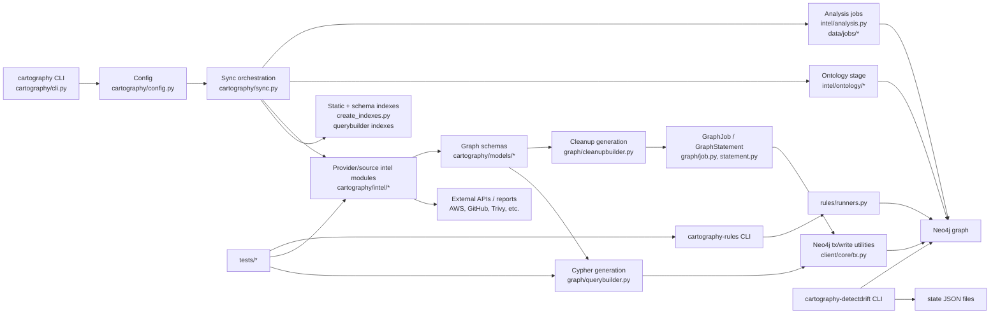

## Metadata

- Confirmed: Repository URL: `https://github.com/cartography-cncf/cartography`.[^1]
- Confirmed: Commit SHA inspected: `23ff8cae54014064d64eac6d857008c55e28bd5a`.[^1]
- Confirmed: Branch inspected: `master`.[^1]
- Confirmed: Inspection date: May 15, 2026.
- Confirmed: Release or version context: the package version is derived dynamically by packaging metadata and `cartography/version.py`; source/dev environments can report `dev`, and commit revision may be inferred from package metadata when available. The latest visible GitHub release context during inspection was `0.136.0`, dated May 2, 2026, but I did not verify that this inspected commit exactly equals that release tag.[^2]
- Confirmed: Primary source categories inspected: runtime source, provider intel modules, graph/model/query infrastructure, rules, drift detection, tests, docs, package metadata, Docker/dev tooling, CI workflows, and representative data/job assets.[^3]
- Source limits and sampling limits: I inspected the repository through GitHub API and web views rather than a local clone. I inspected core runtime files deeply, representative cloud/SaaS/security modules, representative tests, and representative docs. I did not inspect every provider module, every rule, every JSON job, or every documentation page. Claims about unsampled areas are labeled as inference or open question.

## 1. Executive architectural map

Confirmed: Cartography is a Python infrastructure asset graph tool. Its own documentation describes it as a Python tool that consolidates infrastructure assets and relationships into a Neo4j-backed graph, with a security and dependency-discovery emphasis for service owners, red teams, and blue teams.[^4]

Confirmed: The repository directly implements command-line startup, configuration, synchronization orchestration, source-specific ingestion modules, declarative graph schema objects, generated Cypher writes, cleanup jobs, optional analysis jobs, ontology mapping, rule execution, and drift-detection utilities.[^5] It delegates durable graph storage, Cypher execution, graph exploration, and graph query semantics to Neo4j; it delegates raw source-of-truth data to external provider APIs and report sources; and it delegates custom analytical meaning to user-authored Cypher jobs and `cartography-rules` rule definitions.[^6]



Confirmed: The most important first-pass files are `pyproject.toml` for entry points, `cartography/cli.py` for startup, `cartography/config.py` for runtime settings, `cartography/sync.py` for stage orchestration, `cartography/client/core/tx.py` for Neo4j write and retry behavior, `cartography/graph/querybuilder.py` and `cartography/graph/cleanupbuilder.py` for generated Cypher, `cartography/models/core/*` for graph schema contracts, representative `cartography/intel/*` modules for provider-specific behavior, and `cartography/rules/*` for rule execution.[^2][^5][^6][^7][^8][^9][^10]

Caution: The repository is not architected as a single monolithic provider connector. It is a hybrid: synchronization is centrally ordered, but provider modules own their source-specific traversal, validation, transform, load, and cleanup behavior.[^5][^11]

## 2. Repository layout and project structure

Confirmed: The top-level repository contains the main `cartography` package, `docs`, `tests`, Docker/dev assets, packaging files, CI workflows, and governance/security files. The `cartography` package contains runtime subpackages including `client`, `data`, `driftdetect`, `graph`, `intel`, `models`, and `rules`, plus core runtime files such as `cli.py`, `config.py`, `sync.py`, `helpers.py`, `stats.py`, `util.py`, and `version.py`.[^3]

Inference: Volatility below is based on evidence from file responsibilities, tests, docs, and the fact that provider APIs and security rules usually change faster than graph-writing infrastructure.

| Area | Primary role | Runtime-critical? | Volatility | Evidence |
| --- | --- | ---: | --- | --- |
| `cartography/cli.py`, `cartography/config.py`, `cartography/sync.py` | CLI startup, option parsing, configuration object construction, sync-stage selection, Neo4j driver setup, sync execution | Yes | Medium | Confirmed by CLI, config, and sync implementation.[^5] |
| `cartography/intel/` | Provider and source-specific adapters that collect, transform, load, and clean data | Yes for ingestion | High | Confirmed by AWS, GitHub, Trivy, ontology, indexes, and analysis modules.[^11][^12][^13][^14][^15][^16] |
| `cartography/models/` | Declarative graph schema definitions for nodes, relationships, ontology entities, and provider-specific graph types | Yes | Medium to high | Confirmed by core schema abstractions and provider/ontology schema files.[^7][^8][^16] |
| `cartography/graph/` | Cypher query generation, cleanup query generation, JSON job execution, iterative statement execution | Yes | Stable to medium | Confirmed by query builder, cleanup builder, `GraphJob`, and `GraphStatement`.[^9][^10] |
| `cartography/client/` | Neo4j transaction utilities, write batching, read helpers, retry logic, index execution | Yes | Medium | Confirmed by `client/core/tx.py`.[^6] |
| `cartography/data/` | Packaged static Cypher, packaged graph jobs, legacy and analysis job data | Yes for static indexes and packaged jobs | Medium | Confirmed by package data configuration, `create_indexes.py`, `indexes.cypher`, and job execution utilities.[^2][^17][^18] |
| `cartography/rules/` | Separate `cartography-rules` CLI, rule/fact model, rule registry, result formatting | No for ingestion; yes for rules workflow | Medium to high | Confirmed by rules CLI, runners, models, registry, and rule examples.[^19][^20] |
| `cartography/driftdetect/` | Separate drift detection CLI and state comparison tooling | No for ingestion; yes for drift workflow | Medium | Confirmed by drift CLI, state generation, and comparison implementation.[^21] |
| `tests/` | Unit and integration validation for query generation, cleanup, sync selection, provider transforms/loads, rules | No at runtime | High | Confirmed by graph, sync, provider, and rules tests.[^22][^23][^24][^25][^26][^27] |
| `docs/root/` | User, operations, module, and developer documentation | No at runtime | Medium | Confirmed by docs index, install, ops, and developer guide.[^4][^18][^28][^29] |
| `Dockerfile`, `dev.Dockerfile`, `docker-compose.yml` | Production image, development image, local Neo4j and dev/test composition | Operationally important | Medium | Confirmed by Docker and compose files.[^30] |
| `pyproject.toml`, `uv.lock`, `Makefile`, `.pre-commit-config.yaml` | Packaging, dependency locking, test targets, lint/type hooks | Build/test critical | Medium | Confirmed by packaging, Makefile, and pre-commit config.[^2][^29][^31] |
| `.github/workflows/` | CI, tests, docs, scorecard, release publishing to PyPI/GHCR | Release critical | Medium | Confirmed by test and release workflows.[^29][^30] |

Confirmed: The package entry points are `cartography`, `cartography-detectdrift`, and `cartography-rules`, mapped to `cartography.cli:main`, `cartography.driftdetect.cli:main`, and `cartography.rules.cli:main` respectively.[^2]

## 3. System purpose and architectural role

Confirmed: Cartography’s purpose is infrastructure asset discovery and relationship modeling across many sources, with Neo4j as the graph backend. It is oriented toward infrastructure visibility, hidden dependency discovery, attack-path exploration, asset reporting, and security improvement workflows.[^4]

Confirmed: Cartography implements provider-specific ingestion rather than a generic ETL-only framework. For example, AWS orchestration discovers accounts and regions, orders resource sync functions, and conditionally runs analysis; GitHub ingestion handles organization-scoped GraphQL collection, dependency manifests, collaborators, branch protection, cleanup safety, and global resource cleanup; Trivy ingestion consumes vulnerability scan reports and links findings/packages to existing image ontology nodes.[^11][^13][^15]

Confirmed: Neo4j supplies persistence, graph traversal, Cypher query execution, indexing semantics, and browser exploration. Cartography supplies the Cypher generation, transaction submission, schema-driven model conventions, and freshness cleanup logic that populate and maintain the graph.[^6][^9][^10][^28]

Confirmed: External provider APIs and report sources supply raw data. Cartography normalizes source-specific records into dictionaries keyed for schema loading, then writes nodes and relationships into Neo4j using stable IDs and generated `MERGE` queries.[^12][^13][^15][^18]

Confirmed: User-authored Cypher and packaged analysis jobs extend graph behavior beyond ingestion. `cartography.intel.analysis` loads JSON graph jobs from a configured analysis directory, and `cartography.util.run_analysis_job()` executes packaged analysis jobs through `GraphJob`.[^18]

Confirmed: `cartography-rules` is a separate query/reporting layer. It connects to Neo4j, executes rule facts as Cypher queries, parses raw rows into typed finding objects, aggregates rule results, and formats text or JSON output. I did not find evidence in the inspected rules runner that rules write findings back into Neo4j.[^19]

Caution: The inspected evidence does not support describing Cartography as a complete SIEM, CMDB, SOAR, or data lake. It is best described as a graph-backed asset intelligence and security exposure analysis tool.

## 4. Core architectural units and boundaries

Confirmed: Cartography’s main architectural boundary is between volatile source-specific modules and comparatively stable graph-writing infrastructure. Provider modules decide what to collect and how to normalize it; schemas define how normalized dictionaries map to graph objects; querybuilder/tx modules generate and execute Cypher.[^7][^8][^9][^11]

| Unit | Responsibility | Main files or packages | Inputs | Outputs | Downstream dependency | Evidence |
| --- | --- | --- | --- | --- | --- | --- |
| CLI and configuration layer | Parse CLI options, read secrets from env/prompt, construct `Config`, select sync object | `cartography/cli.py`, `cartography/config.py` | CLI args, environment variables, optional custom `Sync` | `Config`, selected `Sync` | Sync orchestration | Confirmed.[^5] |
| Synchronization orchestration layer | Order and invoke sync stages, construct Neo4j driver, assign update tag, handle top-level errors | `cartography/sync.py` | `Config`, Neo4j connection settings, selected modules | Stage execution against Neo4j session | Intel modules, indexes, analysis | Confirmed.[^5] |
| Source-specific intel modules | Collect provider/report data, validate module-specific config, transform, load, cleanup | `cartography/intel/*` | Provider APIs, local/S3 reports, config credentials | Normalized dictionaries and graph writes | Models, tx, cleanup | Confirmed.[^11][^13][^15] |
| Provider API clients and helpers | API paging, regional error handling, retries, provider utility functions | `cartography/util.py`, provider-specific subpackages | API client/session objects | Lists of provider records | Intel transforms | Confirmed for AWS helpers and GitHub/Trivy patterns.[^18][^13][^15] |
| Transform and normalization logic | Shape raw data into graph-loadable dictionaries | Provider modules such as `aws/ec2/instances.py`, `github/repos.py`, `trivy/scanner.py` | Provider responses or reports | Lists/maps keyed by schema `PropertyRef` names | Load functions | Confirmed.[^12][^13][^15] |
| Graph model definitions | Define node labels, relationship labels, identity fields, properties, relationship matchers, cleanup scope | `cartography/models/core/*`, `cartography/models/aws/*`, `cartography/models/github/*`, `cartography/models/trivy/*` | Schema class definitions | Querybuilder inputs | Query generation and cleanup | Confirmed.[^7][^8][^12][^14][^16] |
| Query generation and graph write logic | Generate Cypher, create indexes, batch writes, retry Neo4j work | `graph/querybuilder.py`, `client/core/tx.py` | Schema objects and normalized dictionaries | Neo4j writes | Neo4j | Confirmed.[^6][^9] |
| Cleanup and stale-data handling | Generate and execute cleanup queries for nodes and relationships based on `lastupdated` and scope | `graph/cleanupbuilder.py`, `graph/job.py`, module cleanup functions | Schema objects, `UPDATE_TAG`, scope params | Deletion of stale nodes/rels | Neo4j | Confirmed.[^10] |
| Ontology support | Project provider-specific nodes into semantic labels/entities and cross-source relationships | `models/ontology/*`, `intel/ontology/*` | Existing graph nodes and source-of-truth config | Ontology nodes, labels, links | Neo4j, rules | Confirmed.[^16] |
| Drift detection | Snapshot query results and compare state files | `cartography/driftdetect/*` | Neo4j queries, drift directory state files | New/missing result reports | File system, Neo4j | Confirmed.[^21] |
| Rule execution and findings | Query graph facts, parse findings, aggregate rules, filter frameworks | `cartography/rules/*` | Neo4j URI, rule IDs, framework filters | Text or JSON findings | Neo4j | Confirmed.[^19][^20] |
| Testing and validation | Validate generated Cypher, cleanup, sync selection, transforms, integration graph writes, rules | `tests/unit/*`, `tests/integration/*` | Fixtures, mocked APIs, Neo4j test sessions | Test assertions | CI | Confirmed.[^22][^23][^24][^25][^26][^27] |

Inference: The architecture is a hybrid of centralized orchestration and module-owned source behavior. Central orchestration controls stage order and shared Neo4j session creation; individual modules own traversal, source error handling, transform shape, and cleanup safety rules.

## 5. Primary runtime execution path

Confirmed: The package entry point for the main command is `cartography = "cartography.cli:main"`.[^2]

Confirmed: `cartography.cli` intentionally keeps startup lazy. The CLI class documentation and implementation preserve backward compatibility for custom sync scripts and avoid importing the default sync stack until command execution, so help/version paths do not import all providers.[^5]

Confirmed: Startup flow is as follows.

1. `cartography.cli:main` sets logging defaults, adjusts noisy third-party loggers, checks Python version, and delegates to `CLI(...).main(argv)`.[^5]
2. `CLI.main()` builds a Typer application and invokes it with the supplied arguments. It catches Typer exits, `SystemExit`, `KeyboardInterrupt`, and generic exceptions, returning command status codes rather than leaving all failures unhandled.[^5]
3. The `run` command parses Neo4j settings, selected-module settings, many provider-specific settings, statsd options, report-source options, analysis job directory, ontology source settings, and provider credentials from CLI arguments or environment-backed options.[^5]
4. The command reads Neo4j passwords from a prompt or environment variable when configured, resolves report sources, validates selected AWS/GCP requested sync combinations where implemented, and constructs a `Config` object.[^5]
5. If a custom `Sync` was supplied to `CLI`, the CLI uses it. Otherwise it lazily imports `cartography.sync` and calls `build_sync(selected_modules)` when modules are selected, or `build_default_sync()` when not.[^5]
6. The CLI calls `cartography.sync.run_with_config(sync, config)`.[^5]
7. `run_with_config()` initializes statsd when enabled, builds optional Neo4j driver keyword arguments, opens a `GraphDatabase.driver`, handles connection/auth errors, assigns a default `update_tag` using `int(time.time())` when none is supplied, and calls `sync.run(driver, config)`.[^5]
8. `Sync.run()` opens one Neo4j session for the configured database and executes stages in order, passing `(neo4j_session, config)` to each stage function.[^5]
9. Provider modules collect source data, transform it, call `load()` or graph jobs, and then run cleanup. Schema-backed `load()` creates indexes, builds ingestion Cypher, batches dictionaries, writes through Neo4j transactions, and applies conditional labels.[^6][^9]
10. Cleanup functions typically create `GraphJob.from_node_schema(schema, common_job_parameters).run(neo4j_session)`, which executes cleanup statements in bounded iterations.[^10]

Confirmed: The default sync includes a `create-indexes` stage first and an `analysis` stage last, and the comments in `Sync` explicitly state that these stage positions matter.[^5]

Caution: When `--selected-modules` is used, `build_sync()` adds only the selected modules in the user-provided order. This is validated by unit tests. A selected-module run can therefore bypass default pre/post stages unless the user includes them.[^5][^23]

## 6. Synchronization orchestration

Confirmed: Top-level sync stages are defined in an ordered mapping named `TOP_LEVEL_MODULES`. Stage values are lazy import wrappers that load provider entrypoints on demand. This order places `create-indexes` first, many provider modules in the middle, `ontology` late, and `analysis` last.[^5]

Confirmed: `Sync.list_intel_modules()` dynamically discovers modules from `cartography.intel`, excludes some internal names such as `analysis`, `create_indexes`, and `entra`, and then adds special cases such as `ontology` and `analysis`. Unit tests assert that available module keys match `TOP_LEVEL_MODULES` and that default sync order equals the ordered mapping.[^5][^23]

Confirmed: Module selection is implemented by `parse_and_validate_selected_modules()` and `build_sync()`. It trims whitespace, rejects invalid names, aliases `entra` to `microsoft`, removes duplicates, and adds selected stages in the selected order.[^5][^23]

Confirmed: Failure handling is mostly centralized at the top level but not uniform inside modules. `Sync.run()` logs and re-raises ordinary stage exceptions, while some modules implement narrower failure behavior. AWS has a best-effort mode that aggregates account failures and can skip certain post-ingestion cleanup when account syncs fail; GitHub continues in some privileged-fetch and collaborator-fetch failure cases; Trivy skips cleanup after parse/read failures or unmatched reports to avoid deleting valid old data.[^5][^11][^13][^15][^26]

Confirmed: The orchestration is hybrid. `sync.py` owns stage ordering and session passing. Modules own sub-ordering, provider traversal, transform/load/cleanup sequencing, and cleanup safety rules.[^5][^11][^13][^15]

Open question: The inspected evidence does not prove that every provider module follows the same cleanup and error-handling pattern. The developer docs describe a preferred `get → transform → load → cleanup` pattern, but large legacy or specialized modules can diverge.[^18]

## 7. Intel module pattern

Confirmed: The developer guide defines an intel module as a `sync` function that should call `get`, then transform if needed, then `load`, and finally `cleanup`. It also states that module-specific CLI arguments and credentials are typically added to `cartography/cli.py`, bound to `Config`, and validated by the module itself.[^18]

Confirmed: The preferred load pattern is schema-driven: module load functions pass a schema object, list of dictionaries, and shared kwargs such as `lastupdated`, `Region`, `AWS_ID`, or tenant IDs to `cartography.client.core.tx.load()`.[^6][^18]

Confirmed: The preferred cleanup pattern for schema-backed modules is `GraphJob.from_node_schema(schema, common_job_parameters).run(neo4j_session)`. Legacy cleanup jobs can still exist as packaged JSON jobs.[^10][^18]

| Module | Config inputs | Collection functions | Transform pattern | Load pattern | Model/schema files | Cleanup pattern | Tests | Notable divergence |
| --- | --- | --- | --- | --- | --- | --- | --- | --- |
| AWS EC2 instances | AWS profile/session, requested syncs, regions, account ID, `update_tag`, best-effort settings | `get_ec2_instances()` uses EC2 paginator; AWS top-level sync discovers accounts/regions and orders resource functions | `transform_ec2_instances()` expands one EC2 response into reservations, instances, subnet links, security-group links, keypair links, network interfaces, EBS links, IPv6 records, and derived metadata | Multiple load helpers call `load()` with EC2 schemas and kwargs such as `Region`, `AWS_ID`, and `lastupdated` | `models/aws/ec2/instances.py` | `cleanup()` runs schema-derived cleanup jobs for reservations, instances, autoscaling groups, and IPv6 addresses | Integration test asserts EC2 nodes and relationship sets in Neo4j | Mature cloud module with account/region loops, resource dependency ordering, and AWS-specific best-effort behavior.[^11][^12][^24] |
| GitHub repositories | Base64 JSON GitHub config, organizations, GraphQL URL, token, optional commit/dependency settings | Repository GraphQL queries, privileged detail fetches, collaborators, dependency manifests, pagination/retry helpers | `transform()` splits repositories into repositories, branches, languages, owners, collaborators, requirements, dependencies, manifests, and branch protection rules | Load functions call `load()` for repository and related schemas | `models/github/repos.py` | Mixed scoped and unscoped cleanup; per-org cleanup for branches/manifests/branch protection, global cleanup for dependencies, warnings about multi-org global cleanup | Unit tests cover dependency transforms, requirements fallback, privileged fetch failure, branch cleanup when org has no repos | SaaS module with important partial-visibility and multi-organization cleanup edge cases.[^13][^14][^25] |
| Trivy | Report source, S3/local/object-store source, existing graph image targets and digest aliases, `update_tag` | Reads JSON scan reports from configured report source or S3; matches reports to graph image targets | Parses scan data into findings, packages, fixes, package normalized IDs, CVSS data, repo digests, and ontology image links | `load_scan_vulns()`, `load_scan_packages()`, `load_scan_fixes()` call schema-backed loads | `models/trivy/findings.py`, `models/trivy/package.py` | Cleanup is unscoped for findings/packages but guarded: skipped if no files, parse failures, read failures, or no matching reports | Unit tests assert S3 listing, missing results handling, digest-file mapping, and cleanup skipping after partial failures | Security/dependency enrichment module rather than provider inventory; links scan results to existing image ontology nodes.[^15][^26] |

Caution: The pattern is maintainable because source volatility is mostly isolated in `intel` and `models`, but every new integration still tends to touch CLI/config, docs, tests, and possibly rules. That creates controlled but real cross-cutting work.[^5][^18][^31]

## 8. Graph model and schema conventions

Confirmed: Cartography’s graph model is declarative. A `CartographyNodeSchema` defines a primary Neo4j label, a `CartographyNodeProperties` object, optional extra labels, an optional sub-resource relationship, optional other relationships, and a `scoped_cleanup` flag that defaults to `True`.[^7]

Confirmed: `CartographyNodeProperties` requires `id` and `lastupdated`, and reserves `firstseen`. `CartographyRelProperties` requires `lastupdated` and also reserves `firstseen`.[^7][^8]

Confirmed: `PropertyRef` is the bridge between normalized dictionaries or load kwargs and graph properties. It can read from `item.<field>` or `$kwarg`, and supports flags such as `set_in_kwargs`, `extra_index`, `ignore_case`, `fuzzy_and_ignore_case`, and `one_to_many` with validation constraints.[^7]

Confirmed: Relationships are represented by `CartographyRelSchema`, `TargetNodeMatcher`, optional `SourceNodeMatcher`, a relationship label, directionality, and relationship properties. Direction is represented by `LinkDirection.INWARD` or `LinkDirection.OUTWARD`.[^8]

Confirmed: Extra node labels can be unconditional strings or `ConditionalNodeLabel` values. Conditional labels are applied in separate generated queries after ingestion and have tests covering removal, setting, escaping, indexes, scoped behavior, and directionality.[^7][^22]

Confirmed: Ontology mapping adds a semantic layer. `OntologyFieldMapping`, `OntologyNodeMapping`, and `OntologyMapping` describe how provider-specific node fields map to ontology fields, including required fields and special handling such as boolean inversion, boolean composition, static values, and value mappings.[^16]

| Schema concept | Purpose | Where defined | How used by query generation | Developer implications |
| --- | --- | --- | --- | --- |
| `PropertyRef` | Maps source dictionary keys or kwargs to node/relationship properties | `models/core/common.py` | Generates `item.<field>` or `$<field>` property expressions and matcher predicates | Developers must align transform output keys and load kwargs with schema refs.[^7] |
| `CartographyNodeProperties` | Defines node property set and required identity/freshness fields | `models/core/nodes.py` | Generates `MERGE` identity and `SET` clauses | Every node schema must define stable `id` and `lastupdated`.[^7] |
| `CartographyNodeSchema` | Defines label, properties, relationships, labels, and cleanup scope | `models/core/nodes.py` | Input to ingestion, index, conditional label, and cleanup query builders | Schema choices control write behavior and cleanup behavior.[^7][^9][^10] |
| `CartographyRelSchema` | Defines target/source matchers, relationship label, direction, and properties | `models/core/relationships.py` | Generates `OPTIONAL MATCH`, `MERGE`, and relationship `SET` clauses | Relationship semantics are encoded in schema, not handwritten in most modern modules.[^8][^9] |
| `TargetNodeMatcher` | Defines how to find the other node in a relationship | `models/core/relationships.py` | Generates equality, case-insensitive, fuzzy, or `IN` match predicates | Match fields should be indexed and stable.[^8][^9] |
| `LinkDirection` | Encodes relationship direction | `models/core/relationships.py` | Determines whether generated `MERGE` points inward or outward | Query authors must understand graph direction, especially for rules.[^8][^27] |
| Extra labels | Add taxonomy and cross-provider labels | `models/core/nodes.py` | Added in ingestion query for string labels | Useful for generic queries such as all resources or all user accounts.[^7][^18] |
| Conditional labels | Add labels only when property conditions match | `models/core/nodes.py`, `querybuilder.py` | Applied after ingestion by remove/set queries | Useful for ontology distinctions, but adds post-load query work and condition-field index needs.[^9][^22] |
| `scoped_cleanup` | Controls whether stale cleanup is tenant/subresource-limited | `models/core/nodes.py`, `cleanupbuilder.py` | Selects scoped or unscoped cleanup query shape | Wrong scope can either leak stale data or delete too broadly.[^7][^10] |
| Ontology mappings | Map provider-specific nodes into semantic graph concepts | `models/ontology/*`, `intel/ontology/*` | Queries existing graph nodes and loads ontology schema nodes | Supports cross-source rules but introduces mapping completeness risk.[^16][^20] |
| Index metadata | Identifies fields needing Neo4j indexes | `querybuilder.py`, `indexes.cypher` | Creates schema-driven and static indexes | Required for matcher performance and cleanup performance.[^9][^17][^18] |

Inference: The model layer is the primary mechanism for normalizing source-specific provider records into a consistent graph write path, even though semantic normalization across providers is only partially centralized through ontology mappings.

## 9. Data transformation and normalization

Confirmed: Source-specific normalization occurs primarily in intel modules, not in a single global transform engine. The shared abstraction is the schema-driven load path: transforms produce dictionaries whose keys match `PropertyRef` definitions, and `load()` passes shared kwargs for fields such as `lastupdated`, account IDs, regions, or organization IDs.[^6][^7][^18]

Confirmed: The developer guide distinguishes required and optional fields operationally. It recommends direct dictionary access for required fields so a sync fails rather than loading malformed data, `.get()` for optional fields, `None` rather than empty strings for absent fields, and datetime parsing where queryable date comparisons matter.[^18]

Confirmed: AWS EC2 transformation expands provider records into multiple graph concepts. One EC2 reservations response becomes instance nodes, reservation nodes, subnet links, security-group links, keypair links, network interfaces, EBS volume links, IPv6 address records, IMDS metadata fields, launch timestamps, and derived EKS cluster fields before loading.[^12]

Confirmed: GitHub repository transformation splits API data into repositories, languages, owners, collaborators, branches, branch protection rules, dependency manifests, Python requirements, and dependency graph packages. It derives branch IDs, converts SSH URLs to git URLs, normalizes Python requirement records, and prefers dependency graph data over requirements-text fallback when dependency graph data is present.[^13][^25]

Confirmed: Trivy transformation parses JSON reports into vulnerability findings, package records, package-to-finding relationships, fix data, CVSS fields, repo digests, and normalized package IDs. Its module treats missing `Results` as a valid no-vulnerabilities case but validates key metadata such as image digest material before linking to graph image nodes.[^15][^26]

Inference: Identifier selection is provider-specific but must be stable enough for Neo4j `MERGE`. Examples include EC2 instance IDs, AWS ARNs, GitHub repository URLs, GitHub branch reference IDs, dependency IDs based on names/specifiers, Trivy finding IDs, and normalized package IDs.[^12][^13][^15]

Caution: Because transform logic is procedural and distributed across modules, adding or changing a provider schema requires checking transforms, model definitions, tests, cleanup, rules, and docs together. There is no inspected single schema validator that proves all provider dictionaries satisfy all model refs before runtime load.

## 10. Neo4j interaction and query generation

Confirmed: The main runtime opens a Neo4j driver in `sync.run_with_config()` and executes sync stages through a session. Rules and drift detection open their own Neo4j drivers or sessions for query-only workflows.[^5][^19][^21]

Confirmed: The modern write path is `load()` → `ensure_indexes()` → `build_ingestion_query()` → `load_graph_data()` → transaction execution. `load()` validates nonempty input, creates schema-derived indexes, builds ingestion Cypher, batches records, logs counts, sends metrics, and applies conditional label queries after data load.[^6][^9]

Confirmed: `load_graph_data()` batches dictionaries under `$DictList` with a default batch size of 10,000 and rejects nonpositive batch sizes.[^6]

Confirmed: Neo4j write calls use retry wrappers. The transaction code retries selected network/session/transient errors and a specific entity-not-found client error with exponential backoff. Index creation uses auto-commit behavior and ignores equivalent-schema-rule duplication errors.[^6]

Confirmed: Generated ingestion Cypher has this shape in paraphrased form.

```cypher
UNWIND $DictList AS item
MERGE (i:<PrimaryLabel> {id: item.<id_field_or_$kwarg>})
ON CREATE SET i.firstseen = timestamp()
SET
  i._module_name = "<schema module>",
  i._module_version = "<cartography version>",
  i.lastupdated = $lastupdated,
  i.<property> = item.<source_key_or_$kwarg>,
  ...

WITH i, item
CALL (i, item) {
  OPTIONAL MATCH (j:<TargetLabel> {<target_key>: <item_or_kwarg_value>})
  WITH i, item, j WHERE j IS NOT NULL
  MERGE (i)<-[r:<REL_LABEL>]-(j)  // or outward
  ON CREATE SET r.firstseen = timestamp()
  SET r._module_name = "<schema module>",
      r._module_version = "<cartography version>",
      r.lastupdated = $lastupdated
}
```

Confirmed: Unit tests assert exact generated query strings for simple subresource relationships, case-insensitive relationship matching, fuzzy matching, unscoped relationship creation, and one-to-many relationship matching with `IN item.Roles`.[^22]

Confirmed: Idempotency is intended through `MERGE` on stable node identifiers and relationship patterns, with `firstseen` set only on create and `lastupdated` set on each load. Duplicate-data avoidance therefore depends on stable identifier choice and correct target matchers.[^9][^18]

Caution: Graph consistency across sync runs depends on the combination of stable IDs, `lastupdated`, cleanup scope, and complete source data. Partial provider visibility can be dangerous; GitHub and Trivy contain explicit guarded cleanup behavior, and operations docs warn that parallel jobs for the same resource type can race and delete each other’s data.[^13][^15][^28]

## 11. Cleanup, freshness, and temporal semantics

Confirmed: Cartography’s freshness model is snapshot-like. Each sync run has an `update_tag`, usually the Unix timestamp when the sync started. Nodes and relationships created or updated during a sync get `lastupdated = update_tag`; stale graph elements with old `lastupdated` values are deleted by cleanup jobs.[^5][^18][^28]

Confirmed: `firstseen` is set by generated Cypher on node or relationship creation using Neo4j `timestamp()`. `lastupdated` is set on each load from the current update tag.[^9][^18]

Confirmed: Cleanup generation has separate cases for scoped and unscoped schemas. A node schema with a sub-resource relationship and `scoped_cleanup=True` deletes stale objects only within the current tenant/subresource. A schema with `scoped_cleanup=False` and no subresource can perform unscoped stale-node cleanup. Invalid scope combinations raise errors.[^10]

Confirmed: Relationship cleanup is explicit. The cleanup builder generates stale relationship deletion queries as well as stale node deletion queries where applicable. This matters because a node can remain current while one of its relationships becomes stale.[^10][^18]

Confirmed: `cascade_delete=True` can delete direct `RESOURCE` children with a stale parent, but the docs state it is only valid for scoped cleanup and affects direct children, not arbitrary-depth descendants.[^18]

| Freshness mechanism | Meaning | Where assigned | Where consumed | Failure or edge-case concern |
| --- | --- | --- | --- | --- |
| `update_tag` | Run-level freshness marker | `run_with_config()` defaults it; CLI can pass one | Load kwargs, cleanup params, module metadata | If reused incorrectly, stale detection can be distorted.[^5] |
| `lastupdated` | Per-node/per-relationship marker for last seen in current source run | Schema properties with `set_in_kwargs=True`; generated `SET` clauses | Cleanup queries compare to `$UPDATE_TAG` | Partial source failures can make valid old data appear stale unless cleanup is skipped or scoped.[^9][^10][^15] |
| `firstseen` | Creation timestamp preserved across updates | Generated `ON CREATE SET` | User queries and lifecycle analysis | It is not bitemporal provenance; it records graph insertion time, not necessarily real-world creation time.[^9][^18] |
| Scoped cleanup | Deletes stale data only under current tenant/subresource | `CartographyNodeSchema.scoped_cleanup=True` with subresource matcher | `cleanupbuilder.py` scoped queries | Wrong tenant matcher or missing `set_in_kwargs` can break cleanup safety.[^7][^10] |
| Unscoped cleanup | Deletes stale nodes/rels of a type globally | `scoped_cleanup=False` schemas | `cleanupbuilder.py` unscoped queries | Dangerous for sources with partial visibility or multi-org/multi-account partial runs.[^10][^13][^15] |
| Relationship cleanup | Deletes stale edges even when nodes remain | Schema-derived relationship cleanup | Cleanup jobs | Necessary when relationships change but nodes persist.[^10][^18] |
| Matchlink cleanup metadata | Uses `_sub_resource_label` and `_sub_resource_id` on relationships | Matchlink query generation | Matchlink cleanup query generation | Requires correct metadata fields or cleanup cannot safely scope matchlinks.[^8][^9][^10] |
| Cascade delete | Deletes stale parent and direct stale children over `RESOURCE` | `GraphJob.from_node_schema(..., cascade_delete=True)` | Cleanup builder | Direct-child only; incompatible with unscoped cleanup.[^18] |

Caution: Cartography’s freshness model is not a full historical or bitemporal model. Cleanup removes stale graph state. The graph can represent `firstseen` and `lastupdated`, but the inspected ingestion path does not preserve raw evidence versions or previous property values by default.

## 12. Rules, findings, and analysis workflows

Confirmed: `cartography-rules` is a package entry point and Typer CLI with commands for listing frameworks, listing rules, and running rules. Its `run` command accepts Neo4j URI/user/database/password options, output format selection, experimental-rule gating, framework filters, and optional fact filters.[^2][^19]

Confirmed: A `Rule` contains one or more `Fact` objects. A `Fact` has an ID, name, description, module, maturity, Cypher query, optional visual query, count query, and asset ID field. A `Rule` has an output model, tags, version, references, and framework mappings.[^19]

Confirmed: Rule execution is read-oriented in inspected code. `_run_fact()` opens a Neo4j session, executes the fact Cypher query, parses rows into typed findings, optionally executes a count query for denominator metrics, and builds `FactResult`/`RuleResult` objects. I found no inspected rule runner path that writes findings back into the graph.[^19]

Confirmed: Rules are both provider-specific and cross-provider. The missing-MFA rule has an AWS-specific fact based on `AWSUser` and `MFA_DEVICE` edges, plus a cross-cloud ontology fact based on `UserAccount` and `_ont_has_mfa = false`. The unpinned GitHub Actions rule is tightly coupled to GitHub repository, workflow, and action labels.[^20]

Confirmed: Rule results can be formatted as JSON or text, and formatting can generate Neo4j Browser URLs from Neo4j connection URIs for visual query use.[^19]

Confirmed: The rule registry imports many rules across CIS AWS, CIS GCP, CIS Google Workspace, CIS Kubernetes, NIST AI RMF, supply-chain, identity, cloud exposure, unmanaged accounts, and other security categories.[^20]

Caution: Rules are coupled to graph schema names and property conventions. Ontology-backed rules reduce provider coupling, but provider-specific rules can break when provider schemas or relationship directions change. The integration test for the MFA rule explicitly protects an AWS relationship-direction assumption.[^27]

## 13. Public and operational interfaces

Confirmed: Cartography exposes three installed CLIs: `cartography`, `cartography-rules`, and `cartography-detectdrift`.[^2]

| Interface | User-visible input | Internal representation | Runtime path | Evidence |
| --- | --- | --- | --- | --- |
| `cartography` | Neo4j URI/user/password/database, selected modules, update tag, statsd options, provider options, report sources, ontology source settings | `Config` object | `cartography.cli:main` → Typer command → `Config` → `sync.run_with_config()` → `Sync.run()` | Confirmed.[^5] |
| `--selected-modules` | Comma-separated module names | Ordered list of validated stage names | `parse_and_validate_selected_modules()` → `build_sync()` | Confirmed and unit tested.[^5][^23] |
| Provider credentials/options | CLI args and environment variables, such as Neo4j password env var, AWS environment/profile, GitHub config env var, report-source options | `Config` fields | CLI command construction and module-specific validation | Confirmed.[^5][^18] |
| `cartography-rules list/frameworks/run` | Rule IDs, `all`, framework filters, Neo4j options, output format, experimental flag | Rule IDs, framework filters, fact filters | `rules/cli.py` → `rules/runners.py` → Neo4j read queries | Confirmed.[^19] |
| `cartography-detectdrift` | `get-state`, `get-drift`, `add-shortcut`, Neo4j options, drift directories, state filenames | argparse namespace implementing drift config shape | `driftdetect/cli.py` → state generation or comparison | Confirmed.[^21] |
| Custom sync command | User-authored Python script constructing `Sync` and adding stages | `Sync` instance | Custom script calls `cli.CLI(custom_sync).main(argv)` | Confirmed in developer guide.[^29] |
| Analysis job directory | Filesystem directory of JSON graph jobs | Globbed JSON job files | `cartography.intel.analysis.run()` → `GraphJob.run_from_json_file()` | Confirmed.[^18] |
| StatsD | `--statsd-enabled`, host, port, prefix | Global `ScopedStatsClient` | `sync.run_with_config()` initializes StatsD; `timeit` and load paths emit metrics | Confirmed.[^5][^32] |

Confirmed: The install docs document Docker Compose, direct Docker, and native installation, including Neo4j 5.23 or higher for scoped subqueries, Python 3.13 as the expected runtime, and `uv` as the recommended installation/development tool.[^28]

## 14. Integration and adapter strategy

Confirmed: Cartography manages many integrations by using source-specific modules for volatile provider logic and a shared graph-writing substrate for stable graph semantics. The module guide’s `get → transform → load → cleanup` pattern is visible in AWS EC2, GitHub repos, and Trivy scanner implementations, even though each module has provider-specific deviations.[^12][^13][^15][^18]

Confirmed: Authentication handling is provider-specific but surfaced through CLI/config. The developer docs direct module authors to add CLI options and validate module-specific required arguments; GitHub reads base64 JSON config, AWS uses boto3 sessions/profiles, and Trivy reads report-source configuration.[^5][^11][^13][^15][^18]

Confirmed: Pagination and retry behavior are not fully centralized. AWS has helper decorators and pagination utilities for regional errors and backoff; GitHub repository code handles pagination and rate-limit sleeps; Neo4j writes have centralized retry and batching.[^6][^13][^18]

| Component category | Likely volatility | Isolation mechanism | Evidence | Maintainability assessment |
| --- | --- | --- | --- | --- |
| External provider APIs | High | Provider-specific `cartography/intel/*` modules and provider models | AWS, GitHub, Trivy examples | Good isolation for source traversal, but large modules can accumulate complex special cases.[^11][^13][^15] |
| Graph write infrastructure | Stable to medium | Shared querybuilder, tx utilities, schema abstractions | Core graph and client modules | Strong reuse; exact query generation is tested.[^6][^9][^22] |
| Provider graph schemas | Medium to high | Provider-specific `cartography/models/*` files | AWS, GitHub, Trivy models | Good separation from collection code, but schema changes affect rules and cleanup.[^12][^14][^15] |
| CLI/config surface | Medium | Central `Config` and Typer options | CLI/config implementation | Volatility leaks here because new providers often need new options.[^5][^18] |
| Rules | Medium to high | Separate `cartography/rules` package and registry | Rule registry and examples | Useful analytical layer, but coupled to graph labels/properties.[^19][^20] |
| Tests and fixtures | High | Unit/integration test hierarchy and `tests/data` fixtures | Provider and graph tests | Required to prevent query/schema drift.[^22][^24][^25][^26] |
| Docs | Medium | Sphinx-style docs tree under `docs/root` | Docs index and module/developer docs | Provider additions require documentation updates.[^4][^18][^28] |

Inference: Source-specific volatility is mostly confined to `cartography/intel` and `cartography/models`, but it leaks into `cli.py`, `config.py`, tests, docs, and rules whenever user-visible configuration, graph schema, or analysis semantics change.

## 15. Testing and validation structure

Confirmed: The test suite is organized into unit and integration tests. The Makefile runs pre-commit linting, unit tests, integration tests, and optional combined coverage with `coverage.xml` output. The CI workflow runs lint, unit tests, integration tests, and a Docker build on pushes and pull requests to `master`.[^29]

Confirmed: Integration tests can use a Neo4j testcontainer by default, and the developer guide warns that integration tests delete all nodes from the database they use.[^29]

Confirmed: Graph query generation is strongly validated. Unit tests assert exact generated Cypher for node ingestion, subresource relationships, case-insensitive/fuzzy matching, unscoped cleanup, conditional label query generation, conditional label indexes, scoped conditional labels, and one-to-many relationship matching.[^22]

Confirmed: Sync selection is validated by unit tests covering default stage order, selected-module order, invalid module rejection, driver kwargs forwarding, default update-tag assignment, and positional-argument compatibility in `Config`.[^23]

Confirmed: Provider behavior is validated with a mix of integration and unit tests. AWS EC2 integration tests patch collection and assert resulting nodes and relationships in Neo4j. GitHub repository unit tests cover dependency transforms, requirements fallback, privileged detail merge/failure behavior, branch protection, and cleanup edge cases. Trivy tests cover S3/object-report behavior, missing `Results`, digest aliases, and cleanup skipping after failures.[^24][^25][^26]

Confirmed: Rules have both unit and integration validation. Unit tests cover rule aggregation, fact filtering, framework propagation, framework normalization, and module-to-intel mapping. Integration tests validate specific rule semantics against Neo4j graph fixtures, including MFA direction and ontology null semantics.[^27]

Caution: I did not measure test coverage percentages. The repository has coverage tooling, but claims about actual coverage would require running the suite and reading coverage output.[^29]

Inference: Behaviors strongly validated by tests include generated Cypher shape, cleanup query shape, selected-module ordering, rule result aggregation, framework normalization, and representative module transforms/load outputs. Behaviors weakly validated from the inspected sample include every provider’s API retry behavior, every cleanup edge case, every packaged analysis job, and every rule’s Cypher semantics.

## 16. Operational and maintainability concerns

Confirmed: Logging is pervasive in CLI, sync, modules, jobs, and utilities. CLI controls verbosity, sync logs stage start/finish, graph statements log iteration/update counts, and modules log provider-specific progress/failures.[^5][^10][^11][^18]

Confirmed: Metrics are optional. StatsD can be enabled through CLI options; `sync.run_with_config()` initializes a stats client; `ScopedStatsClient` supports scoped counters, timers, and gauges; and `timeit` reports function timings only when statsd is enabled.[^5][^32]

Confirmed: Retry behavior exists in multiple layers. Neo4j writes have centralized retry; AWS helpers implement backoff and regional skip handling for selected AWS errors; GitHub repository code has rate-limit and timeout retry behavior; Trivy uses guarded cleanup rather than retrying every failed report ingestion path.[^6][^13][^18][^26]

Confirmed: Large graph performance concerns are addressed through indexes, batching, query chunking, and Neo4j version requirements. The install docs require Neo4j 5.23 or higher because Cartography emits scoped subqueries; querybuilder creates indexes for IDs, `lastupdated`, target matchers, extra labels, conditional labels, and extra-index fields; cleanup jobs run iteratively with bounded limit sizes.[^9][^10][^28]

Confirmed: Operations docs explicitly warn that parallel Cartography jobs must not run the same resource type concurrently because cleanup can race and delete resources synced by another job. They suggest parallelizing different resource types or providers instead.[^28]

Confirmed: Dependency management and development workflow are centered on `uv`, `pyproject.toml`, `uv.lock`, pre-commit, Docker, and Makefile targets. CI pins actions by commit SHA, checks the lockfile, runs pre-commit, runs tests, and builds the dev Docker image.[^29][^31]

Confirmed: Release workflow publishes Python distributions to PyPI and Docker images to GHCR on release events, waits for PyPI availability before building the production Docker image, and configures SBOM and provenance attestations for Docker builds.[^30]

Caution: Credentials flow through environment variables, prompt input, local credential files, and provider-specific config blobs. The inspected code supports these operational patterns, but secure deployment still depends on how users configure runtime environments, volumes, secrets, and logs.[^5][^28][^30]

Caution: Direct-to-graph ingestion plus cleanup is operationally efficient, but it can be destructive when source data is incomplete, credentials lose visibility, selected modules omit relevant scopes, or identifiers change. Modules such as GitHub and Trivy include explicit cleanup safeguards, which implies this is a real design pressure.[^13][^15][^28]

## 17. Architectural and conceptual value for Cadastre

Inference: Cartography is highly relevant to Cadastre as a graph-based temporal asset intelligence reference point, but its design should be treated as a source of architectural patterns rather than an implementation template.

| Cartography concept | Evidence in repository | Transferable lesson for Cadastre | Caution or limitation |
| --- | --- | --- | --- |
| Graph-based asset intelligence | Docs and Neo4j-backed ingestion architecture | A graph projection is a strong product surface for asset relationships, exposure paths, and cross-domain queries | A graph alone is not a complete evidence store or temporal ledger.[^4][^6] |
| Source-specific adapters | `cartography/intel/*` provider modules | Isolate provider volatility behind adapters with explicit lifecycle phases | Adapters still leak into CLI/config/docs/tests when user-visible options change.[^5][^18] |
| Provider-specific schemas | `cartography/models/*` plus core schema abstractions | Keep source-native entities explicit before attempting canonicalization | Provider schemas can proliferate and create query complexity.[^7][^8][^12][^14][^15] |
| Declarative graph write model | `PropertyRef`, node schemas, relationship schemas, querybuilder | A model-driven graph writer reduces duplicated Cypher and makes tests precise | Declarative loaders still need procedural transforms and cannot guarantee semantic correctness alone.[^7][^9] |
| Stable identifiers | Required `id` properties and `MERGE` identity | Cadastre should define stable source-native IDs and canonical IDs separately | Identifier changes cause stale/new churn unless evidence and aliases are preserved.[^7][^9][^18] |
| `firstseen` / `lastupdated` | Generated `ON CREATE SET` and update-tag writes | Simple temporal fields are valuable for freshness and operational reasoning | These are not bitemporal validity intervals and do not preserve prior values.[^9][^18] |
| Update tags | Run-level `update_tag` used for cleanup | Run IDs are useful for snapshot completeness and stale-data detection | A single update tag cannot represent partial source uncertainty without additional completeness metadata.[^5][^18] |
| Scoped cleanup | Tenant/subresource-limited stale deletion | Cadastre should scope freshness cleanup to source authority boundaries | Wrong scope can delete valid facts or retain stale facts.[^10][^28] |
| Cleanup guards | GitHub and Trivy skip or constrain cleanup under partial visibility | Cleanup must be conditioned on source completeness and failure mode | Guard logic can become provider-specific and hard to audit globally.[^13][^15] |
| Ontology layer | Ontology mappings and semantic labels | A semantic layer can support cross-source rules without collapsing source-native records too early | Ontology mapping coverage and source-of-truth selection become governance problems.[^16] |
| Cypher-backed rules | `cartography-rules` facts and rule registry | Reusable graph queries are a practical security analysis product surface | Rule correctness is coupled to schema labels, relationship directions, and freshness semantics.[^19][^20][^27] |
| Analysis jobs | Packaged and custom JSON graph jobs | Graph enrichment can be separated from ingestion and run after source sync | Unscoped analysis jobs need explicit dependency and completeness rules.[^18] |
| Drift detection | Query state snapshots and set comparison | Cadastre can expose drift as query-defined state deltas | Drift snapshots do not replace raw evidence history or temporal fact modeling.[^21] |
| Decomposition by volatility | Stable graph core vs volatile provider modules | Cadastre should separate source adapters, canonical/entity model, graph projection, and analysis rules | Cartography’s direct-to-graph path leaves less room for replay, drillback, and lakehouse-backed auditing.[^6][^11][^18] |
| Module sync metadata | `ModuleSyncMetadata` utility | Cadastre should track per-source/per-scope sync completeness as first-class metadata | Metadata must distinguish success, partial success, skipped cleanup, and failed visibility.[^18] |

Caution: For Cadastre, copying direct-to-Neo4j ingestion would likely be too limiting if evidence drillback, replay, source-native provenance, and bitemporal semantics are core product requirements. Cartography demonstrates a strong graph projection and cleanup model, but Cadastre likely needs a durable evidence layer beneath graph projection.

## 18. Uncertainty register

| Topic | What is known | What remains unclear | Why it matters | Suggested follow-up |
| --- | --- | --- | --- | --- |
| Exact release version for inspected commit | Packaging uses dynamic versioning and `version.py` can infer release/commit metadata | Whether commit `23ff8ca...` corresponds to release `0.136.0` or a post-release commit | Version context affects compatibility claims | Inspect tags locally or via GitHub tags/releases for exact tag containment.[^2] |
| Full provider coverage | Representative AWS, GitHub, Trivy, ontology modules were inspected | Every provider module’s transform, cleanup, retry, and credential behavior | Cross-provider conclusions can overgeneralize from samples | Audit all `cartography/intel/*` modules by category. |
| Legacy job behavior | Static indexes and JSON graph jobs exist and are executed through `GraphJob` | Full semantics of every packaged analysis/cleanup job | Jobs can create important edges not obvious from schema files | Enumerate `cartography/data/jobs/**` and classify each job. |
| Rules coverage and correctness | Registry contains many rules and examples; rule runner is read-oriented | Correctness of every Cypher fact and framework mapping | Rules are user-facing security outputs | Run or inspect every rule test and every rule query. |
| Ontology completeness | Ontology mappings and source-of-truth logic exist | Which provider schemas fully map to ontology concepts and which do not | Cross-source rules depend on ontology coverage | Inspect all `models/ontology/mapping/data/*` files and ontology tests. |
| Provider retry/rate-limit behavior | Neo4j, AWS helpers, GitHub, and Trivy representative behavior inspected | Uniformity of retries and rate-limit handling across all providers | Operational reliability depends on provider-specific failure handling | Build a provider-by-provider retry matrix. |
| Cleanup safety across selected modules | Selected modules execute only selected ordered stages; cleanup scope is schema-driven | Whether all selected-module combinations are safe | Partial syncs can delete or retain wrong data | Test selected-module combinations for modules with shared node types. |
| Raw evidence preservation | Transforms load graph properties; no general raw-evidence store inspected | Whether any modules preserve raw provider payloads elsewhere | Evidence drillback and replay depend on raw data retention | Search for raw payload persistence or audit every module’s load schema. |
| Performance at large scale | Batching, indexes, scoped subqueries, and iterative cleanup exist | Practical scale limits and bottlenecks in production graphs | Operational planning needs measured limits | Run benchmark syncs and inspect production tuning docs/issues. |
| CI release guarantees | CI and release workflows are defined | Whether every release is reproducible from lockfiles and attestations end-to-end | Supply-chain assurance depends on release process behavior | Inspect workflow runs, artifacts, and release tags. |

## 19. Developer reading path

Confirmed: The following reading paths are optimized for a first-pass developer who needs to understand behavior before making changes.

| Objective | Read in this order | Why |
| --- | --- | --- |
| Understand runtime startup | `pyproject.toml` → `cartography/cli.py` → `cartography/config.py` → `cartography/sync.py` | Entry points show command names; CLI shows option parsing and lazy startup; config shows runtime shape; sync shows stage execution.[^2][^5] |
| Understand sync orchestration | `cartography/sync.py` → `tests/unit/cartography/test_sync.py` → `docs/root/dev/developer-guide.md` custom sync section | Source shows stage order and selected-module behavior; tests show intended ordering; docs show custom orchestration extension.[^5][^23][^29] |
| Understand graph schema definitions | `models/core/common.py` → `models/core/nodes.py` → `models/core/relationships.py` → representative provider models | Core classes define the contract; provider models show real usage.[^7][^8][^12][^14][^15] |
| Understand generated Cypher and Neo4j writes | `graph/querybuilder.py` → `client/core/tx.py` → `tests/unit/cartography/graph/test_querybuilder_simple.py` → `test_querybuilder_onetomany.py` | Querybuilder defines Cypher; tx submits and retries it; tests show exact expected query shape.[^6][^9][^22] |
| Understand cleanup and freshness | `docs/root/ops.md` → `docs/root/dev/writing-intel-modules.md` cleanup sections → `graph/cleanupbuilder.py` → module cleanup functions | Docs explain operational meaning; cleanupbuilder shows exact deletion cases; modules show application.[^10][^18][^28] |
| Understand one mature provider module | `intel/aws/__init__.py` → `intel/aws/resources.py` → `intel/aws/ec2/instances.py` → `models/aws/ec2/instances.py` → EC2 integration test | This path shows provider-level orchestration, resource ordering, collection, transform, load, cleanup, schema, and graph assertions.[^11][^12][^24] |
| Understand one SaaS/identity module | `intel/github/__init__.py` → `intel/github/repos.py` → `models/github/repos.py` → GitHub repo unit tests | This path shows org-scoped API collection, transform complexity, dependency modeling, and cleanup edge cases.[^13][^14][^25] |
| Understand one security/dependency module | `intel/trivy/__init__.py` → `intel/trivy/scanner.py` → `models/trivy/findings.py` → `models/trivy/package.py` → Trivy tests | This path shows report ingestion, vulnerability normalization, ontology image linking, and guarded cleanup.[^15][^26] |
| Understand ontology | `models/ontology/mapping/specs.py` → `intel/ontology/utils.py` → `intel/ontology/__init__.py` → `models/ontology/user.py` | This path shows mapping definitions, source extraction, stage orchestration, and one semantic schema.[^16] |
| Understand rules | `pyproject.toml` scripts → `rules/cli.py` → `rules/runners.py` → `rules/spec/model.py` → `rules/data/rules/mfa_missing.py` → rule tests | This path shows public CLI, execution, data model, concrete rule definitions, and rule validation.[^2][^19][^20][^27] |
| Understand tests and local development | `docs/root/dev/developer-guide.md` → `Makefile` → `.github/workflows/test_suite.yml` → graph/provider/rules tests | This path shows how maintainers expect code to be run, tested, and validated in CI.[^29] |

## Sources

[^1]: GitHub connector metadata for `cartography-cncf/cartography`, `get_repo`, `search_commits`, `search_branches`, and `fetch_commit` results for `master`, observed May 15, 2026. The connector output resolved default branch `master` and HEAD commit `23ff8cae54014064d64eac6d857008c55e28bd5a`; line numbers unavailable for metadata output.

[^2]: `pyproject.toml`, build-system and dynamic-version metadata, `cartography-cncf/cartography@23ff8cae54014064d64eac6d857008c55e28bd5a`, lines 1-40 and 120-159; `cartography/version.py`, lines 1-120.

[^3]: GitHub repository tree pages for `cartography-cncf/cartography@23ff8cae54014064d64eac6d857008c55e28bd5a`, top-level tree and `cartography/` package tree, observed May 15, 2026. The inspected tree listed `.github`, `cartography`, `docs`, `tests`, Docker files, package files, and runtime package subdirectories; line numbers unavailable for some tree evidence.

[^4]: `docs/root/info.md`, “What is Cartography?” and “Why Cartography?”, `cartography-cncf/cartography@23ff8cae54014064d64eac6d857008c55e28bd5a`, lines 1-20; `docs/root/index.md`, docs toctree, lines 1-24; `docs/root/module-list.md`, lines 1-6.

[^5]: `cartography/cli.py`, `cartography/config.py`, and `cartography/sync.py`, `cartography-cncf/cartography@23ff8cae54014064d64eac6d857008c55e28bd5a`, `cli.py` lines 1-220, 221-520, and 1600-2720; `config.py` lines 1-260 and 300-620; `sync.py` lines 1-760.

[^6]: `cartography/client/core/tx.py`, Neo4j transaction, retry, batching, load, and index utilities, `cartography-cncf/cartography@23ff8cae54014064d64eac6d857008c55e28bd5a`, lines 1-1100.

[^7]: `cartography/models/core/common.py` and `cartography/models/core/nodes.py`, core property and node schema abstractions, `cartography-cncf/cartography@23ff8cae54014064d64eac6d857008c55e28bd5a`, `common.py` lines 1-260 and `nodes.py` lines 1-260.

[^8]: `cartography/models/core/relationships.py`, relationship schema abstractions, `cartography-cncf/cartography@23ff8cae54014064d64eac6d857008c55e28bd5a`, lines 1-560.

[^9]: `cartography/graph/querybuilder.py`, ingestion, relationship, conditional-label, index, ontology, and matchlink query generation, `cartography-cncf/cartography@23ff8cae54014064d64eac6d857008c55e28bd5a`, lines 1-1880.

[^10]: `cartography/graph/cleanupbuilder.py`, `cartography/graph/job.py`, and `cartography/graph/statement.py`, cleanup query generation and graph job execution, `cartography-cncf/cartography@23ff8cae54014064d64eac6d857008c55e28bd5a`, `cleanupbuilder.py` lines 1-760, `job.py` lines 1-640, and `statement.py` lines 1-560.

[^11]: `cartography/intel/aws/__init__.py` and `cartography/intel/aws/resources.py`, AWS orchestration and resource ordering, `cartography-cncf/cartography@23ff8cae54014064d64eac6d857008c55e28bd5a`, `__init__.py` lines 1-620 and `resources.py` lines 1-240.

[^12]: `cartography/intel/aws/ec2/instances.py` and `cartography/models/aws/ec2/instances.py`, AWS EC2 instance collection, transform, load, cleanup, and schema definitions, `cartography-cncf/cartography@23ff8cae54014064d64eac6d857008c55e28bd5a`, `instances.py` lines 1-760 and model file lines 1-360.

[^13]: `cartography/intel/github/__init__.py` and `cartography/intel/github/repos.py`, GitHub orchestration and repository sync implementation, `cartography-cncf/cartography@23ff8cae54014064d64eac6d857008c55e28bd5a`, `__init__.py` lines 1-320 and `repos.py` lines 1-2060.

[^14]: `cartography/models/github/repos.py`, GitHub repository-related graph schemas, `cartography-cncf/cartography@23ff8cae54014064d64eac6d857008c55e28bd5a`, lines 1-420.

[^15]: `cartography/intel/trivy/__init__.py`, `cartography/intel/trivy/scanner.py`, `cartography/models/trivy/findings.py`, and `cartography/models/trivy/package.py`, Trivy report ingestion and graph schemas, `cartography-cncf/cartography@23ff8cae54014064d64eac6d857008c55e28bd5a`, `__init__.py` lines 1-620, `scanner.py` lines 1-760, `findings.py` lines 1-360, and `package.py` lines 1-340.

[^16]: `cartography/models/ontology/mapping/specs.py`, `cartography/intel/ontology/__init__.py`, `cartography/intel/ontology/users.py`, `cartography/intel/ontology/utils.py`, and `cartography/models/ontology/user.py`, ontology mapping and user ontology implementation, `cartography-cncf/cartography@23ff8cae54014064d64eac6d857008c55e28bd5a`, respective inspected ranges lines 1-360, 1-260, 1-320, 1-360, and 1-260.

[^17]: `cartography/intel/create_indexes.py` and `cartography/data/indexes.cypher`, static index creation, `cartography-cncf/cartography@23ff8cae54014064d64eac6d857008c55e28bd5a`, `create_indexes.py` lines 1-260 and `indexes.cypher` lines 1-180.

[^18]: `docs/root/dev/writing-intel-modules.md`, `cartography/intel/analysis.py`, and `cartography/util.py`, intel module lifecycle, cleanup/freshness docs, analysis jobs, and utility functions, `cartography-cncf/cartography@23ff8cae54014064d64eac6d857008c55e28bd5a`, docs lines 1-760, `analysis.py` lines 1-260, and `util.py` lines 1-760.

[^19]: `cartography/rules/cli.py`, `cartography/rules/runners.py`, `cartography/rules/spec/model.py`, and `cartography/rules/formatters.py`, rules CLI, execution, data model, and output formatting, `cartography-cncf/cartography@23ff8cae54014064d64eac6d857008c55e28bd5a`, `cli.py` lines 1-760, `runners.py` lines 1-460, `model.py` lines 1-620, and `formatters.py` lines 1-300.

[^20]: `cartography/rules/data/rules/__init__.py`, `cartography/rules/data/rules/mfa_missing.py`, and `cartography/rules/data/rules/unpinned_github_actions.py`, rule registry and representative rule definitions, `cartography-cncf/cartography@23ff8cae54014064d64eac6d857008c55e28bd5a`, registry lines 1-520 and rule files lines 1-260.

[^21]: `cartography/driftdetect/cli.py`, `cartography/driftdetect/detect_deviations.py`, and `cartography/driftdetect/get_states.py`, drift-detection CLI, state comparison, and state generation, `cartography-cncf/cartography@23ff8cae54014064d64eac6d857008c55e28bd5a`, respective inspected ranges lines 1-320, 1-320, and 1-360.

[^22]: `tests/unit/cartography/graph/test_querybuilder_simple.py`, `tests/unit/cartography/graph/test_cleanupbuilder_unscoped.py`, `tests/unit/cartography/graph/test_querybuilder_conditional_labels.py`, and `tests/unit/cartography/graph/test_querybuilder_onetomany.py`, graph query and cleanup unit tests, `cartography-cncf/cartography@23ff8cae54014064d64eac6d857008c55e28bd5a`, respective inspected ranges lines 1-280, 1-320, 1-640, and 1-320.

[^23]: `tests/unit/cartography/test_sync.py`, sync ordering, selected-module parsing, driver kwargs, and config compatibility unit tests, `cartography-cncf/cartography@23ff8cae54014064d64eac6d857008c55e28bd5a`, lines 1-360.

[^24]: `tests/integration/cartography/intel/aws/ec2/test_ec2_instances.py`, AWS EC2 integration test, `cartography-cncf/cartography@23ff8cae54014064d64eac6d857008c55e28bd5a`, lines 1-360.

[^25]: `tests/unit/cartography/intel/github/test_repos.py`, GitHub repository unit tests, `cartography-cncf/cartography@23ff8cae54014064d64eac6d857008c55e28bd5a`, lines 1-840.

[^26]: `tests/unit/cartography/intel/trivy/test_scanner.py`, Trivy scanner unit tests, `cartography-cncf/cartography@23ff8cae54014064d64eac6d857008c55e28bd5a`, lines 1-840.

[^27]: `tests/unit/rules/test_runners.py`, `tests/unit/rules/test_model.py`, and `tests/integration/rules/test_mfa_missing.py`, rules tests, `cartography-cncf/cartography@23ff8cae54014064d64eac6d857008c55e28bd5a`, respective inspected ranges lines 1-420, 1-420, and 1-360.

[^28]: `docs/root/install.md` and `docs/root/ops.md`, install and operations documentation, `cartography-cncf/cartography@23ff8cae54014064d64eac6d857008c55e28bd5a`, `install.md` lines 1-260 and `ops.md` lines 1-100.

[^29]: `docs/root/dev/developer-guide.md`, `Makefile`, and `.github/workflows/test_suite.yml`, development and CI workflow evidence, `cartography-cncf/cartography@23ff8cae54014064d64eac6d857008c55e28bd5a`, developer guide lines 1-260, Makefile lines 1-20, and workflow lines 1-360.

[^30]: `Dockerfile`, `dev.Dockerfile`, `docker-compose.yml`, and `.github/workflows/publish-to-ghcr-and-pypi.yml`, Docker and release workflow evidence, `cartography-cncf/cartography@23ff8cae54014064d64eac6d857008c55e28bd5a`, Dockerfile lines 1-40, dev Dockerfile lines 1-60, compose file lines 1-120, and release workflow lines 1-360.

[^31]: `.pre-commit-config.yaml`, pre-commit/lint/type tooling configuration, `cartography-cncf/cartography@23ff8cae54014064d64eac6d857008c55e28bd5a`, lines 1-40.

[^32]: `cartography/stats.py`, scoped StatsD client implementation, `cartography-cncf/cartography@23ff8cae54014064d64eac6d857008c55e28bd5a`, lines 1-300.
