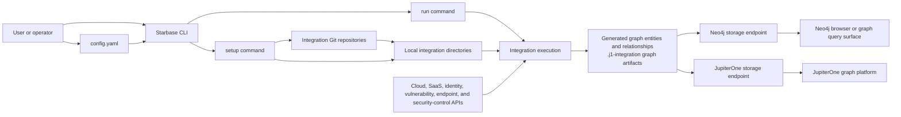
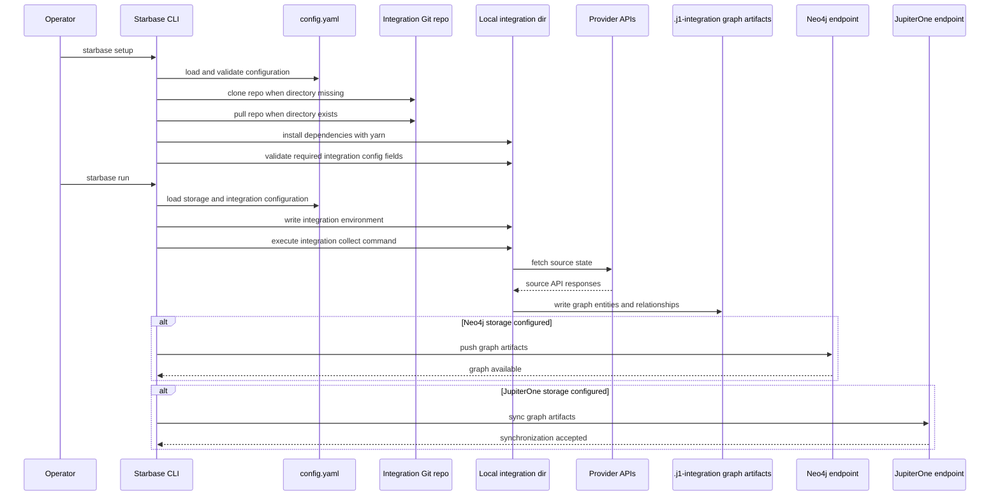
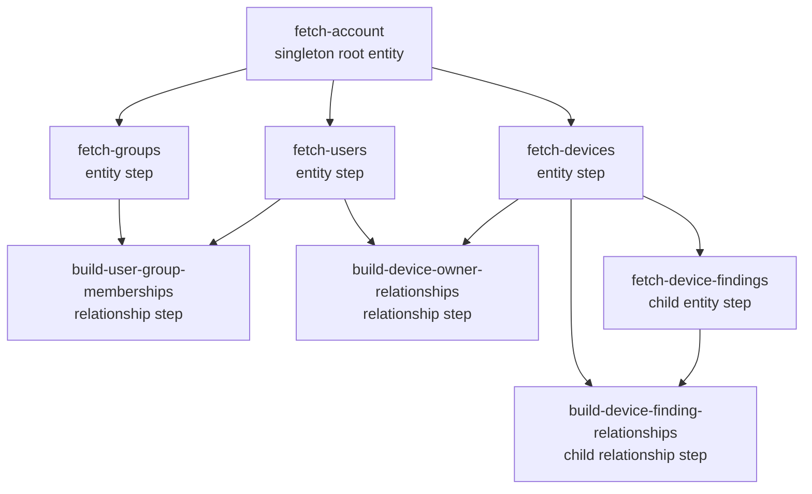
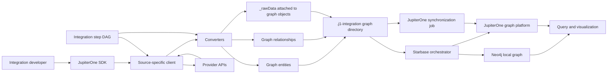
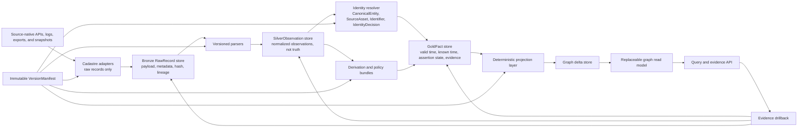

## 1. Executive Summary

- `reference`: Starbase is a useful reference for a local, operator-driven graph ingestion orchestrator: it clones or updates integration repositories, installs dependencies, runs integrations, and writes generated graph data to Neo4j or JupiterOne storage endpoints. Public evidence supports treating it as graph-output-oriented rather than lakehouse-fact-oriented. ([Starbase repository](https://github.com/jupiterone/starbase))

- `adapt`: The JupiterOne SDK’s integration step DAG, client/converter/step separation, and testing model are strong patterns for organizing source-specific collection logic, but Cadastre must change the output contract so adapters emit raw records only and later versioned stages produce silver, gold, and graph deltas. ([SDK integration development documentation](https://github.com/JupiterOne/sdk/blob/main/docs/integrations/development.md))

- `avoid`: JupiterOne’s SDK synchronization model asks integrations to collect the “new state of the world” and send graph objects for backend diffing and persistence. Cadastre must not adopt that as its authority model because its lakehouse is the system of record and graph state is a replaceable read model. ([SDK integration development documentation](https://github.com/JupiterOne/sdk/blob/main/docs/integrations/development.md))

- `adapt`: JupiterOne’s public data model provides a useful graph taxonomy: entities have `_class`, `_type`, and `_key`; classes group provider-specific types into abstract concepts; relationships use abstract classes such as `HAS`, `OWNS`, `USES`, `TRUSTS`, and `IMPACTS`. Cadastre may study this taxonomy, but it must not become Cadastre’s canonical silver or gold contract. ([JupiterOne data model documentation](https://docs.jupiterone.io/data-model/jupiterone-data-model))

- `avoid`: JupiterOne provider-scoped `_key` values and mapped-relationship target creation are graph synchronization mechanisms, not deterministic identity decisions. Cadastre must preserve separate `CanonicalEntity`, `SourceAsset`, `Identifier`, and `IdentityDecision` concepts, and must not auto-merge weak identity evidence such as IP-only or hostname-only matches. ([JupiterOne entity and relationship metadata documentation](https://docs.jupiterone.io/data-model/entity-relationship-metadata))

- `reference`: The SDK’s testing guidance is useful because it separates client tests, converter tests, step tests, and integration tests, and it uses expected graph output as a verification target. Cadastre should adapt this into golden corpus, replay, mapping-promotion, projection-determinism, and identity-regression gates. ([SDK testing documentation](https://github.com/JupiterOne/sdk/blob/main/docs/integrations/testing.md))

- `avoid`: Starbase and the SDK treat graph entities and relationships as primary integration outputs. Cadastre must instead treat raw evidence, silver observations, and gold bitemporal facts as authoritative persisted artifacts, with graph deltas derived deterministically from gold facts. ([Starbase integration source](https://raw.githubusercontent.com/JupiterOne/starbase/main/src/starbase/integration.ts))

- `unknown`: The historical public JupiterOne data model repository appears moved, private, or unavailable. Older documentation links to a GitHub repository that now returns 404; the SDK changelog also references a `JupiterOne/jupiter-data-model` pull request whose repository and pull request now return 404. Current public schema evidence is therefore the JupiterOne documentation, the exposed OpenAPI 3.1 schema, and SDK package dependencies rather than a public source repository. ([Historical JupiterOne data model documentation](https://docs.jupiterone.io/jupiterOne-data-model))

- `adapt`: JupiterOne’s global entities such as `Internet` and `Everyone` are useful modeling conveniences, but Cadastre must attach explicit semantics to any global node and must not let such nodes imply complete reachability, complete exposure, or universal identity scope. ([JupiterOne data model documentation](https://docs.jupiterone.io/data-model/jupiterone-data-model))

- `adapt`: JupiterOne metadata timestamps such as `_createdOn`, `_beginOn`, and `_endOn` help describe graph object lifecycle inside JupiterOne, but they are not a substitute for Cadastre’s required valid-time and known-time bitemporal fact intervals. ([JupiterOne entity and relationship metadata documentation](https://docs.jupiterone.io/data-model/entity-relationship-metadata))

Central architectural contrast:

> JupiterOne and Starbase appear graph-first and integration-synchronization-oriented. Cadastre must be temporal-fact-first, lakehouse-backed, deterministic, replayable, and graph-serving-oriented.

The inspected evidence supports this contrast. The qualification is that the JupiterOne SDK does retain source raw data in `_rawData` and staged `.j1-integration` artifacts, but that retention is part of graph-object collection and synchronization, not an independently authoritative bronze evidence lake with silver/gold derivation, replay manifests, and deterministic graph projection. ([SDK entity type source](https://raw.githubusercontent.com/JupiterOne/sdk/main/packages/integration-sdk-core/src/types/entity.ts))

## 2. Source Inventory and Freshness

Observation date: May 15, 2026.

Evidence classes used in this report:

| Evidence class | Meaning |
| --- | --- |
| Source-code fact | Observed in repository source, manifest, or raw file content. |
| Documentation fact | Observed in README, docs, or generated documentation. |
| Package or release fact | Observed in package manifests, changelog, or release pages. |
| Inference | Architectural reconstruction from multiple observed facts. |
| Cadastre implication | Design consequence compared against the Cadastre PRD and NLSpec standard. |

| Source | URL | Type | Last observed update or version | Evidence used | Reliability | Notes |
| --- | --- | ---: | --- | --- | --- | --- |
| Starbase repository | [GitHub repository page](https://github.com/jupiterone/starbase) | Repository | Latest release page reports `v0.10.0` on October 20, 2023. | Repository layout, top-level files, docs, source tree. | High for public repo state. | Public evidence suggests low recent maintenance, not abandonment. |
| Starbase README | [Repository README](https://github.com/jupiterone/starbase) | Documentation | README content current as rendered by GitHub at observation time. | Project purpose, integration list, setup/run commands, configuration shape. | High for stated project intent. | README positions Starbase around graph-based security analysis backed by Neo4j. |
| Starbase package and release metadata | [Starbase `package.json`](https://raw.githubusercontent.com/JupiterOne/starbase/main/package.json) | Package/release | Package version `0.10.0`; changelog includes releases through `0.10.0`. | Node engine, binary name, SDK dependency, release cadence. | High for repository state. | Manifest uses older SDK dependency range relative to current SDK repository manifests. |
| Starbase configuration and storage docs | [Starbase config example](https://raw.githubusercontent.com/JupiterOne/starbase/main/config.yaml.example) | Documentation and config | Current rendered docs. | `config.yaml`, integration declarations, Neo4j and JupiterOne storage endpoint config. | High for Starbase public configuration contract. | Supports local Neo4j and remote JupiterOne storage endpoints. |
| SDK repository | [SDK repository](https://github.com/JupiterOne/sdk) | Repository | Package manifests show `17.4.0`; changelog latest visible entry is `17.3.0` on March 19, 2026. | Monorepo layout, packages, README architecture. | High for public repo state; release freshness partly ambiguous. | Package manifests and changelog are not perfectly aligned in observed evidence. |
| SDK integration development docs | [Integration development docs](https://github.com/JupiterOne/sdk/blob/main/docs/integrations/development.md) | Documentation | Current rendered docs. | `IntegrationInvocationConfig`, validation, steps, dependency graph, hooks, execution overview. | High for public integration contract. | Docs are directly relevant to Cadastre adapter and source package design. |
| SDK step-pattern docs | [Step pattern documentation](https://github.com/JupiterOne/sdk/blob/main/docs/integrations/step-patterns.md) | Documentation | Current rendered docs. | Dependency graph model, singleton root step, fetch entity/relationship/child patterns. | High for architectural pattern. | Best treated as conceptual reference, not output contract. |
| SDK testing docs | [Testing documentation](https://github.com/JupiterOne/sdk/blob/main/docs/integrations/testing.md) | Documentation | Current rendered docs. | Client, converter, step, integration, and HTTP recording tests. | High for SDK testing guidance. | Cadastre needs stricter golden corpus and replay gates. |
| JupiterOne data model overview | [Current data model docs](https://docs.jupiterone.io/data-model/jupiterone-data-model) | Documentation | Current rendered docs expose OpenAPI 3.1 download. | Entity/relationship model, common properties, flexible model posture. | High for public conceptual model. | Documentation explicitly describes model as adaptable rather than strict or rigid. |
| JupiterOne entity relationship metadata | [Metadata documentation](https://docs.jupiterone.io/data-model/entity-relationship-metadata) | Documentation | Current rendered docs. | `_class`, `_type`, `_key`, `_id`, `_createdOn`, `_beginOn`, `_endOn`, `_deleted`, `_version`, `_source`, integration metadata. | High for public metadata semantics. | Important for identifying what Cadastre must not copy into its canonical fact model. |
| JupiterOne OpenAPI 3.1 data model schema | [Public generated OpenAPI schema](https://docs.jupiterone.io/assets/files/openapi-69de98b255a4d6e96c30bd1ec962b026.json) | Generated schema | OpenAPI `3.1.0`; schema title `JupiterOne DataModel`; version text `Version 1`. | Entity schemas, required fields, class-specific properties, global entities. | High for public schema shape; generated artifact. | Better evidence for concrete field names than prose docs. |
| Public `@jupiterone/data-model` package or repository evidence | [SDK core package manifest](https://raw.githubusercontent.com/JupiterOne/sdk/main/packages/integration-sdk-core/package.json) | Package dependency and access-limit evidence | SDK requires `@jupiterone/data-model >=0.62.0`; direct historical repo links returned 404. | Dependency metadata, changelog references, public repo availability checks. | Medium. | Direct public source repository was not accessible through inspected links. |
| Cadastre PRD baseline | `PRD-Cadastre.md` | Project baseline document | Draft uploaded May 15, 2026. | Lakehouse as system of record, raw/silver/gold/projection model, scope and non-scope. | High for this comparison. | Treated as governing comparison baseline supplied by user. |
| NLSpec standard | `nlspec-spec.md` | Project standard | Version `0.2.2`. | Behavioral completeness, interfaces, defaults, mappings, acceptance criteria. | High for report-to-spec implications. | Used to frame PRD/NLSpec implications, not to describe JupiterOne. |

Source limits:

- GitHub repository pages can omit hidden, generated, deleted, or branch-specific material. Repository conclusions are limited to publicly visible repository state at observation time.
- Public JupiterOne documentation is treated as authoritative for documented public semantics, but not as proof of internal JupiterOne implementation behavior.
- The public `JupiterOne/data-model` and `JupiterOne/jupiter-data-model` repository paths inspected through linked evidence returned 404. This report therefore uses current docs and OpenAPI schema instead of assuming the missing repository contents.
- Negative findings such as “not observed” mean “not observed in the inspected public repositories, docs, and schema artifacts.” They do not prove absence from JupiterOne’s private platform.

## 3. Starbase Repository Analysis

### 3.1 Project Purpose

Starbase is an open-source JupiterOne project that collects assets and relationships from cloud infrastructure, SaaS applications, security controls, and other systems into a graph view backed by Neo4j. The README frames the benefit as democratizing graph-based security analysis and giving teams an extensible, uniform data model for graph-oriented visibility. ([Starbase docs index](https://raw.githubusercontent.com/JupiterOne/starbase/main/docs/index.md))

The public integration list includes many cloud, SaaS, endpoint, identity, vulnerability, and security-control integrations, including Azure, Bitbucket, GitHub, Google Cloud, Google Workspace, Jira, Jamf, Okta, Qualys, Rapid7, Tenable.io, SentinelOne, and others. ([Starbase repository](https://github.com/jupiterone/starbase))

Starbase is positioned as both:

- a local graph analysis orchestrator, because it can collect integration data and push it into a local or remote Neo4j storage endpoint; and
- a JupiterOne ingestion bridge, because it also supports a JupiterOne storage endpoint with API key, account ID, and optional API base URL. ([Starbase Docker README](https://raw.githubusercontent.com/JupiterOne/starbase/main/docker/README.md))

Its relationship to Neo4j is direct: Neo4j is the primary documented local graph storage and visualization backend. Its relationship to JupiterOne-managed graph integrations is looser: Starbase runs open-source JupiterOne integration projects and can synchronize their outputs to JupiterOne, but the SDK documentation separately states that managed JupiterOne integrations run in JupiterOne infrastructure and use a managed runtime rather than the local CLI. ([Starbase Docker README](https://raw.githubusercontent.com/JupiterOne/starbase/main/docker/README.md))

### 3.2 Repository Layout

| Path or file | Purpose | Architectural relevance |
| --- | --- | --- |
| `README.md` | Project overview, integration list, setup/run commands, configuration example. ([Starbase repository](https://github.com/jupiterone/starbase)) | Defines public operator workflow and project posture. |
| `package.json` | Package metadata, Node engine, binary, dependencies, scripts. ([Starbase package manifest](https://raw.githubusercontent.com/JupiterOne/starbase/main/package.json)) | Shows Starbase as a Node CLI package named `@jupiterone/starbase`. |
| `config.yaml.example` | Example Starbase configuration with integrations and Neo4j storage. ([Starbase config example](https://raw.githubusercontent.com/JupiterOne/starbase/main/config.yaml.example)) | Defines configuration shape used by operator workflow. |
| `src/starbase/config.ts` | Configuration loading, validation, environment derivation. ([Starbase config source](https://raw.githubusercontent.com/JupiterOne/starbase/main/src/starbase/config.ts)) | Enforces required integration and storage config fields. |
| `src/starbase/types.ts` | Type definitions for integrations, storage, Neo4j config, JupiterOne config. ([Starbase types source](https://raw.githubusercontent.com/JupiterOne/starbase/main/src/starbase/types.ts)) | Exposes storage endpoint and integration contract shape. |
| `src/starbase/setup.ts` | Integration repository clone, update, dependency install, config validation. ([Starbase setup source](https://raw.githubusercontent.com/JupiterOne/starbase/main/src/starbase/setup.ts)) | Implements `setup` orchestration. |
| `src/starbase/execution.ts` | Runtime orchestration for storage env, integration execution, and post-run behavior. ([Starbase execution source](https://raw.githubusercontent.com/JupiterOne/starbase/main/src/starbase/execution.ts)) | Coordinates integration execution and storage. |
| `src/starbase/integration.ts` | Shell command construction for collect, Neo4j push, and JupiterOne sync. ([Starbase integration source](https://raw.githubusercontent.com/JupiterOne/starbase/main/src/starbase/integration.ts)) | Shows graph object output path and storage writes. |
| `src/cli/run.ts`, `src/cli/setup.ts`, `src/cli/wipe.ts` | CLI entrypoints. ([Starbase CLI tree](https://github.com/JupiterOne/starbase/tree/main/src/cli)) | Exposes operator-facing commands. |
| `docs/` | Installation, configuration, Docker, and integration docs. ([Starbase installation docs](https://raw.githubusercontent.com/JupiterOne/starbase/main/docs/installation.md)) | Documents external behavior and deployment modes. |
| `docker/`, `Dockerfile`, `docker-compose.yml` | Containerized Starbase and Neo4j workflow. ([Starbase Docker docs](https://raw.githubusercontent.com/JupiterOne/starbase/main/docs/docker.md)) | Supports local graph deployment and repeatable demos. |
| `bin/` | CLI binary wrapper area. ([Starbase repository](https://github.com/jupiterone/starbase)) | Package execution surface. |
| `yarn.lock` | Dependency lockfile. ([Starbase repository](https://github.com/jupiterone/starbase)) | Indicates package-manager state at repository snapshot. |
| Test files under `src/starbase` | Unit tests for config, execution, integration, setup, and logging. ([Starbase source tree](https://github.com/JupiterOne/starbase/tree/main/src/starbase)) | Evidence of internal contract tests around orchestration behavior. |
| `.github/workflows` | GitHub automation. ([Starbase repository](https://github.com/jupiterone/starbase)) | Repository operational automation; not central to product architecture. |

### 3.3 Runtime Architecture

The public runtime architecture can be reconstructed from the README, Docker docs, configuration docs, and source code. The evidence is explicit for config loading, repository clone/update, dependency install, integration execution, Neo4j push, and JupiterOne sync. The graph query and visualization surface is inferred from documented Neo4j browser behavior and JupiterOne platform synchronization. ([Starbase repository](https://github.com/jupiterone/starbase))

### 3.4 Configuration Model

Starbase reads a single `config.yaml` by default. Its integration config requires `name`, `instanceId`, and `directory`; optional `gitRemoteUrl` drives clone/update; nested `config` holds integration-specific fields. Storage config declares one or more storage engines, with documented Neo4j and JupiterOne shapes. ([Starbase types source](https://raw.githubusercontent.com/JupiterOne/starbase/main/src/starbase/types.ts))

| Config concept | Observed shape | Default or required behavior | Cadastre relevance |
| --- | --- | --- | --- |
| Config file | `config.yaml` at repository root or provided path. ([Starbase README](https://github.com/jupiterone/starbase)) | Default path is `config.yaml`; missing config throws. ([Starbase config source](https://raw.githubusercontent.com/JupiterOne/starbase/main/src/starbase/config.ts)) | Cadastre must define config file discovery, validation, and error behavior for source packages and deployment profiles. |
| Integration declaration | `name`, `instanceId`, `directory`, optional `gitRemoteUrl`, `config`. ([Starbase types source](https://raw.githubusercontent.com/JupiterOne/starbase/main/src/starbase/types.ts)) | `name`, `instanceId`, and `directory` are required by validation. ([Starbase config source](https://raw.githubusercontent.com/JupiterOne/starbase/main/src/starbase/config.ts)) | Useful as source-instance declaration pattern, but Cadastre must separate adapter config from parser, mapping, resolver, and projection versions. |
| Instance identifier | `instanceId`. ([Starbase types source](https://raw.githubusercontent.com/JupiterOne/starbase/main/src/starbase/types.ts)) | Used to execute and push integration data. ([Starbase integration source](https://raw.githubusercontent.com/JupiterOne/starbase/main/src/starbase/integration.ts)) | Cadastre should model source instance IDs explicitly, but must not let them become canonical entity IDs. |
| Integration repository | `directory` plus optional `gitRemoteUrl`. ([Starbase types source](https://raw.githubusercontent.com/JupiterOne/starbase/main/src/starbase/types.ts)) | `setup` clones if absent and pulls if present. ([Starbase setup source](https://raw.githubusercontent.com/JupiterOne/starbase/main/src/starbase/setup.ts)) | Cadastre may reuse package repository acquisition, but production package lifecycle must be versioned, signed, promoted, and replayable. |
| Integration-specific config | Arbitrary `config` object. ([Starbase types source](https://raw.githubusercontent.com/JupiterOne/starbase/main/src/starbase/types.ts)) | Required fields are checked against the integration’s `instanceConfigFields`. ([Starbase setup source](https://raw.githubusercontent.com/JupiterOne/starbase/main/src/starbase/setup.ts)) | Cadastre must define source contract validation and credential references, including redaction and secret handling. |
| Storage declaration | Array of storage config objects with `engine` and `config`. ([Starbase types source](https://raw.githubusercontent.com/JupiterOne/starbase/main/src/starbase/types.ts)) | Engine must be a supported storage engine. ([Starbase config source](https://raw.githubusercontent.com/JupiterOne/starbase/main/src/starbase/config.ts)) | Cadastre must keep graph storage replaceable and must not treat graph storage as authoritative. |
| Neo4j storage | `engine: neo4j`; `username`, `password`, `uri`, `database`. ([Starbase config example](https://raw.githubusercontent.com/JupiterOne/starbase/main/config.yaml.example)) | Local Docker defaults include user `neo4j` and password `devpass`; remote Neo4j config is supported. ([Starbase Docker README](https://raw.githubusercontent.com/JupiterOne/starbase/main/docker/README.md)) | Useful for local graph read-model prototyping only. |
| JupiterOne storage | `engine: jupiterone`; `apiKey`, `accountId`, optional `apiBaseUrl`. ([Starbase types source](https://raw.githubusercontent.com/JupiterOne/starbase/main/src/starbase/types.ts)) | `apiBaseUrl` defaults to the documented JupiterOne API base URL when omitted. ([Starbase config source](https://raw.githubusercontent.com/JupiterOne/starbase/main/src/starbase/config.ts)) | Cadastre must not copy hosted-platform synchronization assumptions unless a future connector spec explicitly defines them. |
| Setup command | `starbase setup`. ([Starbase README](https://github.com/jupiterone/starbase)) | Clones or updates repos and installs dependencies. ([Starbase setup source](https://raw.githubusercontent.com/JupiterOne/starbase/main/src/starbase/setup.ts)) | Useful source package preparation pattern. |
| Run command | `starbase run`. ([Starbase README](https://github.com/jupiterone/starbase)) | Runs integrations and pushes results to configured storage. ([Starbase execution source](https://raw.githubusercontent.com/JupiterOne/starbase/main/src/starbase/execution.ts)) | Cadastre run semantics must produce raw records and version manifests, not direct graph writes. |

### 3.5 Execution Flow

Explicit evidence:

- `setup` clones missing integration repositories, pulls existing repositories, runs `yarn install`, and validates required instance configuration fields. ([Starbase setup source](https://raw.githubusercontent.com/JupiterOne/starbase/main/src/starbase/setup.ts))
- `run` prepares storage environment, writes integration environment, executes integrations, and opens or logs a Neo4j browser URL for Neo4j-backed storage. ([Starbase execution source](https://raw.githubusercontent.com/JupiterOne/starbase/main/src/starbase/execution.ts))
- Integration execution uses SDK CLI commands: collect via `yarn start --disable-schema-validation`, Neo4j push via `j1-integration neo4j push`, and JupiterOne sync via `j1-integration sync`. ([Starbase integration source](https://raw.githubusercontent.com/JupiterOne/starbase/main/src/starbase/integration.ts))

Inferred flow:

- The diagram treats provider API fetching as part of integration execution because Starbase delegates source-specific collection to integration repositories rather than implementing provider clients itself.
- The diagram treats graph availability as a storage endpoint behavior because Neo4j browser and JupiterOne graph query surfaces are outside Starbase’s own source tree.

### 3.6 Storage and Graph Semantics

| Concern | Starbase observed behavior | Evidence | Cadastre implication |
| --- | --- | --- | --- |
| Graph as primary output | Starbase runs integrations and pushes generated graph entities and relationships to Neo4j or JupiterOne. | `integration.ts` invokes Neo4j push and JupiterOne sync commands. ([Starbase integration source](https://raw.githubusercontent.com/JupiterOne/starbase/main/src/starbase/integration.ts)) | Cadastre must not make graph output authoritative. Graph deltas must be derived from gold facts. |
| Raw evidence persistence | Docker docs mention raw API data collected in integration directories, but inspected Starbase evidence does not define a durable bronze raw-evidence store with payload hashes, retention, lineage, and permissions. | Docker flow says setup/run collect raw API data and sync graph data. ([Starbase Docker docs](https://raw.githubusercontent.com/JupiterOne/starbase/main/docs/docker.md)) | Cadastre must preserve raw evidence as a first-class system-of-record layer. |
| Silver normalization | Starbase delegates integration output to graph entities/relationships; no Starbase-level silver observation contract was observed. | Integration commands push or sync graph output. ([Starbase integration source](https://raw.githubusercontent.com/JupiterOne/starbase/main/src/starbase/integration.ts)) | Cadastre parsers and mapping bundles must be separate versioned stages. |
| Gold bitemporal facts | No Starbase public contract was observed for valid-time and known-time fact intervals. | Starbase config and execution docs center on integration collection and storage endpoints. ([Starbase repository](https://github.com/jupiterone/starbase)) | Cadastre must define gold facts independently of graph object metadata. |
| Deterministic replay | No Starbase public contract was observed for version manifests or byte-equivalent replay. | Package and execution code expose setup/run orchestration, not version-manifest replay. ([Starbase setup source](https://raw.githubusercontent.com/JupiterOne/starbase/main/src/starbase/setup.ts)) | Cadastre must require replay from persisted inputs and version manifests. |
| Evidence drillback | No Starbase public contract was observed for graph-to-gold-to-silver-to-raw evidence chains. | Storage commands submit graph artifacts. ([Starbase integration source](https://raw.githubusercontent.com/JupiterOne/starbase/main/src/starbase/integration.ts)) | Cadastre must preserve drillback as a graph serving invariant. |
| Conflict and ambiguity | No Starbase public contract was observed for first-class conflict, ambiguity, stale, superseded, or retracted assertion states. | Starbase public config and storage docs do not define these states. ([Starbase config example](https://raw.githubusercontent.com/JupiterOne/starbase/main/config.yaml.example)) | Cadastre must preserve these states in gold facts and graph deltas. |
| Storage neutrality | Starbase supports Neo4j and JupiterOne storage endpoints, but Neo4j is the documented local graph backend. | Storage docs define Neo4j and JupiterOne endpoints. ([Starbase Docker README](https://raw.githubusercontent.com/JupiterOne/starbase/main/docker/README.md)) | Cadastre may choose a graph engine later, but the PRD must remain graph-database-neutral. |

### 3.7 Maintenance and Operational Status

Public evidence suggests Starbase is usable as a conceptual reference but stale as an implementation base.

| Signal | Observed evidence | Assessment |
| --- | --- | --- |
| Latest release | GitHub releases show latest `v0.10.0` on October 20, 2023. ([Starbase releases](https://github.com/jupiterone/starbase)) | Stale by release cadence as of May 15, 2026. |
| Package version | `package.json` reports `0.10.0`; package description is “Orchestrator project for JupiterOne open source ingestion projects.” ([Starbase package manifest](https://raw.githubusercontent.com/JupiterOne/starbase/main/package.json)) | Aligns with latest release. |
| Changelog | Changelog includes `0.10.0` on October 20, 2023, and older releases back to 2021. ([Starbase changelog](https://raw.githubusercontent.com/JupiterOne/starbase/main/CHANGELOG.md)) | No public changelog evidence after 2023 was observed. |
| Issues | Public issue page showed 12 open issues, with visible open issues dating back to 2022 and 2023. ([Starbase issues](https://github.com/JupiterOne/starbase/issues)) | Public issue evidence suggests low current triage activity. |
| Pull requests | Public pull-request page showed three open PRs, visible from 2022 and 2023. ([Starbase pull requests](https://github.com/JupiterOne/starbase/pulls)) | Public PR evidence suggests limited recent contribution flow. |
| SDK dependency freshness | Starbase manifest depends on older SDK package ranges relative to current SDK manifests. ([Starbase package manifest](https://raw.githubusercontent.com/JupiterOne/starbase/main/package.json)) | Dependency freshness appears stale. |
| Archived status | The inspected GitHub page did not show an archived-state conclusion in the retrieved evidence. | Do not claim archived. Public evidence supports “stale or low maintenance,” not “abandoned.” |

## 4. JupiterOne SDK Analysis

### 4.1 Project Purpose

The JupiterOne SDK is a monorepo of packages that support integration development, execution, testing, validation, and synchronization. Its README states that integrations are structured as simple atomic steps executed in order, and that generated entities, relationships, and raw provider data are submitted to the JupiterOne synchronization system. ([JupiterOne SDK repository](https://github.com/JupiterOne/sdk))

The SDK provides:

- an integration framework based on `IntegrationInvocationConfig`, validation, execution configuration, integration steps, hooks, and step dependency graphs; ([SDK integration development documentation](https://github.com/JupiterOne/sdk/blob/main/docs/integrations/development.md))
- a CLI for local execution and integration generation; ([SDK CLI package](https://github.com/JupiterOne/sdk/tree/main/packages/integration-sdk-cli))
- entity and relationship construction helpers, including direct and mapped relationships; ([SDK createIntegrationEntity source](https://raw.githubusercontent.com/JupiterOne/sdk/main/packages/integration-sdk-core/src/data/createIntegrationEntity.ts))
- `JobState` facilities for storing, retrieving, and iterating entities and relationships during execution; ([SDK job state source](https://raw.githubusercontent.com/JupiterOne/sdk/main/packages/integration-sdk-core/src/types/jobState.ts))
- synchronization commands that validate and upload staged graph data from `.j1-integration/graph`; ([SDK integration development documentation](https://github.com/JupiterOne/sdk/blob/main/docs/integrations/development.md))
- testing utilities and guidance for clients, converters, steps, integration tests, and recorded HTTP responses. ([SDK testing documentation](https://github.com/JupiterOne/sdk/blob/main/docs/integrations/testing.md))

### 4.2 Repository Layout and Package Structure

The SDK is a monorepo with top-level `docs`, `integrations`, `packages`, and `snippets` areas. The root package manifest is private and uses workspaces for `packages/*`. ([JupiterOne SDK repository](https://github.com/JupiterOne/sdk))

| Path or package | Purpose | Cadastre relevance |
| --- | --- | --- |
| `docs/` | Integration development, step patterns, testing, CLI usage, and SDK guidance. ([SDK repository](https://github.com/JupiterOne/sdk)) | Strong source for source-package and adapter lifecycle design. |
| `packages/integration-sdk-core` | Core utilities and types exposed to integration developers. ([SDK core package](https://github.com/JupiterOne/sdk/tree/main/packages/integration-sdk-core)) | Useful reference for source package interfaces and graph object helpers. |
| `packages/integration-sdk-runtime` | Runtime code required to execute integrations. ([SDK runtime package](https://github.com/JupiterOne/sdk/tree/main/packages/integration-sdk-runtime)) | Useful reference for separating developer contract from runtime execution. |
| `packages/integration-sdk-cli` | CLI package used to generate and execute integrations locally. ([SDK CLI package](https://github.com/JupiterOne/sdk/tree/main/packages/integration-sdk-cli)) | Cadastre can reuse the concept of local package execution and validation. |
| `packages/integration-sdk-entities` | Entity-focused package area. ([SDK packages tree](https://github.com/JupiterOne/sdk/tree/main/packages)) | Relevant to graph-object construction, but Cadastre must not copy entity output as canonical facts. |
| `packages/integration-sdk-entity-validator` | Graph object validation package area. ([SDK packages tree](https://github.com/JupiterOne/sdk/tree/main/packages)) | Useful for graph projection validation patterns. |
| `packages/integration-sdk-testing` | Testing utilities package. ([SDK testing package](https://github.com/JupiterOne/sdk/tree/main/packages/integration-sdk-testing)) | Useful reference for Cadastre golden corpus and step tests. |
| `packages/integration-sdk-private-test-utils` | Private test utilities package area. ([SDK packages tree](https://github.com/JupiterOne/sdk/tree/main/packages)) | Public package boundary is unclear; do not rely on it without direct contract. |
| `packages/integration-sdk-http-client` | HTTP client package area. ([SDK packages tree](https://github.com/JupiterOne/sdk/tree/main/packages)) | Relevant as source client pattern. |
| `packages/integration-sdk-dev-tools` | Developer tooling package area. ([SDK packages tree](https://github.com/JupiterOne/sdk/tree/main/packages)) | Relevant to local validation and scaffolding. |
| `packages/integration-sdk-benchmark` | Benchmark package area. ([SDK packages tree](https://github.com/JupiterOne/sdk/tree/main/packages)) | Potential reference for performance gates. |
| `snippets/integrations` | Integration examples or snippets. ([SDK repository](https://github.com/JupiterOne/sdk)) | Useful for pattern study; not authoritative. |
| `integrations/` | Integration-related repository area. ([SDK repository](https://github.com/JupiterOne/sdk)) | Source-specific example material; must be inspected separately before deriving rules. |
| `lerna.json`, package manifests | Monorepo release and package metadata. ([SDK lerna manifest](https://raw.githubusercontent.com/JupiterOne/sdk/main/lerna.json)) | Shows current package versions and Node engine bounds. |

### 4.3 Integration Development Contract

| SDK concept | Observed contract | Observable behavior | Cadastre lesson |
| --- | --- | --- | --- |
| `IntegrationInvocationConfig` | Configuration object with validation, execution config, step start states, integration steps, hooks, concurrency, and ingestion config. ([SDK config type source](https://raw.githubusercontent.com/JupiterOne/sdk/main/packages/integration-sdk-core/src/types/config.ts)) | Defines the integration’s runtime contract. | Cadastre should define source package contracts with explicit inputs, outputs, defaults, and validation. |
| `instanceConfigFields` | Map of provider config and secret fields, including masking metadata. ([SDK integration development documentation](https://github.com/JupiterOne/sdk/blob/main/docs/integrations/development.md)) | Drives required configuration validation and secret handling. | Cadastre must require credential references and must not store secret values in raw, silver, gold, graph, manifest, or audit artifacts. |
| `validateInvocation` | Optional validation function for configuration and provider connectivity. ([SDK integration development documentation](https://github.com/JupiterOne/sdk/blob/main/docs/integrations/development.md)) | Invalid configuration can halt execution before collection. | Cadastre must separate config validation from source collection and record validation errors deterministically. |
| `loadExecutionConfig` | Optional loader invoked before validation and steps; values available in execution context. ([SDK integration development documentation](https://github.com/JupiterOne/sdk/blob/main/docs/integrations/development.md)) | Allows derived runtime configuration. | Cadastre must make execution config part of version manifests when it affects outputs. |
| Step start states | Optional `getStepStartStates`; default is all steps enabled; each step must have a state when supplied. ([SDK integration development documentation](https://github.com/JupiterOne/sdk/blob/main/docs/integrations/development.md)) | Supports selective enablement and runtime start-state decisions. | Cadastre may use step start states, but output eligibility must be governed by package lifecycle and manifest state. |
| Integration steps | Array of steps with `id`, `name`, `types`, handler, and dependencies. ([SDK integration development documentation](https://github.com/JupiterOne/sdk/blob/main/docs/integrations/development.md)) | Steps produce entities and relationships. | Cadastre adapter steps must produce raw records or source collection metadata, not silver/gold/graph objects. |
| Step dependencies | `dependsOn` determines partial datasets and execution order. ([SDK integration development documentation](https://github.com/JupiterOne/sdk/blob/main/docs/integrations/development.md)) | CLI builds dependency graph and executes leaf-capable steps. | Cadastre should define dependency DAG semantics for collection, parsing, and projection stages separately. |
| Hooks | `beforeAddEntity`, `beforeAddRelationship`, `afterExecution`. ([SDK integration development documentation](https://github.com/JupiterOne/sdk/blob/main/docs/integrations/development.md)) | Hooks can modify or observe graph object addition and post-execution behavior. | Cadastre should avoid arbitrary mutation hooks in production unless their version and output effects are manifest-recorded. |
| Execution wrapper | `executionHandlerWrapper` wraps each step’s execution handler. ([SDK integration development documentation](https://github.com/JupiterOne/sdk/blob/main/docs/integrations/development.md)) | Enables cross-cutting execution behavior. | Cadastre may use wrappers for tracing and metrics, but output mutations must remain deterministic. |
| Job state | `JobState` stores and retrieves entities, relationships, and arbitrary data during execution; ordering is not guaranteed under concurrency. ([SDK job state source](https://raw.githubusercontent.com/JupiterOne/sdk/main/packages/integration-sdk-core/src/types/jobState.ts)) | Dependent steps can access previously generated graph objects. | Cadastre must define ordering, deterministic IDs, and concurrency behavior when state affects outputs. |
| Entity construction | `createIntegrationEntity` validates and enriches entities using data model schema and stores raw source data in `_rawData`. ([SDK createIntegrationEntity source](https://raw.githubusercontent.com/JupiterOne/sdk/main/packages/integration-sdk-core/src/data/createIntegrationEntity.ts)) | Provider records become graph entities with embedded raw data. | Cadastre must split raw evidence preservation from normalized observation and graph construction. |
| Direct relationships | Relationship key and type are generated from source entity, target entity, and relationship class. ([SDK createIntegrationRelationship source](https://raw.githubusercontent.com/JupiterOne/sdk/main/packages/integration-sdk-core/src/data/createIntegrationRelationship.ts)) | Direct relationship edges are deterministic for the input graph objects. | Cadastre can study deterministic edge ID construction, but graph edges must derive from gold facts. |
| Mapped relationships | Relationships can target entities not known in the integration by target filters; target creation can occur unless skipped. ([SDK relationship type source](https://raw.githubusercontent.com/JupiterOne/sdk/main/packages/integration-sdk-core/src/types/relationship.ts)) | Mapped relationships support cross-integration linking. | Cadastre must not allow mapped relationships to bypass identity decisions or source authority rules. |
| Raw data handling | `_rawData` stores original provider data on graph objects; staged graph files are written under `.j1-integration`. ([SDK integration development documentation](https://github.com/JupiterOne/sdk/blob/main/docs/integrations/development.md)) | Raw data is retained in graph-object execution context. | Cadastre must preserve raw payloads as independent bronze records with hashes, retention, and access controls. |
| Synchronization | SDK validates and uploads staged graph entities and relationships to JupiterOne synchronization jobs. ([SDK integration development documentation](https://github.com/JupiterOne/sdk/blob/main/docs/integrations/development.md)) | Backend sync handles graph update workflow. | Cadastre must implement deterministic projection and graph apply from gold facts, not delegated remote diffing. |

### 4.4 “New State of the World” Synchronization

The SDK documentation states that integration developers should collect the “new state of the world” for each resource and relationship, submit it to JupiterOne, and let JupiterOne diff that state against its current understanding. ([SDK integration development documentation](https://github.com/JupiterOne/sdk/blob/main/docs/integrations/development.md))

| Topic | JupiterOne SDK model | Cadastre required model | Design consequence |
| --- | --- | --- | --- |
| Collection target | Integration collects provider state and emits graph entities and relationships. ([SDK repository](https://github.com/JupiterOne/sdk)) | Adapter must emit raw records only. | Cadastre source packages must not directly create graph state. |
| Raw data | Raw provider data may be attached to graph objects as `_rawData`. ([SDK entity type source](https://raw.githubusercontent.com/JupiterOne/sdk/main/packages/integration-sdk-core/src/types/entity.ts)) | Raw payloads must be preserved as bronze evidence with metadata, hashes, lineage, retention, and permissions. | Cadastre needs a separate evidence store, not only graph-object raw attachments. |
| Diffing | JupiterOne backend synchronization performs state comparison and persistence. ([SDK integration development documentation](https://github.com/JupiterOne/sdk/blob/main/docs/integrations/development.md)) | Cadastre must derive deterministic graph deltas from gold fact change sets. | Diffing becomes a local, replayable projection contract. |
| State authority | Graph synchronization is central to the SDK model. ([SDK repository](https://github.com/JupiterOne/sdk)) | Lakehouse is authoritative; graph is a replaceable read model. | Cadastre must preserve non-graph truth independently. |
| Time model | SDK graph metadata and data model metadata track object and provider timestamps. ([JupiterOne metadata documentation](https://docs.jupiterone.io/data-model/entity-relationship-metadata)) | Gold facts must carry valid-time and known-time intervals. | Timestamps must be redesigned as fact intervals, not graph lifecycle metadata. |
| Partial datasets | SDK uses step dependencies and partial dataset metadata to avoid unsafe deletion during sync. ([SDK integration development documentation](https://github.com/JupiterOne/sdk/blob/main/docs/integrations/development.md)) | Cadastre must mark partial collection explicitly and advance watermarks only when completeness is proven. | Cadastre must define source completeness and watermark rules per adapter contract. |
| Identity | SDK graph keys and mapped relationships support linking. ([SDK relationship type source](https://raw.githubusercontent.com/JupiterOne/sdk/main/packages/integration-sdk-core/src/types/relationship.ts)) | Cadastre identity decisions must be explicit, versioned, confidence-scored, and evidence-backed. | Cross-source linkage must be resolver output, not side effect of graph sync. |
| Replay | SDK staged graph artifacts support local execution and sync, but no Cadastre-style version manifest replay contract was observed. ([SDK integration development documentation](https://github.com/JupiterOne/sdk/blob/main/docs/integrations/development.md)) | Replay must use explicit version manifests and produce deterministic outputs. | Cadastre must specify reproducibility as a first-class acceptance criterion. |

### 4.5 Step Dependency Graph

The SDK step model is one of the strongest reusable patterns. SDK docs describe integration steps as nodes in a dependency graph, with best practice guidance that each step should collect one resource type or relationship type and, at most, one API endpoint. ([SDK step patterns documentation](https://github.com/JupiterOne/sdk/blob/main/docs/integrations/step-patterns.md))

Documented patterns include:

- singleton root node pattern for an account or tenant root;
- fetch entities pattern;
- fetch relationships pattern;
- fetch child entities pattern;
- build child relationships pattern. ([SDK step patterns documentation](https://github.com/JupiterOne/sdk/blob/main/docs/integrations/step-patterns.md))

Cadastre implications:

- Cadastre should adapt the DAG pattern for collection and transformation stages.
- Cadastre must define whether a step is a collection step, parser step, mapping step, resolver step, or projection step.
- Cadastre must define deterministic ordering when concurrency affects output.
- Cadastre must define failure isolation per layer. SDK guidance tolerates step failures without halting unrelated steps in some cases; Cadastre must define when partial outputs are allowed and when watermarks may advance. ([SDK integration development documentation](https://github.com/JupiterOne/sdk/blob/main/docs/integrations/development.md))

### 4.6 Entity and Relationship Construction

The SDK constructs graph objects around JupiterOne data model concepts.

| Construction concept | Observed JupiterOne behavior | Cadastre use |
| --- | --- | --- |
| Entity `_key` | Entity key is unique within an integration instance or data source scope. ([JupiterOne metadata documentation](https://docs.jupiterone.io/data-model/entity-relationship-metadata)) | Use only as `SourceAsset` or source-scoped identifier input, not canonical identity. |
| Entity `_type` | Entity type represents a provider-specific entity type. ([JupiterOne data model documentation](https://docs.jupiterone.io/data-model/jupiterone-data-model)) | Useful as source-native asset type hint or graph read-model type, not a gold fact type. |
| Entity `_class` | Entity class is an abstract higher-level category such as `Host`, `User`, or `DataStore`. ([JupiterOne data model documentation](https://docs.jupiterone.io/data-model/jupiterone-data-model)) | Useful taxonomy reference; Cadastre needs its own closed entity and fact model. |
| Display/name fields | Data model defines common display and description properties. ([JupiterOne data model documentation](https://docs.jupiterone.io/data-model/jupiterone-data-model)) | Useful for graph UI fields after projection. |
| Source property conversion | `createIntegrationEntity` validates properties and stores raw data in `_rawData`. ([SDK createIntegrationEntity source](https://raw.githubusercontent.com/JupiterOne/sdk/main/packages/integration-sdk-core/src/data/createIntegrationEntity.ts)) | Cadastre must split raw preservation, parsing, normalization, and projection. |
| Direct relationships | Relationship `_key` and `_type` are generated from endpoint keys and relationship class. ([SDK createIntegrationRelationship source](https://raw.githubusercontent.com/JupiterOne/sdk/main/packages/integration-sdk-core/src/data/createIntegrationRelationship.ts)) | Deterministic edge ID pattern is useful, but source fact IDs and valid/known intervals must be included. |
| Mapped relationships | Mapped relationships search for or create targets using target filters and direction. ([SDK relationship type source](https://raw.githubusercontent.com/JupiterOne/sdk/main/packages/integration-sdk-core/src/types/relationship.ts)) | Useful conceptually for unresolved cross-source links; dangerous if treated as identity resolution. |
| Global entities | Data model includes global entities such as `Internet` and `Everyone`. ([JupiterOne data model documentation](https://docs.jupiterone.io/data-model/jupiterone-data-model)) | May be modeled as structural graph nodes only with explicit semantics and evidence limits. |
| Relationship direction | Mapped relationships support forward and reverse direction. ([SDK relationship type source](https://raw.githubusercontent.com/JupiterOne/sdk/main/packages/integration-sdk-core/src/types/relationship.ts)) | Cadastre graph edge direction must be defined in the projection profile and acceptance criteria. |
| Target creation behavior | Mapped relationships may create target entities unless `skipTargetCreation` is true. ([SDK relationship type source](https://raw.githubusercontent.com/JupiterOne/sdk/main/packages/integration-sdk-core/src/types/relationship.ts)) | Cadastre must not create canonical entities through target matching without resolver output. |

Documentation inconsistency: one mapped-relationship docs excerpt says `skipTargetCreation` defaults false, but also says setting it false skips target creation; the source type definition says setting `skipTargetCreation` to true skips target creation. The source-code type definition is more reliable for this specific behavior. ([SDK integration development documentation](https://github.com/JupiterOne/sdk/blob/main/docs/integrations/development.md))

### 4.7 Testing Model

SDK testing guidance separates three components: clients, converters, and steps. It recommends testing data-source clients for API iteration/pagination, converters for graph object output, and integration steps for expected graph results. ([SDK testing documentation](https://github.com/JupiterOne/sdk/blob/main/docs/integrations/testing.md))

Additional testing patterns:

- Step tests can execute a step with dependencies through SDK testing utilities. ([SDK testing documentation](https://github.com/JupiterOne/sdk/blob/main/docs/integrations/testing.md))
- HTTP interactions can be recorded with Polly, and docs show request/response redaction hooks. ([SDK testing documentation](https://github.com/JupiterOne/sdk/blob/main/docs/integrations/testing.md))
- Converter tests assert generated graph object fields. ([SDK testing documentation](https://github.com/JupiterOne/sdk/blob/main/docs/integrations/testing.md))

Cadastre comparison:

| SDK testing pattern | Cadastre adaptation |
| --- | --- |
| Client tests | Adapter tests must prove source completeness, pagination, retry, watermark, and partial-result semantics. |
| Converter tests | Parser and mapping tests must prove raw-to-silver behavior and omission semantics, not graph output. |
| Step tests | Stage tests must cover adapter, parser, mapping, resolver, derivation, projection, and graph apply independently. |
| Integration tests | End-to-end tests must run raw-to-silver-to-gold-to-graph with version manifests. |
| Recorded responses | Golden corpus must include valid, malformed, unsupported, schema-variant, and redacted raw payload examples. |
| Expected graph output | Cadastre must also verify gold facts, evidence chains, graph deltas, replay determinism, and identity-resolution regressions. |

Cadastre’s uploaded PRD already requires golden corpus tests, shadow execution, replay, deterministic outputs, and replay manifests; SDK testing patterns should feed those requirements rather than replace them.

## 5. Public JupiterOne Data Model Analysis

### 5.1 Data Model Purpose

JupiterOne’s public data model is a graph taxonomy and schema reference. The documentation describes it as a reference model for digital resources and interconnections across ingested resources, represented as an entity-relationship graph. It explicitly says the model is not strict or rigid, and that teams can adapt it to their organizations. ([JupiterOne data model documentation](https://docs.jupiterone.io/data-model/jupiterone-data-model))

The model defines:

- entities as nodes or vertices;
- relationships as edges;
- entity `_type` as source-specific;
- entity `_class` as an abstract grouping;
- common properties across entities;
- relationship classes and relationship examples. ([JupiterOne data model documentation](https://docs.jupiterone.io/data-model/jupiterone-data-model))

Public schema artifacts observed:

- a current OpenAPI 3.1 schema titled `JupiterOne DataModel` with version text `Version 1`; ([JupiterOne OpenAPI schema](https://docs.jupiterone.io/assets/files/openapi-69de98b255a4d6e96c30bd1ec962b026.json))
- current public documentation pages for the data model and metadata; ([JupiterOne data model documentation](https://docs.jupiterone.io/data-model/jupiterone-data-model))
- SDK package manifests requiring `@jupiterone/data-model >=0.62.0`; ([SDK core package manifest](https://raw.githubusercontent.com/JupiterOne/sdk/main/packages/integration-sdk-core/package.json))
- inaccessible historical public repository links that return 404.

Conclusion: the public JupiterOne data model is best treated as a flexible graph taxonomy and public schema reference, not a strict canonical fact model suitable for direct adoption by Cadastre.

### 5.2 Entity Model

| JupiterOne field or concept | Meaning | Required? | Cadastre analogue | Cadastre difference |
| --- | --- | ---: | --- | --- |
| Entity as node or vertex | Represents a digital resource in the graph. ([JupiterOne data model documentation](https://docs.jupiterone.io/data-model/jupiterone-data-model)) | Yes conceptually. | Graph node read model. | Cadastre canonical truth is a gold fact store, not the node itself. |
| `_type` | Provider-specific entity type. ([JupiterOne data model documentation](https://docs.jupiterone.io/data-model/jupiterone-data-model)) | Required in metadata docs; required in many OpenAPI schemas. | Source-native asset type or graph node type. | Must not define Cadastre canonical identity or fact type. |
| `_class` | Abstract entity class such as `Host`, `DataStore`, or `User`. ([JupiterOne data model documentation](https://docs.jupiterone.io/data-model/jupiterone-data-model)) | Required in metadata docs; may be string or string array. | Candidate graph taxonomy class. | Cadastre must define its own node and fact classes. |
| `_key` | Unique key within integration instance or data source scope. ([JupiterOne metadata documentation](https://docs.jupiterone.io/data-model/entity-relationship-metadata)) | Required metadata. | Source-scoped `SourceAsset` key or identifier input. | Must not become `CanonicalEntity` ID. |
| `_id` | Globally unique JupiterOne entity identifier. ([JupiterOne metadata documentation](https://docs.jupiterone.io/data-model/entity-relationship-metadata)) | JupiterOne internal. | None as canonical. | Cadastre IDs must be product-owned and deterministic per Cadastre contracts. |
| `id` | Provider-scoped unique identifier in common properties. ([JupiterOne data model documentation](https://docs.jupiterone.io/data-model/jupiterone-data-model)) | Common property. | Source-native ID. | Cadastre must track source-native IDs separately from canonical identity. |
| `name`, `displayName`, `summary`, `description` | Common display and descriptive fields. ([JupiterOne data model documentation](https://docs.jupiterone.io/data-model/jupiterone-data-model)) | Common properties. | Display fields in graph read model. | Must be derived from gold/silver evidence with source authority. |
| `criticality`, `risk`, `trust` | Common 1-to-10 scoring or rating fields. ([JupiterOne data model documentation](https://docs.jupiterone.io/data-model/jupiterone-data-model)) | Optional common properties. | Risk, trust, criticality facts or projected properties. | Cadastre must define scoring policy bundles before emitting score facts. |
| `public`, `validated`, `temporary`, `trusted`, `active` | Common boolean state flags. ([JupiterOne data model documentation](https://docs.jupiterone.io/data-model/jupiterone-data-model)) | Optional common properties. | Assertion state or derived status facts. | Cadastre must preserve explicit states such as stale, ambiguous, conflicted, superseded, and retracted. |
| Source timestamps | `createdOn`, `updatedOn`, `deletedOn`, `discoveredOn`, and `expiresOn` source timestamps. ([JupiterOne data model documentation](https://docs.jupiterone.io/data-model/jupiterone-data-model)) | Optional common properties. | Observation time and fact valid time inputs. | Cadastre must distinguish source event time, valid time, known time, collected time, and ingested time. |
| Severity normalization | `j1_severity` normalizes finding severity while retaining original values. ([JupiterOne data model documentation](https://docs.jupiterone.io/data-model/jupiterone-data-model)) | Used for finding-like objects. | Normalized severity field in silver/gold. | Cadastre must define source-specific enum mappings and omission semantics. |
| Custom properties | Model permits source-specific or managed custom properties. ([Historical JupiterOne data model documentation](https://docs.jupiterone.io/jupiterOne-data-model)) | Flexible. | Source extension fields. | Cadastre must constrain extension fields so they do not become canonical truth without mapping. |

### 5.3 Relationship Model

JupiterOne relationships are graph edges between source and target entities. Public docs describe relationship `_class` values as mostly generic descriptive verbs, and relationship metadata uses the same metadata model as entities. ([Historical JupiterOne data model documentation](https://docs.jupiterone.io/jupiterOne-data-model))

Documented relationship classes and examples include:

| Relationship class or pattern | Publicly documented examples | Cadastre interpretation |
| --- | --- | --- |
| `HAS` / `CONTAINS` | Account has users, groups, access roles, and resources; host has vulnerabilities; network contains hosts. ([Historical JupiterOne data model documentation](https://docs.jupiterone.io/jupiterOne-data-model)) | Useful generic graph edge vocabulary; Cadastre must define exact edge semantics and evidence requirements. |
| `IS` / `OWNS` | Entity identity, ownership, and classification examples. ([Historical JupiterOne data model documentation](https://docs.jupiterone.io/jupiterOne-data-model)) | Must not imply canonical identity unless backed by `IdentityDecision`. |
| `EXPLOITS` / `IMPACTS` | Threat and vulnerability impact examples. ([Historical JupiterOne data model documentation](https://docs.jupiterone.io/jupiterOne-data-model)) | Useful for security graph semantics; requires source authority and temporal qualification. |
| `USES` | Usage and dependency relationships. ([Historical JupiterOne data model documentation](https://docs.jupiterone.io/jupiterOne-data-model)) | Useful as graph read-model edge class. |
| `CONNECTS`, `TRIGGERS`, `EXTENDS` | Connectivity and event-like relations. ([Historical JupiterOne data model documentation](https://docs.jupiterone.io/jupiterOne-data-model)) | Must distinguish observed traffic from theoretical reachability. |
| `IMPLEMENTS`, `MITIGATES`, `MANAGES` | Control and management relations. ([Historical JupiterOne data model documentation](https://docs.jupiterone.io/jupiterOne-data-model)) | Useful for control-plane modeling if source coverage is explicit. |
| `EVALUATES`, `MONITORS`, `PROTECTS` | Security tooling and coverage relations. ([Historical JupiterOne data model documentation](https://docs.jupiterone.io/jupiterOne-data-model)) | Useful for source coverage and control-state graph edges. |
| `TRUSTS`, `ASSIGNED`, `IDENTIFIED` | Trust, assignment, and identity-related relations. ([Historical JupiterOne data model documentation](https://docs.jupiterone.io/jupiterOne-data-model)) | High-risk for Cadastre unless evidence and resolver semantics are explicit. |
| `PROVIDES`, `CONTRIBUTES`, `OPENED`, `DEPLOYED TO` | Service, finding, issue, and deployment relations. ([Historical JupiterOne data model documentation](https://docs.jupiterone.io/jupiterOne-data-model)) | Useful taxonomy, but Cadastre must specify closed MVP edge tables. |
| Mapped relationships | SDK supports relationships to entities that may be produced by another integration or may be created as target placeholders. ([SDK relationship type source](https://raw.githubusercontent.com/JupiterOne/sdk/main/packages/integration-sdk-core/src/types/relationship.ts)) | Useful for linking unresolved targets, but dangerous without identity governance. |
| Global targets | `Internet` and `Everyone` are global graph entities. ([JupiterOne data model documentation](https://docs.jupiterone.io/data-model/jupiterone-data-model)) | May become structural nodes only with explicit evidence limits. |

Gap: the public docs provide many relationship examples and class conventions, but the inspected public documentation does not by itself fully define an exhaustive relationship contract for Cadastre-level acceptance criteria. Cadastre must define its own closed graph edge type table, directions, properties, evidence requirements, and temporal behavior.

### 5.4 Internal Metadata

| Metadata | JupiterOne meaning | Cadastre should copy? | Cadastre alternative |
| --- | --- | ---: | --- |
| `_class` | Abstract entity or relationship class; can be a string or string array for entities. ([JupiterOne metadata documentation](https://docs.jupiterone.io/data-model/entity-relationship-metadata)) | No as canonical. | Define Cadastre entity, fact, and graph node types separately. |
| `_type` | Source-specific object type. ([JupiterOne metadata documentation](https://docs.jupiterone.io/data-model/entity-relationship-metadata)) | No as canonical. | Preserve as source-native asset type or graph projection property. |
| `_key` | Key unique within integration instance or data source scope. ([JupiterOne metadata documentation](https://docs.jupiterone.io/data-model/entity-relationship-metadata)) | No. | Use deterministic Cadastre IDs; store provider keys as source identifiers. |
| `_id` | JupiterOne-global identifier. ([JupiterOne metadata documentation](https://docs.jupiterone.io/data-model/entity-relationship-metadata)) | No. | Use Cadastre-owned IDs with defined namespaces and hash inputs. |
| `_createdOn` | First creation time in JupiterOne after provider creation. ([JupiterOne metadata documentation](https://docs.jupiterone.io/data-model/entity-relationship-metadata)) | No. | Track `created_at` as persistence metadata, not valid time. |
| `_beginOn` | Time the latest version was created or last updated in JupiterOne. ([JupiterOne metadata documentation](https://docs.jupiterone.io/data-model/entity-relationship-metadata)) | No. | Use `known_from` for platform knowledge interval and `valid_from` for environment interval. |
| `_endOn` | Time a version was deleted in JupiterOne. ([JupiterOne metadata documentation](https://docs.jupiterone.io/data-model/entity-relationship-metadata)) | No. | Use `known_to`, `valid_to`, and explicit retraction or supersession state. |
| `_deleted` | Indicates entity was recently deleted from provider, graph, or CMDB. ([JupiterOne metadata documentation](https://docs.jupiterone.io/data-model/entity-relationship-metadata)) | No as a sole state. | Use explicit assertion states and fact interval closure. |
| `_version` | Increments on every captured configuration or attribute change. ([JupiterOne metadata documentation](https://docs.jupiterone.io/data-model/entity-relationship-metadata)) | No. | Use immutable fact records, version manifests, and projection versions. |
| `_source` | Source category of object creation such as integration-managed, powerup-managed, system-internal, system-mapper, or API. ([JupiterOne metadata documentation](https://docs.jupiterone.io/data-model/entity-relationship-metadata)) | Partially. | Define source category, source instance, adapter version, parser version, mapping bundle version, and source authority. |
| `_integrationClass` | Integration class such as provider, web, or app. ([JupiterOne metadata documentation](https://docs.jupiterone.io/data-model/entity-relationship-metadata)) | Partially. | Store as source package metadata only. |
| `_integrationType` | Provider type such as `aws`, `google`, `azure`, or `okta`. ([JupiterOne metadata documentation](https://docs.jupiterone.io/data-model/entity-relationship-metadata)) | Partially. | Store as source category/source instance metadata, not gold fact schema. |
| `_integrationName` | Integration display name. ([JupiterOne metadata documentation](https://docs.jupiterone.io/data-model/entity-relationship-metadata)) | Partially. | Store as source package and source instance metadata. |
| `_integrationDefinitionId` | Integration definition ID. ([JupiterOne metadata documentation](https://docs.jupiterone.io/data-model/entity-relationship-metadata)) | Partially. | Map to source package ID/version if imported. |
| `_integrationInstanceId` | Integration instance ID. ([JupiterOne metadata documentation](https://docs.jupiterone.io/data-model/entity-relationship-metadata)) | Partially. | Map to Cadastre `source_instance_id`. |

### 5.5 Data Model Coverage

| JupiterOne class | Cadastre candidate concept | Use as-is? | Required modification | Reason |
| --- | --- | ---: | --- | --- |
| `Host` | Canonical host or source asset host | No | Split into `CanonicalEntity`, `SourceAsset`, identifiers, and host facts. | JupiterOne `Host` is a graph node class; Cadastre needs identity decisions and bitemporal facts. |
| `Device` | Endpoint or managed device source asset | No | Treat as source asset type or canonical host subtype only after resolver decision. | Device/host distinctions vary by source. |
| `User` | Canonical user or source-native user asset | No | Separate source user records from canonical identity. | Identity must be evidence-backed and source-scoped. |
| `UserGroup` / `Group` | Group or authorization group | Partially | Define group types and membership validity intervals. | Membership is temporal and source-authority-sensitive. |
| `IpAddress` | IP address entity or identifier | No | Treat as temporal IP assignment fact or reusable IP resource depending on source. | JupiterOne OpenAPI says `IpAddress` is for re-assignable IP resources, not host-configured IPs. ([JupiterOne OpenAPI schema](https://docs.jupiterone.io/assets/files/openapi-69de98b255a4d6e96c30bd1ec962b026.json)) |
| `Network` | Network zone, subnet, or segment | Partially | Define CIDR, VLAN, zone, and source authority semantics. | Network grouping semantics vary by source. |
| `NetworkEndpoint` | Network service, endpoint, listener, mount target, VPN endpoint | Partially | Define protocol, address, port, owner, and observed vs configured state. | Endpoint semantics need precise observable contracts. |
| `Firewall` | Firewall device, service, or policy source asset | Partially | Separate firewall asset from firewall policy, rule, and observed flow facts. | Cadastre must not infer theoretical reachability from observed traffic alone. |
| `Finding` | Security finding or control finding | Partially | Split vulnerability, control, compliance, and detection findings. | Different source authority and staleness rules apply. |
| `Vulnerability` | CVE or vulnerability concept | Partially | Define vulnerability presence, absence, scan coverage, status, and remediation evidence. | Absence without scan coverage must remain unknown in Cadastre. |
| `Weakness` | CWE or weakness concept | Partially | Model as weakness taxonomy node or finding attribute. | Requires mapping to vulnerability/finding semantics. |
| `CodeModule` | Software package, library, or code module | Partially | Define software package identity, installed software fact, and code artifact scope. | Host-installed software and code dependency graphs differ. |
| `Application` | Business application or app/service entity | Partially | Define application ownership, support relation, and confidence. | App ownership is a Cadastre product/governance decision. |
| `DataStore` | Data store, storage system, bucket, database | Partially | Define source asset, canonical data store, and exposure facts separately. | Storage/data risk requires evidence and policy context. |
| `Account` | Cloud account, SaaS tenant, directory tenant | Partially | Model as source scope or asset container with explicit tenant/source semantics. | Account may be an identity boundary, billing scope, or provider scope. |
| `AccessRole` | Role or entitlement container | Partially | Define privileges, assignments, and effective access facts. | Access semantics require source-specific interpretation. |
| `AccessPolicy` | Policy document or access-control policy | Partially | Preserve source policy and derive normalized access facts only through explicit mappings. | Policy language semantics are provider-specific. |
| `Internet` | Global external network node | Study only | Define as structural graph node with explicit meaning. | Must not imply complete reachability or exposure. |
| `Everyone` | Global user-group-like node | Study only | Define as structural identity-scope node only if needed. | Must not imply actual membership evidence. |
| `Workload` | Cloud or runtime workload | Partially | Map to host, container, service, or workload canonical types based on source. | Workload identity differs from host identity. |
| `Resource` | Generic resource class | No | Avoid as canonical MVP type unless explicitly bounded. | Overly generic taxonomy weakens acceptance criteria. |
| `Control` / `ControlPolicy` | Control definition or control policy | Partially | Define control state facts and evaluation coverage. | Cadastre needs explicit pass/fail/unknown semantics. |
| `Scanner` | Vulnerability or security scanner | Partially | Model as source or control asset with coverage facts. | Scanner presence does not prove scan coverage for every asset. |

### 5.6 Data Model Gaps for Cadastre

| Cadastre requirement | Public JupiterOne evidence | Gap assessment |
| --- | --- | --- |
| Bitemporal valid time and known time | JupiterOne metadata docs define `_createdOn`, `_beginOn`, `_endOn`, and provider source timestamps. ([JupiterOne metadata documentation](https://docs.jupiterone.io/data-model/entity-relationship-metadata)) | Inspected public model does not define Cadastre-style gold fact intervals `[valid_from, valid_to)` and `[known_from, known_to)`. |
| Raw evidence lineage | SDK entities include `_rawData`, and local graph data is staged in `.j1-integration`. ([SDK entity type source](https://raw.githubusercontent.com/JupiterOne/sdk/main/packages/integration-sdk-core/src/types/entity.ts)) | This is not equivalent to a bronze evidence chain with raw metadata, payload hash, retention, permissions, and drillback. |
| Source authority | Data model has common fields such as trust, risk, criticality, and integration metadata. ([JupiterOne data model documentation](https://docs.jupiterone.io/data-model/jupiterone-data-model)) | No inspected public contract defines Cadastre-style source authority profiles for fact arbitration. |
| Confidence and confidence bands | Public model includes risk/trust/criticality, but no inspected public schema defined Cadastre-style confidence bands for facts and identity decisions. ([JupiterOne data model documentation](https://docs.jupiterone.io/data-model/jupiterone-data-model)) | Cadastre must define confidence separately. |
| Omission semantics | Public model allows flexible custom properties and many optional fields. ([Historical JupiterOne data model documentation](https://docs.jupiterone.io/jupiterOne-data-model)) | No inspected public contract distinguishes absent, empty, explicit null, malformed, not applicable, not observed, and unknown. |
| Canonical entity vs source asset distinction | JupiterOne graph objects use provider-scoped `_key`, `_type`, `_class`, and `_id`. ([JupiterOne metadata documentation](https://docs.jupiterone.io/data-model/entity-relationship-metadata)) | Cadastre must preserve `CanonicalEntity`, `SourceAsset`, `Identifier`, and `IdentityDecision` separately. |
| Deterministic identity decisions | SDK supports mapped relationships and target matching/creation. ([SDK relationship type source](https://raw.githubusercontent.com/JupiterOne/sdk/main/packages/integration-sdk-core/src/types/relationship.ts)) | Mapped target matching is not a substitute for identity decision records with evidence and negative-evidence handling. |
| Conflict and ambiguity states | JupiterOne common fields include status-like flags such as active, temporary, trusted, and `_deleted`. ([JupiterOne data model documentation](https://docs.jupiterone.io/data-model/jupiterone-data-model)) | Inspected public model does not define Cadastre assertion states such as conflicted, ambiguous, superseded, and retracted as fact states. |
| Replay and version manifest support | SDK can stage graph data and synchronize jobs; Starbase can run and push outputs. ([SDK integration development documentation](https://github.com/JupiterOne/sdk/blob/main/docs/integrations/development.md)) | Inspected public evidence does not define immutable version manifests and deterministic replay across raw/silver/gold/projection. |
| Deterministic graph deltas | SDK constructs deterministic relationship keys for direct relationships. ([SDK createIntegrationRelationship source](https://raw.githubusercontent.com/JupiterOne/sdk/main/packages/integration-sdk-core/src/data/createIntegrationRelationship.ts)) | Cadastre needs graph deltas derived from gold fact changes, not direct integration graph emission. |
| Graph database neutrality | JupiterOne model is graph-oriented, and Starbase local storage is Neo4j-backed. ([Starbase docs index](https://raw.githubusercontent.com/JupiterOne/starbase/main/docs/index.md)) | Cadastre must keep the graph engine replaceable by contract. |
| Evidence drillback and raw-payload redaction | SDK uses `_rawData`; Cadastre PRD requires raw payload access controls and evidence chains. ([SDK entity type source](https://raw.githubusercontent.com/JupiterOne/sdk/main/packages/integration-sdk-core/src/types/entity.ts)) | Cadastre must define raw payload redaction and drillback as user-facing API behavior. |

## 6. Cross-Repository Architecture Synthesis

The end-to-end JupiterOne-style architecture visible from public Starbase, SDK, and data model evidence is:

1. An integration developer writes a source-specific integration using SDK contracts.
2. The integration collects provider state.
3. Client and converter logic maps provider records to JupiterOne entities and relationships.
4. Integration steps organize collection and relationship creation through a dependency graph.
5. SDK CLI or runtime writes staged graph artifacts and submits them for synchronization.
6. Starbase can orchestrate open-source integrations and push graph output to Neo4j or JupiterOne.
7. Users query or visualize graph state through Neo4j or JupiterOne surfaces.

This architecture is documented and implemented across SDK README, SDK development docs, SDK sync docs, Starbase docs, and Starbase source. ([JupiterOne SDK repository](https://github.com/JupiterOne/sdk))

| Pattern | Evidence | Strength | Weakness | Cadastre relevance |
| --- | --- | --- | --- | --- |
| Graph-first ingestion | SDK integrations emit graph entities and relationships; Starbase pushes graph artifacts. ([SDK repository](https://github.com/JupiterOne/sdk)) | Direct path to operational graph visibility. | Collapses adapter output and graph projection if copied. | Study only; Cadastre must be fact-first. |
| Integration step DAG | SDK docs define step dependencies and execution graph. ([SDK integration development documentation](https://github.com/JupiterOne/sdk/blob/main/docs/integrations/development.md)) | Clear orchestration and partial dataset boundaries. | Needs deterministic ordering and layer separation for Cadastre. | Adapt with new contract. |
| Source-specific converters | Testing docs separate clients, converters, and steps. ([SDK testing documentation](https://github.com/JupiterOne/sdk/blob/main/docs/integrations/testing.md)) | Good modularity and testability. | Current converter target is graph objects. | Adapt into parser and mapping bundle contracts. |
| Abstract entity classes | Data model distinguishes `_type` and `_class`. ([JupiterOne data model documentation](https://docs.jupiterone.io/data-model/jupiterone-data-model)) | Good taxonomy for cross-provider graph queries. | Flexible taxonomy may be too loose for acceptance criteria. | Adapt for graph projection only. |
| Typed relationship conventions | Public docs describe relationship classes and examples. ([Historical JupiterOne data model documentation](https://docs.jupiterone.io/jupiterOne-data-model)) | Provides reusable relationship vocabulary. | Relationship semantics are not exhaustive enough for Cadastre contracts. | Study and map into closed edge tables. |
| Provider-scoped keys | `_key` unique in integration instance or source scope. ([JupiterOne metadata documentation](https://docs.jupiterone.io/data-model/entity-relationship-metadata)) | Practical for graph sync. | Dangerous if treated as canonical identity. | Use as source identifier only. |
| Mapped relationships | SDK supports target matching and optional target creation. ([SDK relationship type source](https://raw.githubusercontent.com/JupiterOne/sdk/main/packages/integration-sdk-core/src/types/relationship.ts)) | Useful for cross-integration linking. | Can create weak or implicit identity links. | Adapt only with resolver and evidence controls. |
| Global graph entities | `Internet` and `Everyone` are public data model entities. ([JupiterOne data model documentation](https://docs.jupiterone.io/data-model/jupiterone-data-model)) | Useful as query anchors. | Can overstate reachability or identity scope. | Study only; define explicit semantics. |
| Hosted synchronization/diffing | SDK docs say JupiterOne diffs submitted state against current understanding. ([SDK integration development documentation](https://github.com/JupiterOne/sdk/blob/main/docs/integrations/development.md)) | Simplifies integration implementation. | Conflicts with Cadastre replayable lakehouse authority. | Reject as Cadastre authority model. |
| Graph query as operational surface | Starbase and JupiterOne expose graph query/visualization surfaces. ([Starbase docs index](https://raw.githubusercontent.com/JupiterOne/starbase/main/docs/index.md)) | Strong analyst experience. | Query behavior may become unreproducible if graph is authority. | Reuse graph serving concept with deterministic projection. |
| Flexible reference data model | JupiterOne docs say model is adaptable, not strict or rigid. ([JupiterOne data model documentation](https://docs.jupiterone.io/data-model/jupiterone-data-model)) | Helps cover many source domains. | Insufficient for NLSpec-level binary acceptance without tighter tables. | Use for taxonomy research, not canonical contract. |

## 7. What Existing Graph-Security Projects Already Do

| Capability | Starbase | JupiterOne SDK | JupiterOne data model | Cadastre implication |
| --- | --- | --- | --- | --- |
| Multi-source graph ingestion | Orchestrates multiple open-source integrations. ([Starbase repository](https://github.com/jupiterone/starbase)) | Framework supports integrations that collect provider state. ([SDK repository](https://github.com/JupiterOne/sdk)) | Provides cross-source graph taxonomy. ([JupiterOne data model documentation](https://docs.jupiterone.io/data-model/jupiterone-data-model)) | Cadastre can study breadth, but must preserve raw/silver/gold layers. |
| Cloud/SaaS/security-control integrations | README lists cloud, SaaS, identity, vulnerability, and endpoint integrations. ([Starbase repository](https://github.com/jupiterone/starbase)) | SDK supports integration development. ([SDK integration development documentation](https://github.com/JupiterOne/sdk/blob/main/docs/integrations/development.md)) | Classes cover many asset and security domains. ([JupiterOne data model documentation](https://docs.jupiterone.io/data-model/jupiterone-data-model)) | Useful source-category inventory. |
| Entity/relationship normalization | Integrations generate entities and relationships. ([Starbase integration source](https://raw.githubusercontent.com/JupiterOne/starbase/main/src/starbase/integration.ts)) | Helpers create and validate graph objects. ([SDK createIntegrationEntity source](https://raw.githubusercontent.com/JupiterOne/sdk/main/packages/integration-sdk-core/src/data/createIntegrationEntity.ts)) | Defines entity and relationship classes. ([Historical JupiterOne data model documentation](https://docs.jupiterone.io/jupiterOne-data-model)) | Cadastre normalization target must be silver observations and gold facts, not graph objects. |
| Graph visualization/querying | Neo4j-backed graph view is central. ([Starbase docs index](https://raw.githubusercontent.com/JupiterOne/starbase/main/docs/index.md)) | CLI can visualize local graph artifacts. ([SDK integration development documentation](https://github.com/JupiterOne/sdk/blob/main/docs/integrations/development.md)) | Graph taxonomy supports graph query semantics. ([JupiterOne data model documentation](https://docs.jupiterone.io/data-model/jupiterone-data-model)) | Reuse as serving-layer concept. |
| Integration SDK | Not the SDK, but depends on SDK-based integrations. ([Starbase package manifest](https://raw.githubusercontent.com/JupiterOne/starbase/main/package.json)) | Primary capability. ([SDK repository](https://github.com/JupiterOne/sdk)) | Consumed by SDK through data model package. ([SDK core package manifest](https://raw.githubusercontent.com/JupiterOne/sdk/main/packages/integration-sdk-core/package.json)) | Cadastre needs its own adapter/parser/mapping SDK. |
| Integration configuration | `config.yaml` integrations and storage. ([Starbase config example](https://raw.githubusercontent.com/JupiterOne/starbase/main/config.yaml.example)) | `instanceConfigFields` and validation. ([SDK integration development documentation](https://github.com/JupiterOne/sdk/blob/main/docs/integrations/development.md)) | Integration metadata fields exist. ([JupiterOne metadata documentation](https://docs.jupiterone.io/data-model/entity-relationship-metadata)) | Define source instance, package, credential, and version manifests. |
| Step dependency graph | Delegated to integrations. | Core SDK pattern. ([SDK integration development documentation](https://github.com/JupiterOne/sdk/blob/main/docs/integrations/development.md)) | Not a data model feature. | Adapt strongly. |
| Entity classes | Uses SDK/J1 output. | Validates entities through data model. ([SDK createIntegrationEntity source](https://raw.githubusercontent.com/JupiterOne/sdk/main/packages/integration-sdk-core/src/data/createIntegrationEntity.ts)) | Core feature. ([JupiterOne data model documentation](https://docs.jupiterone.io/data-model/jupiterone-data-model)) | Use as taxonomy reference only. |
| Relationship classes | Uses SDK/J1 output. | Uses `RelationshipClass` in construction helpers. ([SDK createIntegrationRelationship source](https://raw.githubusercontent.com/JupiterOne/sdk/main/packages/integration-sdk-core/src/data/createIntegrationRelationship.ts)) | Core feature. ([Historical JupiterOne data model documentation](https://docs.jupiterone.io/jupiterOne-data-model)) | Map into Cadastre edge types with stronger semantics. |
| Mapped relationships | Runs integrations that may create them. | Explicit SDK feature. ([SDK relationship type source](https://raw.githubusercontent.com/JupiterOne/sdk/main/packages/integration-sdk-core/src/types/relationship.ts)) | Related to cross-entity graph linking. | Adapt only with identity governance. |
| Provider state synchronization | Syncs to JupiterOne endpoint if configured. ([Starbase Docker README](https://raw.githubusercontent.com/JupiterOne/starbase/main/docker/README.md)) | Core model: submit new state for backend diff. ([SDK integration development documentation](https://github.com/JupiterOne/sdk/blob/main/docs/integrations/development.md)) | Metadata tracks source and integration. ([JupiterOne metadata documentation](https://docs.jupiterone.io/data-model/entity-relationship-metadata)) | Reject as Cadastre authority model. |
| Graph object validation | Uses SDK CLI push/sync commands. ([Starbase integration source](https://raw.githubusercontent.com/JupiterOne/starbase/main/src/starbase/integration.ts)) | Entity validator and schema validation. ([SDK createIntegrationEntity source](https://raw.githubusercontent.com/JupiterOne/sdk/main/packages/integration-sdk-core/src/data/createIntegrationEntity.ts)) | OpenAPI/schema model. ([JupiterOne OpenAPI schema](https://docs.jupiterone.io/assets/files/openapi-69de98b255a4d6e96c30bd1ec962b026.json)) | Cadastre must validate raw, silver, gold, and graph delta layers separately. |
| Testing utilities | Repository has orchestration tests. ([Starbase source tree](https://github.com/JupiterOne/starbase/tree/main/src/starbase)) | Dedicated testing package and docs. ([SDK testing package](https://github.com/JupiterOne/sdk/tree/main/packages/integration-sdk-testing)) | Schema can support validation tests. | Adapt into golden corpus and replay acceptance. |
| Neo4j-backed local graph | Primary local backend. ([Starbase Docker README](https://raw.githubusercontent.com/JupiterOne/starbase/main/docker/README.md)) | CLI supports Neo4j push. ([Starbase integration source](https://raw.githubusercontent.com/JupiterOne/starbase/main/src/starbase/integration.ts)) | Graph model is technology-agnostic conceptually. | Study for prototype only. |
| Hosted JupiterOne endpoint | Supported storage endpoint. ([Starbase Docker README](https://raw.githubusercontent.com/JupiterOne/starbase/main/docker/README.md)) | Sync endpoint workflow. ([SDK integration development documentation](https://github.com/JupiterOne/sdk/blob/main/docs/integrations/development.md)) | Integration metadata represents J1 platform context. | Do not embed hosted sync assumptions. |
| Global entities | Uses model if emitted. | SDK docs expose Internet/Everyone mapped targets. ([SDK integration development documentation](https://github.com/JupiterOne/sdk/blob/main/docs/integrations/development.md)) | Data model defines `Internet` and `Everyone`. ([JupiterOne data model documentation](https://docs.jupiterone.io/data-model/jupiterone-data-model)) | Study with explicit semantics. |
| Metadata conventions | Uses SDK/J1 graph objects. | Generates graph object metadata. ([SDK createIntegrationRelationship source](https://raw.githubusercontent.com/JupiterOne/sdk/main/packages/integration-sdk-core/src/data/createIntegrationRelationship.ts)) | Defines internal metadata. ([JupiterOne metadata documentation](https://docs.jupiterone.io/data-model/entity-relationship-metadata)) | Translate, do not inherit wholesale. |

## 8. Where Cadastre Must Differ

Cadastre’s PRD defines a temporal lakehouse with raw/bronze, silver, gold, deterministic projection, and graph serving. It explicitly states that the lakehouse is the system of record and the graph is a replaceable read model.

| Area | JupiterOne/Starbase observed approach | Cadastre required approach | Why Cadastre must differ | PRD/NLSpec implication |
| --- | --- | --- | --- | --- |
| System of record | SDK and Starbase are graph-output and synchronization-oriented: integrations generate entities and relationships and sync or push them. ([SDK repository](https://github.com/JupiterOne/sdk)) | Temporal lakehouse is authoritative; graph is replaceable read model. | Cadastre must support replay, audit, evidence preservation, and graph replacement. | PRD must keep `RawRecord`, `SilverObservation`, `GoldFact`, and `GraphDelta` as separate contracts. |
| Temporal model | JupiterOne metadata defines graph/object lifecycle timestamps and provider timestamps. ([JupiterOne metadata documentation](https://docs.jupiterone.io/data-model/entity-relationship-metadata)) | Every gold fact must carry valid-time and known-time intervals. | Object lifecycle time is not enough for late-arriving data, corrections, and historical truth. | NLSpec must define interval closure, correction, retraction, and query time semantics. |
| Evidence lineage | SDK can attach `_rawData` to graph objects. ([SDK entity type source](https://raw.githubusercontent.com/JupiterOne/sdk/main/packages/integration-sdk-core/src/types/entity.ts)) | Cadastre must preserve raw evidence metadata, silver observations, gold facts, and graph drillback. | Embedded raw data is not a governed evidence chain. | Evidence chain API must be normative and testable. |
| Identity resolution | JupiterOne graph keys and mapped relationships support graph linking. ([JupiterOne metadata documentation](https://docs.jupiterone.io/data-model/entity-relationship-metadata)) | Cadastre must separate canonical entities, source assets, identifiers, and identity decisions. | Provider keys and mapped targets can create false merges if treated as identity. | Resolver spec must prohibit IP-only, hostname-only, DNS-only, and PTR-only auto-merge. |
| Normalization target | JupiterOne integrations normalize provider data into graph entities and relationships. ([SDK createIntegrationEntity source](https://raw.githubusercontent.com/JupiterOne/sdk/main/packages/integration-sdk-core/src/data/createIntegrationEntity.ts)) | Cadastre must normalize raw records into silver observations, then derive gold facts. | Graph shape is not a stable canonical data model. | Cadastre must define silver observation envelopes and gold fact schemas independently of JupiterOne `_class`, `_type`, and `_key`. |
| Adapter model | SDK integrations create graph entities and relationships. ([SDK repository](https://github.com/JupiterOne/sdk)) | Cadastre adapters must emit raw records only. | Direct graph emission bypasses evidence preservation and versioned transformations. | Adapter acceptance criteria must fail any adapter that emits silver, gold, or graph deltas. |
| Projection | JupiterOne sync delegates diffing to JupiterOne; Starbase pushes to Neo4j or J1. ([SDK integration development documentation](https://github.com/JupiterOne/sdk/blob/main/docs/integrations/development.md)) | Cadastre must generate deterministic graph deltas from gold facts. | Graph state must be rebuildable and reproducible. | Projection spec must define deterministic IDs, ordering, watermarks, retries, and apply failure behavior. |
| Conflict and stale state | Public JupiterOne model exposes status-like fields and `_deleted`, but no inspected public contract for Cadastre assertion states. ([JupiterOne data model documentation](https://docs.jupiterone.io/data-model/jupiterone-data-model)) | Cadastre must preserve conflicted, ambiguous, stale, superseded, and retracted assertions. | Security asset truth is often partial, stale, or contradictory. | PRD must keep assertion states visible in graph query and evidence APIs. |
| Graph database neutrality | Starbase’s documented local backend is Neo4j, with JupiterOne as remote endpoint. ([Starbase Docker README](https://raw.githubusercontent.com/JupiterOne/starbase/main/docker/README.md)) | Cadastre must not require a specific graph database. | Graph engine selection must not affect canonical truth or replay. | Graph node/edge schema must be logical and portable. |
| Operational governance | SDK has testing utilities and releases; Starbase has setup/run but no inspected Cadastre-style promotion lifecycle. ([SDK testing documentation](https://github.com/JupiterOne/sdk/blob/main/docs/integrations/testing.md)) | Cadastre must require versioned packages, golden corpus, shadow execution, replay, promotion, rollback, and health telemetry. | Without governance, source mapping changes can silently change truth. | Package lifecycle and version manifest specs must be first-class. |
| Raw payload and security | SDK stores raw provider data on graph objects as `_rawData`. ([SDK entity type source](https://raw.githubusercontent.com/JupiterOne/sdk/main/packages/integration-sdk-core/src/types/entity.ts)) | Cadastre must support raw-payload redaction and evidence permission boundaries. | Evidence access is not identical to graph access. | API spec must define raw metadata, payload redaction, retention expiry, and authorization behavior. |
| Reachability semantics | JupiterOne model includes global `Internet` and connectivity-style relationships. ([JupiterOne data model documentation](https://docs.jupiterone.io/data-model/jupiterone-data-model)) | Cadastre must not treat observed traffic as proof of complete theoretical reachability. | Observed traffic, firewall policy, routing, NAT, identity privilege, and endpoint access are different evidence classes. | Exposure and reachability specs must distinguish observed exposure from theoretical reachability. |

## 9. Patterns Cadastre Should Reuse, Adapt, or Reject

| Pattern | Source project | Recommendation | Cadastre adaptation | Acceptance criterion |
| --- | --- | --- | --- | --- |
| Integration step dependency graph | JupiterOne SDK | `adapt with new contract` | Use DAGs for collection and stage orchestration, but define layer-specific outputs and deterministic ordering. | Given the same inputs and manifest, the DAG produces the same raw/silver/gold/projection outputs or the same declared failure state. |
| Converter/client/step separation | JupiterOne SDK | `adapt with new contract` | Split into source client, raw adapter, parser, mapping bundle, resolver, derivation, and projection stages. | No source-specific client or adapter may emit gold facts or graph deltas. |
| Graph entity class/type distinction | JupiterOne data model | `adapt with new contract` | Use as graph taxonomy inspiration, not canonical Cadastre fact schema. | Every Cadastre graph node type maps to a declared gold fact or synthetic structural rule. |
| Mapped relationships | JupiterOne SDK | `adapt with new contract` | Represent unresolved external targets as evidence or candidate links, not automatic identity merges. | Mapped target creation cannot create or merge `CanonicalEntity` records without an `IdentityDecision`. |
| Provider-scoped source keys | JupiterOne data model and SDK | `adapt with new contract` | Store as `SourceAsset` IDs or identifiers with source scope. | Provider key equality across sources never auto-merges canonical entities by itself. |
| Global entities for `Internet` and `Everyone` | JupiterOne data model | `study only` | Permit only explicit structural nodes with bounded semantics. | Query results involving global nodes must include the fact type and evidence class that produced the edge. |
| Graph visualization/query interface | Starbase and JupiterOne | `reuse conceptually` | Provide analyst-facing graph query over replaceable read model. | Graph query can be rebuilt from gold facts and does not require raw records for normal serving. |
| SDK testing structure | JupiterOne SDK | `adapt with new contract` | Extend client/converter/step tests into golden corpus, replay, identity regression, and projection determinism tests. | Promotion fails unless raw, silver, gold, and graph expected outputs all match declared corpus outputs. |
| Flexible data model taxonomy | JupiterOne data model | `adapt with new contract` | Use flexible taxonomy during research; freeze closed tables for MVP. | Every MVP node, edge, fact, enum, and omission state has a table row and validation behavior. |
| Remote synchronization/diffing | JupiterOne SDK | `reject` | Replace with local deterministic projection from gold facts. | No Cadastre production graph mutation may depend on opaque remote diffing. |
| Neo4j-backed local graph | Starbase | `study only` | Use as possible prototype backend or local development read model. | Graph engine swap does not change gold facts, graph delta IDs, or evidence chains. |
| Graph-first persistence | Starbase and SDK | `reject` | Persist raw, silver, and gold as authoritative layers before projection. | Destroying and rebuilding the graph from gold facts yields equivalent graph state. |

## 10. Cadastre NLSpec and PRD Implications

The uploaded NLSpec standard requires behavioral completeness, unambiguous interfaces, explicit defaults and boundaries, mapping tables, and testable acceptance criteria. The following are targeted implications, not a rewrite of the full PRD.

| Cadastre area | Required clarification or change | Reason | Priority |
| --- | --- | --- | --- |
| Adapter contract | The adapter spec must state: adapters must emit `RawRecord` records only; adapters must not emit `SilverObservation`, `GoldFact`, `IdentityDecision`, `GraphNodeDelta`, or `GraphEdgeDelta`. | Prevents JupiterOne-style graph-first integration leakage. | High |
| Parser contract | The parser spec must define parse result variants, field-level omission states, malformed field behavior, quarantine behavior, and unknown field preservation. | Public JupiterOne model is flexible; Cadastre needs deterministic raw-to-silver behavior. | High |
| Mapping bundle contract | Mapping bundles must define source schema versions, required fields, optional fields, enum mappings, default rules, omission rules, validation rules, effective dates, checksum, and lifecycle state. | Avoids hidden converter logic and source-specific drift. | High |
| Identity resolver contract | Resolver must define evidence classes, positive and negative evidence, thresholds, confidence bands, conflict rules, split behavior, and prohibited auto-merge inputs. | JupiterOne `_key` and mapped relationships are not enough for Cadastre identity safety. | High |
| Graph projection contract | Projection must define deterministic node IDs, edge IDs, operation ordering, stable discriminators, idempotency, apply failure behavior, and watermark advancement. | Replaces opaque sync/diff behavior with replayable graph deltas. | High |
| Source authority model | PRD must define source authority profiles per fact class and source category, including override, tie, conflict, and stale behavior. | JupiterOne public model does not supply Cadastre fact authority rules. | High |
| Evidence chain contract | Every projected node and edge must trace to one or more gold facts, then silver observations or declared derivation inputs, then raw metadata unless synthetic structural status is declared. | Raw evidence drillback is a core Cadastre differentiator. | High |
| Graph node/edge schema | Graph schema must be a projection schema, not the canonical data model. It may include JupiterOne-inspired labels only after Cadastre defines semantics. | Prevents `_class`/`_type` drift into gold facts. | High |
| Source package lifecycle | Adapter, parser, mapping, resolver, rule, policy, and projection packages must have version, checksum, signature status, lifecycle state, owner, and test status. | Starbase setup/run is not enough for governed production changes. | High |
| Testing and golden corpus | Every parser and mapping bundle must include golden corpus tests for valid, malformed, unsupported, schema-variant, unknown-field, omission-state, and redaction cases. | SDK testing is useful but graph-output-centered. | High |
| Replay determinism | Replay must compare regular outputs across raw-to-silver, silver-to-gold, and gold-to-graph stages using explicit version manifests. | Ensures graph read model is replaceable and reproducible. | High |
| Storage neutrality | PRD must preserve logical graph contracts and must not encode Neo4j, JupiterOne, or any graph vendor into canonical model requirements. | Starbase’s Neo4j flow is useful but not vendor-neutral. | Medium |
| Query semantics | Query specs must define default valid time, known time, page bounds, path ordering, timeout behavior, redaction, and stale/conflict inclusion. | Graph query behavior must be reproducible and testable. | High |
| Mapped relationship governance | Cadastre may support unresolved target references, but default must be no target creation and no identity merge unless resolver rules authorize it. | JupiterOne mapped target creation is useful but unsafe as a canonical identity mechanism. | High |
| Global node semantics | Any `Internet`, `Everyone`, or equivalent structural node must define scope, source, edge semantics, and non-implication rules. | Prevents false reachability and false universal membership assumptions. | Medium |

## 11. Risks if Cadastre Copies JupiterOne Too Closely

| Risk | Trigger | Consequence | Mitigation |
| --- | --- | --- | --- |
| Canonical model becomes graph-vendor-specific | Cadastre adopts JupiterOne `_class`, `_type`, `_key`, or Neo4j shape as canonical. | Lakehouse facts become coupled to graph storage and graph vendor semantics. | Define Cadastre raw, silver, gold, and graph projection schemas independently. |
| Raw evidence is lost or weakened | Adapters emit graph objects with raw snippets instead of durable raw records. | Evidence drillback, redaction, replay, and audit become incomplete. | Enforce raw-only adapter output and bronze payload preservation. |
| Graph becomes unreplayable source of truth | Graph sync/diff is treated as authoritative. | Corrections, audits, and graph rebuilds cannot be reproduced. | Make gold facts authoritative and projection deterministic. |
| Provider-specific keys become canonical identities | `_key`, provider ID, hostname, or IP is used as canonical entity ID. | False merges and false splits across sources. | Store provider keys as source identifiers and require explicit identity decisions. |
| Weak identifiers cause false host merges | IP-only, hostname-only, DNS-only, or PTR-only evidence auto-merges hosts. | Asset attribution, exposure, and vulnerability state become wrong. | Prohibit weak-evidence auto-merge and require negative-evidence checks. |
| Temporal semantics collapse into update timestamps | `_beginOn`, `_endOn`, `updatedOn`, or graph update time replaces valid/known intervals. | Late-arriving data and corrections cannot be modeled correctly. | Require half-open valid-time and known-time intervals on gold facts. |
| Hosted synchronization assumptions leak into Cadastre | Remote backend diffing is assumed available or authoritative. | Cadastre cannot run vendor-neutral, local, or replayable graph projection. | Specify local deterministic projection and storage-neutral graph apply. |
| Source-specific integration code bypasses stage contracts | Integration packages emit silver, gold, or graph data directly. | Mapping, authority, identity, and projection controls are skipped. | Enforce package output types by stage and fail promotion on violation. |
| Flexible taxonomy prevents deterministic acceptance criteria | Cadastre uses open-ended graph classes without closed MVP tables. | Independent implementers produce incompatible graph outputs. | Define closed node, edge, fact, enum, and omission-state tables per profile. |
| Graph query behavior becomes hard to reproduce | Query defaults, ordering, time semantics, and redaction are unspecified. | Analysts see inconsistent results across backends and rebuilds. | Specify query defaults, sorting, pagination, timeout, and evidence inclusion behavior. |
| Global entities overstate reachability or scope | `Internet` or `Everyone` edges are interpreted as complete exposure or membership. | Exposure and access analysis overstates risk or assigns false relationships. | Define structural global nodes with explicit non-implication rules. |
| Testing stops at graph object output | Tests assert graph entities only. | Parser, mapping, identity, temporal, and projection bugs escape. | Require golden corpus, shadow execution, replay, and identity regression tests. |

## 12. Open Questions

| Question | Type | Blocking? | Required evidence or owner |
| --- | --- | ---: | --- |
| Is the historical `@jupiterone/data-model` source repository intentionally private, moved, or removed? | `source-code gap` | No for Cadastre; yes for a full JupiterOne source audit. | Public repository owner or confirmed current source URL. |
| What is the current authoritative public package metadata for `@jupiterone/data-model` beyond SDK dependency constraints? | `public-doc gap` | No | Package registry access or official JupiterOne package documentation. |
| Should Cadastre define a closed MVP graph schema now or defer graph node/edge tables to a separate projection NLSpec? | `Cadastre product decision` | Yes | Product architecture owner. |
| Which source categories are authoritative for host ownership, business application ownership, and lifecycle state? | `domain-governance decision` | Yes | Security governance and asset ownership stakeholders. |
| What are production raw payload retention and raw payload redaction defaults by source category? | `domain-governance decision` | Yes | Legal, privacy, and security governance. |
| Which graph engine, if any, should be used for MVP implementation? | `implementation decision` | No if logical graph contract remains neutral. | Platform architecture. |
| Should Cadastre include global structural nodes such as `Internet`, `Everyone`, or `UnknownExternal`? | `Cadastre product decision` | No for core ingestion; yes for exposure graph semantics. | Product and security architecture. |
| What exact evidence thresholds and negative-evidence rules govern host identity auto-merge, candidate, conflict, and split decisions? | `domain-governance decision` | Yes | Identity resolution domain authority. |
| How must bitemporal correction behave when a source retracts or corrects historical data after projection? | `implementation decision` | Yes | Gold fact NLSpec and projection NLSpec owner. |
| Should theoretical reachability be included in MVP or limited to observed network flow and exposure facts? | `Cadastre product decision` | Yes for exposure scope. | Product architecture and network security owner. |
| Must source package acquisition support Git repositories, signed bundles, container images, or all three? | `implementation decision` | Medium | Platform architecture and supply-chain security owner. |
| What raw evidence fields may be copied into graph properties without violating evidence permission boundaries? | `domain-governance decision` | Yes | Security/privacy governance. |

## 13. Final Recommendation

1. **Cadastre should produce and retain a dedicated research report on Starbase, the JupiterOne SDK, and the public JupiterOne data model.** The ecosystem is directly relevant to graph-based asset intelligence, integration orchestration, graph taxonomy, and testing. It is also different enough from Cadastre’s lakehouse-backed fact model that the differences must be explicitly recorded.

2. **Cadastre should use JupiterOne as an architectural reference only selectively.** The strongest reference patterns are the SDK step DAG, client/converter/step test separation, and graph taxonomy conventions. Starbase is useful for understanding local graph orchestration and Neo4j-backed visualization, but public evidence suggests it is stale and graph-output-oriented.

3. **Cadastre should not use JupiterOne’s data model as its canonical model.** JupiterOne’s `_class`, `_type`, `_key`, relationship classes, metadata timestamps, and mapped relationship behavior are useful graph-taxonomy references, but they do not satisfy Cadastre’s required raw evidence preservation, bitemporal gold facts, deterministic identity decisions, replay manifests, conflict/stale/ambiguity states, and graph-database neutrality.

4. **The three patterns Cadastre should study most closely are:**
   - integration step dependency graphs with explicit dependencies and partial dataset semantics;
   - client/converter/step testing, adapted into golden corpus and replay gates;
   - class/type and relationship taxonomy patterns, adapted into Cadastre-owned graph projection tables.

5. **The three assumptions Cadastre should explicitly reject are:**
   - graph synchronization or remote diffing as the system of record;
   - provider-scoped graph keys or mapped relationship targets as canonical identity;
   - graph-first integration output as a substitute for raw, silver, gold, and deterministic projection contracts.

## Local Project Baseline Sources

The following local files were used as the Cadastre comparison baseline and specification-quality baseline:

- `PRD-Cadastre.md`, uploaded project PRD baseline.
- `nlspec-spec.md`, uploaded NLSpec reference standard, version `0.2.2`.
