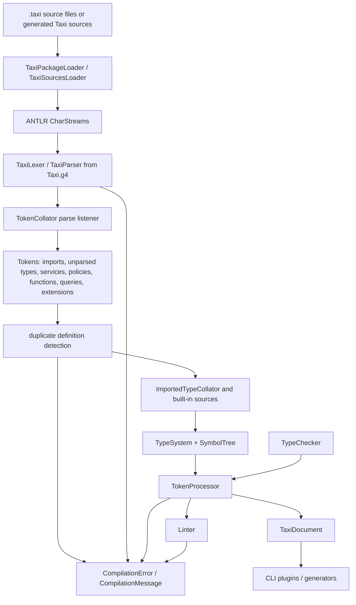
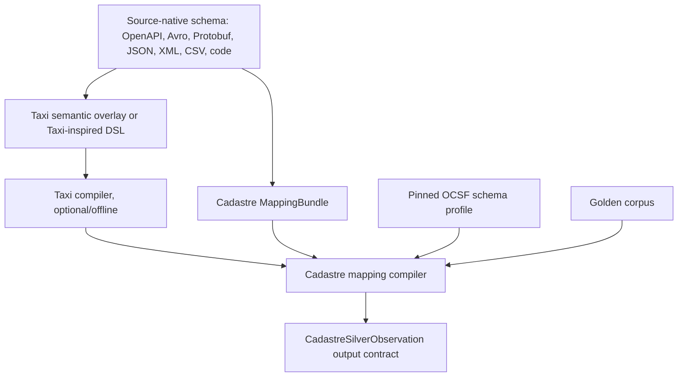

## 1. Executive verdict

Taxi is useful to Cadastre as a **source-schema semantic overlay and developer-tooling reference**, not as a Cadastre canonical semantics layer. The best Cadastre use is a bounded pilot in which Taxi-like semantic type overlays annotate source schemas and mapping-bundle inputs, while Cadastre-owned contracts continue to define silver observations, OCSF alignment, omission states, lineage, confidence, temporal semantics, identity inputs, gold facts, and graph deltas. The inspected Taxi repository is a mixed Maven/Kotlin/JVM and Nx/TypeScript workspace with a real compiler, grammar, linter, package model, CLI, language server, schema converters, and TaxiQL-related tooling. It was inspected through GitHub source tooling because direct clone failed in the container due DNS resolution failure; no local build or test pass was verified. [^1] [^2] [^3]

| Decision area | Verdict | Confidence | Reason |
| --- | --- | ---: | --- |
| Semantic source-schema overlay | `pilot` | High | Taxi’s core value is semantic typing over existing schemas, including OpenAPI `x-taxi-type`, Avro `taxi.dataType`, and source-to-Taxi converters. That aligns with Cadastre’s mapping-bundle authoring problem, provided Cadastre remains the authority. |
| Cadastre shared semantic vocabulary | `study` | Medium | Taxi’s “semantic types, not shared models” discipline is useful, but Cadastre already has OCSF-aligned silver and Cadastre-owned gold, identity, omission, and projection contracts. Taxi vocabulary must not replace those contracts. |
| Mapping-bundle authoring support | `pilot` | Medium | Taxi can support type overlays, source schema annotation, enum mapping, model imports, CLI validation, and editor feedback. It lacks Cadastre-specific required semantics for omission states, field quality, lineage, confidence, lifecycle, checksums, and gold-derivation boundaries. |
| Mapping-bundle compiler/linter inspiration | `adopt` | High | The compiler/linter pipeline, duplicate detection, symbol tree, package loading, configurable rule severities, language-server compilation feedback, and plugin/generator shape are strong references for Cadastre mapping-bundle tooling. |
| Direct Taxi runtime dependency | `reject` | Medium | Do not take Taxi as a production runtime dependency for Cadastre core until build, artifact availability, version pinning, deterministic package validation, and security review are independently verified. Source evidence shows current snapshot development and CI publishing paths, but local build and external artifact availability were not verified. |
| TaxiQL for Cadastre graph queries | `reject` | High | TaxiQL is a semantic query language for Taxi-aware sources and is documented as depending on execution engines such as Orbital. The repository does not prove support for Cadastre’s bitemporal graph, evidence, identity, authorization, confidence, and deterministic path-ordering requirements. |
| Canonical gold fact model | `reject` | High | Taxi models semantic types, services, operations, policies, queries, and schema overlays. Cadastre gold facts require bitemporal canonical assertions, evidence references, confidence, assertion states, and correction behavior that Taxi does not define as Cadastre requires. |
| Identity resolution | `reject` | High | Taxi aliases and enum synonyms are useful semantic mapping tools, but Cadastre must not treat semantic equivalence as identity proof. Cadastre explicitly separates canonical entities, source assets, identifiers, and identity decisions, and forbids auto-merge from IP-only, hostname-only, DNS-only, or PTR-only evidence. |

Taxi should be treated as:

- a **source-schema semantic overlay** candidate;
- a **mapping-bundle tooling reference**;
- a **package/compiler/linter reference**;
- **not** a direct Cadastre runtime dependency at this time;
- **not** a Cadastre core semantic authority, identity resolver, gold fact model, graph model, OCSF replacement, or omission-state model.

## 2. Source inventory and inspection limits

The repository source was inspected at commit `7d83962001b73a37b5c18f8992ef9c6e87d17e97` on branch `develop`, with inspection date `2026-05-15`. The default branch and repository tree were identified from GitHub’s repository page and GitHub connector metadata; the latest inspected commit corresponds to a January 27, 2026 documentation update commit on `develop`. [^1] [^4]

| Source | Scope inspected | Evidence type | Freshness | Limits |
| --- | --- | --- | --- | --- |
| Taxi repository | Branch `develop`, commit `7d83962001b73a37b5c18f8992ef9c6e87d17e97`; root tree; root Maven/Nx files; compiler, grammar, linter, package manager, CLI, plugin/generator APIs, language server, schema converter modules, TypeScript TaxiQL modules, CI file | Source code and repository metadata | Inspected 2026-05-15 | Direct clone failed due DNS. No local checkout, build, dependency resolution, tests, package installation, or artifact publishing was verified. Some module directories were mapped by root POM/tree only. |
| Taxi official docs | Overview, configuration, core language, types/models, advanced mapping, services, TaxiQL, OpenAPI, CLI, linter, plugins, dependency management, VS Code language service | Documentation | Opened 2026-05-15 | Docs may be stale relative to source. Several pages still describe legacy GitLab-era context. Docs are treated as intended behavior, not proof of implemented behavior. |
| Package/release artifacts | Repository POMs, package manifests, GitLab CI publishing jobs, README distribution notes, package search attempts | Distribution evidence | Inspected 2026-05-15 | Maven Central, npm, SDKMAN, and GitHub release artifact availability were not independently verified. Web searches for current registry artifacts returned no usable results. |
| Cadastre PRD | Raw/silver/gold/projection architecture, mapping-bundle requirements, OCSF alignment, omission states, identity resolution, graph requirements, extension lifecycle, golden corpus, shadow execution, replay, security requirements | Product baseline | Local PRD draft inspected 2026-05-15 | The PRD is the Cadastre comparison baseline, not evidence of Taxi behavior. |

### 2.1 Commands and tool calls used

Direct clone and local source checkout failed:

```bash
rm -rf /mnt/data/taxilang-research
mkdir -p /mnt/data/taxilang-research
cd /mnt/data/taxilang-research
git clone --depth=1 https://github.com/taxilang/taxilang.git repo
```

Observed error:

```text
fatal: unable to access 'https://github.com/taxilang/taxilang.git/': Could not resolve host: github.com
```

A direct remote check also failed:

```bash
git ls-remote https://github.com/taxilang/taxilang.git HEAD
```

Observed error:

```text
fatal: unable to access 'https://github.com/taxilang/taxilang.git/': Could not resolve host: github.com
```

Local build environment inspection:

```bash
java -version 2>&1 || true
mvn -version 2>&1 || true
node --version 2>&1 || true
npm --version 2>&1 || true
git --version 2>&1 || true
```

Observed environment:

```text
openjdk version "17.0.18" 2026-01-20
mvn: command not found
v18.20.4
9.2.0
git version 2.39.2
```

No `mvn clean verify`, `mvn test`, `npm test`, or `nx` build command was run against the repository because the repository was not materialized locally, Maven was unavailable, Java was 17 while the root POM requires Java 21, and network DNS blocked checkout. This reduces confidence in buildability and release-readiness claims, but not in source-structure claims made from fetched repository files. [^3]

Fallback inspection used GitHub source tooling and web access:

```text
GitHub get_repo: taxilang/taxilang
GitHub fetch_commit: 7d83962
GitHub fetch_file: pom.xml, compiler/pom.xml, compiler grammar and Kotlin source files, package-manager files, CLI files, plugin/generator APIs, converter source files, language-server files, TypeScript package files, CI file
GitHub/web repository tree: top-level directories and README
```

Source-scoped lexical queries were run for the required terms. The effective query set included:

```text
compiler
compiler/src/main/antlr4/lang/taxi/Taxi.g4
Compiler.kt
TaxiTokenStreamParser
TokenProcessor
TypeSystem
SymbolTree
TaxiDocument
CompilationError
CompilationException
linter
Linter
LinterRule
TaxiPackageLoader
TaxiSourcesLoader
package-manager
taxi-cli
taxi-generator-api
taxi-plugin-api
lang-to-taxi-api
swagger2taxi
avro-to-taxi
protobuf-to-taxi
soap-to-taxi
xsd2taxi
jsonSchema-to-taxi
java2taxi
kotlin
taxi-annotations
taxi-stdlib-annotations
taxi-to-openapi-plugin
language-server
taxiql-codegen
typescript
taxiql-client
taxi.conf
x-taxi-type
taxi.dataType
```

Package/artifact inspection attempts:

```text
web search: npm @orbitalhq/taxiql-client
web search: Maven Central org.taxilang compiler taxi
web search: SDKMAN taxi language SDK taxi
```

These searches returned no usable registry result in this environment. Artifact availability is therefore `Unknown`, despite repository and CI evidence of intended Maven/npm/SDKMAN-related publication paths. [^3] [^5]

## 3. Repository reconstruction

Taxi is organized as a polyglot monorepo. The root repository tree contains Maven/JVM modules, TypeScript/Nx modules, documentation generations, language server/editor tooling, sample taxonomy material, schema converters, package-management components, and release/build scripts. The root Maven POM declares `org.taxilang:parent:1.71.0-SNAPSHOT`, uses Java 21 and Kotlin 2.2.21, and lists the compiler, CLI, package manager, plugin APIs, schema converters, language server, TypeScript, and TaxiQL codegen modules as Maven modules. [^1] [^5] [^6]

### 3.1 Top-level module map

The table is reconstructed from the repository top-level tree, root POM module declarations, and selected subsystem source files. Entries marked with lower confidence were observed by tree/module presence but not deeply inspected. [^1] [^5]

| Path | Apparent subsystem | Primary responsibility | Implementation language/build system | Cadastre relevance | Confidence |
| --- | --- | --- | --- | --- | --- |
| `.github/workflows` | CI/workflow metadata | GitHub workflow area present in tree | YAML, not inspected | Low direct relevance unless Cadastre copies workflow patterns | Low |
| `.mvn` | Maven support | Maven configuration and CI settings | Maven | Relevant for reproducible JVM builds if Taxi is piloted | Medium |
| `.gitlab-ci.yml` | CI/CD | Build, validate, release, publish, VS Code/IntelliJ plugin, Maven Central, npm release jobs | GitLab CI, Maven, Node, Nx, SDKMAN, Docker | Useful release-pipeline reference, but not proof of successful current release | High |
| root `pom.xml` | Maven aggregator | Parent POM, module registry, dependency/plugin versions, Java/Kotlin build | Maven, Kotlin plugin, Java 21 | High, defines real module topology | High |
| root `package.json` | TypeScript workspace | Nx script entrypoints for TypeScript build/test/lint | npm, Nx | Medium, relevant to TaxiQL client/codegen tooling | High |
| root `nx.json` | TypeScript build graph | Nx target defaults, plugins, caching | Nx | Medium, useful for codegen/tooling workspace design | High |
| `compiler` | Core language compiler | Grammar, parser, token collation, type system, linter, Taxi document output | Kotlin/JVM, ANTLR | Highest value for Cadastre mapping-bundle compiler/linter design | High |
| `core-types` | Shared model/config types | Package project model, source/package data types | Kotlin/JVM | High for package metadata and config shape | High |
| `taxi-cli` | Developer CLI | Build, publish, package, version, plugin orchestration | Kotlin/JVM, Spring, JCommander | High for mapping-bundle authoring workflow reference | High |
| `package-manager` | Package/dependency management | Dependency fetch/install, bundle processing, local cache, Aether/Nexus/Git resolution | Kotlin/JVM, Eclipse Aether | High for Cadastre extension package lifecycle inspiration | High |
| `package-repository-api` | Repository API | Repository/package API contracts | JVM module, not deeply inspected | Medium | Medium |
| `taxi-plugin-api` | Plugin interface | Plugin and component-provider abstraction | Kotlin/JVM | Medium for generator/linter extension architecture | High |
| `taxi-generator-api` | Codegen API | `ModelGenerator`, generated source abstractions, processing environment | Kotlin/JVM | High for mapping-output generators and validation artifacts | High |
| `lang-to-taxi-api` | Source-to-Taxi generation API | Shared API for schema converters | JVM module | High for importer/converter architecture | Medium |
| `taxi-jvm-common` | Common JVM utilities | Shared JVM support | JVM module | Low to medium | Medium |
| `taxi-annotations` | JVM annotations | Annotation support for Java/JVM source interop | JVM module | Medium for source-code annotation patterns | Medium |
| `taxi-stdlib-annotations` | Standard annotations | Standard semantic/tooling annotations | JVM module | Medium for reusable annotation design | Medium |
| `swagger2taxi` | OpenAPI converter | Convert OpenAPI/Swagger metadata and schemas into Taxi | Kotlin/JVM | High for Cadastre schema overlay and `x-taxi-type` lessons | High |
| `avro-to-taxi` | Avro converter | Convert Avro records/enums/scalars into Taxi, including `taxi.dataType` metadata | Kotlin/JVM | High for source schema overlay and field metadata import | High |
| `protobuf-to-taxi` | Protobuf converter | Convert Protobuf schema types into Taxi model/enums/scalars | Kotlin/JVM | Medium to high for source schema version import | High |
| `soap-to-taxi` | SOAP/WSDL converter | SOAP conversion using CXF/JAXB and `xsd2taxi` dependency | JVM module | Medium for legacy enterprise source schemas | Medium |
| `xsd2taxi` | XSD converter | Convert XML schema using XSOM | JVM module | Medium for XML source schemas | Medium |
| `jsonSchema-to-taxi` | JSON Schema converter | JSON Schema to Taxi module using Everit JSON Schema | JVM module | Medium, but dependency comments create risk | Medium |
| `java2taxi` | Java-to-Taxi converter | Generate Taxi from Java source/annotations | JVM module | Medium for code-originating source schemas | Medium |
| `java-spring-taxi` | Spring interop | Spring-related Java/Taxi integration | JVM module | Low to medium for Cadastre unless JVM services are used | Medium |
| `kotlin` | Kotlin generator | Taxi-to-Kotlin generation | JVM module | Medium for generated test fixtures or clients | Medium |
| `taxi-to-openapi-plugin` | Taxi-to-OpenAPI | Generate OpenAPI from Taxi services/queries | JVM module | Medium for documenting Cadastre mapping APIs, not core | Medium |
| `language-server` | Editor/LSP tooling | Compile-on-edit, diagnostics, dependencies, VS Code/IntelliJ tooling | Kotlin/JVM, TypeScript/VS Code, Gradle for IntelliJ | High for authoring mapping bundles | High |
| `typescript` | TypeScript clients/codegen | TaxiQL client and TypeScript TaxiQL codegen workspace | TypeScript, npm, Nx | Medium for UI/client tooling only | High |
| `taxiql-codegen` | TaxiQL codegen CLI | Generate type-safe code from Taxi query files | Kotlin/JVM, Picocli, optional native image | Low for core, medium for developer tooling reference | High |
| `sample-compiled-taxonomy` | Sample artifact | Precompiled/sample taxonomy material | JVM module or sample | Low to medium for examples | Medium |
| `demos` | Examples | Demonstrations | Mixed | Low direct relevance | Medium |
| `docs` | Documentation | Current/legacy docs source | MDX/docs | Medium for intended behavior | High |
| `docs2.0` | Documentation site | newer docs/changelog site | TypeScript/MDX | Medium for intended behavior and release notes | High |
| `language-design-decisions` | Design decisions | ADR-like historical decisions | Docs | Medium for background, not inspected deeply | Low |
| `plugins` | Plugin modules | Packaged internal plugins | JVM module | Medium | Medium |
| `sync-pom-version` | Version sync tooling | npm tool for synchronizing versions in CI | TypeScript/npm | Low to medium | Medium |
| `thoughts.md`, `debug.txt`, `test-duplicate.taxi` | Unclear/root artifacts | Notes/debug/test artifacts | Miscellaneous | Low | Low |

### 3.2 First-pass subsystem entry points

For further implementation study, the best source entry points are:

| Area | Best entry points |
| --- | --- |
| Grammar | `compiler/src/main/antlr4/lang/taxi/Taxi.g4` |
| Parse orchestration | `compiler/src/main/java/lang/taxi/TaxiTokenStreamParser.kt`, `Compiler.kt` |
| Token collection | `compiler/src/main/java/lang/taxi/TokenCollator.kt` |
| Token processing | `compiler/src/main/java/lang/taxi/compiler/TokenProcessor.kt` |
| Type registry and symbol lookup | `compiler/src/main/java/lang/taxi/TypeSystem.kt`, `SymbolTree.kt` |
| Output model | `compiler/src/main/java/lang/taxi/TaxiDocument.kt` |
| Diagnostics | `Compiler.kt`, `CompilationError`, `CompilationException` |
| Linter | `compiler/src/main/java/lang/taxi/linter/Linter.kt`, `LinterRule.kt`, rule classes |
| Package config | `core-types/src/main/java/lang/taxi/packages/TaxiPackageProject.kt` |
| Source loading | `compiler/src/main/java/lang/taxi/packages/TaxiPackageLoader.kt`, `TaxiSourcesLoader.kt` |
| Dependency resolution | `package-manager/src/main/java/org/taxilang/packagemanager/PackageManager.kt` |
| CLI build | `taxi-cli/src/main/java/lang/taxi/cli/commands/BuildCommand.kt` |
| CLI publish/package | `PublishProjectCommand.kt`, `PackageProjectCommand.kt` |
| Plugin API | `taxi-plugin-api/src/main/java/lang/taxi/plugins/Plugin.kt` |
| Generator API | `taxi-generator-api/src/main/java/lang/taxi/generators/ModelGenerator.kt` |
| OpenAPI overlay | `swagger2taxi/src/main/java/lang/taxi/generators/openApi/v3/TaxiExtension.kt` |
| Avro overlay | `avro-to-taxi/src/main/java/lang/taxi/generators/avro/AvroTypeMapper.kt` |
| Protobuf converter | `protobuf-to-taxi/src/main/java/lang/taxi/generators/protobuf/ProtobufTypeMapper.kt` |
| LSP compile loop | `language-server/taxi-lang-service/src/main/java/lang/taxi/lsp/TaxiCompilerService.kt` |
| TaxiQL codegen | `taxiql-codegen/taxiql-codegen-cli/src/main/java/lang/taxi/codegen/cli/CodegenCommand.kt` |
| TypeScript TaxiQL client | `typescript/taxiql-client/package.json` |

## 4. Build, release, and toolchain model

Taxi’s primary build is Maven/JVM with Kotlin sources, ANTLR-generated grammar artifacts, and Java 21. The root POM is a parent aggregator with `org.taxilang` coordinates and `1.71.0-SNAPSHOT` version, and the compiler module uses `antlr4-maven-plugin` to generate parser artifacts. The root build config uses Kotlin compilation over `src/main/java`, `src/main/kotlin`, and generated ANTLR sources, which means the source tree uses Kotlin files under Java-style source directories. [^5] [^6]

The TypeScript side is an Nx workspace. The root `package.json` delegates build/test tasks to Nx, while `nx.json` defines build/test/lint target defaults and caching behavior. The `typescript/taxiql-client` package is named `@orbitalhq/taxiql-client`, version `0.1.1`, and builds JavaScript and declaration output with esbuild and TypeScript. External npm registry publication was not verified. [^7] [^8]

The CI file is GitLab-centric and uses Maven `3.9.9-eclipse-temurin-21` for default JVM jobs, builds a native TaxiQL codegen CLI for Linux and macOS, publishes snapshot jars on `develop`, includes tag-triggered Maven Central deployment, builds VS Code and IntelliJ plugins, and includes tag-triggered npm release jobs for TypeScript packages. These are configured CI behaviors, not verified successful releases. [^9]

| Artifact or tool | Evidence location | How it is built or published | Versioning behavior | Cadastre dependency risk |
| --- | --- | --- | --- | --- |
| Maven parent and JVM modules | root `pom.xml` | Maven reactor, Java 21, Kotlin plugin, ANTLR plugin in compiler | Root version `1.71.0-SNAPSHOT` at inspected commit | `medium` for study, `high` for direct dependency until build verified |
| Compiler module | `compiler/pom.xml` | Maven with ANTLR runtime/plugin and compiler dependencies | Inherits parent version | `medium` for offline pilot after pinning |
| CLI | `taxi-cli`, GitLab CI artifacts | Maven/Spring/JVM; CI stores CLI zip artifacts | Inherits parent version | `medium` for pilot only |
| Taxi packages | `TaxiPackageProject`, package-manager, docs | Bundled zip plus dependency resolution; publish to configured repository | Taxi project has `name` and `version` in `taxi.conf` | `medium` conceptually, `high` if reused without checksum/signature extensions |
| Maven Central publication | `.gitlab-ci.yml` | Tag-only `clean deploy` profile `maven-central,loopback-gpg` | Tag-driven | `unknown`; external availability not verified |
| Orbital/snapshot repo | README and CI | Snapshot deploy profile `snapshot-release,orbital-repo` on `develop` | Branch/snapshot | `high` for Cadastre production dependency |
| SDKMAN CLI distribution | Official CLI docs | Docs state `sdk i taxi`; not externally verified | Unknown | `unknown` |
| TypeScript TaxiQL client | `typescript/taxiql-client/package.json` and CI | npm build, tag-triggered publish job | Package version `0.1.1` in source | `unknown`; registry availability not verified |
| TaxiQL codegen CLI | `taxiql-codegen` and CI | Maven native-image build plus npm platform package release | Tag-driven npm release jobs | `medium` for tooling reference, `high` for dependency until verified |
| Language server plugins | `language-server` and CI | VS Code package/publish, IntelliJ plugin build/publish jobs | Develop/tag behavior in CI | `medium` for authoring reference |

### 4.1 Confirmed facts

Confirmed from source:

- The root Maven POM declares the primary module set, Java 21, Kotlin 2.2.21, and compiler/build plugins. [^5]
- The compiler module invokes ANTLR generation using `antlr4-maven-plugin` and depends on `antlr4-runtime`. [^6]
- The CI file defines Maven validation, snapshot deploy, Maven Central deploy, TypeScript build/release, VS Code packaging, and IntelliJ plugin jobs. [^9]
- The TypeScript workspace uses Nx and contains a source package named `@orbitalhq/taxiql-client`. [^7] [^8]

Confirmed from docs:

- The CLI docs state that Taxi is distributed through SDKMAN and that `taxi build`, `taxi publish`, `taxi version-bump`, and `taxi set-version` are user-facing commands. [^10]
- The dependency-management docs describe `taxi.conf` dependencies, Git dependencies, and Nexus as a supported non-Git repository mechanism. [^11]

Unverified:

- Current Maven Central availability.
- Current npm registry availability.
- Current SDKMAN package availability.
- GitHub release artifacts.
- Successful local or CI build/test execution at the inspected commit.

## 5. Externally visible Taxi behavior

## 5.1 Taxi language surface

Taxi’s public language surface is defined by an ANTLR grammar and exposed through compiler, CLI, docs, and editor tooling. The grammar supports namespace/import declarations, type aliases, types, models, partial models, enums, type and enum extensions, services, policies, functions, annotations, queries, expressions, accessors, table declarations, stream declarations, operation contracts, lineage blocks, and TaxiQL query bodies. [^12]

For Cadastre, the relevant constructs are:

| Construct | Taxi behavior | Cadastre relevance |
| --- | --- | --- |
| Semantic types | `type Foo inherits String` or inline inherited field syntax | High. Best fit for source-field meaning overlays and OCSF/Cadastre concept labels. |
| Models | Structured contracts with fields typed by semantic types | Medium. Useful for source-native schema descriptions, not for Cadastre gold facts. |
| Type aliases | Bidirectional equivalence between types | High-risk. Useful for schema mapping but must not drive identity resolution. |
| Enums and synonyms | Enum values and bidirectional synonym declarations | Useful for enum mapping. Must preserve Cadastre unknown and lossy enum states. |
| Namespaces/imports | Qualified names and imports | Useful for mapping-bundle modularity and source profiles. |
| Annotations | Annotation types and annotation instances, with partial compiler checking | Useful for metadata, but Cadastre must define exact annotation contracts. |
| Services/operations | API/service contracts with annotations and constraints | Useful for describing source APIs or generated clients, not central to Cadastre silver mapping. |
| Accessors | Deprecated or supported source-field accessors such as `jsonPath`, `xpath`, `column` | Useful as historical reference, but Cadastre should prefer explicit mapping rules. |
| Expressions/constraints | Expressions, `when` blocks, constraints, function declarations | Potentially useful for mapping-bundle rules if sandboxed and deterministic. |
| TaxiQL | Declarative semantic query syntax over Taxi-aware sources | Not suitable as Cadastre graph API without major proof and extension. |

Taxi official docs describe it as a language for documenting data models and API contracts, focused on mapping by semantic meaning rather than field names or structure. The same docs emphasize that Taxi is not a serialization protocol and is designed to complement OpenAPI/XSD-style structural schemas rather than replace them. [^13]

## 5.2 Semantic types and taxonomy

Taxi’s strongest concept for Cadastre is the separation of **meaning** from **structure**. The docs recommend using shared semantic types broadly and shared models narrowly. In Taxi’s model, `EmailAddress inherits String` captures meaning and representation, while different APIs may expose that semantic type through different field names and model structures. [^14]

This directly matches Cadastre’s source-schema overlay problem: many source products may expose host IDs, agent IDs, device IDs, DNS names, IPs, vulnerability IDs, and control states under different names and structures, while Cadastre needs explicit source-to-silver mappings. Taxi’s semantic types can describe those field meanings before Cadastre’s normalizer emits `CadastreSilverObservation` records.

However, Taxi’s equivalence features are too strong for Cadastre identity. Taxi type aliases are documented as bidirectional synonyms, and enum synonyms are also documented as bidirectional. Cadastre may use this for **field meaning** and **enum normalization**, but must not use it as evidence that two hosts, users, or assets are the same entity. Cadastre’s PRD requires separate canonical entities, source assets, identifiers, and identity decisions; a canonical host must not be identified directly by mutable attributes such as hostname, IP address, DNS name, or PTR record, and IP-only, hostname-only, and PTR-only evidence must never auto-merge. [^14] [^15]

### 5.2.1 What the compiler validates

The compiler performs syntax parsing, token collation, duplicate detection, symbol registration, import resolution, type compilation, linter invocation, service/function/policy/query compilation, and final `TaxiDocument` construction. It returns compilation messages through `CompilationError` and can throw `CompilationException` when callers request strict compilation. [^16] [^17] [^18]

The linter can detect modeling practices that cause ambiguity, including duplicate semantic types on a model and primitive fields on models. The official linter docs describe `no-duplicate-types-on-models` as preventing semantic ambiguity when a model uses the same semantic type on multiple fields, and `no-primitive-types-on-models` as encouraging semantic types rather than primitives. The source linter includes additional rule objects beyond the two documented rules, including type alias, inheritance, field-on-type, operation response, and operation contract rules. [^19] [^20]

### 5.2.2 Mistakes a Cadastre taxonomy author must avoid

A Cadastre taxonomy author must not:

- define Taxi aliases that imply host or asset identity equivalence;
- collapse Cadastre omission states into null, optional, absent, or unknown without preserving the original state;
- treat `String`, `Int`, or generic primitive use as sufficient semantic modeling for mapping-bundle outputs;
- allow a source model to use the same semantic type on multiple fields without a disambiguating subtype, because that undermines deterministic mapping;
- use TaxiQL query linking or `@Id` semantics as a Cadastre identity resolver;
- use Taxi service contracts to bypass Cadastre’s raw, silver, gold, and projection boundaries.

## 5.3 Existing schema interoperability

Taxi has repository modules for OpenAPI/Swagger, Avro, Protobuf, SOAP/WSDL, XML/XSD, JSON Schema, Java, Spring, Kotlin, and Taxi-to-OpenAPI. The depth and maturity differ by module. OpenAPI, Avro, and Protobuf have clear source files showing type mapping behavior; JSON Schema has an explicit POM comment warning about an unsupported dependency and “HIGH risk” transitive CVEs, which is a dependency-risk signal for Cadastre. [^21] [^22]

| Format | Repo module | Annotation/metadata mechanism | Direction | Cadastre relevance | Unknowns |
| --- | --- | --- | --- | --- | --- |
| OpenAPI / Swagger | `swagger2taxi`, `taxi-to-openapi-plugin` | `x-taxi-type` with `name`, `create`, and source support for `inherits` | bidirectional | High. Strongest source-schema overlay precedent for Cadastre. | Exact OpenAPI coverage and output determinism not locally tested. |
| Avro | `avro-to-taxi` | `taxi.dataType` schema property | external schema to Taxi | High. Directly relevant to source-native schema versions and field-level semantic overlays. | Full logical type coverage and null/union handling need tests. |
| Protobuf | `protobuf-to-taxi` | `taxi.dataType` appears in docs/search; source maps Protobuf schema types to Taxi | external schema to Taxi | Medium to high. Useful for schema import. | Source contains TODOs and some scalar fallbacks to `Any`; coverage must be validated. |
| SOAP / WSDL | `soap-to-taxi` | WSDL/SOAP via CXF/JAXB and XSD conversion | external schema to Taxi | Medium for legacy enterprise integrations. | Implementation coverage not deeply inspected. |
| XML / XSD | `xsd2taxi` | XSD parsing through XSOM | external schema to Taxi | Medium. Useful for XML source contracts. | Runtime coverage and namespace handling not tested. |
| JSON Schema | `jsonSchema-to-taxi` | JSON Schema parser library | external schema to Taxi | Medium but risky. Useful conceptually for JSON-producing sources. | POM warns dependency is unsupported and has high-risk CVE transitive dependency concerns. |
| Java annotations | `java2taxi`, `taxi-annotations`, `taxi-stdlib-annotations` | JVM annotations | external code to Taxi / annotation only | Medium for JVM source code contracts. | Not deeply inspected. |
| Kotlin | `kotlin`, `taxi-generator-api` | Taxi-to-Kotlin generator | Taxi to external code | Medium for generated fixtures/SDKs. | Not locally built. |
| CSV/XML accessors | compiler grammar and docs | `column`, `xpath`, `jsonPath` accessors | annotation/expression only | Low to medium. Use as reference, not primary mapping mechanism. | Docs say some accessors are deprecated or being replaced by expressions. |

### 5.3.1 OpenAPI

Official docs state that existing OpenAPI specs can embed Taxi metadata using `x-taxi-type`, and they define `name` and `create` behavior for model and attribute schema declarations. Source confirms `TaxiExtension.extensionKey = "x-taxi-type"`, `createModelByDefault = true`, and `createTypeByDefault = false`, with deserialization into a `TaxiExtension` object that also supports an `inherits` list. [^23] [^21]

Cadastre lesson: `x-taxi-type` is a strong pattern for **source schema overlays**, but Cadastre mapping bundles must add fields that Taxi does not enforce, including source schema version, external OCSF class selection, omission mapping, field quality, confidence, lineage, and golden corpus references.

### 5.3.2 Avro and Protobuf

Avro source mapping reads `taxi.dataType`, maps Avro primitive types to Taxi primitives, handles records, enums, maps, arrays, and nullable unions, and emits Taxi object types and fields. Protobuf source mapping reads Wire schema types, maps scalar Protobuf types to Taxi primitives, filters out internal `google.protobuf` types by default, creates models and enums, and annotates generated fields with Protobuf metadata. [^22]

Cadastre lesson: these converters are valuable reference implementations for importing source schema versions into a semantic overlay. They are not enough for Cadastre validation because Cadastre must preserve omission state, source evidence, raw values for unknown enums, and mapping-bundle lifecycle metadata.

## 5.4 CLI, compiler, package, and linter behavior

Official docs describe a developer workflow centered on `taxi.conf`, `.taxi` source files, `taxi init`, `taxi build`, `taxi publish`, version commands, plugins, dependencies, and linter configuration. The docs define `taxi.conf` as HOCON and list project keys including `name`, `version`, `sourceRoot`, `output`, `plugins`, `pluginSettings`, `dependencies`, `repositories`, `publishToRepository`, and `credentials`. The docs also say local project config is merged with user config under `~/.taxi/taxi.conf`. [^10] [^11]

Source confirms the same shape in `TaxiPackageProject`, which includes package identity, source root, output directory, dependencies, repositories, plugins, plugin settings, publish target, credentials, taxi home, linter config, additional source globs, and compiler options. `TaxiPackageLoader` loads the project file and user-level `~/.taxi/taxi.conf` through Typesafe Config fallback merging. [^24]

The `BuildCommand` loads package sources and dependencies, compiles with `Compiler.compileWithMessages()`, logs diagnostics by severity, runs configured model generators, exits nonzero when compilation errors exist, and writes generated sources only after compilation. `PublishProjectCommand` delegates publication to `PackagePublisher`, and `PackageProjectCommand` creates a zipped project package. [^25]

For Cadastre, the workflow reference is strong:

```text
source schema or .taxi overlay
  -> taxi.conf package metadata
  -> dependency resolution
  -> compile
  -> linter
  -> generator/plugin output
  -> package/publish
```

Cadastre should adapt this shape but tighten it:

```text
source schema + Cadastre mapping bundle
  -> mapping-bundle manifest
  -> pinned dependency lock
  -> compile semantic overlay
  -> Cadastre mapping validation
  -> OCSF profile validation
  -> omission/quality validation
  -> golden corpus validation
  -> checksum/signature verification
  -> active/canary lifecycle promotion
```

## 5.5 TaxiQL and query behavior

TaxiQL is documented as a language for writing semantic queries against Taxi-aware sources. The docs say TaxiQL queries are expressed in terms of taxonomy types rather than source-specific services and models, and that when paired with a server such as Orbital, the server performs dynamic discovery of data. The docs also say cross-model linking behavior is down to server engines and document Orbital’s reference behavior. [^26]

The repository grammar and compiler parse TaxiQL constructs: named and anonymous queries, `given` blocks, `find`, `stream`, `map`, projections, service restrictions, mutations, and query operation capabilities. `TokenProcessor` compiles named and anonymous queries through `QueryCompiler` into `TaxiQlQuery` objects that are included in `TaxiDocument`. [^12] [^18]

That means TaxiQL is part of the Taxi language/compiler model, but the inspected repository does not prove that TaxiQL itself can execute Cadastre graph queries. Cadastre graph serving requires bounded traversal, deterministic path ordering, bitemporal valid/known time filters, evidence drillback, assertion states, confidence bands, authorization redaction, source fact lineage, and graph-delta determinism. These are Cadastre PRD requirements, not TaxiQL repository guarantees. [^15]

TaxiQL ideas worth studying for Cadastre:

- type-centered query criteria instead of field-name criteria;
- projections from source models into consumer-shaped result models;
- named queries as packageable validation artifacts;
- query source restrictions as a possible mapping validation mechanism;
- `given` blocks as a way to express golden-corpus starting facts.

TaxiQL must not be recommended as Cadastre’s graph API unless a separate implementation proves all Cadastre graph, bitemporal, evidence, authorization, identity, and deterministic ordering requirements.

## 6. Internal subsystem architecture

## 6.1 Compiler pipeline

The compiler pipeline is source-oriented and deterministic enough to study as a mapping-bundle compiler reference. The pipeline starts with Taxi source text, builds ANTLR token streams, collects syntax and token metadata, resolves imports and built-ins, registers empty symbols for forward reference handling, compiles concrete tokens, applies extensions and synonyms, compiles services/policies/functions/queries/expressions, runs linter rules, and emits a `TaxiDocument` plus compilation messages. [^16] [^17] [^18]



Corrected text form:

```text
.taxi source files or generated source-schema overlays
  -> TaxiPackageLoader / TaxiSourcesLoader
  -> CharStreams
  -> ANTLR TaxiLexer / TaxiParser from Taxi.g4
  -> TokenCollator parse listener
  -> Tokens object
  -> duplicate definition detection
  -> imported source and built-in collation
  -> TypeSystem and SymbolTree registration
  -> TokenProcessor empty-token registration
  -> token compilation
  -> type extensions and enum synonym application
  -> service, policy, function, query, and expression compilation
  -> linter messages
  -> TaxiDocument plus CompilationError / CompilationMessage results
  -> CLI generator or plugin output
```

### 6.1.1 Parser and token stream

`DefaultTaxiTokenStreamParser` constructs a `TaxiLexer`, `CommonTokenStream`, and `TaxiParser`, removes default error listeners, attaches `TokenCollator` and `CollectingErrorListener`, invokes `parser.document()`, and returns `TokenStreamParseResult` with tokens and errors. This is a compact, reusable parser architecture for Cadastre to emulate. [^17]

### 6.1.2 Token collection

`TokenCollator` listens to parse-tree exits and records imports, unparsed enum/type/model/alias/annotation declarations, inline inherited types, extensions, services, policies, functions, named queries, anonymous queries, top-level expressions, and token locations. It qualifies local names using the active namespace and records parser exceptions to avoid unsafe token processing. [^17]

### 6.1.3 Type system and symbol tree

`TypeSystem` registers imported tokens and primitives into a `SymbolTree`, maintains compiled tokens, and resolves types, functions, services, operations, and unresolved symbols. `SymbolTree` stores qualified names in a hierarchical tree, resolves imports, resolves members, handles extension-function/member lookup precedence, and can compile referenced tokens on demand through `TokenProcessor`. [^27]

### 6.1.4 Token processing and TaxiDocument

`TokenProcessor` first registers undefined placeholders for functions, types, enums, type aliases, annotations, and service definitions; then it compiles tokens, extensions, services, policies, functions, enum synonyms, queries, and top-level expressions. The final `TaxiDocument` stores sets of types, services, policies, functions, annotations, views, queries, and expressions, with lookup methods for importable and named symbols. [^18] [^28]

For Cadastre, the placeholder-registration pattern is useful for authoring mapping bundles that contain mutually recursive semantic declarations, but Cadastre should define stricter acceptance around circular references, duplicate symbols, and package dependency locks.

## 6.2 Diagnostics and error model

Taxi diagnostic output is represented through `CompilationError` and `CompilationMessage` severity. `Compiler.compileWithMessages()` can return messages and a document without throwing; `Compiler.compile()` throws `CompilationException` when error-level messages exist. The exception class avoids stack-trace overhead because compilation errors are used as signaling rather than exceptional runtime failures. [^16]

Cadastre should copy the idea of **message-returning validation APIs** rather than only throwing exceptions. Mapping-bundle validation should return structured diagnostics with stable codes, severity, source location, rule ID, affected mapping row, and fix guidance. Cadastre must go beyond Taxi by requiring stable machine-readable error codes and layer identifiers, which are explicit in the PRD error model. [^15]

## 6.3 Linter architecture

The linter is a registry of rule objects, each with a unique ESLint-style ID and an `evaluate()` method. Rule configuration can enable/disable rules and override severity. Source linter rules are grouped by subject type, including model, enum, type alias, type, source file, and operation rules. [^20]

Cadastre should adopt this as a pattern:

```text
CadastreMappingRule<T>:
  id
  severity default
  target artifact kind
  evaluate(source, context) -> Diagnostic[]
```

Cadastre-specific required rules should include:

| Rule ID | Purpose |
| --- | --- |
| `cadastre/no-gold-output-from-mapping-bundle` | Mapping bundles must not emit gold facts, identity decisions, graph deltas, or CIM projection records. |
| `cadastre/explicit-omission-for-optional-fields` | Every nullable or optional output field must define omission behavior. |
| `cadastre/explicit-ocsf-class-selection` | Ambiguous OCSF class selection must use explicit ordered rules. |
| `cadastre/no-identity-equivalence-from-alias` | Taxi aliases/synonyms must not imply canonical host identity. |
| `cadastre/unknown-enum-preservation` | Unknown source enum values must preserve raw value and field quality. |
| `cadastre/golden-corpus-required` | Active packages must reference positive and negative golden corpus cases. |
| `cadastre/checksum-required` | Packages must define deterministic content checksums. |

## 6.4 Package management

Taxi’s package project model defines name, version, source root, output, dependencies, repositories, plugins, plugin settings, publish target, credentials, taxi home, linter config, additional source globs, and compiler options. Dependency loading fetches dependencies through a package manager, loads dependency source packages, appends built-in sources if supplied, and then loads local `.taxi` sources. [^24]

The package manager uses Eclipse Aether, a local repository cache, a default Git remote repository, configured remote repositories, zip bundle extraction, and recursive artifact request collection across dependency nodes. It also marks unzipped package files read-only. [^29]

Cadastre lesson: Taxi’s package system is useful as a reference for mapping-bundle dependency resolution and package authoring, but Cadastre requires stricter production controls:

| Cadastre requirement | Taxi pattern | Cadastre gap |
| --- | --- | --- |
| Versioned extension packages | `name`, `version`, dependencies, repositories | Need lifecycle state, owner, checksum, signature status, effective intervals, compatibility targets. |
| Immutable active packages | Bundled project zip and local cache | Need explicit immutability rule and validation before activation. |
| Reproducible replay | Package version resolution | Need lockfile, exact dependency hashes, source schema checksums, OCSF profile checksum. |
| Secure package promotion | Publish/package commands | Need signature verification, promotion gates, golden corpus, shadow execution. |
| Deterministic validation | Compiler/linter messages | Need stable error codes and binary pass/fail acceptance criteria. |

## 6.5 Plugin, generator, and converter architecture

The plugin API is small: `Plugin` has an `id`, `PluginWithConfig` accepts a typed config, and `ComponentProviderPlugin` can contribute components to the runtime. The generator API defines `ModelGenerator.generate(TaxiDocument, processors, environment) -> List<WritableSource>`, which is enough for CLI build to collect generated sources after successful compilation. [^30]

This is a good pattern for Cadastre only if the plugin boundary is constrained. Cadastre mapping-bundle plugins must not mutate authoritative raw, silver, gold, identity, graph, or projection state. They may generate validation reports, source overlays, test fixtures, documentation, and mapping artifacts.

## 6.6 Language server and editor tooling

The language server compiles sources asynchronously, debounces compile triggers, caches token parsing, reports diagnostics, reloads workspace sources, resolves dependencies, and tracks last successful compilation. Official VS Code docs claim as-you-type compilation feedback, automatic imports, dependency download, linting, formatting, click-to-navigate, and hover documentation. [^31] [^32]

For Cadastre, this is one of Taxi’s highest-value subsystems. Mapping-bundle authors need IDE feedback for:

- missing OCSF mapping rows;
- ambiguous class selection;
- unknown or lossy enum mappings;
- missing omission rules;
- unsupported source fields;
- stale source schema versions;
- invalid lifecycle transitions;
- checksum mismatches;
- golden-corpus coverage gaps.

## 7. Documentation-to-source comparison

| Topic | Docs evidence | Source evidence | Assessment |
| --- | --- | --- | --- |
| Semantic overlay purpose | Docs say Taxi maps by semantic meaning and complements OpenAPI/XSD rather than replacing them | Compiler, converters, and `x-taxi-type`/`taxi.dataType` support this | Match |
| `taxi.conf` | Docs list project config keys and HOCON format | `TaxiPackageProject` and `TaxiPackageLoader` implement that shape | Match |
| Linter rules | Docs list two rules | Source has seven current rule objects in `LinterRules.ALL_RULES` | Docs incomplete or stale |
| Dependencies | One docs page says transitive dependencies are not yet supported, while dependency docs describe dependency download | Source recursively collects artifact requests from dependency node children | Possible stale doc/source mismatch |
| Plugins | Docs say currently there is only a single Kotlin generator and plugin system is evolving | Source includes Kotlin, OpenAPI, Maven POM, plugin registry, plugin API, and generator API | Docs incomplete or stale |
| OpenAPI `x-taxi-type` | Docs define `name` and `create` | Source defines `name`, `create`, and `inherits` | Docs omit `inherits` support or source extends docs |
| TaxiQL execution | Docs say behavior depends on TaxiQL servers such as Orbital | Source parses and models TaxiQL but does not prove graph execution semantics | Match; execution is out of repo scope |
| Nullability | Docs say Taxi does not enforce nullability constraints | Grammar/compiler model parses nullability | Not a contradiction; Cadastre must not rely on Taxi for omission validation |

## 8. Cadastre fit analysis

## 8.1 Where Taxi fits

Taxi fits Cadastre best as an **authoring and validation aid for source-schema semantic overlays**.

A Cadastre pilot should use Taxi or Taxi-inspired syntax for:

```text
source schema field -> semantic type
source model -> source-native model
source enum -> semantic enum
source enum value -> Cadastre/OCSF enum mapping candidate
source API/schema version -> mapping-bundle declared source contract
```

It should not use Taxi as:

```text
source observation contract
OCSF profile authority
CadastreSilverObservation envelope
gold fact model
identity resolver
graph projection model
CIM projection model
omission-state authority
evidence-lineage model
confidence model
temporal fact model
```

Cadastre’s PRD is explicit that raw/bronze preserves source-native evidence, silver represents normalized observations without canonical truth, gold represents canonical bitemporal facts, projection converts authoritative records into graph or external outputs, and the graph is a replaceable serving model. Taxi does not define that Cadastre layer contract. [^15]

## 8.2 Cadastre mapping-bundle architecture with Taxi-inspired overlay

Recommended pilot architecture:



Contract:

```text
Taxi overlay may describe semantic meaning.
Cadastre MappingBundle must define observable mapping behavior.
Taxi compiler may validate overlay syntax and semantic ambiguity.
Cadastre compiler must validate Cadastre obligations.
Cadastre normalizer must emit CadastreSilverObservation only.
```

This preserves Cadastre’s boundary that mapping bundles produce silver observations only and must not produce gold facts, identity decisions, graph deltas, or CIM projection records. [^15]

## 8.3 Gaps Cadastre must fill

| Cadastre obligation | Taxi support | Required Cadastre addition |
| --- | --- | --- |
| OCSF-pinned silver normalized fields | Taxi can describe semantic types and external schemas | Exact OCSF profile resolver, class UID/name validation, profile/version pinning |
| Omission states | Taxi has nullability and optional fields but docs say nullability is not enforced | Seven-state omission model and field quality output |
| Evidence lineage | Taxi has source locations and compilation units | Raw/silver/gold evidence references and authorization-aware drillback |
| Confidence | Not a core Taxi model | Field/source/observation confidence contract |
| Temporal semantics | Date/time types exist, but no bitemporal fact contract | Valid time and known time intervals, correction rules |
| Identity resolution | Taxi supports `@Id` and semantic linking for query engines | Deterministic identity resolver, non-auto-merge constraints, negative evidence |
| Graph deltas | TaxiQL can query Taxi-aware sources | Cadastre graph node/edge delta contract and deterministic path ordering |
| Package lifecycle | Taxi packages have name/version/dependencies | Draft/validated/canary/active/deprecated/retired lifecycle, checksums, signatures |
| Golden corpus | Not a core Taxi requirement | Required cases, expected outputs, promotion gates |
| Replay | Package source can be reloaded | Version manifest and deterministic rebuild from persisted inputs |

Cadastre’s PRD requires distinguishing `absent`, `empty`, `explicit_null`, `malformed`, `not_applicable`, `not_observed`, and `unknown`, and forbids collapsing those states into one value. Taxi’s nullability and optional syntax must not be treated as sufficient for that requirement. [^15]

## 8.4 Identity-resolution caution

Taxi’s semantic equivalence features are appropriate for schema mapping, not entity merging. A Cadastre mapping bundle may say that two source fields both carry `HostHostname` or that two enum values are synonyms for the same normalized enum. It must not infer that two source assets are the same canonical host because their Taxi semantic types match.

Cadastre must preserve separate identity concepts and negative evidence. In the PRD, `IP address alone`, `Hostname alone`, and `PTR record alone` are never eligible for auto-merge, and negative evidence must block auto-merge. [^15]

## 8.5 TaxiQL caution

TaxiQL’s `@Id` and enrichment behavior are attractive for data discovery, but Cadastre should not use them as graph traversal or identity semantics. TaxiQL docs explicitly place linking and enrichment behavior in server engines, and the repository grammar/compiler only proves parsing and model compilation, not execution guarantees. [^26] [^12]

Cadastre graph queries require bounds, deterministic ordering, bitemporal filters, evidence references, assertion states, confidence bands, authorization, and lineage. These must remain Cadastre-owned query contracts. [^15]

## 9. Recommended Cadastre pilot

## 9.1 Pilot objective

Pilot Taxi as an **offline source-schema semantic overlay compiler** for mapping-bundle authoring. The pilot must not place Taxi in the production normalization path until build, dependency, package, and security concerns are resolved.

## 9.2 Pilot scope

The pilot should implement:

| Workstream | Required output |
| --- | --- |
| OCSF/Cadastre taxonomy overlay | Taxi source files defining Cadastre-relevant semantic types for host identifiers, IPs, DNS names, vulnerability IDs, software packages, control states, source asset IDs, and OCSF-aligned classes. |
| Source schema import | Use or adapt OpenAPI, Avro, and Protobuf converter concepts for at least three representative source schemas. |
| Mapping-bundle manifest | Cadastre-owned YAML/JSON manifest referencing Taxi overlay files, source schema versions, OCSF profile version, class-selection rules, enum mappings, omission rules, golden corpus cases, and checksum inputs. |
| Compiler integration | Run Taxi compiler as an offline validation step, then run Cadastre mapping validation. |
| Linter rules | Implement Cadastre-specific rules listed in Section 6.3. |
| Golden corpus | Validate valid, malformed, unsupported, absent, null, empty, unknown-enum, stale, conflicting, and negative-observation cases. |
| Shadow comparison | Compare active mapping outputs and Taxi-assisted candidate outputs without mutating official state. |

## 9.3 Pilot acceptance criteria

The pilot is successful only when every criterion passes:

| AC ID | Criterion |
| --- | --- |
| TAXI-PILOT-001 | A source OpenAPI schema with `x-taxi-type` metadata compiles into a Taxi overlay and a Cadastre mapping bundle without producing gold facts, identity decisions, graph deltas, or CIM records. |
| TAXI-PILOT-002 | A source Avro schema with `taxi.dataType` metadata compiles into a Taxi overlay and preserves Cadastre field-quality requirements in the Cadastre mapping manifest. |
| TAXI-PILOT-003 | A source Protobuf schema imports into a semantic overlay without using Taxi type equivalence as identity evidence. |
| TAXI-PILOT-004 | The Cadastre compiler rejects any mapping bundle that omits omission behavior for nullable or optional output fields. |
| TAXI-PILOT-005 | The Cadastre compiler rejects ambiguous OCSF class selection unless an explicit ordered rule selects exactly one class. |
| TAXI-PILOT-006 | Unknown enum values preserve raw source value, field quality, and validation diagnostics. |
| TAXI-PILOT-007 | Golden corpus tests cover every MVP observation type represented by the pilot. |
| TAXI-PILOT-008 | Shadow output cannot mutate official silver, gold, graph, or CIM projection state. |
| TAXI-PILOT-009 | Re-running the same input schemas, Taxi overlays, mapping bundle, OCSF profile, and golden corpus produces byte-equivalent validation outputs except declared run metadata. |
| TAXI-PILOT-010 | Direct Taxi runtime dependency remains disabled in production unless a separate dependency review verifies build, artifact source, version pin, checksums, licensing, and vulnerability posture. |

## 10. Final recommendation

Cadastre should **pilot Taxi-inspired semantic overlays** for source schema and mapping-bundle authoring. It should **adopt the compiler/linter/package/editor-tooling concepts**, especially the grammar-driven compiler pipeline, symbol tree, configurable linter rules, package source loader, CLI workflow, language-server diagnostics, and converter architecture.

Cadastre should **not** adopt Taxi as a direct runtime dependency, canonical semantic model, identity layer, gold fact model, graph API, or omission-state authority at this time. The repository is valuable, but Cadastre’s core requirements are stricter and more temporal, evidentiary, and identity-sensitive than Taxi’s repository-supported semantics.

## Sources

[^1]: Taxi repository root page, `taxilang/taxilang`, opened 2026-05-15. Evidence used: default branch `develop`, top-level tree entries, repository README claims about Taxi’s purpose, semantic typing, API/schema overlay role, TypeScript/Nx workspace, Maven dependency notes, and Orbital Maven repository notes. Root page line ranges inspected: 174-178, 201-425, 430-536, 539-583.

[^2]: Taxi repository commit metadata, `taxilang/taxilang`, commit `7d83962001b73a37b5c18f8992ef9c6e87d17e97`, fetched through GitHub connector on 2026-05-15. GitHub commit history page for `develop` also showed short commit `7d83962`, dated January 27, 2026, with message `chore(docs): update documentation from build process [skip ci]`.

[^3]: Local container command output, 2026-05-15. Direct `git clone --depth=1 https://github.com/taxilang/taxilang.git repo` and `git ls-remote https://github.com/taxilang/taxilang.git HEAD` failed with `Could not resolve host: github.com`. Environment output showed OpenJDK 17.0.18, no `mvn`, Node v18.20.4, npm 9.2.0, and Git 2.39.2. Web package searches for current Maven/npm/SDKMAN artifact availability returned no usable results.

[^4]: GitHub repository metadata for `taxilang/taxilang`, fetched through GitHub connector on 2026-05-15. Evidence used: public repository, default branch `develop`, clone URL, and commit metadata.

[^5]: `taxilang/taxilang`, commit `7d83962001b73a37b5c18f8992ef9c6e87d17e97`, root `pom.xml`, fetched through GitHub connector on 2026-05-15. Evidence used: parent coordinates and version, Spring Boot parent, module list, Java/Kotlin properties, Kotlin Maven plugin source directories, Maven compiler plugin config, gitflow plugin config. Source line ranges fetched: 1-120 and 300-430.

[^6]: `taxilang/taxilang`, commit `7d83962001b73a37b5c18f8992ef9c6e87d17e97`, `compiler/pom.xml`, fetched through GitHub connector on 2026-05-15. Evidence used: compiler module artifact ID, ANTLR version, ANTLR runtime dependency, `antlr4-maven-plugin` execution, package-manager dependency, compiler dependencies. Source line range fetched: 1-180.

[^7]: Taxi repository root TypeScript files, opened 2026-05-15. Evidence used: root `package.json` Nx scripts and dev dependencies; root `nx.json` default base, Nx plugins, target defaults, and cache settings. GitHub page line ranges inspected: root `package.json` lines 293-347 and `nx.json` lines 325-411.

[^8]: `taxilang/taxilang`, commit `7d83962001b73a37b5c18f8992ef9c6e87d17e97`, `typescript/taxiql-client/package.json`, fetched through GitHub connector on 2026-05-15. Evidence used: package name `@orbitalhq/taxiql-client`, version `0.1.1`, scripts, build outputs, dependencies, peer dependencies, and published file set. Source line range fetched: 1-180.

[^9]: `taxilang/taxilang`, commit `7d83962001b73a37b5c18f8992ef9c6e87d17e97`, `.gitlab-ci.yml`, fetched through GitHub connector on 2026-05-15. Evidence used: Maven image, Java 21 CI, Maven validation, native TaxiQL codegen builds, release trigger jobs, snapshot deploy, VS Code/IntelliJ plugin jobs, TypeScript/Nx build/release jobs, tag-only Maven Central publish job. Source line ranges fetched: 1-260 and 260-520.

[^10]: Taxi official docs, “The Taxi CLI,” opened 2026-05-15. Evidence used: CLI purpose, SDKMAN distribution claim, project layout, `taxi.conf`, plugins, `taxi init`, `taxi build`, version commands, `taxi publish`, Orbital/Vyne command behavior. Line ranges inspected: 57-200.

[^11]: Taxi official docs, “Taxi projects & configuration” and “Dependency Management,” opened 2026-05-15. Evidence used: `taxi.conf` HOCON shape, dependencies, repositories, credentials, linter config, config merging, Git dependencies, Nexus repository support, publish behavior. Line ranges inspected: configuration page 62-204; dependency page 57-215.

[^12]: `taxilang/taxilang`, commit `7d83962001b73a37b5c18f8992ef9c6e87d17e97`, `compiler/src/main/antlr4/lang/taxi/Taxi.g4`, fetched through GitHub connector on 2026-05-15. Evidence used: document grammar, namespaces/imports, types/models, aliases, partial models, enums, annotations, field declarations, accessors, services, operations, policies, functions, TaxiQL query syntax, keywords, literals. Source line ranges fetched: 1-180, 180-420, 420-760, 760-980.

[^13]: Taxi official docs, “Overview,” opened 2026-05-15. Evidence used: Taxi as a language for documenting data models and API contracts, semantic mapping, interoperability with OpenAPI, not a serialization protocol, TaxiQL/GraphQL comparison, standalone/overlay design goals. Line ranges inspected: 57-184. Taxi homepage opened 2026-05-15 also described tagging APIs, embedding semantic metadata in OpenAPI, and Taxi query engine concepts, line ranges 14-19 and 146-190.

[^14]: Taxi official docs, “Core Taxi Language,” “Types and models,” and “Advanced type mapping,” opened 2026-05-15. Evidence used: namespace/import syntax, semantic types, models, primitive types, arrays/maps, date/time format notes, nullability limitation, inheritance, annotation behavior, aliases, enum synonyms, field accessors, `when` blocks. Line ranges inspected: core language 63-150; types/models 63-147, 197-239, 240-284, 344-502; advanced mapping 63-180.

[^15]: `/mnt/data/PRD-Cadastre.md`, local file inspected 2026-05-15. Evidence used: Cadastre raw/silver/gold/projection architecture, lakehouse-as-system-of-record rule, OCSF-aligned silver, CIM non-authority, mapping-bundle boundaries, omission states, gold fact bitemporal and evidence requirements, source categories, OCSF mapping rows, schema promotion, identity restrictions, extension package lifecycle, golden corpus, shadow execution, replay, bounds, and security. Line ranges cited: 13-46, 67-104, 528-601, 820-883, 1390-1485, 1583-1609, 1611-1643, 1761-1785, 1920-2006, 2010-2038.

[^16]: `taxilang/taxilang`, commit `7d83962001b73a37b5c18f8992ef9c6e87d17e97`, `compiler/src/main/java/lang/taxi/Compiler.kt`, fetched through GitHub connector on 2026-05-15. Evidence used: `CompilationError`, `CompilationException`, token cache, compiler config, built-in compilation, package/dependency compiler factory methods, token parsing, duplicate detection, `compileWithMessages()`, and strict `compile()`. Source line ranges fetched: 1-220, 220-520, 520-760.

[^17]: `taxilang/taxilang`, commit `7d83962001b73a37b5c18f8992ef9c6e87d17e97`, `compiler/src/main/java/lang/taxi/TaxiTokenStreamParser.kt` and `compiler/src/main/java/lang/taxi/TokenCollator.kt`, fetched through GitHub connector on 2026-05-15. Evidence used: ANTLR parser orchestration, parse listener setup, token/error result object, `Tokens` collection fields, token combination, duplicate detection, parse-tree exit handlers, import/type/service/policy/function/query collection, namespace qualification, and token-store insertion. Source line ranges fetched: parser 1-59; token collator 1-220 and 220-520.

[^18]: `taxilang/taxilang`, commit `7d83962001b73a37b5c18f8992ef9c6e87d17e97`, `compiler/src/main/java/lang/taxi/compiler/TokenProcessor.kt`, fetched through GitHub connector on 2026-05-15. Evidence used: constructor dependencies, import collation, `TypeSystem`, synonym registry, `buildTaxiDocument()`, symbol lookup, compile sequence, query compilation, enum synonym application, empty-type registration, token compilation, type extension handling, linter invocation. Source line ranges fetched: 1-260 and 260-620.

[^19]: Taxi official docs, “Linting Taxi projects,” opened 2026-05-15. Evidence used: built-in linter, configurable severity/disable behavior, `no-duplicate-types-on-models`, `no-primitive-types-on-models`, default severity warnings, ambiguity rationale. Line ranges inspected: 57-106.

[^20]: `taxilang/taxilang`, commit `7d83962001b73a37b5c18f8992ef9c6e87d17e97`, `compiler/src/main/java/lang/taxi/linter/Linter.kt` and `compiler/src/main/java/lang/taxi/linter/LinterRule.kt`, fetched through GitHub connector on 2026-05-15. Evidence used: linter config, rule registry, enabled-rule filtering, severity override, subject-specific linter interfaces, unique rule IDs. Source line ranges fetched: 1-220 for both files.

[^21]: `taxilang/taxilang`, commit `7d83962001b73a37b5c18f8992ef9c6e87d17e97`, `swagger2taxi/src/main/java/lang/taxi/generators/openApi/v3/TaxiExtension.kt`, fetched through GitHub connector on 2026-05-15. Evidence used: `x-taxi-type` extension key, `name`, `create`, `inherits`, default creation behavior, schema extension deserialization. Source line range fetched: 1-260. Taxi official docs, “OpenAPI and Taxi,” opened 2026-05-15, line ranges 57-140 and 184-268, used for intended `x-taxi-type` behavior.

[^22]: `taxilang/taxilang`, commit `7d83962001b73a37b5c18f8992ef9c6e87d17e97`, converter sources and POMs fetched through GitHub connector on 2026-05-15. Evidence used: `avro-to-taxi/src/main/java/lang/taxi/generators/avro/AvroTypeMapper.kt` lines 1-200; `protobuf-to-taxi/src/main/java/lang/taxi/generators/protobuf/ProtobufTypeMapper.kt` lines 1-180; `jsonSchema-to-taxi/pom.xml` lines 1-160; `xsd2taxi/pom.xml` lines 1-160; `soap-to-taxi/pom.xml` lines 1-160.

[^23]: Taxi official docs, “OpenAPI and Taxi,” opened 2026-05-15. Evidence used: embedding Taxi metadata in OpenAPI using `x-taxi-type`, model/attribute examples, default `create` behavior, service/input annotations, specification bullets for `name` and `create`. Line ranges inspected: 57-140, 184-268.

[^24]: `taxilang/taxilang`, commit `7d83962001b73a37b5c18f8992ef9c6e87d17e97`, package model and loader files fetched through GitHub connector on 2026-05-15. Evidence used: `core-types/src/main/java/lang/taxi/packages/TaxiPackageProject.kt` lines 1-240; `compiler/src/main/java/lang/taxi/packages/TaxiPackageLoader.kt` lines 1-280; `compiler/src/main/java/lang/taxi/packages/TaxiSourcesLoader.kt` lines 1-300.

[^25]: `taxilang/taxilang`, commit `7d83962001b73a37b5c18f8992ef9c6e87d17e97`, CLI command files fetched through GitHub connector on 2026-05-15. Evidence used: `taxi-cli/src/main/java/lang/taxi/cli/commands/BuildCommand.kt` lines 1-260; `PublishProjectCommand.kt` lines 1-220; `PackageProjectCommand.kt` lines 1-220.

[^26]: Taxi official docs, “Querying with TaxiQL” and “Describing services,” opened 2026-05-15. Evidence used: TaxiQL overview, `find`, `stream`, `given`, criteria, projections, source-decoupled queries, server-dependent linking behavior, `@Id`, `@FirstNotEmpty`, service query operations, arbitrary grammar names, Orbital server references. Line ranges inspected: TaxiQL 57-167 and 302-404; services 182-210.

[^27]: `taxilang/taxilang`, commit `7d83962001b73a37b5c18f8992ef9c6e87d17e97`, `compiler/src/main/java/lang/taxi/TypeSystem.kt` and `compiler/src/main/java/lang/taxi/SymbolTree.kt`, fetched through GitHub connector on 2026-05-15. Evidence used: imported token map, primitive symbol tree, compiled-token registry, registration/redefinition behavior, type/function/service/operation lookup, import resolution, symbol tree member resolution, extension/default precedence. Source line ranges fetched: TypeSystem 1-240; SymbolTree 1-260 and 260-520.

[^28]: `taxilang/taxilang`, commit `7d83962001b73a37b5c18f8992ef9c6e87d17e97`, `compiler/src/main/java/lang/taxi/TaxiDocument.kt`, fetched through GitHub connector on 2026-05-15. Evidence used: `TaxiDocument` fields, query/type/service/policy/function maps, undeclared annotation tracking, type lookup for arrays/streams/maps/unions/intersections/primitives. Source line range fetched: 1-220.

[^29]: `taxilang/taxilang`, commit `7d83962001b73a37b5c18f8992ef9c6e87d17e97`, `package-manager/src/main/java/org/taxilang/packagemanager/PackageManager.kt`, fetched through GitHub connector on 2026-05-15. Evidence used: `DependencyFetcher`, default repository system, local repository cache, bundle install, dependency collection, artifact resolution, recursive artifact request collection, archive extraction, read-only marking, configured repository construction. Source line range fetched: 1-260.

[^30]: `taxilang/taxilang`, commit `7d83962001b73a37b5c18f8992ef9c6e87d17e97`, plugin/generator API files fetched through GitHub connector on 2026-05-15. Evidence used: `taxi-plugin-api/src/main/java/lang/taxi/plugins/Plugin.kt` lines 1-220 and `taxi-generator-api/src/main/java/lang/taxi/generators/ModelGenerator.kt` lines 1-220.

[^31]: `taxilang/taxilang`, commit `7d83962001b73a37b5c18f8992ef9c6e87d17e97`, `language-server/taxi-lang-service/src/main/java/lang/taxi/lsp/TaxiCompilerService.kt`, fetched through GitHub connector on 2026-05-15. Evidence used: async compilation triggers, token cache, source reload, dependency/config error handling, compile result tracking, linter config integration. Source line ranges fetched: 1-220 and 220-420.

[^32]: Taxi official docs, “Taxi extension for VS Code,” opened 2026-05-15. Evidence used: VS Code plugin capabilities and general-purpose Language Server Protocol implementation claim. Line ranges inspected: 57-82.
