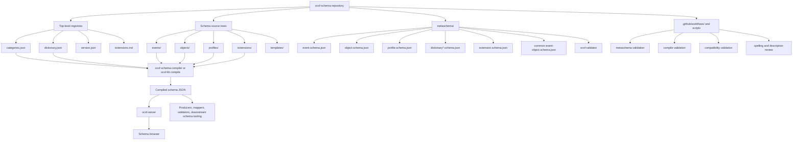
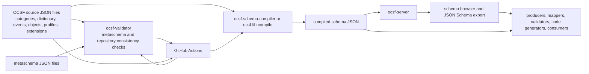
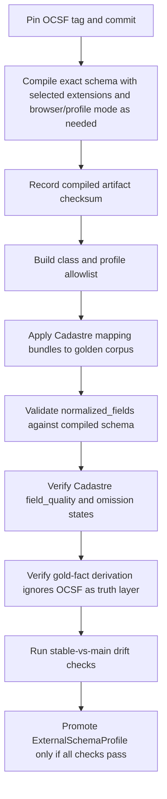

## 1. Executive summary for Cadastre

OCSF is an open, vendor-neutral schema framework for cybersecurity event logging and normalization. The official OCSF organization describes the framework as a set of data types, an attribute dictionary, and a taxonomy, with JSON schema-definition files and resulting normative schema artifacts. It is explicitly agnostic to storage format, data collection, and ETL process.[^1]

The `ocsf/ocsf-schema` repository is primarily a schema-definition repository. It contains OCSF source definitions for categories, event classes, objects, profiles, extensions, metaschemas, templates, and top-level version metadata. It is not a runtime ingestion engine, not an identity resolver, not a graph database model, and not a bitemporal fact model.[^2]

For Cadastre, OCSF is useful as an external semantic profile for `CadastreSilverObservation.normalized_fields`. It gives Cadastre a stable, externally understood event and object vocabulary for observations such as inventory, software inventory, vulnerability findings, authentication, group management, DNS, DHCP, and network activity. It must not become Cadastre’s canonical truth layer, identity-resolution layer, bitemporal gold-fact layer, graph-projection model, omission-state model, or CIM projection model.

Bottom-line recommendation:

| Decision area | Recommendation |
| --- | --- |
| Immediate OCSF baseline | Use stable OCSF `1.8.0` as the initial production mapping baseline. The inspected release page marks `1.8.0` as the latest release, and `main` is `1.9.0-dev`.[^3][^4] |
| Main branch usage | Treat `main` as forward-looking drift only. Do not use `main`-only fields, enums, classes, profiles, or extension behavior in production mappings unless Cadastre explicitly creates a non-production shadow profile. |
| Highest-priority repository areas | `categories.json`, `dictionary.json`, `events/`, `objects/`, `profiles/`, `extensions/`, `metaschema/`, `.github/workflows/`, and the compiler/validator/server references. |
| Directly useful OCSF concepts | Event classes, category/class/activity identifiers, dictionary attributes, objects, profiles, extensions, observables, constraints, associations, and enum sibling conventions. |
| Cadastre-owned concepts | Source evidence preservation, omission states, field quality, source-to-canonical identity resolution, bitemporal facts, conflict/staleness semantics, deterministic graph deltas, and CIM projection loss accounting. |
| Required validation before final `ExternalSchemaProfile` | Compile and validate the exact `1.8.0` schema with selected profiles/extensions, create a class allowlist, define profile and extension policy, build a golden corpus, verify every MVP observation mapping, and explicitly decide how to handle OCSF `unmapped`, `raw_data`, observables, and enrichments. |
| Known drift requiring attention | Network Activity initiator semantics differ between stable `1.8.0` and `main`. Stable `1.8.0` uses `src_endpoint`, `dst_endpoint`, and `is_src_dst_assignment_known`; `main` adds `initiator` and `initiator_id` and deprecates `is_src_dst_assignment_known` since `1.9.0`.[^13] |

Operationally, Cadastre should create a pinned `ExternalSchemaProfile` for OCSF `1.8.0` that includes:

1. Exact OCSF tag and commit SHA.
2. Exact compiler or schema-browser artifact checksum once compiled locally.
3. Class allowlist for every supported Cadastre observation type.
4. Explicit profile set and extension policy.
5. Mapping rules for unknown enum values and OCSF `Other` values.
6. Golden corpus cases proving that Cadastre-owned omission, identity, temporal, confidence, and lineage fields remain outside OCSF.

## 2. Repository identity and inspection boundary

| Field | Required content |
| --- | --- |
| Repository URL | `https://github.com/ocsf/ocsf-schema` |
| Primary branch inspected | `main`, commit `dbaca742043e97bb46c0545dd3204a71bbe2752c`, latest inspected commit dated May 13, 2026. |
| Main branch schema version | `1.9.0-dev` from `version.json`. |
| Stable tag inspected | `1.8.0`, commit `6fa6499a0f8c9f449d342816e90e5f687c224b0a`. |
| Release date inspected | GitHub release page shows release `1.8.0`, released March 18, 2026. The embedded changelog labels `[v1.8.0] - Mar 16th, 2026`. |
| Documentation inspected | OCSF GitHub organization README, `ocsf-schema` README, release page, raw schema files, raw metaschema files, `ocsf-server` README, `ocsf-validator` README, `ocsf-lib-py` README, OCSF examples JSON encoding README, and `CONTRIBUTING.md`. |
| Tooling inspected | `.github/workflows/validate-metaschema.yml`, `validate-compile.yml`, `validate-compatibility.yml`, `linter.yml`, `description-review-compile.yml`, `description-review-comment.yml`, legacy server validation workflow, `.github/scripts/review_descriptions.py`, and references to `ocsf-schema-compiler`, `ocsf-validator`, and `ocsf-lib`. |
| Local commands run | Attempted `git clone --depth 1 https://github.com/ocsf/ocsf-schema.git /mnt/data/ocsf-schema-test`. The command failed with `fatal: unable to access ... Could not resolve host: github.com`. |
| Uninspected or inaccessible areas | No local clone was available. Compiler and validator commands were not run locally. No generated compiled schema artifact was produced locally. GitHub release assets were not inspected beyond the web-rendered release page. Workflow run logs were not inspected. Schema-browser rendered output was inspected only through linked documentation and source references, not by running the server. |

The repository identity, branch, release, documentation, and local-command rows above are based on GitHub repository pages, raw repository files, official OCSF documentation, and the failed local clone command output.[^2][^3][^4][^10][^11][^15]

## 3. OCSF conceptual model

OCSF’s model is a schema framework with a taxonomy and source schema files that compile into externally consumable schema artifacts. The official OCSF organization describes the framework as data types, an attribute dictionary, and taxonomy. The `ocsf-schema` README describes the framework as categories, event classes, objects, and attributes, with a core schema intended to be implementation-agnostic.[^1][^2]

| Concept | What it is | Where it is defined | Why it matters to Cadastre | Cadastre caution |
| --- | --- | --- | --- | --- |
| Taxonomy | The organizing system for cybersecurity event classes. | `categories.json`, `events/`, README, official OCSF overview. | Provides the external semantic namespace for `normalized_fields`. | Use for external class selection only. Do not treat taxonomy as Cadastre’s gold fact taxonomy. |
| Categories | Top-level groupings such as Findings, IAM, Network Activity, Discovery, System Activity, Application Activity, and Remediation. | `categories.json`; category base classes under `events/<category>/<category>.json`. | Used to select and validate event class families. | Keep category metadata in schema-profile metadata or normalized fields. Do not use categories as Cadastre source categories without a separate mapping. |
| Event classes | Concrete or base event definitions with attributes, requirements, activity enums, constraints, profiles, and inheritance. | `events/base_event.json`, category base classes, concrete files under `events/*/*.json`. | Main target for Cadastre observation-to-OCSF mapping. | Event classes describe observations or events, not canonical facts. |
| Activities | Per-class activity enum values under `activity_id`. | Event class files and inherited category base files. | Enables deterministic `activity_id`, `activity_name`, and `type_uid` mapping. | Unknown source activity must preserve raw value and field quality. Do not coerce into a known OCSF activity. |
| Attributes | Named fields with type, group, requirement, enum, sibling, source, and references metadata. | `dictionary.json`, event/object/profile attribute overrides, `metaschema/attribute.schema.json`. | Primary field-level vocabulary for `normalized_fields`. | Attribute presence or absence does not preserve Cadastre omission semantics by itself. |
| Attribute dictionary | Global catalog of standardized attributes and data types. | `dictionary.json`, validated by dictionary metaschemas. | Prevents each event class from redefining common fields inconsistently. | Do not use dictionary types as Cadastre canonical type system without translation. |
| Objects | Reusable nested data structures such as `device`, `endpoint`, `user`, `group`, `vulnerability`, `network_endpoint`, and `dns_answer`. | `objects/*.json`. | Useful for nested normalized observation payloads. | Objects can carry observed identifiers but do not resolve Cadastre canonical identities. |
| Profiles | Overlay or mixin definitions that add reusable attributes to classes or objects. | `profiles/*.json`; profile metaschema describes profiles as dynamic mix-ins. | Useful for host, cloud, datetime, security-control, network proxy, incident, container, and trace context. | Cadastre must explicitly declare enabled profiles in the active `ExternalSchemaProfile`. |
| Extensions | Schema additions that can define attributes, objects, profiles, event classes, categories, and extension metadata. | `extensions/`, `extensions.md`, `metaschema/extension.schema.json`, `CONTRIBUTING.md`. | Useful for Cadastre-specific fields that do not fit core OCSF. | Extensions must be governed. Do not use vendor extensions as authoritative Cadastre truth. |
| Observables | Observable value-type metadata used to mark attributes or objects that can become observable values. | `observables` in event/object files and `metaschema/observable.schema.json`. | Useful as extraction hints for indicators, endpoints, users, and other graph candidates. | Observables are not graph nodes by themselves. Cadastre graph nodes must derive from Cadastre facts. |
| Enrichments | Contextual enrichment information available on base events. | `events/base_event.json` includes `enrichments` as optional. | Useful for preserving external enrichment context in silver observations. | Cadastre-owned enrichment rules and gold derivations must remain separate. |
| Constraints | Schema-source constraints such as `at_least_one` and `just_one`. | `metaschema/common-event-object.schema.json`; event and object files. | Useful for validating normalized_fields completeness. | Constraints validate OCSF shape, not Cadastre omission state or source coverage. |
| Associations | Relationships between attributes inside a class. | `event.schema.json` allows associations; representative use appears in `authentication.json`. | Useful as mapping guidance for actor, source, destination, and target relationships. | Associations are not Cadastre identity-resolution decisions. |
| Class identifiers and UID conventions | Category UID, local class UID, class UID, activity ID, and type UID classification fields. | `categories.json`, event source files, `base_event.json`, examples. | Required for stable external class metadata in silver observations. | Store exact OCSF identifiers in schema-profile metadata and normalized fields, not as Cadastre entity IDs. |
| Versioning and compatibility | Stable tags, `version.json`, release changelog, and compatibility workflows. | `version.json`, GitHub releases, `.github/workflows/validate-compatibility.yml`. | Cadastre must pin schema versions and reject dev versions in production. | Do not silently track `main`. Production mapping must use a stable pinned version. |

The concept table is derived from the inspected OCSF top-level files, representative schema files, metaschemas, extension docs, and official organization documentation.[^1][^2][^5][^6][^7][^8][^9][^12][^14]

## 4. Top-level repository reconstruction

The repository root is organized around JSON schema-source files and validation/automation metadata. The top-level GitHub page lists `.github/`, `events/`, `extensions/`, `metaschema/`, `objects/`, `profiles/`, `templates/`, `categories.json`, `dictionary.json`, `extensions.md`, and `version.json`.[^2]

| Path | Required analysis |
| --- | --- |
| `categories.json` | Defines the category registry. In `1.8.0`, categories include Application Activity, Discovery, Findings, IAM, Network Activity, Remediation, System Activity, and Unmanned Systems. Each category has a caption, description, name, and UID. Event class files inherit category semantics through category base classes such as `events/network/network.json` and `events/discovery/discovery.json`. |
| `dictionary.json` | Defines the global attribute dictionary. It states that it is the authoritative reference for standardized attribute definitions and consistent usage. Attributes include type names, enum definitions, sibling relationships, observable metadata, source references, and references. Enum ID attributes commonly have sibling string attributes, such as `activity_id` with sibling `activity_name`. |
| `version.json` | Defines the schema version for the checked-out ref. Stable tag `1.8.0` contains `"version": "1.8.0"`; inspected `main` contains `"version": "1.9.0-dev"`. |
| `events/` | Contains event definitions. `events/base_event.json` defines base classification, occurrence, metadata, severity, raw-data, unmapped, observables, and enrichment fields. Category base classes define shared category fields. Concrete event classes define local UID, activity enum, class-specific attributes, constraints, and references. |
| `objects/` | Contains reusable object definitions. Objects can inherit from other objects, include attributes, define observables, and impose constraints. Relevant objects include `device`, `endpoint`, `user`, `group`, `vulnerability`, `package`, `sbom`, `network_endpoint`, `dns_answer`, `resource_details`, and `finding_info`. |
| `profiles/` | Contains reusable overlays or mixins. Representative profiles include `host`, `cloud`, `datetime`, `security_control`, `network_proxy`, `incident`, `container`, and `trace`. |
| `extensions/` | Contains extension-local schema trees. Native platform extensions in `1.8.0` include Linux, Windows, and macOS. The extension registry reserves UIDs for native and external extensions. Extension docs state that extensions may add attributes, objects, profiles, event classes, and categories. |
| `metaschema/` | Contains JSON Schema files that validate OCSF source schema documents. These schemas define allowed properties, required fields, enum shapes, extension metadata, observable metadata, references, deprecation metadata, semver format, constraints, include mechanisms, and inheritance mechanisms. |
| `templates/` | Contains starter templates for new event classes and objects. `event_class_name.json` asks contributors to supply category, description, `extends`, name, integer UID, and attributes. `object_name.json` asks contributors to supply caption, description, name, and attributes. |
| `.github/workflows/` | Contains workflows for metaschema validation, compile validation, compatibility validation, spelling/linting, schema-server validation for older branch patterns, and AI-assisted description review. |
| `.github/scripts/` | Contains `review_descriptions.py`, a review helper that prepares schema context and reviews changed descriptions, including anti-pattern checks. The script includes a network-initiator example where boolean `is_src_dst_assignment_known` is flagged as less suitable than enum `initiator_id`. |
| Docs or generated output directories | The repository does not appear to commit a compiled schema artifact at the top level. The external `ocsf-server` documentation explains compiling schema source into a JSON object and serving a schema browser. |

The path analysis is based on the root directory listing, raw top-level JSON files, representative event/object/profile files, extension files, templates, metaschema files, and workflow/script files.[^2][^5][^6][^7][^8][^9][^10][^11][^12]

## 5. Schema-source data model

OCSF schema-source files are JSON documents, usually compact or minified in raw form. Event, object, and profile definitions share a common vocabulary:

| Field or mechanism | Meaning |
| --- | --- |
| `caption` | Human-facing display label. |
| `description` | Human-facing semantic explanation. |
| `name` | Lowercase schema name. |
| `uid` | Numeric local identifier for classes, categories, extensions, or other identified constructs. |
| `extends` | Inheritance from another event or object definition. |
| `attributes` | Map of attribute names to overrides or local definitions. |
| `$include` | Include mechanism for reusable profile or attribute bundles. |
| `profiles` | Applied profile names. |
| `constraints` | Structural constraints such as `at_least_one` or `just_one`. |
| `associations` | Associations among attributes in an event class. |
| `observables` | Mapping from attribute paths to observable value types. |
| `references` | External references supporting the definition. |
| `@deprecated` | Deprecation metadata with message and version. |

This data model is validated by the event, object, profile, dictionary, attribute, enum, observable, reference, deprecation, and common-event-object metaschemas.[^9]

### 5.1 Representative event classes

Base required fields come from `events/base_event.json`: `activity_id`, `category_uid`, `class_uid`, `metadata`, `severity_id`, `time`, and `type_uid` are required. `observables`, `message`, status fields, timezone offset, and several raw/unmapped fields are present as optional or recommended attributes. The official OCSF examples show encoded events with `class_uid` and `type_uid`, and the examples demonstrate the common `type_uid = class_uid * 100 + activity_id` pattern through values such as `class_uid: 5001` and `type_uid: 500102`.[^5][^14]

| Event class | Category | File path | UID/class identifiers | Extends | Required attributes | Recommended attributes | Relevant objects | Relevant profiles | Cadastre relevance | Gaps or cautions |
| --- | --- | --- | --- | --- | --- | --- | --- | --- | --- | --- |
| Base Event | Other / base | `events/base_event.json` | Base `class_uid=0`; base `activity_id` enum includes Unknown and Other. | none | `activity_id`, `category_uid`, `class_uid`, `metadata`, `severity_id`, `time`, `type_uid`. | `message`, `observables`, `status`, `status_code`, `status_detail`, `timezone_offset`. | `metadata`, observables, enrichment objects. | `cloud`, `datetime`, `host`, `osint`, `security_control`. | Defines the external classification envelope expected in every OCSF event. | Do not replace Cadastre source metadata, evidence refs, or omission states with base-event fields. |
| Discovery base | Discovery | `events/discovery/discovery.json` | Category UID `5`; activity values inherited by discovery classes include Log and Collect. | `base_event` | Base required fields. | Category-specific inherited fields are minimal. | Depends on concrete class. | Base profiles. | Parent for inventory and query-style observations. | Category inheritance must be compiled or resolved before validation. |
| Device Inventory Info | Discovery | `events/discovery/inventory_info.json` | Local UID `1`; inferred class UID `5001`. | `discovery` | `device` plus base required fields. | Actor is optional. | `device`, `endpoint`. | Base profiles, host profile through base. | Strong candidate for `host_identifier_observation` and `device_state_observation`. | Device object identifiers are source observations, not canonical host identity. |
| Software Inventory Info | Discovery | `events/discovery/software_info.json` | Local UID `20`; inferred class UID `5020`. | `discovery` | `device` plus base required fields. | `sbom` recommended; package is deprecated since `1.4`. | `device`, `sbom`, `package`, software components. | Base profiles. | Strong candidate for `software_observation`. | Cadastre must preserve package identity, source-native package fields, and coverage semantics outside OCSF when needed. |
| Finding base | Findings | `events/findings/finding.json` | Category UID `2`; base for findings. | `base_event` | `finding_info` plus base required fields. | `confidence`, `confidence_id`, `device`, `impact`, status fields. | `finding_info`, `device`. | `incident` profile. | Shared structure for findings and vulnerabilities. | Finding status is not Cadastre assertion state. |
| Vulnerability Finding | Findings | `events/findings/vulnerability_finding.json` | Local UID `2`; inferred class UID `2002`. | `finding` | `vulnerabilities` plus finding/base required fields. | `resources`; `resource` is deprecated in favor of `resources`. | `vulnerability`, `resource_details`, `finding_info`. | Finding base includes `incident`; class references security-control and incident profile context. | Primary OCSF target for `vulnerability_finding_observation`. | Vulnerability absence, scan coverage, stale state, and conflict state must remain Cadastre-owned. |
| Network base | Network Activity | `events/network/network.json` | Category UID `4`; base for network classes. | `base_event` | Base required fields; `at_least_one` requires `dst_endpoint` or `src_endpoint`. | `connection_info`, `dst_endpoint`, `proxy`, `src_endpoint`, `traffic`. | `network_endpoint`, traffic, connection info, proxy. | `network_proxy`, `load_balancer`, base profiles. | Common structure for flows, DNS, DHCP, HTTP, tunnels, and related network observations. | Observed traffic is not theoretical reachability. Direction and initiator semantics require special handling. |
| Network Activity | Network Activity | `events/network/network_activity.json` | Local UID `1`; inferred class UID `4001`; activities Open, Close, Reset, Fail, Refuse, Traffic, Listen. | `network` | Base required fields; inherited network endpoint constraint. | `src_endpoint`, `dst_endpoint`, URL, and in `1.8.0` `is_src_dst_assignment_known`. | `network_endpoint`, URL, traffic. | `network_proxy`, `load_balancer`. | Candidate for `firewall_flow_observation`. | In `main`, initiator semantics change. Production mappings must use `1.8.0` semantics until Cadastre adopts a stable later version. |
| DNS Activity | Network Activity | `events/network/dns_activity.json` | Local UID `3`; inferred class UID `4003`; activities Query, Response, Traffic. | `network` | Base required fields; inherited network constraints. | `query`, `answers`, DNS response code fields, traffic context. | `dns_answer`, DNS query, network endpoints. | `network_proxy`, `load_balancer`. | Primary OCSF target for `dns_resolution_observation`. | TTL and staleness semantics must remain Cadastre-owned. |
| DHCP Activity | Network Activity | `events/network/dhcp_activity.json` | Local UID `4`; inferred class UID `4004`; DHCP discover, offer, request, decline, ack, nak, release, inform, expire. | `network` | Base required fields; inherited network constraints. | `lease_dur`, `relay`, `transaction_uid`, endpoints. | `network_endpoint`. | `network_proxy`, `load_balancer`. | Candidate for `ip_assignment_observation`. | DHCP/IPAM assignment truth and lease validity require Cadastre temporal facts. |
| IAM base | Identity and Access Management | `events/iam/iam.json` | Category UID `3`; base for IAM classes. | `base_event` | Base required fields. | `actor`, `src_endpoint`; HTTP request/response optional. | `actor`, `endpoint`, HTTP request/response. | Base profiles. | Parent for authentication, group, and entity management observations. | IAM activity is not Cadastre identity resolution. |
| Authentication | IAM | `events/iam/authentication.json` | Local UID `2`; inferred class UID `3002`; activities include Logon, Logoff, Authenticate, Pre-authentication, Account Switch. | `iam` | `user` plus base required fields; class has at-least-one constraint for service or destination endpoint. | Auth factors, protocol, source/destination endpoint, session, service, account switch metadata. | `user`, endpoints, service, auth factors/session. | Base profiles. | Candidate for `user_host_activity_observation` and authentication telemetry. | Login activity can support evidence but must not imply host ownership without Cadastre policy. |
| Group Management | IAM | `events/iam/group_management.json` | Local UID `6`; inferred class UID `3006`; assign/revoke/add/remove member-style activities. | `iam` | `group` plus base required fields. | `user`, `subgroup`, `resource`, `privileges`. | `group`, `user`, resource. | Base profiles. | Candidate for `identity_membership_observation`. | Membership facts must be derived through Cadastre identity and temporal contracts. |
| Entity Management | IAM | `events/iam/entity_management.json` | Local UID `4`; inferred class UID `3004`; CRUD, move, enroll, enable, disable, lock, unlock, and similar activities. | `iam` | `entity` plus base required fields. | `entity_result`. | Generic entity objects. | Base profiles. | Useful for directory object lifecycle observations. | Generic entity semantics may be too broad for canonical Cadastre identity decisions. |

The representative event rows above come from stable `1.8.0` raw event files and top-level category metadata. Class UID values marked as inferred combine the inspected category UIDs and local event-class UIDs; Cadastre should verify exact compiled class UIDs from the compiled `1.8.0` schema before freezing an `ExternalSchemaProfile`.[^5][^6][^14]

#### 5.2 Representative objects relevant to Cadastre

| Object | File path | Structure summary | Cadastre relevance | Cadastre caution |
| --- | --- | --- | --- | --- |
| Device | `objects/device.json` | Extends `endpoint`; represents addressable computers, hosts, servers, mobile devices, VMs, containers, or similar systems. `type_id` is required; hostname, OS, hardware info, location, agent list, owner, and UID are relevant. | Host and device observations. | A device object is observed source data, not a canonical host. |
| Endpoint | `objects/endpoint.json` | Extends `_entity`; network-connected endpoint with IP, hostname, domain, UID, name, MAC, subnet, VLAN, and type fields; includes `container` profile. | Common endpoint shape for network, IAM, and device data. | Endpoint constraints can suggest identity candidates but must not auto-merge. |
| User | `objects/user.json` | Extends `_entity`; name, UID, account, credential, email, organization, type, and constraints requiring at least one of account/name/UID. | User observations and login evidence. | User object identity is source-observed until Cadastre resolves it. |
| Group | `objects/group.json` | Represents a collection or association of entities, access-control grouping, or classification. | Group and membership observations. | Group membership facts require temporal source authority and identity resolution. |
| Vulnerability | `objects/vulnerability.json` | Extends object; includes CVE/CWE/advisory-related metadata, first/last seen, affected packages/code, fix coverage, and constraints around advisory/CVE/CWE. | Vulnerability finding observations. | Vulnerability object fields do not represent Cadastre scan coverage or absence semantics by themselves. |
| Package | `objects/package.json` | Software package with required name and version; architecture, license, path, package manager, UID, and vendor metadata. | Software inventory observations. | Package identity normalization must preserve source-native package identifiers and ecosystems. |
| SBOM | `objects/sbom.json` | Requires a package and software components; supports SPDX, CycloneDX, and SWID types. | Rich software inventory and dependency observations. | SBOM semantics may exceed MVP software observation scope. |
| Network Endpoint | `objects/network_endpoint.json` | Extends endpoint and represents a source or destination endpoint in network activity; port is recommended; proxy endpoint handles NAT/proxy cases. | Network flow, DNS, DHCP, and firewall observations. | Source/destination/initiator semantics must not be overfit to `1.8.0`. |
| DNS Answer | `objects/dns_answer.json` | Extends DNS object; `rdata` required, TTL/type/class recommended. | DNS resolution observations. | TTL must feed Cadastre staleness logic rather than remain only as an OCSF field. |
| Resource Details | `objects/resource_details.json` | Extends `_resource`; includes cloud profile; supports role IDs such as target, actor, affected, and related. | Cloud and vulnerability-resource observations. | Resource roles are not Cadastre graph edges until gold derivation. |
| Finding Info | `objects/finding_info.json` | Finding metadata including UID, title, first/last seen, product, and related context. | Vulnerability and control finding observations. | Finding timestamps and status must be translated into Cadastre valid/known time and assertion state. |

The object table is based on stable `1.8.0` object source files.[^7]

#### 5.3 Representative profiles relevant to Cadastre

| Profile | File path | Purpose | Cadastre relevance | Cadastre caution |
| --- | --- | --- | --- | --- |
| Host | `profiles/host.json` | Adds actor and device context. | Useful for host-aware observations. | Do not equate `device` profile presence with canonical host resolution. |
| Cloud | `profiles/cloud.json` | Adds API and cloud context; cloud object requires provider. | Useful for cloud asset observations and cloud resource findings. | Cloud account/resource identity must remain source-scoped until Cadastre resolution. |
| Datetime | `profiles/datetime.json` | Adds RFC3339 date/time profile behavior without local attributes in the profile file. | Useful for timestamp serialization compatibility. | Cadastre temporal model remains bitemporal and separate. |
| Security Control | `profiles/security_control.json` | Adds control action, disposition, policy, firewall rule, malware, risk, and alert context. | Useful for control-state observations and network/security-control context. | Control outcome is not Cadastre assertion state or policy compliance truth without derivation. |
| Network Proxy | `profiles/network_proxy.json` | Adds proxy connection, endpoint, request/response, TLS, and traffic context. | Useful for proxy-aware network telemetry. | Proxy fields are observation context, not graph reachability. |
| Incident | `profiles/incident.json` | Adds incident handling, impact, verdict, source URL, and ticket context. | Useful for findings that are incident-associated. | Incident workflow state must not replace Cadastre fact state. |
| Container | `profiles/container.json` | Adds container and namespace PID context. | Useful for workload and containerized endpoint observations. | Container identity and host identity must remain separately modeled. |
| Trace | `profiles/trace.json` | Adds observability trace context. | Useful if Cadastre ingests trace-backed security events. | Trace IDs are correlation metadata, not canonical asset IDs. |

The profile table is based on stable `1.8.0` profile source files.[^8]

## 6. Metaschema and validation model

OCSF uses metaschema files to define valid schema-source documents. These metaschemas govern source files in `events/`, `objects/`, `profiles/`, `dictionary.json`, extension metadata, attribute definitions, enum definitions, observables, references, semver fields, and shared event/object constructs.[^9]

The external `ocsf-validator` documentation states that individual schema files may be incomplete because of include mechanisms, and that validation covers JSON validity, directory structure, include/profile/extends targets, required attributes, unrecognized attributes, dictionary usage, name collisions, and attributes being defined in the dictionary.[^11]

| Metaschema file | Governs | Required fields or constraints | Cadastre impact |
| --- | --- | --- | --- |
| `metaschema/event.schema.json` | Event class source files. | Uses common event/object schema; allows deprecation metadata, description, caption, name, extends, constraints, profiles, references, attributes, associations, category, UID, and observables; local UID minimum `0`, maximum `999`; no additional properties. | Cadastre can validate event-class source structure when building schema profiles or extensions. |
| `metaschema/object.schema.json` | Object source files. | Uses common object schema; supports observable metadata; no additional properties. | Cadastre can validate OCSF object definitions used in normalized fields. |
| `metaschema/profile.schema.json` | Profile source files. | Profiles are overlays or dynamic mix-ins; supports annotations, caption, description, extends, name, attributes, and includes; requires either full definition shape or extends. | Cadastre must explicitly declare profile set and validate profile overlay behavior. |
| `metaschema/dictionary.schema.json` | Global dictionary file. | Requires dictionary caption and name; supports `attributes` and `types`; type attributes conventionally end in `_t`. | Cadastre must treat dictionary types as external schema types requiring translation into Cadastre types. |
| `metaschema/dictionary-attribute.schema.json` | Individual dictionary attribute definitions. | Requires caption, description, and type; supports enum, sibling, array flag, observable, source, references, and suppress checks. | Cadastre must preserve enum sibling behavior, especially ID/string pairs such as `activity_id`/`activity_name`. |
| `metaschema/extension.schema.json` | Extension metadata files. | Extensions can add attributes, objects, profiles, event classes, and categories; required fields include description, caption, name, UID, and semver version. | Cadastre extension governance must prevent UID/name collisions and dev-version leakage. |
| `metaschema/common-event-object.schema.json` | Shared event/object shape. | Defines `name`, `extends`, `constraints`, `profiles`, `references`, attributes, `$include`, and `at_least_one`/`just_one` constraints. | Cadastre can use these constraints to validate OCSF-shaped `normalized_fields`, but not to represent omission semantics. |
| `metaschema/attribute.schema.json` | Attribute override/source entries. | Defines groups such as context, classification, occurrence, and primary; requirement levels include optional, recommended, and required; primary attributes can only be recommended or required. | Cadastre must distinguish OCSF “recommended” from Cadastre “required for product correctness.” |
| `metaschema/enum.schema.json` | Enum values. | Enum values map to objects with required caption and optional description, source, references, and deprecation metadata; no additional properties. | Unknown enum handling must preserve raw values and field quality rather than silently coercing. |
| `metaschema/observable.schema.json` | Observable value-type metadata. | Observable type value is an integer with minimum `0`; observables must be unique. | Cadastre may use observables as extraction hints but not as authoritative graph-node creation rules. |
| `metaschema/references.schema.json` | Reference arrays. | Reference entries include URL and description; the schema notes escape requirements for literal colon handling. | Cadastre can carry reference metadata but should not depend on it for runtime behavior. |
| `metaschema/semver.schema.json` | Semantic-version strings. | Enforces a semantic-version regex pattern. | Cadastre must pin exact stable OCSF versions in production schema profiles. |
| `metaschema/categories.schema.json` | Category registry. | Categories organize event classes; category UID is integer with minimum `0`. | Cadastre should validate category registries for any Cadastre-owned extensions. |
| `metaschema/deprecated.schema.json` | Deprecation metadata. | Requires deprecation message and `since`. | Cadastre schema-profile promotion should fail or warn on mappings to deprecated fields depending on policy. |

The metaschema table is based on stable `1.8.0` metaschema files and the official validator documentation.[^9][^11]

## 7. Compilation, generated behavior, and control flow

The repository’s externally visible behavior is produced by source schema files plus tooling that validates, compiles, and serves or consumes compiled schema outputs.

The inspected control flow is:

### 7.1 Tooling roles

| Tool or workflow | Observed role | Cadastre impact |
| --- | --- | --- |
| `ocsf-validator` | Validates source schema files, include targets, extends targets, required attributes, dictionary usage, name collisions, and related repository rules. | Cadastre should use it when authoring Cadastre-specific OCSF extensions or checking pinned source schema trees. |
| `ocsf-schema-compiler` | Compiles OCSF schema source into generated schema output. Workflows invoke it against the repository. | Cadastre should compile the exact pinned `1.8.0` schema and store checksum and compiler version in `ExternalSchemaProfile`. |
| `ocsf-lib` / `ocsf-lib-py` | Provides CLI functions such as compile, compare, schema inspection, and compatibility validation. | Cadastre can use compatibility validation when assessing profile upgrades from `1.8.0` to later versions. |
| `ocsf-server` | Loads compiled schema JSON and serves schema-browser behavior. Documentation states that browser mode compilation is needed for schema browser use, and extensions are processed deterministically by UID. | Cadastre can use server/browser output for human review and generated JSON Schema, but production validation should use pinned artifacts. |
| `validate-metaschema.yml` | Installs `ocsf-validator` and runs validation against the repository. | Confirms schema-source conformance behavior used by maintainers. |
| `validate-compile.yml` | Installs `ocsf-schema-compiler` and verifies the repository compiles. | Confirms that source definitions can generate compiled schema. |
| `validate-compatibility.yml` | Installs `ocsf-lib` and runs compatibility validation against a stable baseline. | Relevant to Cadastre upgrade safety and drift assessment. |
| `linter.yml` | Runs spelling/lint checks through cspell. | Human-quality support only, not schema behavior. |
| `description-review-*` workflows and `review_descriptions.py` | Compile schema context and perform description review, including anti-pattern checks. | Useful for understanding maintainer review, but not normative schema behavior. |

The workflow and tooling analysis is based on the inspected GitHub Actions files, `.github/scripts/review_descriptions.py`, and official `ocsf-server`, `ocsf-validator`, and `ocsf-lib-py` documentation.[^10][^11]

#### 7.2 Generated artifact model

The `ocsf-server` documentation describes compiling schema source into a single JSON object, optionally using browser mode, then loading that compiled file through `SCHEMA_FILE` for schema-browser serving. It also states that platform extensions are included by default and extension processing order is deterministic: platform extensions by ascending UID, then other extensions by ascending UID.[^11]

Cadastre impact:

1. Cadastre must not validate production observations against loosely tracked source files.
2. Cadastre should compile the exact `1.8.0` source tree with the exact profile/extension selection it intends to support.
3. Cadastre should store:
   - OCSF tag.
   - OCSF commit SHA.
   - Compiler/tool version.
   - Extension set.
   - Profile set.
   - Compiled artifact checksum.
4. Cadastre should validate `normalized_fields` against the compiled artifact or an equivalent generated schema artifact.
5. Cadastre should treat generated schema-browser output as review evidence unless the exact generated artifact is versioned and checksummed.

## 8. Stable `1.8.0` versus `main` drift

Cadastre’s production baseline should remain OCSF `1.8.0` unless a later stable release is explicitly selected. The inspected release page marks `1.8.0` as the latest release, and the tag resolves to commit `6fa6499a0f8c9f449d342816e90e5f687c224b0a`. The inspected `main` branch resolves to commit `dbaca742043e97bb46c0545dd3204a71bbe2752c` and contains `version.json` value `1.9.0-dev`.[^3][^4]

### 8.1 Network Activity initiator/source-destination drift

| Area | Stable `1.8.0` | `main` at inspected commit | Cadastre production rule |
| --- | --- | --- | --- |
| Network base source/destination | `events/network/network.json` describes `src_endpoint` as initiator/client and `dst_endpoint` as responder/server. | Still contains source/destination endpoint semantics, plus detailed observation-point fields. | Production `1.8.0` mappings must map source/destination according to stable `1.8.0`. |
| Network Activity ambiguity field | `events/network/network_activity.json` includes `is_src_dst_assignment_known` as a recommended field. | `main` adds `initiator` and `initiator_id`, explains bi-flow/asymmetric scenarios, and deprecates `is_src_dst_assignment_known` since `1.9.0`. | Do not emit `initiator_id` in production `1.8.0` normalized fields. Add forward-compatible Cadastre mapping tests for future upgrade. |
| Initiator semantics | Stable schema gives only boolean assignment-confidence semantics through `is_src_dst_assignment_known`. | `initiator_id` enum distinguishes Unknown, Source Endpoint, Destination Endpoint, and Other. | Cadastre should preserve raw source/destination and initiator evidence in Cadastre-owned fields so an upgrade to a richer OCSF field does not change gold fact semantics. |

This is a material drift for Cadastre. Network Activity is likely to feed `firewall_flow_observation` and observed network relationship facts. A boolean field in `1.8.0` is insufficient for full initiator modeling in asymmetric or bidirectional flow logs. Cadastre must not infer gold graph edge direction solely from OCSF source/destination fields. It must derive graph edge direction through Cadastre-owned mapping and flow-role logic.

The drift table is based on stable `1.8.0` and `main` raw Network Activity and Network base files.[^6][^13]

#### 8.2 Other `main` considerations

The inspected `main` branch is `1.9.0-dev`; therefore every `main`-only addition is forward-looking. The inspected main dictionary includes newer concepts such as access analysis and AI-related attributes, but these are not production assumptions for a Cadastre `1.8.0` baseline.[^4][^13]

Cadastre upgrade policy:

1. A later stable OCSF version may be considered only after official release inspection.
2. Upgrade assessment must compare:
   - Class allowlist.
   - Attribute additions/removals.
   - Deprecated fields.
   - Enum changes.
   - Profile changes.
   - Extension changes.
   - Network initiator behavior.
3. Production deployment must not mix `1.8.0` class definitions with `main`-branch fields.

## 9. Hypothesis verification

| Hypothesis | Verdict | Evidence and correction |
| --- | --- | --- |
| 1. The repository is primarily a schema-definition repository, not a runtime ingestion engine. | Verified. | README and repository layout describe core schema definitions, schema source files, validation, and compilation. Runtime ingestion is not implemented in this repository.[^2] |
| 2. Core source definitions are organized around `events/`, `objects/`, `profiles/`, `extensions/`, `metaschema/`, `templates/`, `categories.json`, `dictionary.json`, and `version.json`. | Verified. | The root listing contains those paths.[^2] |
| 3. OCSF taxonomy is organized around categories, event classes, activities, attributes, objects, profiles, extensions, observables, and enrichments. | Mostly verified. | Categories, classes, activities, attributes, objects, profiles, extensions, observables, and enrichments are present. Constraints and associations are also important schema-source constructs and should be included in Cadastre’s mental model.[^5][^6][^7][^8][^9][^12] |
| 4. Event classes use category/class/activity identifiers, including `category_uid`, `class_uid`, `activity_id`, and `type_uid`, with `type_uid` derived from class and activity identifiers. | Verified with one caveat. | Base Event requires those classification fields. Official OCSF JSON examples show `class_uid` and `type_uid` values consistent with `type_uid = class_uid * 100 + activity_id`. The raw source files themselves define local class UIDs and activity enums; compiled/browser output should be used to verify final generated identifiers.[^5][^14] |
| 5. OCSF profiles act as overlays or mixins that add reusable attributes to multiple event classes. | Verified. | The profile metaschema describes profiles as overlays and dynamic mix-ins, and representative profile files define reusable attributes.[^8][^9] |
| 6. OCSF extensions allow schema additions without modifying the core schema, including attributes, objects, profiles, classes, categories, and extension metadata. | Verified. | Extension metaschema and contribution docs state that extensions can add attributes, objects, profiles, event classes, and categories.[^9][^12] |
| 7. The repository uses metaschema files to validate OCSF schema-source files. | Verified. | `metaschema/` files define source-document validity, and the validation workflow invokes `ocsf-validator` against the repository.[^9][^10][^11] |
| 8. CI workflows validate metaschema conformance, compile schema output, check compatibility against a stable baseline, and run spelling or description review workflows. | Verified. | The inspected workflows cover metaschema validation, compile validation, compatibility validation, cspell linting, server validation for older branch patterns, and description review.[^10] |
| 9. Externally visible behavior is generated schema structure, validation behavior, schema browser content, package/compiler outputs, and mapping guidance for producers and consumers. | Verified. | `ocsf-server`, `ocsf-validator`, and `ocsf-lib-py` documentation describe compile, serve, validate, compare, and compatibility behavior.[^11] |

## 10. Cadastre mapping baseline

### 10.1 Immediate class candidates

| Cadastre observation type | Primary OCSF `1.8.0` candidates | Required Cadastre-owned preservation |
| --- | --- | --- |
| `host_identifier_observation` | Device Inventory Info, Endpoint/Device object, Host profile. | Source asset identity, observed identifier type, raw identifier value, canonicalized identifier value, confidence, omission state, and identity-decision inputs. |
| `device_state_observation` | Device Inventory Info and other Discovery classes depending on source. | Lifecycle state, management state, source authority, last-seen semantics, stale thresholds, and conflicting states. |
| `vulnerability_finding_observation` | Vulnerability Finding. | Scan coverage, negative observation, absence semantics, vulnerability status translation, temporal validity, conflict/staleness, evidence refs. |
| `software_observation` | Software Inventory Info, SBOM, Package object. | Package ecosystem, source-native package ID, installed path, version parsing quality, coverage, and source-specific package fields. |
| `control_state_observation` | Finding base, Vulnerability Finding where applicable, Security Control profile, Compliance-oriented finding classes if selected. | Control definition, coverage, pass/fail/unknown semantics, policy bundle identity, and assertion state. |
| `identity_membership_observation` | Group Management, Entity Management, User Access Management class candidates if selected. | Directory source authority, valid interval, membership subject/object identity, nested groups, and conflict handling. |
| `user_host_activity_observation` | Authentication and other IAM/session/discovery classes depending on source. | User-to-host evidence strength, session validity, ownership policy, and identity correlation. |
| `dns_resolution_observation` | DNS Activity. | TTL, resolver/source context, negative answers, stale rules, and DNS name/IP canonicalization. |
| `ip_assignment_observation` | DHCP Activity, Device Inventory Info, Network Connection Query, or Cadastre extension depending on source. | Lease interval, assignment authority, IPAM source state, and non-merge rule for IP-only identity. |
| `firewall_flow_observation` | Network Activity and protocol-specific network classes such as DNS, HTTP, Tunnel, or related network subclasses. | Source/destination raw roles, initiator evidence, NAT/proxy context, aggregation window, observed-only reachability, and graph edge derivation. |

This table is a Cadastre mapping recommendation derived from the inspected OCSF event, object, and profile definitions. It is not an OCSF-authored mapping table.[^6][^7][^8]

#### 10.2 `ExternalSchemaProfile` requirements for Cadastre

A production Cadastre OCSF profile must include:

| Field | Required value or rule |
| --- | --- |
| `external_schema_name` | `ocsf` |
| `external_schema_version` | `1.8.0` |
| `ocsf_tag` | `1.8.0` |
| `ocsf_commit_sha` | `6fa6499a0f8c9f449d342816e90e5f687c224b0a` |
| `dev_version_allowed` | `false` |
| `class_allowlist` | Every OCSF event class Cadastre may emit in `normalized_fields`. |
| `profile_set` | Explicit list of selected profiles. |
| `extension_policy` | One of `forbid`, `allow_cadastre_extensions`, or a stricter Cadastre-defined policy. |
| `extension_set` | Exact extension names, UIDs, versions, and checksums, if extensions are allowed. |
| `compiled_schema_checksum` | Required after local compilation. |
| `compiler_tool` | Exact tool and version used to compile. |
| `validation_tool` | Exact tool and version used to validate. |
| `mapping_bundle_versions` | Exact mapping bundles allowed to emit the profile. |
| `unknown_enum_policy` | Preserve raw value, use OCSF `Other` only when semantically correct, and record Cadastre field quality. |
| `deprecated_field_policy` | Reject, warn, or allow only with explicit waiver. |
| `network_initiator_policy` | For `1.8.0`, preserve raw role/initiator evidence in Cadastre-owned fields because `initiator_id` is not stable-production in this baseline. |

## 11. Cadastre-owned boundaries

OCSF must remain external semantic alignment only. Cadastre must retain these contracts outside OCSF:

| Cadastre-owned area | Why OCSF is insufficient |
| --- | --- |
| Raw/bronze preservation | OCSF has `raw_data`, `raw_data_hash`, and `unmapped`, but these do not replace immutable raw evidence, payload hashing, adapter lineage, source identity, or retention controls. |
| Omission states | OCSF optional/recommended/required does not distinguish absent, empty, explicit null, malformed, not applicable, not observed, and unknown. |
| Field quality | OCSF validation can reject or accept field shape; it does not preserve Cadastre field-level parse quality and source quality. |
| Identity resolution | OCSF objects such as device, endpoint, user, and group carry observed identity attributes, not canonical entity decisions. |
| Bitemporal facts | OCSF event time fields do not represent Cadastre valid-time and known-time fact intervals. |
| Conflict and stale state | OCSF status, severity, and finding status are not Cadastre assertion states. |
| Graph projection | OCSF associations and observables do not define graph node IDs, edge IDs, edge direction, edge confidence, or projection watermarks. |
| CIM projection | OCSF-to-CIM projection is lossy and consumer-specific. Cadastre must record projection loss and must not infer authoritative semantics from CIM output. |
| Source authority | OCSF is vendor-neutral. It does not decide which source is authoritative for host identity, group membership, vulnerability absence, or network reachability. |
| Upgrade governance | OCSF compatibility workflows help evaluate schema changes, but Cadastre must own production profile promotion, golden corpus validation, and replay behavior. |

## 12. Implementation guidance for Cadastre developers

### 12.1 How to read the repository first

Cadastre developers should inspect the repository in this order:

1. `version.json` for version boundary.
2. `categories.json` for category IDs and names.
3. `events/base_event.json` for classification and common event requirements.
4. Category base class, such as `events/network/network.json`, before concrete classes.
5. Concrete event class, such as `events/network/network_activity.json`.
6. Referenced objects under `objects/`.
7. Applied profiles under `profiles/`.
8. Metaschema file governing the source document.
9. Workflows and compiler/validator docs for generated behavior.
10. `main` branch only for drift analysis, not production assumptions.

#### 12.2 Validation sequence for a Cadastre OCSF profile

Binary acceptance criteria for the initial Cadastre OCSF `1.8.0` profile:

| AC ID | Criterion |
| --- | --- |
| OCSF-PROFILE-001 | The profile declares OCSF `1.8.0` and commit `6fa6499a0f8c9f449d342816e90e5f687c224b0a`. |
| OCSF-PROFILE-002 | The compiled schema artifact checksum is recorded. |
| OCSF-PROFILE-003 | Every supported Cadastre MVP observation type has exactly one mapping row or an explicit `cadastre_only` decision. |
| OCSF-PROFILE-004 | Every mapped OCSF class has exact category UID, class UID, class name, and activity rules. |
| OCSF-PROFILE-005 | Every required OCSF field in the selected class is either produced or the mapping fails before writing silver output. |
| OCSF-PROFILE-006 | Unknown OCSF enum values preserve raw source value and Cadastre field quality. |
| OCSF-PROFILE-007 | Cadastre omission states are preserved outside OCSF normalized fields. |
| OCSF-PROFILE-008 | Network Activity mappings do not rely on `main`-only `initiator_id` in production. |
| OCSF-PROFILE-009 | Golden corpus validation includes valid, malformed, absent, empty, explicit-null, unknown-enum, stale, conflicting, and negative-observation cases. |
| OCSF-PROFILE-010 | No gold fact, identity decision, graph delta, or CIM projection depends on OCSF as the authoritative source of truth. |

## 13. Areas requiring deeper validation

Cadastre cannot finalize an implementation-grade `ExternalSchemaProfile` until these are completed:

| Area | Required validation |
| --- | --- |
| Exact compiled schema | Run compiler locally against tag `1.8.0`; record output mode, tool version, extension set, and checksum. |
| Profile behavior | Verify whether selected profiles are represented in the compiled schema as expected for every class and nested object Cadastre uses. |
| Extension policy | Decide whether Cadastre emits no extensions, a Cadastre-owned extension, or source-specific extension preservation only in Cadastre envelope fields. |
| Network initiator semantics | Build test cases for unidirectional, bidirectional, NAT, proxy, firewall, and asymmetric flow logs. Verify production `1.8.0` behavior and future `1.9` upgrade path. |
| Vulnerability absence | Verify whether source data can express vulnerability absence or only lack of finding. Preserve scan coverage outside OCSF. |
| Software package identity | Validate package, SBOM, and software inventory mappings against source corpora. |
| Identity membership | Verify group, user, entity, and resource semantics against directory sources. Do not infer canonical membership without Cadastre temporal authority. |
| Observables | Decide whether OCSF observables are emitted, generated, or ignored. If emitted, define whether they are redundant with object fields. |
| Raw and unmapped fields | Decide whether to emit OCSF `raw_data`, `raw_data_hash`, or `unmapped`. Cadastre raw evidence must remain authoritative regardless. |
| CIM projection | For every OCSF class Cadastre emits, define whether CIM projection is supported, lossy, unsupported, or forbidden. |
| Upgrade compatibility | Use `ocsf-lib` compatibility validation and Cadastre golden corpus replay before moving beyond `1.8.0`. |

## 14. Sources

[^1]: OCSF GitHub organization README, “Welcome to OCSF,” lines 177-183. The source describes OCSF as open-source, extensible, vendor-agnostic, composed of data types, an attribute dictionary, and taxonomy, agnostic to storage/data collection/ETL, and JSON-based. ([github.com](https://github.com/ocsf))

[^2]: `ocsf/ocsf-schema` GitHub repository, root README and repository listing, lines 176-307 and 310-361. The source identifies the repository as `ocsf-schema`, shows the inspected top-level paths, and describes OCSF as an open standard for cybersecurity event logging and normalization with core schema definitions. ([github.com](https://github.com/ocsf/ocsf-schema))

[^3]: `ocsf/ocsf-schema` GitHub releases page for `1.8.0`, lines 179-223; release patch header line 0. The release page marks `1.8.0` as latest, released March 18, 2026, with changelog `[v1.8.0] - Mar 16th, 2026`; the patch header resolves the tag to commit `6fa6499a0f8c9f449d342816e90e5f687c224b0a`. ([github.com](https://github.com/ocsf/ocsf-schema/releases/tag/1.8.0))

[^4]: `ocsf/ocsf-schema` main branch commit and version evidence. Commits page lines 190-208 shows latest inspected `main` commit dated May 13, 2026; patch header line 0 resolves full commit `dbaca742043e97bb46c0545dd3204a71bbe2752c`; raw `version.json` at `main` line 0 shows `"1.9.0-dev"`; raw `version.json` at `1.8.0` line 0 shows `"1.8.0"`. ([github.com](https://github.com/ocsf/ocsf-schema/commits/main/))

[^5]: Stable `1.8.0` top-level and base schema files: `categories.json` line 0; `dictionary.json` lines 0-11; `events/base_event.json` lines 0-1; `events/discovery/discovery.json` lines 0-1; `events/findings/finding.json` lines 0-5; `events/iam/iam.json` lines 0-3; `events/network/network.json` lines 0-12. ([raw.githubusercontent.com](https://raw.githubusercontent.com/ocsf/ocsf-schema/v1.8.0/categories.json))

[^6]: Stable `1.8.0` representative event files: `events/discovery/inventory_info.json` lines 0-1; `events/discovery/software_info.json` lines 0-1; `events/findings/vulnerability_finding.json` lines 0-2; `events/network/network_activity.json` lines 0-3; `events/network/dns_activity.json` lines 0-2; `events/network/dhcp_activity.json` lines 0-1; `events/iam/authentication.json` lines 0-14; `events/iam/group_management.json` line 0; `events/iam/entity_management.json` lines 0-4. ([raw.githubusercontent.com](https://raw.githubusercontent.com/ocsf/ocsf-schema/v1.8.0/events/discovery/inventory_info.json))

[^7]: Stable `1.8.0` representative object files: `objects/device.json` lines 0-8; `objects/endpoint.json` lines 0-2; `objects/user.json` lines 0-5; `objects/group.json` lines 0-3; `objects/vulnerability.json` lines 0-1; `objects/package.json` lines 0-3; `objects/sbom.json` lines 0-4; `objects/network_endpoint.json` lines 0-3; `objects/dns_answer.json` lines 0-2; `objects/resource_details.json` lines 0-7; `objects/finding_info.json` lines 0-7. ([raw.githubusercontent.com](https://raw.githubusercontent.com/ocsf/ocsf-schema/v1.8.0/objects/device.json))

[^8]: Stable `1.8.0` representative profile files: `profiles/host.json` line 0; `profiles/cloud.json` line 0; `profiles/datetime.json` line 0; `profiles/security_control.json` lines 0-8; `profiles/network_proxy.json` line 0; `profiles/incident.json` line 0; `profiles/container.json` line 0; `profiles/trace.json` lines 0-1. ([raw.githubusercontent.com](https://raw.githubusercontent.com/ocsf/ocsf-schema/v1.8.0/profiles/host.json))

[^9]: Stable `1.8.0` metaschema files: `metaschema/event.schema.json` lines 0-2; `object.schema.json` lines 0-1; `profile.schema.json` lines 0-2; `dictionary.schema.json` lines 0-4; `dictionary-attribute.schema.json` lines 0-3; `extension.schema.json` lines 0-2; `common-event-object.schema.json` lines 0-2; `attribute.schema.json` lines 0-2; `enum.schema.json` line 0; `observable.schema.json` line 0; `references.schema.json` lines 0-3; `semver.schema.json` line 0; `categories.schema.json` line 0; `deprecated.schema.json` line 0. ([raw.githubusercontent.com](https://raw.githubusercontent.com/ocsf/ocsf-schema/v1.8.0/metaschema/event.schema.json))

[^10]: Stable `1.8.0` and `main` GitHub workflow/script evidence: workflow directory listings lines 239-265; `.github/scripts` listing lines 239-241; `validate-metaschema.yml` line 0; `validate-compile.yml` lines 0-1; `validate-compatibility.yml` lines 0-1; `description-review-compile.yml` lines 0-1; `description-review-comment.yml` line 0; `linter.yml` line 0; server validation workflow lines 0-2; `review_descriptions.py` lines 0-47. ([github.com](https://github.com/ocsf/ocsf-schema/tree/v1.8.0/.github/workflows))

[^11]: Official OCSF tooling documentation. `ocsf-server` README lines 269-283, 306-390, and 426-436 describe schema server source, compiler requirements, compilation, browser mode, extension handling, deterministic extension ordering, and server loading of compiled schema. `ocsf-validator` README lines 249-288 and 291-297 describe validation purpose, include limitations, and validation checks. `ocsf-lib-py` README lines 255-294 describes CLI compile, compare, schema, and compatibility validation commands. ([github.com](https://github.com/ocsf/ocsf-server))

[^12]: Extension and template evidence. `CONTRIBUTING.md` lines 482-510 describes extensions and their directory contents. `extensions.md` lines 0-1 lists extension UID registry entries and native extensions. Stable `1.8.0` native extension metadata files identify Linux, Windows, and macOS extension names, UIDs, descriptions, and versions. Template directory lines 226-245 lists `event_class_name.json` and `object_name.json`; raw template files lines 0-1 show required contributor placeholders. ([github.com](https://github.com/ocsf/ocsf-schema/blob/main/CONTRIBUTING.md))

[^13]: Network drift evidence. Stable `1.8.0` `events/network/network_activity.json` lines 0-3 includes stable Network Activity source/destination and `is_src_dst_assignment_known` behavior. Main branch `events/network/network_activity.json` lines 0-6 adds `initiator`, `initiator_id`, and deprecates `is_src_dst_assignment_known` since `1.9.0`; main `events/network/network.json` lines 0-12 shows current network base source/destination and observation-point fields. ([raw.githubusercontent.com](https://raw.githubusercontent.com/ocsf/ocsf-schema/v1.8.0/events/network/network_activity.json))

[^14]: OCSF official examples repository, JSON encoding README, lines 239-253 and 259-272, plus example lines 287-290. The source states that OCSF server can export JSON Schema, that server JSON Schema output is considered canonical for JSON encoding, that bundles are not OCSF events, and shows `class_uid` and `type_uid` values in example events. ([github.com](https://github.com/ocsf/examples/blob/main/encodings/json/README.md))

[^15]: Local command output from this session. Command attempted: `git clone --depth 1 https://github.com/ocsf/ocsf-schema.git /mnt/data/ocsf-schema-test`. Output: `Cloning into '/mnt/data/ocsf-schema-test'...` followed by `fatal: unable to access 'https://github.com/ocsf/ocsf-schema.git/': Could not resolve host: github.com`.
